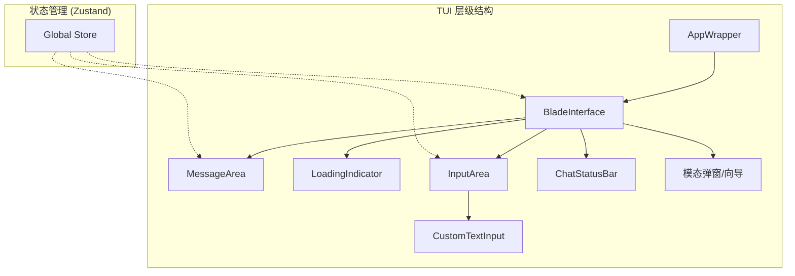
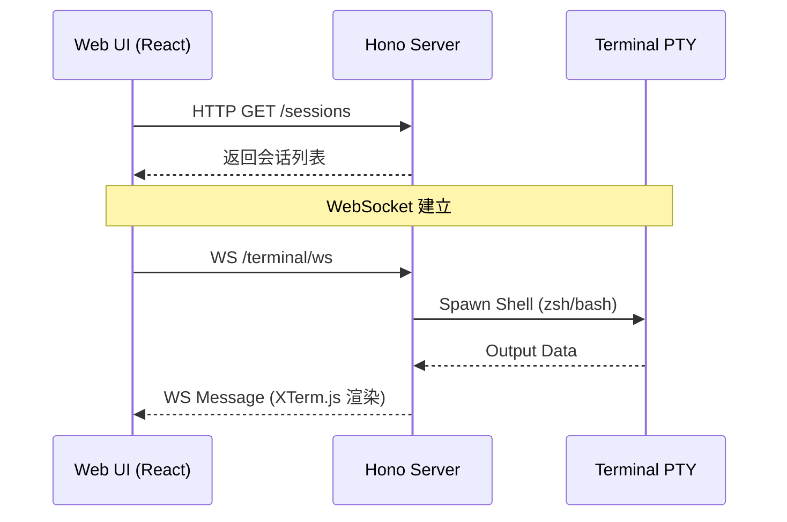
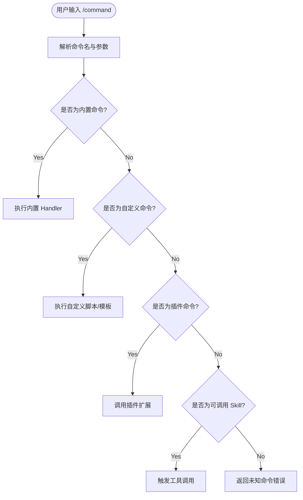
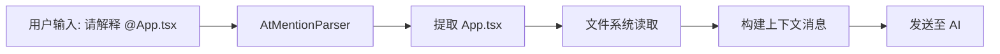

# 交互界面与命令系统指南

## 目录
1. [模块概览](#模块概览)
2. [TUI 终端界面：Ink 组件架构与交互](#tui-终端界面ink-组件架构与交互)
   - [组件层级与状态管理](#组件层级与状态管理)
   - [响应式布局与快捷键](#响应式布局与快捷键)
3. [Web UI 界面：Hono 服务端与实时通信](#web-ui-界面hono-服务端与实时通信)
   - [服务端架构](#服务端架构)
   - [终端 WebSocket 通信](#终端-websocket-通信)
4. [斜杠命令 (Slash Commands) 系统](#斜杠命令-slash-commands-系统)
   - [命令分发流程](#命令分发流程)
   - [常用内置命令](#常用内置命令)
5. [上下文提及 (@-mentions) 机制](#上下文提及--mentions-机制)
   - [解析逻辑](#解析逻辑)
   - [上下文注入](#上下文注入)
6. [主题与样式自定义](#主题与样式自定义)
   - [ThemeManager 架构](#thememanager-架构)
   - [预设主题](#预设主题)
7. [核心组件与文件参考](#核心组件与文件参考)

## 模块概览
Blade 提供了一套完整的交互系统，旨在为开发者提供高效、流畅的 AI 协作体验。本模块涵盖了从底层的 TUI（终端用户界面）渲染，到 Web 端的 API 服务，以及核心的命令解析与上下文引用机制。

**统计信息：**
- **文件总数**：约 110 个源文件（分布在 `ui/`, `server/`, `slash-commands/` 等目录）
- **核心子模块**：
  - `ui/`：基于 Ink 的终端组件库，负责 TUI 渲染与交互逻辑。
  - `server/`：基于 Hono 的 Web 服务端，提供 RESTful API 与 WebSocket 支持。
  - `slash-commands/`：斜杠命令注册、解析与执行系统。
  - `prompts/processors/`：包含 `@-mentions` 等提示词预处理器。
  - `ui/themes/`：主题管理与颜色配置。

## TUI 终端界面：Ink 组件架构与交互
Blade 的 TUI 界面是基于 [Ink](https://github.com/vadimdemedes/ink) 构建的，它允许使用 React 组件来描述终端界面。这种架构使得复杂的终端 UI 能够像现代 Web 应用一样进行组件化开发和状态管理。

### 组件层级与状态管理
`BladeInterface` 是 TUI 的核心容器，它协调了消息显示、输入区域、加载状态和各种模态对话框。

**设计要点：**
- **AppWrapper**：负责应用启动时的环境初始化，包括主题加载、Subagents 预载、Hooks 系统初始化等。
- **BladeInterface**：主界面控制器，通过 `useCommandHandler` 处理用户输入，并通过 `FocusId` 管理终端焦点。
- **InputArea**：集成了 `CustomTextInput`，支持多行编辑、历史记录导航、以及特殊的“粘贴标记”系统（处理大段文本和图片）。

### 响应式布局与快捷键
Blade 实现了响应式终端布局，能够根据终端窗口的 `width` 和 `height` 动态调整渲染内容。

**常用快捷键：**
- `Enter`：发送消息。
- `Ctrl + C`：中止当前任务或退出。
- `Ctrl + L`：清空屏幕（`/clear`）。
- `Up / Down`：浏览历史命令。
- `Tab`：触发斜杠命令补全。
- `Shift + Tab`：循环切换权限模式（DEFAULT -> AUTO_EDIT -> PLAN -> SPEC）。
- `?`：打开/关闭快捷键帮助面板。

**Section sources**:
- [App.tsx](file:///Users/bytedance/Documents/GitHub/Blade/packages/cli/src/ui/App.tsx)
- [BladeInterface.tsx](file:///Users/bytedance/Documents/GitHub/Blade/packages/cli/src/ui/components/BladeInterface.tsx)
- [InputArea.tsx](file:///Users/bytedance/Documents/GitHub/Blade/packages/cli/src/ui/components/InputArea.tsx)

## Web UI 界面：Hono 服务端与实时通信
为了提供更丰富的交互体验，Blade 内置了一个基于 [Hono](https://hono.dev/) 的 Web 服务端，支持通过浏览器进行对话和管理。

### 服务端架构
服务端采用了模块化的路由设计，能够同时运行在 Bun 和 Node.js 环境中（优先推荐 Bun 以获得更好的性能和 PTY 支持）。

### 终端 WebSocket 通信
Web UI 中的终端模拟器通过 WebSocket 与服务端通信。服务端使用 `node-pty` 或 `bun-pty` 创建伪终端进程，并将输出实时流式传输到前端。

**核心逻辑：**
- `setupNodeWebSocket`：在 Node.js 环境下处理升级请求并管理 PTY 生命周期。
- `terminalWebSocket`：在 Bun 环境下利用高性能的内置 WebSocket 支持。

**Section sources**:
- [server.ts](file:///Users/bytedance/Documents/GitHub/Blade/packages/cli/src/server/server.ts)
- [terminal.ts](file:///Users/bytedance/Documents/GitHub/Blade/packages/cli/src/server/routes/terminal.ts)

## 斜杠命令 (Slash Commands) 系统
斜杠命令是用户与 Blade 交互的高级方式，支持内置命令、自定义命令、插件命令以及可直接调用的 Skill。

### 命令分发流程
当用户输入以 `/` 开头的内容时，`executeSlashCommand` 会按照优先级顺序查找并执行对应的处理器。

### 常用内置命令
| 命令 | 别名 | 说明 |
| :--- | :--- | :--- |
| `/help` | `/h` | 显示所有可用命令及用法 |
| `/init` | - | 初始化项目，生成 `BLADE.md` |
| `/git` | - | AI 辅助的 Git 操作（status, diff, review 等） |
| `/clear` | `/cls` | 清除当前对话历史和屏幕 |
| `/compact` | - | 压缩上下文，节省 Token |
| `/model` | - | 切换或配置 AI 模型 |
| `/theme` | - | 切换 UI 主题 |

**Section sources**:
- [slash-commands/index.ts](file:///Users/bytedance/Documents/GitHub/Blade/packages/cli/src/slash-commands/index.ts)
- [builtinCommands.ts](file:///Users/bytedance/Documents/GitHub/Blade/packages/cli/src/slash-commands/builtinCommands.ts)

## 上下文提及 (@-mentions) 机制
`@-mentions` 允许用户在对话中直接引用文件、目录或代码片段，Blade 会自动解析这些引用并将相关内容注入到提示词中。

### 解析逻辑
`AtMentionParser` 使用正则表达式识别两种格式：
1. **裸路径**：`@src/main.ts`
2. **带引号路径**：`@"path with spaces.ts"`

它还支持行号范围后缀，例如 `@file.ts#L10-20`。

### 上下文注入
在命令执行阶段，`useCommandHandler` 会调用解析器提取所有提及的文件。这些文件的内容会被读取并作为“上下文快照”附加到用户消息中，确保 AI 能够准确理解用户引用的代码背景。

**Section sources**:
- [AtMentionParser.ts](file:///Users/bytedance/Documents/GitHub/Blade/packages/cli/src/prompts/processors/AtMentionParser.ts)
- [useCommandHandler.ts](file:///Users/bytedance/Documents/GitHub/Blade/packages/cli/src/ui/hooks/useCommandHandler.ts)

## 主题与样式自定义
Blade 拥有强大的主题系统，支持多种配色方案，能够满足不同用户的审美需求和环境适应性（如明暗模式）。

### ThemeManager 架构
`ThemeManager` 负责维护所有可用主题，并提供全局的主题切换能力。它定义了一套完整的 `BaseColors` 规范，涵盖了背景、文本、边框、语法高亮等各个维度。

### 预设主题
Blade 内置了超过 10 种流行主题，包括：
- **经典暗色**：`ayu-dark`, `dracula`, `monokai`, `one-dark`, `tokyo-night`
- **明亮模式**：`github`, `solarized-light`
- **特色风格**：`nord` (极简), `gruvbox` (复古), `catppuccin` (柔和), `kanagawa` (和风)

用户可以通过 `/theme` 命令或在 TUI 中按 `T` 键快速打开主题选择器。

**Section sources**:
- [ThemeManager.ts](file:///Users/bytedance/Documents/GitHub/Blade/packages/cli/src/ui/themes/ThemeManager.ts)
- [presets.ts](file:///Users/bytedance/Documents/GitHub/Blade/packages/cli/src/ui/themes/presets.ts)

## 核心组件与文件参考
以下是本模块涉及的关键源文件，建议在深入研究时优先阅读：

- **UI 入口与核心**：
  - [packages/cli/src/ui/App.tsx](file:///Users/bytedance/Documents/GitHub/Blade/packages/cli/src/ui/App.tsx)：UI 初始化与包装器。
  - [packages/cli/src/ui/components/BladeInterface.tsx](file:///Users/bytedance/Documents/GitHub/Blade/packages/cli/src/ui/components/BladeInterface.tsx)：主界面逻辑协调。
  - [packages/cli/src/ui/hooks/useCommandHandler.ts](file:///Users/bytedance/Documents/GitHub/Blade/packages/cli/src/ui/hooks/useCommandHandler.ts)：命令执行生命周期管理。

- **Web 服务**：
  - [packages/cli/src/server/server.ts](file:///Users/bytedance/Documents/GitHub/Blade/packages/cli/src/server/server.ts)：Hono 服务端主文件。
  - [packages/cli/src/server/routes/terminal.ts](file:///Users/bytedance/Documents/GitHub/Blade/packages/cli/src/server/routes/terminal.ts)：终端 PTY 与 WebSocket 路由。

- **命令与解析**：
  - [packages/cli/src/slash-commands/index.ts](file:///Users/bytedance/Documents/GitHub/Blade/packages/cli/src/slash-commands/index.ts)：斜杠命令注册中心。
  - [packages/cli/src/prompts/processors/AtMentionParser.ts](file:///Users/bytedance/Documents/GitHub/Blade/packages/cli/src/prompts/processors/AtMentionParser.ts)：`@` 提及语法解析。

- **主题系统**：
  - [packages/cli/src/ui/themes/ThemeManager.ts](file:///Users/bytedance/Documents/GitHub/Blade/packages/cli/src/ui/themes/ThemeManager.ts)：主题管理单例。
  - [packages/cli/src/ui/themes/presets.ts](file:///Users/bytedance/Documents/GitHub/Blade/packages/cli/src/ui/themes/presets.ts)：预设主题定义。
