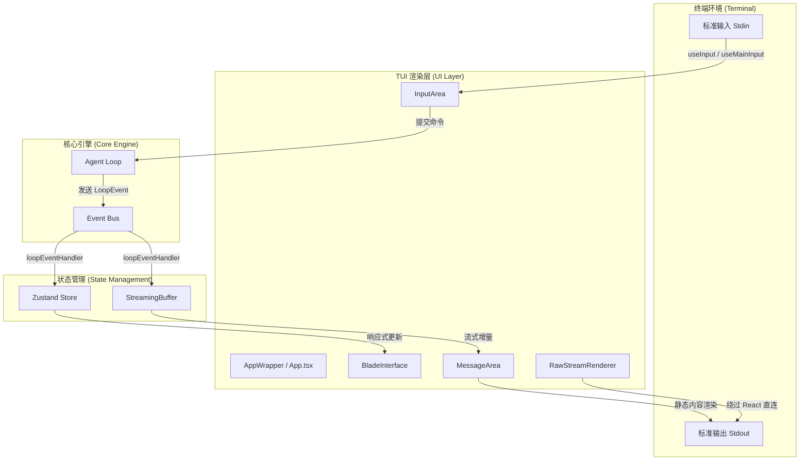
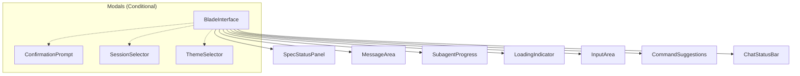
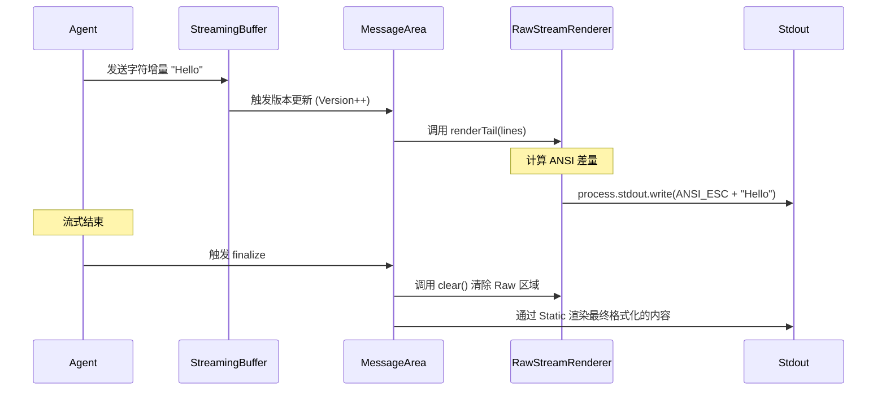
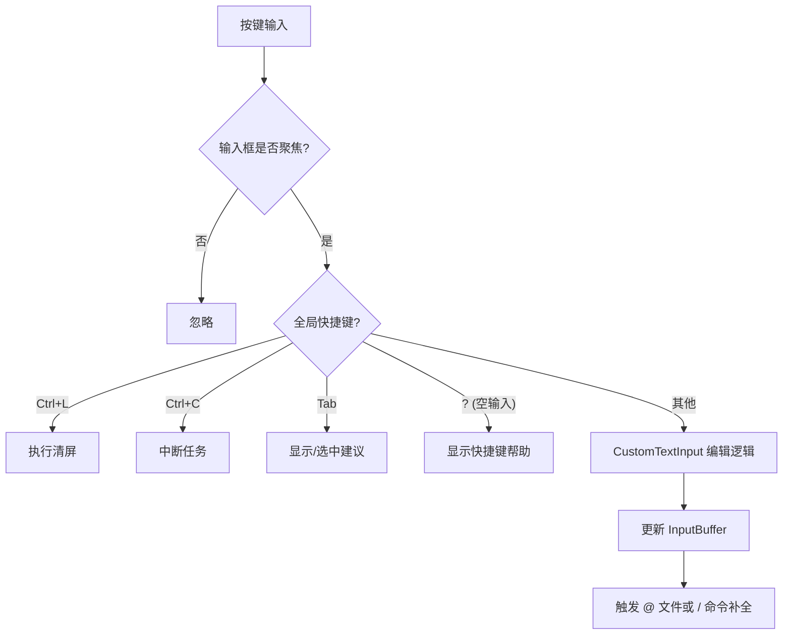
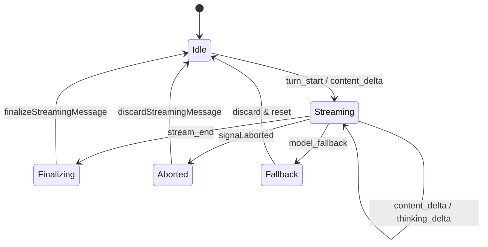

# TUI 终端界面架构

## 目录

1. [模块概览](#模块概览)
2. [引言](#引言)
3. [核心架构总览](#核心架构总览)
4. [核心布局与 App 容器](#核心布局与-app-容器)
5. [消息渲染系统](#消息渲染系统)
6. [流式渲染优化技术](#流式渲染优化技术)
7. [交互与输入处理逻辑](#交互与输入处理逻辑)
8. [状态同步与事件处理](#状态同步与事件处理)
9. [自定义渲染器实现](#自定义渲染器实现)
10. [性能考量与最佳实践](#性能考量与最佳实践)
11. [文件参考](#文件参考)

## 模块概览

在对 `packages/cli/src/ui/` 目录进行系统性探索后，该模块的规模与结构如下：

*   **总文件数**：共发现 75 个源文件（`.ts`, `.tsx`）。
*   **子模块分布**：
    *   `components/` (42 个文件)：包含所有 UI 渲染组件，如 `MessageArea`, `InputArea` 以及各类 Markdown 渲染器（`CodeHighlighter`, `DiffRenderer` 等）。
    *   `hooks/` (15 个文件)：封装了终端特有的交互逻辑，如输入缓冲区管理、终端尺寸监听、命令历史记录等。
    *   `utils/` (13 个文件)：提供 Markdown 解析、流式输出优化（`rawStreamRenderer`）、事件处理转换等工具。
    *   `themes/` (5 个文件)：管理终端配色方案与主题预设。
*   **覆盖范围**：本章节将深度解析上述所有子模块。核心入口点 `App.tsx` 和 `BladeInterface.tsx` 将作为架构分析的起点，重点讨论流式渲染优化、复杂交互 Hooks 以及状态同步机制。

## 引言

Blade 的 TUI（终端用户界面）是其用户交互的核心。不同于传统的命令行工具，Blade 采用了基于 **Ink** 的响应式架构，在终端内运行完整的 React 组件树。这使得 Blade 能够提供类似现代 Web 应用的丰富交互体验，包括实时流式文本、语法高亮、交互式向导、多模态预览（图片粘贴）以及复杂的布局管理。

本章节旨在帮助开发者深入理解 Blade TUI 的底层实现，涵盖从 React 在终端中的渲染原理，到为了应对大模型流式输出而设计的极致性能优化手段。无论你是想扩展新的 UI 组件，还是想优化终端的交互流畅度，这里都提供了详尽的理论支撑与代码实践。

## 核心架构总览

Blade TUI 的架构建立在 React 的声明式编程模型之上，通过 Ink 将虚拟 DOM 映射为终端的 ANSI 转义序列。

### 架构分层

下图展示了 TUI 系统与底层 Agent 及终端环境的关系：



**架构解析**：
该架构的核心在于**解耦**。Agent 引擎通过事件总线发送 `LoopEvent`，而 UI 层通过 `loopEventHandler` 将这些事件转化为 UI 状态。为了解决 React 在处理高频流式文本时的性能瓶颈，Blade 引入了 `RawStreamRenderer`，它能够绕过 React 的协调（Reconciliation）过程，直接将文本增量写入 `stdout`。

**数据流向**：
1.  **下行流**：Agent 产生内容增量 -> `loopEventHandler` 更新 `StreamingBuffer` -> `MessageArea` 检测到变化 -> 调用 `RawStreamRenderer` 实时更新终端屏幕。
2.  **上行流**：用户在终端输入按键 -> `useMainInput` 捕获并维护 `InputBuffer` -> 用户按下 Enter -> 调用 `executeCommand` 将请求发送回 Agent 引擎。

**Diagram sources**: 
- [App.tsx](file:///Users/bytedance/Documents/GitHub/Blade/packages/cli/src/ui/App.tsx)
- [loopEventHandler.ts](file:///Users/bytedance/Documents/GitHub/Blade/packages/cli/src/ui/utils/loopEventHandler.ts)
- [rawStreamRenderer.ts](file:///Users/bytedance/Documents/GitHub/Blade/packages/cli/src/ui/utils/rawStreamRenderer.ts)

## 核心布局与 App 容器

`App.tsx` 是 UI 的顶层入口，负责环境初始化；而 `BladeInterface.tsx` 则定义了主界面的骨架。

### 应用初始化流程

在 `AppWrapper` 组件中，Blade 执行了一系列关键的异步初始化操作，确保在显示主界面之前，所有子系统（插件、技能、主题、Hook）均已就绪。

```typescript
// packages/cli/src/ui/App.tsx

export const AppWrapper: React.FC<AppProps> = (props) => {
  const [isReady, setIsReady] = useState(false);

  const initializeApp = useMemoizedFn(async () => {
    // 1. 合并配置与 CLI 参数
    const baseConfig = getState().config.config ?? DEFAULT_CONFIG;
    const mergedConfig = mergeRuntimeConfig(baseConfig, props);
    
    // 2. 加载主题
    themeManager.setTheme(mergedConfig.theme);

    // 3. 预加载子系统
    await subagentRegistry.loadFromStandardLocations();
    await HookManager.getInstance().loadConfig(mergedConfig.hooks || {});
    await discoverSkills();
    await initializeCustomCommands(getCwd());
    
    // 4. 初始化插件
    const pluginRegistry = getPluginRegistry();
    await pluginRegistry.initialize(getCwd(), props.pluginDir || []);
    await integrateAllPlugins();

    setIsReady(true);
  });

  // ... 渲染逻辑
};
```

### 主界面布局管理

`BladeInterface` 采用了经典的垂直布局，由消息区域、输入区域和状态栏组成。它还承担了**焦点管理**的职责，确保在弹出模态框（如会话选择器、主题选择器）时，键盘输入能够正确路由。



**布局细节**：
- **响应式宽度**：使用 `useTerminalWidth` 动态获取终端宽度，并传递给渲染器进行文本折行。
- **焦点切换**：通过 `FocusId` 标识当前活跃区域。例如，当 `activeModal` 为 `sessionSelector` 时，焦点会自动从 `MAIN_INPUT` 转移。
- **性能保护**：当显示阻塞式弹窗时，下方的 `LoadingIndicator` 会暂停动画，减少不必要的重渲染开销。

**Section sources**:
- [App.tsx](file:///Users/bytedance/Documents/GitHub/Blade/packages/cli/src/ui/App.tsx)
- [BladeInterface.tsx](file:///Users/bytedance/Documents/GitHub/Blade/packages/cli/src/ui/components/BladeInterface.tsx)

## 消息渲染系统

消息渲染是 TUI 中最复杂的部分，它需要处理 Markdown、代码块、Diff 以及 LLM 的思考过程。

### 静态与动态渲染策略

为了保证长会话的流畅度，`MessageArea` 采用了 **Static 渲染策略**。Ink 的 `<Static>` 组件会将其子元素渲染一次后缓存，后续即使 `MessageArea` 重新渲染，`<Static>` 内部已完成的消息也不会被重新计算。

```typescript
// packages/cli/src/ui/components/MessageArea.tsx

export const MessageArea: React.FC = React.memo(() => {
  // ... 状态获取
  return (
    <Box flexDirection="column" paddingX={2}>
      <Static key={clearCount} items={staticItems}>
        {(item) => item}
      </Static>

      {/* 正在思考的内容 */}
      {currentThinkingContent && (
        <ThinkingBlock content={currentThinkingContent} />
      )}

      {/* 正在流式输出的中间块（尚未完全结束） */}
      {streamingStaticItems.length > 0 && (
        <Static key={`streaming-${clearCount}`} items={streamingStaticItems}>
          {(item) => item}
        </Static>
      )}
      
      {/* 最后的流式尾部由 RawStreamRenderer 处理，不出现在此处 */}
    </Box>
  );
});
```

### Markdown 解析与块渲染

`MessageRenderer` 是渲染的核心，它调用 `parseMarkdown` 将原始字符串切分为 `ParsedBlock` 数组。每个块类型对应一个专门的渲染组件：
- `code` -> `CodeHighlighter`
- `diff` -> `DiffRenderer`
- `table` -> `TableRenderer`
- `blockquote` -> `BlockquoteRenderer`

这种基于块的渲染方式不仅结构清晰，还允许我们在流式输出过程中，一旦某个块解析完成（如代码块闭合），就立即将其移入 `Static` 区域。

**Section sources**:
- [MessageArea.tsx](file:///Users/bytedance/Documents/GitHub/Blade/packages/cli/src/ui/components/MessageArea.tsx)
- [MessageRenderer.tsx](file:///Users/bytedance/Documents/GitHub/Blade/packages/cli/src/ui/components/MessageRenderer.tsx)
- [markdownParser.ts](file:///Users/bytedance/Documents/GitHub/Blade/packages/cli/src/ui/utils/markdownParser.ts)

## 流式渲染优化技术

这是 Blade TUI 架构中最具技术含量的部分。处理 LLM 的流式输出时，如果每收到一个字符都触发 React 重新渲染，终端会出现明显的闪烁和卡顿。

### RawStreamRenderer：绕过 React 的直连技术

`RawStreamRenderer` 的核心思想是：**React 负责结构，Raw 负责增量**。



**实现原理**：
1.  **光标管理**：`RawStreamRenderer` 记录了它在终端中占用的行数。每次更新前，它会发送 `CURSOR_UP(n)` 将光标移回起始位置。
2.  **差量对比**：它维护了上一帧渲染的内容，只有变化的行才会执行 `ERASE_LINE` 并重新写入。
3.  **模式感知**：它能识别当前是否处于代码块或 Diff 模式，并手动绘制边框（如 `╭─` 和 `│`），从而在没有语法高亮的情况下也能提供良好的视觉反馈。

### 增量缓冲区 (StreamingBuffer)

为了防止 UI 被过快的 Token 流淹没，`useStreamingBuffer` 实现了批处理机制。它不会立即将每个字符同步到 Store，而是将其暂存在内部缓冲区中，并以较低的频率（或在特定事件触发时）进行 flush。

**Section sources**:
- [rawStreamRenderer.ts](file:///Users/bytedance/Documents/GitHub/Blade/packages/cli/src/ui/utils/rawStreamRenderer.ts)
- [useStreamingBuffer.ts](file:///Users/bytedance/Documents/GitHub/Blade/packages/cli/src/ui/hooks/useStreamingBuffer.ts)
- [markdownIncremental.ts](file:///Users/bytedance/Documents/GitHub/Blade/packages/cli/src/ui/utils/markdownIncremental.ts)

## 交互与输入处理逻辑

Blade 的输入框不仅支持文本编辑，还集成了复杂的快捷键、命令补全和多模态输入。

### 输入处理流水线

用户在终端的每一次按键都会经过 `useMainInput` 的过滤与处理：



### 粘贴标记系统 (Paste Markers)

由于终端模拟器在处理大段文本或图片粘贴时存在性能和协议限制，Blade 引入了**粘贴标记系统**。

当用户粘贴超过 500 字符的文本或图片时：
1.  `InputArea` 拦截原始数据。
2.  将数据存入内存中的 `pasteMap`。
3.  在输入框中仅显示一个轻量级的标记（如 `␞PASTE:1:[Image #1]␟`）。
4.  用户提交时，`resolveInput` 函数会扫描这些标记，并将其替换回原始文本或构建多模态的消息部件（Message Parts）。

这种机制极大地提升了输入框在处理复杂内容时的响应速度。

**Section sources**:
- [useMainInput.ts](file:///Users/bytedance/Documents/GitHub/Blade/packages/cli/src/ui/hooks/useMainInput.ts)
- [InputArea.tsx](file:///Users/bytedance/Documents/GitHub/Blade/packages/cli/src/ui/components/InputArea.tsx)
- [useInputBuffer.ts](file:///Users/bytedance/Documents/GitHub/Blade/packages/cli/src/ui/hooks/useInputBuffer.ts)

## 状态同步与事件处理

UI 层与 Agent 层的通信主要通过 `loopEventHandler` 实现。它充当了协议转换器的角色，将底层的 `LoopEvent` 映射为 UI 状态的改变。

### 事件处理状态机

`loopEventHandler` 内部维护了一个 "per-turn" 的闭包状态，确保事件处理的幂等性。



**关键事件说明**：
- **`content_delta`**：最频繁的事件，直接推入 `streamingBuffer`。
- **`tool_start` / `tool_result`**：触发 `addToolMessage`，在 UI 中渲染工具调用的状态（如“正在搜索...”或搜索结果摘要）。
- **`model_fallback`**：当模型无法响应需要切换时，立即清理缓冲区，防止旧的残留内容出现在新模型的输出中。
- **`stream_end`**：这是原子提交点。它会 `drain` 缓冲区中的所有剩余内容，并调用 `finalizeStreamingMessage` 将其永久存入消息历史。

**Section sources**:
- [loopEventHandler.ts](file:///Users/bytedance/Documents/GitHub/Blade/packages/cli/src/ui/utils/loopEventHandler.ts)
- [vanilla.ts (Store)](file:///Users/bytedance/Documents/GitHub/Blade/packages/cli/src/store/vanilla.ts)

## 自定义渲染器实现

Blade 针对特定的内容类型实现了高度定制化的渲染器，以提升终端的可读性。

### DiffRenderer：终端中的代码差异对比

`DiffRenderer` 解析特定的 JSON 格式补丁，并利用 `chalk` 渲染出带有颜色标识的差异块。

> **提示**：为了保证在流式输出过程中也能预览 Diff，`rawStreamRenderer` 同样集成了简化的 Diff 渲染逻辑，能够识别 `+` 和 `-` 前缀并实时着色。

### CodeHighlighter：语法高亮

基于 `prismjs` 或类似的轻量级解析器，`CodeHighlighter` 会为代码块添加边框、语言标签以及语法高亮。它支持自动换行，并确保在窄终端下代码依然可读。

### ThinkingBlock：展示思考过程

针对支持“思考”链的模型（如 DeepSeek-R1 或 Claude 3.7），`ThinkingBlock` 提供了一个可折叠的区域。它使用特殊的调色板（通常是暗色或斜体）来区分模型内部推理与最终回答。

**Section sources**:
- [DiffRenderer.tsx](file:///Users/bytedance/Documents/GitHub/Blade/packages/cli/src/ui/components/DiffRenderer.tsx)
- [CodeHighlighter.tsx](file:///Users/bytedance/Documents/GitHub/Blade/packages/cli/src/ui/components/CodeHighlighter.tsx)
- [ThinkingBlock.tsx](file:///Users/bytedance/Documents/GitHub/Blade/packages/cli/src/ui/components/ThinkingBlock.tsx)

## 性能考量与最佳实践

在开发 TUI 组件时，应遵循以下原则以保持界面流畅：

1.  **避免深层嵌套**：终端的渲染成本随 DOM 深度增加。尽量保持组件树扁平。
2.  **利用 React.memo**：由于终端 resize 或状态栏更新会触发频繁的重渲染，使用 `React.memo` 包裹大型组件（如 `MessageArea`）至关重要。
3.  **谨慎使用动画**：在终端中，动画（如 `LoadingIndicator`）实际上是通过高频擦除和重写实现的。在系统负载较高或进行大量磁盘 I/O 时，应考虑降低动画帧率或暂停动画。
4.  **Static 是你的好朋友**：对于任何一旦生成就不会改变的内容，务必放入 `<Static>` 组件中。

## 文件参考

本章节涉及的核心源文件如下：

*   **入口与布局**：
    *   [App.tsx](file:///Users/bytedance/Documents/GitHub/Blade/packages/cli/src/ui/App.tsx)：UI 顶层容器与初始化。
    *   [BladeInterface.tsx](file:///Users/bytedance/Documents/GitHub/Blade/packages/cli/src/ui/components/BladeInterface.tsx)：主界面布局与业务协调。
*   **渲染核心**：
    *   [MessageArea.tsx](file:///Users/bytedance/Documents/GitHub/Blade/packages/cli/src/ui/components/MessageArea.tsx)：消息流管理与 Static 渲染。
    *   [MessageRenderer.tsx](file:///Users/bytedance/Documents/GitHub/Blade/packages/cli/src/ui/components/MessageRenderer.tsx)：Markdown 渲染调度。
    *   [rawStreamRenderer.ts](file:///Users/bytedance/Documents/GitHub/Blade/packages/cli/src/ui/utils/rawStreamRenderer.ts)：高性能流式输出引擎。
*   **交互逻辑**：
    *   [useMainInput.ts](file:///Users/bytedance/Documents/GitHub/Blade/packages/cli/src/ui/hooks/useMainInput.ts)：主输入框键盘事件处理。
    *   [InputArea.tsx](file:///Users/bytedance/Documents/GitHub/Blade/packages/cli/src/ui/components/InputArea.tsx)：输入框 UI 与粘贴拦截。
    *   [useInputBuffer.ts](file:///Users/bytedance/Documents/GitHub/Blade/packages/cli/src/ui/hooks/useInputBuffer.ts)：输入状态与标记管理。
*   **状态与工具**：
    *   [loopEventHandler.ts](file:///Users/bytedance/Documents/GitHub/Blade/packages/cli/src/ui/utils/loopEventHandler.ts)：Agent 事件到 UI 的映射。
    *   [markdownParser.ts](file:///Users/bytedance/Documents/GitHub/Blade/packages/cli/src/ui/utils/markdownParser.ts)：Markdown 结构化解析器。
    *   [useStreamingBuffer.ts](file:///Users/bytedance/Documents/GitHub/Blade/packages/cli/src/ui/hooks/useStreamingBuffer.ts)：流式内容批处理 Hook。
