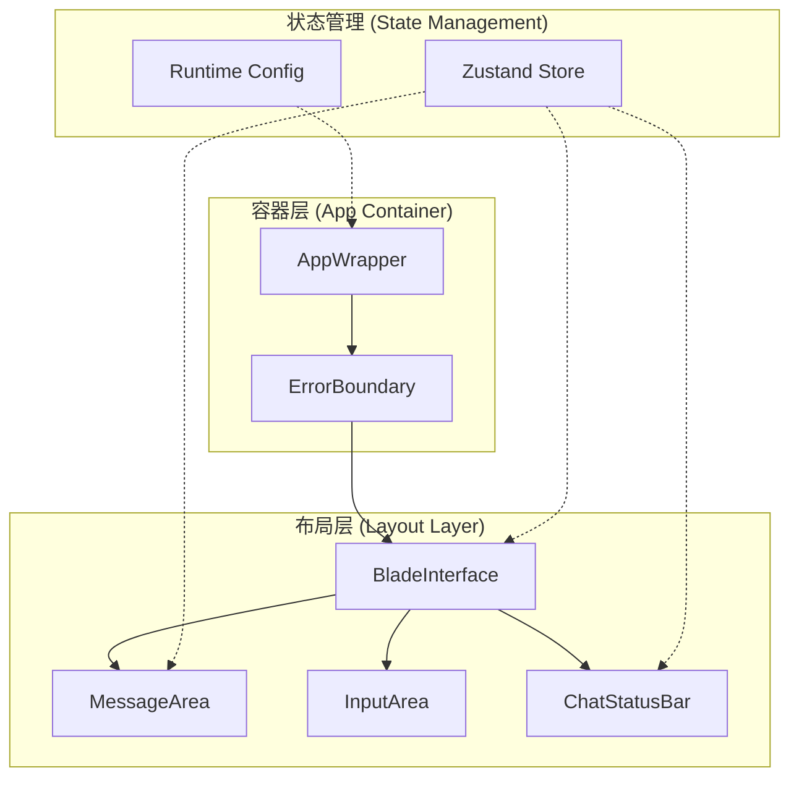
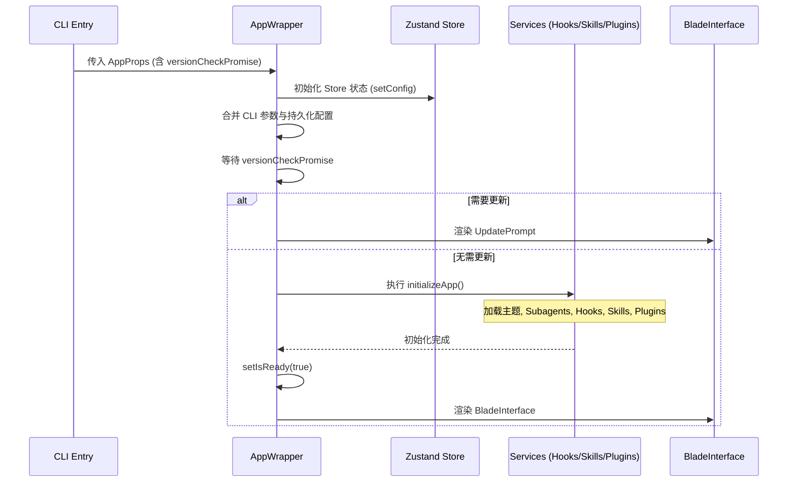
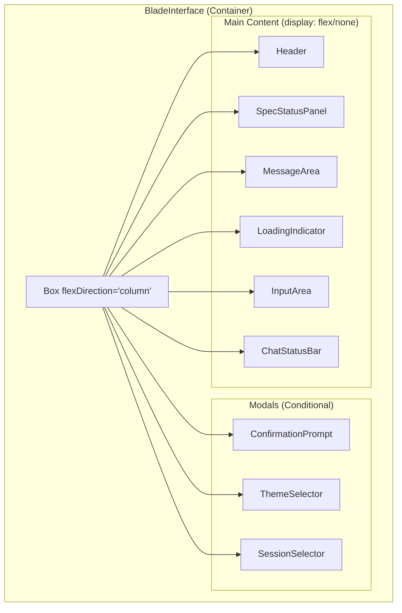
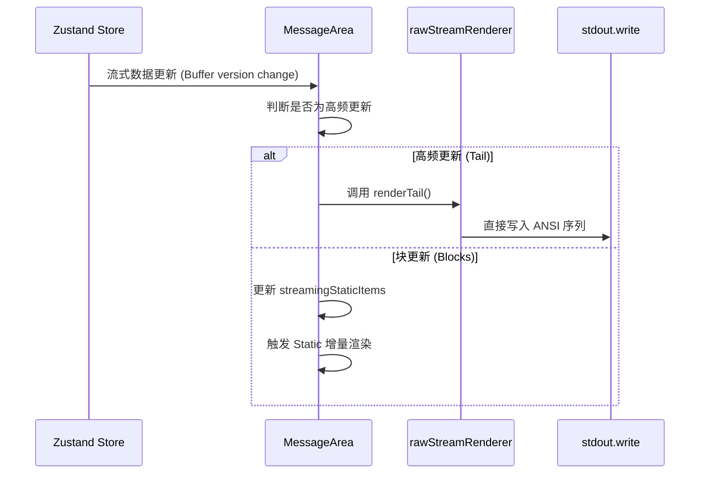

# 核心布局与 App 容器

## 目录
1. [模块概览](#模块概览)
2. [介绍](#介绍)
3. [架构概览](#架构概览)
4. [启动与初始化流程](#启动与初始化流程)
5. [核心布局与组件结构](#核心布局与组件结构)
6. [终端响应式布局机制](#终端响应式布局机制)
7. [高性能渲染策略](#高性能渲染策略)
8. [状态监控与实时反馈](#状态监控与实时反馈)
9. [错误处理与鲁棒性设计](#错误处理与鲁棒性设计)
10. [核心代码示例](#核心代码示例)
11. [文件参考](#文件参考)

## 模块概览

本模块负责 Blade TUI（终端用户界面）的顶层架构、布局管理以及应用生命周期协调。作为基于 [Ink](https://github.com/vadimdemedes/ink) 构建的 React 应用，它将 Web 开发中的组件化思想引入到了命令行工具中，实现了极其丰富且响应式的交互体验。

**统计信息**：
- **总文件数**：75 个源文件
- **核心目录**：
  - `components/`: 包含所有 UI 组件，如 `BladeInterface`、`MessageArea`、`ChatStatusBar` 等。
  - `hooks/`: 提供终端特有的状态管理，如 `useTerminalWidth`、`useInputBuffer` 等。
  - `themes/`: 负责多主题管理与颜色预设。
  - `utils/`: 包含 Markdown 解析、错误处理、安全过滤等工具函数。

**覆盖范围**：
本文将深入解析 `App.tsx` 和 `BladeInterface.tsx` 这两个核心入口文件，并详细探讨 `MessageArea`、`ChatStatusBar` 等关键布局组件。同时，我们将分析本模块如何通过 `Static` 组件和自定义 Raw Renderer 实现高性能的终端渲染。

## 介绍

Blade TUI 是一个复杂的终端应用程序，它不仅仅是一个简单的命令行交互界面，而是一个完整的、基于状态驱动的 React 应用。在传统的 CLI 开发中，开发者通常需要手动处理 ANSI 转义序列、计算终端宽度以及管理复杂的输入输出流。Blade 通过引入 **Ink** 库，将 React 的声明式编程模型带入终端，极大地降低了构建复杂交互界面的难度。

### 核心价值
1. **声明式 UI**：使用 JSX 描述界面，自动处理增量更新，避免了传统 CLI 中常见的闪烁问题。
2. **响应式布局**：利用 Flexbox 模型（通过 Ink 的 `Box` 组件）实现自动适配不同尺寸的终端窗口。
3. **全局状态驱动**：界面完全由 Zustand store 中的状态驱动，确保了逻辑与表现的解耦。
4. **高性能流式渲染**：针对大模型输出的流式文本进行了深度优化，确保在海量日志输出时依然保持流畅。

## 架构概览

Blade TUI 的架构可以分为三个层次：**容器层 (Container Layer)**、**布局层 (Layout Layer)** 和 **功能组件层 (Feature Components)**。

以下图表展示了 TUI 的核心组件关系及数据流向：



在容器层，`AppWrapper` 负责应用的启动、配置合并以及全局环境的初始化。它是整个 UI 生命周期的起点。`ErrorBoundary` 则作为坚实的后盾，捕获任何在渲染过程中发生的非预期错误，并以友好的方式展示给用户。

布局层由 `BladeInterface` 统领，它定义了界面的整体骨架。`MessageArea` 负责展示历史消息和流式输出，`InputArea` 处理用户输入，而 `ChatStatusBar` 则在底部提供实时的状态反馈。

**架构设计说明**：
- **单向数据流**：状态存储在 Zustand 中，组件通过 selectors 订阅状态变化。
- **关注点分离**：`App.tsx` 处理逻辑初始化，`BladeInterface.tsx` 处理视觉布局。
- **高性能设计**：通过 `Static` 组件将不可变的内容（如历史消息）与频繁变化的内容（如输入框、流式输出）分离，减少 React 的调和（Reconciliation）压力。

**Diagram sources**: 
- [App.tsx:L67-L298](file:///Users/bytedance/Documents/GitHub/Blade/packages/cli/src/ui/App.tsx)
- [BladeInterface.tsx:L71-L716](file:///Users/bytedance/Documents/GitHub/Blade/packages/cli/src/ui/components/BladeInterface.tsx)

## 启动与初始化流程

应用的启动是一个多阶段的过程，涉及到配置加载、环境检查、插件集成以及版本验证。

### 生命周期阶段

1. **预初始化 (Pre-init)**：在 `blade.tsx` 中启动版本检查 Promise，并初始化基础 Logger。
2. **配置合并 (Config Merging)**：`AppWrapper` 读取持久化配置，并与当前 CLI 参数（如 `--debug`, `--theme`）合并生成 `RuntimeConfig`。
3. **环境准备 (Environment Prep)**：
   - 加载主题预设。
   - 发现并注册 Subagents。
   - 初始化 Hooks 系统和自定义命令。
   - 发现并加载 Skills 和 Plugins。
4. **版本检查 (Version Check)**：如果发现新版本，优先展示更新提示。
5. **挂载主界面 (Mounting)**：所有异步初始化完成后，将 `isReady` 设为 true，正式渲染 `BladeInterface`。

以下序列图详细描述了启动过程中的关键步骤：



在 `initializeApp` 函数中，Blade 采用了并发初始化的策略。虽然步骤较多，但大部分任务（如加载 Plugins 和发现 Skills）都是异步执行的，这保证了 TUI 的启动速度。特别值得注意的是 `HookManager` 的初始化，它会执行 `SessionStart` hooks，这允许开发者在应用启动时动态注入环境变量或执行特定的前置逻辑。

**Section sources**:
- [App.tsx:L73-L250](file:///Users/bytedance/Documents/GitHub/Blade/packages/cli/src/ui/App.tsx)

## 核心布局与组件结构

`BladeInterface` 是 TUI 的视觉核心，它利用 Ink 的 `Box` 组件构建了一个类似于 Flexbox 的布局系统。

### 布局划分
- **顶部 (Top)**：可选的 `SpecStatusPanel`，仅在 Spec 模式下显示，提供任务进度的宏观视角。
- **主体 (Main)**：`MessageArea`，占据了界面的大部分空间。它内部使用了 `Static` 组件来优化长列表的渲染。
- **反馈区 (Feedback)**：包含 `SubagentProgress` 和 `LoadingIndicator`，实时展示 Agent 的思考与工作状态。
- **输入区 (Input)**：`InputArea`，用户输入指令的地方。
- **底部 (Bottom)**：`ChatStatusBar`，显示当前模型、Git 分支、Token 消耗等元数据。

### 弹窗与覆盖层 (Modals & Overlays)
Blade 采用了一种“阻塞式弹窗”机制。当需要用户确认（如 `ConfirmationPrompt`）或进行配置选择（如 `ThemeSelector`）时，`BladeInterface` 会渲染一个覆盖层，并暂时隐藏主界面内容。

> **注意**：为了防止 `Static` 组件在切换弹窗时重复渲染导致界面混乱，Blade 使用了 `display={hasBlockingModal ? 'none' : 'flex'}` 而不是条件卸载组件。



这种布局结构确保了界面在不同状态下的整洁性。例如，当 Agent 正在执行复杂任务时，`LoadingIndicator` 会在输入框上方持续跳动，给予用户明确的视觉反馈。

**Section sources**:
- [BladeInterface.tsx:L629-L715](file:///Users/bytedance/Documents/GitHub/Blade/packages/cli/src/ui/components/BladeInterface.tsx)

## 终端响应式布局机制

在 Web 开发中，响应式布局通常依赖于 CSS 媒体查询。而在终端环境中，我们需要通过监听 `stdout` 的 `resize` 事件来手动处理布局变化。

### 动态尺寸计算
Blade 提供了 `useTerminalWidth` 和 `useTerminalHeight` 两个自定义 Hooks。它们通过监听 `stdout` 的变化，并结合防抖（Debounce）处理，为上层组件提供实时的终端尺寸。

```typescript
// useTerminalHeight.ts 示例
export function useTerminalHeight(debounceMs: number = 200): number {
  const { stdout } = useStdout();
  const [height, setHeight] = useState(stdout.rows || 24);

  useEffect(() => {
    const updateHeight = debounce(() => {
      setHeight(stdout.rows || 24);
    }, debounceMs);

    stdout.on('resize', updateHeight);
    return () => stdout.off('resize', updateHeight);
  }, [stdout]);

  return height;
}
```

### 布局适配策略
1. **自动折行**：在渲染 Markdown 或普通文本时，`MessageRenderer` 会根据 `terminalWidth` 自动计算文本的折行点。
2. **高度自适应**：`MessageArea` 会根据 `terminalHeight` 决定显示多少历史消息，并在必要时触发“折叠”逻辑（Collapse）。
3. **输入框宽度**：`InputArea` 始终占据 100% 的宽度，但在内容过长时会进行内部滚动。

**Section sources**:
- [useTerminalHeight.ts:L12-L35](file:///Users/bytedance/Documents/GitHub/Blade/packages/cli/src/ui/hooks/useTerminalHeight.ts)
- [MessageArea.tsx:L20-L21](file:///Users/bytedance/Documents/GitHub/Blade/packages/cli/src/ui/components/MessageArea.tsx)

## 高性能渲染策略

在终端中渲染大量文本（尤其是带有颜色和样式的流式输出）是非常昂贵的。如果每次状态更新都重新渲染整个 React 树，会导致明显的卡顿和闪烁。Blade 采用了两项核心技术来解决这个问题。

### 1. Ink `Static` 组件
`Static` 组件是 Ink 提供的一种特殊组件，用于渲染那些一旦渲染就不会再改变的内容。在 `MessageArea` 中，所有的历史消息都被包裹在 `Static` 中。当新消息产生时，它会被添加到 `Static` 的列表中，而旧消息则不会被 React 重新处理。

### 2. 自定义 Raw Stream Renderer
对于极高频率更新的流式输出（如 Agent 的思考过程或代码生成），即使是 `Static` 组件也可能显得力不从心。Blade 引入了 `rawStreamRenderer`，它直接通过 `stdout.write` 向终端写入 ANSI 序列，完全绕过了 React 的调和过程。



这种“混合渲染”模式是 Blade 能够在低性能环境下依然保持极高流畅度的关键。`MessageArea` 会实时监控流式缓冲区的状态，将已经稳定的“块”移入 `Static` 渲染，而将正在变动的“尾部”交给 Raw Renderer 处理。

**Section sources**:
- [MessageArea.tsx:L293-L322](file:///Users/bytedance/Documents/GitHub/Blade/packages/cli/src/ui/components/MessageArea.tsx)
- [rawStreamRenderer.ts](file:///Users/bytedance/Documents/GitHub/Blade/packages/cli/src/ui/utils/rawStreamRenderer.ts)

## 状态监控与实时反馈

一个优秀的 TUI 必须能够让用户随时掌握系统的运行状态。Blade 通过多个维度的监控组件实现了这一点。

### 状态栏 (ChatStatusBar)
位于界面最底部的状态栏是信息汇总中心。它展示了：
- **当前上下文**：显示当前使用的模型名及上下文窗口的剩余比例。
- **权限模式**：通过不同的颜色标识 `AUTO_EDIT`、`PLAN`、`SPEC` 等模式，并提示切换快捷键。
- **环境信息**：展示当前的 Git 分支，帮助开发者确认工作上下文。
- **快捷键指南**：当用户按下 `?` 时，状态栏会展开显示完整的快捷键矩阵。

### 任务面板 (TaskPanel)
在 `PLAN` 或 `SPEC` 模式下，Agent 会将复杂目标分解为多个子任务。`TaskPanel` 以极简的风格展示这些任务的进度：
- `[OK]`：已完成的任务，文字置灰。
- `>`：正在进行的任务，高亮显示。
- `-`：待处理的任务。

这种清晰的层次感有助于用户在长时间的自动化流程中保持对进度的把控。

**Section sources**:
- [ChatStatusBar.tsx:L27-L189](file:///Users/bytedance/Documents/GitHub/Blade/packages/cli/src/ui/components/ChatStatusBar.tsx)
- [TaskPanel.tsx:L16-L56](file:///Users/bytedance/Documents/GitHub/Blade/packages/cli/src/ui/components/TaskPanel.tsx)

## 错误处理与鲁棒性设计

终端应用的错误处理往往比 Web 应用更具挑战性，因为一个未捕获的错误可能会导致终端状态混乱（如光标消失、背景颜色残留）。

### 错误边界 (ErrorBoundary)
Blade 在 `AppWrapper` 和 `BladeInterface` 级别都挂载了 `ErrorBoundary`。它能够捕获 React 组件树中的渲染错误，并渲染一个带有红色边框的错误面板，显示详细的堆栈信息。

```typescript
// ErrorBoundary.tsx 渲染逻辑
render() {
  if (this.state.hasError) {
    return (
      <Box flexDirection="column" padding={1} borderStyle="round" borderColor="red">
        <Text color="red">应用发生错误</Text>
        <Text color="red">{this.state.error?.message}</Text>
        <Text color="gray">错误详情:</Text>
        <Text color="gray">{this.state.error?.stack}</Text>
      </Box>
    );
  }
  return this.props.children;
}
```

### 优雅退出 (Graceful Shutdown)
在 `App.tsx` 中，应用注册了清理函数。当用户按下 `Ctrl+C` 退出或发生致命错误时，系统会自动执行以下操作：
1. 杀死所有后台 Shell 进程。
2. 断开所有 MCP 服务器连接。
3. 清理 Hooks 系统占用的资源。
4. 恢复终端光标和显示设置。

这种严谨的清理流程确保了 Blade 不会在用户的系统中留下“僵尸进程”或破坏终端配置。

**Section sources**:
- [ErrorBoundary.tsx:L45-L62](file:///Users/bytedance/Documents/GitHub/Blade/packages/cli/src/ui/components/ErrorBoundary.tsx)
- [App.tsx:L242-L247](file:///Users/bytedance/Documents/GitHub/Blade/packages/cli/src/ui/App.tsx)

## 核心代码示例

### 1. App 入口与初始化
展示了如何协调异步初始化与 React 渲染循环。

```typescript
export const AppWrapper: React.FC<AppProps> = (props) => {
  const [isReady, setIsReady] = useState(false);
  
  const initializeApp = useMemoizedFn(async () => {
    // 1. 加载主题
    themeManager.setTheme(props.theme || 'default');
    
    // 2. 发现技能与插件
    await discoverSkills();
    await getPluginRegistry().initialize(getCwd(), props.pluginDir || []);
    
    // 3. 标记就绪
    setIsReady(true);
  });

  useEffect(() => { initializeApp(); }, []);

  if (!isReady) return null; // 防止初始化前的闪烁

  return (
    <ErrorBoundary>
      <BladeInterface {...props} />
    </ErrorBoundary>
  );
};
```

### 2. 响应式状态栏实现
展示了如何使用 Zustand selectors 订阅全局状态并进行条件渲染。

```typescript
export const ChatStatusBar: React.FC = React.memo(() => {
  const permissionMode = usePermissionMode();
  const contextRemaining = useContextRemaining();
  
  return (
    <Box flexDirection="row" justifyContent="space-between" paddingX={2}>
      <Box>
        {permissionMode === PermissionMode.PLAN && (
          <Text color="cyan">‖ plan mode on</Text>
        )}
      </Box>
      <Box>
        <Text color={contextRemaining < 20 ? 'red' : 'gray'}>
          {contextRemaining}% Context
        </Text>
      </Box>
    </Box>
  );
});
```

## 文件参考

以下是本页面涉及的核心源文件：

- [packages/cli/src/ui/App.tsx](file:///Users/bytedance/Documents/GitHub/Blade/packages/cli/src/ui/App.tsx): TUI 顶层入口，负责生命周期与环境初始化。
- [packages/cli/src/ui/components/BladeInterface.tsx](file:///Users/bytedance/Documents/GitHub/Blade/packages/cli/src/ui/components/BladeInterface.tsx): 核心布局组件，定义了界面的整体结构。
- [packages/cli/src/ui/components/MessageArea.tsx](file:///Users/bytedance/Documents/GitHub/Blade/packages/cli/src/ui/components/MessageArea.tsx): 消息展示区域，包含高性能渲染逻辑。
- [packages/cli/src/ui/components/ChatStatusBar.tsx](file:///Users/bytedance/Documents/GitHub/Blade/packages/cli/src/ui/components/ChatStatusBar.tsx): 底部状态栏，提供实时反馈。
- [packages/cli/src/ui/components/TaskPanel.tsx](file:///Users/bytedance/Documents/GitHub/Blade/packages/cli/src/ui/components/TaskPanel.tsx): 任务进度展示面板。
- [packages/cli/src/ui/components/ErrorBoundary.tsx](file:///Users/bytedance/Documents/GitHub/Blade/packages/cli/src/ui/components/ErrorBoundary.tsx): 错误捕获与展示组件。
- [packages/cli/src/ui/hooks/useTerminalHeight.ts](file:///Users/bytedance/Documents/GitHub/Blade/packages/cli/src/ui/hooks/useTerminalHeight.ts): 终端高度监控 Hook。
- [packages/cli/src/ui/utils/rawStreamRenderer.ts](file:///Users/bytedance/Documents/GitHub/Blade/packages/cli/src/ui/utils/rawStreamRenderer.ts): 高性能流式输出渲染器。
