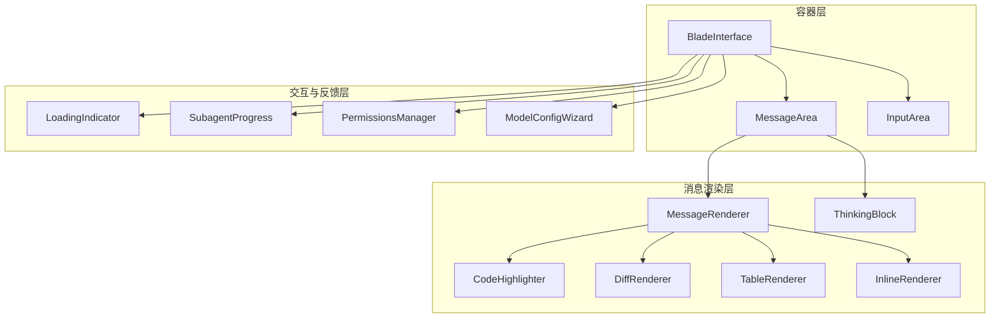
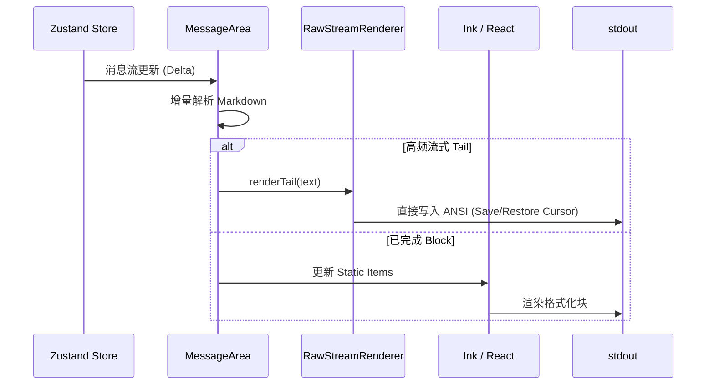
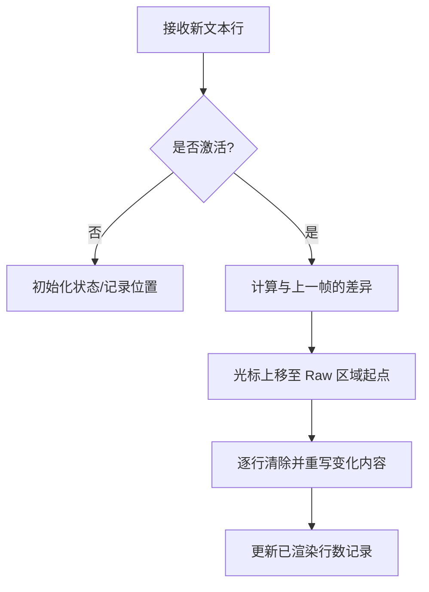
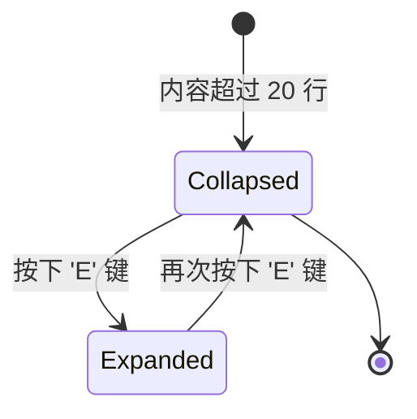
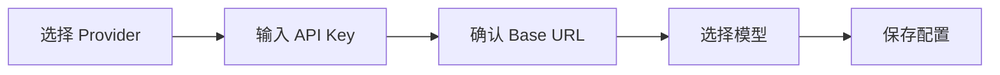

# 消息渲染与 UI 组件库

## 目录

1. [模块概览](#模块概览)
2. [引言](#引言)
3. [架构设计](#架构设计)
   - [组件层级结构](#组件层级结构)
   - [渲染管线](#渲染管线)
4. [核心渲染管线](#核心渲染管线)
   - [MessageArea：渲染编排器](#messagearea渲染编排器)
   - [RawStreamRenderer：直接输出优化](#rawstreamrenderer直接输出优化)
   - [Markdown 增量解析](#markdown-增量解析)
5. [富文本渲染器](#富文本渲染器)
   - [MessageRenderer：分发逻辑](#messagerenderer分发逻辑)
   - [CodeHighlighter：语法高亮与智能换行](#codehighlighter语法高亮与智能换行)
   - [DiffRenderer：变更对比与交互](#diffrenderer变更对比与交互)
   - [TableRenderer：响应式表格](#tablerenderer响应式表格)
   - [ThinkingBlock：思考链展示](#thinkingblock思考链展示)
6. [交互式管理组件](#交互式管理组件)
   - [PermissionsManager：权限管理](#permissionsmanager权限管理)
   - [SkillsManager：插件管理](#skillsmanager插件管理)
   - [ModelConfigWizard：配置向导](#modelconfigwizard配置向导)
7. [视觉反馈与状态](#视觉反馈与状态)
   - [LoadingIndicator：加载动画](#loadingindicator加载动画)
   - [SubagentProgress：任务进度](#subagentprogress任务进度)
8. [性能优化实践](#性能优化实践)
9. [核心组件参考](#核心组件参考)

## 模块概览

本模块负责 Blade TUI（终端用户界面）中所有视觉元素的呈现与交互逻辑。

- **文件总数**：41 个源文件 (`.tsx`, `.ts`)
- **核心目录**：`packages/cli/src/ui/components/`
- **子模块**：
  - `model-config/`：模型配置向导（7 个文件）
  - 核心组件：`MessageArea`, `MessageRenderer`, `CodeHighlighter` 等。
  - 工具类：`packages/cli/src/ui/utils/` 中的解析与渲染引擎。

本页面将深度覆盖消息渲染的全流程，以及复杂交互组件的实现原理。

## 引言

在终端（Terminal）中提供丰富且流畅的交互体验是 Blade 的核心挑战之一。传统的终端渲染往往受限于行式输出或频繁的全屏刷新导致的闪烁。Blade 的 UI 组件库通过结合 React (Ink) 的声明式编程与底层的 ANSI 转义序列直接控制，实现了一套高性能、支持流式输出、具备复杂 Markdown 渲染能力的 TUI 系统。

该模块不仅支持基础的文本显示，还集成了语法高亮、交互式 Diff 对比、响应式表格以及多级折叠的思考链展示，为用户提供了接近 Web 端的丰富体验，同时保持了终端的简洁与高效。

## 架构设计

Blade 的 UI 架构基于“状态驱动渲染”的原则，利用 Zustand 管理全局状态，并通过 Ink 将 React 组件映射为终端 ANSI 字符。

### 组件层级结构

下图展示了核心 UI 组件的嵌套与依赖关系。



**架构解析**：
`BladeInterface` 是 UI 的总入口，负责整体布局。`MessageArea` 充当消息流的容器，内部通过 `MessageRenderer` 处理每一条消息的渲染。`MessageRenderer` 进一步拆分为多个专用渲染器（如 `CodeHighlighter`, `TableRenderer`），实现了高度的模块化。交互式组件如 `PermissionsManager` 则在需要时以覆盖层或条件渲染的形式出现。

### 渲染管线

Blade 采用了“混合渲染管线”来平衡开发效率与运行性能。



**流程说明**：
当 AI 正在生成内容时，最高频更新的“末尾部分”（Tail）通过 `RawStreamRenderer` 绕过 React 虚拟 DOM 直接写入 `stdout`，避免了频繁的 React Reconciliation 带来的性能开销。一旦内容形成完整的 Markdown 块（如一个完整的段落或代码块），它就会被移入 `Static` 容器中，由 React/Ink 进行一次性、高质量的格式化渲染。

**Section sources**:
- [MessageArea.tsx](file:///Users/bytedance/Documents/GitHub/Blade/packages/cli/src/ui/components/MessageArea.tsx)
- [BladeInterface.tsx](file:///Users/bytedance/Documents/GitHub/Blade/packages/cli/src/ui/components/BladeInterface.tsx)

## 核心渲染管线

### MessageArea：渲染编排器

`MessageArea` 是整个 UI 的心脏，它不仅负责显示消息列表，还管理着滚动行为、历史折叠以及复杂的流式渲染逻辑。

```typescript
export const MessageArea: React.FC = React.memo(() => {
  // ... 获取消息、流式缓冲区等状态
  const messages = useMessages();
  const currentStreamingBuffer = useCurrentStreamingBuffer();

  // 渲染策略：
  // 1. 使用 Ink 的 Static 组件渲染已完成的消息（不会重新渲染）
  // 2. 流式消息在 Static 外部单独渲染
  // 3. 流式消息完成后自动移入 messages，触发 Static 更新
  
  return (
    <Box flexDirection="column" paddingX={2}>
      <Static key={clearCount} items={staticItems}>
        {(item) => item}
      </Static>
      {/* 流式 tail 由 rawStreamRenderer 直接渲染 */}
    </Box>
  );
});
```

`MessageArea` 通过监听 `currentStreamingBuffer` 的变化，实时调用解析器并决定渲染路径。这种设计确保了即便在处理数千行的长对话时，终端依然能保持极高的响应速度。

### RawStreamRenderer：直接输出优化

为了消除流式输出时的闪烁感，`RawStreamRenderer` 实现了基于 ANSI 转义序列的“原地更新”技术。



该组件直接操作 `process.stdout`，使用 `\x1b[2K` 清除行，`\x1b[A` 移动光标。它还具备“Unicode 感知”能力，能正确处理汉字和 Emoji 的宽度，防止布局错位。

### Markdown 增量解析

`markdownIncremental.ts` 提供了一个状态机解析器，它能随着流式数据的到达，实时识别 Markdown 结构。

```typescript
export function appendMarkdownDelta(messageId: string, delta: string): void {
  const entry = getEntry(messageId);
  const combined = entry.pendingLine + delta;
  const parts = combined.split('\n');
  // ... 处理完整行，识别代码块、表格、列表等状态
  for (const rawLine of completeLines) {
    processLine(normalizeLine(rawLine), entry);
  }
}
```

这种增量处理方式避免了每次更新都对全文进行重新解析，极大地降低了 CPU 占用。

**Section sources**:
- [rawStreamRenderer.ts](file:///Users/bytedance/Documents/GitHub/Blade/packages/cli/src/ui/utils/rawStreamRenderer.ts)
- [markdownIncremental.ts](file:///Users/bytedance/Documents/GitHub/Blade/packages/cli/src/ui/utils/markdownIncremental.ts)

## 富文本渲染器

### MessageRenderer：分发逻辑

`MessageRenderer` 是一个核心分发器，它根据消息的角色（User, Assistant, System, Tool）和解析出的块类型（ParsedBlock）选择合适的子渲染器。

它支持多种复杂的 Markdown 特性：
- **代码块**：支持 140+ 语言的高亮。
- **表格**：自动计算列宽，支持垂直降级。
- **Diff**：专门渲染文件变更。
- **思考链**：展示 AI 的推理过程。

### CodeHighlighter：语法高亮与智能换行

`CodeHighlighter` 结合了 `lowlight` (基于 Highlight.js) 和自定义的 `MaxSizedBox` 组件。

```typescript
// 使用 lowlight 进行 HAST 解析并缓存结果
const lowlight = createLowlight(common);

function highlightLine(line: string, language?: string) {
  const cached = getCachedHighlight(line, language);
  if (cached) return renderHastNode(cached);
  // ... 解析并渲染为带颜色的 Ink Text
}
```

**关键技术点**：
1. **LRU 缓存**：缓存单行代码的高亮结果，避免在流式输出时重复解析相同行。
2. **智能换行**：在终端宽度受限时，`MaxSizedBox` 会按字符拆分超长行，同时保留该行内的语法高亮颜色。
3. **行号支持**：自动计算行号宽度并对齐。

### DiffRenderer：变更对比与交互

`DiffRenderer` 专门用于展示代码变更，它能解析标准的 Unified Diff 格式。



**功能特性**：
- **颜色编码**：新增行显示为绿色（+），删除行显示为红色（-）。
- **交互式展开**：默认只显示前 20 行，用户可以通过键盘快捷键 `E` 展开查看完整补丁。
- **性能保护**：限制最大展开行数（如 400 行），防止超大 Diff 导致终端卡顿。

### TableRenderer：响应式表格

在终端中渲染表格极具挑战性。`TableRenderer` 采用了三层宽度策略：
1. **理想宽度**：如果终端足够宽，按内容实际宽度渲染。
2. **比例收缩**：如果宽度受限，按比例压缩各列，优先保证最长单词不被切断。
3. **垂直降级**：如果终端极窄（如手机端 SSH），表格会自动转为“Key: Value”的列表格式，确保信息可读。

### ThinkingBlock：思考链展示

为了展示如 DeepSeek R1 等模型的推理过程，`ThinkingBlock` 提供了一个可折叠的区域。

```typescript
export const ThinkingBlock: React.FC<ThinkingBlockProps> = React.memo(
  ({ content, isStreaming, isExpanded }) => {
    return (
      <Box flexDirection="column">
        <Text color="cyan">{isExpanded ? 'v' : '>'} Thinking...</Text>
        {isExpanded && (
          <Box borderStyle="round" borderColor="gray">
            <Text color="muted">{content}</Text>
          </Box>
        )}
      </Box>
    );
  }
);
```

它支持 `Ctrl+T` 快捷键全局切换展开状态，并在折叠时显示内容摘要。

**Section sources**:
- [MessageRenderer.tsx](file:///Users/bytedance/Documents/GitHub/Blade/packages/cli/src/ui/components/MessageRenderer.tsx)
- [CodeHighlighter.tsx](file:///Users/bytedance/Documents/GitHub/Blade/packages/cli/src/ui/components/CodeHighlighter.tsx)
- [DiffRenderer.tsx](file:///Users/bytedance/Documents/GitHub/Blade/packages/cli/src/ui/components/DiffRenderer.tsx)
- [TableRenderer.tsx](file:///Users/bytedance/Documents/GitHub/Blade/packages/cli/src/ui/components/TableRenderer.tsx)
- [ThinkingBlock.tsx](file:///Users/bytedance/Documents/GitHub/Blade/packages/cli/src/ui/components/ThinkingBlock.tsx)

## 交互式管理组件

### PermissionsManager：权限管理

`PermissionsManager` 提供了一个全屏的交互界面，用于管理 Blade 的工具调用权限。它支持多级配置来源（本地、项目、全局），并能实时修改 `.blade/settings.local.json`。

### SkillsManager：插件管理

`SkillsManager` 展示了当前加载的所有 Skill（插件）。它按来源（Builtin, User, Project）对插件进行分组，并列出每个插件提供的工具和描述。

### ModelConfigWizard：配置向导

这是一个多步骤的交互式向导，引导用户完成 AI 模型的配置。



它内置了 80+ 个主流模型供应商的配置模板，支持搜索过滤，极大降低了用户的配置门槛。

**Section sources**:
- [PermissionsManager.tsx](file:///Users/bytedance/Documents/GitHub/Blade/packages/cli/src/ui/components/PermissionsManager.tsx)
- [SkillsManager.tsx](file:///Users/bytedance/Documents/GitHub/Blade/packages/cli/src/ui/components/SkillsManager.tsx)
- [model-config/index.tsx](file:///Users/bytedance/Documents/GitHub/Blade/packages/cli/src/ui/components/model-config/index.tsx)

## 视觉反馈与状态

### LoadingIndicator：加载动画

`LoadingIndicator` 提供了平滑的 Braille 点阵旋转动画。为了缓解用户等待焦虑，它会随机显示一些幽默的“思考中”短语，并实时更新任务耗时。

### SubagentProgress：任务进度

当 Blade 启动子代理（Subagent）执行复杂任务时，该组件会展示子任务的类型、描述以及当前正在使用的工具，提供实时的任务反馈。

**Section sources**:
- [LoadingIndicator.tsx](file:///Users/bytedance/Documents/GitHub/Blade/packages/cli/src/ui/components/LoadingIndicator.tsx)
- [SubagentProgress.tsx](file:///Users/bytedance/Documents/GitHub/Blade/packages/cli/src/ui/components/SubagentProgress.tsx)

## 性能优化实践

为了在资源受限的终端环境中提供流畅体验，该模块实施了多项优化：

1. **React.memo 广泛应用**：几乎所有 UI 组件都使用了 `React.memo`，通过严格的 `props` 对比避免不必要的重渲染。
2. **Static 组件利用**：利用 Ink 的 `Static` 组件渲染历史消息，使其脱离 React 的常规渲染循环。
3. **Raw 区域渲染**：对高频流式输出采用直接 `stdout` 写入，性能提升显著。
4. **LRU 语法高亮缓存**：针对代码行进行高亮结果缓存，减少重复解析开销。
5. **增量 Markdown 解析**：只解析新到达的文本增量，保持 O(1) 或 O(N_delta) 的时间复杂度。

## 核心组件参考

| 组件名 | 职责 | 关键依赖 |
| :--- | :--- | :--- |
| `MessageArea` | 消息列表容器，管理滚动与流式渲染 | `Static`, `rawStreamRenderer` |
| `MessageRenderer` | 消息分发器，处理 Markdown 块 | `markdownParser`, `CodeHighlighter` |
| `CodeHighlighter` | 语法高亮渲染 | `lowlight`, `MaxSizedBox` |
| `DiffRenderer` | 文件变更对比 | `unified diff` |
| `TableRenderer` | 响应式表格渲染 | `string-width`, `markdown.ts` |
| `ThinkingBlock` | 推理过程展示 | `Zustand (thinkingExpanded)` |
| `ModelConfigWizard` | 模型配置向导 | `ink-text-input`, `ink-select-input` |
| `LoadingIndicator` | 加载状态反馈 | `useLoadingIndicator` hook |

**Section sources**:
- [packages/cli/src/ui/components/](file:///Users/bytedance/Documents/GitHub/Blade/packages/cli/src/ui/components/)
- [packages/cli/src/ui/utils/](file:///Users/bytedance/Documents/GitHub/Blade/packages/cli/src/ui/utils/)
