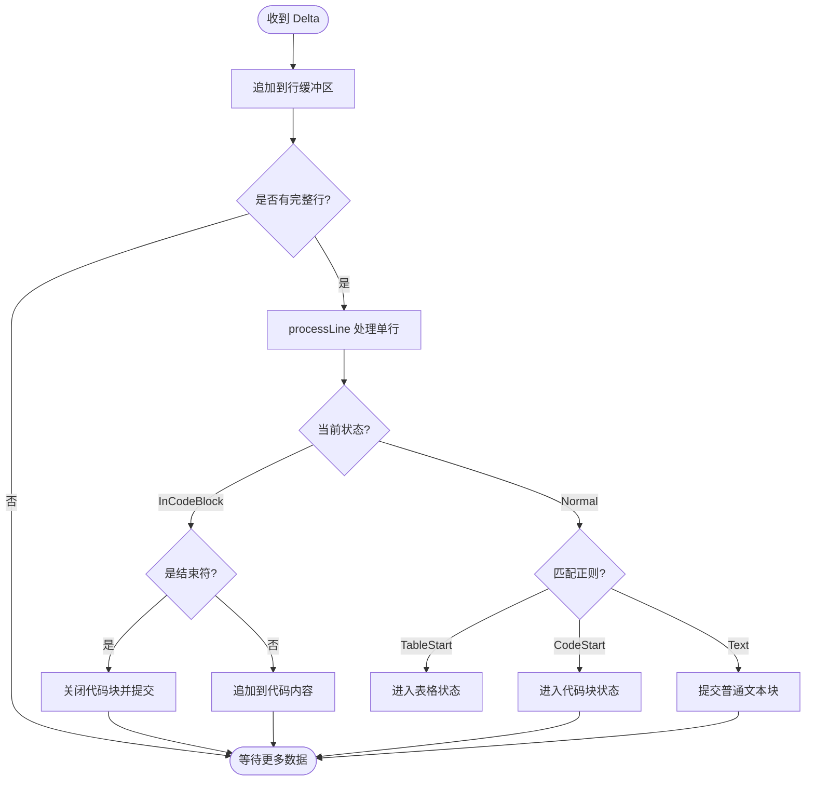
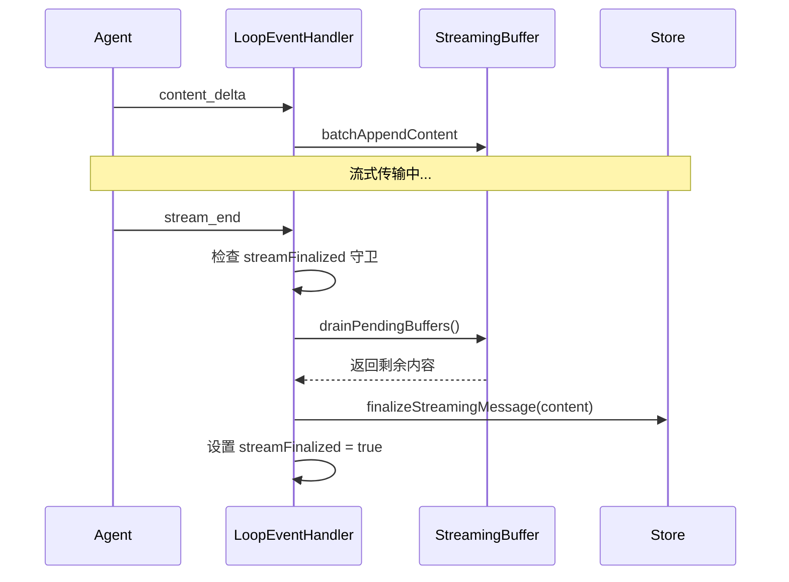
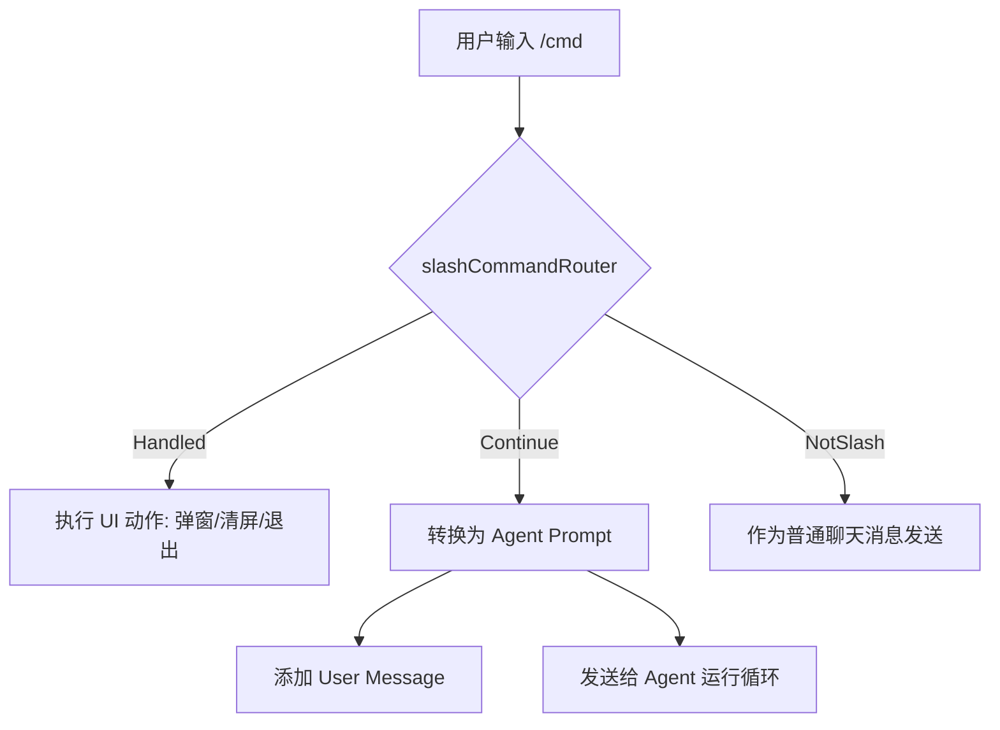
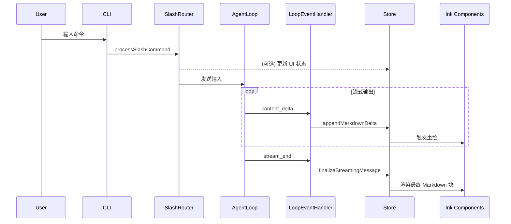

# 渲染工具与主题系统

## 目录
1. [模块概览](#模块概览)
2. [引言](#引言)
3. [Markdown 解析与增量渲染系统](#markdown-解析与增量渲染系统)
   - [核心解析逻辑](#核心解析逻辑)
   - [增量解析的必要性与实现](#增量解析的必要性与实现)
4. [事件分发与动作映射](#事件分发与动作映射)
   - [Loop 事件处理器](#loop-事件处理器)
   - [原子提交与协议](#原子提交与协议)
5. [主题引擎与视觉定制机制](#主题引擎与视觉定制机制)
   - [主题管理架构](#主题管理架构)
   - [样式注入机制](#样式注入机制)
6. [斜杠命令路由机制](#斜杠命令路由机制)
7. [底层文本处理工具](#底层文本处理工具)
8. [架构总览与数据流](#架构总览与数据流)
9. [关键文件索引](#关键文件索引)

## 模块概览

本模块负责 Blade TUI 的底层渲染支撑与视觉样式管理。通过高效的 Markdown 解析、增量式流处理以及高度可定制的主题系统，确保了终端界面的流畅性与美观度。

- **文件总数**: 17 个源文件
- **核心目录**:
  - `packages/cli/src/ui/utils/`: 包含 13 个辅助工具文件，涵盖文本处理、Markdown 解析、事件路由等。
  - `packages/cli/src/ui/themes/`: 包含 4 个主题相关文件，负责主题定义、管理与预设。
- **覆盖范围**: 本文档深入解析了 Markdown 解析器、增量解析缓存、Loop 事件处理器、主题管理器以及斜杠命令路由器等核心组件。

## 引言

在构建复杂的终端用户界面（TUI）时，如何优雅地处理来自大语言模型（LLM）的流式文本，并提供一致且可定制的视觉体验，是核心挑战之一。Blade 的渲染工具与主题系统通过以下三层架构解决了这一问题：

1.  **数据转换层**：将 Agent 运行循环产生的原始事件流（Loop Events）转换为 UI 可识别的动作和结构化数据。
2.  **解析与缓存层**：利用增量解析技术（Incremental Parsing）高效处理 Markdown 文本，避免长文本渲染时的性能瓶颈。
3.  **视觉管理层**：通过解耦的主题引擎实现全局样式的动态注入，支持用户根据个人喜好定制终端配色。

## Markdown 解析与增量渲染系统

Markdown 是 LLM 输出的主要格式。Blade 实现了一套专门针对终端环境优化的解析系统，支持代码高亮、表格渲染、引用块等复杂语法。

### 核心解析逻辑

`markdownParser.ts` 定义了核心解析器 `parseMarkdown`。它采用基于行的正则匹配策略，将文本分割为一组 `ParsedBlock` 对象。

**主要特性**：
- **嵌套代码块支持**：通过深度计数器（`codeBlockDepth`）正确处理代码块中包含代码块的情况（如文档说明）。
- **自定义标签**：支持 `<command-message>` 等自定义 HTML 标签，用于渲染特定的指令信息。
- **结构化数据提取**：对于表格和 Diff 块，解析器会提取出结构化的 `tableData` 和 `diffData`，以便 UI 组件进行针对性渲染。

```typescript
// packages/cli/src/ui/utils/markdownParser.ts

export interface ParsedBlock {
  type: 'text' | 'code' | 'heading' | 'table' | 'list' | 'hr' | 'empty' | 'diff' | 'command-message' | 'blockquote';
  content: string;
  language?: string;
  // ... 其他元数据
}

export function parseMarkdown(content: string): ParsedBlock[] {
  // ... 基于行的状态机解析逻辑
}
```

### 增量解析的必要性与实现

在处理 LLM 的流式输出时，传统的“全量重新解析”方案存在严重的性能问题。随着消息长度增加，解析开销呈 $O(N^2)$ 增长，会导致终端界面卡顿。

`markdownIncremental.ts` 引入了**增量解析（Incremental Parsing）**机制：
1.  **状态保持**：通过 `IncrementalState` 记录当前解析是否处于代码块、表格或引用块内部。
2.  **行级处理**：仅对新到达的行进行解析，并将其追加到已有的 `ParsedBlock` 数组中。
3.  **平摊开销**：将解析压力分散到整个流式接收过程中，最终渲染时只需直接读取缓存。

下图展示了增量解析的状态流转过程：



**增量解析的优势**：
- **低延迟**：用户能实时看到 LLM 正在生成的文本，且无感知解析开销。
- **中间态支持**：支持 `getMarkdownTailSnapshot`，允许 UI 渲染尚未闭合的代码块或表格的预览。

**Section sources**:
- [markdownParser.ts](file:///Users/bytedance/Documents/GitHub/Blade/packages/cli/src/ui/utils/markdownParser.ts)
- [markdownIncremental.ts](file:///Users/bytedance/Documents/GitHub/Blade/packages/cli/src/ui/utils/markdownIncremental.ts)

## 事件分发与动作映射

`loopEventHandler.ts` 是连接 Agent 后端与 UI 前端的枢纽。它负责监听 Agent 运行循环产生的事件，并调用相应的 Store Actions。

### Loop 事件处理器

通过 `createLoopEventHandler` 工厂函数创建的处理器，内部维护了一个 `streamFinalized` 标记，确保在一次对话轮次（Turn）中事件处理的幂等性。

**关键事件处理逻辑**：
- **`content_delta`**: 调用 `streamingBuffer` 进行批处理追加，减少 React 渲染频率。
- **`stream_end`**: 执行“原子提交”协议，清空缓冲区并最终化 Markdown 缓存。
- **`tool_start` / `tool_result`**: 调用 `formatToolCallSummary` 等工具格式化函数，将复杂的工具交互转换为易读的 UI 消息。

### 原子提交与协议

为了防止在用户中断（Abort）或模型降级（Fallback）时出现数据丢失或重复提交，`loopEventHandler` 遵循一套严格的终结协议：

1.  **Abort 路径**：编排层负责先 `drain` 缓冲区并提交，然后中止信号。
2.  **正常结束路径**：`stream_end` 检查 `streamFinalized` 守卫，确保不重复提交已由 Abort 路径处理的内容。



**Section sources**:
- [loopEventHandler.ts](file:///Users/bytedance/Documents/GitHub/Blade/packages/cli/src/ui/utils/loopEventHandler.ts)
- [toolFormatters.ts](file:///Users/bytedance/Documents/GitHub/Blade/packages/cli/src/ui/utils/toolFormatters.ts)

## 主题引擎与视觉定制机制

Blade 提供了一套基于配置的、可动态切换的主题系统，旨在为开发者提供最佳的终端视觉体验。

### 主题管理架构

主题系统的核心是 `ThemeManager` 类，它充当了全局主题配置的真理来源（Source of Truth）。

- **`Theme` 接口**：定义了完整的视觉规范，包括 `BaseColors`（基础色）、`SyntaxColors`（语法高亮色）、`spacing`（间距）和 `typography`（排版）。
- **单例模式**：`themeManager` 实例在应用启动时加载预设，并根据用户配置切换当前激活的主题。

```typescript
// packages/cli/src/ui/themes/ThemeManager.ts

class ThemeManager {
  private currentTheme: Theme = defaultTheme;
  private themes: Map<string, Theme> = new Map();

  setTheme(themeName: string): void {
    const theme = this.themes.get(themeName);
    if (theme) {
      this.currentTheme = theme;
    }
  }

  getTheme(): Theme {
    return this.currentTheme;
  }
}
```

### 样式注入机制

Blade 并没有使用传统的 CSS，而是利用 React 的状态管理将主题对象注入到 Ink 组件中。

1.  **Store 同步**：Zustand Store 存储当前的主题名称。
2.  **选择器订阅**：组件通过 `useTheme()` 选择器订阅主题变化。
3.  **动态渲染**：Ink 组件（如 `Text`, `Box`）直接使用从主题对象中获取的颜色值。

这种机制通过 `useTheme` 钩子实现了样式的全局动态注入，当用户执行 `/theme` 命令切换主题时，整个 UI 会立即响应并重新渲染。

**Section sources**:
- [ThemeManager.ts](file:///Users/bytedance/Documents/GitHub/Blade/packages/cli/src/ui/themes/ThemeManager.ts)
- [presets.ts](file:///Users/bytedance/Documents/GitHub/Blade/packages/cli/src/ui/themes/presets.ts)
- [types.ts](file:///Users/bytedance/Documents/GitHub/Blade/packages/cli/src/ui/themes/types.ts)

## 斜杠命令路由机制

`slashCommandRouter.ts` 负责将用户输入的斜杠命令（如 `/clear`, `/theme`, `/skill`）路由到对应的处理函数。

其核心功能包括：
- **UI 交互分发**：识别 `show_theme_selector` 等消息，触发 Store 开启对应的模态框（Modal）。
- **Agent 输入转换**：对于 `/skill` 或 `/custom` 命令，路由器会将其转换为 Agent 能够理解的长 Prompt，并显式区分“用户看到的消息”与“发送给 Agent 的输入”。
- **会话清理**：处理 `/clear` 命令，执行重置消息列表、重置 Token 统计等原子操作。



**Section sources**:
- [slashCommandRouter.ts](file:///Users/bytedance/Documents/GitHub/Blade/packages/cli/src/ui/utils/slashCommandRouter.ts)

## 底层文本处理工具

为了在终端中实现精确的布局，`textUtils.ts` 提供了关键的底层支持：

- **Unicode 感知**：通过 `toCodePoints` 正确处理 Emoji、汉字等跨越多个 UTF-16 代码单元的字符，避免字符串截断时出现乱码。
- **带缓存的宽度计算**：调用 `string-width` 计算字符在终端中占据的列数（如汉字占 2 列），并使用 `Map` 进行缓存以优化大规模文本渲染性能。

> 💡 **提示**：在终端布局中，字符串的 `length` 并不等于其显示宽度。始终应使用 `getCachedStringWidth` 来计算 Box 的实际占用空间。

**Section sources**:
- [textUtils.ts](file:///Users/bytedance/Documents/GitHub/Blade/packages/cli/src/ui/utils/textUtils.ts)

## 架构总览与数据流

整个渲染与工具系统的运行遵循单向数据流原则，确保了状态的一致性。



该架构将复杂的文本解析和事件处理逻辑从 UI 组件中抽离出来，使得 UI 层只需关注如何根据结构化数据（`ParsedBlock`）和当前主题（`Theme`）进行声明式渲染。

## 关键文件索引

以下是本模块中探索的关键文件及其职责：

- [markdownParser.ts](file:///Users/bytedance/Documents/GitHub/Blade/packages/cli/src/ui/utils/markdownParser.ts): Markdown 核心解析器，支持代码块嵌套。
- [markdownIncremental.ts](file:///Users/bytedance/Documents/GitHub/Blade/packages/cli/src/ui/utils/markdownIncremental.ts): 增量解析缓存，优化流式渲染性能。
- [loopEventHandler.ts](file:///Users/bytedance/Documents/GitHub/Blade/packages/cli/src/ui/utils/loopEventHandler.ts): Agent 事件到 UI 动作的映射器。
- [ThemeManager.ts](file:///Users/bytedance/Documents/GitHub/Blade/packages/cli/src/ui/themes/ThemeManager.ts): 全局主题状态管理与切换逻辑。
- [presets.ts](file:///Users/bytedance/Documents/GitHub/Blade/packages/cli/src/ui/themes/presets.ts): 包含 10+ 种主流终端配色预设。
- [slashCommandRouter.ts](file:///Users/bytedance/Documents/GitHub/Blade/packages/cli/src/ui/utils/slashCommandRouter.ts): 斜杠命令的分发与转换逻辑。
- [textUtils.ts](file:///Users/bytedance/Documents/GitHub/Blade/packages/cli/src/ui/utils/textUtils.ts): Unicode 感知的文本宽度计算工具。
- [toolFormatters.ts](file:///Users/bytedance/Documents/GitHub/Blade/packages/cli/src/ui/utils/toolFormatters.ts): 工具调用信息的格式化处理器。
- [types.ts](file:///Users/bytedance/Documents/GitHub/Blade/packages/cli/src/ui/themes/types.ts): 主题系统的类型契约定义。
