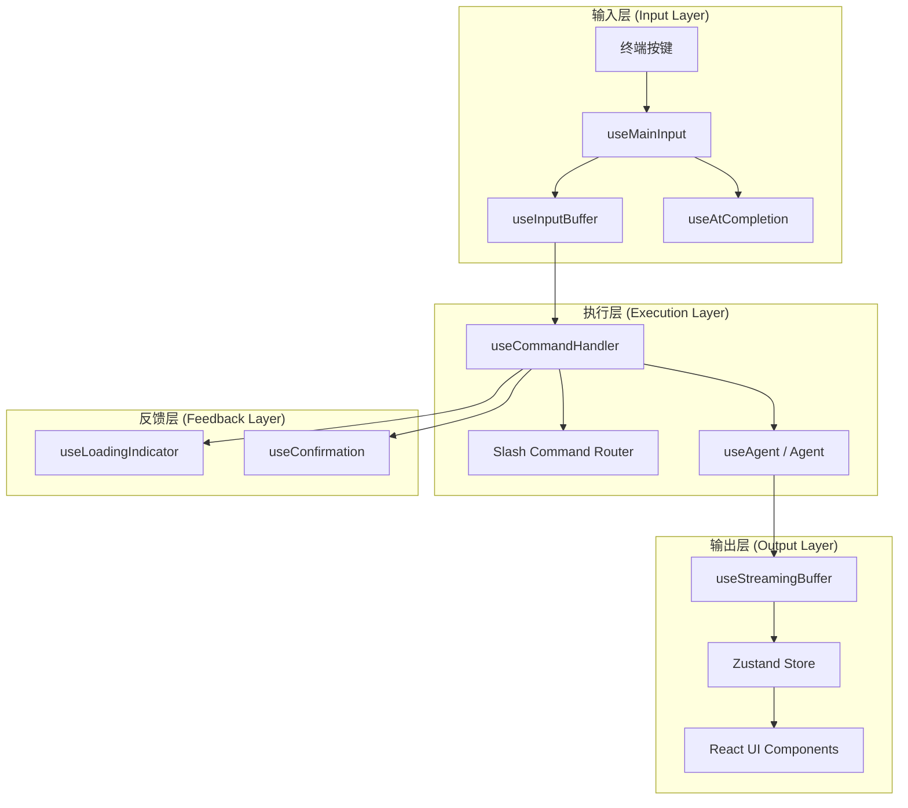
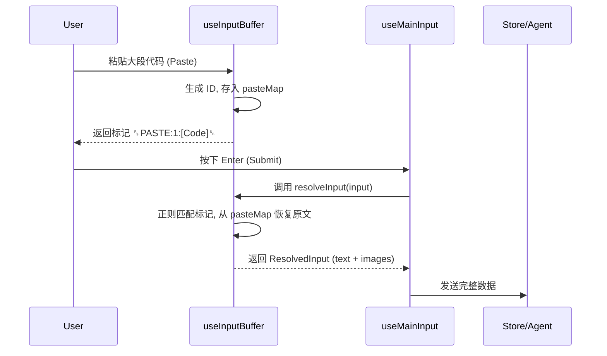
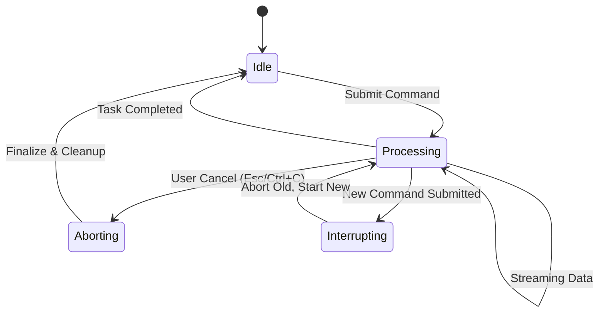
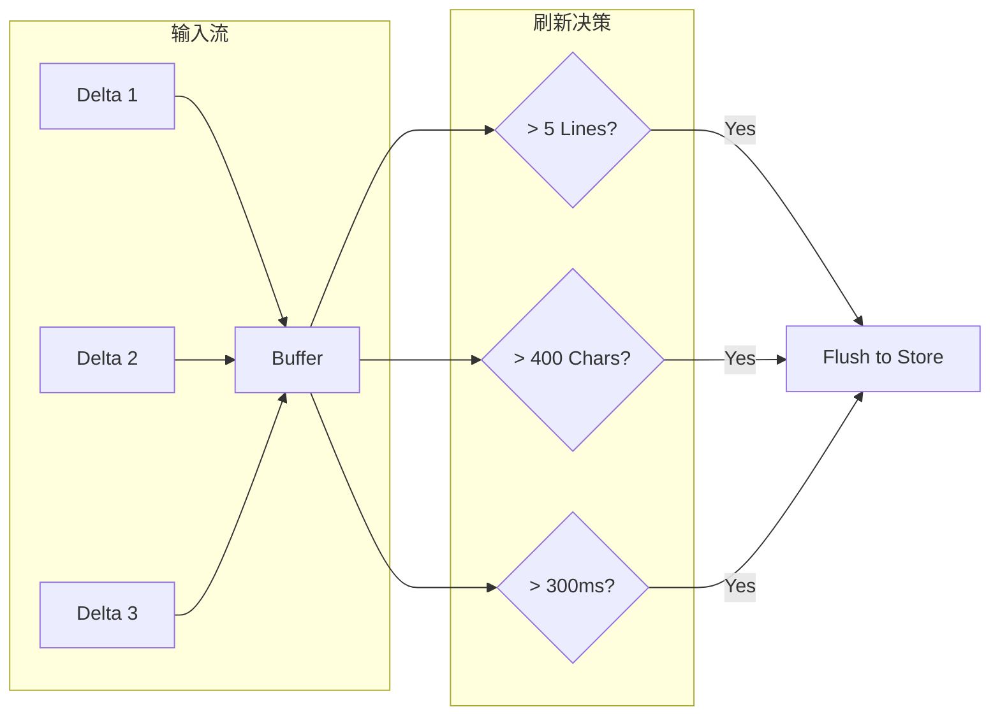

# 终端交互 Hooks

## 目录
1. [模块概览](#模块概览)
2. [终端交互架构](#终端交互架构)
3. [输入与缓冲区管理机制](#输入与缓冲区管理机制)
   - [输入缓冲区与粘贴映射](#输入缓冲区与粘贴映射)
   - [自动补全与建议系统](#自动补全与建议系统)
4. [命令执行编排与生命周期](#命令执行编排与生命周期)
   - [任务执行流程](#任务执行流程)
   - [中断与竞态保护](#中断与竞态保护)
5. [流式输出优化与性能](#流式输出优化与性能)
   - [批处理缓冲策略](#批处理缓冲策略)
   - [渲染性能优化](#渲染性能优化)
6. [终端环境感知与适配](#终端环境感知与适配)
   - [响应式尺寸监听](#响应式尺寸监听)
   - [静态内容刷新](#静态内容刷新)
7. [UI 反馈与状态同步](#ui-反馈与状态同步)
   - [加载状态指示](#加载状态指示)
   - [环境信息同步](#环境信息同步)
8. [核心组件参考](#核心组件参考)
9. [文件参考](#文件参考)

## 模块概览

终端交互 Hooks 模块位于 `packages/cli/src/ui/hooks/`，是 Blade 命令行界面（TUI）的逻辑骨架。该模块通过约 15 个自定义 React Hooks，将原始的终端输入事件、窗口调整信号以及后端的 Agent 状态转化为响应式的 React 状态，从而驱动复杂的终端交互体验。

**模块统计：**
- **总文件数**：15 个
- **子模块分类**：
  - **输入处理**：`useMainInput`, `useInputBuffer`, `useAtCompletion`
  - **命令执行**：`useCommandHandler`, `useCommandHistory`, `useCtrlCHandler`, `useConfirmation`
  - **输出优化**：`useStreamingBuffer`, `useLoadingIndicator`, `usePhraseCycler`
  - **环境感知**：`useTerminalWidth`, `useTerminalHeight`, `useRefreshStatic`, `useGitBranch`
  - **核心管理**：`useAgent`

本章节将深入解析这些 Hooks 如何协同工作，实现诸如多行输入、大文本粘贴优化、平滑流式输出以及复杂的命令中断逻辑。

## 终端交互架构

Blade 的终端交互采用了典型的“输入-处理-输出”闭环架构，但针对终端环境的特殊性进行了深度优化。

在输入侧，`useMainInput` 作为中枢，拦截 `ink` 提供的原始按键事件。它不仅处理普通字符输入，还管理着复杂的快捷键映射（如 Ctrl+L 清屏、Ctrl+C 智能中止）。输入内容被实时同步到 `useInputBuffer` 中，后者通过独特的“粘贴标记”机制处理大段文本和图片，确保 UI 渲染性能。

在处理侧，`useCommandHandler` 负责编排整个任务的生命周期。它将用户输入路由到斜杠命令处理器或 LLM Agent。在 Agent 执行过程中，它通过 `useConfirmation` 管理工具调用的确认队列，并处理可能的中断请求。

在输出侧，`useStreamingBuffer` 扮演了“减速阀”的角色。AI 生成的文本往往是碎片化的流式数据，直接渲染会导致终端频繁重绘和闪烁。该 Hook 通过批处理策略，将细碎的增量内容聚合后统一更新到状态中。

下面的图表展示了从用户按键到 UI 响应的完整数据流向：



用户在终端按下按键后，`useMainInput` 首先根据当前焦点状态决定是否拦截。如果是普通字符，则更新 `useInputBuffer` 的状态；如果是功能键（如 Tab），则触发 `useAtCompletion` 的补全逻辑。当用户按下回车提交时，`useCommandHandler` 接管流程，解析输入并启动 Agent 任务。Agent 的输出通过 `useStreamingBuffer` 进行平滑处理后存入全局 Store，最终触发 React 组件的重新渲染。

**Section sources**:
- [useMainInput.ts](file:///Users/bytedance/Documents/GitHub/Blade/packages/cli/src/ui/hooks/useMainInput.ts)
- [useCommandHandler.ts](file:///Users/bytedance/Documents/GitHub/Blade/packages/cli/src/ui/hooks/useCommandHandler.ts)

## 输入与缓冲区管理机制

终端输入框（Main Input）不仅仅是一个文本域，它需要支持历史记录导航、代码片段粘贴、图片上传以及智能补全。

### 输入缓冲区与粘贴映射

`useInputBuffer` 是输入逻辑的核心。在终端中，直接渲染数万行的代码片段会导致严重的卡顿。为此，Blade 设计了一套“粘贴标记（Paste Marker）”机制。

当用户粘贴大段文本或图片时，系统不会将原始数据存入输入字符串，而是生成一个唯一的标记（如 `␞PASTE:1:摘要内容␟`）。
- **存储**：原始数据存储在 `pasteMap` (Ref) 中。
- **显示**：输入框中仅显示简短的标记，极大地减轻了 Ink 的渲染负担。
- **解析**：在提交命令前，`resolveInput` 函数会将这些标记还原为原始文本，并提取出图片数据，构建成多模态输入。

```typescript
// useInputBuffer.ts 中的解析逻辑片段
export function useInputBuffer(initialValue: string = ''): InputBuffer {
  const pasteMapRef = useRef<PasteContentMap>(new Map());

  const resolveInput = useMemoizedFn((input: string): ResolvedInput => {
    // 使用正则匹配 ␞PASTE:id:摘要␟
    const regex = new RegExp(`${PASTE_MARKER_START}PASTE:(\\d+):[\\s\\S]*?${PASTE_MARKER_END}`, 'g');
    const matches = Array.from(input.matchAll(regex));
    
    // ... 循环处理匹配项，从 pasteMapRef.current 获取原始数据 ...
    // 将文本标记替换为原文，将图片标记提取为单独的 images 数组
    return { displayText, text, images, parts };
  });

  return { value, setValue, resolveInput, pasteMap: pasteMapRef.current, ... };
}
```



这种设计巧妙地平衡了“用户可见性”与“渲染性能”。用户在输入框中看到的是一个占位符，但在提交时 Agent 接收到的是完整的上下文。同时，`useInputBuffer` 还负责清理逻辑：如果用户删除了输入框中的某个标记，对应的 `pasteMap` 条目也会被自动释放。

### 自动补全与建议系统

`useAtCompletion` 实现了类似 IDE 的 `@` 文件补全功能。它通过 `fast-glob` 扫描当前工作目录，并结合 `fuse.js` 提供模糊匹配。

为了保证流畅度，该 Hook 采用了以下优化手段：
1. **全局缓存**：文件列表在 5 秒内全局共享，避免重复扫描磁盘。
2. **防抖加载**：仅在用户输入 `@` 且停顿一定时间后才触发扫描。
3. **光标感知**：精准识别光标所在的补全区间，支持在字符串中间进行补全。

`useMainInput` 会实时监听 `useAtCompletion` 的状态。当有建议可用时，它会拦截 Tab 键和上下箭头键，将其用于建议的选择与应用，而非普通的输入。

**Section sources**:
- [useInputBuffer.ts](file:///Users/bytedance/Documents/GitHub/Blade/packages/cli/src/ui/hooks/useInputBuffer.ts)
- [useAtCompletion.ts](file:///Users/bytedance/Documents/GitHub/Blade/packages/cli/src/ui/hooks/useAtCompletion.ts)

## 命令执行编排与生命周期

`useCommandHandler` 是整个 TUI 的大脑，它负责将静态的输入转化为动态的任务。

### 任务执行流程

一个典型的命令执行流程如下：
1. **路由分发**：首先检查是否是斜杠命令（如 `/help`, `/init`）。如果是，则直接调用对应的本地处理器。
2. **Hook 注入**：执行 `UserPromptSubmitHooks`，允许插件在发送给 Agent 前修改提示词或注入额外上下文。
3. **Agent 创建**：通过 `useAgent` 获取或创建一个 Agent 实例。
4. **流式消费**：调用 `drainLoop` 消费 Agent 输出的事件流，并将事件分发给 `loopEventHandler` 处理。

```typescript
// useCommandHandler.ts 中的核心执行逻辑
export const useCommandHandler = (...) => {
  const executeCommand = useMemoizedFn(async (resolved: ResolvedInput) => {
    // 1. 处理中断逻辑：如果正在运行，则 abort 当前任务
    if (isProcessing) {
      const { extraContent, extraThinking } = streamingBuffer.drainPendingBuffers();
      commandActions.abort('interrupt');
      sessionActions.finalizeStreamingMessage(extraContent, extraThinking);
    }

    // 2. 设置处理状态并重置缓冲区
    commandActions.setProcessing(true);
    streamingBuffer.resetStreamingBuffers();

    try {
      // 3. 进入 handleCommandSubmit 核心流程
      const result = await handleCommandSubmit(resolved);
      // ... 错误处理 ...
    } finally {
      // 4. 只有当任务未被新任务覆盖时才重置状态
      if (commandActions.getAbortController() === taskAbortController) {
        commandActions.setProcessing(false);
      }
    }
  });
}
```

### 中断与竞态保护

在终端交互中，用户可能随时按下 Esc 或 Ctrl+C 来中止当前任务。`useCommandHandler` 必须优雅地处理这些请求。

**中断协议 (Finalize Protocol)**：
当任务被中止时，可能还有一部分内容残留在 `useStreamingBuffer` 中。`useCommandHandler` 采用了一套严密的 Finalize 协议：
- `handleAbort` 会先调用 `drainPendingBuffers()` 强制读取缓冲区中的剩余内容。
- 然后触发 `AbortController` 信号。
- 最后将剩余内容提交到 Store，确保用户能看到任务停止前 Agent 已经生成的所有内容。



**Section sources**:
- [useCommandHandler.ts](file:///Users/bytedance/Documents/GitHub/Blade/packages/cli/src/ui/hooks/useCommandHandler.ts)
- [useCtrlCHandler.ts](file:///Users/bytedance/Documents/GitHub/Blade/packages/cli/src/ui/hooks/useCtrlCHandler.ts)

## 流式输出优化与性能

`useStreamingBuffer` 是提升终端输出体验的关键组件。它解决了 LLM 流式输出过快、过碎导致的“闪烁”问题。

### 批处理缓冲策略

Agent 输出的内容通常是一个个字符或短小的词组。如果每收到一个事件就更新一次 React 状态，会导致 Ink 频繁计算布局并重绘整个终端界面。

`useStreamingBuffer` 引入了多维度的刷新阈值：
- **行数阈值**：积累超过 5 行时刷新。
- **字符阈值**：积累超过 400 字符时刷新。
- **时间阈值**：即使未达到上述条件，超过 300ms 也会强制刷新。

```typescript
// useStreamingBuffer.ts 中的刷新逻辑
const batchAppendContent = useMemoizedFn((delta: string) => {
  contentBufferRef.current += delta;
  const buffer = contentBufferRef.current;

  // 检查是否达到刷新条件
  const lineCount = countNewlines(buffer);
  if (lineCount >= MIN_LINES_TO_FLUSH || buffer.length >= MIN_CHARS_TO_FLUSH) {
    flushContentBuffer();
    return;
  }

  // 未达到条件，设置超时兜底
  if (!contentFlushTimerRef.current) {
    contentFlushTimerRef.current = setTimeout(flushContentBuffer, FLUSH_TIMEOUT);
  }
});
```

这种策略实现了类似“打字机”的平滑效果：内容以块的形式出现，既保证了实时感，又极大降低了 CPU 占用。

### 渲染性能优化

除了批处理，该 Hook 还区分了 `content`（正式输出）和 `thinking`（思考过程）的缓冲区。对于思考过程，它支持实时同步到 UI 的折叠面板中，而不会干扰主对话流的渲染。



通过这种缓冲机制，Blade 能够轻松 handle 高吞吐量的 AI 输出，即使在复杂的 TUI 布局下也能保持流畅响应。

**Section sources**:
- [useStreamingBuffer.ts](file:///Users/bytedance/Documents/GitHub/Blade/packages/cli/src/ui/hooks/useStreamingBuffer.ts)

## 终端环境感知与适配

由于终端环境的高度动态性（用户随时可能拉伸窗口），Hooks 必须具备环境感知能力。

### 响应式尺寸监听

`useTerminalWidth` 和 `useTerminalHeight` 封装了对 `stdout` 的 `resize` 事件监听。
- **防抖处理**：使用 `lodash.debounce` 避免在连续拖拽窗口时产生海量的重绘请求。
- **全局同步**：尺寸变化会实时反馈到 React 状态中，驱动布局组件（如 `Box`）自动调整。

```typescript
// useTerminalWidth.ts 实现片段
export function useTerminalWidth(debounceMs: number = 200): number {
  const { stdout } = useStdout();
  const [width, setWidth] = useState(stdout.columns || 80);

  useEffect(() => {
    const updateWidth = debounce(() => {
      setWidth(stdout.columns || 80);
    }, debounceMs);

    stdout.on('resize', updateWidth);
    return () => {
      stdout.off('resize', updateWidth);
      updateWidth.cancel();
    };
  }, [stdout, debounceMs]);

  return width;
}
```

### 静态内容刷新

在非 Alternate Buffer 模式（即使用终端原生滚动）下，Ink 的 `Static` 组件内容会永久留在终端缓冲区中。当终端宽度变化时，原本渲染好的内容可能会错位。

`useRefreshStatic` 解决了这个问题：
- 它监听宽度变化，在防抖结束后触发。
- 它会发送 ANSI 转义序列 `\u001b[2J`（清屏）并重置光标。
- 通过增加 Store 中的 `clearCount` 计数器，强制 `Static` 组件卸载并重新挂载，从而在新的宽度下重新渲染所有历史消息。

**Section sources**:
- [useTerminalWidth.ts](file:///Users/bytedance/Documents/GitHub/Blade/packages/cli/src/ui/hooks/useTerminalWidth.ts)
- [useRefreshStatic.ts](file:///Users/bytedance/Documents/GitHub/Blade/packages/cli/src/ui/hooks/useRefreshStatic.ts)

## UI 反馈与状态同步

为了缓解用户在等待 AI 响应时的焦虑，模块提供了丰富的状态同步机制。

### 加载状态指示

`useLoadingIndicator` 整合了计时器和短语循环功能。
- **计时器**：实时计算任务已运行的时间。
- **短语循环**：`usePhraseCycler` 每 15 秒切换一次显示的短语。它不仅包含“思考中...”等状态描述，还会以 25% 的概率穿插显示实用的快捷键提示（如 `Esc - 中止任务`）。
- **暂停机制**：当 UI 弹出模态框（如权限确认）时，计时器和短语循环会自动暂停，避免在用户不可见时消耗资源。

### 环境信息同步

`useGitBranch` 负责在后台定期（默认 5 秒）获取当前的 Git 分支名称。这使得状态栏（Status Bar）能够实时反映代码库的状态，无需用户手动刷新。

**Section sources**:
- [useLoadingIndicator.ts](file:///Users/bytedance/Documents/GitHub/Blade/packages/cli/src/ui/hooks/useLoadingIndicator.ts)
- [usePhraseCycler.ts](file:///Users/bytedance/Documents/GitHub/Blade/packages/cli/src/ui/hooks/usePhraseCycler.ts)
- [useGitBranch.ts](file:///Users/bytedance/Documents/GitHub/Blade/packages/cli/src/ui/hooks/useGitBranch.ts)

## 核心组件参考

### useMainInput
主输入处理 Hook，是 TUI 交互的入口。

| 参数/返回值 | 类型 | 说明 |
| :--- | :--- | :--- |
| `buffer` | `InputBuffer` | 由 `useInputBuffer` 提供的缓冲区实例 |
| `onSubmit` | `(resolved: ResolvedInput) => void` | 提交命令的回调 |
| `handleSubmit` | `() => void` | 手动触发提交的方法 |
| `showSuggestions` | `boolean` | 是否正在显示补全建议 |

### useStreamingBuffer
流式输出批处理 Hook，优化渲染性能。

| 方法 | 说明 |
| :--- | :--- |
| `batchAppendContent` | 批量追加正式内容，满足条件时刷新 |
| `batchAppendThinking` | 批量追加思考内容 |
| `drainPendingBuffers` | 原子操作：清空并返回当前所有缓冲区内容 |

### useInputBuffer
输入缓冲区管理 Hook，支持粘贴标记。

| 属性/方法 | 说明 |
| :--- | :--- |
| `value` | 当前输入框显示的字符串（含标记） |
| `addPasteMapping` | 将大文本存入映射并返回标记 ID |
| `resolveInput` | 将带标记的字符串解析为多模态输入对象 |

## 文件参考

本章节涉及的核心源文件如下：

- [useMainInput.ts](file:///Users/bytedance/Documents/GitHub/Blade/packages/cli/src/ui/hooks/useMainInput.ts): 输入拦截与快捷键管理。
- [useInputBuffer.ts](file:///Users/bytedance/Documents/GitHub/Blade/packages/cli/src/ui/hooks/useInputBuffer.ts): 粘贴标记机制与多模态解析。
- [useStreamingBuffer.ts](file:///Users/bytedance/Documents/GitHub/Blade/packages/cli/src/ui/hooks/useStreamingBuffer.ts): 流式输出批处理优化。
- [useCommandHandler.ts](file:///Users/bytedance/Documents/GitHub/Blade/packages/cli/src/ui/hooks/useCommandHandler.ts): 命令执行编排与中断逻辑。
- [useAtCompletion.ts](file:///Users/bytedance/Documents/GitHub/Blade/packages/cli/src/ui/hooks/useAtCompletion.ts): @-mention 文件自动补全。
- [useTerminalWidth.ts](file:///Users/bytedance/Documents/GitHub/Blade/packages/cli/src/ui/hooks/useTerminalWidth.ts): 终端宽度监听。
- [useTerminalHeight.ts](file:///Users/bytedance/Documents/GitHub/Blade/packages/cli/src/ui/hooks/useTerminalHeight.ts): 终端高度监听。
- [useLoadingIndicator.ts](file:///Users/bytedance/Documents/GitHub/Blade/packages/cli/src/ui/hooks/useLoadingIndicator.ts): 加载状态与计时器。
- [usePhraseCycler.ts](file:///Users/bytedance/Documents/GitHub/Blade/packages/cli/src/ui/hooks/usePhraseCycler.ts): 趣味加载短语循环。
- [useCtrlCHandler.ts](file:///Users/bytedance/Documents/GitHub/Blade/packages/cli/src/ui/hooks/useCtrlCHandler.ts): 智能 Ctrl+C 处理。
- [useCommandHistory.ts](file:///Users/bytedance/Documents/GitHub/Blade/packages/cli/src/ui/hooks/useCommandHistory.ts): 命令历史记录管理。
- [useConfirmation.ts](file:///Users/bytedance/Documents/GitHub/Blade/packages/cli/src/ui/hooks/useConfirmation.ts): 工具调用确认队列。
- [useAgent.ts](file:///Users/bytedance/Documents/GitHub/Blade/packages/cli/src/ui/hooks/useAgent.ts): Agent 生命周期管理。
- [useRefreshStatic.ts](file:///Users/bytedance/Documents/GitHub/Blade/packages/cli/src/ui/hooks/useRefreshStatic.ts): 静态内容强制刷新。
- [useGitBranch.ts](file:///Users/bytedance/Documents/GitHub/Blade/packages/cli/src/ui/hooks/useGitBranch.ts): Git 分支信息同步。
