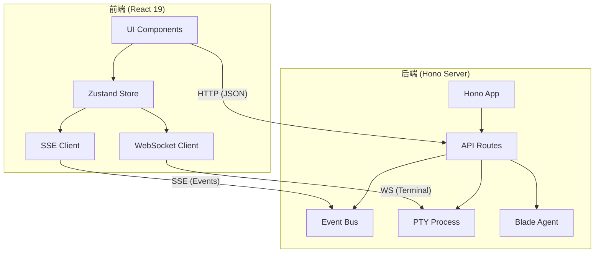
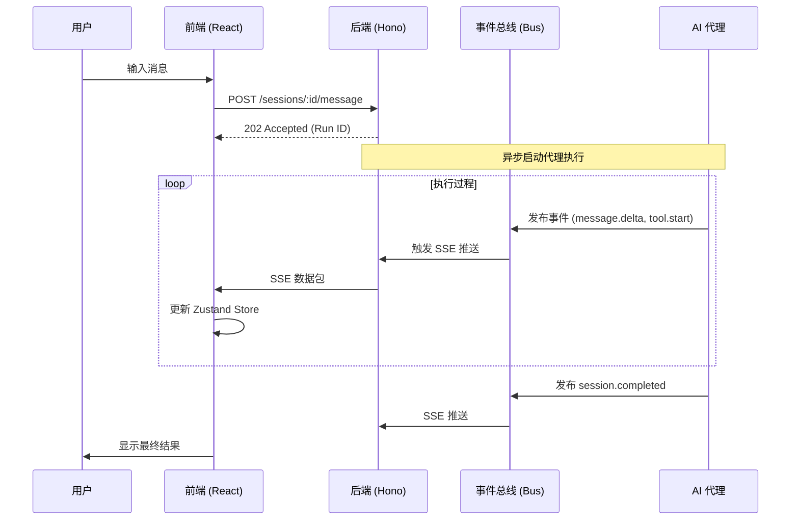
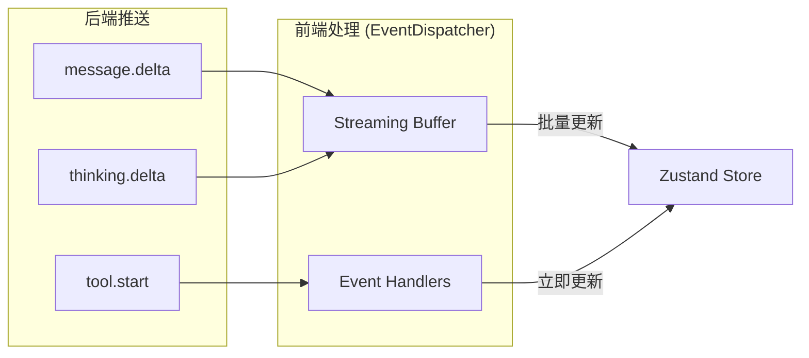
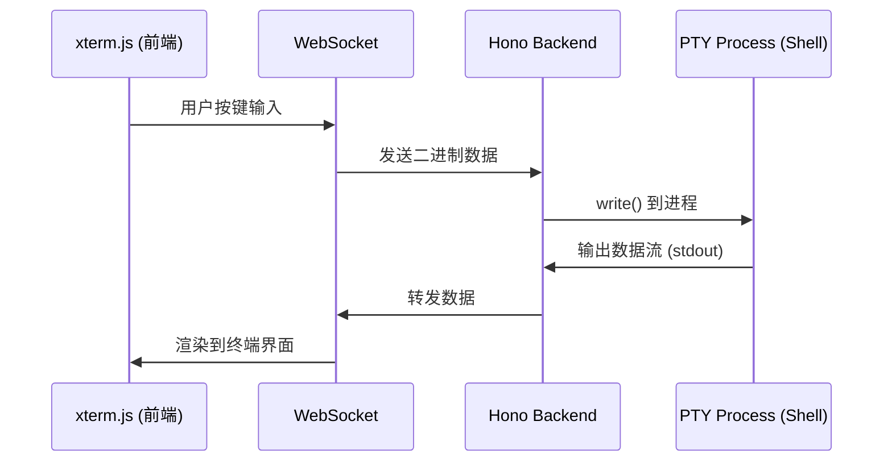

# Web UI 与 Hono 服务端

## 目录
1. [模块概览](#模块概览)
2. [架构设计](#架构设计)
   - [整体架构](#整体架构)
   - [前后端协作机制](#前后端协作机制)
3. [Hono 后端架构](#hono-后端架构)
   - [服务初始化与中间件](#服务初始化与中间件)
   - [路由系统](#路由系统)
   - [事件总线 (Bus)](#事件总线-bus)
4. [React 前端架构](#react-前端架构)
   - [技术栈与入口](#技术栈与入口)
   - [组件结构](#组件结构)
5. [状态管理 (Zustand)](#状态管理-zustand)
   - [AppStore：全局 UI 状态](#appstore全局-ui-状态)
   - [SessionStore：复杂业务状态](#sessionstore复杂业务状态)
6. [实时通信机制](#实时通信机制)
   - [SSE 事件流](#sse-事件流)
   - [WebSocket 终端](#websocket-终端)
7. [核心逻辑解析](#核心逻辑解析)
   - [消息聚合 (aggregateMessages)](#消息聚合-aggregatemessages)
   - [流式缓冲区 (Streaming Buffer)](#流式缓冲区-streaming-buffer)
8. [核心组件](#核心组件)
9. [文件参考](#文件参考)

## 模块概览

Blade 的 Web UI 与 Hono 后端模块是系统的交互核心，负责将底层的 AI 代理能力以现代化的 Web 界面呈现给用户。该模块通过高效的异步通信和精细的状态管理，实现了流畅的对话体验、实时终端交互以及复杂的工具调用展示。

根据对 `packages/cli/web/` 和 `packages/cli/src/server/` 目录的扫描，该模块包含以下规模：
- **后端代码**：约 15 个 TypeScript 文件，主要基于 Hono 框架。
- **前端代码**：约 60 个 React/TypeScript 文件，采用 React 19 和 Tailwind CSS。
- **子模块分布**：
  - `server/routes/`：定义了包括会话、配置、终端、MCP 在内的 10+ 组 API 路由。
  - `web/src/components/`：包含聊天、布局、设置、终端等 20+ 个 UI 组件。
  - `web/src/store/`：包含基于 Zustand 的多维度状态管理逻辑。

本章节将深入探讨 Hono 后端的轻量化设计、前端 React 架构的组件化实践，以及两者之间通过 SSE 和 WebSocket 实现的实时同步机制。

---

## 架构设计

### 整体架构

Blade 采用了典型的 Client-Server 架构，但针对 AI 代理的特性进行了深度优化。后端 Hono 服务不仅作为 API 网关，还负责管理代理运行时（Runtime）和 PTY 终端；前端 React 应用则通过流式处理技术，实时展现代理的思考过程和执行结果。

以下是系统的整体架构图：



**架构解析**：
1.  **UI 层**：基于 React 19 构建，利用 Tailwind CSS 实现响应式布局。
2.  **状态层**：使用 Zustand 进行状态管理，其中 `SessionStore` 采用了切片（Slices）模式，将消息处理、流式状态和 UI 控制逻辑解耦。
3.  **通信层**：
    - **HTTP**：用于常规的配置修改、会话创建等请求。
    - **SSE (Server-Sent Events)**：用于从后端实时推送 AI 代理生成的 Token、工具调用状态和系统事件。
    - **WebSocket**：专用于 `/terminal/ws` 路径，实现前端 Xterm.js 与后端 PTY 进程的双向通信。
4.  **后端核心**：Hono 框架提供了极高的路由性能，通过 `Bus` 模块实现了代理事件与 SSE 流的解耦。

### 前后端协作机制

为了确保 AI 代理的执行过程能够实时反馈到界面上，Blade 设计了一套复杂的事件驱动协作流程。



在该流程中，后端在收到消息后立即返回 `202 Accepted`，随后在后台启动异步任务。所有的执行进度都通过 `Bus` 发布，并由 SSE 句柄实时推送到前端。这种设计避免了长连接请求导致的超时问题，并支持复杂的流式输出。

**架构参考文件**:
- [server.ts](file:///Users/bytedance/Documents/GitHub/Blade/packages/cli/src/server/server.ts)
- [bus.ts](file:///Users/bytedance/Documents/GitHub/Blade/packages/cli/src/server/bus.ts)
- [eventHandlers.ts](file:///Users/bytedance/Documents/GitHub/Blade/packages/cli/web/src/store/session/handlers/eventHandlers.ts)

---

## Hono 后端架构

### 服务初始化与中间件

Blade 的后端基于 **Hono** 框架，这是一个高性能、轻量级的 Web 框架。`server.ts` 是整个后端的入口，它负责配置中间件、挂载路由以及处理静态文件服务。

```typescript
// packages/cli/src/server/server.ts 核心片段
function createApp(): Hono<{ Variables: Variables }> {
  const app = new Hono<{ Variables: Variables }>();

  // 错误处理中间件
  app.onError((err, c) => {
    logger.error('[Server] Request error:', err);
    if (err instanceof BladeServerError) {
      return c.json(err.toObject(), err.statusCode);
    }
    return c.json({ error: { code: 'INTERNAL_ERROR', message: err.message } }, 500);
  });

  // 基础认证中间件 (可选)
  app.use(async (c, next) => {
    const password = process.env.BLADE_SERVER_PASSWORD;
    if (!password || isPublicPath(c.req.path)) return next();
    // ... 校验 Basic Auth ...
  });

  // CORS 配置
  app.use(cors({
    origin: (origin) => isAllowedOrigin(origin) ? origin : undefined
  }));

  // 目录上下文中间件
  app.use(async (c, next) => {
    const directory = c.req.query('directory') || c.req.header('x-blade-directory') || getCwd();
    c.set('directory', decodeURIComponent(directory));
    await next();
  });

  return app;
}
```

**关键设计点**：
- **多运行时支持**：后端代码兼容 Bun 和 Node.js。在 Bun 环境下使用原生 `Bun.serve`，在 Node.js 环境下则通过适配层运行。
- **目录感知**：通过 `x-blade-directory` 请求头或查询参数，后端能够感知前端当前操作的工作目录，并将其注入到 Hono 的 `Variables` 上下文中。
- **静态资源服务**：在生产环境下，Hono 会自动探测并服务 `web/dist` 目录下的 React 静态资源，实现前后端一体化部署。

### 路由系统

后端功能被划分为多个独立的路由模块，通过 `app.route()` 进行挂载。

| 路由前缀 | 功能描述 | 核心文件 |
| :--- | :--- | :--- |
| `/sessions` | 会话管理、消息发送、SSE 事件流 | `routes/session.ts` |
| `/terminal` | 终端状态查询与 WebSocket 升级 | `routes/terminal.ts` |
| `/configs` | 系统配置读取与修改 | `routes/config.ts` |
| `/mcp` | MCP (Model Context Protocol) 交互 | `routes/mcp.ts` |
| `/models` | 模型列表与提供商管理 | `routes/models.ts` |

### 事件总线 (Bus)

为了实现解耦，后端引入了一个全局的 `Bus` 模块。它基于 Node.js 的 `EventEmitter`，作为代理执行层与 Web 通信层之间的中转站。

```typescript
// packages/cli/src/server/bus.ts
class GlobalBus extends EventEmitter {
  publish(sessionId: string, type: string, properties: Record<string, unknown>) {
    this.emit('event', { sessionId, type, properties });
  }

  subscribe(callback: (event: BusEvent) => void) {
    this.on('event', callback);
    return () => this.off('event', callback);
  }
}
```

当 `SessionRoutes` 中的 SSE 接口建立连接时，它会订阅 `Bus`。每当 AI 代理产生新的事件（如 `message.delta`），`Bus` 就会触发回调，SSE 句柄随后将数据序列化并推送到前端。

**后端参考文件**:
- [server.ts](file:///Users/bytedance/Documents/GitHub/Blade/packages/cli/src/server/server.ts)
- [session.ts](file:///Users/bytedance/Documents/GitHub/Blade/packages/cli/src/server/routes/session.ts)
- [terminal.ts](file:///Users/bytedance/Documents/GitHub/Blade/packages/cli/src/server/routes/terminal.ts)

---

## React 前端架构

### 技术栈与入口

前端采用了现代化的 Web 开发栈：
- **React 19**：利用其最新的并发渲染特性和改进的 Hooks。
- **Vite**：作为构建工具，提供极速的热更新体验。
- **Tailwind CSS**：用于 UI 样式，配合 `lucide-react` 图标库。
- **Zustand**：状态管理框架，相比 Redux 更加轻量且易于切片。

入口文件 `main.tsx` 保持简洁，仅负责挂载根组件 `App`。`App.tsx` 定义了基础的布局结构，将 `Sidebar`、`ChatView` 和各种弹窗组件组合在一起。

### 组件结构

前端组件遵循功能导向的组织方式：
- **`components/chat/`**：核心聊天界面，包括 `ChatList`（消息列表）、`ChatMessage`（单条消息渲染）和 `ChatInput`（输入框）。
- **`components/layout/`**：定义了侧边栏和主内容区的响应式布局。
- **`components/terminal/`**：基于 `xterm.js` 的终端面板，支持实时 shell 交互。
- **`components/ui/`**：基于 Shadcn UI 风格的基础组件库（Button, Dialog, Popover 等）。

---

## 状态管理 (Zustand)

Blade 使用 Zustand 来管理复杂的应用状态，将其划分为多个独立的 Store。

### AppStore：全局 UI 状态

`AppStore.ts` 负责管理 UI 的可见性状态，如侧边栏是否开启、设置面板是否显示等。

```typescript
export const useAppStore = create<AppState>((set) => ({
  isSidebarOpen: true,
  isTerminalOpen: false,
  toggleSidebar: () => set((state) => ({ isSidebarOpen: !state.isSidebarOpen })),
  toggleTerminal: () => set((state) => ({ isTerminalOpen: !state.isTerminalOpen })),
  // ...
}));
```

### SessionStore：复杂业务状态

`SessionStore` 是前端最复杂的逻辑所在。它采用了切片模式，将状态划分为：
1.  **MessageSlice**：管理当前会话的消息列表，提供 `addMessage`、`updateMessage` 等方法。
2.  **SessionSlice**：管理会话元数据（ID、项目路径、状态）。
3.  **StreamingSlice**：管理流式输出的状态，如 `isStreaming` 标志和当前正在生成的 Assistant 消息 ID。
4.  **UiSlice**：管理与会话相关的局部 UI 状态（如自动滚动、输入框内容）。

这种切片模式通过 `useSessionStore` 统一暴露，使得组件可以按需订阅特定的状态片段，减少不必要的重新渲染。

**前端参考文件**:
- [AppStore.ts](file:///Users/bytedance/Documents/GitHub/Blade/packages/cli/web/src/store/AppStore.ts)
- [SessionStore index.ts](file:///Users/bytedance/Documents/GitHub/Blade/packages/cli/web/src/store/session/index.ts)

---

## 实时通信机制

### SSE 事件流

SSE 是实现 AI 聊天流式反馈的关键。前端通过 `EventSource` 或 `fetch` 建立长连接，后端则通过 `streamSSE` 持续推送数据。



**流式缓冲区 (Streaming Buffer)**：
为了防止高频的 Token 推送导致 React 频繁重绘，前端实现了一个 `StreamingBuffer`。它会将连续的 `delta` 事件进行微小的缓冲（通常为几十毫秒），然后批量更新到状态机中。这显著提升了在大规模文本输出时的界面流畅度。

### WebSocket 终端

终端功能通过独立的 WebSocket 连接实现。后端使用 `node-pty` 或 `bun-pty` 创建伪终端进程，并将输出通过 WebSocket 转发给前端的 `xterm.js`。



**关键特性**：
- **多运行时适配**：后端会自动检测环境，在 Bun 下使用 `bun-pty`，在 Node.js 下使用 `node-pty`。
- **自动清理**：当 WebSocket 连接断开且没有其他订阅者时，后端会自动杀死关联的 PTY 进程。

**通信参考文件**:
- [eventHandlers.ts](file:///Users/bytedance/Documents/GitHub/Blade/packages/cli/web/src/store/session/handlers/eventHandlers.ts)
- [terminal.ts](file:///Users/bytedance/Documents/GitHub/Blade/packages/cli/src/server/routes/terminal.ts)

---

## 核心逻辑解析

### 消息聚合 (aggregateMessages)

在 AI 对话中，一条逻辑上的 "Assistant 消息" 可能由多个物理消息组成（如文本回复、多个工具调用请求、工具执行结果）。`aggregateMessages.ts` 的作用是将这些零散的消息聚合成 UI 友好的结构。

```typescript
// packages/cli/web/src/store/session/utils/aggregateMessages.ts
export function aggregateMessages(rawMessages: RawMessage[]): Message[] {
  const result: Message[] = [];
  let currentAssistant: Message | null = null;

  for (const raw of rawMessages) {
    if (raw.role === 'assistant') {
      // 创建或更新当前的 Assistant 消息对象
      // 解析内容、思维链 (Thinking) 和工具调用
    } else if (raw.role === 'tool') {
      // 寻找对应的 Assistant 消息，并将执行结果关联到对应的工具调用项上
    }
    // ...
  }
  return result;
}
```

**聚合逻辑亮点**：
- **工具调用关联**：通过 `tool_call_id` 将异步返回的工具执行结果准确地归位到发出请求的 Assistant 消息中。
- **思维链支持**：提取 `thinkingContent` 并单独展示，让用户能够看到 AI 的思考路径。
- **子代理进度**：识别特殊的 `subtaskRef` 元数据，从而在 UI 上展示嵌套的子代理执行状态。

### 流式缓冲区 (Streaming Buffer)

`eventHandlers.ts` 中定义了如何处理高频事件。

```typescript
// 需要缓冲的高频 delta 事件
const BUFFERED_EVENTS = new Set([
  'message.delta',
  'thinking.delta',
  'subagent.delta',
  'subagent.thinking.delta',
]);

// 处理逻辑示例
if (event.type === 'message.delta') {
  globalStreamingBuffer.append(channelKey, delta, (bufferedDelta) => {
    const { appendDelta } = get();
    appendDelta(targetMessageId, bufferedDelta, position);
  });
}
```

通过这种方式，即使后端以极高的频率推送 Token，前端也能保持稳定的 60FPS 渲染性能。

---

## 核心组件

| 组件名称 | 路径 | 职责 |
| :--- | :--- | :--- |
| `ChatView` | `components/chat/ChatView.tsx` | 聊天主视图，协调消息列表和输入框 |
| `ChatMessage` | `components/chat/ChatMessage.tsx` | 渲染单条消息，处理 Markdown、代码高亮和工具调用展示 |
| `ChatInput` | `components/chat/ChatInput.tsx` | 智能输入框，支持斜杠命令（/）和 @ 提及功能 |
| `TerminalPanel` | `components/terminal/TerminalPanel.tsx` | 终端面板，封装了 xterm.js 的初始化和通信逻辑 |
| `FilePreview` | `components/preview/FilePreview.tsx` | 文件预览组件，支持对比视图 (Diff) 和代码高亮 |

---

## 文件参考

以下是本模块涉及的核心源文件：

**后端核心**:
- [server.ts](file:///Users/bytedance/Documents/GitHub/Blade/packages/cli/src/server/server.ts) - Hono 服务入口与全局中间件。
- [bus.ts](file:///Users/bytedance/Documents/GitHub/Blade/packages/cli/src/server/bus.ts) - 内部事件总线。
- [routes/session.ts](file:///Users/bytedance/Documents/GitHub/Blade/packages/cli/src/server/routes/session.ts) - 会话管理与 SSE 实现。
- [routes/terminal.ts](file:///Users/bytedance/Documents/GitHub/Blade/packages/cli/src/server/routes/terminal.ts) - PTY 终端与 WebSocket 逻辑。

**前端核心**:
- [main.tsx](file:///Users/bytedance/Documents/GitHub/Blade/packages/cli/web/src/main.tsx) - React 应用入口。
- [AppStore.ts](file:///Users/bytedance/Documents/GitHub/Blade/packages/cli/web/src/store/AppStore.ts) - 全局 UI 状态。
- [store/session/index.ts](file:///Users/bytedance/Documents/GitHub/Blade/packages/cli/web/src/store/session/index.ts) - 会话状态 Store。
- [store/session/handlers/eventHandlers.ts](file:///Users/bytedance/Documents/GitHub/Blade/packages/cli/web/src/store/session/handlers/eventHandlers.ts) - SSE 事件分发与处理逻辑。
- [store/session/utils/aggregateMessages.ts](file:///Users/bytedance/Documents/GitHub/Blade/packages/cli/web/src/store/session/utils/aggregateMessages.ts) - 消息聚合算法。
- [components/chat/ChatView.tsx](file:///Users/bytedance/Documents/GitHub/Blade/packages/cli/web/src/components/chat/ChatView.tsx) - 聊天界面主组件。
