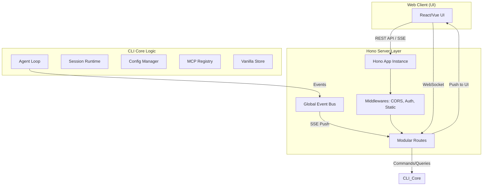
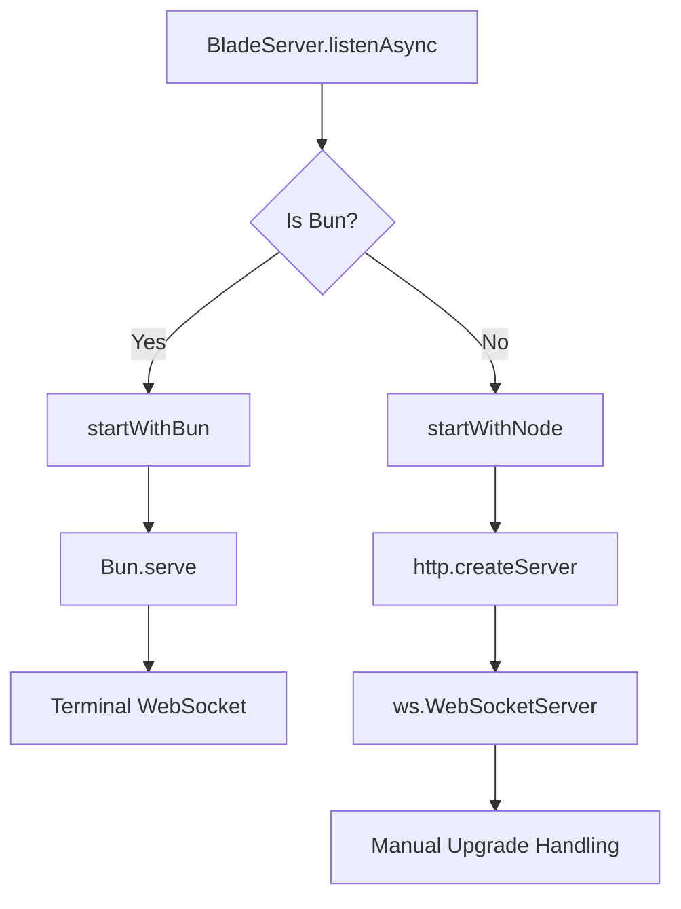
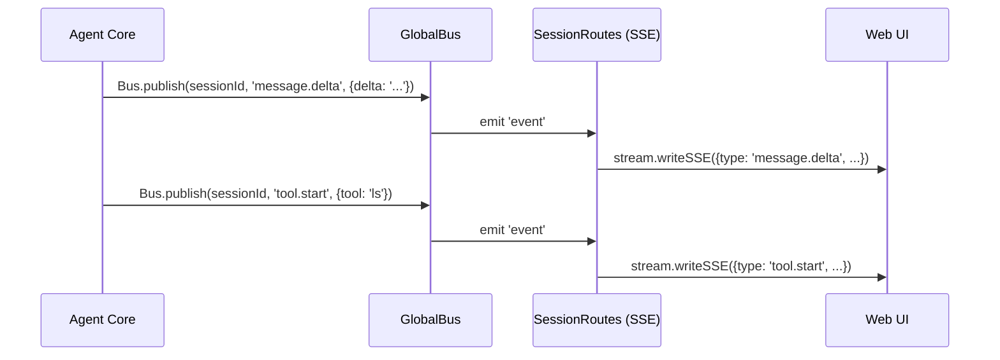
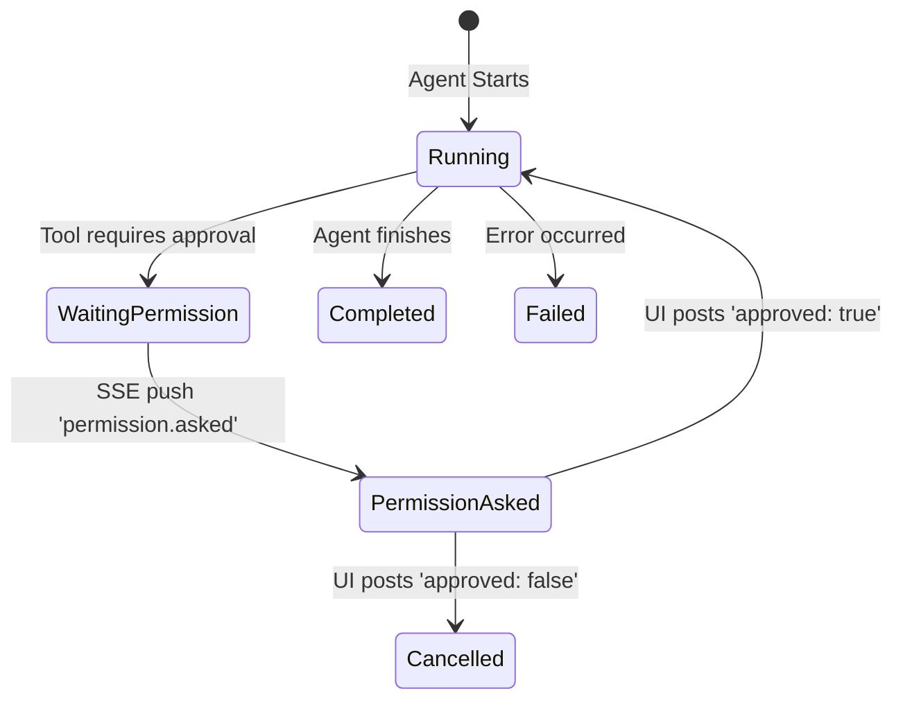

# Hono 服务端架构与 API 设计

## 目录

1. [模块概览](#模块概览)
2. [架构总览](#架构总览)
3. [服务初始化与运行时支持](#服务初始化与运行时支持)
4. [模块化路由系统](#模块化路由系统)
5. [实时事件总线机制 (Bus)](#实时事件总线机制-bus)
6. [核心 API 实现：会话与 Agent 交互](#核心-api-实现会话与-agent-交互)
7. [终端与 WebSocket 支持](#终端与-websocket-支持)
8. [错误处理与响应规范](#错误处理与响应规范)
9. [核心组件](#核心组件)
10. [文件参考](#文件参考)

## 模块概览

`packages/cli/src/server/` 模块是 Blade 的后端核心，基于 [Hono](https://hono.dev/) 框架构建。它不仅为 Web UI 提供 RESTful API 和实时通信支持，还充当了 CLI 核心逻辑（如 Agent 循环、配置管理、MCP 交互）与前端界面之间的桥梁。

该模块具有以下特征：
- **多运行时支持**：无缝兼容 Bun 和 Node.js 运行时，在 Bun 环境下利用其原生高性能 API，在 Node 环境下提供回退支持。
- **模块化路由**：将不同功能区域（会话、配置、模型、MCP 等）拆分为独立的路由模块。
- **实时事件驱动**：通过 `GlobalBus` 机制，将 Agent 的内部状态变化（如思考过程、工具调用、Token 使用）实时推送到 Web UI。
- **双协议支持**：结合了 HTTP (REST/SSE) 和 WebSocket (Terminal) 协议。

**统计信息**：
- **总文件数**：14 个 TypeScript 文件。
- **子目录**：`routes/`（包含 10 个功能路由模块）。
- **核心文件**：`server.ts` (入口), `bus.ts` (总线), `error.ts` (错误规范)。

## 架构总览

Blade 服务端架构采用了典型的分层模式，Hono 作为 Web 框架层，负责请求分发、中间件处理和响应封装。

以下图表展示了 Hono 服务端在整个 Blade 系统中的位置及其与其他核心组件的交互关系：



**架构解析**：
1. **外部接口层**：Web UI 通过 HTTP 请求调用 REST API，或通过 Server-Sent Events (SSE) 接收实时更新。终端功能则通过 WebSocket 直接连接。
2. **Hono 路由层**：`routes/` 目录下的模块根据功能路径（如 `/sessions`, `/configs`）处理请求。它们不直接实现业务逻辑，而是调用 CLI 核心层的服务。
3. **事件中枢**：`GlobalBus` 充当了 Agent 核心与 Web 路由之间的解耦层。Agent 在执行过程中发布事件，`SessionRoutes` 订阅这些事件并通过 SSE 转发。
4. **状态同步**：服务端通过 `vanilla.js` store 与 CLI 共享配置和模型状态，确保 Web 端的操作能立即反映在 CLI 环境中。

**Diagram sources**:
- [server.ts](file:///Users/bytedance/Documents/GitHub/Blade/packages/cli/src/server/server.ts)
- [bus.ts](file:///Users/bytedance/Documents/GitHub/Blade/packages/cli/src/server/bus.ts)

## 服务初始化与运行时支持

服务的初始化逻辑集中在 `server.ts` 中。Blade 采用了高度灵活的设计，能够根据当前运行环境（Bun 或 Node.js）自动选择最佳的启动方式。

### 1. Hono 实例创建与中间件
`createApp` 函数负责配置 Hono 实例。它按顺序注册了多个关键中间件：
- **错误处理**：通过 `app.onError` 统一捕获异常，并将 `BladeServerError` 转换为标准化的 JSON 响应。
- **身份验证**：支持基于环境变量 `BLADE_SERVER_PASSWORD` 的 Basic Auth。
- **日志记录**：记录每个请求的方法、路径、状态码和耗时。
- **CORS**：动态配置跨域白名单，默认允许本地开发环境和 Tauri 协议。
- **上下文注入**：从查询参数或 Header 中提取 `directory`（工作目录），并注入到 Hono 的 `c.set('directory', ...)` 中，供后续路由使用。

### 2. 多运行时启动逻辑
Blade 优先推荐使用 Bun 运行时，但也提供了 Node.js 的兼容实现。



在 Bun 环境下，`startWithBun` 直接调用 `Bun.serve`，并利用其内置的 WebSocket 支持。在 Node 环境下，`startWithNode` 则需要手动处理 HTTP 到 WebSocket 的 `upgrade` 协议转换，并使用 `stream.getReader()` 来处理 Hono 的流式响应。

**Section sources**:
- [server.ts:L63-L255](file:///Users/bytedance/Documents/GitHub/Blade/packages/cli/src/server/server.ts#L63-L255)
- [server.ts:L293-L474](file:///Users/bytedance/Documents/GitHub/Blade/packages/cli/src/server/server.ts#L293-L474)

## 模块化路由系统

为了保持代码的可维护性，Blade 将 API 划分为多个子路由。每个路由模块都是一个返回 `Hono` 实例的函数，在 `server.ts` 中通过 `app.route()` 挂载。

### 主要路由模块说明

| 路径 | 模块 | 职责 |
| :--- | :--- | :--- |
| `/global` | `GlobalRoutes` | 提供系统信息（版本、平台、CWD）和健康检查。 |
| `/sessions` | `SessionRoutes` | 会话生命周期管理、消息发送、SSE 事件流、Agent 交互。 |
| `/configs` | `ConfigRoutes` | 全局和项目级配置的读取与更新。 |
| `/mcp` | `McpRoutes` | MCP 服务器的注册、连接管理及工具发现。 |
| `/models` | `ModelsRoutes` | 模型供应商配置、可用模型列表管理。 |
| `/terminal` | `TerminalRoutes` | 终端状态查询及基于 WebSockets 的 PTY 交互。 |
| `/permissions` | `PermissionRoutes` | 处理 Agent 执行过程中的工具调用授权确认。 |

这种模块化设计允许开发者在不影响核心服务的情况下，轻松添加新的 API 端点或修改现有逻辑。例如，`ConfigRoutes` 直接与 `store/vanilla.js` 交互，而 `SessionRoutes` 则涉及复杂的异步 Agent 调度。

**Section sources**:
- [server.ts:L150-L159](file:///Users/bytedance/Documents/GitHub/Blade/packages/cli/src/server/server.ts#L150-L159)
- [routes/mcp.ts](file:///Users/bytedance/Documents/GitHub/Blade/packages/cli/src/server/routes/mcp.ts)

## 实时事件总线机制 (Bus)

`bus.ts` 中定义的 `GlobalBus` 是服务端的消息中枢。它是一个单例模式的 `EventEmitter`，专门用于在 Agent 核心逻辑与 Web 路由之间传递异步事件。

### 事件流转过程
当 Agent 在后台执行任务时（例如在 `SessionRoutes` 的 `executeRunAsync` 中），它会产生大量的中间状态。这些状态不会通过传统的 HTTP 响应返回（因为 HTTP 是请求-响应模式），而是通过 Bus 发布。



**关键点**：
- **解耦**：Agent 不需要知道 Web UI 的存在，它只需要向 `GlobalBus` 发送事件。
- **多订阅支持**：虽然目前主要由 SSE 路由订阅，但 `GlobalBus` 支持多个订阅者，方便未来扩展（如日志记录器、监控插件）。
- **会话隔离**：每个事件都携带 `sessionId`，SSE 处理器会根据当前连接的会话 ID 进行过滤，确保用户只收到属于自己会话的消息。

**Section sources**:
- [bus.ts](file:///Users/bytedance/Documents/GitHub/Blade/packages/cli/src/server/bus.ts)
- [routes/session.ts:L351-L416](file:///Users/bytedance/Documents/GitHub/Blade/packages/cli/src/server/routes/session.ts#L351-L416)

## 核心 API 实现：会话与 Agent 交互

`SessionRoutes` 是服务端最复杂的部分，它实现了 Blade 的核心交互逻辑：聊天会话管理与 Agent 异步执行。

### 1. 会话状态管理
服务端维护了一个内存中的 `sessions` Map，记录了当前活跃的会话信息。同时，它通过 `SessionService` 实现了会话的持久化存储。

### 2. Agent 执行循环 (executeRunAsync)
当用户通过 `POST /sessions/:sessionId/message` 发送消息时，服务端会启动一个异步任务：
1. **初始化 Runtime**：为会话创建 `SessionRuntime`。
2. **创建 Agent**：基于 Runtime 实例化 `Agent`。
3. **消费事件流**：调用 `agent.chatStream()`，并使用 `drainLoop` 递归消费产生的 `LoopEvent`。
4. **事件转发**：将 `content_delta`、`tool_start`、`tool_result` 等事件通过 `GlobalBus` 实时广播。

### 3. 工具授权流程 (Permission Handling)
Blade 的一个重要特性是“人在回路”（Human-in-the-loop）。当 Agent 尝试执行敏感操作（如修改文件）时，会触发授权流程。



在 `executeRunAsync` 中，`requestConfirmation` 函数会创建一个 Promise 并将其 `resolve` 方法暂存在 `activeRuns` 中。当 Web UI 调用 `POST /permissions/:permissionId` 时，服务端找到对应的 `resolve` 并执行，从而恢复 Agent 的运行。

**Section sources**:
- [routes/session.ts:L506-L684](file:///Users/bytedance/Documents/GitHub/Blade/packages/cli/src/server/routes/session.ts#L506-L684)
- [routes/permission.ts](file:///Users/bytedance/Documents/GitHub/Blade/packages/cli/src/server/routes/permission.ts)

## 终端与 WebSocket 支持

`TerminalRoutes` 提供了集成在 Web UI 中的终端功能。它通过 PTY（伪终端）技术，让用户可以直接在浏览器中执行 Shell 命令。

### 跨平台 PTY 实现
服务端通过 `spawnPty` 函数抽象了 PTY 的创建逻辑：
- **Bun 运行时**：使用 `bun-pty`。
- **Node.js 运行时**：使用 `node-pty`。

### WebSocket 架构
由于 Hono 的 WebSocket 支持在不同运行时下差异较大，Blade 采用了双重实现：
- **Bun**：使用 Hono 的 `upgradeWebSocket` 中间件。
- **Node.js**：在 `server.ts` 中手动捕获 HTTP `upgrade` 事件，并将其交给 `ws` 库处理。

```mermaid
graph LR
    UI[Web XTerm.js] <--> WS[WebSocket Connection]
    WS <--> Server[TerminalRoutes Handler]
    Server <--> PTY[PTY Process (zsh/bash/powershell)]
    PTY <--> OS[Operating System]
```

这种设计确保了无论在什么环境下，用户都能获得一致的终端体验，且支持自动调整窗口大小（Resize）和颜色输出（Truecolor）。

**Section sources**:
- [routes/terminal.ts](file:///Users/bytedance/Documents/GitHub/Blade/packages/cli/src/server/routes/terminal.ts)
- [server.ts:L412-L421](file:///Users/bytedance/Documents/GitHub/Blade/packages/cli/src/server/server.ts#L412-L421)

## 错误处理与响应规范

为了提升前端开发的体验，服务端实现了统一的错误处理机制。

### 1. 异常类层级
在 `error.ts` 中定义了 `BladeServerError` 及其子类：
- `NotFoundError` (404)：资源不存在。
- `BadRequestError` (400)：请求参数错误。
- `UnauthorizedError` (401)：鉴权失败。

### 2. 响应格式
所有的错误响应都遵循相同的 JSON 结构，由 Zod 模式 `ErrorResponse` 强制约束：

```typescript
{
  "error": {
    "code": "NOT_FOUND",
    "message": "Session not found: abc-123"
  }
}
```

在 `server.ts` 的 `app.onError` 中，任何未捕获的异常都会被转换为 `INTERNAL_ERROR` (500)，确保 API 永远返回结构化的数据，而不是 HTML 错误页面。

**Section sources**:
- [error.ts](file:///Users/bytedance/Documents/GitHub/Blade/packages/cli/src/server/error.ts)
- [server.ts:L66-L78](file:///Users/bytedance/Documents/GitHub/Blade/packages/cli/src/server/server.ts#L66-L78)

## 核心组件

本节列出了服务端模块中的关键类和接口。

### `BladeServer` (Namespace)
负责服务的生命周期管理。
- `listen(opts: ServerOptions)`: 启动服务。
- `getApp()`: 获取单例 Hono 实例。
- `stop()`: 优雅关闭服务。

### `GlobalBus` (Class)
单例事件总线。
- `publish(sessionId, type, properties)`: 发布事件。
- `subscribe(callback)`: 订阅事件。

### `RunState` (Interface)
描述一个正在运行的 Agent 任务的状态。
- `status`: `running`, `waiting_permission`, `completed` 等。
- `abortController`: 用于取消任务。
- `pendingPermission`: 存储等待中的授权请求。

## 文件参考

以下是本模块涉及的核心源文件：

- [server.ts](file:///Users/bytedance/Documents/GitHub/Blade/packages/cli/src/server/server.ts): 服务启动入口与中间件配置。
- [bus.ts](file:///Users/bytedance/Documents/GitHub/Blade/packages/cli/src/server/bus.ts): 服务端事件总线实现。
- [error.ts](file:///Users/bytedance/Documents/GitHub/Blade/packages/cli/src/server/error.ts): 错误定义与响应规范。
- [routes/session.ts](file:///Users/bytedance/Documents/GitHub/Blade/packages/cli/src/server/routes/session.ts): 核心会话与 Agent 交互路由。
- [routes/terminal.ts](file:///Users/bytedance/Documents/GitHub/Blade/packages/cli/src/server/routes/terminal.ts): 终端 WebSocket 路由。
- [routes/config.ts](file:///Users/bytedance/Documents/GitHub/Blade/packages/cli/src/server/routes/config.ts): 配置管理路由。
- [routes/mcp.ts](file:///Users/bytedance/Documents/GitHub/Blade/packages/cli/src/server/routes/mcp.ts): MCP 交互路由。
- [routes/permission.ts](file:///Users/bytedance/Documents/GitHub/Blade/packages/cli/src/server/routes/permission.ts): 权限管理路由。
- [routes/models.ts](file:///Users/bytedance/Documents/GitHub/Blade/packages/cli/src/server/routes/models.ts): 模型列表路由。
- [routes/global.ts](file:///Users/bytedance/Documents/GitHub/Blade/packages/cli/src/server/routes/global.ts): 全局状态与健康检查。
