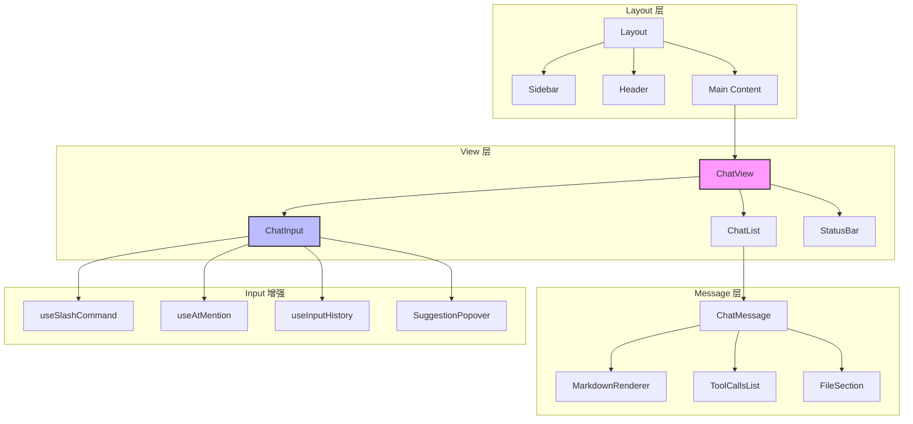
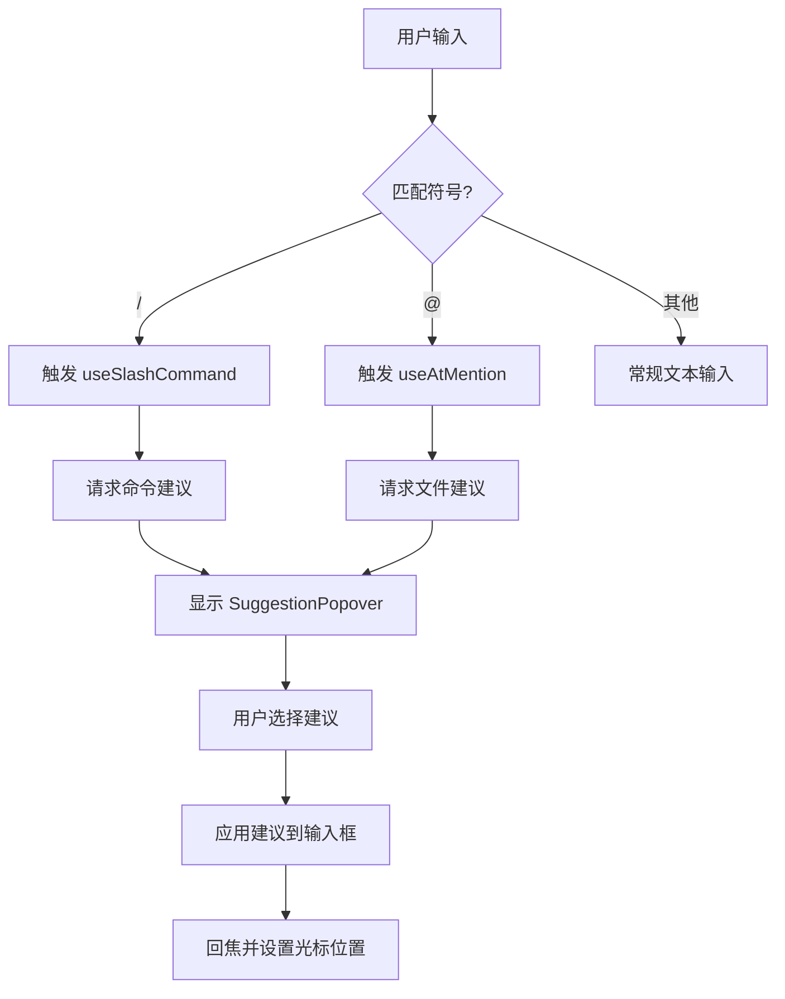
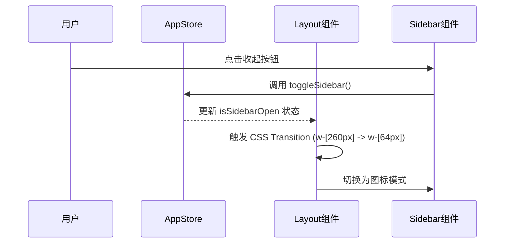

# Web UI 组件库与交互实现

## 目录

1. [模块概览](#模块概览)
2. [简介](#简介)
3. [架构概览](#架构概览)
4. [核心组件实现](#核心组件实现)
   - [ChatView：聊天主视图](#chatview聊天主视图)
   - [ChatInput：增强型交互输入框](#chatinput增强型交互输入框)
   - [ChatMessage：复杂消息渲染系统](#chatmessage复杂消息渲染系统)
   - [MarkdownRenderer：内容呈现与高亮](#markdownrenderer内容呈现与高亮)
5. [交互逻辑与自定义 Hooks](#交互逻辑与自定义-hooks)
   - [斜杠命令与 @提及实现](#斜杠命令与-提及实现)
   - [输入历史管理](#输入历史管理)
6. [布局与功能模块](#布局与功能模块)
   - [响应式布局框架](#响应式布局框架)
   - [配置与模型管理](#配置与模型管理)
7. [UI 基础组件库](#ui-基础组件库)
8. [文件引用](#文件引用)

## 模块概览

Blade 的 Web UI 模块是一个高度集成的 AI 编程助手界面，旨在提供类似 IDE 的流畅交互体验。该模块主要位于 `packages/cli/web/src/` 目录下，由组件库（`components/`）和交互逻辑（`hooks/`）两大部分组成。

**统计信息：**
- **总文件数**：约 27 个核心文件（包含 24 个组件文件和 3 个自定义 Hook）。
- **核心目录结构**：
  - `components/chat/`：聊天系统的核心实现，包含输入、列表、消息渲染等。
  - `components/layout/`：应用整体布局与侧边栏。
  - `components/settings/`：设置面板与模型配置。
  - `components/ui/`：基于 Radix UI/shadcn 构建的原子组件。
  - `hooks/`：封装了斜杠命令、文件提及和输入历史等复杂交互逻辑。

本章节将深入探讨这些组件的实现机制，特别是如何处理 AI 助手的复杂响应（如工具调用、文件修改建议）以及如何实现高性能的实时交互。

## 简介

Blade Web UI 是用户与 AI 编程助手交互的核心窗口。与传统的聊天机器人界面不同，Blade 的 UI 需要处理大量的编程上下文，包括代码片段、文件路径、终端输出以及复杂的工具调用流程。其设计目标是：

1.  **高性能响应**：在 AI 流式输出大量代码或工具调用信息时，保持界面的流畅性。
2.  **丰富的上下文支持**：通过 `@` 提及文件和 `/` 触发命令，让用户能快速构建复杂的 Prompt。
3.  **透明的任务执行**：清晰展示 AI 的思考过程（Thinking）、工具调用（Tool Calls）以及文件修改建议（Diffs）。
4.  **响应式与易用性**：适配不同屏幕尺寸，并提供直观的设置与管理界面。

该模块采用了 React 框架，结合 Tailwind CSS 进行样式管理，并利用 Zustand 进行状态同步，确保了 UI 与后端服务的高效通信。

## 架构概览

Blade Web UI 采用了典型的层级化组件架构。最外层是 `Layout`，负责整体的工作区组织；核心区域由 `ChatView` 驱动，它作为中枢协调消息流和用户输入。

下面的图表展示了 Web UI 的核心组件层级与数据流向：



**架构解析**：
1.  **Layout 层**：定义了应用的外壳，包括响应式的侧边栏（`Sidebar`）和顶部状态栏（`Header`）。它还负责按需加载功能模态框（如 `SettingsModal`）。
2.  **View 层**：`ChatView` 是业务逻辑的中心，它通过 `useSessionStore` 与后端通信，并将状态分发给 `ChatList` 和 `ChatInput`。
3.  **Message 层**：`ChatMessage` 是最复杂的渲染单元，它不仅处理文本，还根据消息元数据动态渲染工具调用、思考过程和文件修改预览。
4.  **Input 增强**：`ChatInput` 通过多个自定义 Hook 实现了类似 IDE 的自动补全功能。

**Section sources**:
- [Layout.tsx](file:///Users/bytedance/Documents/GitHub/Blade/packages/cli/web/src/components/layout/Layout.tsx)
- [ChatView.tsx](file:///Users/bytedance/Documents/GitHub/Blade/packages/cli/web/src/components/chat/ChatView.tsx)

## 核心组件实现

### ChatView：聊天主视图

`ChatView` 是整个聊天界面的容器组件，它主要负责从 `useSessionStore` 中提取状态并传递给子组件。它的生命周期管理包括加载会话、初始化临时会话以及在组件卸载时清理事件订阅。

```typescript
export function ChatView() {
  const {
    messages,
    currentSessionId,
    isStreaming,
    isLoading,
    error,
    loadSessions,
    sendMessage,
    abortSession,
    // ...
  } = useSessionStore();

  useEffect(() => {
    loadSessions();
  }, [loadSessions]);

  // 处理发送逻辑，将附件转换为后端要求的格式
  const handleSend = async (payload: {
    content: string;
    attachments: ComposerImageAttachment[];
  }) => {
    await sendMessage({
      content: payload.content,
      attachments: payload.attachments.map((attachment) => ({
        type: 'image' as const,
        content: attachment.dataUrl,
        mimeType: attachment.mimeType,
        name: attachment.name,
      })),
    });
  };

  return (
    <div className="flex flex-col h-full">
      {error && <ErrorBanner error={error} onClose={clearError} />}
      <ChatList messages={messages} isLoading={isLoading} />
      <ChatInput onSend={handleSend} onAbort={abortSession} isStreaming={isStreaming} />
      <StatusBar />
    </div>
  );
}
```

`ChatView` 的设计体现了“容器组件与展示组件分离”的原则。它本身不处理复杂的 UI 细节，而是专注于数据流的调度。

### ChatInput：增强型交互输入框

`ChatInput` 是 Blade UI 中交互最密集的部分。它不仅是一个文本框，还是一个集成了文件提及、斜杠命令、图片上传和模型配置的多功能控制台。

**关键特性实现**：
-   **自动调整高度**：通过 `useEffect` 监听输入内容，动态修改 `textarea` 的 `scrollHeight`，最高限制在 200px。
-   **附件处理**：支持通过粘贴（`onPaste`）或文件选择器上传图片，利用 `FileReader` 将图片转换为 Base64 格式进行预览和发送。
-   **快捷键支持**：实现了 `Enter` 发送、`Shift+Enter` 换行，以及在提示框显示时通过方向键选择建议。



在 `ChatInput` 中，建议弹出框（`SuggestionPopover`）的显示逻辑非常精妙。它会根据光标位置计算弹出位置，并确保在多个 Hook 同时触发时（虽然理论上不会）有正确的优先级。

### ChatMessage：复杂消息渲染系统

`ChatMessage` 是 Blade UI 的核心展示单元。由于 AI 助手的响应可能包含多种非文本内容，该组件被拆分为多个专门的子区域：

1.  **ThinkingSection**：展示 AI 的思考过程，通常是折叠状态，用户可以点击展开查看原始的推理逻辑。
2.  **ToolCallsList**：这是最关键的部分。每个工具调用（如 `Write` 或 `SearchReplace`）都被渲染为一个可折叠的卡片，显示工具名、参数和输出结果。
3.  **ConfirmationSection**：当工具执行需要用户授权时（如修改敏感文件），会渲染一个确认面板，展示 Diff 并提供“允许一次”、“会话允许”或“拒绝”的选项。
4.  **ChangedFilesSection**：在工具执行完成后，汇总所有被修改的文件，点击文件名可直接触发 `FilePreview` 面板。

```typescript
function AgentMessageContent({ message }: { message: Message }) {
  const { thinkingContent, textBefore, toolCalls, confirmation, textAfter } = message.agentContent;

  return (
    <div className="space-y-3">
      {thinkingContent && <ThinkingSection content={thinkingContent} />}
      {textBefore && <MarkdownBlock content={textBefore} />}
      <ToolCallsList toolCalls={toolCalls} />
      {confirmation && <ConfirmationSection confirmation={confirmation} />}
      {textAfter && <MarkdownBlock content={textAfter} />}
    </div>
  );
}
```

这种结构化的渲染方式确保了即便在执行复杂的自动化任务时，用户也能清晰地追踪 AI 的每一步操作。

### MarkdownRenderer：内容呈现与高亮

为了提供最佳的代码阅读体验，`MarkdownRenderer` 对标准的 Markdown 渲染进行了深度定制。

-   **延迟加载**：代码高亮组件 `CodeBlockHighlighter` 采用 `lazy` 加载，减少首屏包体积。
-   **语法高亮**：支持多种编程语言，并能根据应用的主题（深色/浅色）自动切换高亮配色。
-   **交互增强**：每个代码块都配有“复制”按钮，并在头部显示语言标识。
-   **GFM 支持**：通过 `remark-gfm` 插件支持表格、任务列表等高级语法。

**Section sources**:
- [ChatMessage.tsx](file:///Users/bytedance/Documents/GitHub/Blade/packages/cli/web/src/components/chat/ChatMessage.tsx)
- [MarkdownRenderer.tsx](file:///Users/bytedance/Documents/GitHub/Blade/packages/cli/web/src/components/chat/MarkdownRenderer.tsx)
- [ChatInput.tsx](file:///Users/bytedance/Documents/GitHub/Blade/packages/cli/web/src/components/chat/ChatInput.tsx)

## 交互逻辑与自定义 Hooks

### 斜杠命令与 @提及实现

这两个功能是通过 `useSlashCommand` 和 `useAtMention` 两个 Hook 协同完成的。它们的核心逻辑相似：监听输入字符串的变化，利用正则表达式识别触发字符，并根据当前光标位置提取查询关键词。

```typescript
// useSlashCommand.ts 核心逻辑
const extractSlashCommand = (input: string, cursorPosition: number): SlashCommandMatch => {
  if (!input.startsWith('/')) {
    return { hasQuery: false, query: '', startIndex: -1, endIndex: -1 }
  }
  // ... 提取逻辑
}
```

**实现细节**：
-   **防抖处理**：为了减轻后端压力，这两个 Hook 都内置了防抖（Debounce）逻辑（默认 150ms-200ms）。
-   **光标感知**：只有当光标位于触发字符所在的单词内时，才会触发建议列表。
-   **自动补全**：选中建议后，Hook 会计算新的字符串内容和光标应处的位置，并利用 `requestAnimationFrame` 在 DOM 更新后恢复焦点。

### 输入历史管理

`useInputHistory` Hook 实现了类似终端的“上箭头查看历史”功能。它将用户发送过的消息存储在本地，当用户在输入框为空或光标位于行首按下 `ArrowUp` 时，会自动填入上一条消息。这极大地提升了重复调试时的操作效率。

**Section sources**:
- [useSlashCommand.ts](file:///Users/bytedance/Documents/GitHub/Blade/packages/cli/web/src/hooks/useSlashCommand.ts)
- [useAtMention.ts](file:///Users/bytedance/Documents/GitHub/Blade/packages/cli/web/src/hooks/useAtMention.ts)

## 布局与功能模块

### 响应式布局框架

`Layout` 组件定义了 Blade 的整体视觉结构。它采用了 Flex 布局，左侧为可收起的 `Sidebar`，右侧为内容区。



这种响应式设计确保了在小屏幕设备上也能有良好的可用性，同时在宽屏显示器上能充分利用空间展示 `FilePreview`。

### 配置与模型管理

`SettingsModal` 是用户配置中心。它通过选项卡组织内容：
-   **General**：设置界面语言、主题和侧边栏模式。
-   **Models**：这是最核心的配置项。用户可以添加多个 AI 模型供应商（如 OpenAI, Anthropic, Gemini 等），管理 API Key 和 Base URL。
-   **Shortcuts**：展示应用内置的所有快捷键，帮助用户提升操作效率。

模型管理采用了分组展示的方式，按供应商对模型进行归类，并实时显示连接状态（Connected/Not Connected）。

**Section sources**:
- [Layout.tsx](file:///Users/bytedance/Documents/GitHub/Blade/packages/cli/web/src/components/layout/Layout.tsx)
- [SettingsModal.tsx](file:///Users/bytedance/Documents/GitHub/Blade/packages/cli/web/src/components/settings/SettingsModal.tsx)

## UI 基础组件库

Blade 的 UI 基础组件库位于 `components/ui/` 目录下，遵循了 **Atomic Design** 原则。这些组件大多是基于 Radix UI 的原始组件进行样式的二次封装，确保了无障碍支持（Accessibility）和一致的视觉风格。

**核心组件清单**：
-   **Button**：支持多种变体（default, ghost, icon, destructive）。
-   **Dialog**：用于模态框，支持动画过渡和点击遮罩关闭。
-   **Popover**：用于下拉菜单和建议列表，具备自动定位功能。
-   **ScrollArea**：自定义滚动条，确保在不同操作系统下视觉一致。
-   **Textarea**：增强型文本输入，支持自动高度。

这些组件共同构成了 Blade 简洁、专业且具有黑客风格（Mono 字体、高对比度）的 UI 语言。

## 文件引用

以下是本章节涉及的关键源代码文件：

- [ChatView.tsx](file:///Users/bytedance/Documents/GitHub/Blade/packages/cli/web/src/components/chat/ChatView.tsx) - 聊天主视图容器
- [ChatInput.tsx](file:///Users/bytedance/Documents/GitHub/Blade/packages/cli/web/src/components/chat/ChatInput.tsx) - 增强型输入框实现
- [ChatMessage.tsx](file:///Users/bytedance/Documents/GitHub/Blade/packages/cli/web/src/components/chat/ChatMessage.tsx) - 消息渲染逻辑
- [MarkdownRenderer.tsx](file:///Users/bytedance/Documents/GitHub/Blade/packages/cli/web/src/components/chat/MarkdownRenderer.tsx) - Markdown 渲染引擎
- [Layout.tsx](file:///Users/bytedance/Documents/GitHub/Blade/packages/cli/web/src/components/layout/Layout.tsx) - 整体布局框架
- [SettingsModal.tsx](file:///Users/bytedance/Documents/GitHub/Blade/packages/cli/web/src/components/settings/SettingsModal.tsx) - 设置与模型管理
- [useSlashCommand.ts](file:///Users/bytedance/Documents/GitHub/Blade/packages/cli/web/src/hooks/useSlashCommand.ts) - 斜杠命令 Hook
- [useAtMention.ts](file:///Users/bytedance/Documents/GitHub/Blade/packages/cli/web/src/hooks/useAtMention.ts) - 文件提及 Hook
- [useInputHistory.ts](file:///Users/bytedance/Documents/GitHub/Blade/packages/cli/web/src/hooks/useInputHistory.ts) - 输入历史 Hook
- [SuggestionPopover.tsx](file:///Users/bytedance/Documents/GitHub/Blade/packages/cli/web/src/components/chat/SuggestionPopover.tsx) - 建议弹出框组件
- [CodeBlockHighlighter.tsx](file:///Users/bytedance/Documents/GitHub/Blade/packages/cli/web/src/components/chat/CodeBlockHighlighter.tsx) - 代码高亮实现
- [Sidebar.tsx](file:///Users/bytedance/Documents/GitHub/Blade/packages/cli/web/src/components/layout/Sidebar.tsx) - 侧边栏组件
