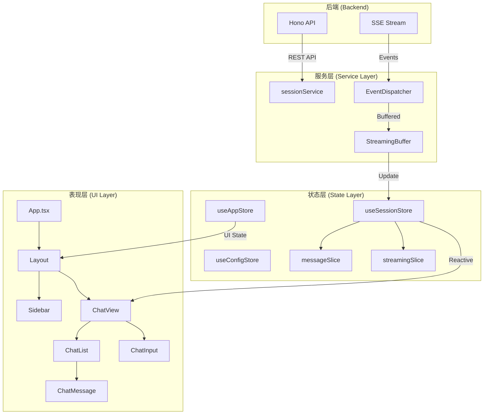
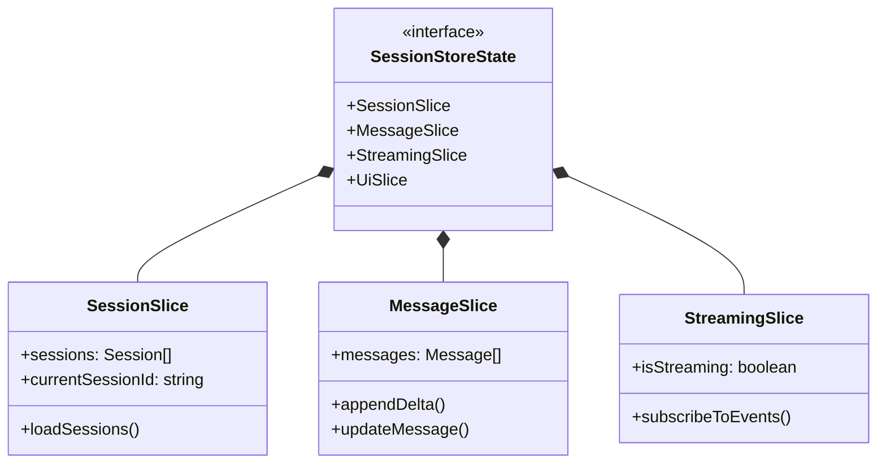
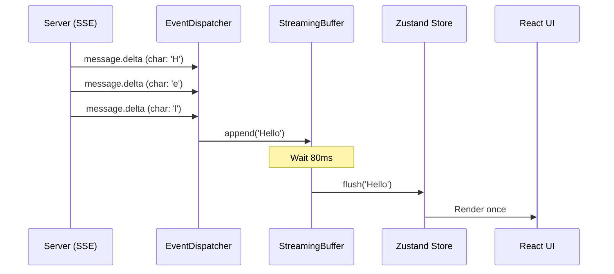
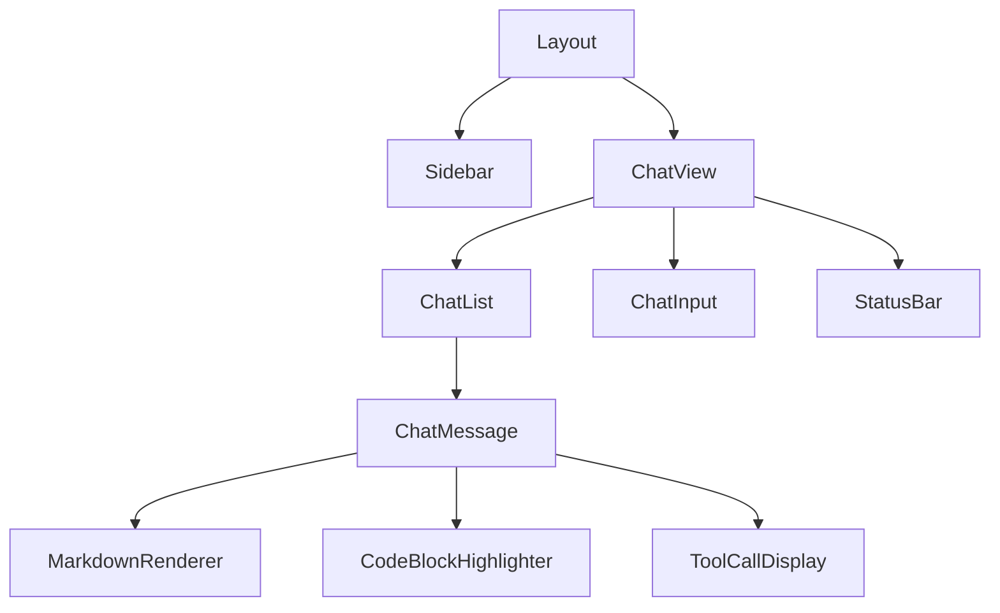

# Web 前端架构与状态管理

## 目录
1. [模块概览](#模块概览)
2. [技术栈与工程化配置](#技术栈与工程化配置)
3. [前端整体架构设计](#前端整体架构设计)
4. [状态管理架构：基于 Zustand 的分片设计](#状态管理架构基于-zustand-的分片设计)
5. [会话状态深度解析](#会话状态深度解析)
6. [流式消息处理与聚合机制](#流式消息处理与聚合机制)
7. [服务层设计与 API 交互](#服务层设计与-api-交互)
8. [核心组件实现分析](#核心组件实现分析)
9. [React 19 特性集成与并发模型](#react-19-特性集成与并发模型)
10. [文件参考](#文件参考)

## 模块概览

Blade Web UI 是 Blade 项目的图形化前端界面，旨在为用户提供一个直观、响应迅速且功能丰富的 AI 交互环境。该模块不仅是一个简单的聊天界面，更是一个集成了模型配置、会话管理、流式输出处理、工具调用展示以及多智能体协作状态监控的复杂单页应用（SPA）。

在本次 Scope Assessment 中，我们对 `packages/cli/web/src/` 目录进行了全面探索：
- **总文件数**：共发现 49 个核心源码文件。
- **子模块分布**：
    - `components/` (25+ 文件)：涵盖了聊天、布局、设置、终端、MCP、预览等功能组件。
    - `store/` (15+ 文件)：基于 Zustand 的状态管理中心，包括全局应用状态、配置状态和复杂的会话分片状态。
    - `services/` (2 文件)：封装了与 Hono 后端的 API 交互逻辑。
    - `hooks/` (3 文件)：提供了斜杠命令、@提及等交互增强功能。
    - `lib/` (2 文件)：通用工具类和编辑器主题配置。

本章节将深入探讨 Blade Web UI 的架构设计，重点分析其如何利用 React 19 的并发特性与 Zustand 的灵活性来处理高频的流式数据更新，并详细解析消息聚合算法如何将零散的 SSE 事件转化为结构化的用户界面。

## 技术栈与工程化配置

Blade Web UI 采用了现代化的前端技术栈，确保了开发效率与运行时性能的平衡。

### 核心技术栈
- **React 19**: 利用其最新的并发渲染能力和更简洁的 Hooks API。
- **Vite**: 作为构建工具和开发服务器，提供极速的热更新（HMR）体验。
- **Zustand**: 轻量级且强大的状态管理库，支持分片（Slices）模式。
- **Tailwind CSS**: 原子化 CSS 框架，配合 `lucide-react` 图标库构建响应式 UI。
- **Radix UI**: 提供无障碍（Accessibility）友好的 UI 组件原语（如 Dialog, Popover）。
- **Monaco Editor / XTerm.js**: 用于代码高亮显示和终端仿真。

### 工程化配置分析
在 `vite.config.ts` 中，项目进行了精细化的构建优化和代理配置：

```typescript
// packages/cli/web/vite.config.ts 关键配置
export default defineConfig(({ mode }) => {
  // ...
  return {
    plugins: [react()],
    build: {
      outDir: '../dist/web',
      rollupOptions: {
        output: {
          manualChunks(id) {
            // 细粒度的代码拆分，优化首屏加载
            if (id.includes('/react/')) return 'vendor-react'
            if (id.includes('/@monaco-editor/')) return 'vendor-monaco'
            if (id.includes('/react-markdown/')) return 'vendor-markdown'
            // ...
          },
        },
      },
    },
    server: {
      proxy: {
        // 将 API 请求代理到 Hono 后端
        '/sessions': { target: apiTarget, changeOrigin: true },
        '/terminal/ws': { target: apiTarget.replace('http', 'ws'), ws: true },
        // ...
      },
    },
  }
})
```

通过 `manualChunks`，项目将大型依赖（如 Monaco Editor 和 Markdown 解析器）拆分为独立的 Vendor 包，利用浏览器缓存减少重复下载。同时，开发环境下的代理配置确保了前端开发与后端服务的无缝衔接，解决了跨域问题。

**Section sources**:
- [vite.config.ts](file:///Users/bytedance/Documents/GitHub/Blade/packages/cli/web/vite.config.ts)
- [package.json](file:///Users/bytedance/Documents/GitHub/Blade/packages/cli/web/package.json)

## 前端整体架构设计

Blade Web UI 采用了清晰的分层架构设计，将 UI 表现层、状态管理层和服务通信层解耦。

### 架构分层图

下图展示了数据从后端流向 UI 的全过程。



该架构的核心在于**状态驱动 UI**。表现层组件不直接处理业务逻辑或 API 调用，而是通过订阅 Zustand Store 中的状态进行渲染。服务层负责与后端通信，并将原始数据（Raw Data）或流式事件（SSE Events）通过分发器（Dispatcher）和缓冲器（Buffer）处理后，更新到状态层。

### 组件组织方式
- **Layout**: 定义了应用的主框架，包括侧边栏和主内容区域。
- **ChatView**: 聊天功能的核心容器，协调消息列表、输入框和状态栏。
- **Store**: 存放所有持久化和临时状态，通过自定义 Hooks 暴露给组件。
- **Services**: 纯函数模块，封装了所有 HTTP 请求和 SSE 订阅逻辑。

**Section sources**:
- [App.tsx](file:///Users/bytedance/Documents/GitHub/Blade/packages/cli/web/src/App.tsx)
- [main.tsx](file:///Users/bytedance/Documents/GitHub/Blade/packages/cli/web/src/main.tsx)
- [components/layout/Layout.tsx](file:///Users/bytedance/Documents/GitHub/Blade/packages/cli/web/src/components/layout/Layout.tsx)

## 状态管理架构：基于 Zustand 的分片设计

Blade 选择了 Zustand 而不是 Redux 或 Context API，主要是因为其轻量、无样板代码且对 React 并发特性支持良好。

### 多 Store 设计
项目根据功能边界划分了多个 Store：
1.  **`useAppStore`**: 管理 UI 的开闭状态（侧边栏、设置面板、终端等）。
2.  **`useConfigStore`**: 管理模型列表、当前选中的模型以及全局配置。
3.  **`useSettingsStore`**: 管理用户偏好设置（如主题、字体大小）。
4.  **`useSessionStore`**: 最复杂的 Store，管理聊天会话、消息列表和流式状态。

### 状态分片 (Slices) 模式
为了防止 `useSessionStore` 变得过于庞大，项目采用了分片模式。每个分片负责一部分逻辑，最后合并为一个完整的 Store。



这种设计使得代码职责明确，便于维护和测试。例如，`messageSlice.ts` 只关注消息的增删改查，而 `streamingSlice.ts` 专注处理 SSE 连接和订阅。

**Section sources**:
- [store/AppStore.ts](file:///Users/bytedance/Documents/GitHub/Blade/packages/cli/web/src/store/AppStore.ts)
- [store/ConfigStore.ts](file:///Users/bytedance/Documents/GitHub/Blade/packages/cli/web/src/store/ConfigStore.ts)
- [store/session/index.ts](file:///Users/bytedance/Documents/GitHub/Blade/packages/cli/web/src/store/session/index.ts)

## 会话状态深度解析

会话状态是 Blade Web UI 的灵魂，它承载了所有 AI 交互的上下文和结果。

### 消息模型 (Message Model)
Blade 定义了一套丰富的消息结构，能够支持多种内容类型：

```typescript
// packages/cli/web/src/store/session/types.ts
export interface Message {
  id: string
  role: 'user' | 'assistant' | 'system' | 'tool'
  content: string | MessageContentPart[]
  timestamp: number
  agentContent?: AgentResponseContent // 仅 assistant 角色拥有
  metadata?: Record<string, any>
}

export interface AgentResponseContent {
  textBefore: string    // 工具调用前的文本
  toolCalls: ToolCallInfo[] // 包含的工具调用
  textAfter: string     // 工具调用后的文本
  thinkingContent: string // 模型思考过程
  subagent: SubagentProgress | null // 子智能体进度
  // ...
}
```

### 消息切片 (MessageSlice) 实现
`messageSlice` 提供了精细化的操作函数，用于处理流式更新。例如 `appendDelta` 函数：

```typescript
// packages/cli/web/src/store/session/slices/messageSlice.ts
appendDelta: (id, delta, position) =>
  set((state) => ({
    messages: state.messages.map((m) => {
      if (m.id !== id) return m
      const agentContent = m.agentContent || createEmptyAgentContent()
      if (position === 'before') {
        return {
          ...m,
          agentContent: { ...agentContent, textBefore: agentContent.textBefore + delta },
        }
      } else {
        return {
          ...m,
          agentContent: { ...agentContent, textAfter: agentContent.textAfter + delta },
        }
      }
    }),
  })),
```

这种基于 `position` 的追加机制，允许 UI 正确处理“文本 -> 工具调用 -> 文本”这种交织的输出结构。

**Section sources**:
- [store/session/types.ts](file:///Users/bytedance/Documents/GitHub/Blade/packages/cli/web/src/store/session/types.ts)
- [store/session/slices/messageSlice.ts](file:///Users/bytedance/Documents/GitHub/Blade/packages/cli/web/src/store/session/slices/messageSlice.ts)

## 流式消息处理与聚合机制

处理 LLM 的流式输出是 Blade 前端最具挑战性的部分。它需要平衡实时性（用户希望立即看到字蹦出来）和性能（高频更新会导致 React 渲染压力过大）。

### 流式处理流水线



### 1. 事件分发 (EventDispatcher)
`createEventDispatcher` 是 SSE 事件的入口点。它不仅负责根据事件类型调用不同的处理器，还承担了“节流”的任务。对于 `message.delta` 等高频事件，它不会立即更新 Store，而是将其推入缓冲器。

### 2. 流式缓冲器 (StreamingBuffer)
`StreamingBuffer` 是一个纯类实现，不依赖 React。它通过 `setTimeout` 实现了一个微小的延迟窗口（默认 80ms），将该窗口内的所有字符合并后一次性提交给 Store。

> **设计决策**：为什么是 80ms？
> 80ms 接近于人类视觉感知的极限，同时又能显著减少 React 的重绘次数。在极快的模型输出下，如果不做缓冲，每秒可能会产生数十次重绘，导致低配设备浏览器假死。

### 3. 消息聚合 (aggregateMessages)
当用户刷新页面或切换会话时，前端会从后端拉取全量的历史消息。此时，`aggregateMessages.ts` 发挥作用。它将后端返回的扁平化消息数组（Raw Messages）聚合为前端所需的结构化对象。

**聚合逻辑核心**：
- 将连续的 `assistant` 消息片段合并。
- 将 `tool` 角色的消息关联到对应的 `assistant` 工具调用条目中。
- 解析 `metadata` 中的子智能体状态（Subagent Progress）。

**Section sources**:
- [store/session/handlers/eventHandlers.ts](file:///Users/bytedance/Documents/GitHub/Blade/packages/cli/web/src/store/session/handlers/eventHandlers.ts)
- [store/session/handlers/streamingBuffer.ts](file:///Users/bytedance/Documents/GitHub/Blade/packages/cli/web/src/store/session/handlers/streamingBuffer.ts)
- [store/session/utils/aggregateMessages.ts](file:///Users/bytedance/Documents/GitHub/Blade/packages/cli/web/src/store/session/utils/aggregateMessages.ts)

## 服务层设计与 API 交互

`sessionService.ts` 封装了所有与 Hono 后端的通信细节，为 Store 提供干净的 Promise 接口。

### 关键功能实现
- **SSE 订阅**: 实现了带自动重连和心跳检查的 `subscribeEvents` 函数。
- **内容归一化**: `normalizeContent` 处理后端可能返回的字符串或多模态内容数组。
- **权限响应**: 封装了 `respondToConfirmation` 和 `respondToQuestion`，用于处理 AI 提出的操作申请。

```typescript
// packages/cli/web/src/services/sessionService.ts
subscribeEvents: (sessionId, onEvent, options) => {
  // ...
  const connect = () => {
    eventSource = new EventSource(`/sessions/${sessionId}/events`);
    eventSource.onmessage = (e) => {
      const event = JSON.parse(e.data);
      if (event.type === 'heartbeat') return;
      onEvent(event);
    };
    // 错误处理与指数退避重连逻辑
  };
  // ...
}
```

服务层通过 `EventSource` 建立长连接，并在接收到消息时触发回调。这种“推”模式是实现流式交互的基础。

**Section sources**:
- [services/sessionService.ts](file:///Users/bytedance/Documents/GitHub/Blade/packages/cli/web/src/services/sessionService.ts)

## 核心组件实现分析

表现层组件通过 Hooks 与状态层连接，实现了高度的响应式。

### 组件层级图



### 1. ChatView
`ChatView.tsx` 是聊天界面的主控制器。它负责在组件挂载时订阅 SSE 事件，并在卸载时取消订阅。它还协调了滚动条自动置底的逻辑。

### 2. ChatMessage
`ChatMessage.tsx` 负责渲染单条消息。它会根据消息角色（User/Assistant）切换不同的样式，并递归地渲染 `agentContent` 中的工具调用和思考过程。

### 3. MarkdownRenderer
利用 `react-markdown` 渲染 AI 输出。为了提升体验，Blade 定制了 `CodeBlockHighlighter`，支持语法高亮和一键复制代码。

**Section sources**:
- [components/chat/ChatView.tsx](file:///Users/bytedance/Documents/GitHub/Blade/packages/cli/web/src/components/chat/ChatView.tsx)
- [components/chat/ChatMessage.tsx](file:///Users/bytedance/Documents/GitHub/Blade/packages/cli/web/src/components/chat/ChatMessage.tsx)

## React 19 特性集成与并发模型

Blade Web UI 充分利用了 React 19 的新特性来提升用户体验。

### 并发渲染 (Concurrent Rendering)
通过将流式更新放在较低优先级的任务中，React 19 能够确保输入框的打字响应（高优先级）不会被大量的消息重绘（中优先级）所阻塞。

### 状态更新模式
项目大量使用了 Zustand 的 `subscribe` 功能和 React 的 `useSyncExternalStore`（由 Zustand 内部处理），确保了状态更新与渲染周期的同步，避免了在复杂流式场景下可能出现的“撕裂”现象。

> **注意**：在处理流式输出时，Blade 避免了在循环中直接调用组件内的 `setState`，而是通过 Zustand 的 `set` 函数在外部更新 Store。这配合 React 19 的自动批处理（Automatic Batching），极大地减少了不必要的渲染。

**Section sources**:
- [main.tsx](file:///Users/bytedance/Documents/GitHub/Blade/packages/cli/web/src/main.tsx)
- [store/session/index.ts](file:///Users/bytedance/Documents/GitHub/Blade/packages/cli/web/src/store/session/index.ts)

## 文件参考

以下是 Blade Web UI 前端架构涉及的核心文件列表：

- **入口与配置**
    - [main.tsx](file:///Users/bytedance/Documents/GitHub/Blade/packages/cli/web/src/main.tsx): 应用入口。
    - [App.tsx](file:///Users/bytedance/Documents/GitHub/Blade/packages/cli/web/src/App.tsx): 根组件。
    - [vite.config.ts](file:///Users/bytedance/Documents/GitHub/Blade/packages/cli/web/vite.config.ts): 构建与代理配置。

- **状态管理 (Store)**
    - [store/AppStore.ts](file:///Users/bytedance/Documents/GitHub/Blade/packages/cli/web/src/store/AppStore.ts): 全局 UI 状态。
    - [store/ConfigStore.ts](file:///Users/bytedance/Documents/GitHub/Blade/packages/cli/web/src/store/ConfigStore.ts): 模型与配置状态。
    - [store/session/index.ts](file:///Users/bytedance/Documents/GitHub/Blade/packages/cli/web/src/store/session/index.ts): 会话 Store 聚合入口。
    - [store/session/slices/messageSlice.ts](file:///Users/bytedance/Documents/GitHub/Blade/packages/cli/web/src/store/session/slices/messageSlice.ts): 消息处理逻辑。
    - [store/session/slices/streamingSlice.ts](file:///Users/bytedance/Documents/GitHub/Blade/packages/cli/web/src/store/session/slices/streamingSlice.ts): 流式控制逻辑。
    - [store/session/handlers/eventHandlers.ts](file:///Users/bytedance/Documents/GitHub/Blade/packages/cli/web/src/store/session/handlers/eventHandlers.ts): SSE 事件处理器。
    - [store/session/handlers/streamingBuffer.ts](file:///Users/bytedance/Documents/GitHub/Blade/packages/cli/web/src/store/session/handlers/streamingBuffer.ts): 流式更新缓冲器。
    - [store/session/utils/aggregateMessages.ts](file:///Users/bytedance/Documents/GitHub/Blade/packages/cli/web/src/store/session/utils/aggregateMessages.ts): 消息聚合工具。

- **服务与组件**
    - [services/sessionService.ts](file:///Users/bytedance/Documents/GitHub/Blade/packages/cli/web/src/services/sessionService.ts): API 调用封装。
    - [components/chat/ChatView.tsx](file:///Users/bytedance/Documents/GitHub/Blade/packages/cli/web/src/components/chat/ChatView.tsx): 聊天主视图。
    - [components/chat/ChatMessage.tsx](file:///Users/bytedance/Documents/GitHub/Blade/packages/cli/web/src/components/chat/ChatMessage.tsx): 消息渲染组件。
