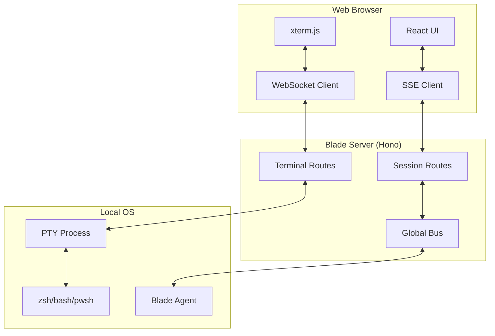
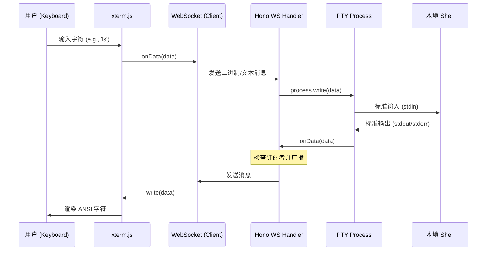
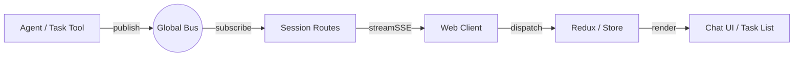
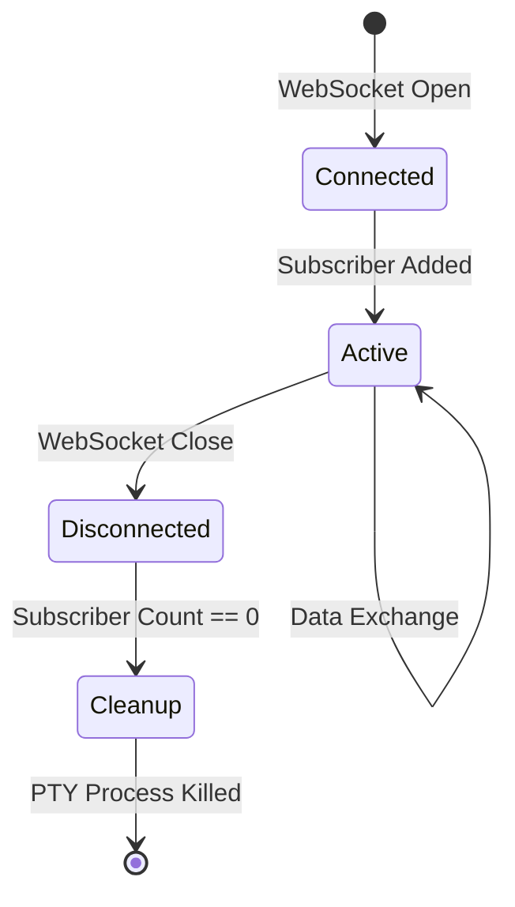

# 实时通信与 WebSocket 机制完成

## 目录
1. [模块概览](#模块概览)
2. [引言](#引言)
3. [核心组件](#核心组件)
   - [后端：终端路由与 PTY 抽象](#后端终端路由与-pty-抽象)
   - [前端：TerminalPanel 组件](#前端terminalpanel-组件)
   - [通信中枢：事件总线 (Bus)](#通信中枢事件总线-bus)
4. [架构概览](#架构概览)
5. [实时终端数据流](#实时终端数据流)
6. [WebSocket 服务端实现细节](#websocket-服务端实现细节)
   - [多运行时 PTY 适配](#多运行时-pty-适配)
   - [会话管理与输出缓冲](#会话管理与输出缓冲)
7. [前端终端模拟与交互](#前端终端模拟与交互)
   - [xterm.js 集成与增强](#xtermjs-集成与增强)
   - [主题与响应式布局](#主题与响应式布局)
8. [实时日志流机制](#实时日志流机制)
   - [基于 Bus 的发布订阅模式](#基于-bus-的数据流转)
   - [SSE 事件推送](#sse-事件推送)
9. [连接管理与稳定性](#连接管理与稳定性)
   - [心跳与断线重连](#心跳与断线重连)
   - [多会话隔离与清理](#多会话隔离与清理)
10. [性能考量](#性能考量)
11. [文件参考](#文件参考)

## 模块概览

本模块负责 Blade Web UI 与后端服务之间的实时双向通信，主要涵盖了交互式终端（Terminal）和实时任务日志（Log Streaming）两大核心功能。通过 WebSocket 和 Server-Sent Events (SSE) 的结合，Blade 实现了接近本地开发体验的 Web 端实时反馈。

在本次代码探索中，我们识别并分析了以下关键区域：
- **后端路由与逻辑**: 位于 `packages/cli/src/server/routes/`，共包含 10 个文件，其中 `terminal.ts` 和 `session.ts` 是实时通信的核心。
- **前端组件**: 位于 `packages/cli/web/src/components/terminal/`，主要由 `TerminalPanel.tsx` 负责终端渲染。
- **基础设施**: `packages/cli/src/server/bus.ts` 提供了全局事件总线支持。

本页面将深入探讨这些子模块的实现原理、数据流转路径以及在不同运行时（Bun vs Node.js）下的适配策略。

## 引言

在现代 AI 辅助开发工具中，实时性是用户体验的基石。Blade 不仅仅是一个静态的 Web 界面，它需要能够：
1. **实时操控本地 Shell**: 用户在 Web 端输入的命令需要立即在本地执行，且输出（包括复杂的 ANSI 转义序列）必须准确无缝地渲染回前端。
2. **监控 Agent 运行状态**: 当 Agent 执行复杂任务（如文件编辑、工具调用）时，其产生的增量日志、思考过程和工具结果需要实时流式推送到 UI。

为了实现这些目标，Blade 采用了混合通信架构：
- **WebSocket (WS)**: 用于终端模拟。终端交互具有高频率、双向、低延迟的特点，WebSocket 是最理想的选择。
- **Server-Sent Events (SSE)**: 用于任务日志流。日志流通常是单向的（服务端到客户端），SSE 相比 WS 更加轻量，且天然支持断线重连。
- **事件总线 (Bus)**: 作为后端内部的解耦层，将 Agent 的执行逻辑与通信协议层分离。

## 核心组件

### 后端：终端路由与 PTY 抽象

后端的核心在于对伪终端（PTY）的管理。由于 Blade 旨在兼容多种运行时，它定义了一套统一的 PTY 接口。

```typescript
// packages/cli/src/server/routes/terminal.ts

interface IPtyProcess {
  pid: number;
  write(data: string): void;
  resize?(cols: number, rows: number): void;
  kill(signal?: string): void;
  onData(callback: (data: string) => void): void;
  onExit(callback: (exitInfo: { exitCode: number }) => void): void;
}

interface TerminalSession {
  id: string;
  process: IPtyProcess;
  cwd: string;
  buffer: string;
  subscribers: Set<{ send: (data: string) => void; close: () => void }>;
}
```

`TerminalSession` 结构体不仅持有了 PTY 进程，还维护了一个订阅者集合 `subscribers`。这种设计允许一个终端进程被多个前端连接共享（虽然目前主要用于单连接），并提供了一个输出缓冲区 `buffer`，确保在前端连接建立前的输出不会丢失。

### 前端：TerminalPanel 组件

前端基于 `xterm.js` 构建。它是目前 Web 端最成熟的终端模拟库，能够完美处理颜色、光标位置和复杂的终端指令。

```typescript
// packages/cli/web/src/components/terminal/TerminalPanel.tsx

const term = new Terminal({
  cursorBlink: true,
  cursorStyle: 'bar',
  fontSize: 14,
  theme: isDark ? darkTheme : lightTheme,
});

const fitAddon = new FitAddon();
term.loadAddon(fitAddon);
term.open(terminalRef.current);
```

`TerminalPanel` 负责管理 WebSocket 的生命周期，并将 `xterm.js` 产生的 `onData` 事件转发给后端，同时将收到的消息写回终端。

### 通信中枢：事件总线 (Bus)

`Bus` 是一个单例模式的 `EventEmitter`，它充当了系统内部的“神经中枢”。

```typescript
// packages/cli/src/server/bus.ts

class GlobalBus extends EventEmitter {
  // ...
  publish(sessionId: string, type: string, properties: Record<string, unknown>) {
    this.emit('event', { sessionId, type, properties });
  }

  subscribe(callback: (event: { sessionId: string; type: string; properties: Record<string, unknown> }) => void) {
    this.on('event', callback);
    return () => this.off('event', callback);
  }
}
```

这种模式极大地简化了 Agent 逻辑。Agent 只需要向 `Bus` 发布事件，而无需关心这些事件最终是通过 SSE、WebSocket 还是其他方式发送给客户端的。

**Section sources**:
- [terminal.ts](file:///Users/bytedance/Documents/GitHub/Blade/packages/cli/src/server/routes/terminal.ts)
- [TerminalPanel.tsx](file:///Users/bytedance/Documents/GitHub/Blade/packages/cli/web/src/components/terminal/TerminalPanel.tsx)
- [bus.ts](file:///Users/bytedance/Documents/GitHub/Blade/packages/cli/src/server/bus.ts)

## 架构概览

Blade 的实时通信架构呈现出清晰的分层结构。底层是操作系统的进程和事件，顶层是用户交互界面。

下图展示了整个系统的组件关系和通信协议分布：



在这个架构中，`Terminal Routes` 直接处理 WebSocket 流量并操作 PTY 进程。而 `Session Routes` 则作为 `Bus` 的订阅者，将 `Agent` 产生的内部事件转换为 SSE 流推送到浏览器。这种分而治之的策略保证了不同类型数据的传输效率和可靠性。

**Diagram sources**:
- [server.ts:L150-L160](file:///Users/bytedance/Documents/GitHub/Blade/packages/cli/src/server/server.ts#L150-L160)
- [terminal.ts:L228-L307](file:///Users/bytedance/Documents/GitHub/Blade/packages/cli/src/server/routes/terminal.ts#L228-L307)

## 实时终端数据流

终端数据流是一个闭环的异步过程。为了确保低延迟，数据在每一层都尽可能地进行流式处理。

下图详细描绘了一个用户在 Web 端输入命令到看到输出的全过程：



该流程的关键在于 PTY 的作用。PTY 模拟了一个真实的终端设备，它不仅转发数据，还负责处理诸如作业控制（Job Control）、行编辑（Line Editing）以及 ANSI 转义序列的生成。后端 `terminal.ts` 中的 `onData` 回调会捕获 PTY 的所有输出，并通过 WebSocket 立即推送给所有连接的客户端。

**Diagram sources**:
- [terminal.ts:L136-L151](file:///Users/bytedance/Documents/GitHub/Blade/packages/cli/src/server/routes/terminal.ts#L136-L151)
- [TerminalPanel.tsx:L35-L37](file:///Users/bytedance/Documents/GitHub/Blade/packages/cli/web/src/components/terminal/TerminalPanel.tsx#L35-L37)

## WebSocket 服务端实现细节

### 多运行时 PTY 适配

由于 Blade 需要在 Bun 和 Node.js 环境下运行，而这两个运行时对应的 PTY 库（`bun-pty` 和 `node-pty`）接口略有不同，后端实现了一个抽象层 `spawnPty`。

在 Bun 环境下，它动态导入 `bun-pty`；在 Node.js 环境下，则使用 `node-pty`。这种动态加载机制避免了在不支持的运行环境中出现加载错误。

```typescript
// packages/cli/src/server/routes/terminal.ts

async function spawnPty(command: string, args: string[], options: { cwd: string; env: Record<string, string> }): Promise<IPtyProcess> {
  if (isBunRuntime()) {
    const { spawn } = await import('bun-pty');
    // ... 映射接口
  }
  const nodePty = await import('node-pty');
  // ... 映射接口
}
```

### 会话管理与输出缓冲

服务端使用一个全局的 `terminals` Map 来管理所有活跃的终端会话。每个会话都有一个唯一的 ID（如 `term-1712345678`）。

为了防止前端因为网络抖动短暂断开连接而丢失输出，`TerminalSession` 维护了一个 `buffer`。
- **写入策略**: 当 PTY 产生数据但当前没有活跃的 WebSocket 订阅者时，数据会被追加到 `buffer` 中。
- **限制**: 缓冲区大小限制为 2MB (`BUFFER_LIMIT`)，防止内存溢出。
- **重放**: 当新的 WebSocket 连接建立时，服务端会分块（每块 64KB）将缓冲区中的历史数据发送给客户端。

```typescript
// 发送缓冲数据逻辑
if (session.buffer) {
  const buffer = session.buffer;
  session.buffer = '';
  for (let i = 0; i < buffer.length; i += BUFFER_CHUNK) {
    ws.send(buffer.slice(i, i + BUFFER_CHUNK));
  }
}
```

**Section sources**:
- [terminal.ts:L38-L81](file:///Users/bytedance/Documents/GitHub/Blade/packages/cli/src/server/routes/terminal.ts#L38-L81)
- [terminal.ts:L165-L172](file:///Users/bytedance/Documents/GitHub/Blade/packages/cli/src/server/routes/terminal.ts#L165-L172)

## 前端终端模拟与交互

### xterm.js 集成与增强

前端 `TerminalPanel` 不仅仅是简单地展示 `xterm.js`。它通过插件系统增强了功能：
- **FitAddon**: 自动调整终端大小以填充容器。这对于响应式布局至关重要，特别是在用户调整浏览器窗口大小时。
- **WebLinksAddon**: 自动识别终端输出中的 URL 并使其可点击。

终端的初始化逻辑封装在 `useEffect` 中，确保在组件挂载时正确连接并配置。

### 主题与响应式布局

Blade 支持暗黑模式。`TerminalPanel` 会监听 `isDark` 状态的变化，并动态更新 `xterm.js` 的主题配置（包括背景色、前景色以及 16 种 ANSI 颜色的定义）。

```typescript
useEffect(() => {
  if (!xtermRef.current) return
  xtermRef.current.options.theme = isDark ? darkTheme : lightTheme;
}, [isDark])
```

在布局方面，终端面板支持最小化功能。当用户点击最小化按钮时，面板高度从 288px (h-72) 缩减到 40px (h-10)，同时隐藏终端画布以节省渲染资源。

**Section sources**:
- [TerminalPanel.tsx:L121-L132](file:///Users/bytedance/Documents/GitHub/Blade/packages/cli/web/src/components/terminal/TerminalPanel.tsx#L121-L132)
- [TerminalPanel.tsx:L216-L221](file:///Users/bytedance/Documents/GitHub/Blade/packages/cli/web/src/components/terminal/TerminalPanel.tsx#L216-L221)

## 实时日志流机制

### 基于 Bus 的数据流转

实时日志流（Log Streaming）与终端不同，它主要反映了 Agent 的内部逻辑状态。数据流转遵循“生产-分发-消费”模型。



当 `Agent` 执行 `drainLoop` 时，会产生各种 `LoopEvent`。这些事件被映射为 `Bus` 上的消息。例如，当 AI 产生新的文本片段时，会发布 `message.delta` 事件。

### SSE 事件推送

`SessionRoutes` 中的 `/:sessionId/events` 接口利用 Hono 的 `streamSSE` 功能建立了一个持久的 HTTP 连接。

```typescript
// packages/cli/src/server/routes/session.ts

app.get('/:sessionId/events', async (c) => {
  return streamSSE(c, async (stream) => {
    // 订阅 Bus
    const unsubscribe = Bus.subscribe((event) => {
      if (event.sessionId !== sessionId) return;
      stream.writeSSE({
        data: JSON.stringify({ type: event.type, properties: event.properties }),
      });
    });
    // ...
  });
});
```

这种设计的优雅之处在于，即使前端刷新页面，只要重新连接到 SSE 接口，就能继续接收后续的事件。配合后端的持久化存储，前端可以完美重建任务的执行过程。

**Section sources**:
- [session.ts:L351-L416](file:///Users/bytedance/Documents/GitHub/Blade/packages/cli/src/server/routes/session.ts#L351-L416)
- [bus.ts:L18-L25](file:///Users/bytedance/Documents/GitHub/Blade/packages/cli/src/server/bus.ts#L18-L25)

## 连接管理与稳定性

### 心跳与断线重连

为了维持长连接的稳定性，系统实现了多层心跳机制：
1. **SSE 层心跳**: 服务端每 15 秒发送一个类型为 `heartbeat` 的事件。这可以防止中间代理（如 Nginx）因为连接空闲而将其关闭。
2. **WebSocket 层**: 虽然 `terminal.ts` 中没有显式发送心跳帧，但它依赖于底层引擎（如 Bun.serve 或 ws 库）的默认保持机制。

### 多会话隔离与清理

连接管理的一个重要方面是资源的及时回收。



在 `terminal.ts` 的 `handleTerminalConnection` 中，每个会话都会跟踪其订阅者。
- 当最后一个订阅者断开连接时，系统会调用 `session.process.kill()` 销毁 PTY 进程，并从 `terminals` Map 中移除该会话。
- 这种机制确保了即使在异常断开的情况下，也不会在服务器上留下大量的僵尸 PTY 进程。

**Section sources**:
- [terminal.ts:L176-L188](file:///Users/bytedance/Documents/GitHub/Blade/packages/cli/src/server/routes/terminal.ts#L176-L188)
- [session.ts:L391-L404](file:///Users/bytedance/Documents/GitHub/Blade/packages/cli/src/server/routes/session.ts#L391-L404)

## 性能考量

在实现实时通信时，Blade 进行了几项关键的性能优化：
1. **分块传输**: 在重放终端缓冲区数据时，采用 64KB 的分块大小。这平衡了单次传输的消息大小和总体的吞吐量，避免了瞬时大流量对网络栈的冲击。
2. **事件过滤**: `Bus` 订阅者在发送 SSE 消息前会根据 `sessionId` 进行过滤。这确保了客户端只会收到与其当前会话相关的事件，降低了前端的处理负担。
3. **按需渲染**: 前端在终端面板最小化时会停止部分渲染逻辑，减少了 CPU 的占用。

## 文件参考

以下是实现实时通信与 WebSocket 机制的核心源文件：

- [packages/cli/src/server/routes/terminal.ts](file:///Users/bytedance/Documents/GitHub/Blade/packages/cli/src/server/routes/terminal.ts): 终端 WebSocket 后端实现，负责 PTY 管理与多运行时适配。
- [packages/cli/web/src/components/terminal/TerminalPanel.tsx](file:///Users/bytedance/Documents/GitHub/Blade/packages/cli/web/src/components/terminal/TerminalPanel.tsx): 终端前端组件，集成了 xterm.js 与 WebSocket 客户端。
- [packages/cli/src/server/bus.ts](file:///Users/bytedance/Documents/GitHub/Blade/packages/cli/src/server/bus.ts): 全局事件总线，实现后端组件间的解耦通信。
- [packages/cli/src/server/routes/session.ts](file:///Users/bytedance/Documents/GitHub/Blade/packages/cli/src/server/routes/session.ts): 任务会话路由，实现了基于 SSE 的日志流推送。
- [packages/cli/src/server/server.ts](file:///Users/bytedance/Documents/GitHub/Blade/packages/cli/src/server/server.ts): 服务端入口，负责 HTTP 与 WebSocket 协议的升级与路由分发。
- [packages/cli/src/tools/builtin/task/task.ts](file:///Users/bytedance/Documents/GitHub/Blade/packages/cli/src/tools/builtin/task/task.ts): Task 工具实现，演示了如何通过 Bus 发布任务状态更新。
