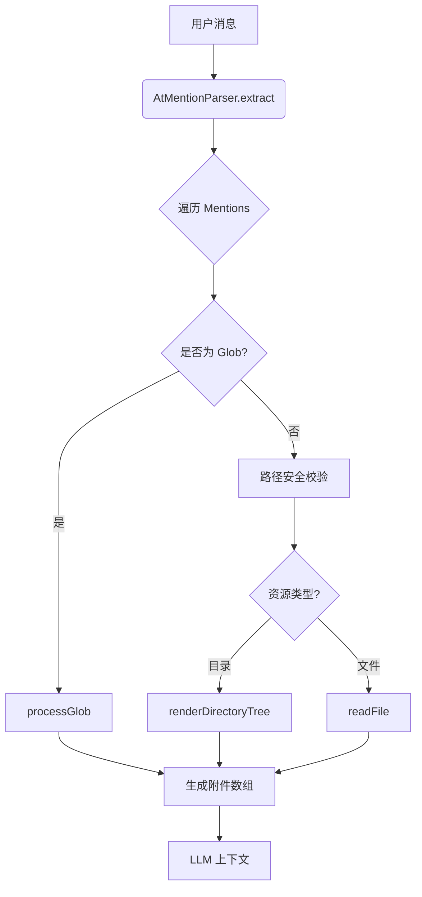
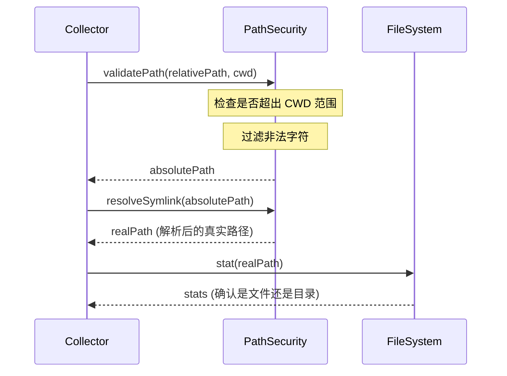
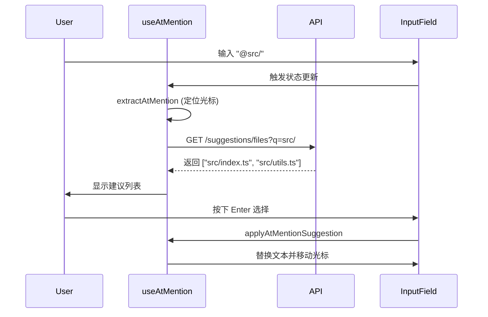
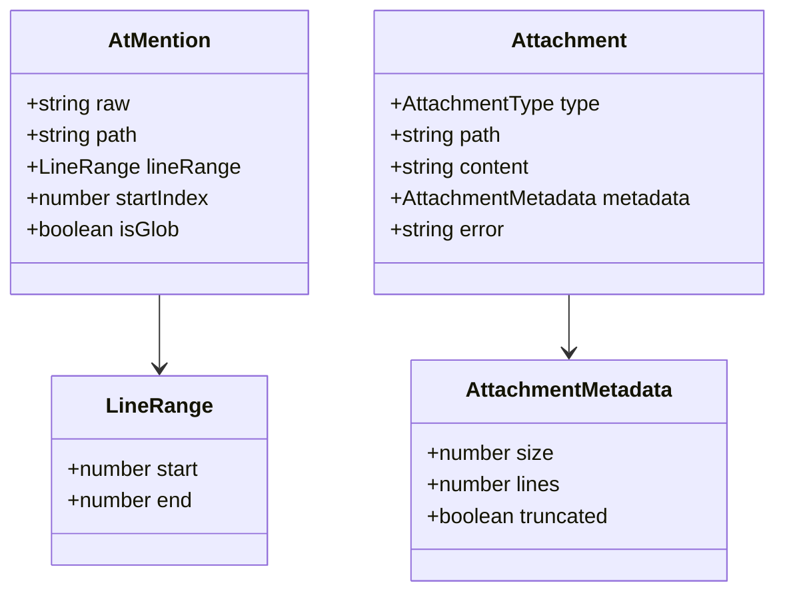

# 上下文提及与 @-mentions

## 目录
1. [模块概览](#模块概览)
2. [引言](#引言)
3. [核心组件](#核心组件)
   - [AtMentionParser：语法解析核心](#atmentionparser语法解析核心)
   - [AttachmentCollector：上下文收集器](#attachmentcollector上下文收集器)
   - [useAtMention：前端交互钩子](#useatmention前端交互钩子)
4. [关键逻辑与算法](#关键逻辑与算法)
   - [正则表达式解析机制](#正则表达式解析机制)
   - [路径处理与安全性](#路径处理与安全性)
   - [Glob 模式处理逻辑](#glob-模式处理逻辑)
   - [目录树渲染算法](#目录树渲染算法)
   - [上下文注入流程](#上下文注入流程)
5. [UI 建议与交互逻辑](#ui-建议与交互逻辑)
6. [数据模型与接口](#数据模型与接口)
7. [集成与扩展](#集成与扩展)
8. [文件引用](#文件引用)

## 模块概览

Blade 的上下文提及（@-mentions）模块是一个高度集成的跨端协作系统，旨在让用户能够通过直观的 `@` 语法在对话中无缝引用本地文件系统资源。该模块不仅是简单的文本替换工具，更是一个包含语法解析、安全审计、资源调度和内容格式化的复杂流水线。

**模块统计：**
- **核心文件总数**：4 个主要文件，涉及约 1200 行代码。
- **子模块划分**：
  - **后端解析与处理层** (`packages/cli/src/prompts/processors/`)：这是系统的“大脑”，负责将用户输入的非结构化文本转化为结构化的附件对象。它包括 `AtMentionParser`（解析器）、`AttachmentCollector`（收集器）和 `types.ts`（协议定义）。
  - **前端交互层** (`packages/cli/web/src/hooks/`)：这是系统的“触角”，负责实时监控用户输入、处理光标位置、并与建议 API 交互。核心文件为 `useAtMention.ts`。

本章节将从底层算法到上层 UI 交互，全面解析 @-mentions 的实现机制，帮助开发者理解 Blade 如何在保证安全性的前提下，为 AI 提供精准的项目上下文。

## 引言

在与 AI 助手的交互中，上下文的质量直接决定了回答的准确性。手动复制粘贴代码不仅低效，而且容易丢失文件路径、行号等关键元数据。Blade 的 **@-mentions** 机制通过以下核心价值解决了这一痛点：

- **语义化引用**：通过 `@path/to/file` 建立用户意图与物理资源之间的直接关联。
- **精细化控制**：支持 `#L10-20` 等行号后缀，允许用户仅提供相关的代码片段，从而节省 Token 并减少干扰。
- **结构化感知**：当引用目录时，系统会自动生成项目结构的 ASCII 树，使 LLM 能够理解代码的组织架构。
- **批量注入**：利用 Glob 通配符（如 `@src/**/*.ts`），用户可以一次性为 AI 提供整个功能模块的上下文。

该机制的设计哲学是“即输即得”，通过前端的实时建议和后端的静默处理，极大地降低了用户与项目代码库交互的门槛。

## 核心组件

### AtMentionParser：语法解析核心

`AtMentionParser` 是一个纯粹的静态工具类，其核心职责是作为正则表达式的封装层，从用户输入中提取出所有潜在的提及项。

```typescript
// AtMentionParser.ts 核心解析逻辑
private static readonly PATTERN = /@"([^"]+)"|@([^\s]+)/g;
private static readonly LINE_RANGE_PATTERN = /#L(\d+)(?:-(\d+))?$/;

static extract(input: string): AtMention[] {
  const mentions: AtMention[] = [];
  let match: RegExpExecArray | null;
  this.PATTERN.lastIndex = 0; // 必须重置，因为正则带有 g 标志

  while ((match = this.PATTERN.exec(input)) !== null) {
    const raw = match[0];
    // 优先匹配引号内的路径（处理空格），否则匹配裸路径
    let path = match[1] || match[2]; 

    // 尝试解析行号后缀，如 #L10 或 #L10-20
    const lineRange = this.parseLineRange(path);
    if (lineRange) {
      // 移除后缀以获得纯净的文件系统路径
      path = path.replace(this.LINE_RANGE_PATTERN, '');
    }

    // 检测路径中是否包含 Glob 通配符
    const isGlob = /[*?[\]]/.test(path);

    mentions.push({
      raw,
      path: path.trim(),
      lineRange,
      startIndex: match.index,
      endIndex: match.index + raw.length,
      isGlob,
    });
  }
  return mentions;
}
```

**解析深度分析**：
- **状态重置**：由于 `PATTERN` 是静态且带有全局标志（`g`）的，每次调用 `extract` 前必须手动将 `lastIndex` 置为 0，否则在并发或连续调用时会导致匹配位置错乱。
- **引号优先级**：正则表达式设计为优先匹配 `@"..."`。这对于处理 Windows 路径或包含空格的目录名至关重要。
- **贪婪性控制**：裸路径匹配使用 `[^\s]+`，这意味着它会一直匹配到下一个空格或换行符，这符合大多数 CLI 工具的习惯。

### AttachmentCollector：上下文收集器

`AttachmentCollector` 是整个流程的中枢。它不仅调用解析器，还负责执行复杂的 IO 操作、缓存管理和格式化任务。



**核心逻辑说明**：
- **并行处理**：为了提高效率，收集器使用 `Promise.allSettled` 并行处理消息中的所有提及项。即使其中一个文件读取失败，也不会影响其他附件的收集。
- **容错设计**：对于读取失败的项，它会生成一个 `type: 'error'` 的附件，将错误信息（如“文件过大”或“无权限”）直接传递给 LLM，让 AI 能够向用户解释原因。

### useAtMention：前端交互钩子

在浏览器端，`useAtMention` 钩子实现了与编辑器类似的“自动完成”体验。

```typescript
// useAtMention.ts 核心逻辑
export const useAtMention = (input: string, cursorPosition: number) => {
  // 仅在光标移动或输入变化时重新计算匹配项
  const match = useMemo(() => extractAtMention(input, cursorPosition), [input, cursorPosition]);

  useEffect(() => {
    if (!match.hasQuery) {
      setSuggestions([]);
      return;
    }
    
    const fetchSuggestions = async () => {
      setLoading(true);
      try {
        const response = await fetch(`/suggestions/files?q=${encodeURIComponent(match.query)}`);
        const data = await response.json();
        setSuggestions(data);
      } finally {
        setLoading(false);
      }
    };

    const timer = setTimeout(fetchSuggestions, 200); // 防抖处理
    return () => clearTimeout(timer);
  }, [match.query]);

  return { suggestions, loading, ... };
};
```

**交互细节**：
- **上下文感知**：它不仅仅是搜索字符串，还会根据光标在输入框中的精确位置来确定当前正在输入哪一个 `@` 提及。
- **双向绑定**：当用户从列表中选择一项时，`applyAtMentionSuggestion` 函数会计算出替换后的完整字符串，并精确计算光标应跳转到的新位置。

## 关键逻辑与算法

### 正则表达式解析机制

Blade 的正则设计体现了对不同场景的权衡。

1. **后端提取正则**：`/@"([^"]+)"|@([^\s]+)/g`
   - **设计目标**：最大化召回率。它假设输入是已经完成的，因此可以大胆地匹配到空格为止。
   - **处理技巧**：通过捕获组 1 和 2 分别处理“带引号”和“不带引号”的情况。

2. **前端匹配正则**：`/(?:^|\s)(@(?:"[^"]*"|(?:[^\\ ]|\\ )*))/g`
   - **设计目标**：高精度定位。它需要确保用户是在输入 `@` 而不是在输入邮箱地址或其他包含 `@` 的文本。
   - **边界处理**：要求 `@` 前面必须是行首或空格，并且支持对路径中空格的转义处理（`\\ `）。

### 路径处理与安全性

安全性是 @-mentions 的基石，因为该功能本质上允许通过自然语言指令访问本地文件系统。



**深度安全策略**：
- **目录穿越防御**：`PathSecurity` 会计算解析后的绝对路径，并确保它以当前工作目录（CWD）作为前缀。任何尝试通过 `../` 访问系统敏感文件的行为都会被拦截。
- **符号链接审计**：为了防止通过软链接（Symlink）绕过路径限制，系统会显式调用 `realpath` 来获取物理路径并再次验证。
- **二进制过滤**：`AttachmentCollector` 会尝试以 UTF-8 读取文件，如果读取失败或检测到非文本内容，将拒绝将其作为上下文注入，以防损坏 Prompt 结构。

### Glob 模式处理逻辑

当提及项包含通配符时，`AttachmentCollector` 会进入批量处理模式。

```typescript
// AttachmentCollector.ts 中的 Glob 处理
private async processGlob(pattern: string): Promise<Attachment> {
  const files = await fg(pattern, {
    cwd: this.options.cwd,
    ignore: ['node_modules/**', '.git/**'],
    onlyFiles: true,
  });

  // 限制最大匹配数，防止 Token 爆炸
  const limitedFiles = files.slice(0, 30);
  
  const results = await Promise.all(limitedFiles.map(async file => {
    const content = await fs.readFile(path.join(this.options.cwd, file), 'utf-8');
    // 每个文件限制行数，确保整体上下文可用
    const truncated = content.split('\n').slice(0, 200).join('\n');
    return `--- ${file} ---\n${truncated}`;
  }));

  return {
    type: 'file',
    path: pattern,
    content: results.join('\n\n'),
    metadata: { truncated: files.length > 30 }
  };
}
```

**策略权衡**：
- **数量限制**：Glob 匹配默认最多只选取前 30 个文件。
- **深度限制**：每个匹配到的文件最多只读取前 200 行。
- **聚合展示**：所有匹配结果会被聚合到一个单一的 `Attachment` 对象中，使用分隔符清晰地标注每个文件的边界。

### 目录树渲染算法

当用户引用一个目录（如 `@src/`）时，Blade 不会读取该目录下所有文件的内容，而是生成一个结构化的树状视图。

```typescript
// AttachmentCollector.ts 中的目录树构建
private buildFileTree(files: string[]): FileTree {
  const tree: FileTree = new Map();
  for (const file of files) {
    const parts = file.split('/');
    let current = tree;
    for (let i = 0; i < parts.length; i++) {
      const part = parts[i];
      const isFile = i === parts.length - 1;
      if (!current.has(part)) {
        current.set(part, isFile ? null : new Map());
      }
      if (!isFile) current = current.get(part) as FileTree;
    }
  }
  return tree;
}
```

**渲染逻辑**：
1. **递归扫描**：使用 `fast-glob` 获取目录下所有非忽略文件的相对路径。
2. **树构建**：将扁平的路径列表解析为嵌套的 `Map` 结构。
3. **ASCII 绘制**：通过 `├──` 和 `└──` 等字符递归生成可视化的树形文本。
这种方式在极低 Token 消耗的前提下，为 AI 提供了极佳的项目空间感知能力。

### 上下文注入流程

最终发送给 LLM 的 Prompt 是经过精心编排的。

**提及信息在 Prompt 中的呈现：**
对于带有行号范围的文件引用，系统会自动添加行号前缀，这对于 AI 定位代码位置至关重要：
```text
--- src/prompts/processors/AtMentionParser.ts (L10-L20) ---
10:
11: import type { AtMention, LineRange } from './types.js';
12:
13: export class AtMentionParser {
...
```

对于目录引用，生成的 ASCII 树提供了宏观的项目视角：
```text
packages/cli/
├── src/
│   └── prompts/
│       ├── processors/
│       │   ├── AtMentionParser.ts
│       │   └── AttachmentCollector.ts
│       └── builder.ts
└── package.json
```

## UI 建议与交互逻辑

前端的实时建议逻辑是提升用户体验的核心。



**关键交互算法**：
1. **光标追踪**：`useAtMention` 不断计算光标位置。只有当光标位于一个正在输入的 `@` 标签内部时，才会激活建议模式。
2. **文本替换**：当用户选择一个建议（例如 `my file.ts`）时，算法会判断该路径是否包含空格。如果是，则自动将替换文本格式化为 `@"my file.ts"`。
3. **后置空格**：为了方便用户继续输入，替换完成后会自动在末尾追加一个空格，并将光标置于该空格之后。

## 数据模型与接口

模块的数据模型设计遵循“解析-收集-呈现”的三段式结构。



| 接口名 | 描述 | 核心作用 |
|-------|------|---------|
| `AtMention` | 语法解析的中间产物 | 记录了用户在文本中“提到了什么”以及“在哪里提到的”。 |
| `Attachment` | 最终的业务对象 | 包含了 LLM 所需的所有信息，是 Prompt 构建的基础单元。 |
| `CollectorOptions` | 收集器的配置行为 | 定义了文件大小上限、Token 限制等安全和性能参数。 |

## 集成与扩展

`-mentions` 机制通过 `AttachmentCollector` 深度集成在 Blade 的指令处理管线中。

1. **缓存策略**：为了应对用户在短时间内多次调整 Prompt 的情况，`AttachmentCollector` 实现了内存缓存。缓存键为文件的绝对路径，有效期为 60 秒。这不仅减少了 IO 开销，还确保了在同一轮对话中上下文的一致性。
2. **Token 预算管理**：在收集过程中，系统会动态估算附件的 Token 消耗。如果检测到附件过大，会根据优先级（行号切片 > 头部截断）进行处理，并标记 `truncated: true`。
3. **可扩展架构**：目前的实现专注于文件系统。但由于 `AtMentionParser` 和 `AttachmentCollector` 之间通过 `AtMention` 接口解耦，未来可以轻松扩展出其他类型的提及，例如：
   - **远程资源**：通过 `@http://...` 引用网页内容。
   - **版本控制**：通过 `@git:branch` 引用 Git 分支差异或特定提交。
   - **数据库元数据**：通过 `@db:table` 引用数据库 Schema。

这种插件式的架构设计使得 Blade 能够随着用户需求的变化，不断丰富其上下文获取的能力。

## 文件引用

**核心组件源码**：
- [AtMentionParser.ts](file:///Users/bytedance/Documents/GitHub/Blade/packages/cli/src/prompts/processors/AtMentionParser.ts) - 语法解析核心实现，包含复杂的正则逻辑。
- [AttachmentCollector.ts](file:///Users/bytedance/Documents/GitHub/Blade/packages/cli/src/prompts/processors/AttachmentCollector.ts) - 附件收集器，处理 IO 与格式化。
- [types.ts](file:///Users/bytedance/Documents/GitHub/Blade/packages/cli/src/prompts/processors/types.ts) - 模块间通信的协议定义。
- [useAtMention.ts](file:///Users/bytedance/Documents/GitHub/Blade/packages/cli/web/src/hooks/useAtMention.ts) - 前端 React Hook，驱动 UI 交互。

**关键依赖与工具**：
- [pathSecurity.ts](file:///Users/bytedance/Documents/GitHub/Blade/packages/cli/src/utils/pathSecurity.ts) - 确保文件访问不越界。
- [pathHelpers.ts](file:///Users/bytedance/Documents/GitHub/Blade/packages/cli/src/utils/pathHelpers.ts) - 跨平台的路径切分与合并工具。
- [builder.ts](file:///Users/bytedance/Documents/GitHub/Blade/packages/cli/src/prompts/builder.ts) - 最终消费附件的 Prompt 构建器。
