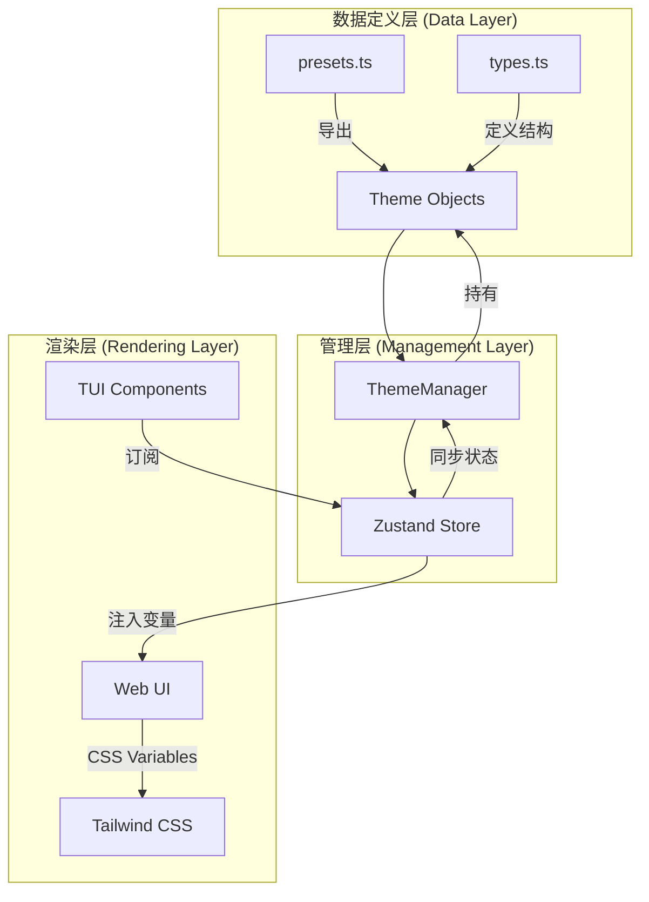
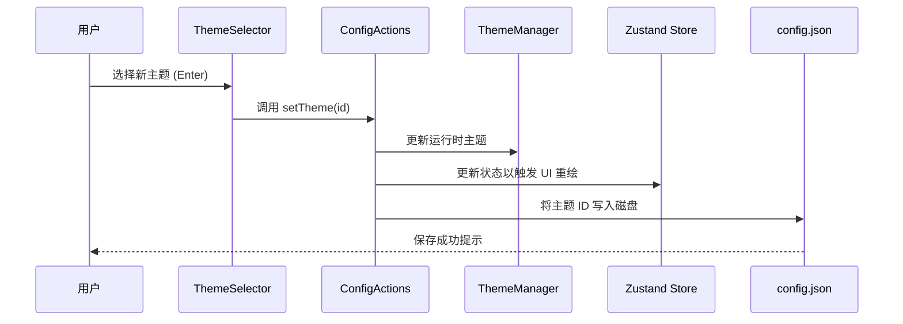

# 主题管理与样式自定义

## 目录
1. [模块概览](#模块概览)
2. [引言](#引言)
3. [核心组件](#核心组件)
4. [架构设计](#架构设计)
5. [数据模型与配置结构](#数据模型与配置结构)
6. [Web 样式系统](#web-样式系统)
7. [集成与持久化](#集成与持久化)
8. [文件引用](#文件引用)

## 模块概览

Blade 的主题管理系统是一个高度模块化且易于扩展的系统，旨在为终端界面（TUI）和 Web 界面提供一致的视觉体验。该系统不仅支持丰富的预设主题，还允许用户通过简单的配置自定义颜色方案。

**模块统计数据**：
- **核心目录**：`packages/cli/src/ui/themes/`
- **源文件数量**：4 个核心逻辑文件
- **覆盖范围**：
    - `themes/`：包含主题管理器、预设定义和类型定义。
    - `components/`：包含 TUI 层面的主题选择交互组件。
    - `web/`：包含基于 Tailwind CSS 的 Web UI 样式定义。

本章节将深入探讨主题引擎的工作原理、预设主题的构成、以及如何在不同 UI 环境下实现样式的动态切换与持久化。

## 引言

在现代开发者工具中，界面的美观度与易用性同等重要。Blade 的主题管理系统旨在解决跨平台（终端与浏览器）样式同步的难题。它不仅仅是一个简单的颜色列表，而是一个完整的样式引擎，涵盖了从基础色板到复杂的语法高亮逻辑。

该系统的核心目标是：
1. **一致性**：确保用户在终端执行命令时看到的颜色与在 Web 仪表盘中看到的颜色保持语义一致。
2. **可扩展性**：开发者可以轻松添加新的预设主题，或允许最终用户自定义特定颜色。
3. **实时性**：支持在不重启应用的情况下动态切换主题，并立即在 UI 上生效。

通过 `ThemeManager`，Blade 将颜色定义抽象为一组语义化的变量（如 `primary`、`success`、`syntax.keyword` 等），使得 UI 组件可以独立于具体颜色进行开发。

## 核心组件

主题管理系统的核心由 `ThemeManager` 类驱动，它负责维护当前活动主题的状态，并提供主题切换的 API。

### ThemeManager (主题管理器)

`ThemeManager` 是整个系统的单例入口。它在初始化时会加载所有内置的预设主题，并设置默认主题（通常是 `default` 或 `dark`）。

```typescript
// packages/cli/src/ui/themes/ThemeManager.ts

class ThemeManager {
  private currentTheme: Theme = defaultTheme;
  private themes: Map<string, Theme> = new Map();

  constructor() {
    this.themes.set('default', defaultTheme);
    this.themes.set('dark', darkTheme);

    // 注册所有预设主题
    for (const item of themes) {
      this.themes.set(item.id, item.theme);
    }
  }

  /**
   * 设置当前主题并触发状态更新
   */
  setTheme(themeName: string): void {
    const theme = this.themes.get(themeName);
    if (theme) {
      this.currentTheme = theme;
    } else {
      throw new Error(`Theme '${themeName}' not found`);
    }
  }

  getTheme(): Theme {
    return this.currentTheme;
  }
}

export const themeManager = new ThemeManager();
```

`ThemeManager` 的设计采用了典型的注册表模式。通过 `Map` 存储主题对象，可以实现 O(1) 复杂度的查找。在 TUI 环境中，UI 组件通过调用 `themeManager.getTheme()` 获取当前的颜色配置，并将其传递给 Ink 的 `<Text>` 或 `<Box>` 组件。

### ThemeSelector (交互式选择器)

为了提供良好的用户体验，Blade 提供了一个交互式的主题选择器组件。它允许用户在终端中实时预览不同主题的效果。

```typescript
// packages/cli/src/ui/components/ThemeSelector.tsx

export const ThemeSelector: React.FC = () => {
  // ... 状态管理逻辑
  const [selectedTheme, setSelectedTheme] = useState<Theme>(initialTheme);

  // 处理主题切换 (上下键预览)
  const handleHighlight = (item: { label: string; value: string }) => {
    const themeItem = themes.find((t) => t.id === item.value);
    if (themeItem) {
      setSelectedTheme(themeItem.theme);
    }
  };

  return (
    <Box flexDirection="row">
      <Box width="40%">
        <SelectInput items={themeSelectItems} onHighlight={handleHighlight} />
      </Box>
      <Box width="60%">
        <CodePreview theme={selectedTheme} />
      </Box>
    </Box>
  );
};
```

`ThemeSelector` 的亮点在于其“即时预览”功能。当用户在列表中移动光标时，右侧的 `CodePreview` 组件会根据当前高亮的主题实时重绘。这种反馈机制极大地降低了用户选择合适主题的成本。

**Section sources**:
- [ThemeManager.ts](file:///Users/bytedance/Documents/GitHub/Blade/packages/cli/src/ui/themes/ThemeManager.ts)
- [ThemeSelector.tsx](file:///Users/bytedance/Documents/GitHub/Blade/packages/cli/src/ui/components/ThemeSelector.tsx)

## 架构设计

Blade 的主题系统采用了分层架构，将颜色定义与具体的渲染引擎（Ink 或 Web）解耦。

下面的流程图展示了主题数据如何从预设库流向最终的 UI 组件：



在该架构中，`ThemeManager` 作为真相来源（Source of Truth），负责解析和验证主题数据。`Zustand Store` 则充当了状态分发的角色，确保当主题发生变化时，所有受影响的 UI 组件都能收到通知并触发重新渲染。对于 Web UI，系统会将主题颜色映射到 CSS 全局变量中，从而利用 Tailwind CSS 的强大功能。

**Diagram sources**:
- [ThemeManager.ts](file:///Users/bytedance/Documents/GitHub/Blade/packages/cli/src/ui/themes/ThemeManager.ts)
- [presets.ts](file:///Users/bytedance/Documents/GitHub/Blade/packages/cli/src/ui/themes/presets.ts)

## 数据模型与配置结构

主题的结构定义在 `types.ts` 中，它是一个深层嵌套的对象，涵盖了颜色、间距、字体和阴影等多个维度。

### Theme 接口定义

一个完整的主题对象必须符合以下接口：

```typescript
export interface Theme {
  name: string;
  colors: {
    primary: string;
    secondary: string;
    // ... 状态颜色 (success, warning, error)
    text: {
      primary: string;
      secondary: string;
      muted: string;
    };
    background: {
      primary: string;
      secondary: string;
    };
    syntax: SyntaxColors; // 语法高亮
  };
  spacing: { /* xs, sm, md, lg, xl */ };
  typography: { /* fontSize, fontWeight */ };
  borderRadius: { /* sm, base, lg, xl */ };
}
```

### 预设主题分析

Blade 内置了超过 10 种流行主题，包括：
- **Ayu Dark**：清新、高对比度的暗色主题。
- **Dracula**：经典的吸血鬼配色，深受开发者喜爱。
- **Nord**：基于北极冰雪色彩的冷色调主题。
- **Tokyo Night**：模拟东京夜晚霓虹灯效果的主题。

每个预设主题都是对 `Theme` 接口的一个具体实现。例如，`tokyo-night` 的 `primary` 颜色被定义为 `#7aa2f7`，而 `dracula` 则使用 `#bd93f9`。这种标准化的结构使得切换主题就像更换 JSON 对象一样简单。

**Section sources**:
- [types.ts](file:///Users/bytedance/Documents/GitHub/Blade/packages/cli/src/ui/themes/types.ts)
- [presets.ts](file:///Users/bytedance/Documents/GitHub/Blade/packages/cli/src/ui/themes/presets.ts)

## Web 样式系统

虽然 TUI 使用 JavaScript 对象来管理颜色，但 Web UI 依赖于 CSS 变量来实现样式的灵活性。Blade 通过 Tailwind CSS 的变量映射机制，将 TUI 的主题概念延伸到了 Web 端。

### CSS 变量定义

在 `index.css` 中，定义了基础的颜色变量。这些变量在运行时会根据当前选中的主题进行动态更新。

```css
/* packages/cli/web/src/index.css */

@layer base {
  :root {
    --background: 0 0% 100%;
    --foreground: 240 10% 3.9%;
    --primary: 240 5.9% 10%;
    --success: 142 76% 36%;
    /* ... 更多变量 */
  }

  .dark {
    --background: 0 0% 4.7%;
    --foreground: 0 0% 98%;
    --primary: 0 0% 98%;
    /* ... 暗色模式下的变量覆盖 */
  }
}
```

### 响应式重绘

当用户在 TUI 中切换主题时，Blade 的 Web 后端会生成相应的 CSS 变量注入到前端页面中。这种机制确保了 TUI 和 Web UI 在视觉上的高度同步。Web UI 组件可以直接使用 `bg-primary` 或 `text-success` 等 Tailwind 类，而无需关心背后的具体色值。

**Section sources**:
- [index.css](file:///Users/bytedance/Documents/GitHub/Blade/packages/cli/web/src/index.css)

## 集成与持久化

主题的选择不仅影响当前的会话，还需要被持久化到用户的配置文件中，以便在下次启动时自动加载。

### 持久化流程

下面的序列图展示了主题切换并持久化的完整过程：



在 `ThemeSelector` 中，点击确认后会调用 `configActions().setTheme(item.value)`。这个动作是一个复合操作：
1. **立即更新**：调用 `ThemeManager` 的 `setTheme` 方法，确保当前的内存状态是最新的。
2. **状态分发**：更新 Zustand Store，这会导致所有监听主题状态的 React 组件重新渲染。
3. **持久化**：将主题 ID 写入本地配置文件（通常位于 `~/.blade/config.json`）。

### CLI 参数支持

除了通过 UI 切换，用户还可以通过 CLI 参数直接指定主题：
```bash
blade --theme tokyo-night
```
启动时，程序会优先检查命令行参数，其次是配置文件，最后回退到默认主题。

**Section sources**:
- [ThemeSelector.tsx](file:///Users/bytedance/Documents/GitHub/Blade/packages/cli/src/ui/components/ThemeSelector.tsx)
- [ThemeManager.ts](file:///Users/bytedance/Documents/GitHub/Blade/packages/cli/src/ui/themes/ThemeManager.ts)

## 文件引用

以下是本章节涉及的关键源文件：

- [ThemeManager.ts](file:///Users/bytedance/Documents/GitHub/Blade/packages/cli/src/ui/themes/ThemeManager.ts) - 核心主题管理逻辑
- [presets.ts](file:///Users/bytedance/Documents/GitHub/Blade/packages/cli/src/ui/themes/presets.ts) - 内置预设主题集合
- [types.ts](file:///Users/bytedance/Documents/GitHub/Blade/packages/cli/src/ui/themes/types.ts) - 主题类型接口定义
- [ThemeSelector.tsx](file:///Users/bytedance/Documents/GitHub/Blade/packages/cli/src/ui/components/ThemeSelector.tsx) - TUI 主题选择器组件
- [index.css](file:///Users/bytedance/Documents/GitHub/Blade/packages/cli/web/src/index.css) - Web 端样式定义
