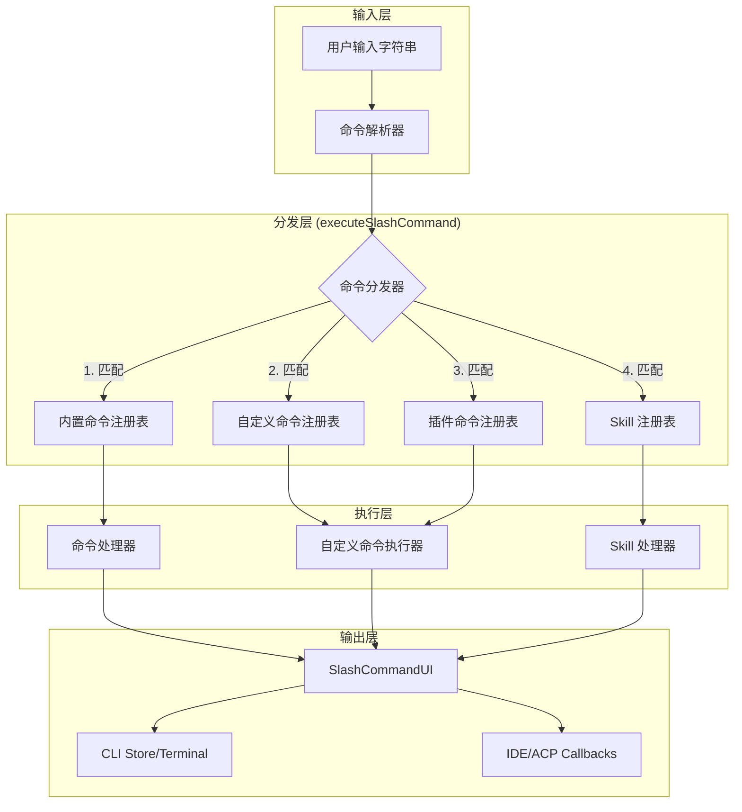
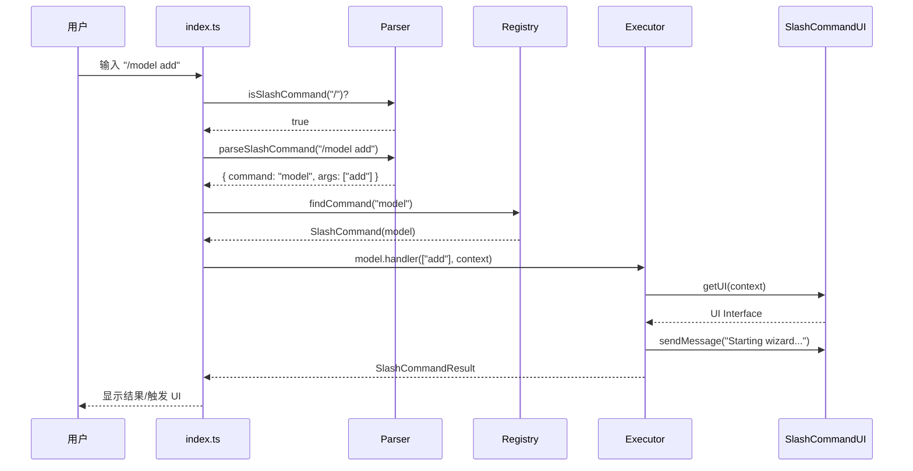

# 斜杠命令系统

## 目录
1. [模块概览](#模块概览)
2. [引言](#引言)
3. [系统架构](#系统架构)
4. [核心组件](#核心组件)
5. [内置命令集](#内置命令集)
6. [自定义命令系统](#自定义命令系统)
7. [命令解析与执行流程](#命令解析与执行流程)
8. [命令上下文 (CommandContext)](#命令上下文-commandcontext)
9. [开发指南：创建自定义命令](#开发指南-创建自定义命令)
10. [文件引用](#文件引用)

## 模块概览

斜杠命令（Slash Commands）系统是 Blade 命令行界面的核心交互机制。它允许用户通过简洁的 `/command` 语法执行复杂的系统操作、管理配置或触发特定的 AI 行为。该模块不仅涵盖了内置的系统管理命令，还提供了一套强大的插件和自定义扩展机制。

- **文件总数**: 约 24 个源文件
- **核心目录**: `packages/cli/src/slash-commands/`
- **子模块**:
    - `custom/`: 负责自定义命令的加载、解析和执行。
    - `builtin/`: (逻辑上) 散落在根目录下的各个命令实现文件。
- **覆盖范围**: 本文档将深入探讨命令的注册机制、解析逻辑、执行流程，以及如何通过 Markdown 文件扩展系统功能。

## 引言

在 AI 辅助开发工具中，用户不仅需要与 LLM 进行自然语言交流，还需要精确控制工具的行为。斜杠命令系统为 Blade 提供了这种“精确控制”的能力。

斜杠命令的设计目标是：
1. **高效性**：通过短指令快速触发常用功能（如 `/clear` 清屏，`/model` 切换模型）。
2. **可扩展性**：允许用户和插件开发者轻松定义新命令，而无需修改核心代码。
3. **一致性**：无论是在纯 CLI 环境还是在集成 IDE（如 ACP 模式）中，命令的行为和输出应保持一致。

通过斜杠命令，用户可以管理会话上下文（`/compact`）、查询 Git 状态（`/git`）、监控后台任务（`/tasks`）以及配置系统权限（`/permissions`）。

## 系统架构

Blade 的斜杠命令系统采用了多层注册和分发架构。它不仅支持静态定义的内置命令，还支持动态发现的自定义命令、插件命令以及用户可调用的 Skill。

下面的架构图展示了命令系统的主要组件及其交互关系：



**架构解析**：
1. **解析器**：负责识别输入是否以 `/` 开头，并拆分命令名和参数。
2. **分发器**：这是核心路由逻辑，它按照优先级顺序查找命令。内置命令拥有最高优先级，确保核心功能不被覆盖。
3. **注册表**：系统维护了多个独立的注册表，分别管理不同来源的命令。
4. **UI 抽象层**：通过 `SlashCommandUI` 接口，命令处理器无需关心当前运行环境。它只需调用 `sendMessage`，系统会自动根据上下文选择输出到终端还是通过 ACP 协议发送给 IDE。

**Diagram sources**:
- [index.ts:L155-L248](file:///Users/bytedance/Documents/GitHub/Blade/packages/cli/src/slash-commands/index.ts#L155-L248)
- [types.ts:L135-L178](file:///Users/bytedance/Documents/GitHub/Blade/packages/cli/src/slash-commands/types.ts#L135-L178)

## 核心组件

### 1. SlashCommand 接口
所有命令必须实现 `SlashCommand` 接口，它定义了命令的元数据和执行逻辑。

```typescript
export interface SlashCommand {
  name: string;          // 命令名称（不含 /）
  description: string;   // 简短描述（用于帮助列表）
  fullDescription?: string; // 详细描述
  usage?: string;        // 使用示例
  aliases?: string[];    // 别名（如 help 的别名 h）
  category?: string;     // 分类（system, context, git 等）
  handler: (
    args: string[],
    context: SlashCommandContext
  ) => Promise<SlashCommandResult>; // 核心执行函数
}
```

### 2. CustomCommandRegistry
自定义命令注册表是一个单例，负责管理从磁盘加载的 Markdown 命令。它使用 `CustomCommandLoader` 扫描目录，并使用 `CustomCommandExecutor` 处理命令内容。

### 3. CustomCommandExecutor
这是系统中最具动态性的组件。它负责处理自定义命令中的特殊语法：
- **参数插值**：将 `$1`, `$2` 或 `$ARGUMENTS` 替换为用户输入的参数。
- **Bash 嵌入**：执行 !`command` 语法中的 Shell 命令，并将输出插入到内容中。
- **文件引用**：解析 `@path/to/file` 语法，读取文件内容并以 Markdown 代码块形式嵌入。

**Section sources**:
- [types.ts:L107-L119](file:///Users/bytedance/Documents/GitHub/Blade/packages/cli/src/slash-commands/types.ts#L107-L119)
- [custom/CustomCommandExecutor.ts:L15-L47](file:///Users/bytedance/Documents/GitHub/Blade/packages/cli/src/slash-commands/custom/CustomCommandExecutor.ts#L15-L47)

## 内置命令集

Blade 预装了一系列核心命令，涵盖了项目管理、AI 控制和系统监控。

| 命令 | 别名 | 描述 | 主要功能 |
| :--- | :--- | :--- | :--- |
| `/help` | `h` | 显示帮助信息 | 列出所有内置、自定义和插件命令，并按来源分组。 |
| `/model` | - | 模型管理 | 切换当前使用的 LLM，添加或删除模型配置。 |
| `/compact` | - | 上下文压缩 | 手动触发上下文压缩，生成技术总结以节省 Token。 |
| `/tasks` | - | 任务管理 | 查看后台运行的 Shell 进程和 Subagent 任务状态。 |
| `/git` | - | Git 辅助 | 执行 `status`, `diff`, `commit` 等操作，并由 AI 辅助分析。 |
| `/context` | - | 上下文可视化 | 以网格形式展示当前 Token 使用情况和模型限制。 |
| `/status` | - | 配置检查 | 检查 `BLADE.md` 是否存在，识别项目类型和环境。 |
| `/clear` | `cls` | 清屏 | 清除当前会话历史和屏幕输出。 |
| `/memory` | - | 自动记忆管理 | 查看、编辑或清除项目的自动记忆（Auto Memory）。 |

> 💡 **提示**: 许多内置命令支持子命令。例如 `/model add` 或 `/tasks clean`。你可以通过 `/help` 或查看命令的 `fullDescription` 获取详细用法。

**Section sources**:
- [builtinCommands.ts:L25-L324](file:///Users/bytedance/Documents/GitHub/Blade/packages/cli/src/slash-commands/builtinCommands.ts#L25-L324)
- [model.ts:L8-L127](file:///Users/bytedance/Documents/GitHub/Blade/packages/cli/src/slash-commands/model.ts#L8-L127)
- [tasks.ts:L170-L187](file:///Users/bytedance/Documents/GitHub/Blade/packages/cli/src/slash-commands/tasks.ts#L170-L187)

## 自定义命令系统

自定义命令是 Blade 的一大特色，它允许用户通过简单的 Markdown 文件定义复杂的 prompt 模板。

### 目录扫描与优先级
`CustomCommandLoader` 会扫描以下目录（按优先级从低到高）：
1. `~/.blade/commands/` (全局用户目录)
2. `~/.claude/commands/` (兼容 Claude Code 的全局目录)
3. `.blade/commands/` (项目级目录)
4. `.claude/commands/` (项目级兼容目录)

**优先级原则**：项目级命令会覆盖用户级同名命令。这允许团队为特定项目定制工作流。

### 文件格式
自定义命令文件必须是 `.md` 后缀，包含 Frontmatter 配置区和正文区。

```markdown
---
description: 这是一个自定义命令示例
argument-hint: [参数]
model: gpt-4
---
命令的正文内容，支持动态元素。
```

### 动态元素处理流程

```mermaid
flowchart TD
    Start([开始执行自定义命令]) --> Interpolate[1. 参数插值]
    Interpolate --> |$1, $ARGUMENTS| BashEmbed[2. Bash 嵌入执行]
    BashEmbed --> |! `git status`| FileRef[3. 文件引用解析]
    FileRef --> |@src/main.ts| FinalContent[生成最终 Prompt]
    FinalContent --> SendAI[发送给 AI 处理器]
```

1. **参数插值**：首先处理变量替换，确保后续的 Bash 命令或文件路径可以使用参数。
2. **Bash 嵌入**：在工作目录执行 Shell 命令。出于安全考虑，这些命令在本地执行，结果作为上下文提供给 AI。
3. **文件引用**：最后加载文件内容。这确保了 AI 总是能看到代码的最新版本。

**Section sources**:
- [custom/CustomCommandLoader.ts:L31-L71](file:///Users/bytedance/Documents/GitHub/Blade/packages/cli/src/slash-commands/custom/CustomCommandLoader.ts#L31-L71)
- [custom/CustomCommandExecutor.ts:L15-L47](file:///Users/bytedance/Documents/GitHub/Blade/packages/cli/src/slash-commands/custom/CustomCommandExecutor.ts#L15-L47)

## 命令解析与执行流程

当用户在终端输入内容时，系统会经历以下解析和执行步骤：



**解析逻辑详解**：
- `parseSlashCommand` 使用正则表达式 `/\s+/` 拆分参数。
- 执行器会捕获所有错误，并返回统一的 `SlashCommandResult` 结构，确保 CLI 不会因为某个命令崩溃。
- 如果命令未找到，系统会尝试进行模糊匹配（Fuzzy Search），并给出建议。

**Section sources**:
- [index.ts:L51-L86](file:///Users/bytedance/Documents/GitHub/Blade/packages/cli/src/slash-commands/index.ts#L51-L86)
- [index.ts:L155-L248](file:///Users/bytedance/Documents/GitHub/Blade/packages/cli/src/slash-commands/index.ts#L155-L248)

## 命令上下文 (CommandContext)

`SlashCommandContext` 是命令执行时的“环境变量”，它包含了执行命令所需的所有外部信息。

```typescript
export interface SlashCommandContext {
  cwd: string;             // 当前工作目录
  workspaceRoot?: string;  // 项目根目录
  acp?: AcpCallbacks;      // ACP 模式回调（仅在 IDE 插件中有效）
  signal?: AbortSignal;    // 中止信号，用于取消耗时操作
}
```

### 关键特性：统一 UI 输出
为了兼容 CLI 和 IDE 插件，开发者**不应直接**使用 `console.log` 或 `sessionActions()`。
相反，应该使用 `getUI(context)` 获取统一的输出接口：

```typescript
const ui = getUI(context);
ui.sendMessage('这是一条消息'); // CLI 模式下存入 store，ACP 模式下发送给 IDE
```

这种抽象确保了斜杠命令的逻辑与展示层完全解耦。

**Section sources**:
- [types.ts:L97-L105](file:///Users/bytedance/Documents/GitHub/Blade/packages/cli/src/slash-commands/types.ts#L97-L105)
- [types.ts:L163-L178](file:///Users/bytedance/Documents/GitHub/Blade/packages/cli/src/slash-commands/types.ts#L163-L178)

## 开发指南：创建自定义命令

创建一个名为 `/review` 的命令，用于让 AI 评审指定的代码文件。

### 1. 创建文件
在项目根目录下创建 `.blade/commands/review.md`。

### 2. 编写内容
```markdown
---
description: 评审指定的代码文件，检查潜在的 Bug 和性能问题。
argument-hint: <文件路径>
---
请作为一名资深代码评审专家，评审以下文件：

文件路径: $1
当前分支: !`git branch --show-current`

代码内容:
@$1

请重点关注：
1. 代码健壮性与错误处理
2. 潜在的性能瓶颈
3. 是否符合 TypeScript 最佳实践
```

### 3. 使用命令
在 Blade 终端中输入：
```bash
/review src/index.ts
```

### 执行原理分析：
1. **参数替换**：`$1` 被替换为 `src/index.ts`。
2. **Bash 执行**：!`git branch --show-current` 被执行，结果（如 `main`）被插入。
3. **文件读取**：`@src/index.ts` 触发文件读取，系统自动将其包装在 Markdown 代码块中。
4. **AI 交互**：最终生成的完整 Prompt 被发送给 AI。

## 文件引用

以下是斜杠命令系统涉及的关键源文件：

- [index.ts](file:///Users/bytedance/Documents/GitHub/Blade/packages/cli/src/slash-commands/index.ts): 命令分发与路由核心。
- [types.ts](file:///Users/bytedance/Documents/GitHub/Blade/packages/cli/src/slash-commands/types.ts): 系统核心接口定义与 UI 抽象。
- [builtinCommands.ts](file:///Users/bytedance/Documents/GitHub/Blade/packages/cli/src/slash-commands/builtinCommands.ts): 内置命令注册表。
- [custom/CustomCommandRegistry.ts](file:///Users/bytedance/Documents/GitHub/Blade/packages/cli/src/slash-commands/custom/CustomCommandRegistry.ts): 自定义命令管理单例。
- [custom/CustomCommandExecutor.ts](file:///Users/bytedance/Documents/GitHub/Blade/packages/cli/src/slash-commands/custom/CustomCommandExecutor.ts): 动态元素（Bash/文件引用）执行引擎。
- [custom/CustomCommandLoader.ts](file:///Users/bytedance/Documents/GitHub/Blade/packages/cli/src/slash-commands/custom/CustomCommandLoader.ts): 磁盘扫描与发现逻辑。
- [model.ts](file:///Users/bytedance/Documents/GitHub/Blade/packages/cli/src/slash-commands/model.ts): 模型管理命令实现。
- [tasks.ts](file:///Users/bytedance/Documents/GitHub/Blade/packages/cli/src/slash-commands/tasks.ts): 后台任务监控命令实现。
- [compact.ts](file:///Users/bytedance/Documents/GitHub/Blade/packages/cli/src/slash-commands/compact.ts): 上下文压缩命令实现。
