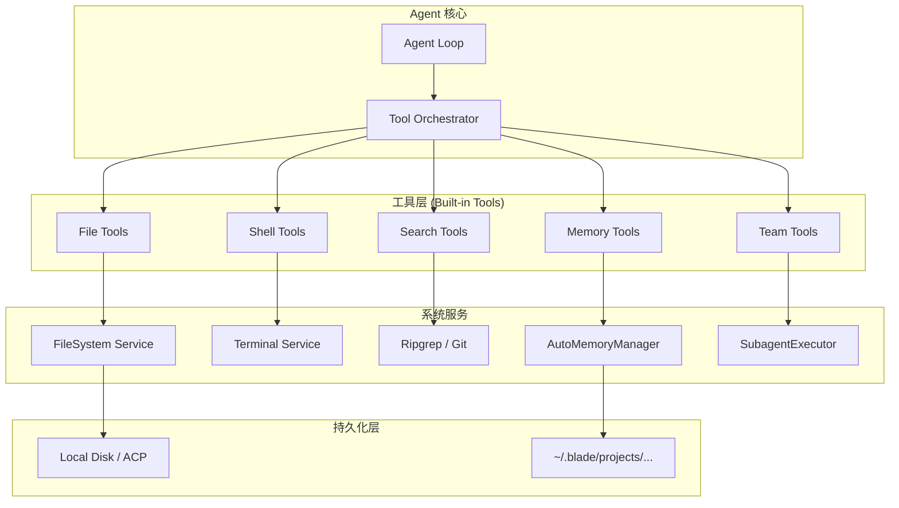
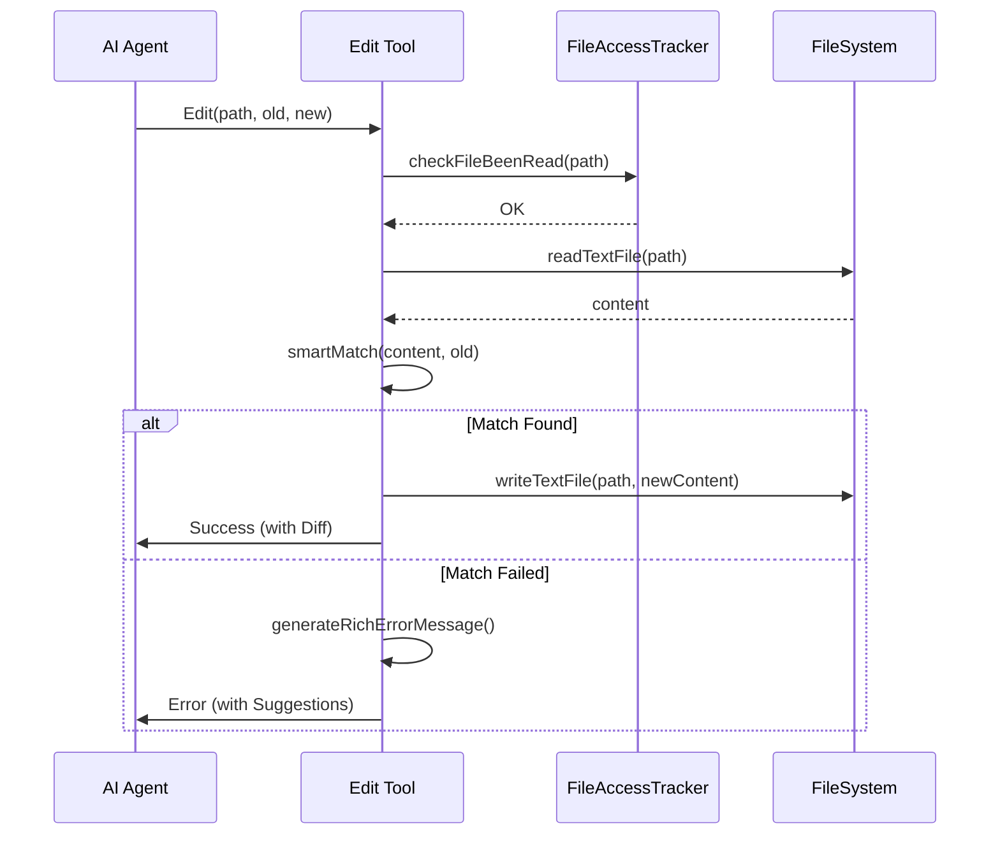
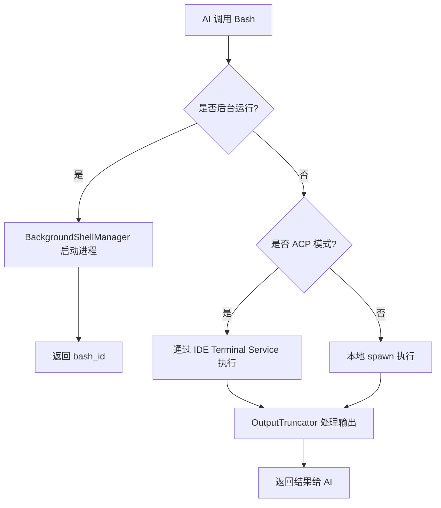
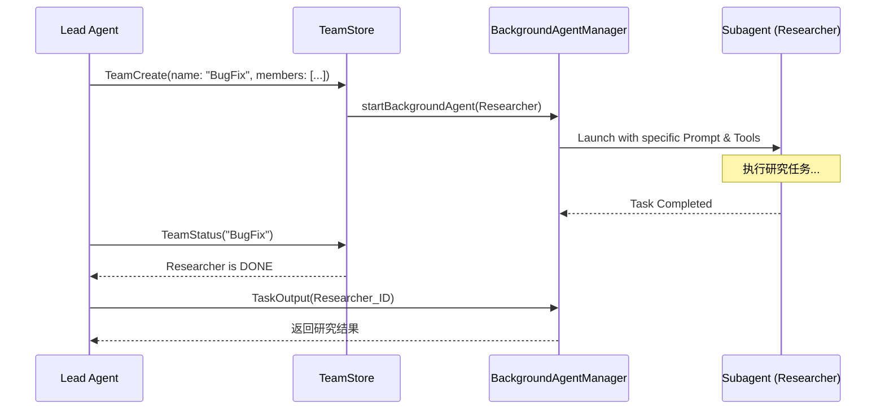

# 内置工具与 AI 核心能力

## 目录

1. [模块概览](#模块概览)
2. [核心理念：赋予 AI “超能力”](#核心理念赋予-ai-超能力)
3. [文件系统工具：原子性与智能编辑](#文件系统工具原子性与智能编辑)
   - [读取与访问追踪](#读取与访问追踪)
   - [智能编辑与冲突检测](#智能编辑与冲突检测)
   - [快照与 Diff 生成](#快照与-diff-生成)
4. [Shell 执行工具：安全沙箱与输出管理](#shell-执行工具安全沙箱与输出管理)
   - [持久化会话模拟](#持久化会话模拟)
   - [智能输出截断策略](#智能输出截断策略)
   - [后台进程管理](#后台进程管理)
5. [搜索与发现：多级降级与网络集成](#搜索与发现多级降级与网络集成)
   - [Grep 降级策略](#grep-降级策略)
   - [Web 搜索与故障转移](#web-搜索与故障转移)
6. [记忆系统：长期记忆与上下文平衡](#记忆系统长期记忆与上下文平衡)
   - [自动记忆管理架构](#自动记忆管理架构)
   - [短期上下文与长期知识的平衡](#短期上下文与长期知识的平衡)
7. [团队与子代理：多 Agent 协作](#团队与子代理多-agent-协作)
   - [子代理执行器](#子代理执行器)
   - [团队创建与任务分发](#团队创建与任务分发)
8. [核心组件实现](#核心组件实现)
9. [错误处理与恢复策略](#错误处理与恢复策略)
10. [文件参考](#文件参考)

## 模块概览

在 Blade 项目中，内置工具是 AI 能够与现实世界交互的桥梁。通过这些工具，AI 不再仅仅是一个文本生成器，而是一个能够阅读代码、执行命令、搜索网络并记住项目细节的“AI 工程师”。

本模块共包含 **50+** 个核心源文件，分布在以下子目录中：

- `packages/cli/src/tools/builtin/file/`: 包含 8 个文件，负责文件读写、智能编辑和 Diff 生成。
- `packages/cli/src/tools/builtin/shell/`: 包含 5 个文件，负责 Bash 命令执行、输出截断和后台进程管理。
- `packages/cli/src/tools/builtin/search/`: 包含 3 个文件，负责本地代码搜索（Glob, Grep）。
- `packages/cli/src/tools/builtin/web/`: 包含 5 个文件，负责网络搜索和内容抓取。
- `packages/cli/src/tools/builtin/memory/`: 包含 3 个文件，负责 Agent 记忆的读写。
- `packages/cli/src/memory/`: 包含 3 个文件，是自动记忆管理的核心实现。
- `packages/cli/src/agent/subagents/`: 包含 7 个文件，负责子代理的注册、执行和管理。

本章节将深入解析这些工具的设计理念、实现细节以及它们如何协同工作来解决复杂的工程任务。

## 核心理念：赋予 AI “超能力”

Blade 的核心目标是让 AI 能够像人类工程师一样在复杂的代码库中工作。为了实现这一目标，我们为 AI 提供了一套经过精心设计的“超能力”工具集。这些工具的设计遵循以下核心原则：

1.  **原子性与安全性**：所有的写操作（文件修改、Shell 执行）都必须是可追踪、可撤销且安全的。
2.  **上下文感知**：工具不仅执行任务，还会返回丰富的元数据（Metadata），帮助 AI 理解执行结果。
3.  **容错与降级**：在复杂环境下，工具能够自动选择最优执行路径，并在失败时尝试降级方案。
4.  **长短期记忆平衡**：通过自动记忆系统，AI 能够跨会话记住项目特定的模式和调试经验。

下图展示了 Agent、工具层与底层系统服务之间的交互关系：



**Diagram sources**:
- [packages/cli/src/tools/core/createTool.ts](file:///packages/cli/src/tools/core/createTool.ts)
- [packages/cli/src/agent/Agent.ts](file:///packages/cli/src/agent/Agent.ts)

通过这种分层架构，Blade 确保了工具的独立性和可扩展性。Agent 只需要知道如何调用工具，而工具则负责处理复杂的底层逻辑，如路径处理、并发控制和错误恢复。

## 文件系统工具：原子性与智能编辑

文件操作是 AI 最频繁使用的能力。Blade 的文件工具集（`Read`, `Write`, `Edit`）不仅封装了基础的 IO 操作，还引入了严格的验证机制。

### 读取与访问追踪

`Read` 工具不仅负责读取文件内容，还会通过 `FileAccessTracker` 记录 AI 访问过的文件。这是为了实现 **Read-Before-Write** 验证：AI 在修改文件之前，必须至少读取过一次该文件。

```typescript
// packages/cli/src/tools/builtin/file/read.ts
// 记录文件访问（用于 Read-Before-Write 验证）
if (sessionId) {
  const tracker = FileAccessTracker.getInstance();
  await tracker.recordFileRead(file_path, sessionId);
}
```

此外，`Read` 工具支持多种文件格式，包括文本、二进制、PDF 和 Jupyter Notebook。对于长文本文件，它支持行级切片（offset/limit）和自动截断，以保护 AI 的上下文窗口。

### 智能编辑与冲突检测

`Edit` 工具是 Blade 的一大特色。它不要求 AI 提供完整的修改后文件，而是通过 `old_string` 和 `new_string` 进行精确匹配替换。为了提高匹配成功率，我们实现了 `smartMatch` 算法，支持：
- **精确匹配**：完全一致的字符串。
- **引号标准化**：自动处理智能引号（“”）与直引号（""）的差异。
- **反转义匹配**：处理 AI 输出中可能存在的转义字符。
- **弹性缩进匹配**：自动忽略行首缩进差异。



**Diagram sources**:
- [packages/cli/src/tools/builtin/file/edit.ts:L67-L347](file:///packages/cli/src/tools/builtin/file/edit.ts#L67-L347)

### 快照与 Diff 生成

为了确保操作的原子性，`Write` 和 `Edit` 工具在执行修改前会通过 `SnapshotManager` 为文件创建快照。如果修改出现问题，用户可以轻松回滚。

修改完成后，工具会使用 `diffUtils` 生成 Unified Diff 格式的差异片段，并将其作为元数据返回。这不仅方便用户预览修改，也让 AI 能够确认自己的修改是否符合预期。

**Section sources**:
- [packages/cli/src/tools/builtin/file/read.ts](file:///packages/cli/src/tools/builtin/file/read.ts)
- [packages/cli/src/tools/builtin/file/write.ts](file:///packages/cli/src/tools/builtin/file/write.ts)
- [packages/cli/src/tools/builtin/file/edit.ts](file:///packages/cli/src/tools/builtin/file/edit.ts)
- [packages/cli/src/tools/builtin/file/diffUtils.ts](file:///packages/cli/src/tools/builtin/file/diffUtils.ts)

## Shell 执行工具：安全沙箱与输出管理

`Bash` 工具允许 AI 在本地或远端 IDE 环境中执行命令。为了防止 AI “迷失”在海量的输出中，我们设计了精密的输出管理系统。

### 持久化会话模拟

虽然每次 `Bash` 调用在技术上是独立的进程，但 Blade 通过 `cwd` 和环境变量的持久化，为 AI 营造了一种“持久会话”的错觉。AI 可以通过 `cd` 命令改变当前工作目录，后续的命令会自动在该目录下执行。

### 智能输出截断策略

`OutputTruncator` 是处理命令输出的关键。它根据命令的类型（如 `git status`, `npm install`, `pytest`）应用不同的截断策略：

| 策略级别 | 适用场景 | 限制 (行/字符) | 保留头尾 |
| :--- | :--- | :--- | :--- |
| **Aggressive** | `npm install`, `git add` | 30 / 3,000 | 10 / 10 |
| **Moderate** | `git status`, `ls` | 100 / 10,000 | 40 / 40 |
| **Conservative** | `git log`, `pytest` | 200 / 20,000 | 80 / 80 |

这种分级策略确保了关键信息（如测试失败的堆栈轨迹）被保留，而重复的冗余信息（如安装进度条）被剔除。

### 后台进程管理

对于长时间运行的任务（如启动开发服务器），AI 可以使用 `run_in_background` 参数。`BackgroundShellManager` 会接管这些进程，并分配唯一的 `bash_id`。AI 可以通过 `TaskOutput` 工具随时查看这些后台任务的实时输出。



**Diagram sources**:
- [packages/cli/src/tools/builtin/shell/bash.ts:L166-L210](file:///packages/cli/src/tools/builtin/shell/bash.ts#L166-L210)
- [packages/cli/src/tools/builtin/shell/OutputTruncator.ts](file:///packages/cli/src/tools/builtin/shell/OutputTruncator.ts)

**Section sources**:
- [packages/cli/src/tools/builtin/shell/bash.ts](file:///packages/cli/src/tools/builtin/shell/bash.ts)
- [packages/cli/src/tools/builtin/shell/OutputTruncator.ts](file:///packages/cli/src/tools/builtin/shell/OutputTruncator.ts)
- [packages/cli/src/tools/builtin/shell/BackgroundShellManager.ts](file:///packages/cli/src/tools/builtin/shell/BackgroundShellManager.ts)

## 搜索与发现：多级降级与网络集成

在大型代码库中，“大海捞针”是常态。Blade 提供了强大的本地和网络搜索能力。

### Grep 降级策略

`Grep` 工具不仅封装了 `ripgrep`，还实现了一套自动降级机制，确保在各种环境下都能正常工作：

1.  **Ripgrep**：首选方案，性能最强。
2.  **Git Grep**：如果是在 Git 仓库中且 `rg` 不可用。
3.  **System Grep**：降级到系统自带的 `grep` 命令。
4.  **JavaScript Fallback**：最终保底方案，使用纯 JS 递归遍历文件并进行正则匹配。

这种设计保证了 Blade 的跨平台兼容性和鲁棒性。

### Web 搜索与故障转移

`WebSearch` 工具为 AI 提供了访问实时信息的能力。它集成了多个搜索引擎提供商（如 DuckDuckGo, SearXNG），并支持自动故障转移（Failover）。如果一个提供商请求失败，它会自动尝试下一个。

此外，它还内置了：
- **搜索缓存**：避免对相同查询的重复请求。
- **域名过滤**：支持 `allowed_domains` 和 `blocked_domains`。
- **自动重试**：使用指数退避策略处理网络波动。

**Section sources**:
- [packages/cli/src/tools/builtin/search/grep.ts](file:///packages/cli/src/tools/builtin/search/grep.ts)
- [packages/cli/src/tools/builtin/web/webSearch.ts](file:///packages/cli/src/tools/builtin/web/webSearch.ts)

## 记忆系统：长期记忆与上下文平衡

AI 在处理大型项目时，往往会遇到上下文窗口限制。Blade 通过 `AutoMemoryManager` 实现了一套持久化的记忆系统，帮助 AI 记住那些“不在代码里”的知识。

### 自动记忆管理架构

记忆存储在项目特定的本地目录中（通常是 `~/.blade/projects/{id}/memory/`）。核心结构如下：
- `MEMORY.md`：索引文件，记录了最重要的项目知识。
- `patterns.md`：记录项目特定的代码模式或最佳实践。
- `debugging.md`：记录已解决的复杂 Bug 及其根因。

### 短期上下文与长期知识的平衡

在每次会话启动时，`AutoMemoryManager` 会加载 `MEMORY.md` 的前 N 行并注入到 System Prompt 中。这确保了 AI 能够立刻感知到项目的核心背景。

当 AI 需要更深入的细节时，它可以调用 `MemoryRead` 工具读取特定的主题文件；当 AI 学到新知识时，它会使用 `MemoryWrite` 工具更新记忆库。


**Diagram sources**:
- [packages/cli/src/memory/AutoMemoryManager.ts](file:///packages/cli/src/memory/AutoMemoryManager.ts)

**Section sources**:
- [packages/cli/src/memory/AutoMemoryManager.ts](file:///packages/cli/src/memory/AutoMemoryManager.ts)
- [packages/cli/src/tools/builtin/memory/index.ts](file:///packages/cli/src/tools/builtin/memory/index.ts)

## 团队与子代理：多 Agent 协作

对于极其复杂的任务，单个 AI 实例可能力有不逮。Blade 引入了“团队”概念，支持多 Agent 协作。

### 子代理执行器

`SubagentExecutor` 是创建子代理的核心。它允许主代理（Lead Agent）派生出一个具有特定角色、系统提示词和 **受限工具集** 的子代理。例如，主代理可以派生一个专门负责“运行测试”的子代理，该子代理只能访问 `Bash` 和 `Read` 工具，而不能修改代码。

### 团队创建与任务分发

通过 `TeamCreate` 工具，AI 可以组建一个多人的专家团队。每个成员（Teammate）都是一个在后台运行的子代理。主代理负责统筹规划，将任务分配给不同的成员，并通过 `TeamStatus` 监控进度。



**Diagram sources**:
- [packages/cli/src/tools/builtin/team/teamTools.ts:L41-L167](file:///packages/cli/src/tools/builtin/team/teamTools.ts#L41-L167)
- [packages/cli/src/agent/subagents/SubagentExecutor.ts](file:///packages/cli/src/agent/subagents/SubagentExecutor.ts)

**Section sources**:
- [packages/cli/src/agent/subagents/SubagentExecutor.ts](file:///packages/cli/src/agent/subagents/SubagentExecutor.ts)
- [packages/cli/src/tools/builtin/team/teamTools.ts](file:///packages/cli/src/tools/builtin/team/teamTools.ts)

## 核心组件实现

内置工具的实现基于 `createTool` 工厂函数，它定义了工具的 Schema、描述、执行逻辑以及权限规则。

| 组件 | 职责 | 关键文件 |
| :--- | :--- | :--- |
| `BaseTool` | 工具基础接口定义 | `packages/cli/src/tools/types/index.ts` |
| `createTool` | 工具创建工厂函数 | `packages/cli/src/tools/core/createTool.ts` |
| `ToolSchemas` | 统一的 Zod 校验 Schema | `packages/cli/src/tools/validation/zodSchemas.ts` |
| `ExecutionContext` | 提供执行上下文（Session, Signal, Output） | `packages/cli/src/tools/types/index.ts` |

### 代码示例：Edit 工具的智能匹配逻辑

```typescript
// packages/cli/src/tools/builtin/file/edit.ts
function smartMatch(content: string, searchString: string): MatchResult {
  // 策略 1: 精确匹配
  if (content.includes(searchString)) {
    return { matched: searchString, strategy: MatchStrategy.EXACT };
  }

  // 策略 2: 标准化引号后匹配
  const normalizedSearch = normalizeQuotes(searchString);
  const normalizedContent = normalizeQuotes(content);
  // ... 逻辑省略

  // 策略 4: 弹性缩进匹配
  const flexible = flexibleMatch(content, searchString);
  if (flexible) {
    return { matched: flexible, strategy: MatchStrategy.FLEXIBLE };
  }

  return { matched: null, strategy: MatchStrategy.FAILED };
}
```

## 错误处理与恢复策略

Blade 的工具设计非常注重 AI 的“自我修复”能力。当工具执行失败时，它不仅返回错误原因，还会提供具体的恢复建议。

1.  **编辑失败**：如果 `Edit` 工具未找到匹配项，它会生成一个“富文本错误信息”，包含文件内容的摘录、模糊匹配建议以及可能的失败原因（如缩进不匹配、引号差异）。
2.  **写前未读**：如果 AI 尝试直接写入未读取的文件，工具会明确提示“必须先读取文件”。
3.  **冲突检测**：如果文件在 AI 读取后被外部程序修改，工具会检测到 `mtime` 的变化并阻止写入，引导 AI 重新读取。
4.  **命令超时**：`Bash` 工具在超时后会尝试优雅关闭进程，并返回已捕获的部分输出，帮助 AI 判断任务进度。

## 文件参考

以下是本章节涉及的核心源文件：

- [packages/cli/src/tools/builtin/file/read.ts](file:///packages/cli/src/tools/builtin/file/read.ts) - 文件读取工具实现
- [packages/cli/src/tools/builtin/file/write.ts](file:///packages/cli/src/tools/builtin/file/write.ts) - 文件写入工具实现
- [packages/cli/src/tools/builtin/file/edit.ts](file:///packages/cli/src/tools/builtin/file/edit.ts) - 智能编辑工具实现
- [packages/cli/src/tools/builtin/file/diffUtils.ts](file:///packages/cli/src/tools/builtin/file/diffUtils.ts) - Diff 生成工具函数
- [packages/cli/src/tools/builtin/file/FileAccessTracker.ts](file:///packages/cli/src/tools/builtin/file/FileAccessTracker.ts) - 文件访问追踪器
- [packages/cli/src/tools/builtin/shell/bash.ts](file:///packages/cli/src/tools/builtin/shell/bash.ts) - Bash 命令执行工具
- [packages/cli/src/tools/builtin/shell/OutputTruncator.ts](file:///packages/cli/src/tools/builtin/shell/OutputTruncator.ts) - 输出截断策略实现
- [packages/cli/src/tools/builtin/search/grep.ts](file:///packages/cli/src/tools/builtin/search/grep.ts) - 多级搜索降级实现
- [packages/cli/src/tools/builtin/search/glob.ts](file:///packages/cli/src/tools/builtin/search/glob.ts) - 快速模式匹配实现
- [packages/cli/src/memory/AutoMemoryManager.ts](file:///packages/cli/src/memory/AutoMemoryManager.ts) - 自动记忆管理核心
- [packages/cli/src/agent/subagents/SubagentExecutor.ts](file:///packages/cli/src/agent/subagents/SubagentExecutor.ts) - 子代理执行器
- [packages/cli/src/tools/builtin/team/teamTools.ts](file:///packages/cli/src/tools/builtin/team/teamTools.ts) - 团队协作工具集
- [packages/cli/src/tools/builtin/web/webSearch.ts](file:///packages/cli/src/tools/builtin/web/webSearch.ts) - 网络搜索工具实现
