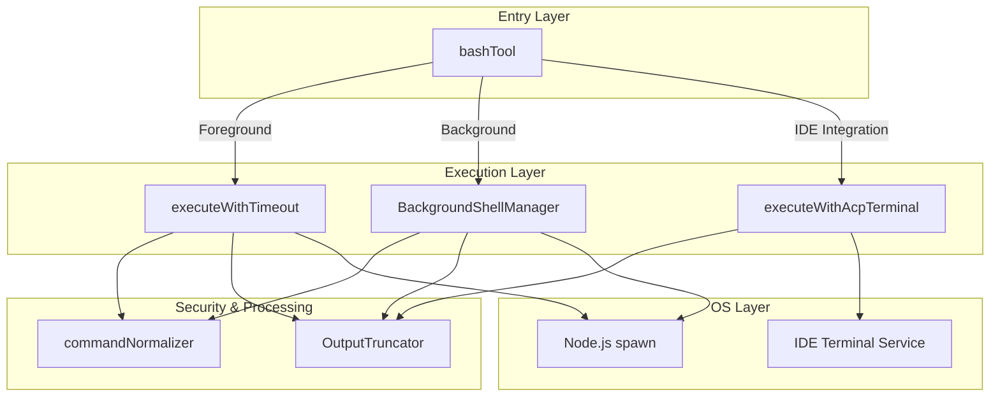
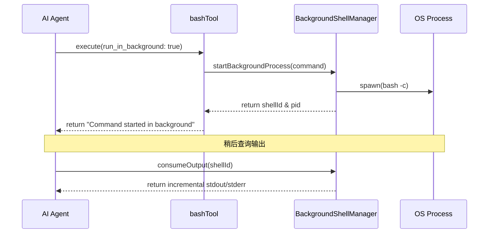
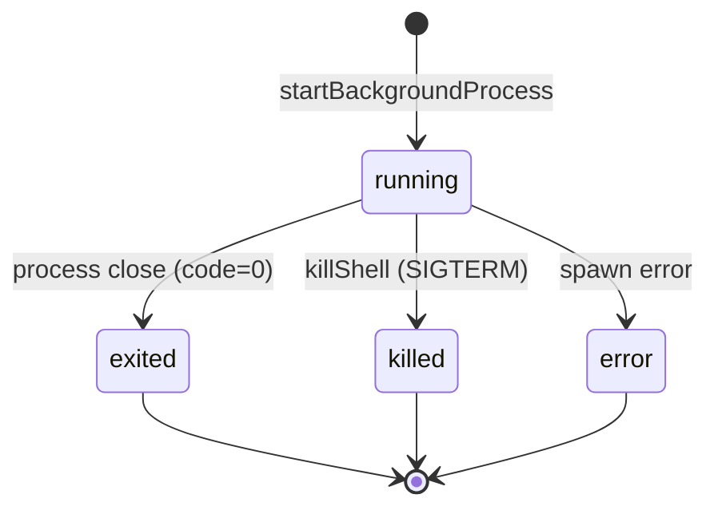
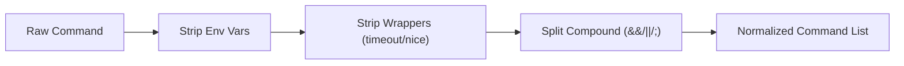
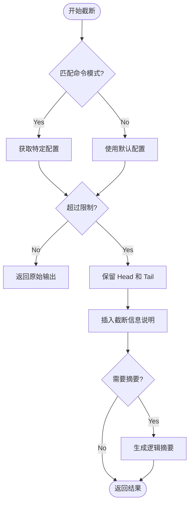
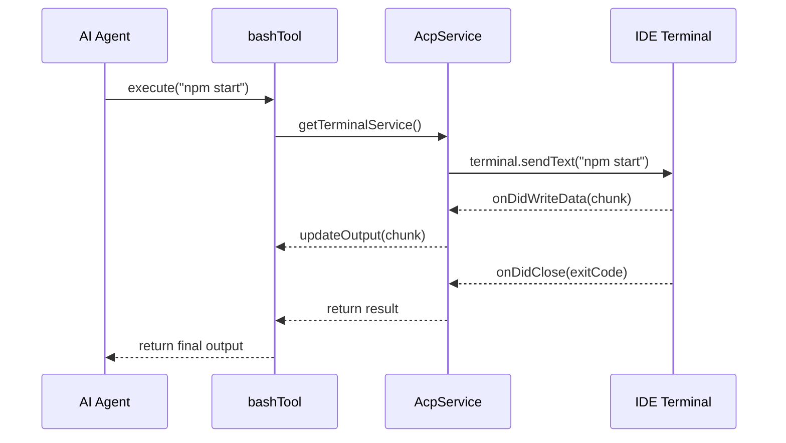

# Shell 执行与安全沙箱

## 目录
1. [模块概览](#模块概览)
2. [引言](#引言)
3. [架构设计](#架构设计)
4. [核心执行机制](#核心执行机制)
5. [后台进程管理](#后台进程管理)
6. [安全沙箱与命令规范化](#安全沙箱与命令规范化)
7. [输出截断策略](#输出截断策略)
8. [IDE 集成与 ACP 模式](#ide-集成与-acp-模式)
9. [错误处理与超时控制](#错误处理与超时控制)
10. [文件引用](#文件引用)

## 模块概览

Blade 的 Shell 执行模块是 AI 与操作系统交互的核心桥梁。它不仅负责执行基础的终端命令，还承担着保护系统安全、管理长时进程以及优化 Token 消耗的重要职责。

在本模块的探索中，我们发现了以下核心组成部分：

*   **文件总数**：共计 6 个核心 TypeScript 文件（包含 1 个关键工具类）。
*   **子模块分布**：
    *   `bash.ts`: 工具入口，负责前台与后台执行逻辑的分发。
    *   `BackgroundShellManager.ts`: 单例管理器，维护跨对话轮次的后台进程状态。
    *   `OutputTruncator.ts`: 智能输出处理器，根据命令类型动态调整截断策略。
    *   `commandNormalizer.ts`: 安全卫士，负责命令的规范化、脱敏及危险模式检测。
    *   `killShell.ts`: 辅助工具，用于安全地终止不再需要的后台进程。
    *   `index.ts`: 模块导出层。

本章将深入解析这些组件如何协同工作，构建出一个既强大又安全的 AI 命令执行环境。

## 引言

在现代 AI 辅助开发工具中，Shell 执行能力是不可或缺的。无论是运行测试、启动开发服务器，还是执行 Git 操作，AI 都需要一个稳定且可控的终端接口。然而，直接暴露系统 Shell 存在巨大的安全风险，且冗长的终端输出会迅速耗尽 LLM 的上下文窗口。

Blade 的 Shell 模块设计遵循以下三个核心原则：

1.  **安全性（Security First）**：通过命令规范化（Normalization）和危险模式检测（Unsafe Pattern Detection），拦截潜在的恶意操作，如管道重定向攻击或敏感环境变量泄露。
2.  **可观测性（Observability）**：无论是前台阻塞执行还是后台异步运行，系统都能实时捕获并结构化 stdout 和 stderr，确保 AI 能够准确理解执行结果。
3.  **效率（Efficiency）**：引入智能截断算法，针对不同类型的命令（如 `npm install` 与 `git log`）应用不同的压缩策略，在保留关键信息的同时最小化 Token 占用。

通过这一套复杂的机制，Blade 成功地将一个不确定的终端环境转化为了一个结构化、可审计的 AI 工具集。

## 架构设计

Blade 的 Shell 执行架构采用了典型的“分层代理”模式。`bashTool` 作为外部调用的唯一入口，根据参数将任务分发给不同的执行器。

下面的架构图展示了各组件之间的协作关系：



**图表说明**：
该架构图展示了从 `bashTool` 接收请求到最终在操作系统或 IDE 终端执行的全过程。`bashTool` 充当调度员，根据 `run_in_background` 和 `isAcpMode` 标志位决定执行路径。所有的执行路径在最终返回结果前，都会经过 `commandNormalizer` 进行安全校验，并由 `OutputTruncator` 处理输出内容。

**架构核心点解析**：
1.  **解耦执行环境**：通过 `executeWithAcpTerminal` 抽象层，Blade 能够无缝切换本地 Node.js 环境与 IDE 插件环境。
2.  **统一处理流水线**：无论命令如何执行，输出处理逻辑（截断、统计、摘要生成）都是高度统一的。
3.  **单例状态维护**：`BackgroundShellManager` 作为一个全局单例，确保了即使在多次对话切换中，后台进程的句柄和输出缓冲区也不会丢失。

**Diagram sources**: 
- [bash.ts:L166-L210](file:///Users/bytedance/Documents/GitHub/Blade/packages/cli/src/tools/builtin/shell/bash.ts#L166-L210)
- [BackgroundShellManager.ts:L55-L64](file:///Users/bytedance/Documents/GitHub/Blade/packages/cli/src/tools/builtin/shell/BackgroundShellManager.ts#L55-L64)

## 核心执行机制

Blade 支持两种主要的执行模式：**前台同步执行**和**后台异步执行**。

### 1. 前台同步执行 (Foreground Execution)

这是最常用的模式，适用于执行时间较短、需要立即获取结果的命令（如 `ls`, `git status`）。系统使用 `child_process.spawn` 启动 `bash -c`，并通过 Promise 封装异步过程。

关键实现代码如下：

```typescript
async function executeWithTimeout(
  command: string,
  cwd: string | undefined,
  env: Record<string, string> | undefined,
  timeout: number,
  signal: AbortSignal,
  updateOutput?: (output: string) => void
): Promise<ToolResult> {
  return new Promise((resolve) => {
    const startTime = Date.now();
    let stdout = '';
    let stderr = '';

    const bashProcess = spawn('bash', ['-c', command], {
      cwd: cwd || getCwd(),
      env: { ...process.env, ...env, BLADE_CLI: '1' },
      stdio: ['pipe', 'pipe', 'pipe'],
    });

    bashProcess.stdout.on('data', (data) => {
      stdout += data.toString();
    });

    // ... 信号处理与超时逻辑 ...

    bashProcess.on('close', (code, sig) => {
      // 正常完成处理
      const truncated = OutputTruncator.truncateForLLM(stdout.trim(), stderr.trim(), command);
      resolve({
        success: true,
        llmContent: {
          stdout: truncated.stdout,
          stderr: truncated.stderr,
          // ... 更多元数据 ...
        },
      });
    });
  });
}
```

**代码解析**：
在前台执行中，Blade 显式地将 `stdio` 设置为 `pipe`。这允许系统实时捕获输出流。值得注意的是，Blade 在环境变量中注入了 `BLADE_CLI: '1'`，这为被执行的脚本提供了一个识别环境的机会，方便进行特定于 AI 环境的调整。

### 2. 后台异步执行 (Background Execution)

当 AI 需要启动一个开发服务器（如 `npm run dev`）或执行耗时极长的编译任务时，后台执行模式就派上用场了。



**流程说明**：
后台执行流程与前台最大的不同在于它不等待进程结束。`BackgroundShellManager` 启动进程后立即返回一个唯一的 `shellId`。AI 可以在后续的对话轮次中，通过专门的查询工具（如 `TaskOutput`，虽然在本目录下未直接定义，但逻辑上由 `consumeOutput` 支撑）来获取增量输出。

**Section sources**: 
- [bash.ts:L447-L619](file:///Users/bytedance/Documents/GitHub/Blade/packages/cli/src/tools/builtin/shell/bash.ts#L447-L619)
- [BackgroundShellManager.ts:L66-L129](file:///Users/bytedance/Documents/GitHub/Blade/packages/cli/src/tools/builtin/shell/BackgroundShellManager.ts#L66-L129)

## 后台进程管理

`BackgroundShellManager` 是整个模块中最复杂的组件之一。它不仅要管理进程的生命周期，还要处理异步产生的海量输出。

### 状态维护逻辑

每个后台进程在管理器中都以 `BackgroundShellProcess` 对象的形式存在。其状态机转换如下：



**状态说明**：
- **running**: 进程已启动，正在实时收集 stdout/stderr 到 `pendingStdout` 缓冲区。
- **exited**: 进程自然结束。管理器会保留最后的退出码，直到 AI 显式清理。
- **killed**: 响应 `killShell` 工具的调用，主动发送信号终止进程。
- **error**: 启动失败（如命令不存在）或进程崩溃。

### 交互式命令的处理

虽然目前的实现主要针对非交互式命令，但 `BackgroundShellManager` 通过 `consumeOutput` 机制模拟了“流式”体验。

```typescript
consumeOutput(shellId: string): ShellOutputSnapshot | undefined {
  const processInfo = this.processes.get(shellId);
  if (!processInfo) return undefined;

  const snapshot: ShellOutputSnapshot = {
    // ... 填充快照信息 ...
    stdout: processInfo.pendingStdout,
    stderr: processInfo.pendingStderr,
  };

  // 关键：消费后清空缓冲区，实现增量读取
  processInfo.pendingStdout = '';
  processInfo.pendingStderr = '';

  return snapshot;
}
```

**设计精要**：
`consumeOutput` 的“读取即清空”策略非常巧妙。它确保了 AI 每次查询时只会看到自上次查询以来的*新内容*。这极大地节省了 Token，因为 AI 不需要反复阅读已经处理过的日志。

**Section sources**: 
- [BackgroundShellManager.ts:L5-L30](file:///Users/bytedance/Documents/GitHub/Blade/packages/cli/src/tools/builtin/shell/BackgroundShellManager.ts#L5-L30)
- [BackgroundShellManager.ts:L131-L155](file:///Users/bytedance/Documents/GitHub/Blade/packages/cli/src/tools/builtin/shell/BackgroundShellManager.ts#L131-L155)

## 安全沙箱与命令规范化

为了防止 AI 意外或被诱导执行危险命令，Blade 引入了极其严格的 `commandNormalizer`。

### 命令规范化流水线

在进行权限校验或匹配安全规则前，原始命令必须经过脱敏处理。



**流水线步骤解析**：
1.  **剥离环境变量**：系统维护了一个 `SAFE_ENV_VARS` 白名单（如 `NODE_ENV`, `LANG`）。只有白名单内的变量会被剥离，未知的变量会被保留以触发更严格的校验。
2.  **剥离包装器**：像 `timeout 30s` 或 `nice -n 10` 这样的前缀会被移除，露出核心命令。
3.  **拆分复合命令**：使用 `splitCompoundCommand` 将 `git add . && git commit` 拆分为独立的原子操作。

### 危险模式检测 (Unsafe Pattern Detection)

`containsUnsafePatterns` 函数是安全沙箱的最后一道防线。它通过词法扫描检测以下危险特征：

*   **管道与重定向**：`|`, `>`, `>>`, `<`。防止 AI 将敏感文件内容重定向到外部。
*   **子外壳与变量替换**：`$()`, `` ` `` , `${VAR}`。防止利用 Shell 扩展执行任意代码。
*   **大括号扩展**：`{a,b}`。防止构造极其复杂的路径。

> **Warning**
> 任何包含上述模式的命令在“只读模式”下都会被立即拒绝。在执行模式下，它们通常需要用户显式确认。

**Section sources**: 
- [commandNormalizer.ts:L23-L40](file:///Users/bytedance/Documents/GitHub/Blade/packages/cli/src/utils/shell/commandNormalizer.ts#L23-L40)
- [commandNormalizer.ts:L284-L345](file:///Users/bytedance/Documents/GitHub/Blade/packages/cli/src/utils/shell/commandNormalizer.ts#L284-L345)

## 输出截断策略

AI 的上下文窗口是极其宝贵的资源。`OutputTruncator` 确保了即使命令输出了数万行日志（如 `npm install`），返回给 LLM 的内容依然是精简且关键的。

### 分级截断模型

`OutputTruncator` 根据命令的正则表达式匹配结果，选择不同的配置：

| 策略级别 | 适用场景 | 最大行数 | 保留头/尾 | 是否生成摘要 |
| :--- | :--- | :--- | :--- | :--- |
| **Aggressive** | `npm install`, `git add` | 30 | 10 / 10 | 是 |
| **Moderate** | `ls`, `git status`, `find` | 100 | 40 / 40 | 是 |
| **Conservative** | `git log`, `npm test` | 200 | 80 / 80 | 否 |
| **Default** | 其他未知命令 | 150 | 50 / 50 | 是 |

### 截断逻辑流



**逻辑说明**：
截断不仅仅是简单的切掉中间部分。对于 `npm install`，摘要可能会显示“成功处理了 500 个包”；对于 `ls`，它会显示“共列出了 50 项”。这种“语义化截断”让 AI 即使没看到完整输出，也能理解操作的最终结果。

**Section sources**: 
- [OutputTruncator.ts:L24-L54](file:///Users/bytedance/Documents/GitHub/Blade/packages/cli/src/tools/builtin/shell/OutputTruncator.ts#L24-L54)
- [OutputTruncator.ts:L142-L190](file:///Users/bytedance/Documents/GitHub/Blade/packages/cli/src/tools/builtin/shell/OutputTruncator.ts#L142-L190)

## IDE 集成与 ACP 模式

在 IDE 插件（如 VS Code 或 JetBrains）中使用 Blade 时，Shell 命令并不在 Blade 自己的进程中运行，而是通过 **ACP (Agent Communication Protocol)** 转发给 IDE 终端。



**ACP 模式的优势**：
1.  **用户可见性**：用户可以在 IDE 的终端面板中看到 AI 正在执行的命令，这种透明度是安全的关键。
2.  **环境一致性**：命令在用户的真实终端环境中执行，自动继承了 `.zshrc` 或 `.bash_profile` 中的配置。
3.  **交互性**：如果命令需要简单的用户输入，用户可以直接在 IDE 终端中操作。

**Section sources**: 
- [bash.ts:L322-L442](file:///Users/bytedance/Documents/GitHub/Blade/packages/cli/src/tools/builtin/shell/bash.ts#L322-L442)

## 错误处理与超时控制

Shell 执行充满了不确定性。Blade 通过多层超时和信号机制确保系统不会被僵尸进程拖垮。

### 阶梯式终止策略

当命令超时或用户点击“中止”时，Blade 不会立即发送 `SIGKILL`，而是采用更优雅的方式：

1.  **第一阶段 (SIGTERM)**：发送终止信号，允许进程进行清理操作（如保存临时文件、关闭数据库连接）。
2.  **等待期**：等待 1000ms。
3.  **第二阶段 (SIGKILL)**：如果进程依然存活，强制杀掉进程。

### 异常分类

系统将错误分为几类返回给 AI：
- `TIMEOUT_ERROR`: 明确的执行超时。
- `EXECUTION_ERROR`: 命令本身执行失败（退出码非 0）或系统调用错误（如权限不足）。
- `ABORT_ERROR`: 用户主动中止。

这种分类帮助 AI 决定接下来的策略：是尝试增加超时时间重试，还是检查命令语法错误。

**Section sources**: 
- [bash.ts:L479-L489](file:///Users/bytedance/Documents/GitHub/Blade/packages/cli/src/tools/builtin/shell/bash.ts#L479-L489)
- [killShell.ts:L29-L69](file:///Users/bytedance/Documents/GitHub/Blade/packages/cli/src/tools/builtin/shell/killShell.ts#L29-L69)

## 文件引用

以下是构建 Blade Shell 执行与安全沙箱系统的核心文件：

*   [bash.ts](file:///Users/bytedance/Documents/GitHub/Blade/packages/cli/src/tools/builtin/shell/bash.ts) - 核心工具定义与分发逻辑。
*   [BackgroundShellManager.ts](file:///Users/bytedance/Documents/GitHub/Blade/packages/cli/src/tools/builtin/shell/BackgroundShellManager.ts) - 后台进程生命周期管理。
*   [OutputTruncator.ts](file:///Users/bytedance/Documents/GitHub/Blade/packages/cli/src/tools/builtin/shell/OutputTruncator.ts) - 智能输出截断与摘要生成。
*   [killShell.ts](file:///Users/bytedance/Documents/GitHub/Blade/packages/cli/src/tools/builtin/shell/killShell.ts) - 进程终止工具。
*   [commandNormalizer.ts](file:///Users/bytedance/Documents/GitHub/Blade/packages/cli/src/utils/shell/commandNormalizer.ts) - 安全校验与命令规范化工具。
*   [index.ts](file:///Users/bytedance/Documents/GitHub/Blade/packages/cli/src/tools/builtin/shell/index.ts) - 模块导出入口。
