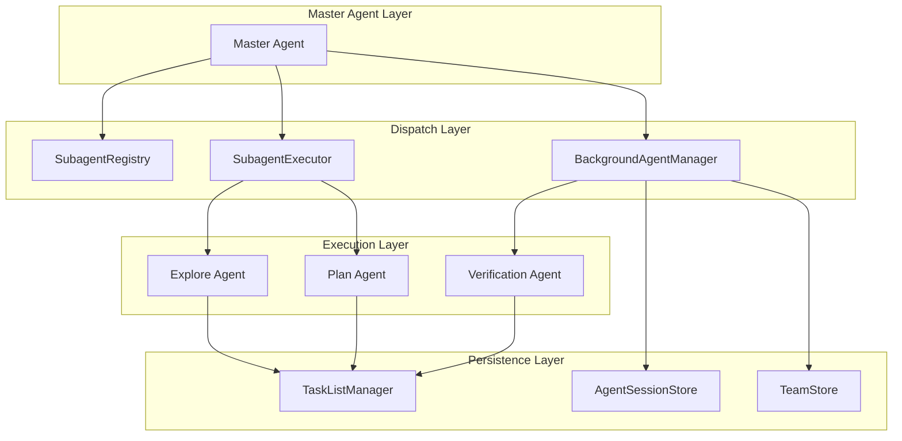
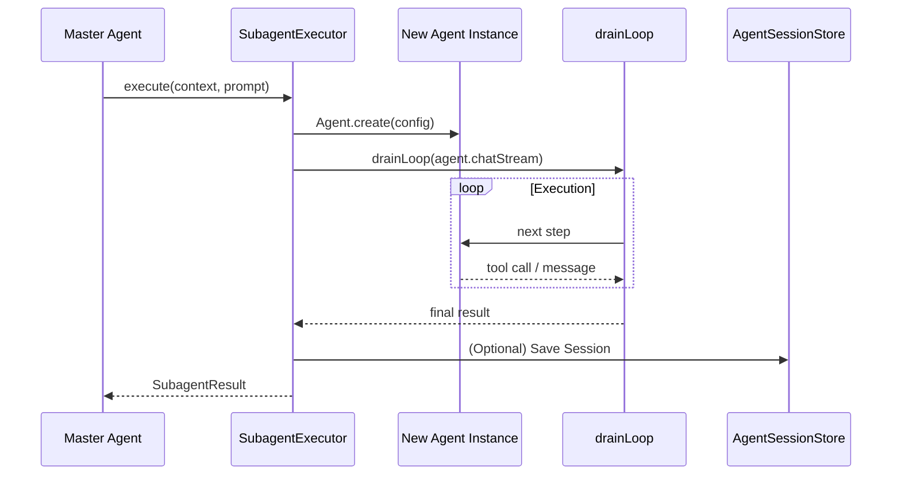
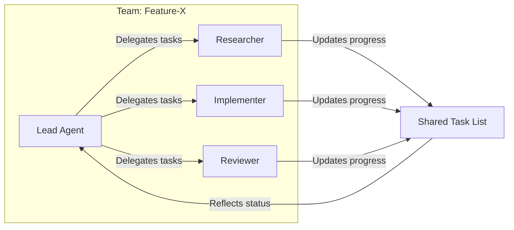
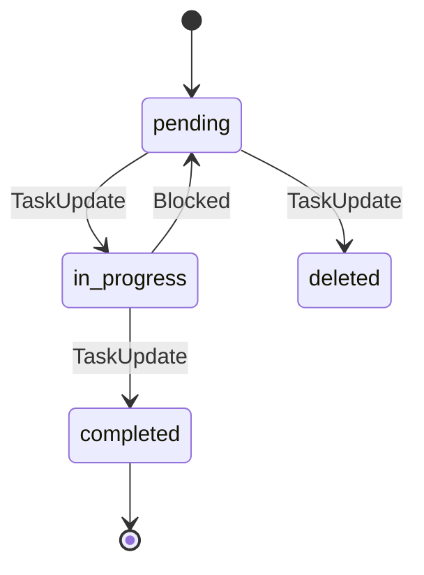

# 团队协作与子代理架构

## 目录
1. [模块概览](#模块概览)
2. [引言](#引言)
3. [核心架构设计](#核心架构设计)
4. [子代理注册与发现](#子代理注册与发现)
5. [子代理执行机制](#子代理执行机制)
   - [SubagentExecutor：前台同步执行](#subagentexecutor前台同步执行)
   - [BackgroundAgentManager：后台异步执行](#backgroundagentmanager后台异步执行)
6. [团队协作与分治策略](#团队协作与分治策略)
   - [TeamCreate：构建代理团队](#teamcreate构建代理团队)
   - [任务列表管理：协作的“粘合剂”](#任务列表管理协作的粘合剂)
7. [会话持久化与无状态设计](#会话持久化与无状态设计)
8. [核心组件](#核心组件)
9. [文件引用](#文件引用)

## 模块概览

本章节涵盖了 Blade 的多代理协作系统，该系统实现了复杂工程任务的“分治”处理。

- **总文件数**: 15 个 TypeScript 文件
- **涵盖子模块**:
  - `agent/subagents/`: 子代理核心逻辑（注册、执行、后台管理、会话存储）
  - `tools/builtin/team/`: 团队协作工具集（创建团队、状态追踪、删除团队）
  - `tools/builtin/task/`: 任务列表管理（任务创建、更新、列表展示、依赖管理）

本 wiki 将深入解析这些模块如何协同工作，使 Blade 能够从单一的对话代理演进为具备团队协作能力的复杂任务处理系统。

## 引言

在处理大型工程项目时，单一的 LLM 代理往往会面临上下文窗口限制、逻辑复杂性过高以及工具调用链路过长等挑战。Blade 引入了**多代理协作系统 (Multi-Agent Collaboration System)**，通过“分治 (Divide and Conquer)”策略来应对这些挑战。

该系统的核心思想是将一个复杂的工程目标拆解为多个子任务，并委派给专门化的**子代理 (Subagents)** 或构建**代理团队 (Agent Teams)** 来并行或串行处理。这种架构不仅提高了任务处理的成功率，还增强了系统的可扩展性和可维护性。

## 核心架构设计

Blade 的多代理架构由主代理 (Master Agent) 驱动，通过一套标准化的协议来调度子代理。



该架构图展示了从主代理到执行层的层级关系。`SubagentRegistry` 负责发现可用的代理类型；`SubagentExecutor` 处理同步任务，而 `BackgroundAgentManager` 负责管理异步的后台任务。所有代理都通过 `TaskListManager` 共享任务进度，并通过 `AgentSessionStore` 和 `TeamStore` 实现状态持久化。

**架构设计要点**：
1. **职责分离**：主代理负责决策和拆解，子代理负责执行具体的专门化任务（如搜索、绘图、验证）。
2. **多模式执行**：支持前台阻塞式执行（适用于快速工具调用）和后台异步执行（适用于耗时较长的工程任务）。
3. **共享上下文**：通过 `taskListId` 实现多个代理之间的任务同步和状态共享。

## 子代理注册与发现

`SubagentRegistry` 是系统的元数据中心，它负责加载和管理所有可用的子代理配置。

Blade 采用了与 Claude Code 兼容的配置格式：**Markdown + YAML Frontmatter**。这种格式既方便 LLM 理解其职责（Markdown 部分作为 System Prompt），又方便程序解析其属性（YAML 部分定义工具白名单、模型等）。

```typescript
// packages/cli/src/agent/subagents/SubagentRegistry.ts

export class SubagentRegistry {
  private subagents = new Map<string, SubagentConfig>();

  /**
   * 按优先级加载配置：
   * 1. 内置配置 (builtinAgents.ts)
   * 2. Claude Code 用户级配置 (~/.claude/agents/)
   * 3. Claude Code 项目级配置 (.claude/agents/)
   * 4. Blade 用户级配置 (~/.blade/agents/)
   * 5. Blade 项目级配置 (.blade/agents/)
   */
  loadFromStandardLocations(): number {
    this.loadBuiltinAgents();
    // ... 加载各级目录 ...
    return this.getAllNames().length;
  }
}
```

**配置示例 (`.blade/agents/researcher.md`)**:
```markdown
---
name: researcher
description: 专门负责代码调研和文档检索的代理
tools: [Glob, Grep, Read, WebSearch]
model: sonnet
---
# Researcher Subagent
你是一个专业的调研员。你的任务是深入探索代码库，找到关键实现并总结其逻辑。
```

这种层级加载机制允许用户在项目级别自定义代理行为，甚至覆盖内置代理的逻辑，极大地增强了灵活性。

**Section sources**:
- [SubagentRegistry.ts](file:///Users/bytedance/Documents/GitHub/Blade/packages/cli/src/agent/subagents/SubagentRegistry.ts)
- [builtinAgents.ts](file:///Users/bytedance/Documents/GitHub/Blade/packages/cli/src/agent/subagents/builtinAgents.ts)

## 子代理执行机制

子代理的执行分为前台同步和后台异步两种模式，分别由 `SubagentExecutor` 和 `BackgroundAgentManager` 驱动。

### SubagentExecutor：前台同步执行

当主代理需要立即获得结果时（例如调用 `Explore` 代理寻找文件），会使用 `SubagentExecutor`。它采用无状态设计，每次执行都会创建一个全新的 `Agent` 实例。



在上述流程中，`SubagentExecutor` 充当了“工厂”和“控制器”的角色。它通过 `drainLoop` 驱动子代理的对话流，并在完成后销毁实例。这种设计保证了子代理之间、以及子代理与主代理之间的上下文隔离，避免了副作用的累积。

### BackgroundAgentManager：后台异步执行

对于复杂的工程任务（如重构整个模块），主代理会通过 `BackgroundAgentManager` 启动后台代理。

**后台执行的关键特性**：
1. **生命周期管理**：支持 `start`, `stop`, `wait`, `resume` 等操作。
2. **持久化存储**：使用 `AgentSessionStore` 将消息历史和状态写入磁盘（`~/.blade/agents/sessions/`）。
3. **可恢复性**：由于状态已持久化，即使 CLI 进程重启，用户也可以通过 `resume` 功能继续之前的任务。

```typescript
// packages/cli/src/agent/subagents/BackgroundAgentManager.ts

async executeAgent(agentId, config, prompt, ...) {
  // 1. 创建运行时和 Agent 实例
  const runtime = await SessionRuntime.create({ sessionId: agentId });
  const agent = await Agent.createWithRuntime(runtime, { ... });

  // 2. 执行 Loop 并实时更新会话存储
  const loopResult = await drainLoop(agent.chatStream(prompt, context));
  
  // 3. 标记完成并保存最终状态
  this.sessionStore.markCompleted(agentId, result, stats);
}
```

**Section sources**:
- [SubagentExecutor.ts](file:///Users/bytedance/Documents/GitHub/Blade/packages/cli/src/agent/subagents/SubagentExecutor.ts)
- [BackgroundAgentManager.ts](file:///Users/bytedance/Documents/GitHub/Blade/packages/cli/src/agent/subagents/BackgroundAgentManager.ts)
- [AgentSessionStore.ts](file:///Users/bytedance/Documents/GitHub/Blade/packages/cli/src/agent/subagents/AgentSessionStore.ts)

## 团队协作与分治策略

为了处理跨模块、多阶段的复杂任务，Blade 引入了“团队 (Team)”的概念。

### TeamCreate：构建代理团队

`TeamCreate` 工具允许主代理一次性创建多个专门化的后台代理，并为它们分配不同的职责。



在团队模式下，每个成员（Teammate）都是一个独立的后台代理。它们通过 `TeamStore` 记录隶属关系，并共享同一个 `taskListId`。

### 任务列表管理：协作的“粘合剂”

`TaskListManager` 是多代理协作的核心通信机制。它不仅用于追踪进度，还定义了任务之间的依赖关系。

**任务状态机**：


**任务依赖 (Dependency Management)**：
`TaskListManager` 通过 `blocks` 和 `blockedBy` 字段维护任务的有向无环图 (DAG)。这允许代理识别哪些任务可以并行执行，哪些必须等待前提条件达成。

```typescript
// packages/cli/src/tools/builtin/task/TaskListManager.ts

async updateTask(taskId, updates) {
  // ... 更新状态 ...
  // 同步依赖边：如果 A blocks B，则 B 自动 blockedBy A
  await this.syncDependencyEdges(next, updates.addBlocks, updates.addBlockedBy);
  await this.saveTasks();
}
```

通过这种方式，即使多个代理在不同的进程或上下文中运行，它们也能通过共享的任务列表文件感知到整个团队的进度和阻塞点。

**Section sources**:
- [teamTools.ts](file:///Users/bytedance/Documents/GitHub/Blade/packages/cli/src/tools/builtin/team/teamTools.ts)
- [TaskListManager.ts](file:///Users/bytedance/Documents/GitHub/Blade/packages/cli/src/tools/builtin/task/TaskListManager.ts)
- [taskListTools.ts](file:///Users/bytedance/Documents/GitHub/Blade/packages/cli/src/tools/builtin/task/taskListTools.ts)

## 会话持久化与无状态设计

Blade 在架构上巧妙地平衡了“无状态执行”和“持久化状态”。

### 无状态设计的优势
`SubagentExecutor` 的无状态设计意味着每个子代理调用都是幂等的、隔离的。
- **可靠性**：一个子代理的崩溃不会直接影响主代理或其他子代理。
- **可测试性**：可以针对特定的系统提示和输入独立测试子代理的行为。
- **资源管理**：执行完毕后立即释放内存和运行时资源。

### 持久化存储的作用
`AgentSessionStore` 弥补了无状态执行在长任务处理上的不足。
- **断点续传**：保存完整的 `Message[]` 历史，支持 `resume` 操作。
- **可审计性**：所有子代理的对话流都被记录在 `~/.blade/agents/sessions/agent_<id>.json` 中，方便用户复盘代理的决策过程。
- **统计分析**：记录每个代理的 Token 消耗、工具调用次数和执行时长。

## 核心组件

| 组件 | 职责 | 关键方法 |
| :--- | :--- | :--- |
| `SubagentRegistry` | 管理代理配置，支持层级加载 | `loadFromStandardLocations`, `getSubagent` |
| `SubagentExecutor` | 前台同步执行子代理任务 | `execute` |
| `BackgroundAgentManager` | 管理后台异步代理的生命周期 | `startBackgroundAgent`, `waitForCompletion`, `resumeAgent` |
| `AgentSessionStore` | 持久化代理会话数据 | `saveSession`, `loadSession`, `updateSession` |
| `TaskListManager` | 管理任务列表及依赖关系 | `createTask`, `updateTask`, `listTasks` |
| `TeamStore` | 存储团队成员关系及状态 | `createTeam`, `saveTeam`, `loadTeam` |

## 文件引用

**核心逻辑**:
- [SubagentExecutor.ts](file:///Users/bytedance/Documents/GitHub/Blade/packages/cli/src/agent/subagents/SubagentExecutor.ts) - 子代理执行核心逻辑
- [SubagentRegistry.ts](file:///Users/bytedance/Documents/GitHub/Blade/packages/cli/src/agent/subagents/SubagentRegistry.ts) - 代理注册与发现中心
- [BackgroundAgentManager.ts](file:///Users/bytedance/Documents/GitHub/Blade/packages/cli/src/agent/subagents/BackgroundAgentManager.ts) - 后台任务管理
- [AgentSessionStore.ts](file:///Users/bytedance/Documents/GitHub/Blade/packages/cli/src/agent/subagents/AgentSessionStore.ts) - 会话持久化存储
- [TaskListManager.ts](file:///Users/bytedance/Documents/GitHub/Blade/packages/cli/src/tools/builtin/task/TaskListManager.ts) - 任务列表管理器

**工具实现**:
- [teamTools.ts](file:///Users/bytedance/Documents/GitHub/Blade/packages/cli/src/tools/builtin/team/teamTools.ts) - 团队协作工具集实现
- [taskListTools.ts](file:///Users/bytedance/Documents/GitHub/Blade/packages/cli/src/tools/builtin/task/taskListTools.ts) - 任务列表工具集实现
- [builtinAgents.ts](file:///Users/bytedance/Documents/GitHub/Blade/packages/cli/src/agent/subagents/builtinAgents.ts) - 内置专门化代理定义

**类型定义**:
- [types.ts](file:///Users/bytedance/Documents/GitHub/Blade/packages/cli/src/agent/subagents/types.ts) - 子代理相关类型
- [taskListTypes.ts](file:///Users/bytedance/Documents/GitHub/Blade/packages/cli/src/tools/builtin/task/taskListTypes.ts) - 任务列表相关类型
