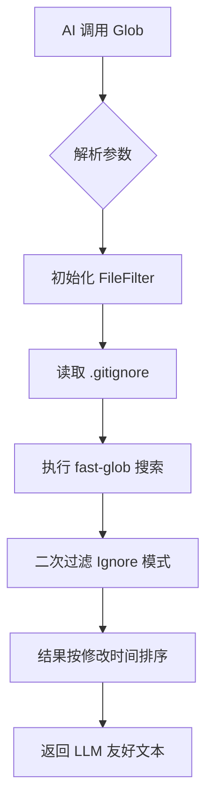
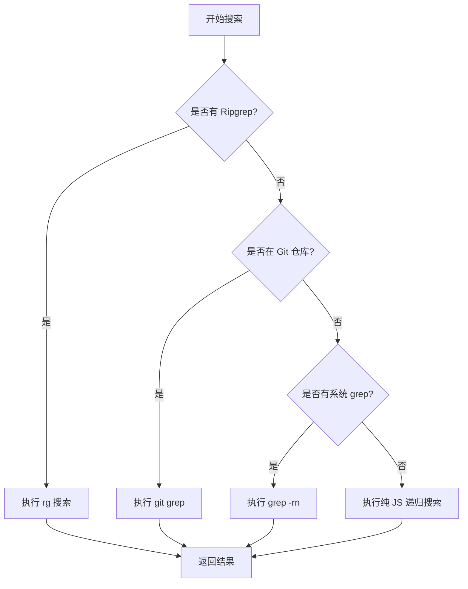
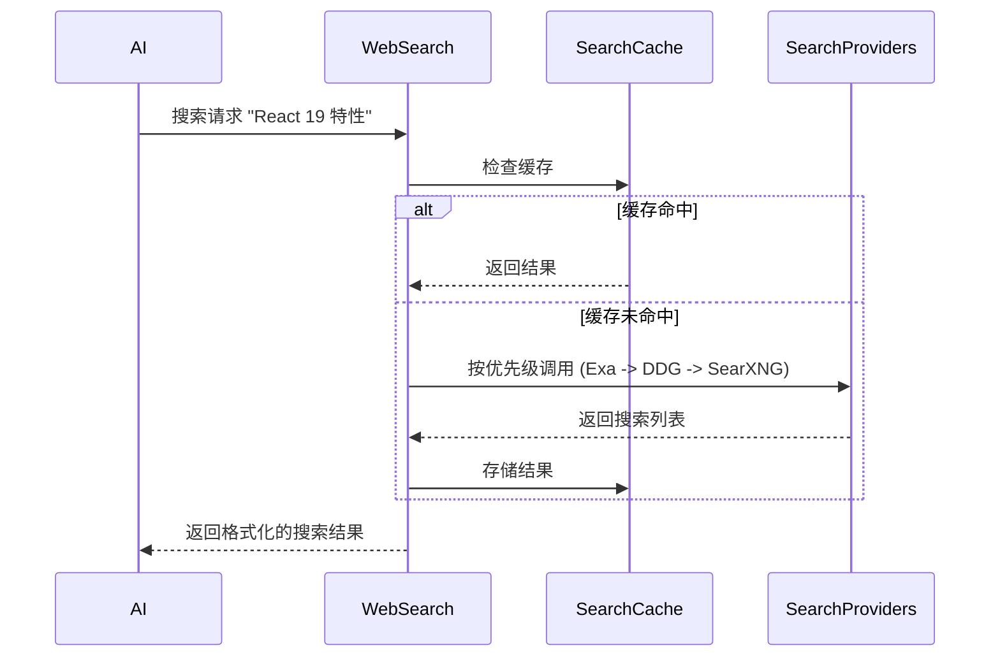
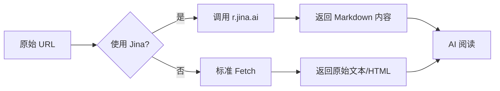
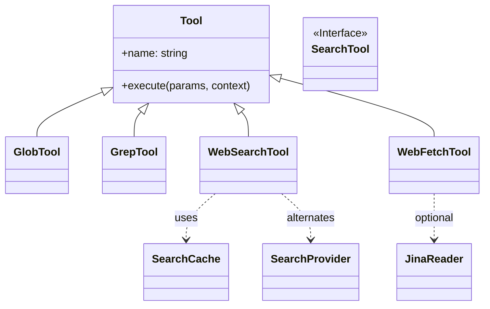

# 多维搜索与信息获取

## 目录
1. [模块概览](#模块概览)
2. [引言](#引言)
3. [本地代码搜索系统](#本地代码搜索系统)
   - [Glob：基于模式的文件发现](#glob基于模式的文件发现)
   - [Grep：多级降级的全文检索](#grep多级降级的全文检索)
   - [Glob 与 Grep 的协同作战](#glob-与-grep-的协同作战)
4. [全球信息检索系统](#全球信息检索系统)
   - [WebSearch：多提供商故障转移搜索](#websearch多提供商故障转移搜索)
   - [WebFetch：基于 Jina Reader 的内容提取](#webfetch基于-jina-reader-的内容提取)
   - [搜索缓存机制](#搜索缓存机制)
5. [架构设计与核心组件](#架构设计与核心组件)
6. [AI 搜索协同场景分析](#ai-搜索协同场景分析)
7. [文件参考](#文件参考)

## 模块概览

本模块负责 Blade 的信息获取能力，分为本地代码搜索和全球网络搜索两个子模块。

- **总文件数**：8 个 TypeScript 文件
- **子模块划分**：
  - `search/` (3 文件)：负责本地文件系统搜索。
  - `web/` (5 文件)：负责互联网搜索与网页抓取。
- **覆盖深度**：
  - 深度覆盖：`glob.ts`, `grep.ts`, `webSearch.ts`, `webFetch.ts`, `SearchCache.ts`
  - 简要提及：`index.ts` (入口文件), `searchProviders.ts` (提供商定义)

## 引言

在 AI 辅助开发的场景中，获取准确的上下文是生成高质量代码的前提。Blade 通过“多维搜索与信息获取”模块，赋予了 AI 两种核心能力：**本地代码感知**和**实时知识获取**。

本地代码搜索不仅仅是简单的文件名查找，它结合了 Glob 模式匹配和基于 Ripgrep 的高性能全文检索，能够帮助 AI 在数万个文件中精准定位功能实现或错误位置。而全球信息检索则打破了模型训练数据的时效性限制，使 AI 能够访问最新的技术文档、GitHub 仓库或 StackOverflow 讨论，从而解决涉及新版本库或特定 API 的复杂问题。

这两个系统的结合，使得 Blade 不再是一个孤立的本地工具，而是一个拥有“上帝视角”的智能开发助手。

## 本地代码搜索系统

本地搜索系统由 `Glob` 和 `Grep` 两个核心工具组成，它们分别从文件结构和文本内容两个维度提供搜索能力。

### Glob：基于模式的文件发现

`Glob` 工具主要用于在文件系统中根据名称模式查找文件。它基于 `fast-glob` 库实现，并深度集成了 Blade 的文件过滤机制。

**核心特性**：
- **Gitignore 感知**：通过 `FileFilter` 自动解析 `.gitignore` 文件，确保 AI 不会误触 `node_modules` 或构建产物。
- **时间排序**：搜索结果按文件修改时间排序，优先返回最近修改的文件，这符合开发者通常关注活跃代码的直觉。
- **流式处理**：支持大规模代码库的流式搜索，避免一次性加载过多数据导致内存溢出。



**代码示例：Glob 搜索实现**
```typescript
// packages/cli/src/tools/builtin/search/glob.ts
const stream = fg.stream(pattern, {
  cwd: searchPath,
  dot: true,
  ignore, // 基础忽略模式
  stats: true,
  objectMode: true,
}) as unknown as Readable;

stream.on('data', (entry: Entry) => {
  const rel = entry.path.replace(/\\/g, '/');
  // 二次过滤，支持 .gitignore 的取反语义（如 !src/important.js）
  if (fileFilter.shouldIgnore(rel)) return;
  
  matches.push({
    path: join(searchPath, rel),
    relative_path: rel,
    modified: entry.stats?.mtime.toISOString(),
  });
});
```

### Grep：多级降级的全文检索

`Grep` 是 Blade 中最强大的搜索工具，它借鉴了现代 IDE 的搜索逻辑，设计了一套多级降级策略，以确保在任何环境下都能提供搜索能力。

**降级策略逻辑**：
1. **Ripgrep (rg)**：首选方案。Blade 会尝试使用系统安装的 `rg` 或内置的 vendor 二进制文件。Ripgrep 以其惊人的速度和对 `.gitignore` 的原生支持而闻名。
2. **Git Grep**：如果 Ripgrep 不可用且当前处于 Git 仓库中，则使用 `git grep`。
3. **System Grep**：降级到系统自带的 `grep` 命令。
4. **JavaScript Fallback**：如果以上所有外部命令都不可用，Blade 会启动纯 JS 实现的递归搜索。虽然速度较慢，但保证了功能的可用性。



**关键参数支持**：
- `output_mode`: 支持 `content`（带上下文的行）、`files_with_matches`（仅文件名）和 `count`（匹配计数）。
- `multiline`: 允许跨行匹配，这对于查找复杂的函数定义或配置块至关重要。

### Glob 与 Grep 的协同作战

AI 在面对未知代码库时，通常会采用“由表及里”的策略：
1. **结构探索**：使用 `Glob` 查找关键配置文件（如 `package.json`, `tsconfig.json`）或特定目录下的文件列表。
2. **功能定位**：在确定大致范围后，使用 `Grep` 搜索特定的关键字、函数名或错误信息。
3. **上下文构建**：通过 `Grep` 的上下文行参数（`-A`, `-B`, `-C`）获取匹配项周围的代码，从而理解逻辑流。

**Section sources**:
- [glob.ts](file:///Users/bytedance/Documents/GitHub/Blade/packages/cli/src/tools/builtin/search/glob.ts)
- [grep.ts](file:///Users/bytedance/Documents/GitHub/Blade/packages/cli/src/tools/builtin/search/grep.ts)

## 全球信息检索系统

当本地代码不足以解决问题时（例如需要使用某个第三方库的新特性），Blade 会通过网络工具获取外部知识。

### WebSearch：多提供商故障转移搜索

`WebSearch` 并不是简单地调用一个 API，而是一个具备高可用性的搜索聚合器。

**核心设计**：
- **多提供商支持**：集成了 Exa (通过 MCP)、DuckDuckGo 和多个 SearXNG 实例。
- **自动故障转移 (Failover)**：如果首选提供商（如 Exa）请求失败或超时，系统会自动尝试下一个提供商，直到获取结果。
- **域名过滤**：支持 `allowed_domains` 和 `blocked_domains`，允许 AI 锁定官方文档或避开无关干扰。



### WebFetch：基于 Jina Reader 的内容提取

搜索只是第一步，获取网页的实际内容并让 AI 理解才是关键。`WebFetch` 解决了传统爬虫获取的 HTML 噪声过大的问题。

**Jina Reader 集成**：
Blade 默认使用 `r.jina.ai` 作为内容提取引擎。它能将复杂的 HTML 页面转换为结构清晰的 Markdown 文本，并自动移除广告、导航栏和脚本。

**功能亮点**：
- **Markdown 转换**：AI 处理 Markdown 的效率远高于原始 HTML。
- **图片描述生成**：支持通过 Jina 生成图片的 Alt 文本，增强 AI 对图文并茂文档的理解。
- **链接摘要**：可选择性地提取页面中的所有链接并生成摘要。
- **重定向追踪**：自动处理 HTTP 重定向，并向 AI 报告完整的重定向链。



### 搜索缓存机制

为了优化性能并降低 API 调用成本，`WebSearch` 引入了 `SearchCache`。

- **存储策略**：基于 LRU (Least Recently Used) 算法，默认保留 100 条最近搜索。
- **生存时间 (TTL)**：默认缓存 1 小时。
- **指纹生成**：对查询字符串进行归一化处理（转小写、去空格）并生成 MD5 哈希作为缓存键。

**Section sources**:
- [webSearch.ts](file:///Users/bytedance/Documents/GitHub/Blade/packages/cli/src/tools/builtin/web/webSearch.ts)
- [webFetch.ts](file:///Users/bytedance/Documents/GitHub/Blade/packages/cli/src/tools/builtin/web/webFetch.ts)
- [SearchCache.ts](file:///Users/bytedance/Documents/GitHub/Blade/packages/cli/src/tools/builtin/web/SearchCache.ts)

## 架构设计与核心组件

Blade 的搜索系统采用了统一的工具定义模式，通过 `createTool` 函数将复杂的逻辑封装为 AI 可直接调用的接口。



**核心组件说明**：
- **`SearchProvider` 接口**：定义了统一的搜索提供商标准，包括 `buildUrl`、`parseResponse` 和 `getHeaders`。这使得扩展新的搜索源（如 Bing 或 Google）变得非常简单。
- **`ExecutionContext`**：在执行搜索时，通过 context 提供 `updateOutput` 回调，实时向用户反馈搜索进度（如“正在使用 DuckDuckGo 搜索...”）。
- **`AbortSignal` 支持**：所有搜索操作都支持中止信号。如果 AI 生成了错误的搜索指令或用户手动停止，底层的进程（如 `rg`）或网络请求会立即被销毁，节省资源。

## AI 搜索协同场景分析

在实际操作中，AI 很少孤立地使用这些工具。以下是一个典型的协同工作流：

1. **发现问题**：用户报告“项目在 Node 22 下启动失败”。
2. **网络检索**：AI 调用 `WebSearch` 搜索 "Node 22 breaking changes for ESM"，发现某个库的兼容性问题。
3. **内容深挖**：调用 `WebFetch` 阅读官方迁移指南，确定需要修改的配置项。
4. **本地定位**：调用 `Grep` 在本地代码中查找该库的所有引用位置。
5. **范围确认**：调用 `Glob` 确认受影响的文件列表（如 `src/**/*.ts`）。
6. **实施修复**：基于以上所有信息，生成精准的修复补丁。

这种“内外结合”的搜索策略，极大地提升了 AI 处理复杂问题的成功率。

## 文件参考

以下是本模块涉及的核心源文件：

- [packages/cli/src/tools/builtin/search/index.ts](file:///Users/bytedance/Documents/GitHub/Blade/packages/cli/src/tools/builtin/search/index.ts) —— 本地搜索工具入口
- [packages/cli/src/tools/builtin/search/glob.ts](file:///Users/bytedance/Documents/GitHub/Blade/packages/cli/src/tools/builtin/search/glob.ts) —— 基于 Glob 的文件查找实现
- [packages/cli/src/tools/builtin/search/grep.ts](file:///Users/bytedance/Documents/GitHub/Blade/packages/cli/src/tools/builtin/search/grep.ts) —— 多级降级的全文搜索实现
- [packages/cli/src/tools/builtin/web/index.ts](file:///Users/bytedance/Documents/GitHub/Blade/packages/cli/src/tools/builtin/web/index.ts) —— 网络工具入口
- [packages/cli/src/tools/builtin/web/webSearch.ts](file:///Users/bytedance/Documents/GitHub/Blade/packages/cli/src/tools/builtin/web/webSearch.ts) —— 具备故障转移能力的 Web 搜索实现
- [packages/cli/src/tools/builtin/web/webFetch.ts](file:///Users/bytedance/Documents/GitHub/Blade/packages/cli/src/tools/builtin/web/webFetch.ts) —— 集成 Jina Reader 的网页抓取实现
- [packages/cli/src/tools/builtin/web/SearchCache.ts](file:///Users/bytedance/Documents/GitHub/Blade/packages/cli/src/tools/builtin/web/SearchCache.ts) —— 搜索结果 LRU 缓存
- [packages/cli/src/tools/builtin/web/searchProviders.ts](file:///Users/bytedance/Documents/GitHub/Blade/packages/cli/src/tools/builtin/web/searchProviders.ts) —— 搜索提供商定义与管理
