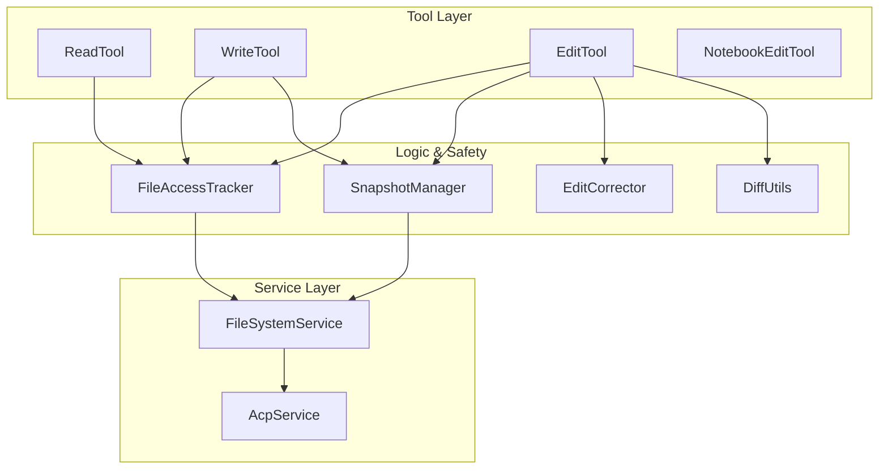
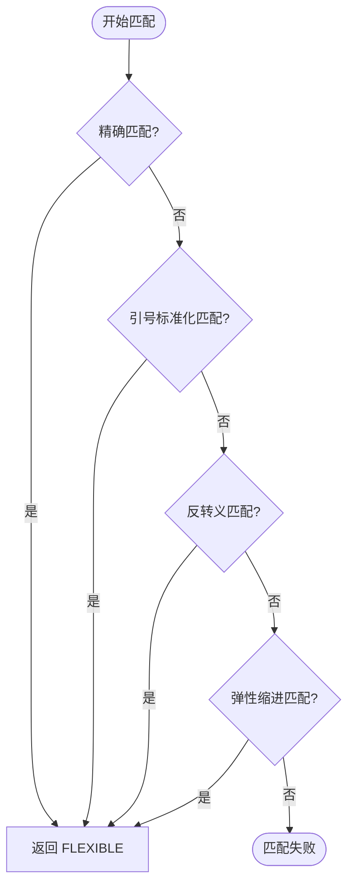
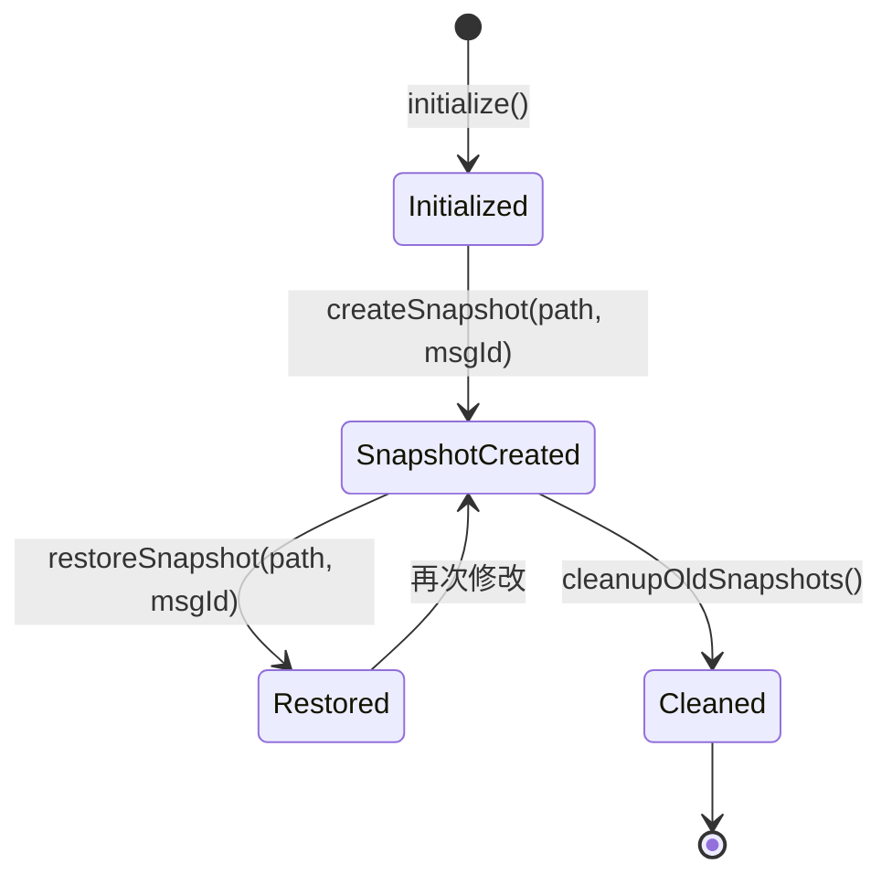

# 文件系统操作与 Diff 引擎

## 目录
1. [模块概览](#模块概览)
2. [核心设计哲学](#核心设计哲学)
3. [架构总览](#架构总览)
4. [核心组件解析](#核心组件解析)
   - [原子读写工具 (Read/Write)](#原子读写工具-readwrite)
   - [智能编辑工具 (Edit)](#智能编辑工具-edit)
   - [Notebook 专用编辑 (NotebookEdit)](#notebook-专用编辑-notebookedit)
5. [智能匹配与纠错引擎](#智能匹配与纠错引擎)
   - [多级匹配策略](#多级匹配策略)
   - [EditCorrector 纠错逻辑](#editcorrector-纠错逻辑)
6. [安全与并发控制机制](#安全与并发控制机制)
   - [文件访问追踪 (FileAccessTracker)](#文件访问追踪-fileaccesstracker)
   - [快照与回滚管理 (SnapshotManager)](#快照与回滚管理-snapshotmanager)
7. [Diff 生成引擎](#diff-生成引擎)
8. [错误处理与恢复建议](#错误处理与恢复建议)
9. [文件引用](#文件引用)

## 模块概览

Blade 的文件系统操作模块是其与本地开发环境交互的核心桥梁。该模块不仅提供了基础的文件读写功能，更通过引入智能匹配、Diff 生成、访问追踪和快照管理等高级特性，确保了 AI 在执行代码修改时的**安全性**、**精准性**和**可恢复性**。

**模块统计数据**：
- **总文件数**：10 个 TypeScript 源文件。
- **核心子目录**：
  - `file/` (8 个文件)：涵盖了通用的文件读写、智能编辑、Diff 生成及安全保障逻辑。
  - `notebook/` (2 个文件)：专门针对 Jupyter Notebook (`.ipynb`) 文件的结构化编辑。
- **覆盖范围**：本页面将深入解析从底层原子 I/O 到上层 AI 辅助编辑的全链路实现。

## 核心设计哲学

在 AI 驱动的代码编辑场景中，传统的文件全量覆盖模式存在极高的风险（如误删代码、破坏缩进等）。Blade 采用了以下核心设计原则：

1.  **先读后写 (Read-Before-Write)**：强制要求 AI 在修改文件前必须先读取内容，确保修改基于最新的文件状态。
2.  **局部替换优于全量重写**：通过 `Edit` 工具进行精确的字符串替换，配合 Diff 引擎只展示变更部分，降低 LLM 生成长文本的压力和出错率。
3.  **多级容错匹配**：针对 AI 常见的格式错误（如引号、缩进、转义字符问题），提供智能纠错机制。
4.  **原子性与可撤销性**：所有写操作前自动创建快照，并支持多版本管理。

## 架构总览

Blade 的文件操作系统采用分层架构，将具体的 I/O 操作与业务逻辑、安全校验解耦。



**架构解析**：
该架构展示了工具层（Tool Layer）如何通过逻辑与安全层（Logic & Safety）来保障操作的可靠性。`EditTool` 是最复杂的组件，它集成了所有的安全和逻辑模块。当 `EditTool` 启动时，它首先通过 `FileAccessTracker` 验证文件是否已被读取，接着由 `SnapshotManager` 创建备份。在执行替换前，`EditCorrector` 会尝试修复 LLM 提供的搜索字符串。最后，所有的物理 I/O 都通过 `FileSystemService` 路由，该服务会根据当前模式（本地或 ACP 远程模式）选择合适的底层实现。这种设计确保了 Blade 在不同运行环境下都能保持行为的一致性。

**Diagram sources**: 
- [edit.ts:L67-L150](file:///Users/bytedance/Documents/GitHub/Blade/packages/cli/src/tools/builtin/file/edit.ts#L67-L150)
- [FileAccessTracker.ts:L26-L44](file:///Users/bytedance/Documents/GitHub/Blade/packages/cli/src/tools/builtin/file/FileAccessTracker.ts#L26-L44)

## 核心组件解析

### 原子读写工具 (Read/Write)

`Read` 和 `Write` 是最基础的 I/O 工具，但它们在 Blade 中被赋予了更多的职责。

-   **ReadTool**：支持大文件的分页读取（通过 `offset` 和 `limit`），自动检测二进制文件并进行 Base64 转换。它还集成了对 PDF、图片和 Notebook 文件的特殊处理逻辑。
-   **WriteTool**：在写入前执行“先读后写”校验。如果文件已存在，它会调用 `SnapshotManager` 进行备份，并在写入成功后生成统一的 Diff 片段返回给用户。

### 智能编辑工具 (Edit)

`EditTool` 是 Blade 推荐的代码修改方式。它要求 LLM 提供 `old_string` 和 `new_string`。

```typescript
// edit.ts 中的核心执行逻辑片段
async execute(params, context: ExecutionContext): Promise<ToolResult> {
  // ... 权限与 Read-Before-Write 校验 ...
  
  // 1. 智能匹配
  const matchResult = smartMatch(content, old_string);
  if (!matchResult.matched) {
    return handleMatchFailure(content, old_string); // 失败时生成富文本建议
  }

  // 2. 唯一性检查
  const matches = findMatchesWithActual(content, matchResult.matched);
  if (matches.length > 1 && !replace_all) {
    return failWithUniquenessError(matches); // 引导 LLM 提供更多上下文
  }

  // 3. 执行替换并生成 Diff
  const newContent = applyReplacement(content, matchResult.matched, new_string);
  await fsService.writeTextFile(file_path, newContent);
  // ...
}
```

### Notebook 专用编辑 (NotebookEdit)

针对 `.ipynb` 这种 JSON 结构的交互式文档，Blade 提供了 `NotebookEditTool`。它不再进行简单的字符串替换，而是操作 JSON 树中的 `cells` 数组，支持对特定 Cell 的 `replace`、`insert` 和 `delete` 操作。

**Section sources**:
- [read.ts](file:///Users/bytedance/Documents/GitHub/Blade/packages/cli/src/tools/builtin/file/read.ts)
- [write.ts](file:///Users/bytedance/Documents/GitHub/Blade/packages/cli/src/tools/builtin/file/write.ts)
- [edit.ts](file:///Users/bytedance/Documents/GitHub/Blade/packages/cli/src/tools/builtin/file/edit.ts)
- [notebookEdit.ts](file:///Users/bytedance/Documents/GitHub/Blade/packages/cli/src/tools/builtin/notebook/notebookEdit.ts)

## 智能匹配与纠错引擎

由于 LLM 在生成代码片段时经常会出现微小的格式偏差（例如将 `\n` 错误转义为 `\\n`，或者缩进不一致），Blade 实现了一套健壮的纠错引擎。

### 多级匹配策略

`smartMatch` 函数定义了四种渐进式的匹配策略：

1.  **EXACT (精确匹配)**：最理想的情况，内容完全一致。
2.  **NORMALIZE_QUOTES (引号标准化)**：将智能引号（“”‘’）转换为标准直引号后再匹配，解决 LLM 或编辑器自动转换导致的差异。
3.  **UNESCAPE (反转义匹配)**：自动修复 LLM 过度转义的问题（如 `\\n` -> `\n`）。
4.  **FLEXIBLE (弹性缩进)**：忽略行首缩进的差异（如 2 空格 vs 4 空格），只要代码逻辑结构一致即可匹配。

### EditCorrector 纠错逻辑

`EditCorrector.ts` 承载了这些策略的具体实现。其中 `flexibleMatch` 是最复杂的，它会计算搜索字符串的第一行缩进，并尝试在目标文件中寻找具有相同逻辑结构但缩进不同的片段。



**逻辑说明**：
匹配流程遵循“从严到宽”的原则。首先尝试最严格的精确匹配，以保证 100% 的准确性。如果失败，则进入容错阶段。引号标准化主要针对中文环境或某些富文本编辑器的干扰；反转义匹配解决 JSON 传输过程中常见的转义混乱；最后，弹性缩进匹配是最强大的兜底方案，它通过移除两端的相对缩进，专注于代码内容的对比。这种分层策略极大地提高了 `Edit` 工具的成功率，减少了 LLM 的重试次数。

**Diagram sources**: 
- [edit.ts:L414-L448](file:///Users/bytedance/Documents/GitHub/Blade/packages/cli/src/tools/builtin/file/edit.ts#L414-L448)
- [editCorrector.ts:L13-L19](file:///Users/bytedance/Documents/GitHub/Blade/packages/cli/src/tools/builtin/file/editCorrector.ts#L13-L19)

## 安全与并发控制机制

文件操作的安全性是 Blade 的重中之重，主要通过以下两个组件保障。

### 文件访问追踪 (FileAccessTracker)

`FileAccessTracker` 是一个全局单例，记录了每个文件在当前会话中的最后访问状态。

-   **Read-Before-Write 校验**：在 `Edit` 或 `Write` 执行前，检查 `accessedFiles` 映射。如果文件未被读取过，直接拒绝操作。
-   **外部修改检测**：记录读取时的文件 `mtime`。在写入前再次检查磁盘上的 `mtime`，如果发现文件在读取后被外部程序修改（时间差 > 2s），则强制要求 AI 重新读取，防止覆盖他人的工作。

### 快照与回滚管理 (SnapshotManager)

在每次执行破坏性修改（`Edit` 或 `Write`）之前，Blade 会自动调用 `SnapshotManager`。



**状态机解析**：
`SnapshotManager` 的生命周期与会话绑定。在初始化后，它会将备份存储在 `~/.blade/file-history/{sessionId}/` 目录下。每个快照文件名由“路径哈希+版本号”组成（例如 `0e524d000ce5f33d@v1`）。系统默认保留每个文件最近的 10 个快照。这种机制不仅为用户提供了手动回滚的可能，也为 Blade 后续实现自动撤销错误修改（Undo）功能打下了基础。

**Diagram sources**: 
- [SnapshotManager.ts:L37-L57](file:///Users/bytedance/Documents/GitHub/Blade/packages/cli/src/tools/builtin/file/SnapshotManager.ts#L37-L57)
- [FileAccessTracker.ts:L186-L230](file:///Users/bytedance/Documents/GitHub/Blade/packages/cli/src/tools/builtin/file/FileAccessTracker.ts#L186-L230)

## Diff 生成引擎

为了让用户和 AI 都能清晰地感知变更，`diffUtils.ts` 封装了基于 `diff` 库的差异生成逻辑。

-   **统一格式 (Unified Diff)**：生成的差异片段遵循标准补丁格式，包含上下文行。
-   **前端渲染支持**：Diff 片段被包裹在 `<<<DIFF>>>` 标签内，并以 JSON 格式存储元数据（如 `startLine`, `matchLine`），方便 CLI 界面进行彩色高亮渲染。
-   **智能上下文提取**：`generateDiffSnippetWithMatch` 函数会根据替换发生的实际位置，自动提取前后各 4 行的上下文，确保 Diff 的可读性。

## 错误处理与恢复建议

当 `Edit` 工具匹配失败时，Blade 不仅仅返回一个简单的“Not Found”，而是生成一份极其详尽的**富文本错误报告**。

1.  **模糊匹配建议**：使用 Levenshtein 距离算法计算文件内容与搜索字符串的相似度，找出最可能的匹配行（相似度 > 50%）。
2.  **上下文摘录**：显示可能匹配位置周围的 20 行代码，并附带行号。
3.  **针对性建议**：根据匹配失败的可能原因（如缩进、换行符、智能引号），给出具体的修复步骤。

这种“引导式”的错误处理机制显著增强了 AI 的自我修复能力，使其能够根据反馈调整搜索字符串并重试。

## 文件引用

以下是本模块涉及的核心源文件：

- [packages/cli/src/tools/builtin/file/index.ts](file:///Users/bytedance/Documents/GitHub/Blade/packages/cli/src/tools/builtin/file/index.ts) - 模块入口与导出
- [packages/cli/src/tools/builtin/file/read.ts](file:///Users/bytedance/Documents/GitHub/Blade/packages/cli/src/tools/builtin/file/read.ts) - 文件读取工具实现
- [packages/cli/src/tools/builtin/file/write.ts](file:///Users/bytedance/Documents/GitHub/Blade/packages/cli/src/tools/builtin/file/write.ts) - 文件写入工具实现
- [packages/cli/src/tools/builtin/file/edit.ts](file:///Users/bytedance/Documents/GitHub/Blade/packages/cli/src/tools/builtin/file/edit.ts) - 核心智能编辑逻辑
- [packages/cli/src/tools/builtin/file/editCorrector.ts](file:///Users/bytedance/Documents/GitHub/Blade/packages/cli/src/tools/builtin/file/editCorrector.ts) - AI 纠错与弹性匹配策略
- [packages/cli/src/tools/builtin/file/diffUtils.ts](file:///Users/bytedance/Documents/GitHub/Blade/packages/cli/src/tools/builtin/file/diffUtils.ts) - Diff 生成工具函数
- [packages/cli/src/tools/builtin/file/FileAccessTracker.ts](file:///Users/bytedance/Documents/GitHub/Blade/packages/cli/src/tools/builtin/file/FileAccessTracker.ts) - 文件访问与外部修改监控
- [packages/cli/src/tools/builtin/file/SnapshotManager.ts](file:///Users/bytedance/Documents/GitHub/Blade/packages/cli/src/tools/builtin/file/SnapshotManager.ts) - 快照备份与回滚管理
- [packages/cli/src/tools/builtin/notebook/index.ts](file:///Users/bytedance/Documents/GitHub/Blade/packages/cli/src/tools/builtin/notebook/index.ts) - Notebook 工具入口
- [packages/cli/src/tools/builtin/notebook/notebookEdit.ts](file:///Users/bytedance/Documents/GitHub/Blade/packages/cli/src/tools/builtin/notebook/notebookEdit.ts) - Jupyter Notebook 结构化编辑实现
