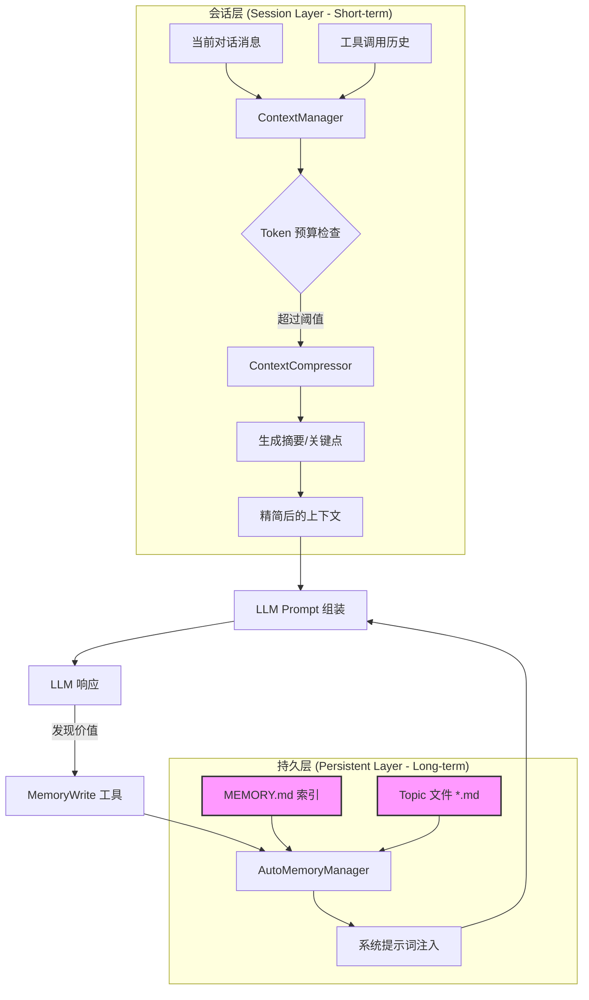
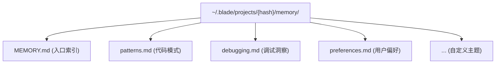
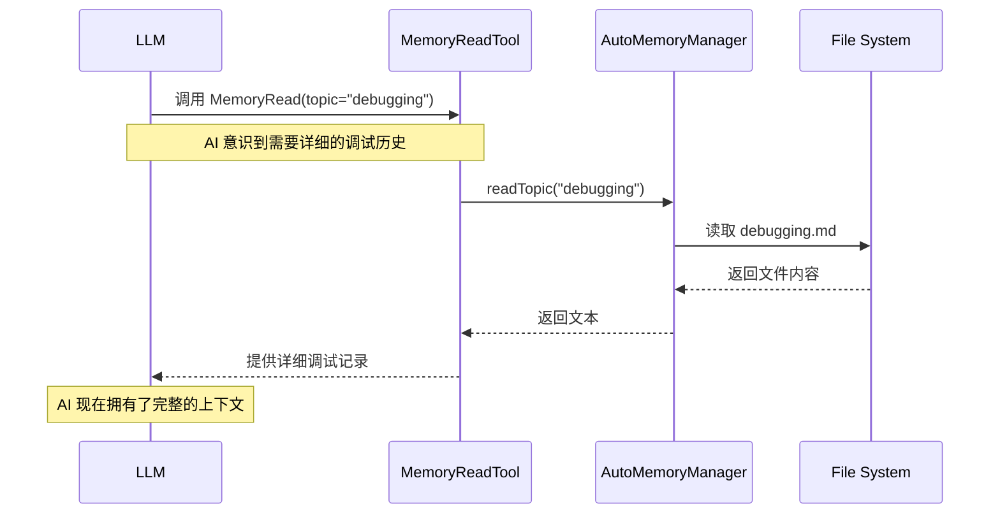
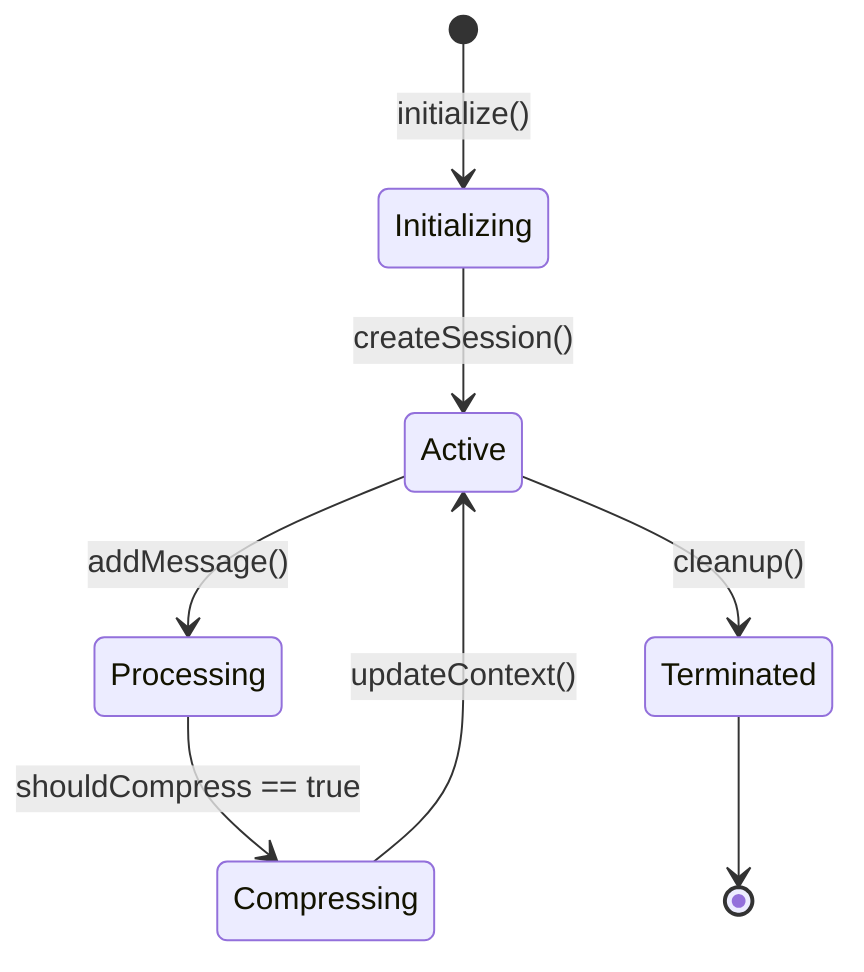
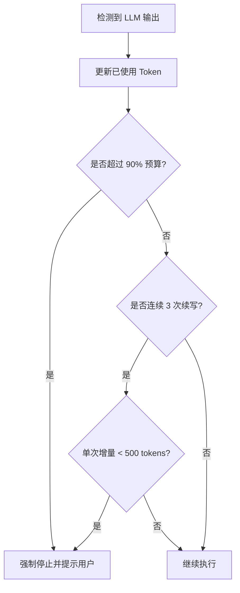

# 自动记忆管理与上下文优化

## 目录

1. [模块概览](#模块概览)
2. [核心架构：双层记忆模型](#核心架构双层记忆模型)
3. [Auto Memory：长期持久化记忆](#auto-memory长期持久化记忆)
   - [存储结构与索引机制](#存储结构与索引机制)
   - [系统提示词注入与截断策略](#系统提示词注入与截断策略)
4. [记忆交互工具：AI 的“大脑”管理](#记忆交互工具ai-的大脑管理)
   - [MemoryRead：按需深入检索](#memoryread按需深入检索)
   - [MemoryWrite：知识固化与安全检查](#memorywrite知识固化与安全检查)
5. [上下文优化与压缩策略](#上下文优化与压缩策略)
   - [ContextManager：会话生命周期管理](#contextmanager会话生命周期管理)
   - [ContextCompressor：智能语义压缩](#contextcompressor智能语义压缩)
   - [Token 预算与递减收益检测](#token-预算与递减收益检测)
6. [记忆决策启发式算法](#记忆决策启发式算法)
   - [什么信息值得记住？深度准则](#什么信息值得记住深度准则)
   - [记忆的生命周期：从发现到固化](#记忆的生命周期从发现到固化)
7. [数据模型与存储层设计](#数据模型与存储层设计)
   - [持久化事件流 (JSONL)](#持久化事件流-jsonl)
   - [Markdown 知识库](#markdown-知识库)
8. [核心组件深度解析](#核心组件深度解析)
   - [AutoMemoryManager：路径安全与持久化](#automemorymanager路径安全与持久化)
   - [ContextCompressor：语义提取算法](#contextcompressor语义提取算法)
9. [测试与验证模式](#测试与验证模式)
10. [文件参考](#文件参考)

## 模块概览

Blade 的记忆系统是其能够作为“长期伴侣”而非“单次助手”的核心技术支撑。在 AI 辅助开发场景中，项目背景（如特定的构建脚本、陈旧的代码债、复杂的依赖关系）往往比单次对话内容更重要。该系统解决了大语言模型（LLM）面临的两个关键挑战：**有限的上下文窗口（Context Window）**和**跨会话知识丢失（Knowledge amnesia）**。

本模块主要包含以下两个核心区域：
- `packages/cli/src/memory/`: 负责 **Auto Memory（自动记忆）**，即跨会话的项目级持久化知识存储。它确保 AI 在关闭终端后仍能“记住”项目的关键细节。
- `packages/cli/src/context/`: 负责 **Session Context（会话上下文）**，包括实时对话管理、Token 预算控制、以及在长对话中维持效率的自动压缩机制。

### 统计信息
- **发现文件总数**: 约 22 个核心 TypeScript 文件（包含 `memory/` 和 `context/` 目录及其子模块）。
- **覆盖子模块**:
  - `AutoMemoryManager`: 持久化记忆管理中心，负责文件读写与路径安全。
  - `ContextManager`: 会话上下文协调器，连接内存、缓存与持久化存储。
  - `ContextCompressor`: 上下文压缩与摘要处理器，实现智能语义提取。
  - `MemoryTools`: AI 显式调用的读写工具（MemoryRead/Write）。
  - `TokenBudget`: 实时资源消耗监控，防止无效生成。

本页面将深度解析这些组件如何协同工作，使 AI 能够像人类开发者一样，既能处理当前的即时任务，又能不断积累项目经验。

---

## 核心架构：双层记忆模型

Blade 采用了“短期会话上下文”与“长期持久化记忆”相结合的双层架构。这种设计模拟了人类的短期工作记忆（Working Memory）和长期经验积累（Long-term Memory）。

以下图表展示了这两层记忆如何与 LLM 交互以及它们在系统中的位置：



**架构解析**：
1. **会话层**：关注当前任务的即时细节。通过 `ContextManager` 实时跟踪对话，并在 Token 消耗接近上限时，利用 `ContextCompressor` 将旧消息转化为摘要，保留最近的消息。这保证了对话的连贯性，同时避免了因上下文过长导致的成本上升和响应速度变慢。
2. **持久层**：由 `AutoMemoryManager` 管理，存储在用户的本地磁盘上（通常位于 `~/.blade/projects/`）。它不随会话结束而消失，而是作为项目的“外部知识库”。
3. **闭环反馈**：这是系统的灵魂。AI 在执行任务时，如果发现了一些通用的、以后可能用到的知识（如某个特定的构建命令或修复 Bug 的方案），它会主动调用 `MemoryWrite` 将其固化到持久层。在下一次启动时，这些知识会通过 `AutoMemoryManager.loadIndex()` 重新注入系统提示词，实现“自我进化”。

---

## Auto Memory：长期持久化记忆

Auto Memory 是 Blade 实现“项目感应”的核心。它允许 AI 在不同的开发阶段、不同的会话之间保持逻辑一致性。

### 存储结构与索引机制

所有的持久化记忆都存储在用户的 `~/.blade/projects/{project-hash}/memory/` 目录下，采用易于阅读和手动编辑的 Markdown 格式。



- **`MEMORY.md`**: 系统的“根记忆”。它是 AI 启动时的第一索引，包含最核心的项目概况、常用命令和重要说明。
- **Topic 文件**: 为了保持索引简洁，详细的知识被分散在特定主题的文件中。例如，`debugging.md` 记录已解决的疑难杂症，`patterns.md` 记录项目特有的代码风格。

### 系统提示词注入与截断策略

`AutoMemoryManager` 的 `loadIndex` 方法负责提取索引内容。为了防止上下文爆炸，它实施了精细的**截断策略**。

```typescript
// packages/cli/src/memory/AutoMemoryManager.ts

/**
 * 加载 MEMORY.md 前 N 行，用于注入 system prompt
 */
async loadIndex(): Promise<string | null> {
  if (!this.config.enabled) return null;

  await this.initialize();
  const indexPath = path.join(this.memoryDir, INDEX_FILE);

  try {
    const content = await fs.readFile(indexPath, 'utf-8');
    if (!content.trim()) return null;

    const lines = content.split('\n');
    // 默认截断前 200 行，确保 System Prompt 保持精简
    const truncated = lines.slice(0, this.config.maxIndexLines); 
    const result = truncated.join('\n').trim();

    if (lines.length > this.config.maxIndexLines) {
      // 关键：向 AI 发出信号，告知还有更多记忆可供通过工具读取
      return result + `\n\n<!-- ${lines.length - this.config.maxIndexLines} more lines in MEMORY.md, use MemoryRead to access -->`;
    }

    return result || null;
  } catch (err: unknown) {
    if (err instanceof Error && 'code' in err && (err as NodeJS.ErrnoException).code === 'ENOENT') return null;
    throw err;
  }
}
```

**注入流程**：
1. **会话初始化**：`buildSystemPrompt` 被调用。
2. **记忆提取**：调用 `AutoMemoryManager.loadIndex()` 获取截断后的 Markdown。
3. **标签包裹**：内容被包裹在 `<auto-memory>` 标签中。
4. **语义对齐**：LLM 看到这些标签后，会将其作为最高优先级的背景知识，用于指导后续的所有决策。

---

## 记忆交互工具：AI 的“大脑”管理

AI 并不是被动地被注入记忆，它拥有主动管理自己“大脑”的工具：`MemoryRead` 和 `MemoryWrite`。这种“元认知”能力是 Blade 智能化的重要体现。

### MemoryRead：按需深入检索

由于注入到 System Prompt 的索引是受限的，当 AI 发现索引中提到某个主题但内容不完整时，它会主动发起检索。



### MemoryWrite：知识固化与安全检查

当 AI 学习到新知识（例如通过多次尝试终于找到了正确的 Docker 启动参数）时，它会调用 `MemoryWrite`。为了防止泄露敏感信息，该工具内置了多重安全检查。

```typescript
// packages/cli/src/tools/builtin/memory/MemoryWriteTool.ts

/** 禁止写入的敏感关键词 */
const SENSITIVE_PATTERNS = [
  /password\s*[:=]/i,
  /token\s*[:=]/i,
  /secret\s*[:=]/i,
  /api[_-]?key\s*[:=]/i,
  /private[_-]?key/i,
];

// 在执行写入前进行深度扫描
for (const pattern of SENSITIVE_PATTERNS) {
  if (pattern.test(content)) {
    const msg = `Refused: content appears to contain sensitive data.`;
    return { success: false, llmContent: msg, error: { ... } };
  }
}
```

**写入模式**：
- **`append` (默认)**: 将新发现的洞察追加到现有主题末尾，适合记录调试日志或新模式。
- **`overwrite`**: 彻底重写某个主题或索引，通常用于 AI 对现有知识进行“重构”或“清理”时。

---

## 上下文优化与压缩策略

除了长期记忆，Blade 还必须精细管理当前的对话上下文。随着对话轮次的增加，Token 消耗会呈指数级增长，如果不加控制，会导致模型响应变慢甚至报错。

### ContextManager：会话生命周期管理

`ContextManager` 是整个上下文系统的协调中枢。它不仅管理内存中的消息，还负责将事件流持久化到 JSONL 文件中，确保程序崩溃后仍能恢复进度。



### ContextCompressor：智能语义压缩

当会话 Token 超过阈值（`compressionThreshold`，默认 6000 tokens）时，`ContextCompressor` 会被触发。它采用了一种“滑动窗口 + 语义摘要”的复合策略。

```typescript
// packages/cli/src/context/processors/ContextCompressor.ts

async compress(contextData: ContextData): Promise<CompressedContext> {
  const messages = contextData.layers.conversation.messages;
  
  // 1. 保留策略：系统消息始终保留，最近 20 条消息保持完整以维持对话连贯性
  const systemMessages = messages.filter((m) => m.role === 'system');
  const recentMessages = messages.slice(-this.recentMessagesLimit);

  // 2. 压缩策略：对旧消息进行语义分析
  const olderMessages = messages.slice(0, -this.recentMessagesLimit);
  const summary = await this.generateSummary(olderMessages); // 生成对话主旨
  const keyPoints = this.extractKeyPoints(olderMessages);    // 提取关键决策

  return {
    summary,
    keyPoints,
    recentMessages: [...systemMessages, ...recentMessages],
    // ...
  };
}
```

### Token 预算与递减收益检测

`TokenBudget` 模块引入了“递减收益（Diminishing Returns）”检测算法。在一些复杂的循环任务中，LLM 可能会陷入无意义的重复输出。



这种机制确保了 AI 的行为是经济且高效的，避免了在死循环或低质量生成中浪费 Token。

---

## 记忆决策启发式算法

AI 如何判断哪些信息“值得”被存入长期记忆？这并非硬编码的规则，而是通过 `DEFAULT_SYSTEM_PROMPT` 中的指令进行引导的“软启发式算法”。

### 什么信息值得记住？深度准则

Blade 引导 AI 遵循以下准则来识别“高价值”信息：
1. **硬知识 (Hard Knowledge)**：项目特定的构建/测试/部署命令。这些是通过 `shell` 尝试后确定的真理。
2. **架构洞察 (Architectural Insights)**：模块间的依赖关系、核心数据流向。
3. **陷阱与规避 (Pitfalls & Mitigations)**：曾经导致 Bug 的原因及修复方案，防止“在同一个地方跌倒两次”。
4. **用户偏好 (User Preferences)**：用户对代码风格的特定要求（如“不要使用 class，只用函数式”）。

### 记忆的生命周期：从发现到固化

记忆在系统中经历一个动态演进的过程：
- **发现阶段**：AI 在对话中通过工具执行或推理得到一个结论。
- **验证阶段**：结论在后续步骤中被证明有效。
- **固化阶段**：AI 调用 `MemoryWrite` 将结论写入 `MEMORY.md`。
- **重构阶段**：随着项目演进，旧记忆变得过时。AI 会通过 `overwrite` 模式更新记忆，或将详细内容从索引迁移到子主题文件中。

---

## 数据模型与存储层设计

Blade 的存储层采用了多级存储架构，兼顾了访问速度和数据持久性。

### 持久化事件流 (JSONL)

会话的每一条消息和工具调用都会以 JSONL（JSON Lines）格式追加到 `sessions/{id}.jsonl`。这种格式的优点是：
- **崩溃安全**：即使程序异常退出，已写入的行也不会丢失。
- **流式读取**：可以高效地回溯历史，而无需一次性加载巨大文件。

### Markdown 知识库

Auto Memory 选择 Markdown 作为存储格式，是基于以下考量：
- **互操作性**：用户可以直接用 VS Code 或 Vim 打开 `~/.blade/projects/.../memory/MEMORY.md` 进行手动修正。
- **LLM 友好**：Markdown 的层级结构非常适合 LLM 理解文档语义。

---

## 核心组件深度解析

### AutoMemoryManager：路径安全与持久化

`AutoMemoryManager` 在实现时高度关注安全性，特别是在处理用户提供的“主题名称”时，防止恶意路径穿越。

```typescript
// packages/cli/src/memory/AutoMemoryManager.ts

/**
 * 解析主题文件路径，防止路径穿越
 */
private resolveTopicPath(topic: string): string {
  // 安全：只允许简单文件名，将非法字符替换为横杠
  const safeName = topic.replace(/[/\\:*?"<>|]/g, '-');
  const filename = safeName.endsWith('.md') ? safeName : `${safeName}.md`;
  const resolved = path.join(this.memoryDir, filename);

  // 严格检查：确保解析后的路径仍在 memory 目录下
  if (!resolved.startsWith(this.memoryDir)) {
    throw new Error(`Invalid topic name: ${topic}`);
  }

  return resolved;
}
```

### ContextCompressor：语义提取算法

压缩器不只是简单的文本缩减，它试图通过规则匹配来模拟 LLM 的摘要能力，从而在不调用昂贵 API 的情况下实现初步压缩。

```typescript
// 提取对话涉及的主题、动作和决策
private async generateSummary(messages: ContextMessage[]): Promise<string> {
  const topics = new Set<string>();
  const actionKeywords = ['创建', '删除', '修改', '更新', '实现'];
  
  for (const message of messages) {
    const content = message.content.toLowerCase();
    // 通过关键词检测上下文片段，构建语义索引
    // ...
  }
  // 返回如 "对话涉及 50 条消息。主要讨论：Redis 配置。执行操作：更新 Dockerfile。" 的摘要
}
```

---

## 测试与验证模式

为了确保记忆系统的可靠性，Blade 包含了详尽的单元测试，主要关注以下场景：
- **并发写入冲突**：测试多个工具同时尝试更新 `MEMORY.md` 时的行为（通过 `isConcurrencySafe: false` 锁机制）。
- **截断正确性**：验证 `loadIndex` 是否准确截断并在末尾添加 `<!-- more lines -->` 标记。
- **安全过滤有效性**：确保包含 `API_KEY=...` 的内容被拦截。
- **上下文恢复**：验证从 JSONL 文件中能否 100% 重建 `ContextData`。

---

## 文件参考

以下是实现自动记忆管理与上下文优化的核心文件：

- [AutoMemoryManager.ts](file:///Users/bytedance/Documents/GitHub/Blade/packages/cli/src/memory/AutoMemoryManager.ts): 长期记忆管理核心逻辑。
- [types.ts](file:///Users/bytedance/Documents/GitHub/Blade/packages/cli/src/memory/types.ts): 记忆系统类型定义。
- [MemoryReadTool.ts](file:///Users/bytedance/Documents/GitHub/Blade/packages/cli/src/tools/builtin/memory/MemoryReadTool.ts): 供 AI 调用的记忆读取工具。
- [MemoryWriteTool.ts](file:///Users/bytedance/Documents/GitHub/Blade/packages/cli/src/tools/builtin/memory/MemoryWriteTool.ts): 供 AI 调用的记忆写入工具。
- [ContextManager.ts](file:///Users/bytedance/Documents/GitHub/Blade/packages/cli/src/context/ContextManager.ts): 会话上下文管理中枢。
- [ContextCompressor.ts](file:///Users/bytedance/Documents/GitHub/Blade/packages/cli/src/context/processors/ContextCompressor.ts): 上下文智能压缩处理器。
- [TokenBudget.ts](file:///Users/bytedance/Documents/GitHub/Blade/packages/cli/src/context/TokenBudget.ts): Token 消耗监控与收益检测。
- [builder.ts](file:///Users/bytedance/Documents/GitHub/Blade/packages/cli/src/prompts/builder.ts): 系统提示词构建器（包含 Auto Memory 注入）。
- [default.ts](file:///Users/bytedance/Documents/GitHub/Blade/packages/cli/src/prompts/default.ts): 默认系统提示词定义及记忆决策指令。
- [memory.ts](file:///Users/bytedance/Documents/GitHub/Blade/packages/cli/src/slash-commands/memory.ts): 用户侧 `/memory` 斜杠命令实现。

**Section sources**:
- [AutoMemoryManager.ts](file:///Users/bytedance/Documents/GitHub/Blade/packages/cli/src/memory/AutoMemoryManager.ts)
- [ContextManager.ts](file:///Users/bytedance/Documents/GitHub/Blade/packages/cli/src/context/ContextManager.ts)
- [ContextCompressor.ts](file:///Users/bytedance/Documents/GitHub/Blade/packages/cli/src/context/processors/ContextCompressor.ts)
- [MemoryWriteTool.ts](file:///Users/bytedance/Documents/GitHub/Blade/packages/cli/src/tools/builtin/memory/MemoryWriteTool.ts)
- [builder.ts](file:///Users/bytedance/Documents/GitHub/Blade/packages/cli/src/prompts/builder.ts)
- [default.ts](file:///Users/bytedance/Documents/GitHub/Blade/packages/cli/src/prompts/default.ts)
