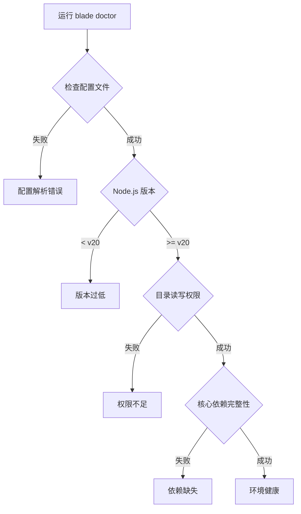

# 参考手册、常见问题与故障排除

## 目录
1. [模块概览](#模块概览)
2. [CLI 命令完整参考](#cli-命令完整参考)
   - [全局选项](#全局选项)
   - [子命令详解](#子命令详解)
   - [交互式界面快捷键](#交互式界面快捷键)
3. [常见问题解答 (FAQ)](#常见问题解答-faq)
   - [安装与入门](#安装与入门)
   - [配置与模型](#配置与模型)
   - [权限与安全](#权限与安全)
4. [故障排除手册](#故障排除手册)
   - [使用 blade doctor 自检](#使用-blade-doctor-自检)
   - [调试日志查看](#调试日志查看)
   - [常见错误代码与解决办法](#常见错误代码与解决办法)
5. [更新日志与版本演进](#更新日志与版本演进)
6. [社区支持与反馈](#社区支持与反馈)
7. [核心组件与文件参考](#核心组件与文件参考)

## 模块概览

本章节作为 Blade Code 的官方工具书，旨在为用户提供详尽的参数说明、常见问题解决方案以及系统演进历史。无论您是初次安装遇到环境问题，还是在深度使用中需要查阅特定命令的参数，都可以在这里找到答案。

**文档覆盖范围**：
- **CLI 参考**：涵盖 `blade` 核心命令及 `web`, `serve`, `doctor`, `mcp` 等子命令。
- **FAQ**：收集了从安装、配置到高级功能使用的 30+ 常见问题。
- **故障排除**：提供基于 `blade doctor` 的自动化诊断和基于调试日志的手动排查指南。
- **版本历史**：记录了从 0.1.0 首个开源版本到最新版本的重大功能更新。

**模块统计**：
- **核心文件数**：约 15 个 CLI 相关命令定义文件。
- **子模块覆盖**：全面覆盖 `packages/cli/src/commands/` 下的所有功能指令。

## CLI 命令完整参考

Blade 提供了一个强大的命令行界面，支持交互模式、打印模式和无头服务器模式。

### 全局选项

全局选项可以附加在 `blade` 或任何子命令之后，用于控制程序的基础行为。

| 选项 | 别名 | 说明 | 示例 |
|:---|:---|:---|:---|
| `--debug [filters]` | `-d` | 启用调试日志，支持分类过滤 | `blade --debug "agent,tool"` |
| `--permission-mode <mode>` | | 权限模式：`default`, `autoEdit`, `yolo`, `plan` | `blade --permission-mode yolo` |
| `--continue` | `-c` | 继续最近的一次会话 | `blade -c` |
| `--resume [id]` | `-r` | 恢复指定会话（无参数时弹出选择列表） | `blade -r` |
| `--print` | `-p` | 打印模式：在终端输出回答后立即退出 | `blade -p "写一个快速排序"` |
| `--yolo` | | 自动放行所有工具调用（慎用） | `blade --yolo` |

### 子命令详解

#### 1. `blade web` & `blade serve`
这两个命令用于启动 Web 界面。`web` 会自动打开浏览器，而 `serve` 仅启动后台服务。

*   **参数**：
    *   `--port <number>`: 指定端口（默认 0，即随机可用端口）。
    *   `--hostname <string>`: 监听地址（默认 `127.0.0.1`）。
    *   `--cors <domains>`: 跨域允许域名。

#### 2. `blade mcp`
用于管理模型上下文协议 (Model Context Protocol) 服务器，扩展 Agent 的工具能力。

*   `blade mcp list`: 查看当前连接的所有 MCP 服务器状态。
*   `blade mcp add <name> <command>`: 添加新的 stdio 类型服务器。
    *   示例：`blade mcp add github -- npx -y @modelcontextprotocol/server-github`

#### 3. `blade doctor`
环境自检工具，用于诊断安装和配置问题。

### 交互式界面快捷键

在 `blade` 交互式终端（Ink UI）中，可以使用以下快捷键提升效率：

*   **`Ctrl + C`**: 中断当前正在执行的任务或 AI 生成。
*   **`Ctrl + L`**: 清除屏幕内容。
*   **`Shift + Tab`**: 在不同的权限模式（如 `default` 和 `yolo`）之间快速循环切换。
*   **`Ctrl + T`**: 展开或折叠 AI 的思维链（Thinking Process）。
*   **`↑ / ↓`**: 浏览历史输入命令。

**Section sources**:
- [cli-commands.md](file:///Users/bytedance/Documents/GitHub/Blade/docs/reference/cli-commands.md)
- [commands/index.ts](file:///Users/bytedance/Documents/GitHub/Blade/packages/cli/src/commands/index.ts)

## 常见问题解答 (FAQ)

### 安装与入门

**Q: 提示 `command not found: blade`？**
A: 请确保全局安装路径已添加到系统的 `PATH` 环境变量中。通常可以通过 `npm config get prefix` 找到安装路径，并将其下的 `bin` 目录加入 PATH。

**Q: 支持哪些 Node.js 版本？**
A: 最低要求 **Node.js 20.0.0**。建议使用 LTS 版本以获得最佳稳定性。

### 配置与模型

**Q: 如何配置多个模型并切换？**
A: 您可以在 `~/.blade/config.json` 中配置多个 provider。在对话过程中，使用 `/model` 命令可以实时切换当前使用的模型。

**Q: 配置文件格式错误导致无法启动怎么办？**
A: 如果 JSON 解析失败，Blade 会在启动时提示错误。您可以手动删除或修正该文件，或者运行 `blade` 重新进入配置向导。

### 权限与安全

**Q: 什么是 `yolo` 模式？**
A: `yolo` 模式会跳过所有工具调用的用户确认环节。这在处理大量自动化任务时非常方便，但请务必在受信任的项目中使用，因为 AI 可能会执行具有破坏性的 shell 命令或修改重要文件。

**Q: 如何让 Blade 只读不写？**
A: 使用 `plan` 模式。在此模式下，AI 可以读取文件、搜索网络，但任何修改文件的请求都会被系统自动拒绝。

**Section sources**:
- [faq.md](file:///Users/bytedance/Documents/GitHub/Blade/docs/faq.md)

## 故障排除手册

### 使用 blade doctor 自检

当您发现 Blade 运行异常（如无法加载配置、工具调用失败等）时，首选方案是运行 `blade doctor`。该工具会自动检查以下关键项：

`blade doctor` 的执行逻辑非常直接，它会尝试初始化配置管理器并检查当前工作目录的访问权限。如果任何环节失败，它会返回非零退出码，方便在脚本中集成。

### 调试日志查看

如果 `doctor` 检查通过但问题依旧，可以使用 `--debug` 参数获取详细运行日志。

*   **查看所有日志**：`blade --debug`
*   **关注特定模块**：`blade --debug "agent,tool"`（仅查看 Agent 决策和工具执行日志）
*   **排除干扰项**：`blade --debug "!chat"`（隐藏繁琐的聊天流数据）

### 常见错误代码与解决办法

| 现象 | 可能原因 | 解决方案 |
|:---|:---|:---|
| **API 401 Unauthorized** | API Key 填写错误或已过期 | 检查 `~/.blade/config.json` 中的密钥 |
| **Connection Timeout** | 网络环境无法直连模型供应商 | 配置环境变量 `HTTPS_PROXY` 或使用代理转发地址 |
| **Permission Denied (EACCES)** | 运行目录无写权限 | 检查当前目录权限，或尝试在其他目录启动 |
| **Module Not Found** | 安装不完整或缓存损坏 | 尝试 `npm install -g blade-code@latest --force` |

**Section sources**:
- [doctor.ts](file:///Users/bytedance/Documents/GitHub/Blade/packages/cli/src/commands/doctor.ts)
- [cli-commands.md](file:///Users/bytedance/Documents/GitHub/Blade/docs/reference/cli-commands.md)

## 更新日志与版本演进

Blade 保持着高频的迭代节奏，以下是近期里程碑版本的核心变动：

*   **v0.4.0 (2026-05-06)**: 引入 **Agent Team** 协作功能，支持多个 Agent 协同完成复杂任务。
*   **v0.3.0 (2026-04-12)**: 重大架构重构，实现了渐进式工具披露和内置验证 Agent。
*   **v0.2.0 (2026-01-30)**: **Web UI 正式发布**。支持通过浏览器进行交互，并引入了无头服务器模式。
*   **v0.1.0 (2026-01-11)**: 首个开源版本，支持流式响应和多种主流模型供应商。

> 📝 **提示**：建议定期运行 `blade update` 查看是否有新版本发布。

**Section sources**:
- [changelog.md](file:///Users/bytedance/Documents/GitHub/Blade/docs/changelog.md)

## 社区支持与反馈

如果您遇到的问题在本文档中未提及，可以通过以下渠道获取帮助：

1.  **GitHub Issues**: [echoVic/blade-code/issues](https://github.com/echoVic/blade-code/issues) - 提交 Bug 或 Feature Request 的正式渠道。
2.  **Discord**: 加入我们的 [Discord 社区](https://discord.gg/utXDVcv6) 进行实时交流。
3.  **微信群**: 添加小助手微信 **VIc-Forever**，备注「Blade」加入开发者交流群。

## 核心组件与文件参考

以下是本章节涉及的关键源码文件，供开发者参考：

*   **CLI 主入口**: [packages/cli/src/index.ts](file:///Users/bytedance/Documents/GitHub/Blade/packages/cli/src/index.ts)
*   **命令定义目录**: [packages/cli/src/commands/](file:///Users/bytedance/Documents/GitHub/Blade/packages/cli/src/commands/)
*   **自检逻辑实现**: [packages/cli/src/commands/doctor.ts](file:///Users/bytedance/Documents/GitHub/Blade/packages/cli/src/commands/doctor.ts)
*   **配置管理**: [packages/cli/src/config/index.ts](file:///Users/bytedance/Documents/GitHub/Blade/packages/cli/src/config/index.ts)
*   **官方 FAQ 文档**: [docs/faq.md](file:///Users/bytedance/Documents/GitHub/Blade/docs/faq.md)
*   **完整 CLI 参考**: [docs/reference/cli-commands.md](file:///Users/bytedance/Documents/GitHub/Blade/docs/reference/cli-commands.md)
*   **版本历史**: [docs/changelog.md](file:///Users/bytedance/Documents/GitHub/Blade/docs/changelog.md)
