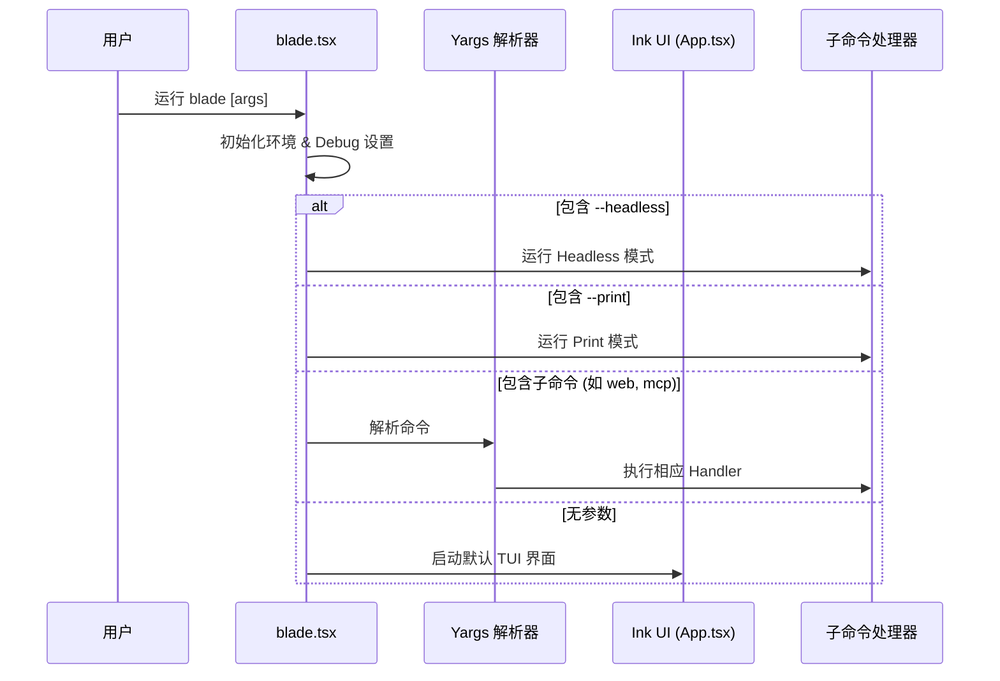
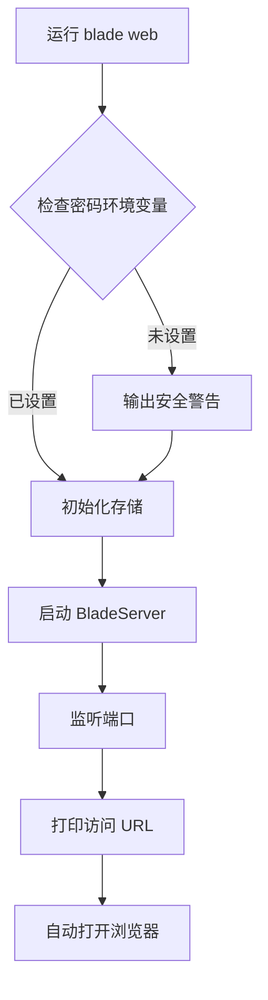
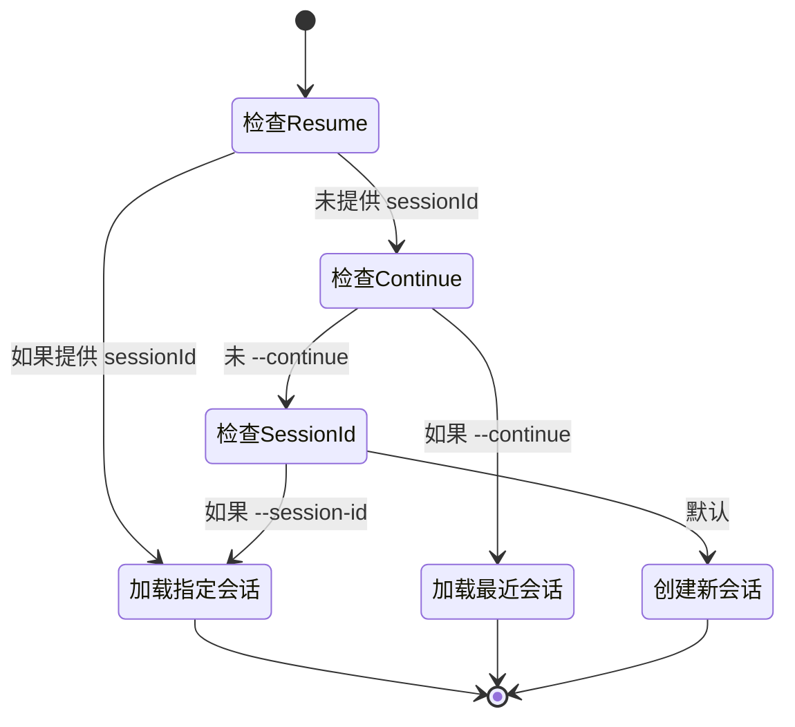

# CLI 命令完整参考

## 目录
1. [模块概览](#模块概览)
2. [引言](#引言)
3. [核心组件与入口](#核心组件与入口)
   - [CLI 入口点 (blade.tsx)](#cli-入口点-bladetsx)
   - [会话上下文 (SessionContext)](#会话上下文-sessioncontext)
4. [核心交互命令](#核心交互命令)
   - [默认交互模式 (TUI)](#默认交互模式-tui)
   - [Web 界面模式 (web)](#web-界面模式-web)
   - [无界面服务器模式 (serve)](#无界面服务器模式-serve)
5. [环境管理命令](#环境管理命令)
   - [安装与初始化 (install)](#安装与初始化-install)
   - [版本更新 (update)](#版本更新-update)
6. [诊断与扩展命令](#诊断与扩展命令)
   - [系统健康检查 (doctor)](#系统健康检查-doctor)
   - [MCP 服务管理 (mcp)](#mcp-服务管理-mcp)
7. [自动化与非交互命令](#自动化与非交互命令)
   - [Headless 模式 (headless)](#headless-模式-headless)
   - [单次输出模式 (print)](#单次输出模式-print)
8. [配置与环境变量](#配置与环境变量)
9. [执行逻辑分析](#执行逻辑分析)
10. [文件参考](#文件参考)

## 模块概览

本章节涵盖了 Blade 命令行工具（CLI）的所有核心命令实现。CLI 是用户与 Blade 智能助手交互的首要界面，其设计目标是提供灵活、高效且可扩展的操作体验。

**统计信息**：
- **总文件数**：12 个 TypeScript 源文件。
- **核心目录**：`packages/cli/src/commands/`。
- **子模块**：
  - `shared/`：包含命令间共享的逻辑，如输入处理和会话上下文解析。
  - **核心命令**：`serve.ts`, `web.ts`, `install.ts`, `headless.ts`, `mcp.ts`, `update.ts`, `doctor.ts`。

本文档将深入探讨每个命令的参数列表、执行逻辑以及它们在系统架构中的作用。

## 引言

Blade CLI 是一个功能丰富的命令行界面，它不仅仅是一个简单的聊天窗口，而是一个集成了环境管理、自动化任务执行、服务器模式和插件扩展的综合工具箱。

CLI 的核心架构基于 `yargs` 构建，利用其强大的参数解析和命令分发能力。Blade 支持多种运行模式：
- **交互式 (TUI)**：基于 Ink 实现的终端用户界面，提供类 IDE 的沉浸式体验。
- **Web 模式**：启动后端 Hono 服务器和 Vite 前端，允许通过浏览器访问。
- **自动化模式 (Headless)**：为 CI/CD 或脚本调用设计的非交互模式，支持 JSONL 事件流输出。
- **工具链模式**：包括 `install`, `update`, `doctor` 等维护工具，确保开发环境的健康。

通过这些命令，Blade 能够适应从个人开发者本地调试到企业级自动化流水线的各种场景。

## 核心组件与入口

### CLI 入口点 (blade.tsx)

`blade.tsx` 是整个 CLI 的主入口。它负责初始化环境、解析全局标志，并根据用户输入分发到相应的命令处理器。

**关键逻辑流**：
1. **环境初始化**：调用 `findProjectRoot` 确定工作区根目录，并设置全局状态。
2. **Debug 模式解析**：在所有逻辑开始前解析 `--debug`，确保日志系统能捕捉到最早期的事件。
3. **特权检查**：防止使用 `sudo` 运行，以避免配置文件权限问题。
4. **模式分发**：
   - 检查 `--headless` 或 `--print` 标志，如果存在则进入相应的自动化流程。
   - 否则，使用 `yargs` 注册并运行子命令。
   - 如果没有提供任何子命令，则默认启动 TUI 交互模式。

下面的序列图展示了 CLI 启动时的分发逻辑：



在启动 TUI 时，CLI 会并行触发版本检查 `checkVersionOnStartup`，确保用户能及时获得更新提醒而不影响启动速度。

**代码参考**：
```typescript
// packages/cli/src/blade.tsx
// 处理默认行为（无命令时启动UI）
.command(
  '$0',
  false, 
  () => {},
  async (argv) => {
    // 加载 Ink 和 React 依赖
    const [{ render }, { createElement }, { AppWrapper: BladeApp }] =
      await Promise.all([import('ink'), import('react'), import('./ui/App.js')]);

    // 渲染 UI 根组件
    render(createElement(BladeApp, appProps), {
      patchConsole: true,
      exitOnCtrlC: false,
      alternateBuffer: false,
    });
  }
);
```

### 会话上下文 (SessionContext)

`SessionContext` 是连接 CLI 命令与底层 Agent 服务的桥梁。它负责解析会话 ID、加载历史消息并维护运行时状态。

对于非交互式命令（如 `headless`），系统通过 `resolveNonInteractiveSession` 来确定会话策略：
- **Resume**：通过会话 ID 恢复特定会话。
- **Continue**：自动加载最近一次的会话。
- **New**：创建一个带时间戳的新会话。

**Diagram sources**: 
- [blade.tsx:L118-L244](file:///Users/bytedance/Documents/GitHub/Blade/packages/cli/src/blade.tsx#L118-L244)
- [shared/sessionContext.ts:L40-L78](file:///Users/bytedance/Documents/GitHub/Blade/packages/cli/src/commands/shared/sessionContext.ts#L40-L78)

## 核心交互命令

### 默认交互模式 (TUI)

这是 Blade 最常用的模式。通过 `blade` 直接运行，它启动一个基于 `ink` 的终端 UI。

- **功能**：实时聊天、文件树显示、工具调用确认、多轮对话管理。
- **启动逻辑**：在 `blade.tsx` 的默认命令处理器中，它会动态导入 React 和 Ink 组件。这种延迟加载机制显著提升了非交互命令（如 `blade --version`）的响应速度。
- **参数支持**：支持所有全局选项，如 `--model`, `--system-prompt` 等。

### Web 界面模式 (web)

`web` 命令为喜欢浏览器界面的用户提供支持。它启动一个后端的 Hono 服务器来处理 API 请求，并提供一个基于 Vite 构建的前端界面。

- **命令格式**：`blade web [options]`
- **关键标志**：
  - `--port, -p`：指定服务器端口（默认由 `resolveNetworkOptions` 处理）。
  - `--hostname`：指定绑定地址（如 `0.0.0.0` 允许局域网访问）。
- **执行逻辑**：
  1. 调用 `ensureStoreInitialized` 确保本地存储可用。
  2. 检查 `BLADE_SERVER_PASSWORD` 环境变量，如果未设置则发出安全警告。
  3. 启动 `BladeServer` 并输出访问地址（Local 和 Network）。
  4. 自动调用 `open` 库在默认浏览器中打开页面。



`web` 命令的实现位于 `packages/cli/src/commands/web.ts`。它利用 `BladeServer.listenAsync(opts)` 启动底层服务，该服务同时托管了静态前端资源和 WebSocket/HTTP API。

### 无界面服务器模式 (serve)

`serve` 命令与 `web` 类似，但它只启动后端服务而不自动打开浏览器，通常用于在服务器上部署 Blade 实例。

- **命令格式**：`blade serve [options]`
- **描述**：启动一个 Headless Blade 服务器。
- **逻辑差异**：相比 `web` 命令，`serve` 不包含浏览器打开逻辑，且输出更加简洁，侧重于日志监控。

**Section sources**:
- [web.ts](file:///Users/bytedance/Documents/GitHub/Blade/packages/cli/src/commands/web.ts)
- [serve.ts](file:///Users/bytedance/Documents/GitHub/Blade/packages/cli/src/commands/serve.ts)

## 环境管理命令

### 安装与初始化 (install)

`install` 命令负责 Blade 本地二进制依赖的安装和管理。

- **用法**：`blade install [target] [--force]`
- **参数**：
  - `target`：安装目标，可选 `stable` (默认) 或 `latest`。
  - `--force`：强制重新安装，即使当前已是最新版本。
- **内部逻辑**：
  目前实现主要作为框架，负责下载指定版本的二进制文件、验证完整性并更新系统符号链接。它确保了 Blade 运行所需的本地环境（如特定的运行时或编译工具）是完备的。

### 版本更新 (update)

`update` 命令用于检查并升级 Blade CLI 工具自身。

- **用法**：`blade update`
- **执行流程**：
  1. 调用 `VersionChecker.checkVersion(true)` 获取最新版本信息。
  2. 比较本地版本与远程版本。
  3. 如果发现新版本，通过 `execSync` 执行 `npm install -g blade-code@latest` 进行全局升级。
  4. 升级完成后提示用户重新启动。

**Section sources**:
- [install.ts](file:///Users/bytedance/Documents/GitHub/Blade/packages/cli/src/commands/install.ts)
- [update.ts](file:///Users/bytedance/Documents/GitHub/Blade/packages/cli/src/commands/update.ts)

## 诊断与扩展命令

### 系统健康检查 (doctor)

`doctor` 命令类似于诊断工具，用于排查 Blade 运行环境中的常见问题。

- **检查项目**：
  - **配置加载**：验证 `ConfigManager` 是否能正确读取配置文件。
  - **Node.js 版本**：确保 Node.js 版本满足 `>= 18` 的要求。
  - **文件权限**：检查当前目录是否具有读写权限。
  - **关键依赖**：验证如 `ink` 等核心包是否正确安装。
- **输出**：以 `[OK]` 或 `[FAIL]` 标记每项检查结果，并在最后给出总结。如果存在严重问题，将以非零状态码退出。

### MCP 服务管理 (mcp)

`mcp` 是一个复杂的子命令集，用于管理 Model Context Protocol (MCP) 服务器。MCP 允许 Blade 扩展其工具能力。

**子命令列表**：
- `add <name> <commandOrUrl> [args...]`：添加一个新的 MCP 服务器（支持 stdio, sse, http 传输）。
- `remove <name>`：删除指定的服务器配置。
- `list`：列出所有已配置的服务器，并实时检查它们的连接状态（健康检查）。
- `get <name>`：查看特定服务器的详细 JSON 配置。
- `add-json <name> <json>`：直接通过 JSON 字符串导入配置。

**关键特性**：
- **作用域支持**：通过 `--global` 标志，用户可以选择将配置存储在项目级（`.blade/config.json`）或全局级（`~/.blade/config.json`）。
- **参数转发**：支持使用 `--` 分隔符来传递复杂的 shell 命令参数。

```mermaid
graph LR
    subgraph "MCP 管理流"
        A[blade mcp add] --> B[验证参数]
        B --> C[解析传输类型]
        C --> D{存储位置?}
        D -- --global --> E[~/.blade/config.json]
        D -- 默认 --> F[.blade/config.json]
        E --> G[更新 McpRegistry]
        F --> G
    end
```

**Section sources**:
- [doctor.ts](file:///Users/bytedance/Documents/GitHub/Blade/packages/cli/src/commands/doctor.ts)
- [mcp.ts](file:///Users/bytedance/Documents/GitHub/Blade/packages/cli/src/commands/mcp.ts)

## 自动化与非交互命令

### Headless 模式 (headless)

`headless` 模式是为自动化场景设计的重器。它运行完整的 Agent 循环，但不启动任何交互界面。

- **用法**：`blade --headless [message]`
- **关键参数**：
  - `--output-format`：支持 `text` (默认) 和 `jsonl`。
  - `--max-turns`：限制对话轮数，防止 Agent 进入无限循环。
  - `--permission-mode`：在 Headless 模式下默认通常为 `yolo`（自动批准所有工具调用），但也可以自定义。
- **输出格式 (JSONL)**：
  当使用 `jsonl` 格式时，Blade 会输出一系列结构化的事件行：
  - `content_delta`：模型输出的文本增量。
  - `thinking_delta`：模型思考过程的增量。
  - `tool_start` / `tool_result`：工具调用的开始和结果。
  - `phase`：当前执行阶段（如 `searching`, `executing`, `completed`）。

**执行逻辑分析**：
`headless` 命令通过 `drainLoop` 函数驱动 `agent.chatStream`。它监听流中的每一个事件，并根据 `outputFormat` 调用 `eventWriter` 进行输出。这种设计确保了即使在没有 UI 的情况下，用户（或调用脚本）也能实时感知 Agent 的进度和状态。

### 单次输出模式 (print)

`print` 模式（通过 `-p` 或 `--print` 触发）是 Headless 模式的简化版本，旨在实现 "一次性提问，一次性获取结果" 的体验，非常适合管道操作（Pipes）。

- **示例**：`echo "Explain this code" | blade --print`
- **逻辑**：它读取输入，运行 Agent 直到生成最终回答，然后将结果打印到 stdout 并立即退出。

**Section sources**:
- [headless.ts](file:///Users/bytedance/Documents/GitHub/Blade/packages/cli/src/commands/headless.ts)
- [shared/commandInput.ts](file:///Users/bytedance/Documents/GitHub/Blade/packages/cli/src/commands/shared/commandInput.ts)

## 配置与环境变量

Blade CLI 的行为受多种配置源影响，优先级从高到低依次为：
1. 命令行标志 (Flags)
2. 环境变量 (Environment Variables)
3. 项目级配置文件 (`.blade/config.json`)
4. 全局配置文件 (`~/.blade/config.json`)

**核心环境变量**：
- `BLADE_CONFIG_PATH`：自定义配置文件的搜索路径。
- `BLADE_SERVER_PASSWORD`：设置 `web` 和 `serve` 模式的访问密码。
- `BLADE_ALLOW_ROOT`：允许在 root 环境下运行（通常用于 Docker）。
- `BLADE_LOG_LEVEL`：控制日志详细程度。

**全局标志参考**：
- `--model`：指定使用的 LLM 模型 ID。
- `--system-prompt`：覆盖默认的系统提示词。
- `--yolo`：自动批准所有危险操作（如修改文件、执行脚本）。

## 执行逻辑分析

理解 CLI 如何初始化 `SessionContext` 对调试至关重要。

当用户启动一个命令时，`resolveNonInteractiveSession` 会被调用。其内部状态转换如下：



在加载会话后，系统会创建一个 `SessionRuntime` 实例。这个运行时负责：
1. **插件集成**：加载并初始化所有 CLI 插件。
2. **MCP 连接**：根据配置建立与 MCP 服务器的连接。
3. **Agent 实例化**：根据当前配置（模型、提示词、工具白名单）创建 Agent 实例。

这种分层初始化确保了 CLI 的灵活性：你可以随时通过标志改变模型或工具集，而无需修改持久化配置。

## 文件参考

以下是本章节涉及的关键源文件：

- [blade.tsx](file:///Users/bytedance/Documents/GitHub/Blade/packages/cli/src/blade.tsx)：CLI 主入口。
- [commands/serve.ts](file:///Users/bytedance/Documents/GitHub/Blade/packages/cli/src/commands/serve.ts)：Headless 服务器实现。
- [commands/web.ts](file:///Users/bytedance/Documents/GitHub/Blade/packages/cli/src/commands/web.ts)：Web 界面服务器实现。
- [commands/headless.ts](file:///Users/bytedance/Documents/GitHub/Blade/packages/cli/src/commands/headless.ts)：自动化任务执行引擎。
- [commands/mcp.ts](file:///Users/bytedance/Documents/GitHub/Blade/packages/cli/src/commands/mcp.ts)：MCP 服务管理逻辑。
- [commands/install.ts](file:///Users/bytedance/Documents/GitHub/Blade/packages/cli/src/commands/install.ts)：环境安装脚本。
- [commands/update.ts](file:///Users/bytedance/Documents/GitHub/Blade/packages/cli/src/commands/update.ts)：自更新逻辑。
- [commands/doctor.ts](file:///Users/bytedance/Documents/GitHub/Blade/packages/cli/src/commands/doctor.ts)：环境诊断工具。
- [commands/shared/sessionContext.ts](file:///Users/bytedance/Documents/GitHub/Blade/packages/cli/src/commands/shared/sessionContext.ts)：会话解析共享逻辑。
- [cli/config.ts](file:///Users/bytedance/Documents/GitHub/Blade/packages/cli/src/cli/config.ts)：全局选项定义。
- [cli/network.ts](file:///Users/bytedance/Documents/GitHub/Blade/packages/cli/src/cli/network.ts)：网络配置解析。
