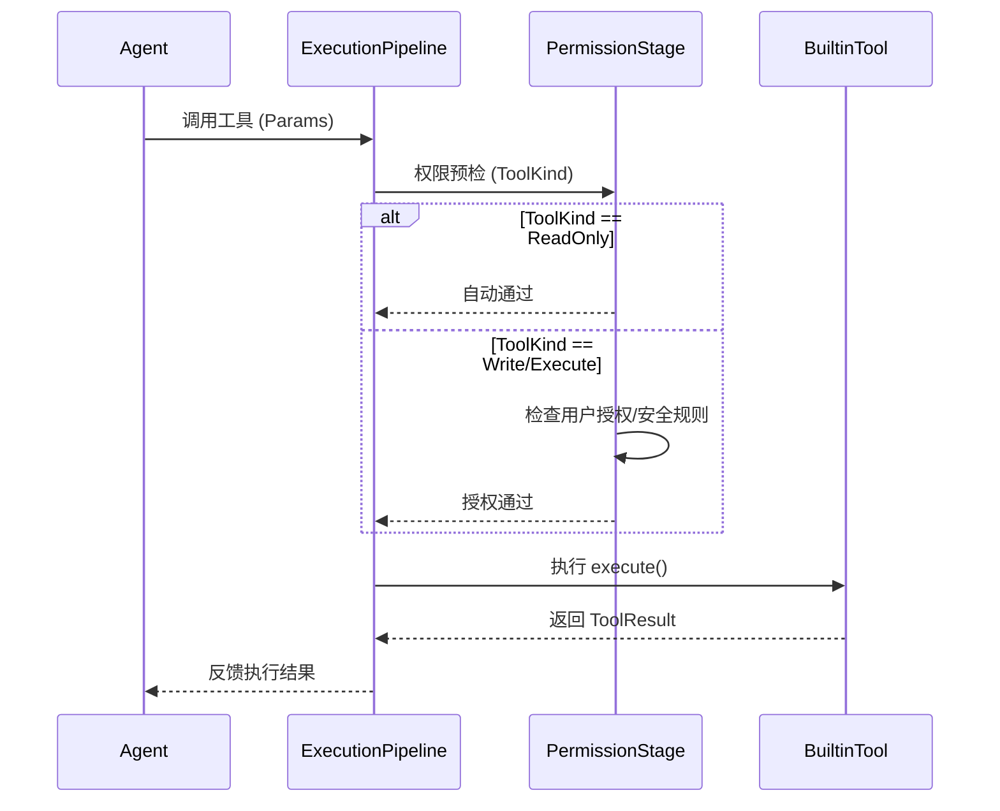
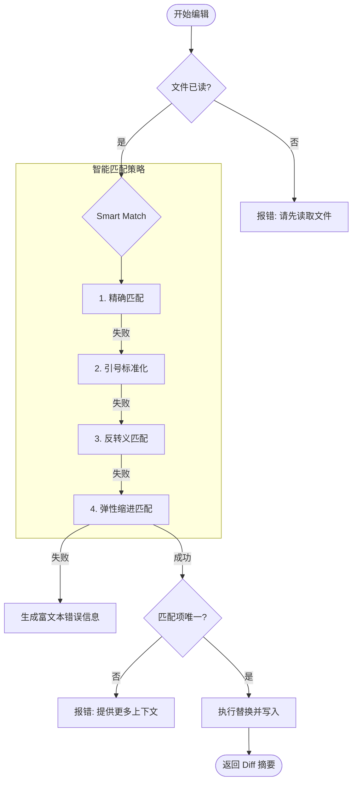
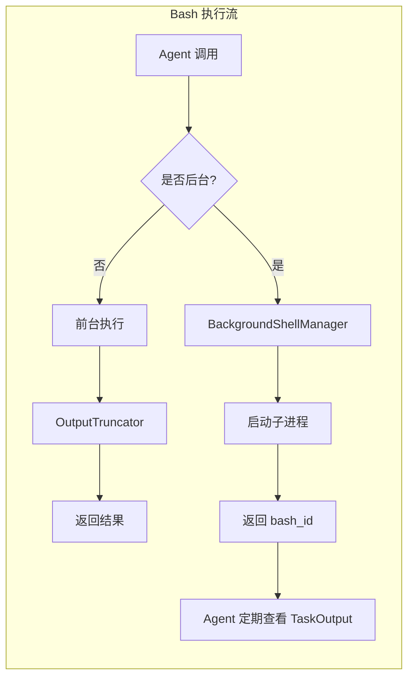
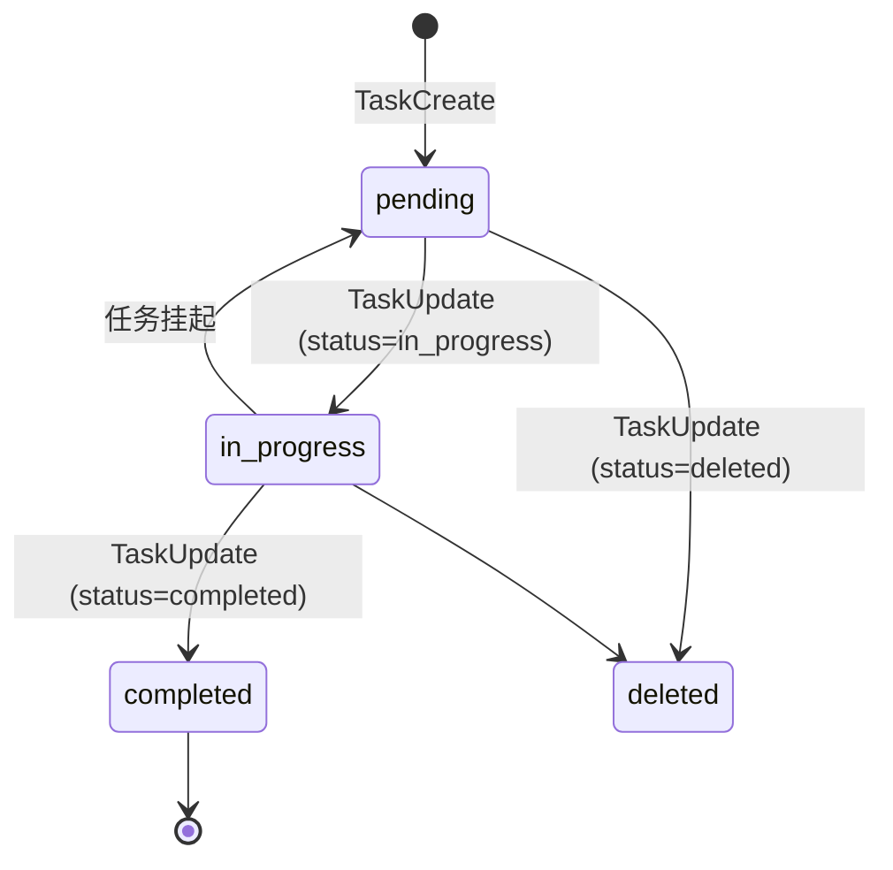

# 内置工具参考

## 目录
1. [模块概览](#模块概览)
2. [引言](#引言)
3. [核心组件与权限模型](#核心组件与权限模型)
   - [ToolKind 与权限等级](#toolkind-与权限等级)
   - [FileAccessTracker 安全审计](#fileaccesstracker-安全审计)
4. [文件系统工具](#文件系统工具)
   - [Read 工具：智能读取与行级切片](#read-工具智能读取与行级切片)
   - [Edit 工具：精确字符串替换机制](#edit-工具精确字符串替换机制)
   - [Write 工具：全量文件写入](#write-工具全量文件写入)
5. [系统执行工具](#系统执行工具)
   - [Bash 工具：命令执行与环境隔离](#bash-工具命令执行与环境隔离)
   - [OutputTruncator 智能截断](#outputtruncator-智能截断)
   - [BackgroundShellManager 后台管理](#backgroundshellmanager-后台管理)
6. [任务与上下文管理工具](#任务与上下文管理工具)
   - [TaskListTools 任务状态流转](#tasklisttools-任务状态流转)
7. [工具 Schema 与调用示例](#工具-schema-与调用示例)
8. [文件参考](#文件参考)

## 模块概览

本模块定义了 Blade AI Agent 的核心能力边界。内置工具集（Built-in Tools）是 Agent 与外部世界（文件系统、操作系统、网络等）交互的唯一合法途径。

通过对 `packages/cli/src/tools/builtin/` 目录的深度扫描，我们识别出以下关键信息：

- **文件总数**：共发现 54 个 TypeScript 源文件。
- **子模块分布**：
  - `file/` (7 个文件)：核心文件操作，包括读取、写入、编辑及安全跟踪。
  - `shell/` (5 个文件)：系统命令执行、输出截断及后台进程管理。
  - `task/` (5 个文件)：结构化任务列表管理，支持复杂任务的拆解与追踪。
  - `search/` (3 个文件)：基于 Glob 和 Grep 的高性能文件搜索。
  - `spec/` (9 个文件)：规范（Spec）模式下的任务管理与状态同步。
  - `system/` (5 个文件)：用户交互、技能搜索及斜杠命令处理。
  - `web/` (5 个文件)：网页搜索与内容抓取能力。
  - `config/`, `memory/`, `plan/`, `team/`, `notebook/`：其他辅助功能模块。

本章节将重点深入探讨 **文件系统工具**、**系统执行工具** 以及 **任务管理工具**，这些是构建高效 Agent 闭环的核心基石。

## 引言

内置工具集（Built-in Tools）不仅是功能的集合，更是一套严格的权限与安全契约。Agent 在执行任务时，必须通过这些预定义的工具来操作环境，而不能直接调用底层的 Node.js API。这种封装确保了：

1. **可观测性**：每一次工具调用都会被记录并展示给用户，确保 Agent 的行为透明。
2. **安全性**：通过 `ToolKind` 对工具进行分类，结合权限模型实现细粒度的操作授权。
3. **鲁棒性**：内置了智能匹配、输出截断和 Read-Before-Write 等机制，减少 LLM 在复杂环境下的操作错误。

在 Blade 架构中，工具被视为一种特殊的“技能”，LLM 通过生成符合特定 JSON Schema 的参数来触发工具执行。执行结果随后反馈给 LLM，形成一个完整的感知-决策-执行循环。

## 核心组件与权限模型

了解内置工具的设计，首先需要掌握其底层的权限分类逻辑和安全审计机制。

### ToolKind 与权限等级

Blade 将所有工具划分为三种 `ToolKind`，这直接决定了工具在权限校验流程中的待遇。

| ToolKind | 描述 | 典型工具 | 权限策略 |
| :--- | :--- | :--- | :--- |
| **ReadOnly** | 无副作用的只读操作 | `Read`, `Glob`, `Grep`, `TaskList` | 通常默认允许，或仅需低级别授权。 |
| **Write** | 具有文件修改副作用的操作 | `Edit`, `Write`, `NotebookEdit` | 需要文件级别的写权限校验，通常触发 Read-Before-Write 审计。 |
| **Execute** | 具有系统级副作用的操作 | `Bash`, `KillShell`, `Skill` | 最高权限等级，通常需要用户显式确认或在沙箱中运行。 |

下面的序列图展示了 `ToolKind` 如何影响工具的执行流：



**图表说明**：
执行流水线 `ExecutionPipeline` 在分发任务前会先经过 `PermissionStage`。对于 `ReadOnly` 工具，系统倾向于静默执行以提高效率；而对于 `Write` 和 `Execute` 工具，系统会强制执行规则匹配或用户交互确认。

### FileAccessTracker 安全审计

为了防止 Agent 在未了解文件内容的情况下盲目修改代码，Blade 引入了 `FileAccessTracker`。这是一个单例组件，负责跟踪当前会话中文件的访问历史。

其核心逻辑如下：
1. **记录读取**：当 `Read` 工具被调用时，记录文件的路径、修改时间（mtime）和会话 ID。
2. **强制校验**：在 `Edit` 工具执行前，检查目标文件是否已被读取。如果未读取，则拒绝编辑并引导 Agent 先调用 `Read`。
3. **外部修改检测**：在编辑前对比文件的当前 mtime 与读取时的 mtime。如果发现文件被外部程序（如 IDE 插件或其他脚本）修改，则强制 Agent 重新读取，避免基于过期上下文产生冲突。

**Section sources**:
- [ToolTypes.ts](file:///Users/bytedance/Documents/GitHub/Blade/packages/cli/src/tools/types/ToolTypes.ts)
- [FileAccessTracker.ts](file:///Users/bytedance/Documents/GitHub/Blade/packages/cli/src/tools/builtin/file/FileAccessTracker.ts)

## 文件系统工具

文件系统工具是 Agent 最频繁使用的工具集，其设计重点在于“精确性”和“上下文感知”。

### Read 工具：智能读取与行级切片

`Read` 工具不仅支持读取普通文本文件，还具备处理二进制文件、PDF 和 Jupyter Notebook 的能力。

- **行级切片**：对于超大文件，支持通过 `offset` 和 `limit` 进行分页读取，避免超出 LLM 的上下文限制。
- **视觉转换**：当读取图片或 PDF 时，系统会自动将其转换为多模态模型可识别的视觉输入。
- **格式化输出**：默认采用 `cat -n` 格式返回，带有行号前缀，方便 LLM 在后续调用 `Edit` 时精确定位。

### Edit 工具：精确字符串替换机制

`Edit` 工具是 Blade 的杀手锏。它放弃了复杂的正则匹配，转而采用基于 `old_string` 和 `new_string` 的精确替换方案，并辅以智能匹配算法（Smart Match）。



**图表说明**：
`Edit` 工具的执行流程高度强调安全与容错。`Smart Match` 策略能够处理 LLM 常见的引号混用（智能引号 vs 直引号）和缩进微差问题。如果匹配失败，`RichError` 会计算模糊匹配相似度并返回建议的行号，帮助 LLM 自我纠错。

### Write 工具：全量文件写入

与 `Edit` 相比，`Write` 工具用于全量覆盖文件内容或创建新文件。它同样受到 `FileAccessTracker` 的监控。在执行写入前，系统会自动创建文件快照（Snapshot），以便在操作失误时进行回滚。

**Section sources**:
- [read.ts](file:///Users/bytedance/Documents/GitHub/Blade/packages/cli/src/tools/builtin/file/read.ts)
- [edit.ts](file:///Users/bytedance/Documents/GitHub/Blade/packages/cli/src/tools/builtin/file/edit.ts)
- [write.ts](file:///Users/bytedance/Documents/GitHub/Blade/packages/cli/src/tools/builtin/file/write.ts)

## 系统执行工具

`Bash` 工具为 Agent 提供了执行任意 Shell 命令的能力，但其背后有一套复杂的管理机制。

### Bash 工具：命令执行与环境隔离

Blade 的 `Bash` 工具支持两种运行模式：
1. **前台模式**：适用于快速执行的命令（如 `ls`, `git status`）。命令执行后，输出会被捕获并返回。
2. **后台模式**：通过 `run_in_background: true` 开启，适用于长时间运行的任务（如 `npm run dev`）。

### OutputTruncator 智能截断

为了防止命令输出（如 `npm install` 的万行日志）撑爆上下文，`OutputTruncator` 会根据命令类型采取不同的截断策略：

- **激进策略 (Aggressive)**：如 `git add`, `npm install`。仅保留头部和尾部少量行，中间部分摘要化。
- **保守策略 (Conservative)**：如 `git diff`, `npm test`。保留更多行数，确保关键错误信息不丢失。

### BackgroundShellManager 后台管理

后台进程由 `BackgroundShellManager` 统一管理。每个进程都有一个唯一的 `bash_id`。Agent 可以通过 `TaskOutput` 工具随时查看后台进程的实时输出，或通过 `KillShell` 工具终止失控的进程。



**图表说明**：
该图展示了同步与异步命令执行的分流。前台命令经过截断器处理后直接反馈，而后台命令则进入管理池，由 Agent 通过轮询或事件驱动的方式进行后续追踪。

**Section sources**:
- [bash.ts](file:///Users/bytedance/Documents/GitHub/Blade/packages/cli/src/tools/builtin/shell/bash.ts)
- [OutputTruncator.ts](file:///Users/bytedance/Documents/GitHub/Blade/packages/cli/src/tools/builtin/shell/OutputTruncator.ts)
- [BackgroundShellManager.ts](file:///Users/bytedance/Documents/GitHub/Blade/packages/cli/src/tools/builtin/shell/BackgroundShellManager.ts)

## 任务与上下文管理工具

对于复杂的工程任务，单次工具调用往往不足以完成目标。`TaskListTools` 提供了一套结构化的任务追踪机制。

### TaskListTools 任务状态流转

Agent 通过 `TaskCreate` 创建任务，并通过 `TaskUpdate` 维护任务状态。这不仅是 Agent 的自我管理工具，也是用户了解 Agent 计划的重要窗口。

任务状态遵循严格的生命周期：



**图表说明**：
状态机展示了任务从创建到完成的标准路径。Agent 被要求在开始实质性工作前先将任务标记为 `in_progress`，并在完全验证（如通过测试）后再标记为 `completed`。这种显式的状态变更增强了 Agent 的计划执行能力。

**Section sources**:
- [taskListTools.ts](file:///Users/bytedance/Documents/GitHub/Blade/packages/cli/src/tools/builtin/task/taskListTools.ts)
- [TaskListManager.ts](file:///Users/bytedance/Documents/GitHub/Blade/packages/cli/src/tools/builtin/task/TaskListManager.ts)

## 工具 Schema 与调用示例

以下是核心工具的输入 Schema 定义及其典型调用 JSON 示例。

#### 文件编辑 (Edit)
| 参数名 | 类型 | 必填 | 描述 |
| :--- | :--- | :--- | :--- |
| `file_path` | string | 是 | 文件的绝对路径 |
| `old_string` | string | 是 | 要被替换的精确字符串 |
| `new_string` | string | 是 | 替换后的新字符串 |
| `replace_all` | boolean | 否 | 是否替换所有匹配项 (默认 false) |

**调用示例**：
```json
{
  "tool": "Edit",
  "params": {
    "file_path": "/src/app.ts",
    "old_string": "const version = '1.0.0';",
    "new_string": "const version = '1.1.0';",
    "replace_all": false
  }
}
```

#### 系统命令 (Bash)
| 参数名 | 类型 | 必填 | 描述 |
| :--- | :--- | :--- | :--- |
| `command` | string | 是 | 要执行的 Bash 命令 |
| `run_in_background` | boolean | 否 | 是否在后台运行 |
| `cwd` | string | 否 | 执行命令的工作目录 |

**调用示例**：
```json
{
  "tool": "Bash",
  "params": {
    "command": "npm test",
    "description": "运行单元测试以验证更改",
    "timeout": 60000
  }
}
```

## 文件参考

本章节涉及的关键源文件如下：

- **核心定义**：
  - [ToolTypes.ts](file:///Users/bytedance/Documents/GitHub/Blade/packages/cli/src/tools/types/ToolTypes.ts) - 工具种类与元数据定义
  - [zodSchemas.ts](file:///Users/bytedance/Documents/GitHub/Blade/packages/cli/src/tools/validation/zodSchemas.ts) - 统一的参数校验 Schema
- **文件工具**：
  - [read.ts](file:///Users/bytedance/Documents/GitHub/Blade/packages/cli/src/tools/builtin/file/read.ts) - 文件读取实现
  - [edit.ts](file:///Users/bytedance/Documents/GitHub/Blade/packages/cli/src/tools/builtin/file/edit.ts) - 精确编辑逻辑
  - [FileAccessTracker.ts](file:///Users/bytedance/Documents/GitHub/Blade/packages/cli/src/tools/builtin/file/FileAccessTracker.ts) - 安全审计跟踪
- **执行工具**：
  - [bash.ts](file:///Users/bytedance/Documents/GitHub/Blade/packages/cli/src/tools/builtin/shell/bash.ts) - Shell 执行器
  - [OutputTruncator.ts](file:///Users/bytedance/Documents/GitHub/Blade/packages/cli/src/tools/builtin/shell/OutputTruncator.ts) - 智能输出截断
- **任务工具**：
  - [taskListTools.ts](file:///Users/bytedance/Documents/GitHub/Blade/packages/cli/src/tools/builtin/task/taskListTools.ts) - 任务管理工具集
  - [TaskListManager.ts](file:///Users/bytedance/Documents/GitHub/Blade/packages/cli/src/tools/builtin/task/TaskListManager.ts) - 任务持久化与状态管理
