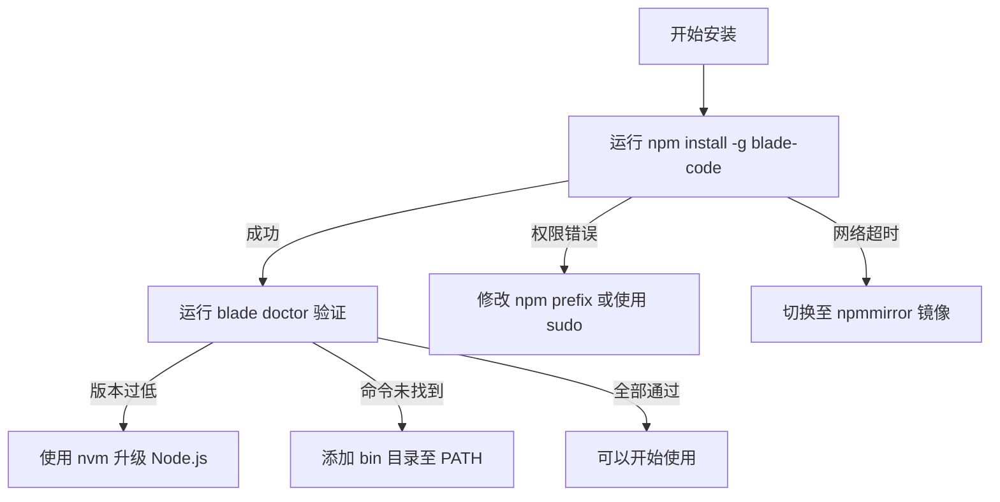
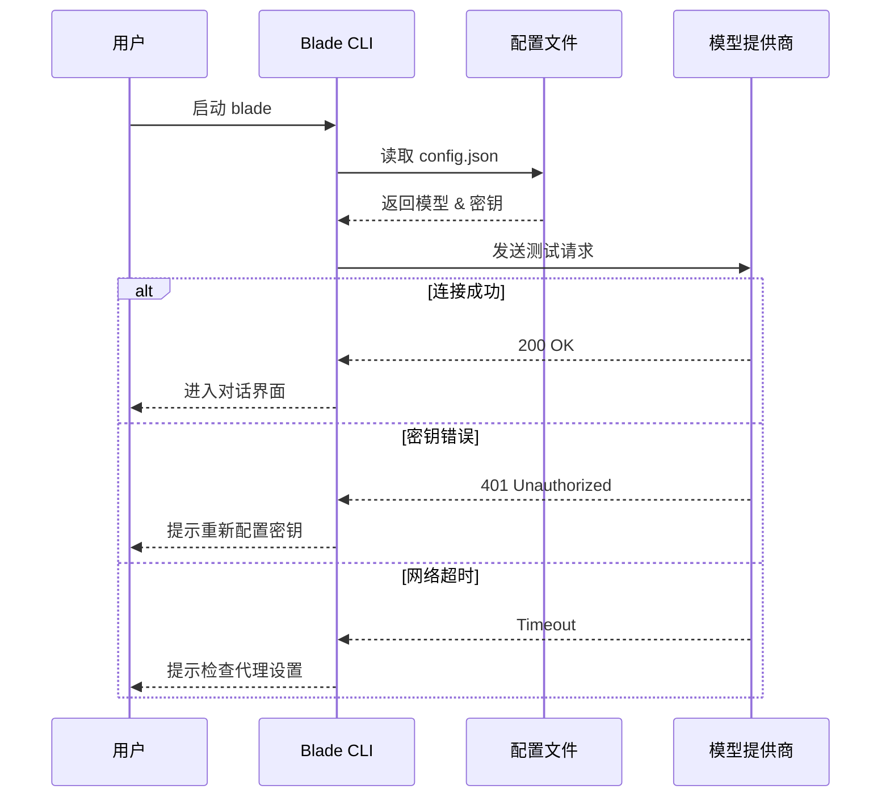
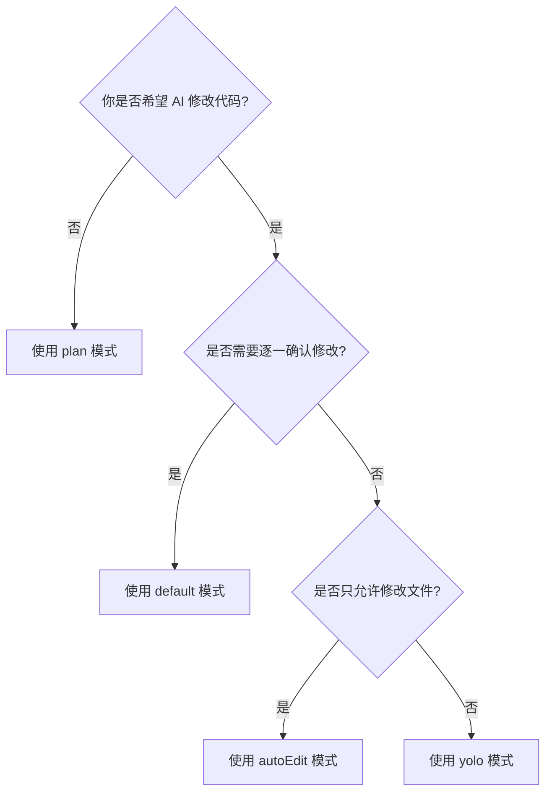
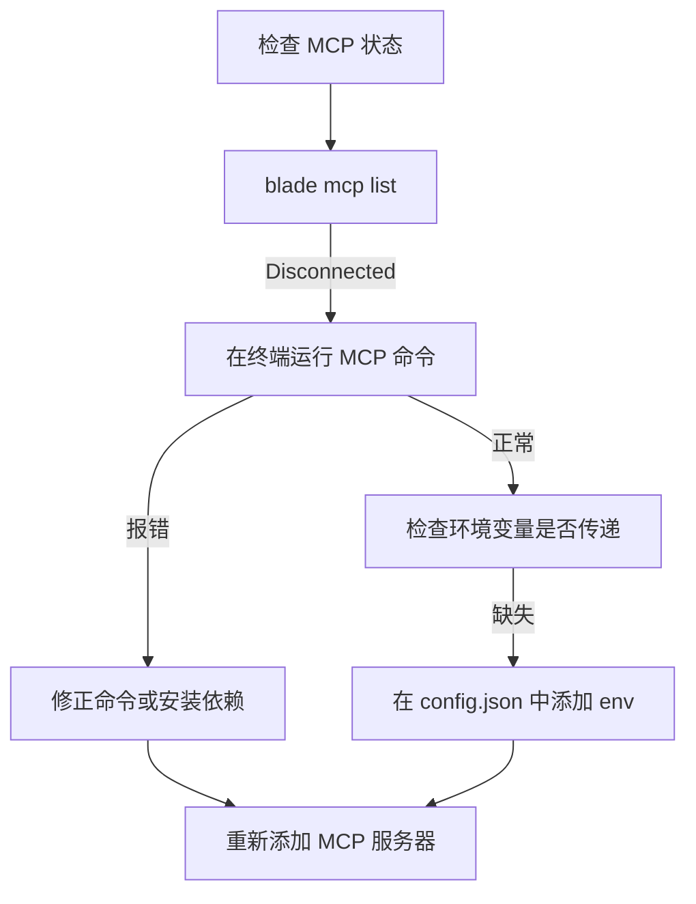

# 常见问题解答

## 目录
1. [模块概览](#模块概览)
2. [简介](#简介)
3. [安装与启动](#安装与启动)
   - [Node.js 版本不兼容](#nodejs-版本不兼容)
   - [命令未找到 (Command Not Found)](#命令未找到-command-not-found)
   - [权限错误 (EACCES)](#权限错误-eacces)
   - [安装速度慢或失败](#安装速度慢或失败)
4. [模型与连接](#模型与连接)
   - [API 密钥配置](#api-密钥配置)
   - [连接超时或网络错误](#连接超时或网络错误)
   - [请求频率限制 (Rate Limit)](#请求频率限制-rate-limit)
5. [功能使用](#功能使用)
   - [权限模式选择](#权限模式选择)
   - [Slash 命令无效](#slash-命令无效)
   - [会话恢复与继续](#会话恢复与继续)
6. [高级功能](#高级功能)
   - [MCP 服务器连接失败](#mcp-服务器连接失败)
   - [自定义 Skill 不生效](#自定义-skill-不生效)
   - [调试与日志](#调试与日志)
7. [核心组件](#核心组件)
8. [文件引用](#文件引用)

## 模块概览

本章节汇总了 Blade 用户在安装、配置及日常使用过程中最常遇到的非技术性障碍及其解决方案。

- **覆盖范围**: 包含安装环境搭建、模型提供商配置、权限模式管理、MCP 扩展及调试工具使用。
- **文件统计**: 主要基于 `docs/faq.md` 和 `docs/getting-started/installation.md`，涉及 `packages/cli/src/commands/doctor.ts` 中的环境检查逻辑。
- **核心目标**: 提供分步指南，帮助用户在无需深入源码的情况下快速恢复工具可用性。

## 简介

Blade 作为一个高度可扩展的 AI 编程助手，依赖于特定的 Node.js 环境、网络连接以及正确的模型配置。由于用户环境的多样性（如不同的操作系统、Node.js 版本、网络代理设置等），可能会遇到各种启动或运行时的阻碍。

本 FAQ 文档旨在通过“现象描述 -> 原因分析 -> 解决方案”的结构，为用户提供清晰的排查路径。建议在遇到问题时，首先运行 `blade doctor` 命令进行自动化的环境健康检查。

## 安装与启动

安装阶段的问题通常与 Node.js 环境配置或操作系统的文件权限有关。

### Node.js 版本不兼容

**现象描述**: 启动时报错 `SyntaxError` 或提示 Node.js 版本过低。
**原因分析**: Blade 核心库使用了较新的 JavaScript/TypeScript 特性，要求 Node.js 版本至少为 v20.0.0。
**解决方案**:
1. 使用 `node -v` 检查当前版本。
2. 推荐使用 `nvm` (Node Version Manager) 进行升级：
   ```bash
   nvm install 20
   nvm use 20
   ```
3. 或者使用 `n` 模块：
   ```bash
   npm install -g n && n latest
   ```

### 命令未找到 (Command Not Found)

**现象描述**: 执行 `blade` 提示 `command not found: blade`。
**原因分析**: 全局安装的 npm 包二进制路径未包含在系统的 `PATH` 环境变量中。
**解决方案**:
1. 获取 npm 全局安装路径：
   ```bash
   npm config get prefix
   ```
2. 将该路径下的 `bin` 目录添加到 `PATH`（以 macOS/Linux 为例）：
   ```bash
   export PATH="$(npm config get prefix)/bin:$PATH"
   ```
3. 将上述命令添加到 `~/.zshrc` 或 `~/.bashrc` 中以永久生效。

### 权限错误 (EACCES)

**现象描述**: 全局安装时提示 `EACCES: permission denied`。
**原因分析**: npm 尝试写入受系统保护的全局目录（如 `/usr/local/lib`），但当前用户权限不足。
**解决方案**:
- **方案 A (推荐)**: 修改 npm 的默认全局安装路径到用户目录下：
  ```bash
  mkdir ~/.npm-global
  npm config set prefix '~/.npm-global'
  export PATH=~/.npm-global/bin:$PATH
  ```
- **方案 B**: 使用 `sudo`（不推荐，可能导致后续权限混乱）：
  ```bash
  sudo npm install -g blade-code
  ```

### 安装速度慢或失败

**现象描述**: `npm install` 长时间卡住或连接超时。
**原因分析**: 默认 npm 源在海外，受网络波动影响。
**解决方案**:
使用国内镜像源（如 npmmirror）：
```bash
npm install -g blade-code --registry=https://registry.npmmirror.com
```

下图展示了安装阶段的典型排查流程：



**图表说明**: 该流程图引导用户从尝试安装到最终验证的完整路径，涵盖了权限、网络、版本及路径等核心痛点。

## 模型与连接

模型配置是 Blade 运行的核心。大多数连接问题源于密钥配置错误或网络代理设置。

### API 密钥配置

**现象描述**: 提示 `Unauthorized` 或 `Invalid API Key`。
**原因分析**: 配置文件 `~/.blade/config.json` 中的密钥不正确，或者环境变量未正确加载。
**解决方案**:
1. 运行 `blade` 触发配置向导，或手动运行 `/model add`。
2. **推荐做法**: 使用环境变量存储密钥，在配置中引用：
   ```json
   {
     "apiKey": "${MY_LLM_API_KEY}"
   }
   ```
3. 确保在终端中已 `export` 该变量：`export MY_LLM_API_KEY=sk-xxxx`。

### 连接超时或网络错误

**现象描述**: 提示 `ECONNREFUSED` 或 `Request timed out`。
**原因分析**: 无法访问 LLM 提供商的 API 端点，通常需要配置代理。
**解决方案**:
1. 检查 `baseUrl` 是否正确（例如 OpenAI 兼容接口应包含 `/v1`）。
2. 在终端配置 HTTP 代理：
   ```bash
   export https_proxy=http://127.0.0.1:7890
   export http_proxy=http://127.0.0.1:7890
   ```
3. 验证连接：`curl -v https://api.openai.com/v1/models`。

### 请求频率限制 (Rate Limit)

**现象描述**: 提示 `429 Too Many Requests`。
**原因分析**: 触发了模型提供商的速率限制（RPM/TPM）。
**解决方案**:
1. 减少并发请求（如在 Plan 模式下减少迭代次数）。
2. 在 `config.json` 中配置备用模型：
   ```bash
   blade --fallback-model my-backup-model
   ```
3. 考虑升级模型提供商的付费层级。

下图展示了模型连接的验证逻辑：



**图表说明**: 序列图展示了启动时模型验证的内部逻辑，帮助用户定位是配置读取阶段还是网络请求阶段出了问题。

## 功能使用

本节解决日常交互中的操作障碍。

### 权限模式选择

**现象描述**: AI 频繁请求确认，或 AI 无法修改文件。
**原因分析**: 当前权限模式（Permission Mode）限制了工具的执行。
**解决方案**:
根据任务类型选择合适的模式：
- **调研阶段**: 使用 `plan` 模式（只读）。
- **常规开发**: 使用 `default`（写操作需确认）。
- **快速重构**: 使用 `autoEdit`（自动批准文件修改）。
- **完全信任**: 使用 `yolo`（所有操作自动放行）。

**快捷切换**: 在 UI 中按 `Shift+Tab` 循环切换。

### Slash 命令无效

**现象描述**: 输入 `/model` 或 `/help` 无反应。
**原因分析**: 只有在输入框开头输入 `/` 且输入框处于聚焦状态时才会触发命令补全。
**解决方案**:
1. 确保光标在输入框起始位置。
2. 检查是否有其他终端快捷键冲突。

### 会话恢复与继续

**现象描述**: 意外退出后想找回之前的对话。
**原因分析**: Blade 默认每次启动开启新会话，除非明确要求恢复。
**解决方案**:
- 继续最近会话：`blade --continue` 或 `blade -c`。
- 从列表中选择恢复：`blade --resume`。
- 在 UI 内恢复：输入 `/resume`。

下图是权限模式决策树，帮助用户快速选择：



**图表说明**: 决策树简化了用户对五种权限模式的选择过程，通过简单的“是/否”判断即可找到最适合当前场景的配置。

## 高级功能

涉及 MCP、Skills 等扩展能力的故障排除。

### MCP 服务器连接失败

**现象描述**: `blade mcp list` 显示状态为 `disconnected`。
**原因分析**: MCP 服务器命令路径错误、缺少依赖或环境变量未传递。
**解决方案**:
1. 验证 MCP 命令是否能在独立终端运行。
2. 使用 `blade mcp add` 时确保使用了正确的命令格式（如 `npx -y ...`）。
3. 检查 MCP 服务器所需的特定 API Key 是否已配置。

### 自定义 Skill 不生效

**现象描述**: 创建了 `SKILL.md` 但 AI 行为没有改变。
**原因分析**: 文件位置不正确或 YAML 元数据格式错误。
**解决方案**:
1. 确保文件位于 `.blade/skills/` (项目级) 或 `~/.blade/skills/` (全局)。
2. 检查 YAML 头部是否包含 `name` 和 `description`。
3. 运行 `blade --debug skill` 查看加载日志。

### 调试与日志

**现象描述**: 遇到无法解释的报错，需要更多细节。
**解决方案**:
使用 `--debug` 参数启动：
- 查看所有日志：`blade --debug`。
- 过滤特定模块：`blade --debug "agent,tool"`。
- 排除干扰项：`blade --debug "!chat"`。

下图展示了 MCP 服务器连接的排查流程：



**图表说明**: 该流程图专门针对 MCP 这一高级功能提供了针对性的排查步骤，从状态查看、独立命令验证到环境参数检查。

## 核心组件

为了支持上述问题的排查，Blade 提供了以下核心组件和工具：

- **`ConfigManager`**: 负责加载和合并全局及项目级的 `config.json`。如果配置解析失败，它会触发回退机制。
- **`Doctor` 命令**: 实现于 `packages/cli/src/commands/doctor.ts`，自动检查 Node 版本、文件权限、配置有效性等。
- **`PermissionManager`**: 控制不同权限模式下的工具执行策略。
- **`.blade/` 目录**: 存储所有持久化配置、Skill 定义和会话记录的关键位置。

## 文件引用

**Section sources**:
- [faq.md](file:///Users/bytedance/Documents/GitHub/Blade/docs/faq.md)
- [installation.md](file:///Users/bytedance/Documents/GitHub/Blade/docs/getting-started/installation.md)
- [doctor.ts](file:///Users/bytedance/Documents/GitHub/Blade/packages/cli/src/commands/doctor.ts)
- [config-system.md](file:///Users/bytedance/Documents/GitHub/Blade/docs/configuration/config-system.md)
- [cli-commands.md](file:///Users/bytedance/Documents/GitHub/Blade/docs/reference/cli-commands.md)
