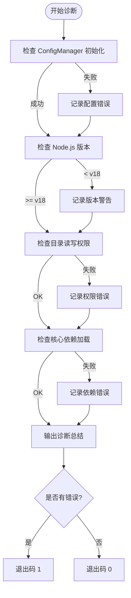
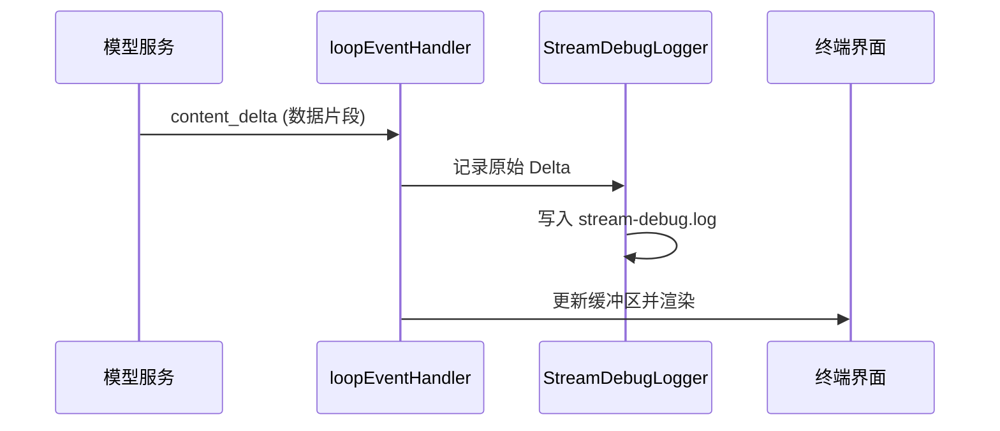
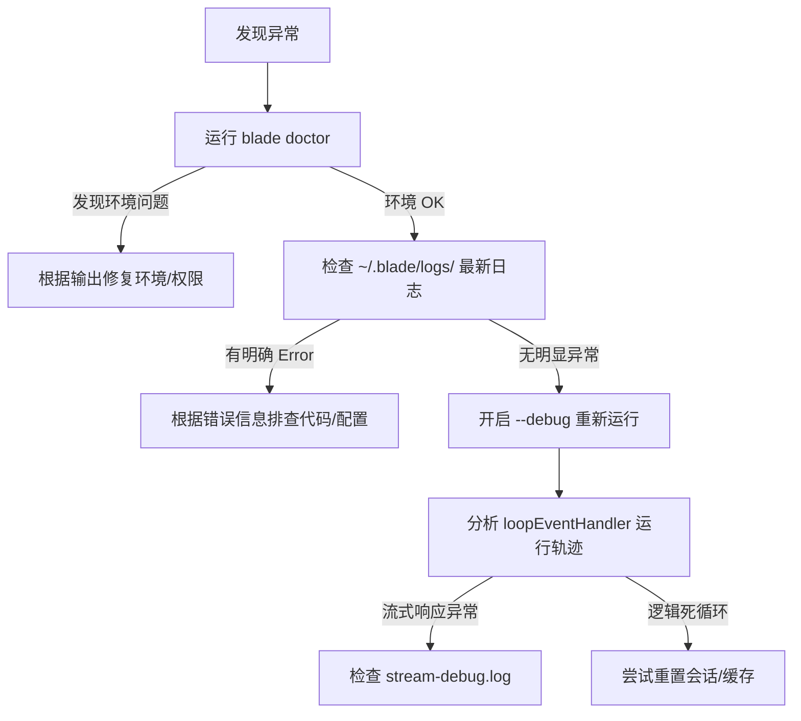

# 故障排除手册

## 目录
1. [模块概览](#模块概览)
2. [Blade Doctor 详解](#blade-doctor-详解)
   - [诊断检查项清单](#诊断检查项清单)
   - [运行机制与逻辑](#运行机制与逻辑)
3. [日志系统架构](#日志系统架构)
   - [日志存储与分类](#日志存储与分类)
   - [日志级别调整](#日志级别调整)
   - [流式调试日志 (Stream Debug)](#流式调试日志-stream-debug)
4. [故障排查流程](#故障排查流程)
5. [常见错误码与异常解析](#常见错误码与异常解析)
   - [Agent 运行循环异常](#agent-运行循环异常)
   - [会话与配置异常](#会话与配置异常)
6. [手动维护指令](#手动维护指令)
   - [缓存与数据库重置](#缓存与数据库重置)
   - [权限修复](#权限修复)
7. [核心组件](#核心组件)
8. [文件引用](#文件引用)

## 模块概览

故障排除手册旨在为开发者和高级用户提供深度的技术诊断工具与方法，帮助解决 Blade 在运行期间可能遇到的复杂错误。本模块主要涵盖了 `blade doctor` 诊断命令的实现逻辑、系统日志的存储与管理机制，以及针对常见运行期异常的解析。

通过本手册，用户可以：
- 理解 `blade doctor` 如何验证系统环境的健康状况。
- 掌握日志系统的配置与解读方法，以便进行深度调试。
- 学习如何处理常见的工具执行超时、上下文溢出等异常。
- 掌握手动清理缓存和重置配置的指令。

**模块统计数据**：
- **涉及文件数**：约 15 个核心文件
- **核心子模块**：诊断命令 (`commands/doctor.ts`)、日志服务 (`logging/Logger.ts`)、配置服务 (`config/ConfigService.ts`)、会话服务 (`services/SessionService.ts`)。

## Blade Doctor 详解

`blade doctor` 是 Blade 提供的健康检查工具，用于快速定位环境配置问题。它通过一系列预定义的检查项，验证当前系统是否满足运行 Blade 的必要条件。

### 诊断检查项清单

`blade doctor` 执行时会依次检查以下维度：

1.  **配置文件合法性**：验证 `~/.blade/config.json` 是否存在且格式正确，能否成功初始化 `ConfigManager`。
2.  **Node.js 版本**：检查当前运行环境的 Node.js 版本。Blade 推荐使用 v18 或更高版本。
3.  **文件系统权限**：验证当前工作目录（CWD）是否具有读写权限，这是保存会话和临时文件的基础。
4.  **必要依赖项**：检查核心依赖（如 `ink` 等）是否已正确安装并可被加载。

### 运行机制与逻辑

诊断逻辑实现在 `packages/cli/src/commands/doctor.ts` 中。它采用串行执行模式，记录每个检查项的状态（OK、WARN 或 FAIL）。

以下流程图展示了 `blade doctor` 的执行逻辑：



在执行过程中，`doctor` 命令会捕获每个阶段的异常，并输出具体的错误信息。如果发现致命错误（FAIL），命令最终会以非零状态码退出，提示用户需要修复问题。

**Section sources**:
- [doctor.ts](file:///Users/bytedance/Documents/GitHub/Blade/packages/cli/src/commands/doctor.ts)

## 日志系统架构

Blade 的日志系统采用了双路输出架构：一方面将详细的 JSONL 格式日志写入用户主目录下的持久化文件，另一方面在调试模式下将过滤后的日志实时输出到终端。

### 日志存储与分类

日志文件默认存储在 `~/.blade/logs/` 目录下。文件名格式为 `blade-{sessionId}.jsonl`。

日志系统定义了多个分类（`LogCategory`），包括：
- `AGENT`: Agent 决策与思考过程
- `UI`: 界面渲染与事件处理
- `TOOL`: 工具调用与结果返回
- `SERVICE`: 后台服务运行状态
- `CONFIG`: 配置加载与持久化

### 日志级别调整

用户可以通过设置环境变量或配置项来调整日志输出。Blade 支持四种标准日志级别：`DEBUG`, `INFO`, `WARN`, `ERROR`。

在 CLI 中，可以通过 `--debug` 参数开启调试日志：
- `blade --debug`: 开启所有分类的 DEBUG 日志。
- `blade --debug=UI,Agent`: 仅开启 UI 和 Agent 分类的调试日志。
- `blade --debug=!Tool`: 开启除 Tool 以外的所有分类日志。

### 流式调试日志 (Stream Debug)

为了专门解决 LLM 流式响应（Streaming）过程中的丢字、卡顿或格式错误，Blade 提供了一个独立的 `StreamDebugLogger`。它会将所有流式事件及其原始 Delta 数据记录到 `~/.blade/logs/stream-debug.log` 中。



这种分离的设计确保了在处理高频流式数据时，主日志系统不会因为处理过大的字符串而产生性能瓶颈，同时也为开发者提供了最原始的数据轨迹进行比对。

**Section sources**:
- [Logger.ts](file:///Users/bytedance/Documents/GitHub/Blade/packages/cli/src/logging/Logger.ts)
- [StreamDebugLogger.ts](file:///Users/bytedance/Documents/GitHub/Blade/packages/cli/src/logging/StreamDebugLogger.ts)

## 故障排查流程

当遇到 Blade 无法正常工作或行为异常时，建议遵循以下故障排查流程：



在分析 `loopEventHandler` 的轨迹时，重点关注 `turn_start`、`content_delta` 和 `stream_end` 事件的顺序。如果 `stream_end` 提前触发或在 `signal.aborted` 后仍有数据写入，通常意味着编排层或模型降级逻辑存在同步问题。

## 常见错误码与异常解析

### Agent 运行循环异常

在 `loopEventHandler.ts` 中，系统会处理多种运行期事件。常见的异常情况包括：

- **上下文溢出 (Context Overflow)**：表现为模型返回错误或 `model_fallback` 事件触发。这通常是因为当前会话积累的消息过多，超过了模型的 `maxContextTokens`。
- **工具执行超时**：如果工具调用长时间未返回 `tool_result`，可能会触发全局的超时保护。
- **权限拒绝 (Permission Denied)**：当 Agent 尝试执行敏感操作（如写入受保护目录）且用户未授权时，会抛出此类异常。

### 会话与配置异常

- **未找到会话 (ENOENT)**：在尝试 `--resume` 恢复会话时，如果对应的 JSONL 文件被手动删除或路径不正确，会触发 `isMissingSessionError`。
- **配置文件损坏**：如果 `config.json` 包含非法 JSON 字符，`ConfigManager` 初始化将失败。

**Section sources**:
- [loopEventHandler.ts](file:///Users/bytedance/Documents/GitHub/Blade/packages/cli/src/ui/utils/loopEventHandler.ts)
- [sessionContext.ts](file:///Users/bytedance/Documents/GitHub/Blade/packages/cli/src/commands/shared/sessionContext.ts)

## 手动维护指令

在某些极端情况下，自动诊断工具可能无法完全修复问题，需要用户进行手动干预。

### 缓存与数据库重置

Blade 的持久化数据主要存储在 `~/.blade/` 目录下。

- **清理所有会话历史**：
  ```bash
  rm -rf ~/.blade/projects/*
  ```
- **重置全局配置**：
  ```bash
  rm ~/.blade/config.json
  ```
- **清理日志文件**：
  ```bash
  rm ~/.blade/logs/*.jsonl
  ```

### 权限修复

如果日志提示 `~/.blade/logs 目录属于 root 用户`，说明曾误用 `sudo` 运行过 Blade。请执行以下命令修复权限：

```bash
sudo chown -R $USER:$USER ~/.blade/
```

> ⚠️ **警告**：不要使用 `sudo` 运行 Blade，这会导致新创建的文件权限异常，影响后续正常运行。

## 核心组件

| 组件名称 | 职责描述 | 关键方法 |
| :--- | :--- | :--- |
| `doctorCommands` | 实现 `blade doctor` 命令的诊断逻辑 | `handler()` |
| `Logger` | 统一日志服务，支持分类过滤和文件持久化 | `debug()`, `info()`, `error()` |
| `ConfigService` | 负责配置文件的原子写入与防抖持久化 | `save()`, `atomicWrite()` |
| `SessionService` | 处理会话的加载、列表展示与删除 | `loadSession()`, `listSessions()` |
| `GracefulShutdownManager` | 负责全局崩溃捕获、信号处理与资源清理 | `shutdown()`, `registerCleanup()` |

## 文件引用

以下是本模块涉及的核心文件：
- [packages/cli/src/commands/doctor.ts](file:///Users/bytedance/Documents/GitHub/Blade/packages/cli/src/commands/doctor.ts) - 诊断命令实现
- [packages/cli/src/logging/Logger.ts](file:///Users/bytedance/Documents/GitHub/Blade/packages/cli/src/logging/Logger.ts) - 日志服务核心
- [packages/cli/src/logging/StreamDebugLogger.ts](file:///Users/bytedance/Documents/GitHub/Blade/packages/cli/src/logging/StreamDebugLogger.ts) - 流式调试日志
- [packages/cli/src/config/ConfigService.ts](file:///Users/bytedance/Documents/GitHub/Blade/packages/cli/src/config/ConfigService.ts) - 配置持久化服务
- [packages/cli/src/services/SessionService.ts](file:///Users/bytedance/Documents/GitHub/Blade/packages/cli/src/services/SessionService.ts) - 会话管理服务
- [packages/cli/src/ui/utils/loopEventHandler.ts](file:///Users/bytedance/Documents/GitHub/Blade/packages/cli/src/ui/utils/loopEventHandler.ts) - 运行循环事件处理
- [packages/cli/src/services/GracefulShutdown.ts](file:///Users/bytedance/Documents/GitHub/Blade/packages/cli/src/services/GracefulShutdown.ts) - 优雅退出管理
- [packages/cli/src/commands/shared/sessionContext.ts](file:///Users/bytedance/Documents/GitHub/Blade/packages/cli/src/commands/shared/sessionContext.ts) - 会话上下文解析
