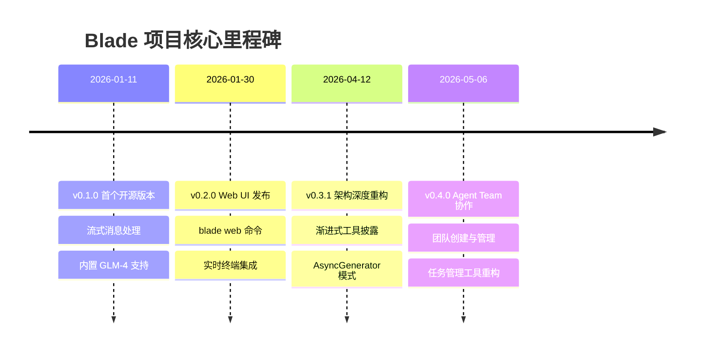
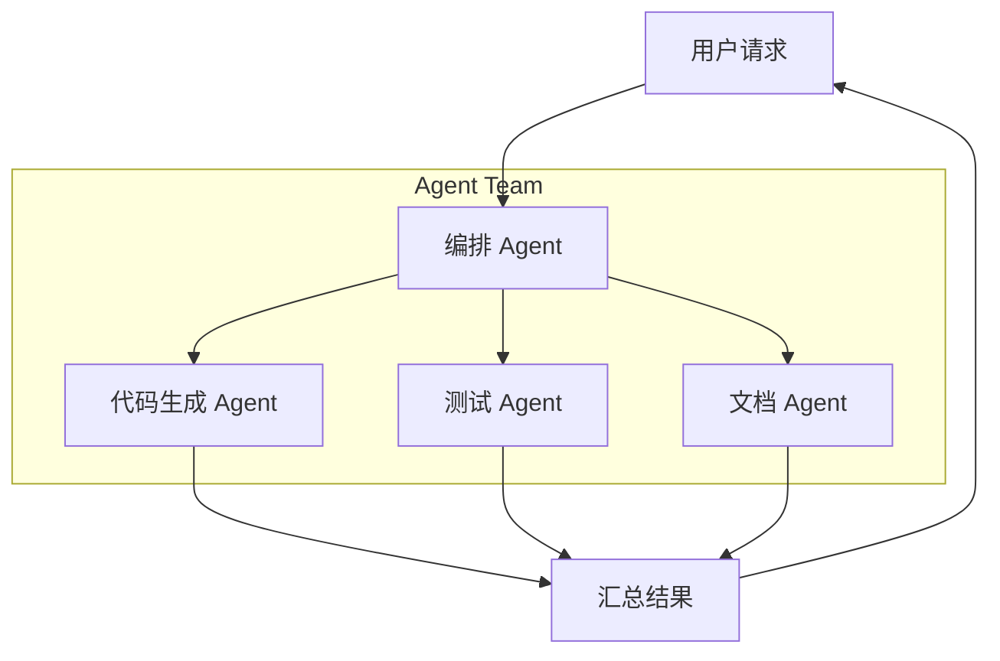
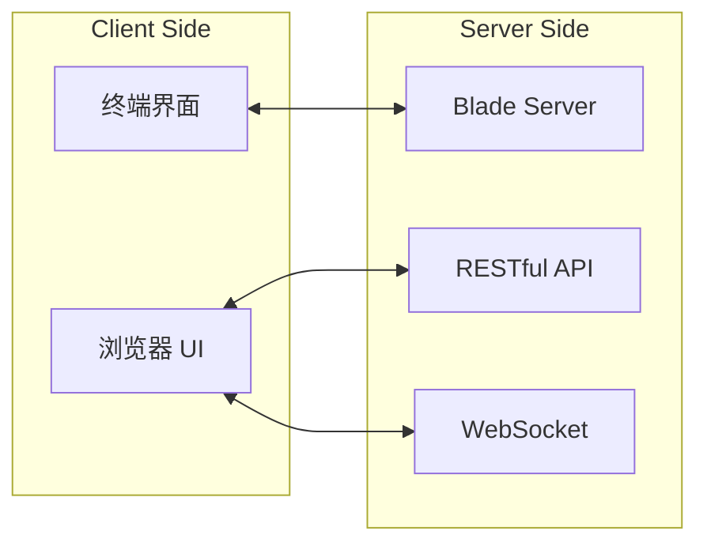

# 更新日志

## 目录
1. [模块概览](#模块概览)
2. [核心里程碑与演进](#核心里程碑与演进)
3. [变更分类标准](#变更分类标准)
4. [重大版本特性深度解析](#重大版本特性深度解析)
   - [v0.4.x：团队协作与智能化增强](#v04x团队协作与智能化增强)
   - [v0.3.x：架构重构与性能飞跃](#v03x架构重构与性能飞跃)
   - [v0.2.x：Web UI 与多模态支持](#v02xweb-ui-与多模态支持)
   - [v0.1.x：开源基石与工具集成](#v01x开源基石与工具集成)
5. [迁移与升级指南](#迁移与升级指南)
6. [文件参考](#文件参考)

## 模块概览

更新日志（Changelog）是 Blade 项目迭代过程的透明化记录，旨在为开发者和用户提供清晰的功能演进、问题修复及架构变动视图。通过记录每一个版本的变化，项目组确保了开发节奏的可追溯性，并为用户提供了平滑升级的参考依据。

本模块主要基于 `docs/changelog.md` 文件，涵盖了从项目萌芽阶段（v0.0.1）到当前稳定迭代阶段（v0.4.x）的所有关键变动。Blade 的演进路径展示了从一个简单的命令行工具到一个支持 Web UI、多代理协作、多模态输入及复杂任务管理的综合性 AI 开发助手的发展历程。

**模块数据统计**：
- **涉及文件总数**：1 个核心日志文件 (`docs/changelog.md`)。
- **覆盖版本范围**：v0.0.2 至 v0.4.1。
- **关键演进阶段**：
  - **初期探索 (v0.0.x)**：核心 Agent 循环与基础工具链。
  - **开源奠基 (v0.1.x)**：首个开源版本，引入 MCP 支持。
  - **全能扩展 (v0.2.x)**：Web UI 发布，开启图形化交互时代。
  - **深度重构 (v0.3.x)**：事件协议统一，性能大幅优化。
  - **团队协作 (v0.4.x)**：引入 Agent Team 模式，迈向群体智能。

## 核心里程碑与演进

Blade 的发展历程可以概括为四个主要阶段，每个阶段都引入了重新定义产品形态的核心特性。

下面的时间线图展示了 Blade 项目从首个开源版本到当前最新版本的核心里程碑：

**图表解析**：
该时间线突出了 Blade 在 2026 年上半年的爆发式增长。从 1 月份的开源起步，仅仅 20 天后就推出了完整的 Web UI 支持，这标志着项目从纯 CLI 工具向全平台助手的转变。4 月份的 v0.3.1 版本是技术架构的转折点，引入了更为先进的异步处理模式。而 5 月份的 v0.4.0 则代表了功能层面的跃迁，将单体 Agent 扩展为可协作的 Agent 团队。

**核心里程碑说明**：
- **v0.1.0 (2026-01-11)**：标志着 Blade 正式进入开源社区。该版本确立了流式响应和增量解析的基础，并提供了对国产模型（如 GLM）的友好支持。
- **v0.2.0 (2026-01-30)**：这是项目历史上最重要的更新之一。Web UI 的引入极大地降低了使用门槛，使得非终端爱好者也能高效利用 Blade 的能力。
- **v0.3.1 (2026-04-12)**：虽然版本号看似是小版本，但其内部变动巨大。它统一了事件流协议，引入了模型降级处理和 token 预算管理，极大地提升了系统的稳定性。
- **v0.4.0 (2026-05-06)**：开启了“群体智能”新篇章，支持创建和管理 Agent 团队，让复杂的开发任务可以由多个专业 Agent 协同完成。

## 变更分类标准

为了方便用户快速筛选感兴趣的内容，Blade 的更新日志采用了标准化的分类标签。

| 分类标签 | 描述 | 示例内容 |
| :--- | :--- | :--- |
| ✨ **新功能** | 引入全新的功能特性或工具支持。 | 新增多模态图像输入、Agent Team 协作。 |
| 🐛 **问题修复** | 修复已知的 Bug、异常或显示问题。 | 修复 token 计数错误、解决内存泄漏。 |
| ♻️ **代码重构** | 内部架构调整，不改变外部行为。 | 统一事件处理逻辑、重构权限决策流程。 |
| ⚡ **性能优化** | 提升系统响应速度或资源利用率。 | 终端交互层性能优化、消息流缓冲机制。 |
| 📝 **文档更新** | 改进 README、开发指南或 API 文档。 | 添加 Auto Memory 文档、更新配置指南。 |
| ✅ **测试相关** | 增加单元测试、集成测试或基准测试。 | 添加 58 个单元测试、新增基准测试工具。 |
| 💄 **代码格式** | 调整代码风格、表情符号或文本标记。 | 替换箭头为文本标记、修复缩进。 |
| 🔧 **其他更改** | 依赖升级、发布脚本或配置调整。 | 迁移包管理器至 Bun、升级依赖库。 |

**Section sources**:
- [changelog.md](file:///Users/bytedance/Documents/GitHub/Blade/docs/changelog.md)

## 重大版本特性深度解析

### v0.4.x：团队协作与智能化增强

v0.4.0 系列版本将 Blade 的能力边界从“个人助手”扩展到了“团队协作”。核心引入了 **Agent Team** 概念，允许用户在一次会话中调度多个具有不同专长的子代理。

**图表解析**：
该流程展示了 Agent Team 的工作模式。用户的一个复杂请求（如“实现一个功能并编写测试和文档”）不再由单一 Agent 勉强完成，而是由编排者（Orchestrator）拆解任务并分发给专门的子代理。这种模式显著提高了任务完成的质量和成功率。

**关键改进**：
- **团队管理工具**：新增 `TeamCreate`, `TeamStatus` 和 `TeamDelete` 工具，支持动态构建协作环境。
- **任务管理重构**：将旧的 `TodoWrite` 替换为功能更全的 `TaskCreate`/`TaskGet`/`TaskUpdate`/`TaskList` 系统，支持更精细的任务状态跟踪。
- **配置向导优化**：重构了首次使用的配置流程，提供更直观的用户引导。

### v0.3.x：架构重构与性能飞跃

v0.3.x 阶段是 Blade 夯实基础的关键。在这个阶段，项目组对底层的异步处理和事件流进行了彻底重构。

**核心技术变动**：
- **AsyncGenerator 模式**：将 Agent 循环重构为异步生成器模式，使得消息处理更加平滑，支持更复杂的流式交互。
- **统一事件协议**：通过 `chatStream()` 统一了所有消费者的事件入口，解决了之前多源消息导致的同步问题。
- **智能降级与恢复**：引入了模型降级处理逻辑（当高级模型不可用时自动切换）和输出恢复功能，极大增强了在不稳定网络或 API 环境下的鲁棒性。

### v0.2.x：Web UI 与多模态支持

v0.2.0 版本的发布标志着 Blade 拥有了完整的图形化界面。

**图表解析**：
v0.2.0 引入了 Server-Client 架构。`blade serve` 命令启动后台服务，通过 RESTful API 管理会话和配置，通过 WebSocket 实现实时消息推送和终端模拟。这使得 Blade 可以部署在远程服务器上，而用户通过本地浏览器即可访问。

**主要特性**：
- **Web 界面**：支持多语言切换、主题配置、会话管理。
- **多模态输入**：支持直接粘贴或上传图片，利用多模态模型进行视觉辅助开发。
- **Auto Memory 系统**：Agent 开始具备跨会话的“记忆”能力，能够记住项目的构建命令和特定代码模式。

### v0.1.x：开源基石与工具集成

作为首个开源阶段，v0.1.x 确立了 Blade 的核心工具箱。

**重要里程碑**：
- **MCP 集成**：支持 Model Context Protocol，允许通过 Exa 等工具进行网页搜索。
- **类型安全元数据**：重构了工具结果的元数据系统，确保了在复杂任务中数据传递的准确性。
- **多提供商支持**：原生支持 Anthropic, Google Gemini 和 Azure OpenAI，打破了对单一厂商的依赖。

## 迁移与升级指南

随着版本的快速更迭，部分版本涉及破坏性变更或显著的架构调整。以下是关键版本的升级建议：

### 从 v0.1.x 升级到 v0.2.0
- **操作变更**：引入了 `blade web` 命令。建议用户尝试使用 Web UI 以获得更佳的差异对比（Diff）体验。
- **架构调整**：如果你之前有自定义的集成，请注意事件处理机制已从事件总线迁移到统一的会话管理逻辑。

### 从 v0.2.x 升级到 v0.3.0+
- **性能提升**：升级后，你会感受到终端渲染和消息流处理更加流畅。
- **依赖管理**：Blade 推荐使用 **Bun** 作为包管理器。如果你仍在使用 npm 或 pnpm，可能会在某些高性能场景下遇到差异。建议运行 `npm install -g blade-code` 进行全局更新。

### 从 v0.3.x 升级到 v0.4.0
- **工具链更新**：请注意 `TodoWrite` 工具已被弃用。如果你在自定义脚本或 Prompt 中引用了该工具，请更新为新的 `Task` 系列工具。
- **新特性尝试**：强烈建议尝试 `Agent Team` 功能，特别是在处理涉及多个文件或需要跨领域知识的复杂任务时。

> 💡 **提示**：每次发布新版本时，Blade 都会自动检测并在终端显示更新提示。你可以通过 `blade --version` 查看当前安装的版本。

## 文件参考

以下是本章节涉及的核心源文件：

- [changelog.md](file:///Users/bytedance/Documents/GitHub/Blade/docs/changelog.md)：记录项目所有变更的权威来源。
- [README.md](file:///Users/bytedance/Documents/GitHub/Blade/docs/README.md)：包含项目概览和快速开始指南。
- [installation.md](file:///Users/bytedance/Documents/GitHub/Blade/docs/getting-started/installation.md)：详细的安装和升级步骤。

**Section sources**:
- [changelog.md](file:///Users/bytedance/Documents/GitHub/Blade/docs/changelog.md)
- [README.md](file:///Users/bytedance/Documents/GitHub/Blade/docs/README.md)
