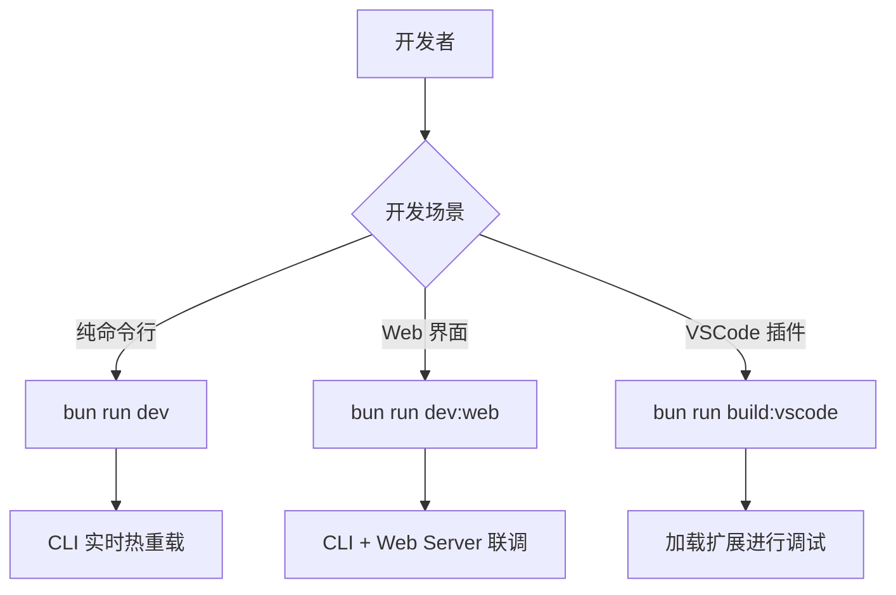
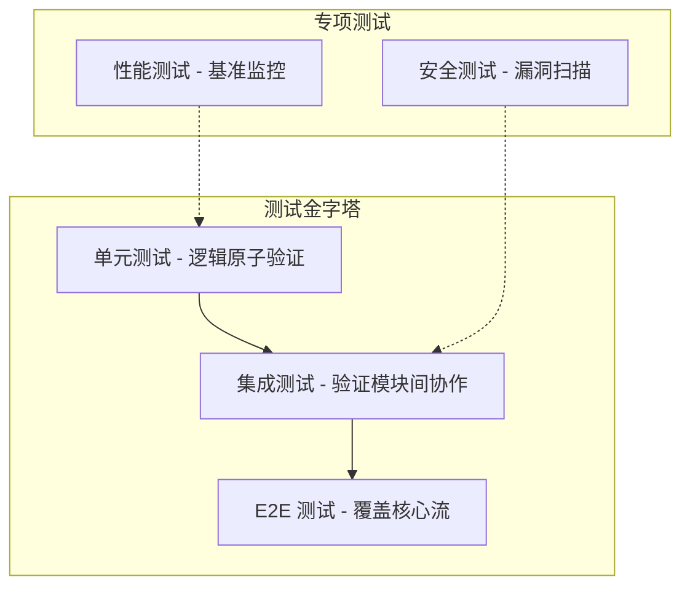
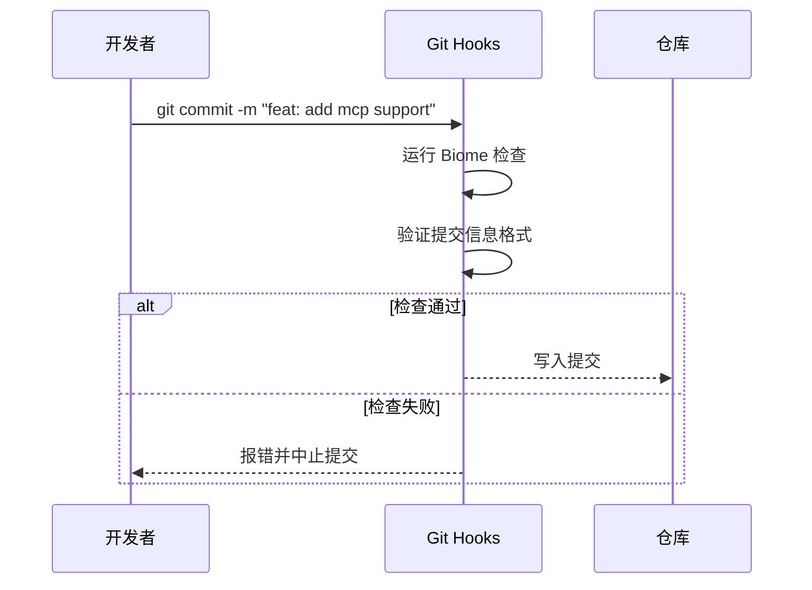
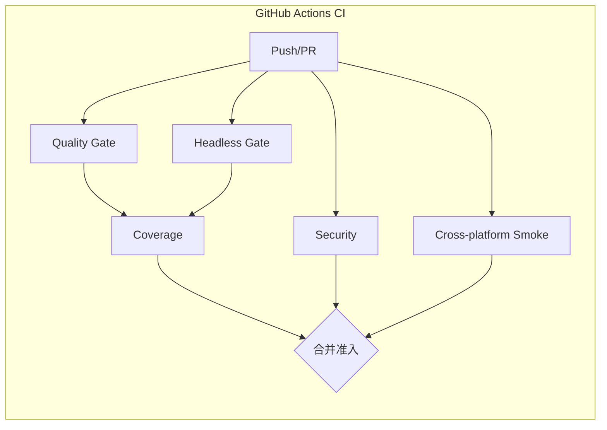
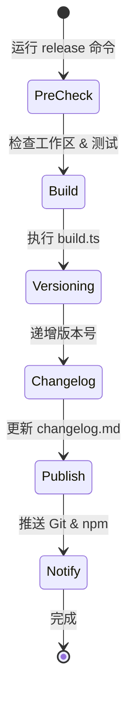

# 开发、测试与贡献指南说明

## 目录

1. [模块概览](#模块概览)
2. [开发环境搭建](#开发环境搭建)
   - [环境要求](#环境要求)
   - [初始化步骤](#初始化步骤)
   - [开发模式启动](#开发模式启动)
3. [测试框架与实践](#测试框架与实践)
   - [测试套件结构](#测试套件结构)
   - [运行测试命令](#运行测试命令)
   - [性能基准测试](#性能基准测试)
4. [代码风格与规范](#代码风格与规范)
   - [Biome 配置与检查](#biome-配置与检查)
   - [TypeScript 类型安全](#typescript-类型安全)
   - [提交准则](#提交准则)
5. [CI/CD 流水线](#cicd-流水线)
   - [工作流阶段解析](#工作流阶段解析)
   - [质量门禁要求](#质量门禁要求)
6. [发布与版本管理](#发布与版本管理)
   - [构建脚本深度解析](#构建脚本深度解析)
   - [发布配置与流程](#发布配置与流程)
7. [核心组件](#核心组件)
8. [文件引用](#文件引用)

## 模块概览

本章节详细介绍了 Blade 项目的开发、测试与贡献流程。作为一个基于 Bun 的高性能 AI 辅助编程工具，Blade 采用了 Monorepo 架构，并建立了一套严密的质量保证体系。

**项目规模统计**：
- **核心文件总数**：约 200+ TypeScript/JavaScript 文件（不含 node_modules）。
- **主要子模块**：
  - `packages/cli`：核心命令行工具，包含 Agent 逻辑、MCP 协议实现及终端 UI。
  - `packages/cli/web`：基于 Vite 的 Web 界面。
  - `packages/vscode`：VSCode 扩展插件。
  - `docs`：基于 Docsify 的用户文档系统。

本指南将深入探讨 `packages/cli` 的开发细节，涵盖从本地环境配置到 CI/CD 自动化的全过程，旨在帮助开发者快速上手并提交高质量的代码。

## 开发环境搭建

在参与 Blade 的开发之前，确保你的本地机器满足基本的技术栈要求。Blade 深度依赖 Bun 运行时，以获得极速的构建和执行体验。

### 环境要求

- **Bun**：版本 >= 1.3.11（推荐使用最新稳定版）。
- **Node.js**：版本 >= 20.x（用于某些特定构建工具和兼容性）。
- **Git**：用于版本控制和提交。
- **操作系统**：支持 macOS、Linux 和 Windows (WSL2)。

### 初始化步骤

首先，Fork 并克隆 Blade 仓库，然后使用 Bun 安装依赖。

```bash
# 克隆仓库
git clone https://github.com/your-username/Blade.git
cd Blade

# 安装 Monorepo 依赖
bun install
```

Blade 的配置文件通常位于用户主目录下的 `.blade` 文件夹中。在开发模式下，你可能需要手动创建并配置它。

```bash
mkdir -p ~/.blade
# 编辑 config.json，填入你的 LLM API Key 等信息
```

### 开发模式启动

Blade 提供了多种开发启动模式，以适应不同的调试场景。



**开发流程说明**：
- `bun run dev`：这是最常用的模式，它会启动 `packages/cli` 的开发版本，并监视文件更改。
- `bun run dev:web`：同时启动后端服务器（Hono）和前端 Vite 开发服务器，适用于 UI 开发。
- `bun run build`：执行全量构建，验证代码是否可以正确打包。

**Section sources**:
- [CONTRIBUTING.md](file:///Users/bytedance/Documents/GitHub/Blade/CONTRIBUTING.md)
- [package.json](file:///Users/bytedance/Documents/GitHub/Blade/package.json)

## 测试框架与实践

Blade 拥有一个庞大且严密的测试套件，确保在快速迭代中保持系统的稳定性。测试框架基于 Bun 原生测试运行器，具有极高的执行效率。

### 测试套件结构

测试文件统一存放在 `packages/cli/tests/` 目录下，按类型进行严格划分：

1.  **单元测试 (Unit Tests)**：针对单个函数或类，位于 `tests/unit/`。
2.  **集成测试 (Integration Tests)**：验证多个模块间的协同工作，位于 `tests/integration/`。
3.  **端到端测试 (E2E Tests)**：模拟真实用户操作流程，位于 `tests/e2e/`。
4.  **安全测试 (Security Tests)**：专门检查路径遍历、代码注入等风险，位于 `tests/security/`。
5.  **性能基准 (Performance/Benchmarks)**：监控启动时间、Token 计数效率等指标。



### 运行测试命令

开发者可以通过以下命令运行不同范围的测试：

- `bun run test:all`：运行所有测试（耗时较长）。
- `bun run test:unit`：仅运行单元测试。
- `bun run test:integration`：运行集成测试。
- `bun run test:coverage`：生成测试覆盖率报告。

### 性能基准测试

Blade 非常关注性能，特别是启动时间和 Token 处理速度。`packages/cli/scripts/run-real-repo-benchmark.ts` 脚本用于在真实代码库上运行性能测试，以检测是否存在性能退化。

**Section sources**:
- [packages/cli/tests/](file:///Users/bytedance/Documents/GitHub/Blade/packages/cli/tests)
- [packages/cli/scripts/run-real-repo-benchmark.ts](file:///Users/bytedance/Documents/GitHub/Blade/packages/cli/scripts/run-real-repo-benchmark.ts)

## 代码风格与规范

为了保持代码库的一致性，Blade 使用 **Biome** 作为统一的格式化和 Linting 工具。

### Biome 配置与检查

`biome.json` 定义了严格的代码规范，包括缩进（2 空格）、引号（单引号）以及众多的 Linter 规则。

> **Tip**: 提交代码前，请务必运行 `bun run check:fix` 自动修复格式和简单的 Lint 问题。

### TypeScript 类型安全

Blade 开启了严格的 TypeScript 检查。任何 `any` 类型的使用都应有充分的理由，并尽可能被具体的类型定义所取代。

### 提交准则

我们遵循 Conventional Commits 规范，这有助于自动生成高质量的 Changelog。



**常用提交类型**：
- `feat`: 新功能
- `fix`: 修复 Bug
- `docs`: 文档变更
- `style`: 代码格式（不影响逻辑）
- `refactor`: 重构（既不修复 Bug 也不添加功能）
- `test`: 添加或修改测试

**Section sources**:
- [biome.json](file:///Users/bytedance/Documents/GitHub/Blade/biome.json)
- [CONTRIBUTING.md](file:///Users/bytedance/Documents/GitHub/Blade/CONTRIBUTING.md)

## CI/CD 流水线

Blade 使用 GitHub Actions 构建了自动化的流水线，确保每一个 Pull Request 都经过了严格的质量把关。

### 工作流阶段解析

`.github/workflows/ci.yml` 定义了以下关键作业：

1.  **Quality Gate**：运行类型检查 (`type-check`) 和 Web 端的 Lint。
2.  **Headless Core Gate**：专门运行无头模式下的核心回归测试。
3.  **Test Coverage**：收集覆盖率并上传至 Codecov。
4.  **Security Tests**：运行安全专项测试。
5.  **Cross-platform Smoke**：在 Linux、Windows 和 macOS 上运行冒烟测试，确保跨平台兼容性。



### 质量门禁要求

一个 PR 若要被合并，必须满足：
- 所有 CI 状态检查为绿色。
- 测试覆盖率没有显著下降。
- 至少通过一名核心维护者的代码审查。

**Section sources**:
- [.github/workflows/ci.yml](file:///Users/bytedance/Documents/GitHub/Blade/.github/workflows/ci.yml)

## 发布与版本管理

Blade 的发布过程高度自动化，通过脚本和配置文件精确控制版本更迭。

### 构建脚本深度解析

`packages/cli/scripts/build.ts` 是核心构建脚本。它执行以下操作：
1.  **后端构建**：使用 `Bun.build` 将 `src/blade.tsx` 及其依赖打包到 `dist` 目录。它会自动识别 `package.json` 中的外部依赖，避免将大型库打包进二进制文件。
2.  **前端构建**：如果存在 Web 源码，则调用 Vite 进行生产环境构建。

```typescript
// packages/cli/scripts/build.ts 核心逻辑片段
const result = await Bun.build({
  entrypoints: ["src/blade.tsx"],
  outdir: "dist",
  target: "node",
  format: "esm",
  splitting: true,
  minify: true,
  external: externals // 排除 node_modules 中的依赖
});
```

### 发布配置与流程

`packages/cli/release.config.js` 控制着发布逻辑。它支持：
- **自动版本递增**：根据提交记录决定是 patch、minor 还是 major。
- **Changelog 生成**：更新根目录 `CHANGELOG.md`（唯一权威源；文档站点的 `docs/changelog.md` 由 Deploy Docs workflow 自动同步生成）。
- **多渠道发布**：同步发布到 npm 和 GitHub Tags。
- **通知系统**：发布成功后通过 Discord Webhook 发送通知。



**Section sources**:
- [packages/cli/scripts/build.ts](file:///Users/bytedance/Documents/GitHub/Blade/packages/cli/scripts/build.ts)
- [packages/cli/release.config.js](file:///Users/bytedance/Documents/GitHub/Blade/packages/cli/release.config.js)

## 核心组件

在参与开发时，以下组件是开发者最常接触的核心逻辑：

- **`BladeAgent`**：Agent 的核心大脑，负责决策和工具调用。
- **`ExecutionEngine`**：执行引擎，驱动循环迭代。
- **`ConfigManager`**：管理用户配置和权限验证。
- **`McpClient` / `McpRegistry`**：处理 Model Context Protocol 的连接与注册。
- **`ToolRegistry`**：所有内置和自定义工具的注册中心。

这些组件的实现细节可以在 `packages/cli/src/` 的对应目录下找到。

## 文件引用

以下是参与开发、测试和贡献时需要参考的关键文件：

- **核心规范与指南**：
  - [CONTRIBUTING.md](file:///Users/bytedance/Documents/GitHub/Blade/CONTRIBUTING.md) - 贡献者总纲
  - [biome.json](file:///Users/bytedance/Documents/GitHub/Blade/biome.json) - 代码风格定义
  - [package.json](file:///Users/bytedance/Documents/GitHub/Blade/package.json) - 项目脚本定义

- **构建与发布脚本**：
  - [packages/cli/scripts/build.ts](file:///Users/bytedance/Documents/GitHub/Blade/packages/cli/scripts/build.ts) - 构建逻辑
  - [packages/cli/release.config.js](file:///Users/bytedance/Documents/GitHub/Blade/packages/cli/release.config.js) - 发布配置

- **测试基础设施**：
  - [packages/cli/tests/support/setup.ts](file:///Users/bytedance/Documents/GitHub/Blade/packages/cli/tests/support/setup.ts) - 测试环境初始化
  - [packages/cli/tests/performance/benchmarks/](file:///Users/bytedance/Documents/GitHub/Blade/packages/cli/tests/performance/benchmarks/) - 基准测试目录

- **CI/CD 配置**：
  - [.github/workflows/ci.yml](file:///Users/bytedance/Documents/GitHub/Blade/.github/workflows/ci.yml) - 持续集成工作流
