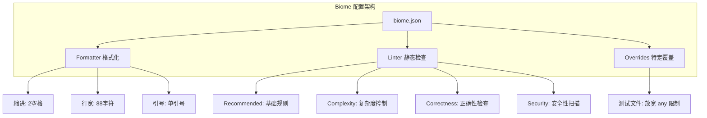
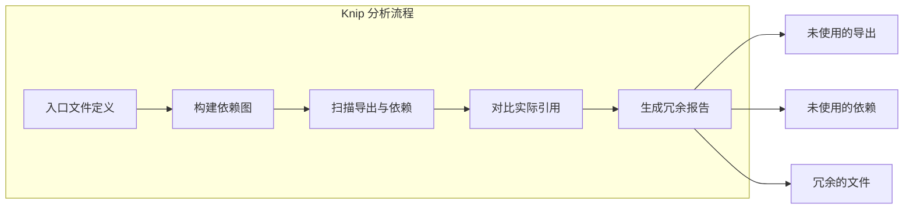
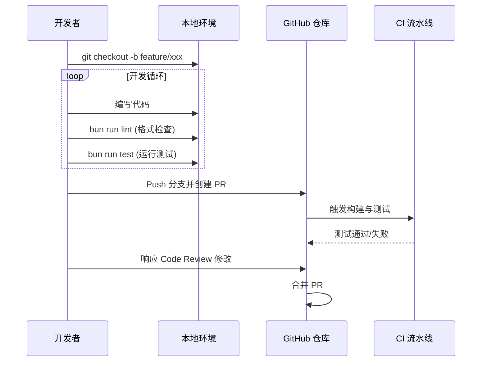
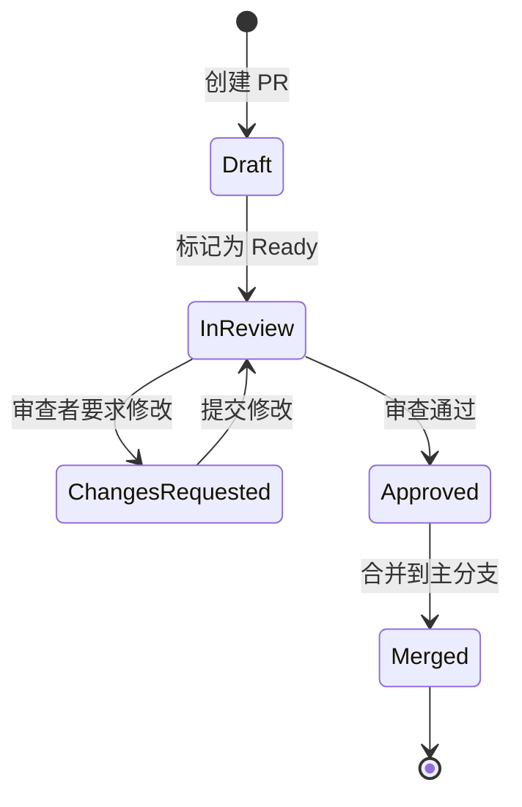

# 代码风格、规范与贡献流程

## 目录
1. [引言](#引言)
2. [模块概览](#模块概览)
3. [代码风格与 Linting (Biome)](#代码风格与-linting-biome)
   - [为什么选择 Biome](#为什么选择-biome)
   - [核心配置解析](#核心配置解析)
   - [常用命令](#常用命令)
4. [静态分析与依赖检查 (Knip)](#静态分析与依赖检查-knip)
5. [TypeScript 规范与类型安全](#typescript-规范与类型安全)
6. [提交规范 (Conventional Commits)](#提交规范-conventional-commits)
7. [贡献流程详解](#贡献流程详解)
   - [开发环境准备](#开发环境准备)
   - [开发与测试循环](#开发与测试循环)
8. [Pull Request 与代码审查准则](#pull-request-与代码审查准则)
   - [PR 提交清单](#pr-提交清单)
   - [代码审查关注点](#代码审查关注点)
9. [核心规范文件参考](#核心规范文件参考)

## 引言

在 Blade 项目中，我们致力于构建一个高质量、高性能且易于维护的 AI 编程助手。为了实现这一目标，统一的代码风格、严格的质量标准和规范的贡献流程至关重要。

本指南定义了 Blade 项目的技术规范要求，旨在：
- **提升协作效率**：通过统一的格式化和 Lint 规则，减少代码审查中关于风格的争论。
- **保障代码质量**：利用静态分析工具（Biome, Knip）和严格的 TypeScript 配置，在编译阶段捕获潜在错误。
- **规范提交行为**：遵循 Conventional Commits 规范，确保版本历史清晰可追溯，并支持自动化发布。
- **简化参与门槛**：为新贡献者提供清晰的步骤，从环境搭建到 PR 提交都有据可依。

无论是核心维护者还是社区贡献者，都应严格遵守这些规范，共同维护 Blade 的代码生态。

## 模块概览

Blade 采用 Monorepo 架构，其规范体系涵盖了多个子包及全局配置文件。通过对根目录及核心包的扫描，我们确定了规范涉及的范围。

**项目规模评估**：
- **核心规范文件**：约 5 个核心配置文件位于根目录。
- **子模块覆盖**：包括 `packages/cli`（核心逻辑）、`packages/cli/web`（Web UI）以及 `packages/vscode`（扩展）。
- **文件总数**：整个仓库包含数百个 TypeScript/TSX 文件，所有文件均受统一规范约束。

下表列出了本次规范涉及的关键入口点：

| 文件/目录 | 说明 | 覆盖范围 |
| :--- | :--- | :--- |
| `biome.json` | 代码格式化与 Lint 配置 | 全局 TS/JS/CSS 文件 |
| `knip.json` | 未使用代码与依赖检测配置 | 全局工作区 |
| `CONTRIBUTING.md` | 贡献指南主文档 | 开发者工作流 |
| `.github/PULL_REQUEST_TEMPLATE.md` | PR 描述模板 | GitHub 协作流程 |
| `package.json` | 定义了质量检查相关的脚本命令 | 全局自动化任务 |

## 代码风格与 Linting (Biome)

Blade 使用 [Biome](https://biomejs.dev/) 作为统一的格式化（Formatter）和静态检查（Linter）工具。相比传统的 ESLint + Prettier 组合，Biome 提供了更快的执行速度和开箱即用的集成体验。

### 为什么选择 Biome

在 Blade 这样的大型 Monorepo 中，性能是首要考虑因素。Biome 使用 Rust 编写，其处理速度比 Prettier 快数倍，且能够在一个工具中同时完成格式化和 linting，减少了配置冲突的风险。

### 核心配置解析

我们在 `biome.json` 中定义了严格的规则集。以下是核心配置的逻辑结构：



**配置亮点说明**：
- **格式化标准**：使用 `space` 缩进（宽度 2），`lineWidth` 设置为 88 以平衡代码密度与可读性。JavaScript/TypeScript 强制使用单引号并始终保留分号。
- **Lint 规则集**：
    - `complexity`: 禁用无用的正则转义和布尔转换。
    - `correctness`: 严格禁止未使用变量（`noUnusedVariables`）、未声明变量以及不可达代码。
    - `suspicious`: 默认开启 `noExplicitAny` 警告，但在测试文件中通过 `overrides` 允许使用，以平衡开发灵活性。

### 常用命令

开发者可以通过以下命令在本地执行检查：

```bash
# 检查所有文件的代码风格和 Lint 错误
bun run lint

# 自动修复可修复的 Lint 错误和格式问题
bun run check:fix

# 仅执行格式化
bun run format
```

> **注意**：在提交 PR 之前，必须确保 `bun run lint` 通过，否则 CI 流程将报错。

**Section sources**:
- [biome.json](file:///Users/bytedance/Documents/GitHub/Blade/biome.json)
- [package.json](file:///Users/bytedance/Documents/GitHub/Blade/package.json)

## 静态分析与依赖检查 (Knip)

随着项目规模的扩大，未使用的导出、过期的依赖以及冗余的文件会逐渐积累。Blade 引入了 [Knip](https://knip.dev/) 来自动检测这些“死代码”。

我们在 `knip.json` 中为每个工作区配置了入口点：
- `packages/cli`: 入口为 `src/blade.tsx` 和 `src/acp/index.ts`。
- `packages/cli/web`: 入口为 `src/main.tsx`。

The following diagram shows how Knip analyzes the project structure to find unused entities.



通过定期运行 Knip，我们能够保持代码库的精简，避免包体积膨胀。

**Section sources**:
- [knip.json](file:///Users/bytedance/Documents/GitHub/Blade/knip.json)

## TypeScript 规范与类型安全

Blade 严格依赖 TypeScript 提供的类型安全性。我们要求所有新代码遵循以下准则：

1.  **开启严格模式**：所有子包的 `tsconfig.json` 必须开启 `strict: true`。
2.  **避免 `any`**：除非在极少数与底层系统交互或测试 Mock 的场景下，否则禁止使用 `any`。应优先使用 `unknown` 或定义具体的 `interface`/`type`。
3.  **显式返回类型**：对于导出的公共 API 和核心服务函数，建议显式标注返回类型，以提高代码可读性和 IDE 提示质量。
4.  **Zod 验证**：对于外部输入（如配置文件、API 响应），使用 `zod` 进行运行时类型校验，确保类型安全从边界开始。

## 提交规范 (Conventional Commits)

为了使 Git 历史具有可读性并支持自动化生成 Changelog，Blade 遵循 [Conventional Commits](https://www.conventionalcommits.org/) 规范。

**提交信息格式**：
`<type>(<scope>): <description>`

**常用类型说明**：
- `feat`: 新功能
- `fix`: 修复 Bug
- `docs`: 文档变更
- `style`: 代码格式调整（不影响逻辑）
- `refactor`: 代码重构
- `test`: 增加或修改测试
- `chore`: 构建过程或辅助工具的变动

**示例**：
- `feat(agent): 添加对多模态模型的支持`
- `fix(cli): 修复配置文件路径解析错误`
- `docs: 更新贡献指南中的 PR 流程`

## 贡献流程详解

我们鼓励社区参与，但为了保证主分支的稳定性，所有贡献必须遵循标准的工作流。

### 开发环境准备

1.  **Fork 仓库**：在 GitHub 上将 `echoVic/blade-code` fork 到个人账号。
2.  **安装 Bun**：Blade 使用 Bun 作为包管理器和运行时。
3.  **安装依赖**：运行 `bun install`。
4.  **初始化配置**：根据 `CONTRIBUTING.md` 的说明，在本地创建 `~/.blade/config.json`。

### 开发与测试循环

开发者在特性分支上进行开发，并应频繁运行本地检查。

The following sequence diagram illustrates the typical developer workflow from creating a branch to merging a PR.



在提交之前，建议运行 `bun run preflight`。这是一个复合命令，会自动执行清理、安装、格式化、Lint、构建、类型检查和所有测试，确保代码处于“可发布”状态。

**Section sources**:
- [CONTRIBUTING.md](file:///Users/bytedance/Documents/GitHub/Blade/CONTRIBUTING.md)
- [package.json](file:///Users/bytedance/Documents/GitHub/Blade/package.json)

## Pull Request 与代码审查准则

Pull Request (PR) 是代码进入主分支的唯一通道。

### PR 提交清单

提交 PR 时，系统会自动加载 `.github/PULL_REQUEST_TEMPLATE.md`。开发者必须填写以下内容：
- **变更描述**：简要说明 PR 的目的。
- **变更类型**：勾选是 Bug 修复、新功能还是重构等。
- **关联 Issue**：使用 `Closes #123` 自动关联并关闭相关问题。
- **测试证明**：说明如何验证了变更（如：本地测试通过、添加了新测试用例）。

### 代码审查关注点

审查者在进行 Code Review 时，将重点关注以下方面：

1.  **架构一致性**：变更是否符合项目的模块化设计原则？
2.  **类型严谨性**：是否存在不必要的 `any`？类型定义是否准确？
3.  **测试覆盖率**：新功能是否伴随有单元测试或集成测试？
4.  **性能影响**：是否存在潜在的性能瓶颈（如大文件的同步读取、不必要的循环）？
5.  **安全性**：是否引入了路径遍历、命令注入等安全风险？

The state diagram below shows the lifecycle of a Pull Request in the Blade project.



## 核心规范文件参考

以下是项目中定义这些规范的关键文件，建议开发者在开始贡献前仔细阅读：

- **[biome.json](file:///Users/bytedance/Documents/GitHub/Blade/biome.json)**: 详细的格式化和 Lint 规则。
- **[knip.json](file:///Users/bytedance/Documents/GitHub/Blade/knip.json)**: 静态分析配置。
- **[CONTRIBUTING.md](file:///Users/bytedance/Documents/GitHub/Blade/CONTRIBUTING.md)**: 完整的贡献指南和环境搭建步骤。
- **[.github/PULL_REQUEST_TEMPLATE.md](file:///Users/bytedance/Documents/GitHub/Blade/.github/PULL_REQUEST_TEMPLATE.md)**: PR 提交时需填写的模板。
- **[package.json](file:///Users/bytedance/Documents/GitHub/Blade/package.json)**: 包含 `lint`, `format`, `check`, `type-check`, `preflight` 等质量控制脚本。

**Diagram sources**:
- [CONTRIBUTING.md:L48-L72](file:///Users/bytedance/Documents/GitHub/Blade/CONTRIBUTING.md#L48-L72)
- [.github/PULL_REQUEST_TEMPLATE.md:L39-L48](file:///Users/bytedance/Documents/GitHub/Blade/.github/PULL_REQUEST_TEMPLATE.md#L39-L48)
