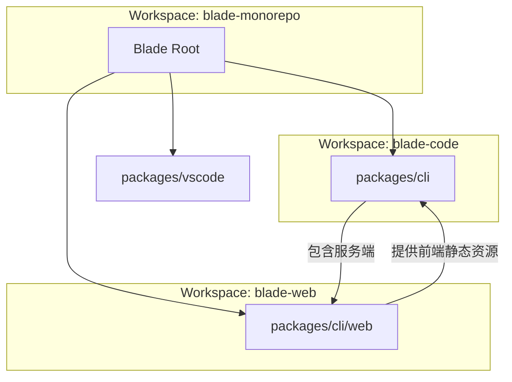

## 目录
1. [模块概览](#模块概览)
2. [环境依赖与安装](#环境依赖与安装)
3. [Monorepo 结构与工作空间](#monorepo-结构与工作空间)
4. [核心配置文件解析](#核心配置文件解析)
5. [本地开发命令流](#本地开发命令流)
6. [初始配置与 LLM 启用](#初始配置与-llm-启用)
7. [常用开发技巧与维护](#常用开发技巧与维护)
8. [核心组件](#核心组件)
9. [文件参考](#文件参考)

## 模块概览

本章节旨在为开发者提供一套完整的 Blade 开发环境搭建指南。Blade 是一个基于 Bun 构建的复杂 Monorepo 项目，集成了 CLI 核心、Web UI 前端以及 VSCode 扩展。

**开发环境规模统计**：
- **总文件数**：项目中包含约 1,200+ 个源代码文件（主要分布在 `packages/cli` 和 `packages/cli/web`）。
- **子模块分布**：
  - `packages/cli`: 核心逻辑、Agent 运行时、TUI 界面与服务端。
  - `packages/cli/web`: 基于 Vite + React 的 Web UI 前端。
  - `packages/vscode`: (待覆盖) VSCode 插件集成。
  - `docs`: 基于 Docsify 的文档系统。

本指南将重点覆盖 `packages/cli` 和 `packages/cli/web` 的联动开发，这是开发者进行功能实现和调试最频繁的区域。

## 环境依赖与安装

Blade 深度依赖 [Bun](https://bun.sh/) 运行时（版本要求 1.3.11+）。Bun 不仅作为执行引擎，还负责包管理、测试运行和构建打包，是整个工作流的核心。

### 1. 安装 Bun
如果尚未安装 Bun，请执行以下命令：
```bash
curl -fsSL https://bun.sh/install | bash
```

### 2. 克隆与初始化
克隆仓库后，使用 `bun install` 一键安装所有工作空间的依赖：
```bash
git clone https://github.com/echoVic/blade-code.git
cd blade-code
bun install
```

> 💡 **Tip**: Blade 使用了 `bun.lock` 锁定版本，确保团队开发环境一致。安装过程中 Bun 会自动处理 Monorepo 中的符号链接（symlinks）。

## Monorepo 结构与工作空间

Blade 采用标准的 npm/bun workspaces 结构。理解这种结构对于处理跨模块依赖至关重要。



在根目录的 `package.json` 中定义了工作空间范围：
```json
{
  "workspaces": [
    "packages/*",
    "packages/cli/web"
  ]
}
```
这意味着你可以在根目录运行 `bun run --filter <package-name> <command>` 来针对特定模块执行指令。

## 核心配置文件解析

Blade 的运行和构建受到以下几个关键配置文件的驱动。

### 1. `package.json` (Root)
定义了全局的工作流指令，如 `dev`, `build`, `test:all` 等。它充当了项目的“指挥中心”。

### 2. `bunfig.toml`
配置了 Bun 的行为。Blade 强制开启了 `linker = "hoisted"`，这有助于解决 Monorepo 中某些依赖查找的问题。
```toml
[install]
linker = "hoisted"
```

### 3. `.npmrc`
指定了默认的 npm 注册表，确保依赖下载的稳定性。

### 4. `packages/cli/package.json`
包含了 CLI 工具的所有依赖项（如 AI SDK, Ink, Hono 等）以及针对 CLI 的特定构建脚本。

### 5. `packages/cli/web/package.json`
定义了 Web 前端的构建逻辑，使用 Vite 作为构建工具，依赖 React 和 Tailwind CSS。

## 本地开发命令流

高效的开发依赖于对命令的熟练使用。Blade 提供了多层次的开发模式。

### 1. 纯 CLI 开发模式
如果你只关注终端交互逻辑，运行：
```bash
bun run dev
```
该命令会启动监听模式（watch mode），任何代码修改都会立即触发重新编译，你可以直接在终端测试 `blade` 的命令输出。

### 2. 全栈开发模式 (CLI + Web)
如果你在开发 Web UI 相关的特性，运行：
```bash
bun run dev:web
```
**背后发生的逻辑**：
1. 启动 `packages/cli` 的服务端（Hono），默认端口 4097。
2. 启动 Vite 开发服务器运行 `blade-web`。
3. 建立 VITE 代理，将 API 请求转发至本地服务端。

### 3. 全量构建验证
在提交代码前，建议进行一次全量构建以确保没有类型错误或打包问题：
```bash
bun run build
```

## 初始配置与 LLM 启用

Blade 本身是一个 AI 助手，它需要连接到大语言模型（LLM）才能工作。开发者需要手动创建本地配置文件。

### 配置步骤
1. **创建目录**：
   ```bash
   mkdir -p ~/.blade
   ```
2. **创建配置文件**：
   ```bash
   touch ~/.blade/config.json
   ```
3. **写入模型信息**：
   参考以下模板配置你的 API Key（以 DeepSeek 为例）：
   ```json
   {
     "currentModelId": "deepseek-chat",
     "models": [
       {
         "id": "deepseek-chat",
         "provider": "deepseek",
         "name": "DeepSeek Chat",
         "apiKey": "YOUR_API_KEY_HERE"
       }
     ]
   }
   ```

> ⚠️ **Warning**: 切勿将包含 API Key 的 `config.json` 提交到 Git 仓库。Blade 默认会将 `~/.blade/` 加入忽略名单。

## 常用开发技巧与维护

为了保持开发环境的整洁和代码质量，Blade 提供了以下辅助命令。

### 1. 深度清理
当遇到奇怪的依赖冲突或构建缓存问题时，运行：
```bash
bun run clean
```
它会删除所有的 `node_modules` 和 `dist` 目录。如果还不行，可以使用 `bun run clean:all`。

### 2. 提交预检 (Preflight)
这是一个“全家桶”指令，包含了清理、安装、格式化、Lint、构建、类型检查和所有测试：
```bash
bun run preflight
```
**建议在发起 Pull Request 之前至少运行一次该命令。**

### 3. 快速验证构建产物
构建完成后，你可以直接运行打包后的文件来验证：
```bash
bun run start # 运行 dist/blade.js
```

## 核心组件

以下是开发环境涉及的核心代码组件，理解其入口有助于快速定位问题。

| 组件名称 | 文件路径 | 说明 |
| :--- | :--- | :--- |
| **根配置定义** | `packages/cli/src/config/defaults.ts` | 定义了 Blade 的默认配置项和安全权限列表。 |
| **CLI 入口** | `packages/cli/src/blade.tsx` | CLI 的主入口，处理命令分发和 React/Ink 渲染。 |
| **服务端入口** | `packages/cli/src/server/server.ts` | 驱动 Web UI 的 Hono 服务端实现。 |
| **Web 入口** | `packages/cli/web/src/main.tsx` | Web 前端的 React 渲染入口。 |

## 文件参考

**核心配置文件**:
- [package.json (Root)](file:///Users/bytedance/Documents/GitHub/Blade/package.json)
- [bunfig.toml](file:///Users/bytedance/Documents/GitHub/Blade/bunfig.toml)
- [CONTRIBUTING.md](file:///Users/bytedance/Documents/GitHub/Blade/CONTRIBUTING.md)
- [.npmrc](file:///Users/bytedance/Documents/GitHub/Blade/.npmrc)
- [packages/cli/package.json](file:///Users/bytedance/Documents/GitHub/Blade/packages/cli/package.json)
- [packages/cli/web/package.json](file:///Users/bytedance/Documents/GitHub/Blade/packages/cli/web/package.json)

**配置逻辑参考**:
- [packages/cli/src/config/defaults.ts](file:///Users/bytedance/Documents/GitHub/Blade/packages/cli/src/config/defaults.ts)
- [packages/