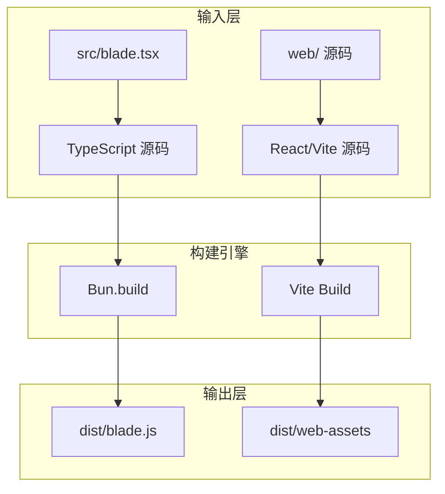
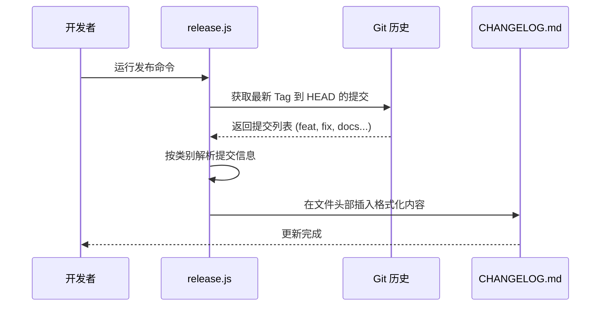
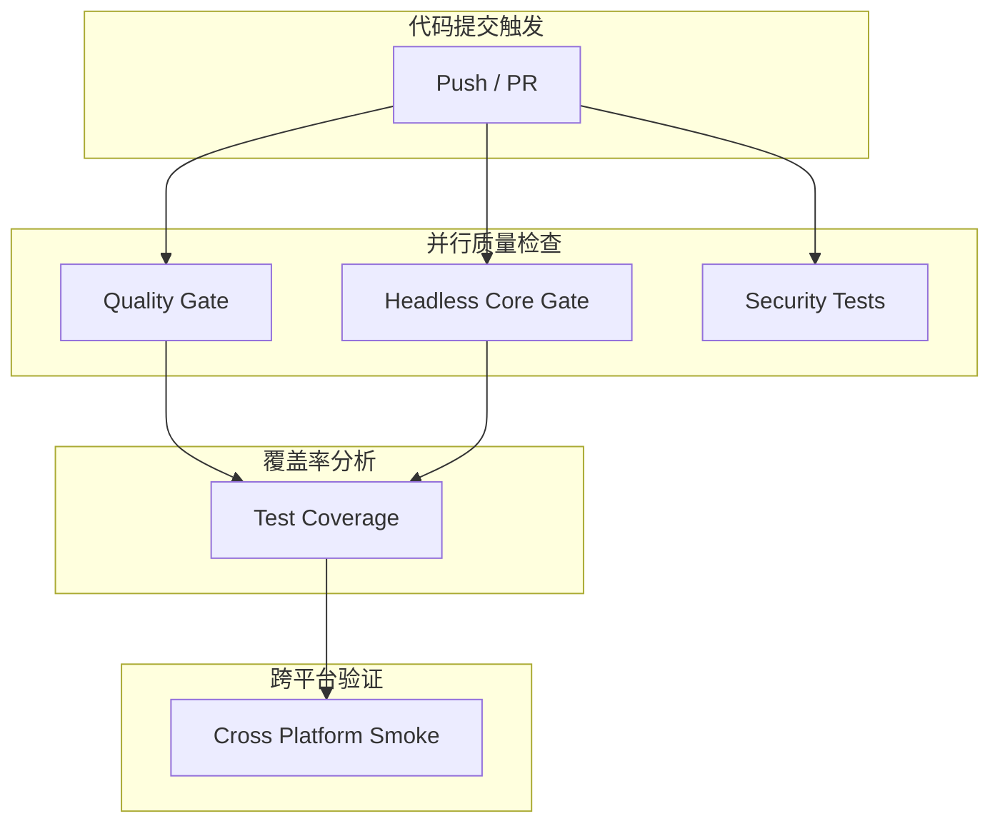

# 构建、发布与版本管理机制

## 目录

1. [模块概览](#模块概览)
2. [构建系统解析](#构建系统解析)
   - [核心构建流程](#核心构建流程)
   - [Web UI 构建集成](#web-ui-构建集成)
3. [发布自动化机制](#发布自动化机制)
   - [版本管理策略](#版本管理策略)
   - [Changelog 自动化生成](#changelog-自动化生成)
   - [跨仓库同步机制](#跨仓库同步机制)
4. [CI/CD 流水线设计](#cicd-流水线设计)
   - [质量门禁 (Quality Gate)](#质量门禁-quality-gate)
   - [跨平台验证](#跨平台验证)
5. [辅助脚本工具集](#辅助脚本工具集)
   - [Ripgrep 多平台分发](#ripgrep-多平台分发)
   - [安全审计与测试](#安全审计与测试)
6. [核心组件参考](#核心组件参考)
7. [文件参考](#文件参考)

## 模块概览

Blade 项目的构建、发布与版本管理机制是一个高度自动化的体系，旨在确保 CLI 工具及其配套 Web UI 的高质量交付。该机制不仅涵盖了从源代码到可执行二进制文件的转换过程，还通过精密的脚本和 CI/CD 工作流，实现了语义化版本控制、变更日志自动生成以及多平台的安全发布。

在本次探索中，我们共识别出约 15 个核心构建与发布相关文件，分布在项目根目录、`packages/cli/scripts/` 以及 `.github/workflows/` 路径下。

### 核心子模块划分

1.  **构建系统 (Build System)**：基于 **Bun** 运行时和内置的 **esbuild** 引擎，负责 CLI 后端的打包，并集成 **Vite** 进行 Web UI 的前端构建。
2.  **发布自动化 (Release Automation)**：通过自研的 `release.js` 脚本和 `release.config.js` 配置文件，驱动从版本号递增到 NPM 发布的完整生命周期。
3.  **CI/CD 流水线 (CI/CD Pipeline)**：利用 GitHub Actions 实现多阶段的质量检测，包括单元测试、集成测试、类型检查、安全审计及跨平台冒烟测试。
4.  **辅助脚本工具集 (Utility Scripts)**：提供如 Ripgrep 二进制文件下载、安全测试运行等特定任务的自动化支持。

本章节将深入解析这些子模块的设计原理与实现细节，为开发者理解 Blade 的工程化底座提供全面指导。

## 构建系统解析

Blade 的构建系统以高效和现代为核心原则，充分利用了 Bun 运行时的性能优势。其核心任务是将 TypeScript/React 源码转换为高性能、可分发的 JavaScript 产物。

### 核心构建流程

构建过程主要由 `packages/cli/scripts/build.ts` 驱动。该脚本利用 `Bun.build` API，对 CLI 的入口文件 `src/blade.tsx` 进行处理。

以下图表展示了构建系统从源码到产物的转换路径：



**图表说明**：
该流程图描绘了 Blade 构建系统的双轨并行模式。左侧路径由 `Bun.build` 负责后端逻辑的打包，它会将 TypeScript 源码进行压缩、分块（Splitting）并标记外部依赖（Externalize dependencies）。右侧路径则在检测到 Web UI 源码存在时，调用 Vite 引擎进行前端资源的构建。最终产物共同存放在 `dist` 目录下，作为发布的基础。

在实现上，`build.ts` 会自动从 `package.json` 中提取依赖列表，将其标记为 `external`，以减小构建产物的体积并利用运行时的依赖管理。

```typescript
// packages/cli/scripts/build.ts 核心逻辑片段
const packageJson = await Bun.file(new URL("../package.json", import.meta.url)).json();

const externals = [
  ...Object.keys(packageJson.dependencies ?? {}),
  ...Object.keys(packageJson.optionalDependencies ?? {}),
  ...Object.keys(packageJson.peerDependencies ?? {})
];

const result = await Bun.build({
  entrypoints: ["src/blade.tsx"],
  outdir: "dist",
  target: "node",
  format: "esm",
  splitting: true,
  minify: true,
  external: externals
});
```

**代码解析**：
这段代码展示了如何通过动态分析 `package.json` 来确定哪些库不应被打包进最终文件。通过设置 `target: "node"` 和 `format: "esm"`，确保了产物在现代 Node.js 环境下的兼容性。`minify: true` 则进一步优化了产物大小。

### Web UI 构建集成

Blade 的 Web UI 是一个独立的 Vite 项目，位于 `packages/cli/web/`。构建脚本通过 `child_process.spawn` 动态调用 `npx vite build` 来完成前端构建。

这种集成方式确保了前后端构建的一致性：当开发者运行 `npm run build` 时，系统会自动检测 Web UI 源码是否存在，并按需启动前端构建流程。这种“按需构建”的策略在开发环境下极大提升了反馈速度，而在发布环境下则保证了产物的完整性。

**构建系统源码参考**：
- [packages/cli/scripts/build.ts](file:///Users/bytedance/Documents/GitHub/Blade/packages/cli/scripts/build.ts)
- [packages/cli/package.json](file:///Users/bytedance/Documents/GitHub/Blade/packages/cli/package.json)

## 发布自动化机制

Blade 并没有使用通用的发布工具（如 semantic-release），而是根据自身 Monorepo 和跨仓库同步的需求，开发了一套高度定制的发布脚本 `release.js`。

### 版本管理策略

Blade 严格遵循语义化版本 (SemVer) 规范。发布脚本支持三种主要的版本递增类型：`major`、`minor` 和 `patch`。

以下决策树展示了系统如何确定下一个版本号：

```mermaid
flowchart TD
    Start[启动发布脚本] --> CheckConfig[读取 release.config.js]
    CheckConfig --> GetLatest[获取当前最高版本]
    GetLatest --> ParseArgs{命令行参数?}
    ParseArgs -- --major --> IncMajor[主版本 +1, 次/修订清零]
    ParseArgs -- --minor --> IncMinor[次版本 +1, 修订清零]
    ParseArgs -- --patch --> IncPatch[修订版本 +1]
    ParseArgs -- 无参数 --> DefaultType[使用配置默认类型]
    IncMajor --> FinalVer[确定新版本号]
    IncMinor --> FinalVer
    IncPatch --> FinalVer
    DefaultType --> FinalVer
```

**图表说明**：
该决策树详细描述了版本号生成的逻辑流程。系统会综合考虑 Git Tag、`package.json` 以及 NPM 远程仓库中的版本，选出其中的最大值作为基准。随后，根据开发者传入的参数或配置文件中的 `defaultType`（默认为 `patch`），计算出最终的新版本号。这种机制有效避免了版本号冲突或回退的风险。

### Changelog 自动化生成

Blade 的变更日志生成器通过分析 Git 提交历史，自动将提交归类到不同的功能模块中。



**流程解析**：
发布脚本会读取 `release.config.js` 中的 `categories` 配置，通过正则表达式匹配提交信息的前缀（如 `feat:`, `fix:`）。解析完成后，它会将这些信息格式化为 Markdown 条目，并自动插入到 `CHANGELOG.md` 的顶部。这不仅节省了人工编写的时间，也确保了变更记录的准确性。

### 跨仓库同步机制

Blade 的一个独特设计是与 `blade-doc` 仓库的同步。由于文档通常托管在独立的仓库或分支中，发布脚本在更新本地 `CHANGELOG.md` 后，会自动尝试将内容同步到指定的文档仓库。

这种机制通过环境变量 `BLADE_DOC_PATH` 进行配置。如果检测到该路径存在，脚本会直接写入对应的 `changelog.md` 文件，实现了“一次发布，多处更新”的高效协同。

**发布机制源码参考**：
- [packages/cli/scripts/release.js](file:///Users/bytedance/Documents/GitHub/Blade/packages/cli/scripts/release.js)
- [packages/cli/release.config.js](file:///Users/bytedance/Documents/GitHub/Blade/packages/cli/release.config.js)

## CI/CD 流水线设计

Blade 的持续集成与交付流水线由 GitHub Actions 驱动，配置文件位于 `.github/workflows/ci.yml`。该流水线被设计为一个严密的“质量门禁”，确保只有通过所有验证的代码才能合并或发布。

### 质量门禁 (Quality Gate)

流水线分为多个并行和串行的任务，涵盖了从代码风格到运行时行为的全方位检测。



**流水线说明**：
1.  **Quality Gate**：这是最基础的门禁，负责安装依赖、执行构建、进行 CLI 和 Web 的类型检查（Type Check）以及运行前端回归测试。
2.  **Headless Core Gate**：专门针对 Blade 的核心无头模式（Headless Mode）运行复杂的回归测试套件。
3.  **Security Tests**：执行 `bun audit` 和自定义的安全测试脚本，拦截高风险漏洞。
4.  **Test Coverage**：在前面的检查通过后，运行全量测试并上传覆盖率报告至 Codecov。

### 跨平台验证

由于 Blade 是一个 CLI 工具，其在不同操作系统上的兼容性至关重要。`cross-platform-smoke` 任务会在 `ubuntu-latest`、`windows-latest` 和 `macos-latest` 三种环境下运行冒烟测试。

测试内容包括：
- 验证 CLI 帮助信息是否能正确打印。
- 验证无头模式的基本指令响应。
- 确保在不同文件系统下的路径处理逻辑正确。

通过这种矩阵式测试，Blade 能够自信地支持多样化的开发者环境。

**CI/CD 源码参考**：
- [.github/workflows/ci.yml](file:///Users/bytedance/Documents/GitHub/Blade/.github/workflows/ci.yml)
- [.github/workflows/docs.yml](file:///Users/bytedance/Documents/GitHub/Blade/.github/workflows/docs.yml)

## 辅助脚本工具集

除了核心的构建和发布流程，`scripts/` 目录下还包含了一系列关键的辅助工具，它们解决了 CLI 分发中的特定技术难题。

### Ripgrep 多平台分发

Blade 依赖 `ripgrep` 进行高效的文件搜索。为了确保用户在安装 Blade 后能立即使用搜索功能，而无需手动安装 `ripgrep`，项目包含了一个 `download-ripgrep.js` 脚本。

该脚本的任务是：
1.  从 GitHub Releases 下载适用于所有主流平台（macOS Intel/M1, Linux x64/ARM64, Windows）的 `ripgrep` 二进制文件。
2.  将其解压到 `packages/cli/vendor/ripgrep/` 目录。
3.  在 NPM 发布时，这些二进制文件会被包含在包中。

这种“预打包二进制”的策略极大地提升了用户体验，降低了环境依赖。

### 安全审计与测试

`run-security-tests.sh` 脚本集成了多种安全检查手段：
- **Bun Audit**：检查 NPM 依赖树中的已知漏洞。
- **License Checker**：扫描所有第三方依赖的许可证，确保符合 MIT 开源协议，避免法律风险。
- **Outdated Check**：识别过时的依赖项，提醒开发者进行必要的安全更新。

这些脚本不仅在 CI 中运行，开发者也可以在本地通过 `npm run test:security` 快速执行。

**工具脚本源码参考**：
- [packages/cli/scripts/download-ripgrep.js](file:///Users/bytedance/Documents/GitHub/Blade/packages/cli/scripts/download-ripgrep.js)
- [packages/cli/scripts/run-security-tests.sh](file:///Users/bytedance/Documents/GitHub/Blade/packages/cli/scripts/run-security-tests.sh)
- [packages/cli/scripts/run-bun.js](file:///Users/bytedance/Documents/GitHub/Blade/packages/cli/scripts/run-bun.js)

## 核心组件参考

### 1. 发布配置对象 (`release.config.js`)
定义了发布流程的所有行为准则，包括检查项、通知渠道和变更日志分类。

### 2. 构建器 (`build.ts`)
封装了基于 Bun 的高性能构建逻辑，处理多入口打包和外部依赖剥离。

### 3. 发布协调器 (`release.js`)
作为发布过程的“指挥官”，串联起 Git 操作、版本计算、构建、测试和 NPM 推送。

### 4. CI 工作流 (`ci.yml`)
定义了云端验证的流水线拓扑，是项目质量的最后一道防线。

## 文件参考

本章节涉及的核心源文件如下：

- [packages/cli/scripts/build.ts](file:///Users/bytedance/Documents/GitHub/Blade/packages/cli/scripts/build.ts)：核心构建逻辑实现。
- [packages/cli/scripts/release.js](file:///Users/bytedance/Documents/GitHub/Blade/packages/cli/scripts/release.js)：发布自动化脚本。
- [packages/cli/release.config.js](file:///Users/bytedance/Documents/GitHub/Blade/packages/cli/release.config.js)：发布流程详细配置。
- [.github/workflows/ci.yml](file:///Users/bytedance/Documents/GitHub/Blade/.github/workflows/ci.yml)：GitHub Actions CI 流水线定义。
- [packages/cli/package.json](file:///Users/bytedance/Documents/GitHub/Blade/packages/cli/package.json)：包定义与构建/测试脚本入口。
- [packages/cli/scripts/download-ripgrep.js](file:///Users/bytedance/Documents/GitHub/Blade/packages/cli/scripts/download-ripgrep.js)：多平台二进制分发工具。
- [packages/cli/scripts/run-security-tests.sh](file:///Users/bytedance/Documents/GitHub/Blade/packages/cli/scripts/run-security-tests.sh)：安全审计脚本。
- [packages/cli/scripts/run-bun.js](file:///Users/bytedance/Documents/GitHub/Blade/packages/cli/scripts/run-bun.js)：Bun 运行时包装脚本。
- [packages/cli/scripts/test.js](file:///Users/bytedance/Documents/GitHub/Blade/packages/cli/scripts/test.js)：测试运行协调器。
- [.github/workflows/docs.yml](file:///Users/bytedance/Documents/GitHub/Blade/.github/workflows/docs.yml)：文档发布自动化流水线。
