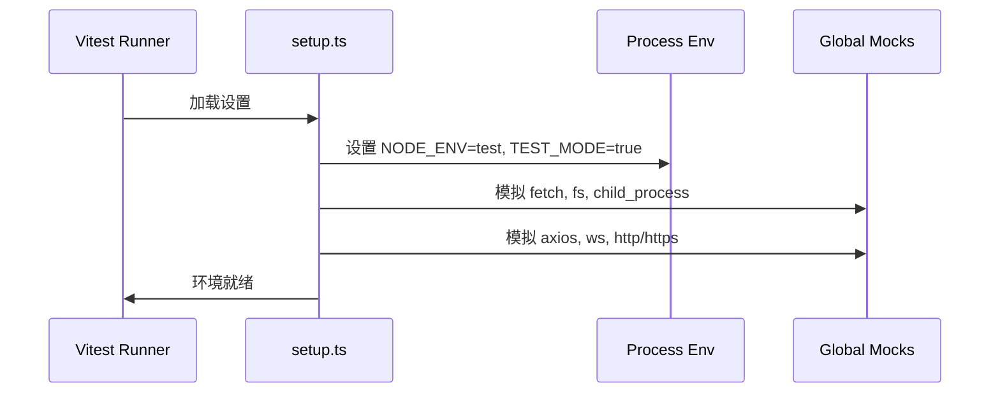
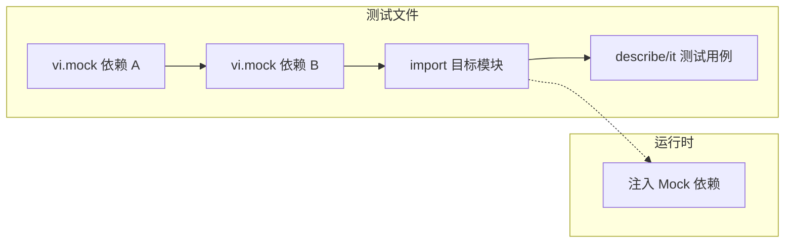
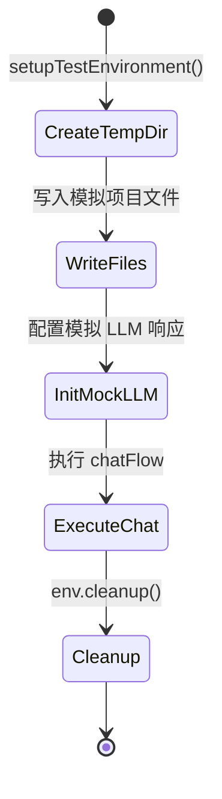
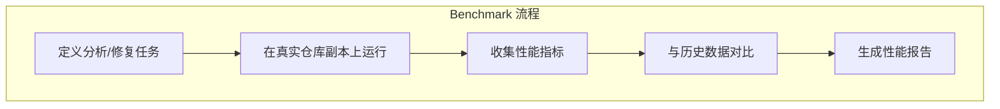
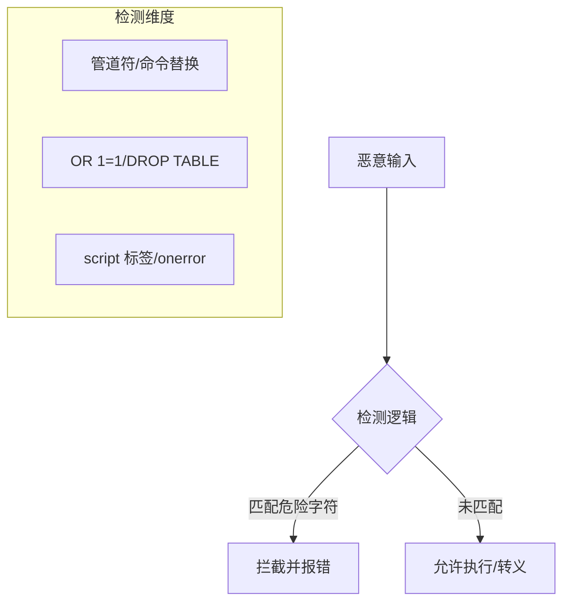

# 测试框架与质量保证实践

## 目录

1. [模块概览](#模块概览)
2. [测试架构与运行机制](#测试架构与运行机制)
3. [单元测试实践 (Unit Tests)](#单元测试实践-unit-tests)
4. [集成测试与 CLI 验证 (Integration Tests)](#集成测试与-cli-验证-integration-tests)
5. [端到端测试流程 (E2E Tests)](#端到端测试流程-e2e-tests)
6. [性能与回归测试 (Performance Benchmarks)](#性能与回归测试-performance-benchmarks)
7. [安全测试与注入防护 (Security Testing)](#安全测试与注入防护-security-testing)
8. [测试支持工具与 Mock 体系](#测试支持工具与-mock-体系)
9. [核心文件索引](#核心文件索引)

## 模块概览

Blade 的测试体系是一个多层级、全方位的质量保证系统，旨在确保从底层原子逻辑到高层用户交互的每一环都具备高度的稳定性。该系统主要集中在 `packages/cli/tests/` 目录下，涵盖了超过 150 个测试文件。

通过对测试目录的探索，我们可以看到以下结构分布：
- **单元测试 (unit/)**: 约占总测试量的 70%，深入验证 Agent 运行时、上下文管理、工具执行等核心逻辑。
- **集成测试 (integration/)**: 验证 CLI 命令、配置系统、MCP 注册等模块间的协作。
- **端到端测试 (e2e/)**: 模拟真实用户交互流程，使用快照验证输出。
- **性能测试 (performance/)**: 监控启动时间和 Token 处理性能，防止性能退化。
- **安全测试 (security/)**: 专项针对路径穿越、注入攻击等安全风险。
- **支持工具 (support/)**: 提供 Mocks、Factories 和 Helpers，简化测试编写。

本页面将深入剖析这些测试层级的实现方式，指导开发者如何利用现有架构编写高质量的测试代码。

## 测试架构与运行机制

Blade 采用 **Vitest** 作为核心测试运行框架（在某些环境中也兼容 Bun Test）。测试架构的设计核心在于“环境隔离”与“全局模拟”，确保测试在受控且可重复的环境中运行。

### 测试环境初始化

每个测试运行前，系统都会加载 `tests/support/setup.ts`。该文件负责配置全局环境变量、初始化模拟对象以及管理控制台输出。



上述流程确保了测试不会意外修改真实文件系统或发起真实的网络请求。`setup.ts` 通过 `vi.mock` 拦截了 Node.js 的核心模块，并提供了受控的替代实现。例如，`fs` 模块被包装成 Vitest 的 mock 函数，允许测试根据需要覆写特定的文件操作。

### 运行特定测试

开发者可以通过以下命令运行不同类型的测试：
- **单元测试**: `bun run test:unit`
- **集成测试**: `bun run test:integration`
- **E2E 测试**: `bun run test:e2e`
- **所有测试**: `bun run test`

**Section sources**:
- [setup.ts](file:///Users/bytedance/Documents/GitHub/Blade/packages/cli/tests/support/setup.ts)
- [test-config.ts](file:///Users/bytedance/Documents/GitHub/Blade/packages/cli/tests/support/test-config.ts)

## 单元测试实践 (Unit Tests)

单元测试是质量保证的基石。在 Blade 中，单元测试遵循“深度 Mock 依赖”的原则，确保每个测试用例仅验证目标函数的逻辑。

### Mock 机制与模式

在编写单元测试时，必须在导入目标模块之前使用 `vi.mock`。这种模式可以防止原始依赖被加载，从而完全控制测试环境。



这种“先 Mock 后 Import”的策略在 `executeLoopGenerator.test.ts` 中得到了充分体现。该测试模拟了 LLM 服务、工具注册表和上下文压缩服务，从而能够精确验证 Agent 运行循环的步进逻辑。

### 代码示例：核心循环测试

以下是验证 Agent 执行循环的一个典型片段：

```typescript
// execute-loop-generator.test.ts
describe('executeLoopGenerator', () => {
  it('应该在没有工具调用时返回文本响应', async () => {
    const deps = createMockDeps(); // 创建模拟依赖
    const context = createMockContext(); // 创建模拟上下文

    const gen = executeLoopGenerator(deps, 'Hello', context, { stream: false });
    const { result, events } = await drainGenerator(gen);

    expect(result.success).toBe(true);
    expect(events).toContainEqual(expect.objectContaining({ kind: 'turn_start' }));
  });
});
```

**Section sources**:
- [execute-loop-generator.test.ts](file:///Users/bytedance/Documents/GitHub/Blade/packages/cli/tests/unit/agent-runtime/agent/execute-loop-generator.test.ts)
- [tool-registry.test.ts](file:///Users/bytedance/Documents/GitHub/Blade/packages/cli/tests/unit/tooling/tools/registry/tool-registry.test.ts)

## 集成测试与 CLI 验证 (Integration Tests)

集成测试关注模块间的协作，特别是 CLI 命令的正确性。Blade 使用 `node:child_process` 的 `spawnSync` 来运行构建后的二进制文件，模拟真实用户的命令行操作。

### CLI 验证流程

集成测试通常会检查命令的退出码 (exit code)、标准输出 (stdout) 和标准错误 (stderr)。

```mermaid
flowchart TD
    Start[开始测试] --> Build[确保 dist/blade.js 存在]
    Build --> Spawn[spawnSync('node', ['blade.js', '--help'])]
    Spawn --> CheckStatus[检查 status === 0]
    CheckStatus --> CheckOutput[验证输出包含关键字]
    CheckOutput --> End[测试通过]
```

在 `blade-help.test.ts` 中，测试验证了 `--help` 和 `--headless /help` 命令。这种测试方式确保了即使内部逻辑发生重构，CLI 的对外接口和交互逻辑依然保持一致。

**Section sources**:
- [blade-help.test.ts](file:///Users/bytedance/Documents/GitHub/Blade/packages/cli/tests/integration/cli/blade-help.test.ts)
- [config.test.ts](file:///Users/bytedance/Documents/GitHub/Blade/packages/cli/tests/integration/config.test.ts)

## 端到端测试流程 (E2E Tests)

E2E 测试通过模拟完整的对话流来验证系统的最终交付质量。它不关心内部实现细节，而是关注“输入 -> 处理 -> 输出”的完整链路。

### 环境准备与清理

E2E 测试利用 `setupTestEnvironment` 工具创建一个隔离的临时项目目录。这个目录模拟了用户的真实工作空间，包含 `package.json`、配置文件和源代码。



这种机制确保了每个 E2E 测试都在干净的环境中运行，避免了测试间的相互干扰。`chat-flow.test.ts` 展示了如何验证多轮对话、工具调用流以及流式响应的正确性。

**Section sources**:
- [chat-flow.test.ts](file:///Users/bytedance/Documents/GitHub/Blade/packages/cli/tests/e2e/flows/chat-flow.test.ts)
- [setupTestEnvironment.ts](file:///Users/bytedance/Documents/GitHub/Blade/packages/cli/tests/support/helpers/setupTestEnvironment.ts)

## 性能与回归测试 (Performance Benchmarks)

为了防止功能迭代导致性能退化，Blade 引入了性能基准测试。这些测试通常针对耗时较长或资源消耗较大的操作。

### 基准测试执行逻辑

性能测试通过环境变量（如 `BLADE_RUN_REAL_REPO_BENCHMARK`）控制开关。它会运行一组预定义的复杂任务，并记录以下指标：
1. **执行耗时**: 整个任务的完成时间。
2. **Token 消耗**: 输入、输出及总 Token 数。
3. **文件读取数**: 任务过程中访问的文件数量。
4. **成功率**: 任务是否按预期完成。



这些数据会被持久化到 `.blade/benchmarks/` 目录下的 JSON 文件中，便于进行长期的性能趋势分析。

**Section sources**:
- [real-repo-benchmark.test.ts](file:///Users/bytedance/Documents/GitHub/Blade/packages/cli/tests/performance/benchmarks/real-repo-benchmark.test.ts)
- [startup-time.test.ts](file:///Users/bytedance/Documents/GitHub/Blade/packages/cli/tests/performance/regression/startup-time.test.ts)

## 安全测试与注入防护 (Security Testing)

作为一个拥有文件读写和命令执行能力的 Agent，安全性至关重要。Blade 的安全测试套件专门用于验证各种攻击向量的防护能力。

### 注入攻击检测

`injection.test.ts` 涵盖了 Shell 注入、SQL 注入、XSS、LDAP 和模板注入的检测逻辑。



通过大量的恶意输入样本，测试确保了 `containsDangerousChars` 和 `containsSQLInjection` 等关键函数能够准确识别并拦截潜在威胁。此外，还验证了参数转义逻辑（如 `escapeShellArg`）的正确性。

**Section sources**:
- [injection.test.ts](file:///Users/bytedance/Documents/GitHub/Blade/packages/cli/tests/security/injection.test.ts)
- [path-traversal.test.ts](file:///Users/bytedance/Documents/GitHub/Blade/packages/cli/tests/security/path-traversal.test.ts)

## 测试支持工具与 Mock 体系

为了提高测试编写效率，Blade 提供了一套丰富的支持工具集。

### 核心支持组件

1. **Mocks**:
   - `MockAgent`: 模拟 Agent 行为，支持预设响应和错误抛出。
   - `mockLLMService`: 模拟大模型服务，支持流式和非流式响应。
   - `mockFileSystem`: 内存级文件系统模拟。
2. **Factories**:
   - `configFactory`: 快速创建不同配置的 Blade 实例。
   - `messageFactory`: 生成测试用的对话消息历史。
3. **Helpers**:
   - `waitFor`: 处理异步等待逻辑。
   - `assertions`: 自定义断言，简化复杂对象的验证。

这些工具的使用极大地减少了测试代码中的样板代码（Boilerplate），使开发者能够专注于业务逻辑的验证。

**Section sources**:
- [mockAgent.ts](file:///Users/bytedance/Documents/GitHub/Blade/packages/cli/tests/support/mocks/mockAgent.ts)
- [setupTestEnvironment.ts](file:///Users/bytedance/Documents/GitHub/Blade/packages/cli/tests/support/helpers/setupTestEnvironment.ts)

## 核心文件索引

以下是本项目测试体系中的关键文件：

- **环境配置**:
  - [setup.ts](file:///Users/bytedance/Documents/GitHub/Blade/packages/cli/tests/support/setup.ts): 全局测试环境初始化。
  - [test-config.ts](file:///Users/bytedance/Documents/GitHub/Blade/packages/cli/tests/support/test-config.ts): 测试全局配置。
- **单元测试核心**:
  - [execute-loop-generator.test.ts](file:///Users/bytedance/Documents/GitHub/Blade/packages/cli/tests/unit/agent-runtime/agent/execute-loop-generator.test.ts): Agent 核心循环测试。
  - [token-counter.test.ts](file:///Users/bytedance/Documents/GitHub/Blade/packages/cli/tests/unit/agent-runtime/context/token-counter.test.ts): Token 计数逻辑测试。
- **集成与 E2E**:
  - [blade-help.test.ts](file:///Users/bytedance/Documents/GitHub/Blade/packages/cli/tests/integration/cli/blade-help.test.ts): CLI 帮助命令集成测试。
  - [chat-flow.test.ts](file:///Users/bytedance/Documents/GitHub/Blade/packages/cli/tests/e2e/flows/chat-flow.test.ts): 完整对话流 E2E 测试。
- **性能与安全**:
  - [real-repo-benchmark.test.ts](file:///Users/bytedance/Documents/GitHub/Blade/packages/cli/tests/performance/benchmarks/real-repo-benchmark.test.ts): 真实仓库性能基准。
  - [injection.test.ts](file:///Users/bytedance/Documents/GitHub/Blade/packages/cli/tests/security/injection.test.ts): 注入攻击专项测试。
- **支持工具**:
  - [mockAgent.ts](file:///Users/bytedance/Documents/GitHub/Blade/packages/cli/tests/support/mocks/mockAgent.ts): Agent 模拟实现。
  - [setupTestEnvironment.ts](file:///Users/bytedance/Documents/GitHub/Blade/packages/cli/tests/support/helpers/setupTestEnvironment.ts): E2E 环境准备工具。
