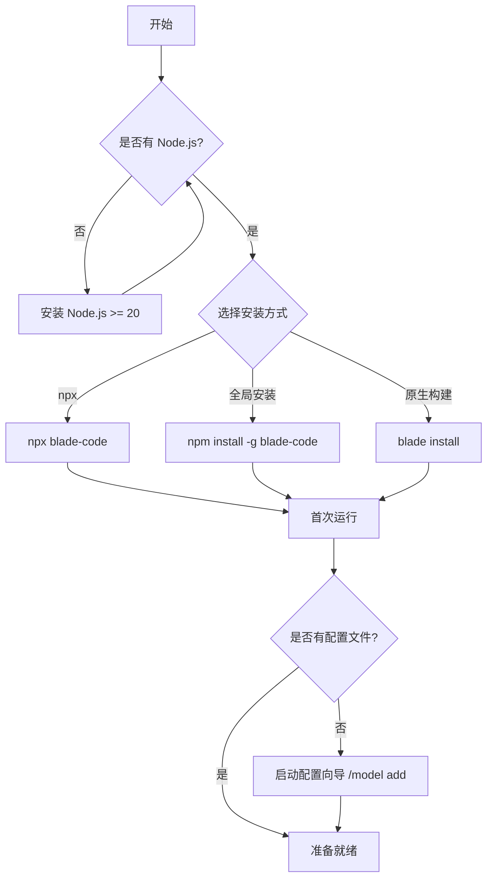
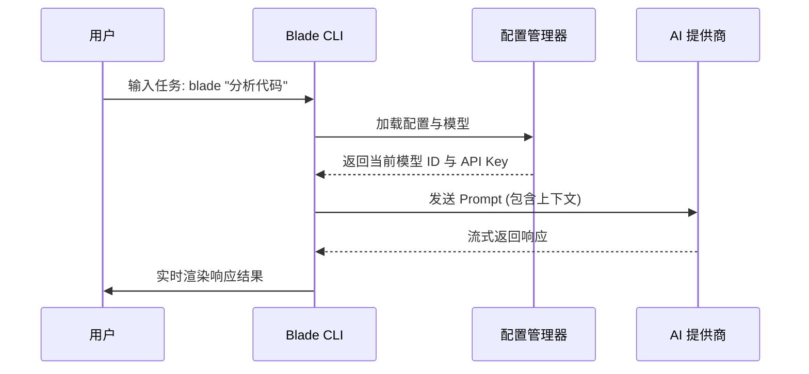

# 快速开始与安装指南

## 目录
1. [模块概览](#模块概览)
2. [环境要求](#环境要求)
3. [安装指南](#安装指南)
   - [零安装试用 (npx)](#零安装试用-npx)
   - [全局安装 (推荐)](#全局安装-推荐)
   - [原生构建安装](#原生构建安装)
4. [配置系统与模型向导](#配置系统与模型向导)
   - [配置层次结构](#配置层次结构)
   - [模型配置向导 (/model-add)](#模型配置向导-model-add)
   - [环境变量插值](#环境变量插值)
5. [快速上手示例](#快速上手示例)
   - [交互式 CLI 模式](#交互式-cli-模式)
   - [Web UI 模式](#web-ui-模式)
   - [单次任务执行](#单次任务执行)
6. [环境检查与故障排查](#环境检查与故障排查)
7. [核心组件实现](#核心组件实现)
8. [文件引用](#文件引用)

## 模块概览

本章节涵盖了 Blade 的从零到一的安装与配置流程。Blade 作为一个 AI 协作工具，其核心体验始于顺畅的安装和灵活的模型配置。本模块不仅包括了面向用户的安装脚本和文档，还深入探讨了 CLI 内部的配置管理逻辑和环境验证机制。

通过本指南，开发者可以快速搭建起 Blade 的运行环境，并完成首个 AI 协作任务。

**模块规模统计**:
- **文档资源**: `docs/getting-started/` 目录下包含 3 个核心引导文件。
- **命令实现**: `packages/cli/src/commands/` 目录下有约 12 个命令处理器，其中 `install.ts` 和 `doctor.ts` 是本章重点。
- **配置逻辑**: `packages/cli/src/config/` 和 `packages/cli/src/cli/` 包含核心配置管理逻辑。
- **交互命令**: `packages/cli/src/slash-commands/` 提供了 `/model` 等关键配置指令。

## 环境要求

在安装 Blade 之前，请确保您的系统满足以下基本要求。Blade 依赖于现代 JavaScript 运行时，并利用了终端的高级特性来提供丰富的交互体验。

### 运行时环境
- **Node.js**: 推荐版本 ≥ 20.0.0。虽然核心逻辑在 Node.js 18+ 即可运行，但为了最佳的性能和兼容性（特别是 Web UI 模块），建议使用最新的 LTS 版本。
- **包管理器**: 支持 `npm`, `pnpm`, 或 `yarn`。

### 操作系统支持
- **macOS**: 支持 Intel 和 Apple Silicon 架构。
- **Linux**: 兼容主流发行版（Ubuntu, Fedora, Debian 等）。
- **Windows**: 需要 Windows 10 或更高版本，推荐在 WSL2 环境下使用以获得最佳工具链支持。

### 终端要求
- **字符编码**: 必须支持 **UTF-8** 以正确显示图标和特殊字符。
- **颜色支持**: 建议支持 **256 色或 TrueColor**，以获得最佳的 UI 视觉效果。
- **字体**: 推荐使用 [Nerd Fonts](https://www.nerdfonts.com/) 以支持 UI 中的各种图标。

## 安装指南

Blade 提供了多种安装方式，以适应不同的使用场景。

### 零安装试用 (npx)

如果您只想快速体验 Blade 而不想将其持久安装到系统中，可以使用 `npx` 直接运行：

```bash
npx blade-code
```

这种方式会自动下载最新版本的 `blade-code` 包并执行。首次运行时，系统会提示您配置模型。

### 全局安装 (推荐)

对于频繁使用的开发者，建议进行全局安装，以便在任何项目目录下直接调用 `blade` 命令。

```bash
# 使用 npm
npm install -g blade-code

# 使用 pnpm
pnpm add -g blade-code

# 使用 yarn
yarn global add blade-code
```

安装完成后，您可以通过运行 `blade --version` 来验证安装是否成功。

### 原生构建安装

Blade 还提供了 `install` 命令用于安装原生构建（Native Builds），这在某些需要高性能或特定平台优化的场景下非常有用。

```bash
blade install [target]
```

- `target`: 可选值为 `stable`（稳定版，默认）或 `latest`（最新开发版）。
- `--force`: 强制重新安装。

下图展示了 Blade 的整体安装与初始化流程：



该流程图描述了从环境检查到安装完成的完整路径。用户首先需要确保 Node.js 环境就绪，然后选择适合自己的安装方式。无论哪种方式，首次运行都会触发配置检查，如果未发现配置文件（通常位于 `~/.blade/config.json`），系统将引导用户进入模型配置向导。

## 配置系统与模型向导

Blade 的配置系统设计得非常灵活，支持多层级的配置覆盖和环境变量插值。

### 配置层次结构

Blade 会按以下顺序加载并合并配置文件，优先级从高到低：

1. **项目本地配置**: `.blade/settings.local.json` (不建议提交到 Git)
2. **项目共享配置**: `.blade/settings.json` (建议提交到 Git，用于团队共享)
3. **用户全局配置**: `~/.blade/config.json` 或 `~/.blade/settings.json`
4. **系统默认配置**: 内置在源码中的 `DEFAULT_CONFIG`

这种结构允许开发者在项目级别定义特定的权限规则或 MCP 服务器，同时保留个人的模型 API 密钥在全局配置中。

### 模型配置向导 (/model add)

首次启动 Blade 或需要添加新模型时，可以使用 `/model add` 命令。这是一个交互式的命令行向导，会引导您完成以下步骤：

1. **选择 Provider**: 支持 OpenAI, Anthropic, DeepSeek, Google Gemini, Azure 等 80+ 提供商。
2. **配置 API Key**: 支持直接输入或引用环境变量。
3. **设置 Base URL**: 对于兼容 OpenAI 的提供商（如 Ollama, LocalAI），需要指定 API 端点。
4. **选择模型名称**: 从提供商支持的模型列表中选择。

### 环境变量插值

为了安全起见，不建议将 API 密钥明文存储在配置文件中。Blade 的 `ConfigManager` 支持环境变量插值：

```json
{
  "models": [
    {
      "id": "my-qwen",
      "name": "Qwen Max",
      "provider": "openai-compatible",
      "apiKey": "${QWEN_API_KEY}",
      "baseUrl": "https://dashscope.aliyuncs.com/compatible-mode/v1",
      "model": "qwen-max"
    }
  ]
}
```

`ConfigManager` 会在加载时自动将 `${QWEN_API_KEY}` 替换为实际的环境变量值。

## 快速上手示例

安装并配置完成后，您可以尝试以下几种常见的操作模式。

### 交互式 CLI 模式

直接运行 `blade` 进入全屏交互界面：

```bash
blade
```

在界面中，您可以直接输入问题，或者使用 `@` 引用文件：
- `帮我分析一下 src/index.ts 的逻辑`
- `@src/utils/auth.ts 这里的登录逻辑有安全风险吗？`

### Web UI 模式

如果您更喜欢浏览器交互，可以使用 Web UI 模式：

```bash
blade web
```

这将启动一个本地服务器并自动打开浏览器。Web UI 提供了更丰富的文件预览和历史管理功能。

### 单次任务执行

对于脚本化调用或快速查询，可以使用 `--print` 参数：

```bash
blade --print "解释什么是 TypeScript 的装饰器"
```

这种模式下，Blade 会输出结果并立即退出，非常适合管道操作。

下图展示了 Blade 处理一个简单任务的数据流向：



在此序列中，用户发起的任务首先触发 CLI 的初始化。CLI 通过 `ConfigManager` 获取当前活跃的模型配置（包括解析后的环境变量）。随后，CLI 将用户输入包装成 Prompt 发送给选定的 AI 提供商，并将返回的流式数据实时渲染到终端或 Web UI。

## 环境检查与故障排查

如果在使用过程中遇到问题，`blade doctor` 是您的首选诊断工具。

```bash
blade doctor
```

它会检查以下项目：
- **配置完整性**: 验证 `config.json` 是否存在且格式正确。
- **Node.js 版本**: 检查是否满足最低版本要求。
- **文件系统权限**: 验证当前目录是否可读写。
- **依赖状态**: 检查核心依赖包是否完整。

**常见问题排查表**:

| 现象 | 可能原因 | 解决方法 |
|------|----------|----------|
| `EACCES` 错误 | 全局安装权限不足 | 使用 `sudo` 或修改 npm 全局路径 |
| 模型调用报错 401 | API Key 无效或过期 | 检查环境变量或运行 `/model add` 重新配置 |
| 终端显示乱码 | 不支持 UTF-8 | 检查终端设置，更换支持的字体 |
| 响应速度极慢 | 网络连接问题 | 检查代理设置，或尝试国内兼容 Provider (如千问) |

## 核心组件实现

安装与配置的核心逻辑主要由以下组件实现。

### Install 命令处理器
位于 `packages/cli/src/commands/install.ts`，负责处理 `blade install` 指令。虽然目前主要作为原生构建的入口，但它定义了版本选择和强制安装的逻辑框架。

```typescript
export const installCommands: CommandModule<{}, InstallOptions> = {
  command: 'install [target]',
  describe: 'Install Blade native build',
  handler: async (argv) => {
    // 1. 验证目标版本 (stable/latest)
    // 2. 下载二进制文件
    // 3. 权限设置与符号链接更新
  },
};
```

### 配置管理器 (ConfigManager)
位于 `packages/cli/src/config/ConfigManager.ts`，是整个配置系统的枢纽。它采用单例模式，负责多级配置的加载、合并以及环境变量的动态解析。

```typescript
export class ConfigManager {
  async initialize(): Promise<BladeConfig> {
    // 1. 加载 config.json (全局/项目)
    // 2. 加载 settings.json (多层级)
    // 3. 合并配置并解析环境变量插值
    // 4. 验证配置有效性
  }
}
```

## 文件引用

本章节涉及的关键源码文件如下：

**核心逻辑**:
- [install.ts](file:///Users/bytedance/Documents/GitHub/Blade/packages/cli/src/commands/install.ts) - 安装命令处理器
- [doctor.ts](file:///Users/bytedance/Documents/GitHub/Blade/packages/cli/src/commands/doctor.ts) - 环境检查工具
- [ConfigManager.ts](file:///Users/bytedance/Documents/GitHub/Blade/packages/cli/src/config/ConfigManager.ts) - 配置加载与合并逻辑
- [config.ts](file:///Users/bytedance/Documents/GitHub/Blade/packages/cli/src/cli/config.ts) - CLI 全局选项定义
- [defaults.ts](file:///Users/bytedance/Documents/GitHub/Blade/packages/cli/src/config/defaults.ts) - 默认配置项

**用户文档**:
- [installation.md](file:///Users/bytedance/Documents/GitHub/Blade/docs/getting-started/installation.md) - 官方安装指南
- [quick-start.md](file:///Users/bytedance/Documents/GitHub/Blade/docs/getting-started/quick-start.md) - 5 分钟上手文档
