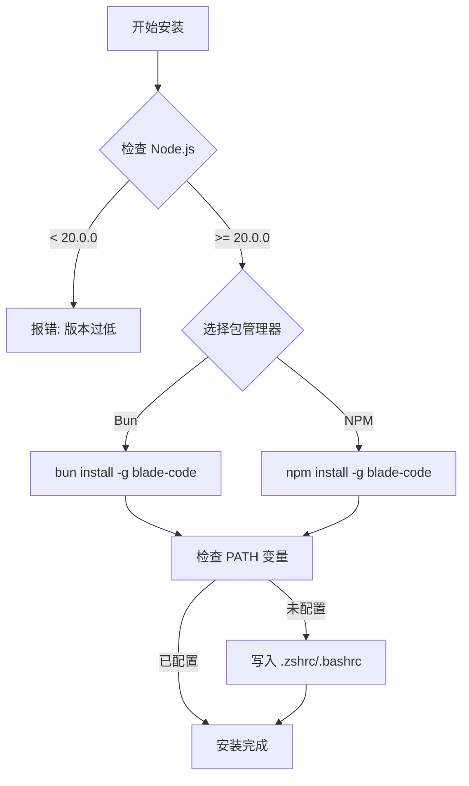
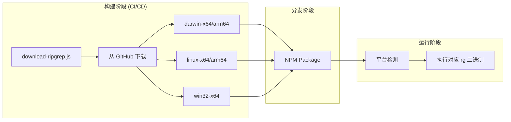
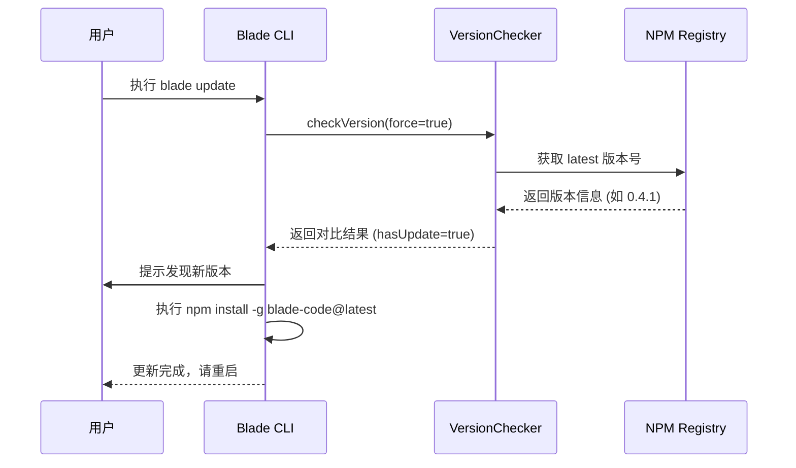
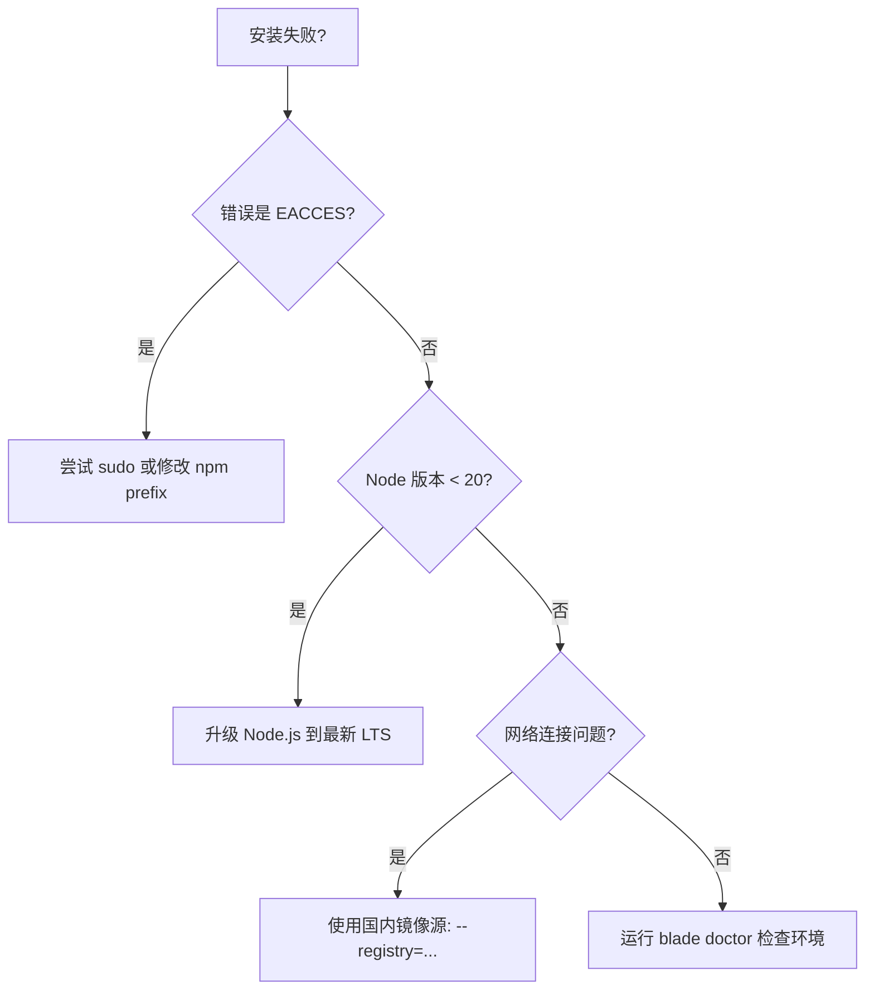

# 安装与更新指南

## 目录
1. [模块概览](#模块概览)
2. [引言](#引言)
3. [多样化安装方式](#多样化安装方式)
   - [脚本安装](#脚本安装)
   - [包管理器安装](#包管理器安装)
   - [源码编译安装](#源码编译安装)
4. [二进制依赖管理](#二进制依赖管理)
5. [更新机制解析](#更新机制解析)
6. [环境变量配置](#环境变量配置)
7. [故障排查指南](#故障排查指南)
8. [核心组件](#核心组件)
9. [文件参考](#文件参考)

## 模块概览

在对 Blade 的安装与更新系统进行深入调研后，我们梳理了该模块的核心构成。Blade 作为一个基于 Node.js 的 CLI 工具，其部署流程不仅涉及传统的包管理器分发，还包含针对不同操作系统的二进制依赖预构建。

- **发现文件总数**: 约 15 个核心文件（涉及安装、更新、脚本构建及分发配置）。
- **核心子目录**:
  - `packages/cli/src/commands/`: 包含 `install.ts` 和 `update.ts` 命令入口。
  - `packages/cli/scripts/`: 包含 `download-ripgrep.js` 和 `release.js` 等关键维护脚本。
  - `packages/cli/src/services/`: 包含 `VersionChecker.ts` 版本检查逻辑。
- **覆盖范围**: 本指南将深入解析上述所有子模块，重点讨论安装流程的自动化、跨平台二进制文件的管理以及无缝更新机制的实现。

## 引言

Blade 的安装与更新系统旨在为用户提供极简的部署体验，同时确保在不同环境下（macOS, Linux, Windows）都能获得一致的性能表现。由于 Blade 深度集成了一些高性能的系统级工具（如 `ripgrep`），其安装过程不仅仅是简单的代码拷贝，还涉及到复杂的环境检测和二进制依赖注入。

该模块的主要职责包括：
1. **多渠道分发**: 支持 npm 全局安装、一键脚本安装以及开发者友好的源码构建。
2. **环境适配**: 自动检测用户操作系统和架构，配置正确的二进制路径。
3. **版本演进**: 提供主动更新机制，确保用户能快速获取最新的 AI 能力和 Bug 修复。

## 多样化安装方式

Blade 提供了三种主要的安装途径，以满足不同场景下的用户需求。

### 脚本安装

对于希望快速上手的用户，脚本安装是最推荐的方式。通过 `curl` 或 `wget` 获取远程安装脚本，可以自动化完成 Node.js 环境检查、包下载及 PATH 配置。

下图展示了脚本安装的典型逻辑流程：



脚本安装的核心优势在于其“一键式”体验。它会自动识别当前系统的 Shell 类型（如 zsh 或 bash），并智能地将 Blade 的执行路径添加到环境变量中，避免了手动配置的繁琐。

### 包管理器安装

Blade 已经发布到 npm 官方仓库，用户可以使用任何主流的 Node.js 包管理器进行安装。

```bash
# 使用 npm (Node.js 默认)
npm install -g blade-code

# 使用 pnpm (更快的磁盘利用率)
pnpm add -g blade-code

# 使用 Bun (极致性能)
bun add -g blade-code
```

**Section sources**:
- [packages/cli/package.json](file:///Users/bytedance/Documents/GitHub/Blade/packages/cli/package.json)

### 源码编译安装

对于开发者或希望体验最新不稳定版本的用户，可以从 GitHub 仓库直接构建。Blade 采用了 Monorepo 架构，并优先推荐使用 Bun 进行构建。

1. **克隆仓库**: `git clone https://github.com/echoVic/blade-code.git`
2. **安装依赖**: `bun install`
3. **执行构建**: `bun run build`
4. **链接命令**: `cd packages/cli && npm link`

源码安装允许用户自定义构建参数，并参与到 Blade 的开发中。

## 二进制依赖管理

Blade 的核心功能之一是代码搜索和分析，这依赖于高性能工具 `ripgrep` (`rg`)。为了避免用户手动安装这些系统级工具，Blade 在发布过程中会将预编译的二进制文件打包。

`download-ripgrep.js` 脚本负责在发包前从 GitHub Releases 下载对应平台的 `rg` 二进制文件，并将其放置在 `vendor/ripgrep` 目录下。



这种策略确保了 Blade 在安装后即可立即使用，无需用户额外部署 `ripgrep`。通过将二进制文件包含在 `package.json` 的 `files` 字段中，npm 在安装时会自动下载这些资源。

**Section sources**:
- [packages/cli/scripts/download-ripgrep.js](file:///Users/bytedance/Documents/GitHub/Blade/packages/cli/scripts/download-ripgrep.js)

## 更新机制解析

Blade 内置了 `update` 命令，允许用户无缝切换到最新版本。更新流程由 `VersionChecker` 服务驱动，它会定期（或在用户手动触发时）检查 npm 仓库的最新版本。

以下是 `blade update` 的执行序列：



`VersionChecker` 具有缓存机制（默认 1 小时），以避免频繁的网络请求影响 CLI 启动性能。同时，它支持 `skipUntilVersion` 功能，如果用户选择暂不更新某个特定版本，系统将不再重复提示。

**Section sources**:
- [packages/cli/src/commands/update.ts](file:///Users/bytedance/Documents/GitHub/Blade/packages/cli/src/commands/update.ts)
- [packages/cli/src/services/VersionChecker.ts](file:///Users/bytedance/Documents/GitHub/Blade/packages/cli/src/services/VersionChecker.ts)

## 环境变量配置

在安装完成后，确保 `blade` 命令在全局可用是关键的一步。不同的包管理器有不同的默认路径：

- **NPM**: 通常位于 `/usr/local/bin` 或 `~/.npm-global/bin`。
- **Bun**: 默认位于 `~/.bun/bin`。

建议在 Shell 配置文件（如 `~/.zshrc` 或 `~/.bashrc`）中添加以下配置：

```bash
# 如果使用 Bun
export BUN_INSTALL="$HOME/.bun"
export PATH="$BUN_INSTALL/bin:$PATH"

# 如果使用自定义 NPM 全局目录
export PATH="$HOME/.npm-global/bin:$PATH"
```

配置完成后，执行 `source ~/.zshrc` 即可生效。

## 故障排查指南

安装过程中可能会遇到权限或依赖冲突问题。以下决策树可以帮助快速定位并解决问题：



常见的解决方法包括：
1. **权限问题**: 避免使用 `sudo` 安装全局包，推荐修改 npm prefix 到用户目录下。
2. **镜像加速**: 在国内环境下，使用 `https://registry.npmmirror.com` 可以显著提升下载速度。
3. **环境诊断**: `blade doctor` 命令会检查 Node 版本、Git 配置以及必要的二进制工具路径。

## 核心组件

### 安装命令入口 (`install.ts`)

虽然大部分用户通过包管理器安装，但 `blade install` 命令提供了针对特定版本（如 `stable` 或 `latest`）的安装支持。

```typescript
export const installCommands: CommandModule<{}, InstallOptions> = {
  command: 'install [target]',
  describe: 'Install Blade native build. Use [target] to specify version (stable, latest, or specific version)',
  builder: (yargs) => {
    return yargs
      .positional('target', {
        describe: 'Version to install',
        type: 'string',
        default: 'stable',
        choices: ['stable', 'latest'],
      })
      // ... 更多配置
  },
  handler: async (argv) => {
    // 实际安装逻辑：下载、验证、解压、配置 PATH
    console.log(`Installing Blade ${argv.target}...`);
  },
};
```

### 版本检查器 (`VersionChecker.ts`)

这是更新系统的核心，负责维护本地缓存并与 npm 交互。

```typescript
export async function checkVersion(forceCheck = false): Promise<VersionCheckResult> {
  const currentVersion = await getCurrentVersion();
  // ... 读取缓存逻辑
  
  // 从 npm 获取最新版本
  const latestVersion = await fetchLatestVersion();

  if (latestVersion) {
    const hasUpdate = semver.gt(latestVersion, currentVersion);
    // ... 写入缓存并返回结果
  }
}
```

**Section sources**:
- [packages/cli/src/commands/install.ts](file:///Users/bytedance/Documents/GitHub/Blade/packages/cli/src/commands/install.ts)
- [packages/cli/src/services/VersionChecker.ts](file:///Users/bytedance/Documents/GitHub/Blade/packages/cli/src/services/VersionChecker.ts)

## 文件参考

以下是本指南涉及的关键源文件：

- [packages/cli/src/commands/install.ts](file:///Users/bytedance/Documents/GitHub/Blade/packages/cli/src/commands/install.ts): 安装命令定义。
- [packages/cli/src/commands/update.ts](file:///Users/bytedance/Documents/GitHub/Blade/packages/cli/src/commands/update.ts): 更新命令定义。
- [packages/cli/src/services/VersionChecker.ts](file:///Users/bytedance/Documents/GitHub/Blade/packages/cli/src/services/VersionChecker.ts): 版本检测逻辑。
- [packages/cli/scripts/download-ripgrep.js](file:///Users/bytedance/Documents/GitHub/Blade/packages/cli/scripts/download-ripgrep.js): 二进制依赖下载脚本。
- [packages/cli/scripts/release.js](file:///Users/bytedance/Documents/GitHub/Blade/packages/cli/scripts/release.js): 发包与发布脚本。
- [packages/cli/package.json](file:///Users/bytedance/Documents/GitHub/Blade/packages/cli/package.json): 项目元数据与依赖配置。
- [docs/getting-started/installation.md](file:///Users/bytedance/Documents/GitHub/Blade/docs/getting-started/installation.md): 原始用户安装文档。
