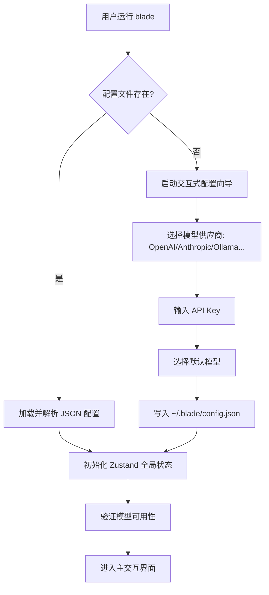
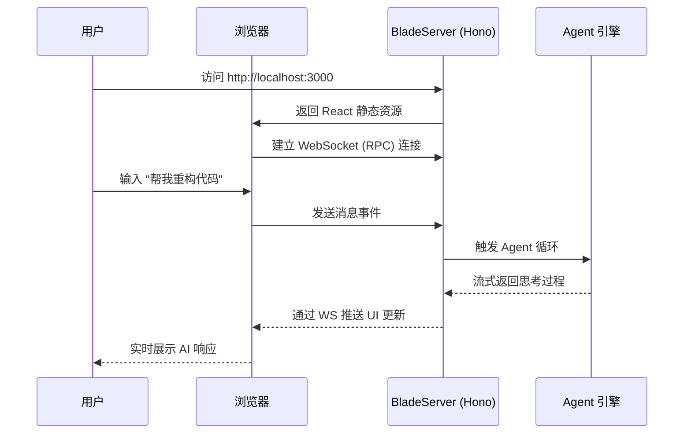
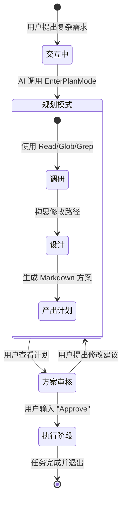

# 快速上手与首个任务

## 目录
1. [模块概览](#模块概览)
2. [引言：开启 Blade 之旅](#引言开启-blade-之旅)
3. [首次运行向导：零配置起步](#首次运行向导零配置起步)
   - [配置加载与验证逻辑](#配置加载与验证逻辑)
   - [权限模式：安全与效率的平衡](#权限模式安全与效率的平衡)
4. [交互界面选择：TUI 与 Web UI](#交互界面选择-tui-与-web-ui)
   - [TUI 模式：基于 Ink 的声明式终端界面](#tui-模式基于-ink-的声明式终端界面)
   - [Web UI 模式：现代化的浏览器协作环境](#web-ui-模式现代化的浏览器协作环境)
   - [界面模式对比与选择](#界面模式对比与选择)
5. [首个 AI 协作任务演示](#首个-ai-协作任务演示)
   - [基础对话：利用上下文感知进行代码咨询](#基础对话利用上下文感知进行代码咨询)
   - [Plan 模式深挖：复杂任务的“先思后行”](#plan-模式深挖复杂任务的先思后行)
   - [任务执行中的用户确认流](#任务执行中的用户确认流)
6. [常用快捷键与斜杠命令](#常用快捷键与斜杠命令)
   - [内置命令详解](#内置命令详解)
   - [自定义命令：扩展你的 Blade](#自定义命令扩展你的-blade)
7. [核心组件与架构深度分析](#核心组件与架构深度分析)
   - [CLI 启动生命周期](#cli-启动生命周期)
   - [状态管理：Zustand 在 TUI 中的应用](#状态管理zustand-在-tui-中的应用)
8. [文件引用](#文件引用)

## 模块概览

在深入探讨 Blade 的使用细节之前，我们首先对 `packages/cli/src` 模块进行全景式的扫描。作为 Blade 的“大脑”和“窗口”，该模块不仅承载了用户交互的重任，还负责协调底层核心库与 AI 模型之间的通信。

**规模评估与结构发现**：
- **代码规模**：`packages/cli/src` 目录下包含约 210 个 TypeScript 和 TSX 文件。其中，UI 相关的组件占据了约 40%，核心逻辑（如代理循环、工具执行、配置管理）占据了 50%，其余 10% 为各种实用工具和类型定义。
- **核心子模块详解**：
  - `ui/`：这是 TUI 的心脏，包含了大量基于 Ink 的 React 组件。`App.tsx` 是根组件，而 `components/` 目录下则细分了 `MessageRenderer`（消息渲染）、`CodeHighlighter`（代码高亮）、`DiffRenderer`（差异对比）等功能单元。
  - `agent/`：负责 AI 代理的运行。`loop/` 目录下的 `consumeLoop.ts` 实现了经典的“思考-行动-观察”循环。
  - `commands/`：定义了 CLI 的二级命令。除了默认的交互模式外，还有 `doctor`（系统诊断）、`mcp`（工具集成管理）、`web`（启动 Web 服务器）等。
  - `tools/`：Blade 能够操作本地文件的秘密武器。这里实现了文件读写、搜索、Shell 脚本执行等 20 多种内置工具。
  - `slash-commands/`：实现了类似 Slack 的斜杠命令系统，允许用户通过简单的命令触发复杂的操作。

本页面将作为你的导航员，带你从零开始掌握 Blade 的核心用法，并揭示其背后的设计哲学。

## 引言：开启 Blade 之旅

Blade 并非简单的聊天机器人，而是一个**具有行动能力的协作编程代理**。它的设计初衷是解决开发者在日常工作中频繁切换上下文的痛点。通过将 AI 直接置于你的终端和项目目录中，Blade 能够实时访问你的代码库、运行测试、阅读文档，并根据你的指令执行复杂的开发任务。

对于初次接触 Blade 的用户，最核心的价值在于其“即插即用”的特性。传统的 AI 工具往往需要你手动复制粘贴代码段，而 Blade 通过自动化的上下文发现机制，能够瞬间理解成千上万行代码之间的逻辑关系。

**Blade 的三层价值体系**：
1. **感知层**：通过 `Glob`, `Grep`, `Read` 等工具，AI 能够像人类一样“看”到项目全貌。
2. **思考层**：利用先进的 LLM 模型，AI 能够分析需求、规划路径并预测潜在风险。
3. **行动层**：在用户授权下，AI 可以修改文件、执行命令，甚至调用外部 API 完成任务。

## 首次运行向导：零配置起步

当你首次在终端输入 `blade` 并按下回车时，Blade 会执行一系列初始化检查。如果检测到当前用户目录下没有 `~/.blade/config.json` 文件，它会自动进入一种“引导模式”。

### 配置加载与验证逻辑

配置加载是由 `packages/cli/src/cli/middleware.ts` 中的 `loadConfiguration` 中间件负责的。这个中间件采用了拦截器模式：在任何命令真正执行之前，它会尝试初始化 `ConfigManager`。

在配置向导中，Blade 会使用 `ui/components/model-config/wizardFlow.ts` 定义的步骤进行跳转。这种声明式的向导设计使得添加新的配置步骤（如代理设置、自定义 Prompt 路径）变得非常简单。

### 权限模式：安全与效率的平衡

Blade 在首次配置时会询问你偏好的“权限模式”。这是 Blade 安全设计的核心：
- **Default 模式**：所有的写操作（文件修改、删除）和危险操作（执行 Shell 脚本）都必须经过用户的显式确认。这适合大多数开发场景，确保 AI 不会意外破坏你的代码。
- **YOLO 模式**：AI 在执行操作时不需要确认。这仅建议在沙盒环境或你对任务非常有把握时使用。

你可以通过 `blade --yolo` 快速进入该模式，或者在 `BLADE.md` 中针对特定项目进行配置。

**Section sources**:
- [packages/cli/src/cli/middleware.ts](file:///Users/bytedance/Documents/GitHub/Blade/packages/cli/src/cli/middleware.ts)
- [packages/cli/src/config/ConfigManager.ts](file:///Users/bytedance/Documents/GitHub/Blade/packages/cli/src/config/ConfigManager.ts)
- [packages/cli/src/ui/components/model-config/wizardFlow.ts](file:///Users/bytedance/Documents/GitHub/Blade/packages/cli/src/ui/components/model-config/wizardFlow.ts)

## 交互界面选择：TUI 与 Web UI

Blade 深刻理解开发者对工具链的多样化需求，因此提供了两种完全不同但功能等价的界面。

### TUI 模式：基于 Ink 的声明式终端界面

TUI (Terminal User Interface) 是 Blade 的灵魂。与传统的基于字符串拼接的 CLI 不同，Blade 使用了 **Ink** 框架。这意味着开发者可以用 React 的方式来编写终端 UI。

**技术实现亮点**：
- **响应式布局**：Blade 会监听终端窗口的大小变化（通过 `useTerminalWidth` 和 `useTerminalHeight` Hooks），并动态调整消息气泡和代码块的宽度。
- **非阻塞渲染**：AI 的输出是流式的。Ink 允许我们实时更新终端上的特定区域，而不会导致闪烁。
- **自定义主题**：通过 `ThemeManager.ts`，Blade 支持多种配色方案，能够完美契合你的终端主题（如 One Dark, Monokai 等）。

### Web UI 模式：现代化的浏览器协作环境

通过运行 `blade web`，你可以启动一个基于 **Hono** 框架的高性能 Web 服务器。

**为什么选择 Web UI？**
1. **富文本支持**：虽然 TUI 已经尽可能模拟了 Markdown 渲染，但浏览器在处理复杂的表格、数学公式和长文本方面具有天然优势。
2. **多会话管理**：Web 界面允许你更直观地在不同的历史会话之间切换。
3. **远程协作**：如果你在云端服务器（如 AWS EC2 或远程开发机）上运行 Blade，Web 界面是最佳的交互方式。

### 界面模式对比与选择

| 特性 | TUI (终端) | Web UI (浏览器) |
| :--- | :--- | :--- |
| **启动速度** | 极快 (毫秒级) | 较快 (需要启动服务器) |
| **资源占用** | 极低 | 中等 |
| **交互体验** | 键盘优先，沉浸感强 | 鼠标友好，视觉丰富 |
| **适用场景** | 快速修复、日常开发 | 深度重构、远程协作、代码审查 |

**Section sources**:
- [packages/cli/src/ui/App.tsx](file:///Users/bytedance/Documents/GitHub/Blade/packages/cli/src/ui/App.tsx)
- [packages/cli/src/commands/web.ts](file:///Users/bytedance/Documents/GitHub/Blade/packages/cli/src/commands/web.ts)
- [packages/cli/src/server/server.ts](file:///Users/bytedance/Documents/GitHub/Blade/packages/cli/src/server/server.ts)

## 首个 AI 协作任务演示

让我们通过一个具体的例子，看看 Blade 是如何处理实际编程任务的。

### 基础对话：利用上下文感知进行代码咨询

假设你刚刚接手一个复杂的开源项目。你可以直接问：
> "这个项目的权限校验逻辑是怎么实现的？"

此时，Blade 不会盲目猜测。它会执行以下步骤：
1. **目录扫描**：调用 `Glob` 查找包含 `auth`, `permission`, `guard` 等关键词的文件。
2. **代码阅读**：读取关键文件（如 `middleware.ts` 或 `authService.ts`）。
3. **逻辑总结**：结合代码实现，为你解释权限校验的流程、涉及的中间件以及如何配置规则。

### Plan 模式深挖：复杂任务的“先思后行”

当任务变得复杂（例如“将项目中的所有 CommonJS 模块迁移到 ESM”）时，直接修改文件是非常危险的。这时，Blade 会调用 `EnterPlanMode` 工具。

**Plan 模式的强制约束**：
- **只读环境**：在 Plan 模式下，AI 的 `Edit`, `Write`, `Bash` 等具有副作用的工具会被临时禁用。
- **深度调研**：AI 被鼓励使用 `Grep` 进行全局搜索，使用 `Read` 仔细研读依赖关系。
- **方案产出**：AI 必须产出一个包含“背景分析”、“修改列表”、“风险评估”的详细计划。

### 任务执行中的用户确认流

在执行阶段，每当 AI 想要修改一个文件时，TUI 会展示一个清晰的 **Diff 视图**。
- **绿色**：新增的代码。
- **红色**：删除的代码。
- **灰色**：未变动的上下文。

你只需要按下 `y` 确认，或者输入你的修改建议，AI 就会根据你的反馈调整后续的操作。这种“人在回路 (Human-in-the-loop)”的设计是 Blade 能够处理生产环境代码的关键。

**Section sources**:
- [packages/cli/src/tools/builtin/plan/EnterPlanModeTool.ts](file:///Users/bytedance/Documents/GitHub/Blade/packages/cli/src/tools/builtin/plan/EnterPlanModeTool.ts)
- [packages/cli/src/ui/components/DiffRenderer.tsx](file:///Users/bytedance/Documents/GitHub/Blade/packages/cli/src/ui/components/DiffRenderer.tsx)
- [packages/cli/src/agent/loop/consumeLoop.ts](file:///Users/bytedance/Documents/GitHub/Blade/packages/cli/src/agent/loop/consumeLoop.ts)

## 常用快捷键与斜杠命令

斜杠命令是 Blade 的“快捷方式”，让你能够绕过自然语言直接控制系统状态。

### 内置命令详解

- **`/init`**：这是项目初始化的神器。它会扫描你的项目，识别技术栈（React, Vue, Node 等），并生成一个 `BLADE.md` 文件。这个文件将作为 AI 的“项目说明书”，极大提升后续对话的准确度。
- **`/model`**：实时切换模型。例如，你可以用廉价的 `gpt-4o-mini` 进行简单的代码咨询，当需要进行复杂的算法重构时，一键切换到 `claude-3-5-sonnet`。
- **`/compact`**：当对话历史过长导致 AI 开始变得“健忘”或 Token 成本过高时，使用此命令。它会触发 `ContextCompressor`，将之前的对话总结为精炼的摘要，从而释放上下文空间。
- **`/mcp`**：查看当前集成的所有 MCP 服务器状态。你可以看到哪些工具是可用的，哪些服务器连接出现了异常。

### 自定义命令：扩展你的 Blade

Blade 支持用户自定义斜杠命令。你只需要在项目根目录的 `.blade/commands/` 下创建一个脚本或配置文件，就可以定义属于你自己的 `/deploy` 或 `/test-feature` 命令。这使得 Blade 能够完美融入你现有的 CI/CD 和开发流中。

**Section sources**:
- [packages/cli/src/slash-commands/builtinCommands.ts](file:///Users/bytedance/Documents/GitHub/Blade/packages/cli/src/slash-commands/builtinCommands.ts)
- [packages/cli/src/slash-commands/custom/CustomCommandLoader.ts](file:///Users/bytedance/Documents/GitHub/Blade/packages/cli/src/slash-commands/custom/CustomCommandLoader.ts)

## 核心组件与架构深度分析

为了让开发者能够更好地参与到 Blade 的开发中，我们有必要剖析其核心组件的协作方式。

### CLI 启动生命周期

Blade 的启动并非一蹴而就，而是经过了精密的编排：
1. **环境探测**：在 `blade.tsx` 中，首先通过 `findProjectRoot` 确定工作区根目录。
2. **中间件拦截**：执行 `loadConfiguration`，确保 Store 中有了基础配置。
3. **版本检查**：异步启动 `VersionChecker`，在不阻塞 UI 加载的前提下检查是否有新版本。
4. **UI 挂载**：如果是进入默认交互模式，Ink 的 `render` 函数会被调用，启动 React 生命周期。
5. **服务初始化**：在 `AppWrapper` 的 `useEffect` 中，依次初始化 `HookManager`, `SkillRegistry`, `PluginRegistry` 等核心服务。

### 状态管理：Zustand 在 TUI 中的应用

Blade 使用了 **Zustand** 作为全局状态管理库。在 TUI 这种高频更新、多组件解耦的场景下，Zustand 表现出了极高的性能。
- **Config Slice**：存储用户配置和运行时选项。
- **Session Slice**：管理当前会话的消息历史、Token 使用情况和工具调用状态。
- **Command Slice**：处理斜杠命令的输入和自动补全建议。

这种分层的状态设计确保了 UI 组件（如 `InputArea`）可以只订阅自己关心的状态片段，从而避免了不必要的重绘。

**Section sources**:
- [packages/cli/src/blade.tsx](file:///Users/bytedance/Documents/GitHub/Blade/packages/cli/src/blade.tsx)
- [packages/cli/src/store/vanilla.ts](file:///Users/bytedance/Documents/GitHub/Blade/packages/cli/src/store/vanilla.ts)
- [packages/cli/src/ui/App.tsx](file:///Users/bytedance/Documents/GitHub/Blade/packages/cli/src/ui/App.tsx)

## 文件引用

以下是本页面涉及的核心源文件，建议开发者深入阅读以了解实现细节：

- [packages/cli/src/blade.tsx](file:///Users/bytedance/Documents/GitHub/Blade/packages/cli/src/blade.tsx) - CLI 入口与命令分发
- [packages/cli/src/ui/App.tsx](file:///Users/bytedance/Documents/GitHub/Blade/packages/cli/src/ui/App.tsx) - TUI 根组件与初始化逻辑
- [packages/cli/src/commands/web.ts](file:///Users/bytedance/Documents/GitHub/Blade/packages/cli/src/commands/web.ts) - Web UI 启动命令
- [packages/cli/src/cli/middleware.ts](file:///Users/bytedance/Documents/GitHub/Blade/packages/cli/src/cli/middleware.ts) - 配置加载与验证中间件
- [packages/cli/src/slash-commands/builtinCommands.ts](file:///Users/bytedance/Documents/GitHub/Blade/packages/cli/src/slash-commands/builtinCommands.ts) - 内置斜杠命令定义
- [packages/cli/src/tools/builtin/plan/EnterPlanModeTool.ts](file:///Users/bytedance/Documents/GitHub/Blade/packages/cli/src/tools/builtin/plan/EnterPlanModeTool.ts) - Plan 模式切换工具
- [packages/cli/src/config/ConfigManager.ts](file:///Users/bytedance/Documents/GitHub/Blade/packages/cli/src/config/ConfigManager.ts) - 配置管理服务
- [packages/cli/src/store/vanilla.ts](file:///Users/bytedance/Documents/GitHub/Blade/packages/cli/src/store/vanilla.ts) - 全局状态管理实现
- [packages/cli/src/server/server.ts](file:///Users/bytedance/Documents/GitHub/Blade/packages/cli/src/server/server.ts) - Web 服务端实现
- [packages/cli/src/ui/hooks/useTerminalWidth.ts](file:///Users/bytedance/Documents/GitHub/Blade/packages/cli/src/ui/hooks/useTerminalWidth.ts) - 终端适配 Hooks
