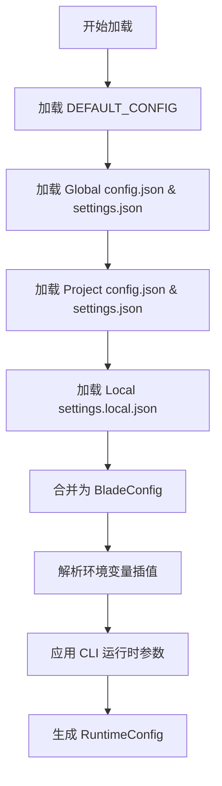
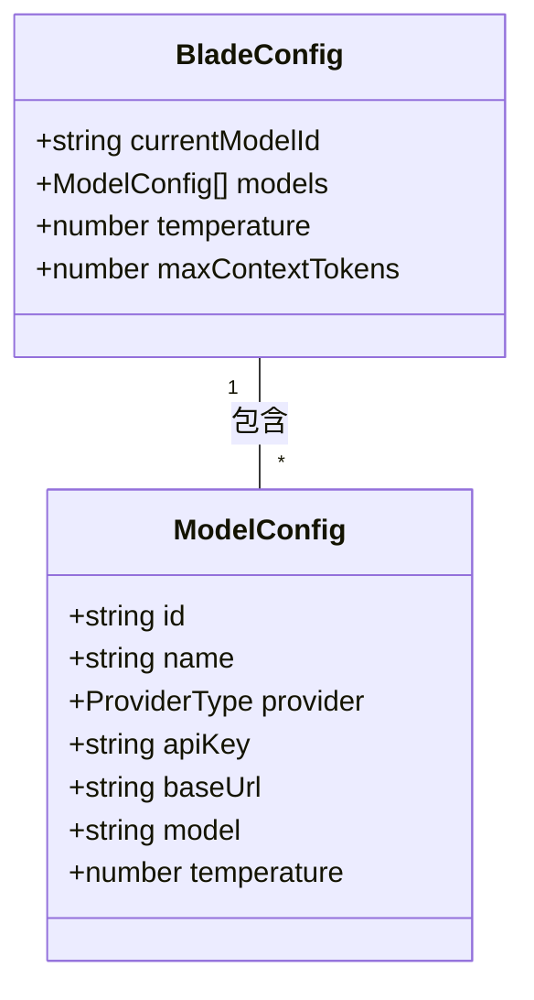
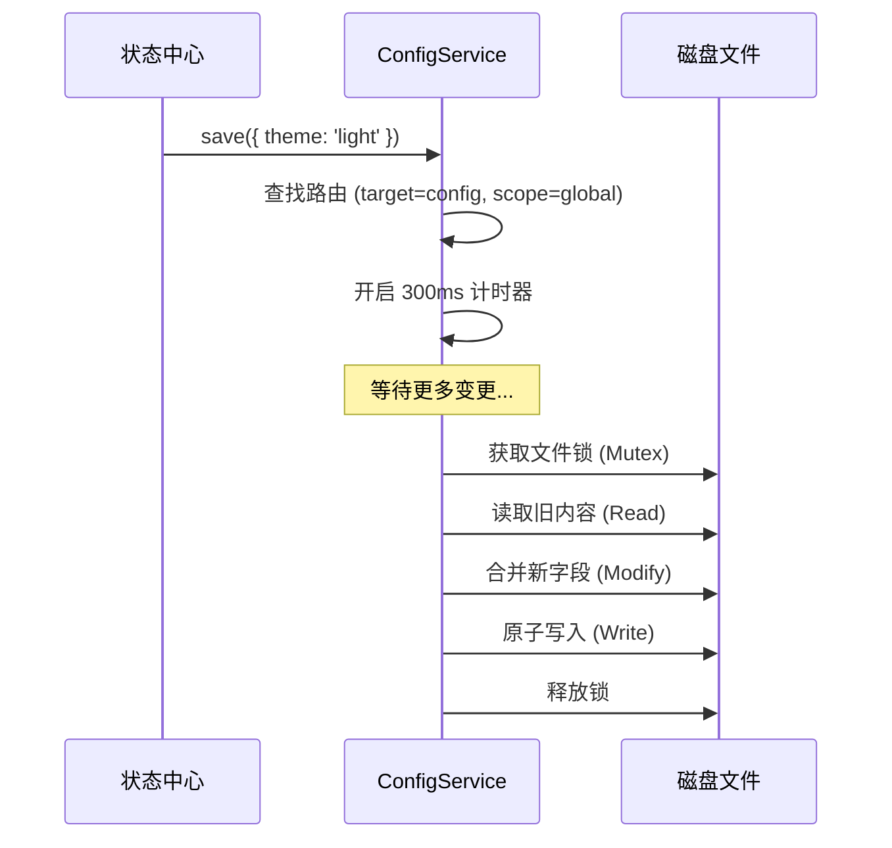

# 核心配置与模型设置

## 目录
1. [引言](#引言)
2. [模块概览](#模块概览)
3. [配置层次结构与优先级](#配置层次结构与优先级)
4. [环境变量插值解析](#环境变量插值解析)
5. [模型供应商配置指南](#模型供应商配置指南)
6. [配置文件详解：config.json vs settings.json](#配置文件详解configjson-vs-settingsjson)
7. [核心配置模板 (config.json)](#核心配置模板-configjson)
8. [配置持久化与并发安全](#配置持久化与并发安全)
9. [文件参考](#文件参考)

## 引言

Blade 的配置系统是一个高度灵活且分层的体系，旨在平衡全局一致性与项目灵活性。它不仅支持多级配置文件的自动合并，还集成了动态环境变量插值、细粒度的权限控制以及多模型供应商的无缝切换。

通过配置系统，用户可以：
- **定义模型池**：配置多个 LLM 服务（OpenAI, Anthropic, DeepSeek 等）并随时切换。
- **项目级定制**：在不同项目中使用不同的权限模式、Hooks 或环境变量。
- **安全管理**：通过环境变量引用敏感信息（如 API Key），避免泄露。
- **行为控制**：精细化管理 AI 的工具调用权限和运行限制。

## 模块概览

配置系统主要分布在 `packages/cli/src/config` 目录下，由加载器、持久化服务和类型定义组成。

- **总文件数**：约 10 个核心文件。
- **子模块分布**：
  - `config/`：核心逻辑，包括 `ConfigManager`（加载）和 `ConfigService`（保存）。
  - `cli/`：定义 CLI 命令行参数与配置的映射。
  - `defaults.ts`：定义系统的出厂设置。

该模块将作为 Blade 启动时的第一个被初始化的组件，为后续的 Agent 运行提供基础参数。

## 配置层次结构与优先级

Blade 采用三层配置结构，允许用户在全局范围定义通用设置，同时在特定项目中进行覆盖。

### 层次结构定义

1.  **Global (全局用户)**：位于 `~/.blade/`。存储用户的默认模型、API Key 及通用偏好。
2.  **Project (项目共享)**：位于项目根目录的 `.blade/`。通常包含项目特定的权限规则或 MCP 服务器配置，建议提交到 Git。
3.  **Local (项目本地)**：位于 `.blade/settings.local.json`。用于存储不希望提交到代码库的本地覆盖（如临时调试开关）。

### 优先级合并策略

当多个层次存在相同配置项时，优先级遵循：**CLI 参数 > Local > Project > Global > Defaults**。

以下流程图展示了 `ConfigManager` 如何合并这些配置来源：



**图表说明**：
配置加载过程是一个典型的“由底向上”的合并过程。`ConfigManager` 首先读取硬编码的默认值，然后依次叠加各级配置文件。特别地，对于 `mcpServers` 和 `env` 等对象字段，系统采用深度合并（Deep Merge）策略，而对于 `permissions` 数组，则采用追加去重（Append-Dedupe）策略。最后，CLI 参数具有最高优先级，可以覆盖任何持久化设置。

**图表来源**:
- [ConfigManager.ts:L64-L91](file:///Users/bytedance/Documents/GitHub/Blade/packages/cli/src/config/ConfigManager.ts#L64-L91)
- [ConfigManager.ts:L343-L402](file:///Users/bytedance/Documents/GitHub/Blade/packages/cli/src/config/ConfigManager.ts#L343-L402)

## 环境变量插值解析

为了支持跨环境部署和敏感信息保护，Blade 允许在配置文件的字符串值中使用环境变量语法。

### 支持的语法
- `$VAR`：直接引用环境变量。
- `${VAR}`：标准引用。
- `${VAR:-default}`：带默认值的引用。如果 `VAR` 未定义，则使用 `default`。

### 实现逻辑
`ConfigManager` 在完成所有配置合并后，会递归遍历配置对象，对所有字符串字段执行正则替换。

```typescript
// ConfigManager.ts 中的解析逻辑
private resolveEnvInterpolation(config: BladeConfig): void {
  const envPattern = /\$\{?([A-Z_][A-Z0-9_]*)(:-([^}]+))?\}?/g;
  const resolve = (value: string) => {
    return value.replace(envPattern, (match, varName, _, defaultValue) => {
      return process.env[varName] || defaultValue || match;
    });
  };
  // ... 递归应用到 config 字段
}
```

> **Warning**: 环境变量解析仅在加载时发生。如果在运行时修改了 `process.env`，已加载的配置不会自动更新。

## 模型供应商配置指南

Blade 支持多种主流 LLM 供应商。每个供应商的配置都封装在 `ModelConfig` 对象中。

### 支持的 Provider 类型
- `openai`：原生 OpenAI 接口。
- `anthropic`：Anthropic Claude 系列。
- `gemini`：Google Gemini 接口。
- `azure-openai`：微软 Azure 服务。
- `openai-compatible`：任何兼容 OpenAI 格式的本地或第三方转发接口（如 DeepSeek, LocalAI）。

### 核心参数对比

| 参数名 | 描述 | 示例 |
| :--- | :--- | :--- |
| `id` | 唯一标识符（内部引用） | `my-gpt4` |
| `name` | 显示名称 | `GPT-4o (Work)` |
| `provider` | 供应商类型 | `openai-compatible` |
| `apiKey` | API 密钥（支持环境变量） | `${OPENAI_API_KEY}` |
| `baseUrl` | 接口地址 | `https://api.deepseek.com/v1` |
| `model` | 模型 ID | `deepseek-chat` |
| `temperature` | 采样温度 (0.0 - 2.0) | `0.7` |

### 模型配置关系图



**图表说明**：
`BladeConfig` 维护了一个模型池（`models` 数组）和当前激活的模型 ID（`currentModelId`）。这种结构允许用户预置多套方案（例如：一套本地轻量模型用于简单任务，一套昂贵的云端模型用于复杂逻辑），并通过简单的 ID 切换实现热更新。

**图表来源**:
- [types.ts:L53-L69](file:///Users/bytedance/Documents/GitHub/Blade/packages/cli/src/config/types.ts#L53-L69)
- [types.ts:L79-L138](file:///Users/bytedance/Documents/GitHub/Blade/packages/cli/src/config/types.ts#L79-L138)

## 配置文件详解：config.json vs settings.json

Blade 将配置拆分为两个文件，以区分“静态基础设施”和“动态行为策略”。

### 1. config.json (核心配置)
负责定义“系统是什么”。
- **职责**：模型定义、UI 主题、语言设置、MCP 服务器列表。
- **持久化策略**：通常存储在 Global 层。

### 2. settings.json (行为配置)
负责定义“系统怎么做”。
- **职责**：工具调用权限（allow/ask/deny）、环境变量（env）、Hooks 脚本、最大轮次限制。
- **持久化策略**：通常存储在 Project 或 Local 层，以便随项目代码同步。

### 职责对比表

| 特性 | config.json | settings.json |
| :--- | :--- | :--- |
| **主要内容** | 模型 API、UI 偏好 | 权限、Hooks、项目变量 |
| **默认位置** | `~/.blade/config.json` | `./.blade/settings.json` |
| **持久化层级** | Global | Project / Local |
| **是否建议 Git 提交** | 否（含 API Key） | 是（共享项目规范） |

## 核心配置模板 (config.json)

以下是一个完整的 `config.json` 示例，展示了如何配置多个供应商和 MCP 服务器。

```json
{
  "currentModelId": "deepseek-pro",
  "models": [
    {
      "id": "deepseek-pro",
      "name": "DeepSeek Chat",
      "provider": "openai-compatible",
      "apiKey": "${DEEPSEEK_API_KEY}",
      "baseUrl": "https://api.deepseek.com/v1",
      "model": "deepseek-chat",
      "temperature": 0.5
    },
    {
      "id": "claude-3-5",
      "name": "Claude 3.5 Sonnet",
      "provider": "anthropic",
      "apiKey": "${ANTHROPIC_API_KEY}",
      "model": "claude-3-5-sonnet-20240620"
    }
  ],
  "mcpServers": {
    "filesystem": {
      "type": "stdio",
      "command": "npx",
      "args": ["-y", "@modelcontextprotocol/server-filesystem", "/Users/me/data"]
    }
  },
  "theme": "dracula",
  "language": "zh-CN"
}
```

## 配置持久化与并发安全

`ConfigService` 负责将运行时的配置变更写回磁盘。为了保证性能和数据一致性，它引入了多项优化机制。

### 核心机制
1.  **字段路由**：根据 `FIELD_ROUTING_TABLE` 自动决定某个字段应该保存到 `config.json` 还是 `settings.json`。
2.  **写防抖 (Debounce)**：连续的配置修改（如 UI 拖拽）会合并在 300ms 后一次性写入。
3.  **原子写入**：使用 `write-file-atomic` 确保在写入过程中发生崩溃不会损坏原始文件。
4.  **并发互斥 (Mutex)**：通过 `async-mutex` 确保同一时间只有一个进程在修改特定的配置文件。

### 持久化流程



**图表说明**：
配置保存是一个典型的“读-改-写”（Read-Modify-Write）循环。`ConfigService` 首先根据字段名确定目标文件，然后进入防抖阶段以合并短时间内的多次更新。在执行写入时，它会获取文件锁以防止竞态条件，读取当前磁盘内容以保留未知字段（向前兼容），最后执行原子写入。

**图表来源**:
- [ConfigService.ts:L426-L447](file:///Users/bytedance/Documents/GitHub/Blade/packages/cli/src/config/ConfigService.ts#L426-L447)
- [ConfigService.ts:L682-L738](file:///Users/bytedance/Documents/GitHub/Blade/packages/cli/src/config/ConfigService.ts#L682-L738)

## 文件参考

以下是配置系统涉及的核心源码文件：

- [ConfigManager.ts](file:///Users/bytedance/Documents/GitHub/Blade/packages/cli/src/config/ConfigManager.ts)：配置加载与合并的核心逻辑。
- [ConfigService.ts](file:///Users/bytedance/Documents/GitHub/Blade/packages/cli/src/config/ConfigService.ts)：配置持久化服务与字段路由表。
- [types.ts](file:///Users/bytedance/Documents/GitHub/Blade/packages/cli/src/config/types.ts)：配置对象的 TypeScript 类型定义。
- [defaults.ts](file:///Users/bytedance/Documents/GitHub/Blade/packages/cli/src/config/defaults.ts)：默认权限规则与系统参数。
- [cli/config.ts](file:///Users/bytedance/Documents/GitHub/Blade/packages/cli/src/cli/config.ts)：CLI 命令行参数定义。
- [index.ts](file:///Users/bytedance/Documents/GitHub/Blade/packages/cli/src/config/index.ts)：模块公共导出。
