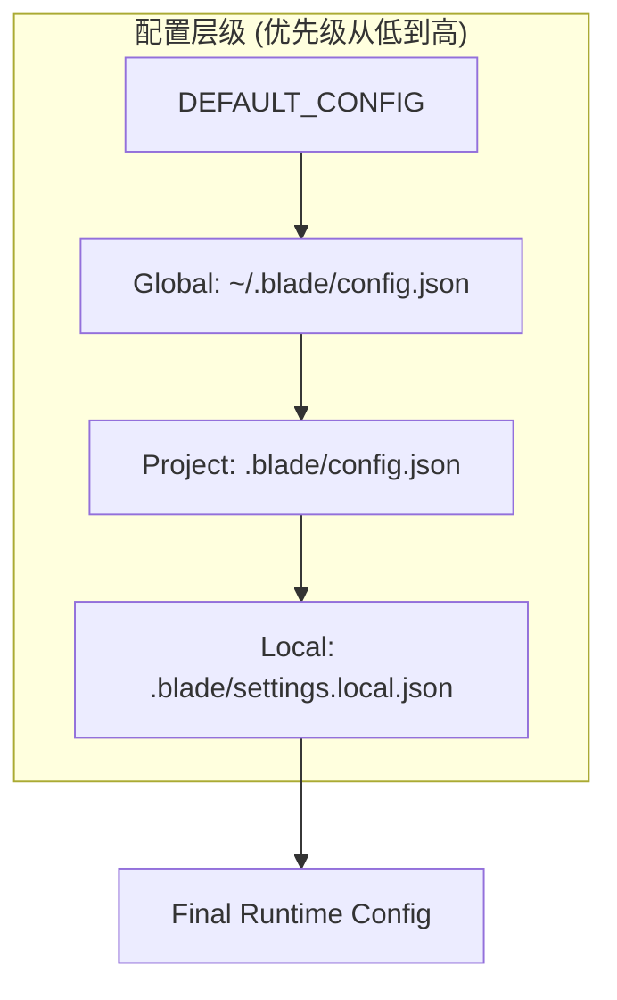
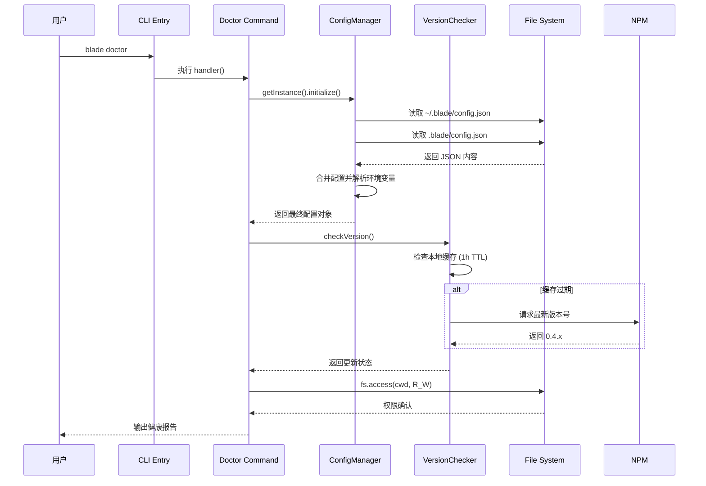
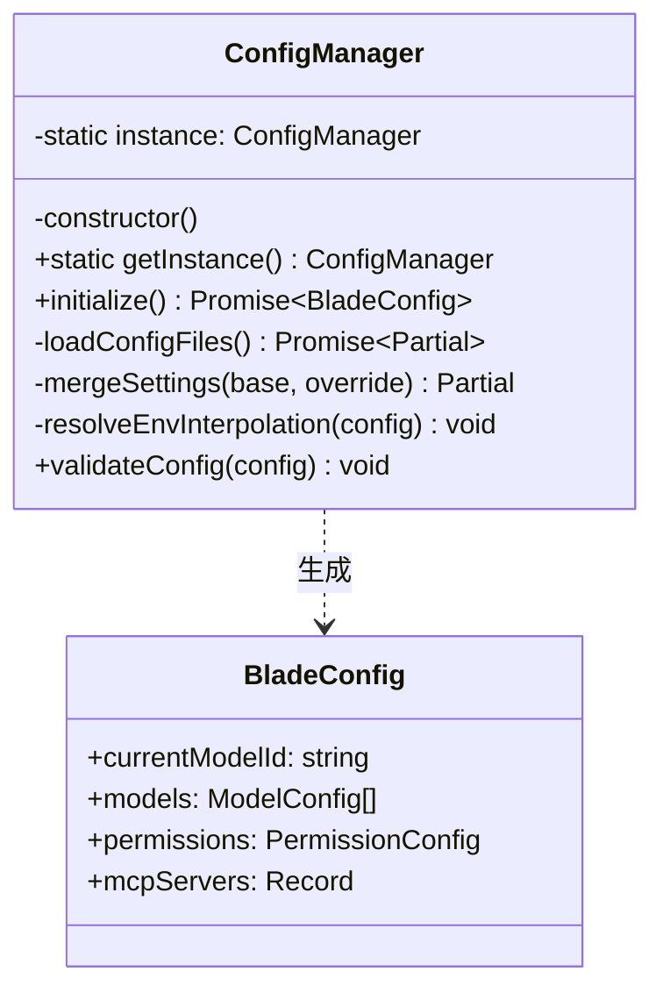
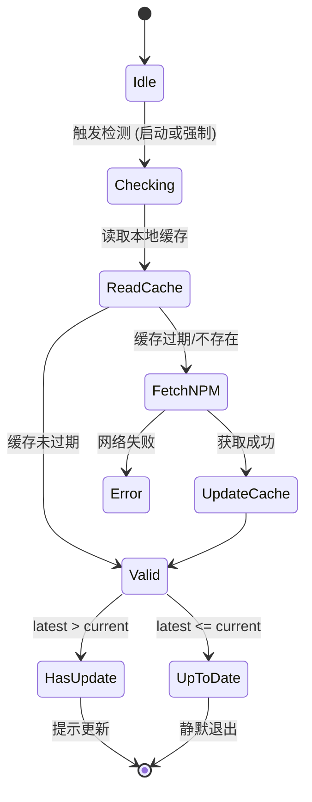

# 环境要求与健康检查

## 目录
1. [模块概览](#模块概览)
2. [引言](#引言)
3. [操作系统兼容性](#操作系统兼容性)
4. [运行环境要求](#运行环境要求)
   - [Node.js 运行时](#nodejs-运行时)
   - [Bun 运行时](#bun-运行时)
5. [核心组件：健康检查机制](#核心组件健康检查机制)
   - [blade doctor 命令实现](#blade-doctor-命令实现)
   - [VersionChecker 服务](#versionchecker-服务)
6. [关键逻辑：配置初始化与验证](#关键逻辑配置初始化与验证)
   - [ConfigManager 单例模式](#configmanager-单例模式)
   - [多层级配置合并策略](#多层级配置合并策略)
   - [环境变量插值解析](#环境变量插值解析)
7. [架构视图：环境检测与配置流](#架构视图环境检测与配置流)
8. [常见环境问题与解决方案](#常见环境问题与解决方案)
   - [权限访问受限 (EACCES)](#权限访问受限-eacces)
   - [Node.js 版本不匹配](#nodejs-版本不匹配)
   - [依赖缺失或损坏](#依赖缺失或损坏)
9. [数据模型与配置参考](#数据模型与配置参考)
10. [文件参考](#文件参考)

## 模块概览

在 Blade 项目的开发与部署过程中，环境的稳定性是确保 AI 代码助手能够高效运行的前提。本模块主要涉及 `packages/cli` 目录下的环境检测与配置管理逻辑。该目录作为 Blade 的核心入口，包含超过 200 个源文件，负责从底层系统交互到上层 UI 渲染的全流程。

在本章节中，我们将重点探讨以下子模块及其在环境保障中的作用：
- **`src/commands/doctor.ts`**: 健康检查命令的核心实现，负责协调各项环境指标的检测。
- **`src/config/ConfigManager.ts`**: 配置管理单例，负责多层级配置文件的加载、合并及环境变量解析。
- **`src/services/VersionChecker.ts`**: 版本检查服务，确保用户始终运行在经过验证的最新版本上。
- **`src/utils/`**: 包含文件系统访问、路径安全校验等底层工具函数。

通过本章节，读者将理解 Blade 如何通过自动化的手段确保开发环境满足运行条件，并掌握手动排查环境故障的方法。

## 引言

Blade 是一款基于 AI 驱动的智能代码助手，其运行依赖于高性能的 JavaScript 运行时和稳定的文件系统访问权限。由于 Blade 需要频繁地读取项目源代码、调用远程 LLM API 以及在本地维护会话状态，任何微小的环境偏差（如 Node.js 版本过低或磁盘写权限缺失）都可能导致分析失败或性能下降。

为了降低用户的上手门槛，Blade 构建了一套“主动式环境保障体系”。这套体系由 `blade doctor` 命令驱动，结合了配置验证、版本追踪和权限审计。它不仅是安装后的验证步骤，更是排查复杂运行问题的首要手段。通过本页面，您将深入了解 Blade 的环境要求及其背后的技术实现。

## 操作系统兼容性

Blade 采用了跨平台适配层，确保在主流操作系统上表现一致。以下是各平台的详细支持矩阵：

| 操作系统 | 支持级别 | 推荐配置 | 关键依赖项 |
| :--- | :--- | :--- | :--- |
| **macOS** | **Tier 1 (原生)** | macOS 12+ (Monterey) | 依赖 `node-pty` 进行终端模拟，支持原生 Apple Silicon。 |
| **Linux** | **Tier 1 (原生)** | Ubuntu 22.04+, Fedora 38+ | 需安装 `python3` 和 `build-essential` 以编译某些 C++ 模块。 |
| **Windows** | **Tier 2 (兼容)** | Windows 10/11 (WSL2) | **强烈建议使用 WSL2**。在原生 CMD 中，某些 ANSI 转义序列可能无法正确渲染。 |

> **📝 注意**: 在 Windows 环境下，如果未使用 WSL2，请确保终端支持 UTF-8 编码，否则 AI 生成的中文字符可能会出现乱码。

## 运行环境要求

### Node.js 运行时

尽管 Blade 的某些构建脚本使用 Bun，但其核心运行逻辑严格遵循 Node.js 规范，并利用了大量现代 Node.js 特性。

- **最低要求**: `v20.0.0`
- **推荐版本**: `v22.x` (LTS)
- **技术背后的考量**: Blade 深度集成了 `undici`（Node.js 原生 fetch 实现）和 `AsyncLocalStorage`（用于在异步调用链中传递上下文）。这些特性在 `v20` 之后才达到生产级稳定。如果版本低于 `v20`，`blade doctor` 将发出严重警告。

### Bun 运行时

Bun 在 Blade 的 monorepo 开发流中扮演着加速器的角色。

- **版本要求**: `^1.3.11`
- **核心用途**: 
  - **依赖管理**: `bun install` 相比 npm 提速约 10 倍。
  - **测试驱动**: 使用 `bun test` 运行数千个单元测试。
  - **脚本运行**: 所有的 `package.json` 脚本均通过 `bun run` 调用，以减少启动延迟。

## 核心组件：健康检查机制

### blade doctor 命令实现

`blade doctor` 是用户验证环境的首要入口。它通过一系列原子化的检查项，对当前系统的健康状况进行“体检”。

```typescript
// packages/cli/src/commands/doctor.ts 逻辑片段
export const doctorCommands: CommandModule<{}, DoctorOptions> = {
  command: 'doctor',
  describe: 'Check the health of your Blade installation',
  handler: async () => {
    console.log('Running Blade health check...\n');
    let issues = 0;

    // 1. 验证配置
    try {
      const configManager = ConfigManager.getInstance();
      await configManager.initialize();
      console.log('[OK] Configuration: OK');
    } catch (error) {
      console.log('[FAIL] Configuration: FAILED');
      issues++;
    }

    // 2. 验证运行时
    const nodeVersion = process.version;
    if (semver.gte(nodeVersion, '20.0.0')) {
      console.log(`[OK] Node.js version: ${nodeVersion}`);
    } else {
      console.log(`[WARN] Node.js version: ${nodeVersion} (recommended: v20+)`);
      issues++;
    }
  },
};
```

### VersionChecker 服务

除了本地环境检查，Blade 还会通过 `VersionChecker` 确保软件本身的及时更新。

```typescript
// packages/cli/src/services/VersionChecker.ts 核心逻辑
export async function checkVersion(forceCheck = false): Promise<VersionCheckResult> {
  const currentVersion = await getCurrentVersion();
  const cache = await readCache();
  
  let latestVersion: string | null = null;
  if (!forceCheck && cache && Date.now() - cache.checkedAt < CACHE_TTL) {
    latestVersion = cache.latestVersion;
  } else {
    latestVersion = await fetchLatestVersion(); // 请求 npm registry
    if (latestVersion) {
      await writeCache({ latestVersion, checkedAt: Date.now() });
    }
  }

  const hasUpdate = semver.gt(latestVersion, currentVersion);
  return { currentVersion, latestVersion, hasUpdate };
}
```

**逻辑说明**: `VersionChecker` 采用“缓存优先”策略。它会在用户主目录下维护一个 `version-cache.json` 文件，默认缓存有效期为 1 小时。这种设计避免了每次启动 CLI 时都发起网络请求，从而保证了极致的启动速度。

## 关键逻辑：配置初始化与验证

### ConfigManager 单例模式与合并策略

Blade 使用单例模式管理配置加载。其核心挑战在于如何处理多层级配置文件的深度合并。



**合并逻辑示例**:
```typescript
// packages/cli/src/config/ConfigManager.ts
private mergeSettings(base: Partial<BladeConfig>, override: Partial<BladeConfig>): Partial<BladeConfig> {
  const result = JSON.parse(JSON.stringify(base));
  
  // 权限字段：数组追加并去重
  if (override.permissions) {
    result.permissions.allow = Array.from(new Set([...result.permissions.allow, ...override.permissions.allow]));
  }
  
  // 钩子与环境变量：深度合并
  if (override.hooks) {
    result.hooks = merge({}, result.hooks, override.hooks);
  }
  
  return result;
}
```

### 环境变量插值解析

为了安全起见，Blade 支持在配置文件中使用环境变量占位符。

```typescript
// packages/cli/src/config/ConfigManager.ts
private resolveEnvInterpolation(config: BladeConfig): void {
  const envPattern = /\$\{?([A-Z_][A-Z0-9_]*)(:-([^}]+))?\}?/g;
  
  const resolve = (value: string) => {
    return value.replace(envPattern, (match, varName, _, defaultValue) => {
      return process.env[varName] || defaultValue || match;
    });
  };
  // ... 递归解析配置对象中的所有字符串 ...
}
```

## 架构视图：环境检测与配置流

下面的序列图展示了 Blade 启动时如何协调环境检查与配置加载。



**图表说明**: 
该图展示了 `blade doctor` 的核心执行流。重点在于 `ConfigManager` 如何从多个文件系统位置收集信息，以及 `VersionChecker` 如何平衡检查频率与启动性能。整个过程是高度异步的，以确保即使网络请求缓慢，也不会阻塞本地环境的初步诊断。

## 常见环境问题与解决方案

### 权限访问受限 (EACCES)

**现象**: 提示 `File system permissions: FAILED` 或无法写入 `~/.blade/`。
**原因**: 通常发生在以 `sudo` 安装全局包后，配置目录的所有者变更为 `root`。
**修复**: 
```bash
sudo chown -R $(whoami) ~/.blade
```

### Node.js 版本不匹配

**现象**: 出现 `Error: Unexpected token '?'`。
**原因**: 旧版 Node.js 不支持 `?.`（可选链）运算符。
**修复**: 使用 `nvm` 升级：
```bash
nvm install 22 && nvm use 22
```

### 依赖缺失或损坏

**现象**: `doctor` 提示 `Missing required dependencies`。
**原因**: `npm install` 过程中断导致 `node-pty` 等原生模块未正确编译。
**修复**: 重新安装：
```bash
npm install -g blade-code --force
```

## 数据模型与配置参考

### ConfigManager 类图



### 版本检查状态机



## 文件参考

以下是本章节涉及的核心源文件：

**环境检查与版本控制**:
- [packages/cli/src/commands/doctor.ts](file:///Users/bytedance/Documents/GitHub/Blade/packages/cli/src/commands/doctor.ts) - 健康检查主逻辑。
- [packages/cli/src/services/VersionChecker.ts](file:///Users/bytedance/Documents/GitHub/Blade/packages/cli/src/services/VersionChecker.ts) - 版本更新检测服务。

**配置管理系统**:
- [packages/cli/src/config/ConfigManager.ts](file:///Users/bytedance/Documents/GitHub/Blade/packages/cli/src/config/ConfigManager.ts) - 多级配置加载器。
- [packages/cli/src/config/defaults.ts](file:///Users/bytedance/Documents/GitHub/Blade/packages/cli/src/config/defaults.ts) - 系统默认配置定义。
- [packages/cli/src/config/types.ts](file:///Users/bytedance/Documents/GitHub/Blade/packages/cli/src/config/types.ts) - 配置相关的类型定义。

**底层工具**:
- [packages/cli/src/utils/cwd.ts](file:///Users/bytedance/Documents/GitHub/Blade/packages/cli/src/utils/cwd.ts) - 跨平台工作目录处理。
- [packages/cli/src/utils/proxyFetch.ts](file:///Users/bytedance/Documents/GitHub/Blade/packages/cli/src/utils/proxyFetch.ts) - 支持代理的网络请求工具。
