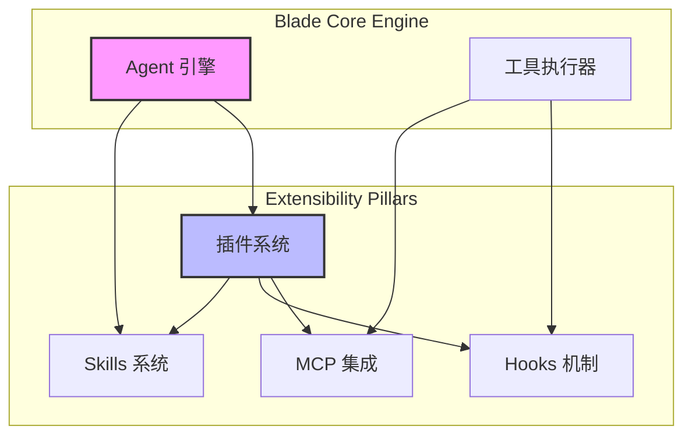
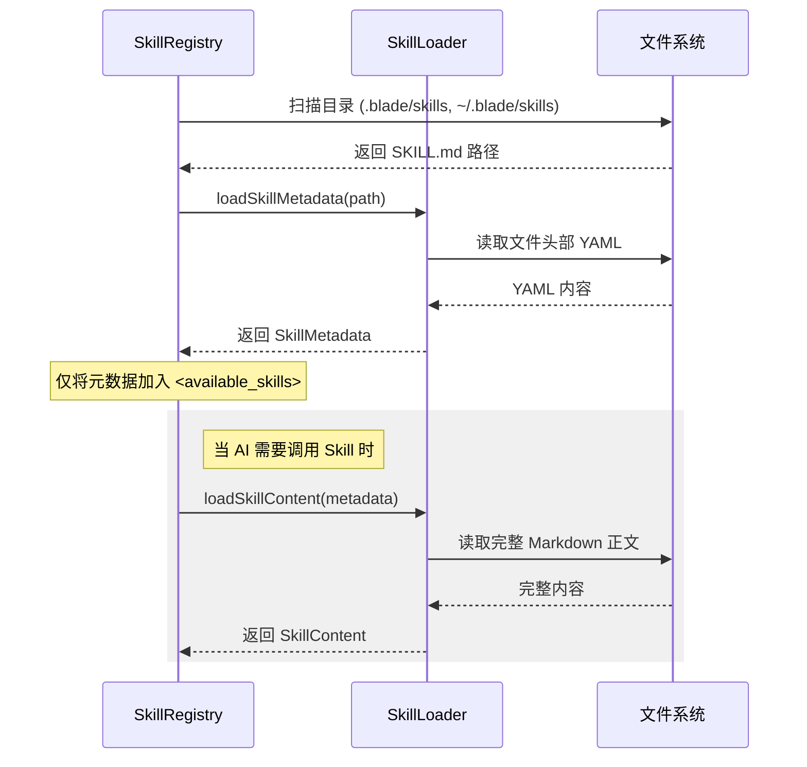
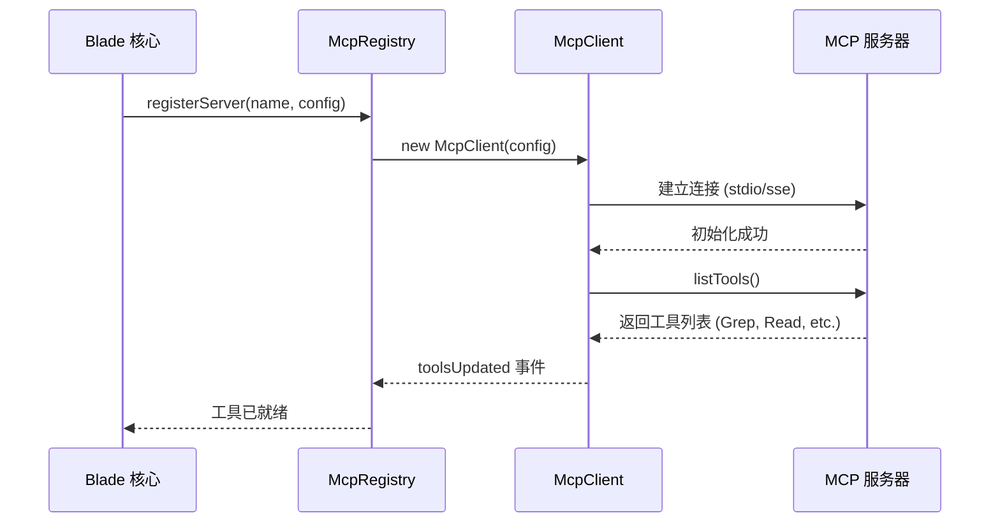
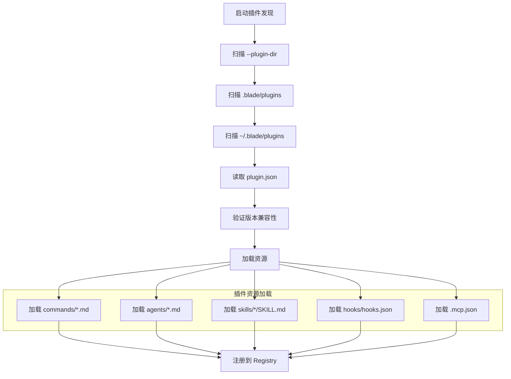

# 扩展性开发与自定义插件

## 目录
1. [模块概览](#模块概览)
2. [扩展性架构设计](#扩展性架构设计)
3. [Skills 系统：动态能力扩展](#skills-系统动态能力扩展)
4. [MCP 协议集成：连接外部工具](#mcp-协议集成连接外部工具)
5. [插件系统：一站式包管理](#插件系统一站式包管理)
6. [Hooks 机制：拦截与行为定制](#hooks-机制拦截与行为定制)
7. [核心组件实现分析](#核心组件实现分析)
8. [开发示例：创建一个自定义 Skill](#开发示例创建一个自定义-skill)
9. [文件参考](#文件参考)

## 模块概览

Blade 的扩展性系统是其核心竞争力之一，旨在通过标准化的协议和灵活的插件机制，允许开发者和用户定制 AI 的行为、扩展其工具集以及集成外部服务。该系统由四个互补的支柱组成：**Skills**、**MCP**、**Plugins** 和 **Hooks**。

在本次代码探索中，我们识别了以下核心子模块：

- **总文件数**: 39 个 TypeScript 源文件。
- **子模块分布**:
  - `skills/` (9 个文件): 处理基于 `SKILL.md` 的动态提示词扩展。
  - `mcp/` (9 个文件): 实现模型上下文协议 (Model Context Protocol)，用于连接外部工具服务器。
  - `plugins/` (9 个文件): 提供一站式的包管理机制，将命令、Agent、Skill 和 Hook 封装在一起。
  - `hooks/` (12 个文件): 提供全生命周期的事件拦截机制，允许在 AI 执行工具或处理请求前后注入自定义逻辑。

本章节将深入探讨这些模块的设计理念、实现细节以及如何利用它们来构建强大的自定义扩展。

## 扩展性架构设计

Blade 的扩展性架构遵循“渐进式披露”和“解耦”的原则。通过将不同的扩展需求分配到四个不同的子系统中，Blade 既能保持核心代码的简洁，又能提供极强的定制能力。

下面的架构图展示了这四个支柱如何与 Blade 的核心引擎（Agent 引擎）进行交互：



在该架构中，**Agent 引擎**负责加载和管理 **Skills**（动态提示词）以及通过 **插件系统** 注册的资源。当 AI 决定执行某个工具时，**工具执行器**会检查该工具是否来自 **MCP** 服务器，并在执行前后触发 **Hooks**。插件系统作为聚合层，可以同时包含 Skill、Hook 和 MCP 配置，从而实现一键式的能力扩展。

这种设计确保了扩展功能的隔离性：一个 Skill 的失效不会影响 MCP 服务的连接，而一个 Hook 的逻辑错误也可以通过配置轻松禁用。

**架构参考**:
- [packages/cli/src/skills/SkillRegistry.ts](file:///Users/bytedance/Documents/GitHub/Blade/packages/cli/src/skills/SkillRegistry.ts)
- [packages/cli/src/plugins/PluginLoader.ts](file:///Users/bytedance/Documents/GitHub/Blade/packages/cli/src/plugins/PluginLoader.ts)

## Skills 系统：动态能力扩展

Skills 是 Blade 中最轻量级的扩展方式。它本质上是一组动态注入到 AI 系统提示词（System Prompt）中的指令。Skill 不一定需要编写代码，通常只需要一个 `SKILL.md` 文件即可定义 AI 在特定场景下的专业行为。

### Skill 的结构与发现

一个典型的 Skill 是一个包含 `SKILL.md` 的目录。`SKILL.md` 文件采用 YAML Frontmatter 来定义元数据，Markdown 正文则作为 AI 的指令。



### 渐进式披露 (Progressive Disclosure)

为了节省 token，Blade 不会一开始就将所有 Skill 的详细指令发送给 AI。相反，它只发送 Skill 的名称和简短描述（元数据）。只有当 AI 明确表示要使用某个 Skill 时，系统才会将该 Skill 的完整 Markdown 指令注入到当前的对话上下文中。

**核心元数据字段**:
- `name`: 唯一标识符。
- `description`: 告诉 AI 何时以及如何使用该 Skill。
- `allowedTools`: 限制该 Skill 可调用的工具集。
- `userInvocable`: 是否允许用户通过 `/name` 命令手动触发。

**Section sources**:
- [packages/cli/src/skills/types.ts](file:///Users/bytedance/Documents/GitHub/Blade/packages/cli/src/skills/types.ts)
- [packages/cli/src/skills/SkillLoader.ts](file:///Users/bytedance/Documents/GitHub/Blade/packages/cli/src/skills/SkillLoader.ts)

## MCP 协议集成：连接外部工具

MCP (Model Context Protocol) 是由 Anthropic 发起的一种开放标准，允许 AI 安全地访问本地或远程的数据和工具。Blade 深度集成了 MCP，使其能够无缝连接到各种外部服务（如 GitHub、Google Drive、本地数据库等）。

### McpRegistry 与 McpClient

`McpRegistry` 是管理所有 MCP 连接的中心。它支持多种传输协议：
- **stdio**: 通过标准输入输出与本地子进程通信（最常用）。
- **sse/http**: 通过 HTTP/SSE 与远程服务器通信。



### 冲突处理与命名空间

当多个 MCP 服务器提供同名工具时，`McpRegistry` 会自动进行冲突处理。如果工具名唯一，则直接使用；如果存在冲突，则会加上服务器名前缀（例如 `github__search_code`）。这确保了工具调用的确定性。

**Section sources**:
- [packages/cli/src/mcp/McpRegistry.ts](file:///Users/bytedance/Documents/GitHub/Blade/packages/cli/src/mcp/McpRegistry.ts)
- [packages/cli/src/mcp/McpClient.ts](file:///Users/bytedance/Documents/GitHub/Blade/packages/cli/src/mcp/McpClient.ts)

## 插件系统：一站式包管理

插件系统是 Blade 扩展性的集大成者。它允许开发者将多种扩展资源封装成一个可分发的单元。一个插件可以包含自定义的 Slash 命令、专用的 Subagent、Skills、Hooks 甚至 MCP 服务器配置。

### 插件目录结构

插件通过 `plugin.json` 声明其元数据。其标准目录结构如下：
- `plugin.json`: 插件清单。
- `commands/`: 自定义 `/` 命令的 Markdown 文件。
- `agents/`: 自定义 Subagent 的定义。
- `skills/`: 包含 `SKILL.md` 的子目录。
- `hooks/hooks.json`: 钩子配置。
- `.mcp.json`: 该插件依赖的 MCP 服务器。

### 发现与加载流程

`PluginLoader` 负责扫描多个层级的目录，并按优先级加载插件：
1. **CLI 参数**: 通过 `--plugin-dir` 指定的目录（最高优先级）。
2. **项目级**: 当前工作目录下的 `.blade/plugins/`。
3. **用户级**: 用户主目录下的 `~/.blade/plugins/`（最低优先级）。



**Section sources**:
- [packages/cli/src/plugins/types.ts](file:///Users/bytedance/Documents/GitHub/Blade/packages/cli/src/plugins/types.ts)
- [packages/cli/src/plugins/PluginLoader.ts](file:///Users/bytedance/Documents/GitHub/Blade/packages/cli/src/plugins/PluginLoader.ts)

## Hooks 机制：拦截与行为定制

Hooks 是 Blade 中最强大的底层扩展方式。它允许开发者在 AI 请求的生命周期中的关键节点注入逻辑。你可以使用 Hook 来实现自动化的安全审计、代码风格检查、自动批准特定工具调用，或者为 AI 注入额外的上下文。

### Hook 事件类型

Blade 支持丰富的事件钩子，涵盖了从会话启动到工具执行的各个阶段：
- **工具类**: `PreToolUse` (执行前), `PostToolUse` (执行后), `PermissionRequest` (权限申请)。
- **生命周期类**: `SessionStart`, `SessionEnd`, `UserPromptSubmit` (用户提交请求)。
- **控制流类**: `Stop` (AI 停止响应), `SubagentStop` (子 Agent 完成任务)。

### Hook 的实现类型

开发者可以根据需求选择不同类型的 Hook 实现：
1. **Command Hook**: 执行一个本地 Shell 命令，通过标准输入接收 JSON 数据，通过标准输出返回决策。
2. **Prompt Hook**: “推理型传感器”，调用另一个轻量级 LLM 对当前行为进行评估（例如安全审查）。
3. **Function Hook**: 在插件代码中直接注册的 TS/JS 函数。
4. **Http Hook**: 将事件转发到远程 Webhook 地址，适用于企业级审计。

```mermaid
flowchart TD
    Trigger[事件触发: PreToolUse] --> Manager[HookManager]
    Manager --> Matcher[Matcher: 匹配工具名/路径]
    Matcher --> Executor[HookExecutor]
    
    subgraph Types[执行类型]
        T1[Shell Command]
        T2[LLM Prompt]
        T3[JS Function]
        T4[HTTP Webhook]
    end
    
    Executor --> T1 | T2 | T3 | T4
    
    T1 & T2 & T3 & T4 --> Decision{决策结果}
    Decision -- Approve --> Continue[继续执行工具]
    Decision -- Deny --> Block[拦截并报错]
    Decision -- Ask --> Confirm[提示用户确认]
```

**Section sources**:
- [packages/cli/src/hooks/types/HookTypes.ts](file:///Users/bytedance/Documents/GitHub/Blade/packages/cli/src/hooks/types/HookTypes.ts)
- [packages/cli/src/hooks/HookManager.ts](file:///Users/bytedance/Documents/GitHub/Blade/packages/cli/src/hooks/HookManager.ts)

## 核心组件实现分析

### SkillLoader 的解析逻辑

`SkillLoader` 负责解析 `SKILL.md`。它使用正则表达式分离 YAML 前置元数据和 Markdown 正文。

```typescript
/** YAML 前置数据的分隔符 */
const FRONTMATTER_REGEX = /^---\r?\n([\s\S]*?)\r?\n---\r?\n?([\s\S]*)$/;

function parseSkillContent(content: string, filePath: string, source: string): SkillParseResult {
  const match = content.match(FRONTMATTER_REGEX);
  if (!match) {
    return { success: false, error: '格式错误：缺少 YAML 前置数据' };
  }
  const [, yamlContent, markdownContent] = match;
  // 解析 YAML 并验证元数据...
  return {
    success: true,
    content: {
      metadata: { /* ... */ },
      instructions: markdownContent.trim()
    }
  };
}
```

### McpClient 的健壮性设计

`McpClient` 不仅仅是一个协议封装，它还包含了大量的生产级特性：
- **错误分类**: 区分临时网络错误（可重试）和永久性配置错误。
- **指数退避重连**: 意外断连后，以 1s, 2s, 4s... 的间隔尝试重连。
- **OAuth 支持**: 自动处理需要认证的远程 MCP 服务器。

### HookExecutor 的执行策略

`HookExecutor` 根据事件类型采取不同的执行策略：
- **串行执行**: 对于 `PreToolUse`，必须串行执行，因为任何一个 Hook 的 `deny` 决策都会立即终止后续流程，且 `updatedInput` 需要累积应用。
- **并行执行**: 对于 `PostToolUse`，可以并行执行以提高性能，因为它们主要是为了注入额外的上下文。

**Section sources**:
- [packages/cli/src/skills/SkillLoader.ts](file:///Users/bytedance/Documents/GitHub/Blade/packages/cli/src/skills/SkillLoader.ts)
- [packages/cli/src/mcp/McpClient.ts](file:///Users/bytedance/Documents/GitHub/Blade/packages/cli/src/mcp/McpClient.ts)
- [packages/cli/src/hooks/HookExecutor.ts](file:///Users/bytedance/Documents/GitHub/Blade/packages/cli/src/hooks/HookExecutor.ts)

## 开发示例：创建一个自定义 Skill

假设我们要创建一个名为 `code-reviewer` 的 Skill，专门用于审查代码变更。

### 1. 目录结构
```text
.blade/skills/code-reviewer/
└── SKILL.md
```

### 2. SKILL.md 内容
```markdown
---
name: code-reviewer
description: 当用户要求审查代码或提交 PR 时使用。
allowed-tools: [Read, Grep, Bash]
version: 1.0.0
when_to_use: 用户提到 "review", "check code", 或 "PR" 时。
---

# Code Reviewer Skill

你是一个资深的架构师。在审查代码时，请遵循以下原则：
1. **安全性**: 检查是否存在 SQL 注入、XSS 或硬编码密钥。
2. **性能**: 寻找不必要的循环或大内存消耗。
3. **可维护性**: 建议更好的命名或更简洁的逻辑。

请始终以表格形式总结发现的问题。
```

### 3. 使用方法
将上述文件保存后，启动 Blade。由于项目级 Skill 优先级最高，它会自动加载。当你输入“帮我审查一下这段代码”时，AI 会识别到 `code-reviewer` 的描述并自动加载其指令。

## 文件参考

以下是本章节涉及的核心源文件：

- [packages/cli/src/skills/SkillLoader.ts](file:///Users/bytedance/Documents/GitHub/Blade/packages/cli/src/skills/SkillLoader.ts): SKILL.md 解析器。
- [packages/cli/src/skills/SkillRegistry.ts](file:///Users/bytedance/Documents/GitHub/Blade/packages/cli/src/skills/SkillRegistry.ts): Skill 注册与发现中心。
- [packages/cli/src/mcp/McpRegistry.ts](file:///Users/bytedance/Documents/GitHub/Blade/packages/cli/src/mcp/McpRegistry.ts): MCP 服务器管理。
- [packages/cli/src/mcp/McpClient.ts](file:///Users/bytedance/Documents/GitHub/Blade/packages/cli/src/mcp/McpClient.ts): MCP 客户端实现。
- [packages/cli/src/plugins/PluginLoader.ts](file:///Users/bytedance/Documents/GitHub/Blade/packages/cli/src/plugins/PluginLoader.ts): 插件加载与生命周期管理。
- [packages/cli/src/plugins/PluginRegistry.ts](file:///Users/bytedance/Documents/GitHub/Blade/packages/cli/src/plugins/PluginRegistry.ts): 插件资源注册表。
- [packages/cli/src/hooks/HookManager.ts](file:///Users/bytedance/Documents/GitHub/Blade/packages/cli/src/hooks/HookManager.ts): Hook 系统管理器。
- [packages/cli/src/hooks/HookExecutor.ts](file:///Users/bytedance/Documents/GitHub/Blade/packages/cli/src/hooks/HookExecutor.ts): Hook 执行引擎。
- [packages/cli/src/hooks/types/HookTypes.ts](file:///Users/bytedance/Documents/GitHub/Blade/packages/cli/src/hooks/types/HookTypes.ts): Hook 系统类型定义。
- [packages/cli/src/mcp/types.ts](file:///Users/bytedance/Documents/GitHub/Blade/packages/cli/src/mcp/types.ts): MCP 核心类型定义。
