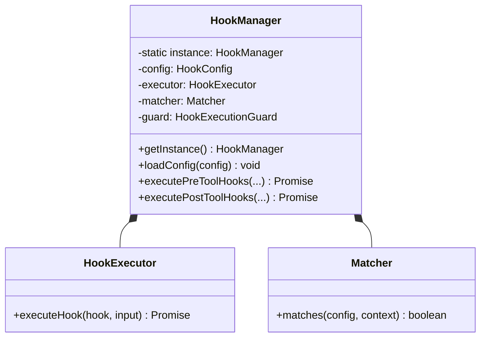
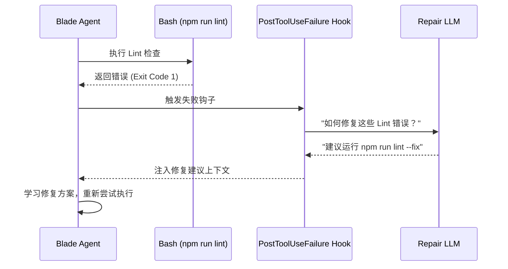

# Hook 钩子机制与行为拦截

## 目录
1. [模块概览](#模块概览)
2. [设计初衷：为什么需要 Hook 系统？](#设计初衷为什么需要-hook-系统)
3. [核心架构设计](#核心架构设计)
   - [单例模式与全局状态管理](#单例模式与全局状态管理)
   - [执行流水线集成](#执行流水线集成)
4. [钩子阶段 (Stages) 全解析](#钩子阶段-stages-全解析)
   - [工具生命周期钩子](#工具生命周期钩子)
   - [会话生命周期钩子](#会话生命周期钩子)
   - [控制流与系统钩子](#控制流与系统钩子)
5. [核心组件深度剖析](#核心组件深度剖析)
   - [HookManager：系统的神经中枢](#hookmanager系统的神经中枢)
   - [HookExecutor：多态执行引擎](#hookexecutor多态执行引擎)
   - [Matcher：基于 DSL 的精准匹配](#matcher基于-dsl-的精准匹配)
6. [Hook 类型与实现细节](#hook-类型与实现细节)
   - [Prompt Hook：推理型传感器](#prompt-hook推理型传感器)
   - [HTTP Hook：跨系统联动](#http-hook跨系统联动)
   - [Function Hook：高性能内联逻辑](#function-hook高性能内联逻辑)
7. [安全架构：构建信任边界](#安全架构构建信任边界)
   - [SSRF 防护与网络策略](#ssrf-防护与网络策略)
   - [沙箱化进程执行](#沙箱化进程执行)
8. [配置驱动与动态扩展](#配置驱动与动态扩展)
9. [性能考量与优化策略](#性能考量与优化策略)
10. [错误处理与容错机制](#错误处理与容错机制)
11. [实战进阶：构建自动修复与安全审计工作流](#实战进阶构建自动修复与安全审计工作流)
12. [文件参考](#文件参考)

## 模块概览

Blade 的 Hook 系统（位于 `packages/cli/src/hooks/`）是整个框架中最具扩展性的部分。它不仅仅是一个简单的回调机制，而是一个完整的**行为干预与自动化框架**。通过 Hook，开发者可以深度参与 AI 代理（Agent）的决策过程，实现从简单的日志审计到复杂的自动纠错等一系列高级功能。

**模块统计与分布：**
- **文件规模**：12 个核心 TypeScript 文件，约 3000 行代码。
- **子模块划分**：
  - `types/` & `schemas/`：提供强类型的契约保障。
  - **核心逻辑层**：`HookManager`、`HookExecutor`、`Matcher`。
  - **安全保障层**：`HttpHookSecurity`、`SecureProcessExecutor`、`HookExecutionGuard`。
  - **流水线适配层**：`HookStage`、`PostToolUseHookStage`。

本章节将从设计哲学出发，深入代码底层，全面解析 Blade 如何通过 Hook 系统实现对 AI 行为的“既放得开，又管得住”。

## 设计初衷：为什么需要 Hook 系统？

在构建生产级的 AI 代理时，开发者面临的最大挑战是 **LLM 的不可预测性**。即使有再好的 Prompt，AI 仍可能产生幻觉、尝试执行危险操作或在遇到错误时陷入循环。Hook 系统的诞生正是为了解决这些痛点：

1.  **行为干预 (Intervention)**：在 AI 真正执行危险操作（如 `rm -rf /`）之前，通过 `PreToolUse` 钩子进行拦截或要求人工介入。
2.  **自动化增强 (Automation)**：当 AI 执行任务失败时，通过 `PostToolUseFailure` 钩子自动调用诊断工具，为 AI 提供修复建议。
3.  **合规与审计 (Compliance)**：记录所有工具的输入输出，确保 AI 的行为符合企业安全策略。
4.  **上下文注入 (Contextualization)**：在工具返回结果时，通过钩子补充额外的背景信息（如文档链接、内部 API 文档），帮助 AI 更好地理解执行结果。

## 核心架构设计

Blade 的 Hook 架构遵循**“透明集成、安全隔离、策略驱动”**的原则。

### 单例模式与全局状态管理

`HookManager` 采用了单例模式（Singleton），确保在整个 CLI 进程生命周期中，Hook 配置和执行状态是统一的。



**设计考量：**
- **状态一致性**：单例模式避免了在不同组件间传递配置对象的复杂性，确保了 `sessionDisabled` 等状态在全局范围内生效。
- **资源复用**：`HookExecutor` 内部维护了 `ChatService` 缓存，单例模式使得这些昂贵的资源可以被多次 Hook 调用共享。

### 执行流水线集成

Hook 系统并非独立运行，而是深度集成在 Blade 的 `ExecutionPipeline` 中。


**关键细节：**
- **串行与并行的权衡**：`PreToolUse` 阶段必须串行执行，因为每个钩子都可能修改输入参数（`updatedInput`），且任何一个钩子的 `deny` 决策都必须立即中断后续流程。而 `PostToolUse` 阶段支持并行执行，以最大化性能。
- **防止死循环**：`HookExecutionGuard` 记录了每个 `toolUseId` 对应的 Hook 执行记录。如果一个 Hook 内部又触发了工具调用，系统会自动识别并跳过重复的 Hook，防止无限递归。

## 钩子阶段 (Stages) 全解析

Blade 提供了覆盖全生命周期的钩子点，分为三大类：

### 工具生命周期钩子
-   **PreToolUse**：在工具执行前触发。支持修改输入（`updatedInput`）或直接拒绝执行（`deny`）。
-   **PostToolUse**：在工具成功执行后触发。支持注入额外上下文（`additionalContext`）或修改输出结果（`updatedOutput`）。
-   **PostToolUseFailure**：在工具执行失败（抛出异常或返回非零状态码）时触发。

### 会话生命周期钩子
-   **SessionStart**：在会话初始化时触发。常用于注入环境变量、检查系统依赖或显示欢迎信息。
-   **SessionEnd**：在会话结束（正常退出或异常崩溃）时触发。用于清理临时文件、上传日志或发送通知。
-   **UserPromptSubmit**：在用户提交提示词后、发送给 LLM 前触发。可用于敏感词过滤或自动补充项目背景。

### 控制流与系统钩子
-   **Stop**：当 AI 决定停止执行任务时触发。钩子可以返回 `continue: true` 强制 AI 继续尝试。
-   **SubagentStop**：当子代理完成任务时触发。
-   **PermissionRequest**：在系统弹出权限询问框前触发。允许通过钩子自动批准某些安全的操作。
-   **Compaction**：在触发上下文压缩（Compaction）前触发。

## 核心组件深度剖析

### HookManager：系统的神经中枢

`HookManager.ts` 封装了极其复杂的逻辑，包括配置合并、事件分发和 YOLO 模式处理。

**YOLO 模式的特殊处理：**
在 `executePreToolHooks` 中，如果当前处于 `yolo` 模式，系统会特殊处理 `ask` 决策：
```typescript
if (context.permissionMode === 'yolo') {
  if (result.decision === 'deny') {
    return result; // 保留强拦截
  }
  // 将所有的 'ask' 决策自动转为 'allow'，但保留修改后的输入
  return {
    decision: 'allow',
    modifiedInput: result.modifiedInput,
    warning: result.warning,
  };
}
```
这种设计平衡了自动化效率与安全性：即使在自动模式下，明确的禁止规则（`deny`）依然有效，但模糊的询问（`ask`）会被自动放行。

### HookExecutor：多态执行引擎

`HookExecutor.ts` 是执行逻辑的核心。它不仅要处理不同类型的 Hook，还要处理复杂的输出解析。

**输出解析逻辑：**
Hook 的输出通常是 JSON 格式。`OutputParser` 负责将这些 JSON 转化为系统可理解的 `HookExecutionResult`。
-   **stdout 解析**：如果 Hook 是一个脚本，它的 `stdout` 会被尝试解析为 JSON。
-   **决策提取**：解析 JSON 中的 `decision` 字段（`approve` / `block` / `ask`）。
-   **特定字段处理**：根据事件类型，提取 `updatedInput`、`additionalContext` 等特定字段。

### Matcher：基于 DSL 的精准匹配

`Matcher.ts` 实现了一套强大的匹配引擎，支持基于工具名和参数的混合匹配。

**参数模式 DSL：**
`ToolName(pattern)` 语法允许根据工具的参数进行过滤。
-   **实现原理**：使用正则表达式 `^([A-Za-z0-9_|]+)\((.+)\)$` 拆分工具名和参数模式。
-   **动态取值**：对于 `Bash` 工具，匹配 `command` 字段；对于 `Read`/`Write` 工具，匹配 `filePath` 字段。
-   **Glob 集成**：使用 `picomatch` 库处理 `pattern` 中的通配符。

## Hook 类型与实现细节

### Prompt Hook：推理型传感器

`PromptHook` 是 Blade 的一大创新。它将 AI 自身作为审计员。

**执行流程：**
1.  **构建系统提示词**：`HookExecutor` 会生成一段包含“评估指令”和“输出格式要求”的 System Message。
2.  **序列化上下文**：将当前的 `HookInput`（包含工具名、输入、项目路径等）序列化为 JSON 作为 User Message。
3.  **调用 LLM**：发起一次轻量级的 Chat 调用。
4.  **解析结果**：从 LLM 的回复中提取 JSON，并根据其 `decision` 决定后续行为。

**代码示例 (HookExecutor.ts):**
```typescript
private buildPromptHookSystemMessage(hook: PromptHook, eventType: string): string {
  return `你是一个代码质量评估器...
    ## 输出格式
    必须返回一个 JSON 对象：
    { "decision": { "behavior": "approve" | "block" }, ... }`;
}
```

### HTTP Hook：跨系统联动

`HttpHook` 允许 Blade 与外部服务集成。

**关键特性：**
-   **重试机制**：支持指数退避重试（Exponential Backoff），应对不稳定的网络环境。
-   **响应限制**：强制限制响应大小（默认 256KB），防止大文件传输导致的内存溢出。
-   **变量替换**：支持在 HTTP Header 中使用 `${ENV_VAR}` 语法，方便传递敏感的 API Key。

### Function Hook：高性能内联逻辑

对于需要频繁触发或访问内部状态的逻辑，`FunctionHook` 是最佳选择。

**注册示例：**
```typescript
HookManager.getInstance().registerFunction(
  HookEvent.PreToolUse,
  { tools: ['Edit'] },
  async (input) => {
    if (input.tool_input.path.includes('config/')) {
      return { decision: { behavior: 'block' }, systemMessage: '禁止修改配置文件' };
    }
  }
);
```

## 安全架构：构建信任边界

由于 Hook 可以执行任意代码，安全防护至关重要。

### SSRF 防护与网络策略

`HttpHookSecurity.ts` 实现了严苛的网络访问控制：
-   **禁止回环地址**：拦截 `localhost`、`127.0.0.1`、`::1` 等。
-   **禁止私有网段**：拦截 RFC1918 定义的私有 IP 范围，防止探测内网服务。
-   **强制 TLS**：除非在 `allowedHosts` 中显式放行，否则只允许 `https://` 请求。

### 沙箱化进程执行

`SecureProcessExecutor.ts` 确保子进程在受控环境中运行：
-   **环境变量脱敏**：通过 `createSafeEnv` 函数，只传递 `PATH`、`HOME` 等基础变量，杜绝 API Key 泄露。
-   **资源配额**：通过 `StreamLimiter` 实时监控输出流大小，一旦超过 1MB 立即截断。
-   **超时杀进程**：使用 `child.kill('SIGKILL')` 确保超时的进程被彻底清理。

## 配置驱动与动态扩展

Blade 的 Hook 系统通过 `HookConfig.ts` 实现高度的可定制性。

**配置合并优先级：**
1.  **环境变量** (最高)：如 `BLADE_DISABLE_HOOKS=true`。
2.  **本地配置**：`.blade/settings.local.json`。
3.  **项目配置**：`.blade/settings.json`。
4.  **系统默认值** (最低)：`DEFAULT_HOOK_CONFIG`。

这种层级结构允许开发者在不同环境中灵活切换 Hook 策略（例如，在开发环境启用严格的代码审计，在生产环境只保留安全拦截）。

## 性能考量与优化策略

Hook 系统的引入不可避免地会增加系统的延迟，尤其是在使用 `PromptHook` 时。为了缓解这一问题，Blade 采取了以下优化措施：

### 并发执行模型
对于不相互依赖的钩子（如 `PostToolUse`），`HookExecutor` 采用并行执行模式。通过 `maxConcurrentHooks` 配置（默认 5），可以限制同时运行的钩子数量，防止系统资源被瞬间耗尽。

### 轻量级推理
`PromptHook` 默认使用较小的模型，并且通过精简的 System Prompt 来减少 Token 消耗和推理延迟。

### 缓存机制
`HookExecutor` 内部缓存了 `ChatService` 实例，避免了频繁创建连接和加载模型配置的开销。

## 错误处理与容错机制

Hook 的失败不应导致 AI 代理的崩溃。Blade 提供了灵活的容错策略：

### failureBehavior (失败行为)
-   **ignore (默认)**：忽略错误，继续执行后续流程。
-   **deny**：一旦钩子执行失败（如脚本报错），立即拦截当前操作。
-   **ask**：询问用户是否忽略钩子错误。

### timeoutBehavior (超时行为)
-   **ignore (默认)**：超时后强制杀掉钩子进程，继续执行。
-   **deny**：超时视为失败，拦截操作。

这些策略可以通过 `HookConfig` 进行全局或单个钩子级别的配置。

## 实战进阶：构建自动修复与安全审计工作流

### 案例：自动修复 Lint 错误

通过组合 `PostToolUseFailure` 和 `PromptHook`，可以实现自动修复功能。



**配置示例：**
```json
{
  "PostToolUseFailure": [
    {
      "matcher": { "tools": "Bash(npm run lint*)" },
      "hooks": [
        {
          "type": "prompt",
          "prompt": "分析 Lint 报错，给出具体的修复命令。"
        }
      ]
    }
  ]
}
```

## 文件参考

本章节内容基于以下核心源代码文件：

**管理与协调：**
- [HookManager.ts](file:///Users/bytedance/Documents/GitHub/Blade/packages/cli/src/hooks/HookManager.ts) - 全局单例与事件分发核心。
- [HookConfig.ts](file:///Users/bytedance/Documents/GitHub/Blade/packages/cli/src/hooks/HookConfig.ts) - 配置加载与合并逻辑。
- [HookExecutionGuard.ts](file:///Users/bytedance/Documents/GitHub/Blade/packages/cli/src/hooks/HookExecutionGuard.ts) - 防止循环 Hook 触发。

**执行与解析：**
- [HookExecutor.ts](file:///Users/bytedance/Documents/GitHub/Blade/packages/cli/src/hooks/HookExecutor.ts) - 多态 Hook 执行引擎。
- [OutputParser.ts](file:///Users/bytedance/Documents/GitHub/Blade/packages/cli/src/hooks/OutputParser.ts) - Hook 输出 JSON 解析。
- [Matcher.ts](file:///Users/bytedance/Documents/GitHub/Blade/packages/cli/src/hooks/Matcher.ts) - 基于参数 DSL 的匹配器。

**安全与隔离：**
- [HttpHookSecurity.ts](file:///Users/bytedance/Documents/GitHub/Blade/packages/cli/src/hooks/HttpHookSecurity.ts) - SSRF 防护与网络策略。
- [SecureProcessExecutor.ts](file:///Users/bytedance/Documents/GitHub/Blade/packages/cli/src/hooks/SecureProcessExecutor.ts) - 资源受限的子进程执行器。

**流水线集成：**
- [PostToolUseHookStage.ts](file:///Users/bytedance/Documents/GitHub/Blade/packages/cli/src/hooks/PostToolUseHookStage.ts) - 工具执行后干预阶段。
- [HookStage.ts](file:///Users/bytedance/Documents/GitHub/Blade/packages/cli/src/hooks/HookStage.ts) - 阶段定义基类。

**核心定义：**
- [types/HookTypes.ts](file:///Users/bytedance/Documents/GitHub/Blade/packages/cli/src/hooks/types/HookTypes.ts) - 完整的 Hook 系统类型定义。
- [schemas/HookSchemas.ts](file:///Users/bytedance/Documents/GitHub/Blade/packages/cli/src/hooks/schemas/HookSchemas.ts) - 配置校验 Schema。
