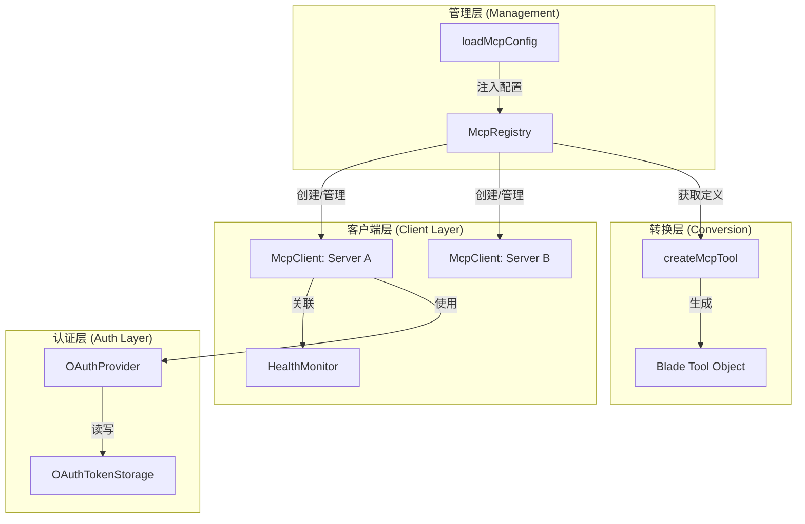
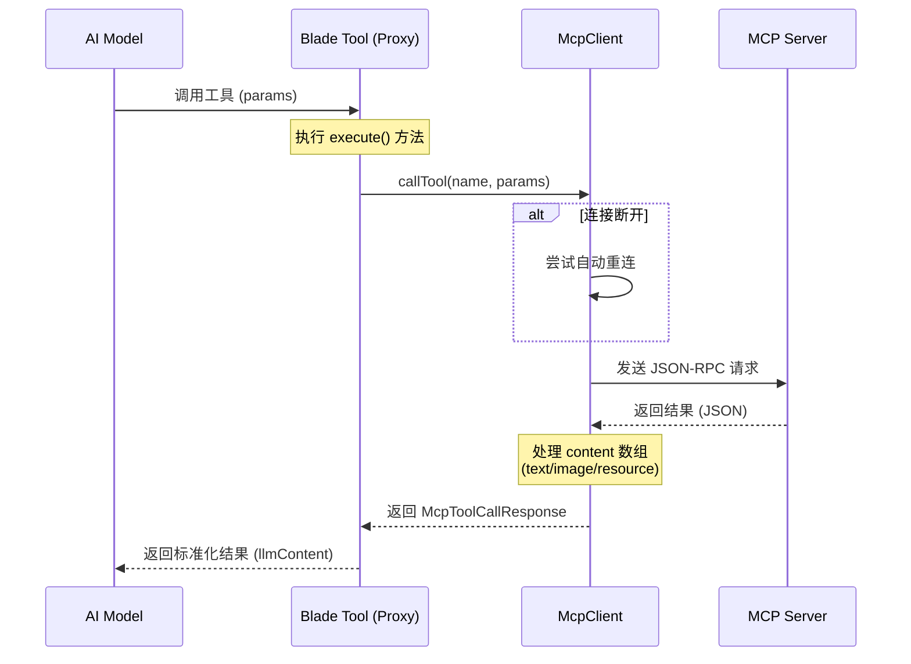
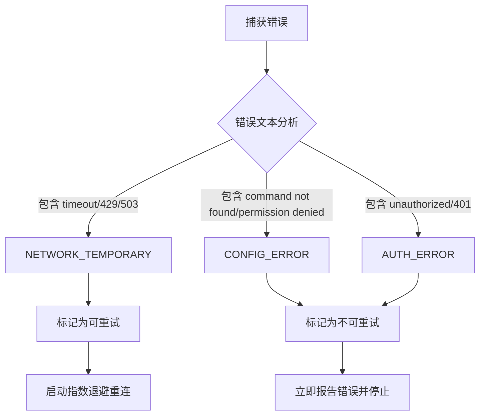
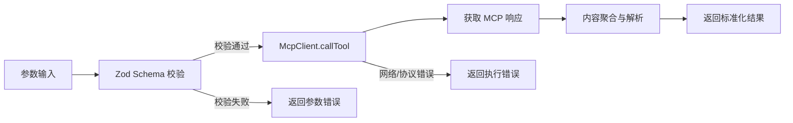
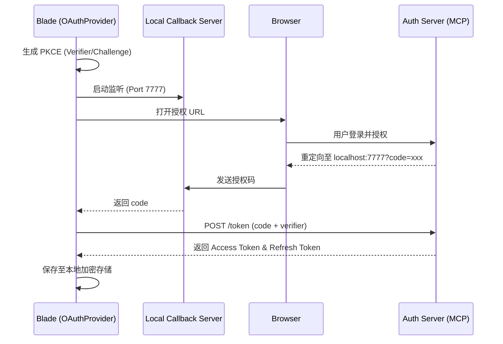
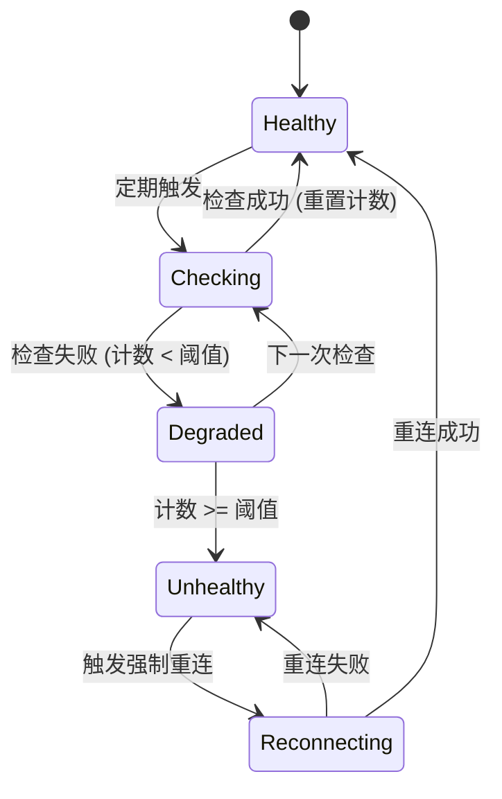

# MCP 协议集成与配置

## 目录
1. [模块概览](#模块概览)
2. [简介](#简介)
3. [架构设计](#架构设计)
   - [组件关系](#组件关系)
   - [核心交互流程](#核心交互流程)
4. [核心组件](#核心组件)
   - [McpClient：协议通信核心](#mcpclient协议通信核心)
   - [McpRegistry：多服务器管理中心](#mcpregistry多服务器管理中心)
5. [工具转换机制](#工具转换机制)
   - [Schema 动态映射](#schema-动态映射)
   - [工具执行生命周期](#工具执行生命周期)
6. [认证与安全](#认证与安全)
   - [OAuth 2.0 授权流程](#oauth-20-授权流程)
   - [令牌存储与安全性](#令牌存储与安全性)
7. [配置与发现](#配置与发现)
   - [CLI 配置加载](#cli-配置加载)
   - [配置示例](#配置示例)
8. [健康监测与稳定性](#健康监测与稳定性)
   - [自动重连策略](#自动重连策略)
   - [健康检查逻辑](#健康检查逻辑)
9. [文件参考](#文件参考)

## 模块概览

本模块位于 `packages/cli/src/mcp/`，是 Blade 对 **Model Context Protocol (MCP)** 的核心实现。MCP 是一种开放协议，允许 AI 模型安全地访问外部数据和工具。Blade 通过集成 MCP，极大地扩展了其能力边界，使其能够与无数第三方 MCP 服务器进行无缝交互。

**模块统计：**
- **总文件数**：10 个 TypeScript 文件
- **子目录**：`auth/`（包含 4 个文件，负责 OAuth 认证）
- **核心入口**：`McpClient.ts`, `McpRegistry.ts`, `createMcpTool.ts`

**覆盖范围：**
本 wiki 将深入探讨 MCP 协议在 Blade 中的落地实现，从底层的 JSON-RPC 通信到上层的工具动态转换，再到复杂的 OAuth 认证流程和健康监测机制。我们将详细分析 `McpClient` 如何管理连接，`McpRegistry` 如何协调多服务器，以及 `createMcpTool` 如何将外部能力转化为 Blade 内部的标准工具。

## 简介

Model Context Protocol (MCP) 是由 Anthropic 提出的一种标准化协议，旨在解决 AI 模型与外部工具、数据源之间集成的碎片化问题。在 Blade 中，MCP 集成不仅意味着能够调用外部 API，更意味着一种**动态的能力扩展机制**。

通过 MCP，Blade 开发者可以：
- **即插即用**：只需提供 MCP 服务器的配置，Blade 即可自动发现并加载其提供的所有工具。
- **跨平台兼容**：支持 `stdio`（本地进程）、`sse`（服务器发送事件）和 `http` 等多种传输协议。
- **安全可控**：内置 OAuth 2.0 认证支持，确保对受保护资源的访问是经过授权的。
- **高可用性**：具备完善的错误分类、自动重试和健康监测机制，保障 AI 工作流的稳定性。

本模块的设计哲学是“透明集成”：对于 AI 模型而言，MCP 工具与 Blade 原生工具在调用接口上完全一致；对于开发者而言，复杂的协议细节被封装在 `McpClient` 之后，只需关注业务逻辑。

## 架构设计

Blade 的 MCP 架构采用了分层设计的思想，确保了系统的可扩展性和健壮性。

### 组件关系

整个 MCP 模块由多个相互协作的组件组成，其核心是 `McpRegistry`，它作为单例管理中心，协调所有的 `McpClient` 实例。

以下图表展示了 MCP 模块内部组件的逻辑拓扑结构：



**架构解析**：
该图展示了 MCP 模块的四层架构。**管理层**通过 `loadMcpConfig` 接收外部配置并驱动 `McpRegistry`。**客户端层**是核心，每个 `McpClient` 负责与特定的 MCP 服务器保持通信，并接受 `HealthMonitor` 的监督。**转换层**通过 `createMcpTool` 实现协议转换，将 MCP 定义包装成 Blade 可执行的工具对象。**认证层**则为需要权限的连接提供 OAuth 支持。这种解耦设计使得 Blade 可以轻松支持数百个并发的 MCP 连接。

### 核心交互流程

当 AI 模型发起一个工具调用请求时，数据会流经多个组件。以下时序图展示了从 AI 请求到 MCP 工具执行的完整路径：



**流程说明**：
此流程图描绘了请求的生命周期。请求始于 **AI 模型**对代理工具的调用，随后进入 `McpClient`。`McpClient` 负责处理底层的 JSON-RPC 封装，并在必要时触发自动重连机制。**MCP 服务器**处理请求后返回原始 JSON 响应，`McpClient` 会将其中的多媒体内容（如图片、资源引用）进行解析和聚合，最终由代理工具返回给 AI 模型。这一过程对 AI 模型而言是完全透明的。

**Section sources**:
- [McpClient.ts](file:///Users/bytedance/Documents/GitHub/Blade/packages/cli/src/mcp/McpClient.ts)
- [McpRegistry.ts](file:///Users/bytedance/Documents/GitHub/Blade/packages/cli/src/mcp/McpRegistry.ts)
- [createMcpTool.ts](file:///Users/bytedance/Documents/GitHub/Blade/packages/cli/src/mcp/createMcpTool.ts)

## 核心组件

### McpClient：协议通信核心

`McpClient` 是整个模块的灵魂，它封装了官方 `@modelcontextprotocol/sdk`，并在此基础上增加了许多企业级特性，如错误分类、指数退避重试和 OAuth 集成。

#### 错误分类决策流

为了实现智能重试，`McpClient` 对捕获的错误进行深度分析。以下流程图展示了错误分类的逻辑：



**逻辑解析**：
错误分类器通过对错误消息进行模式匹配，将异常分为三类。**临时网络错误**（如超时或频率限制）会进入重试队列，利用指数退避算法（1s, 2s, 4s...）尝试恢复。**配置错误**（如路径错误或权限不足）被视为永久性失败，会立即中止流程以节省资源。**认证错误**则会触发特殊的 OAuth 处理逻辑。这种分类机制极大地增强了系统在不稳定网络环境下的鲁棒性。

#### 传输层支持
`McpClient` 支持三种主要的传输方式，通过 `createTransport` 私有方法动态创建：
- **Stdio**：适用于本地命令行工具。它启动一个子进程，通过标准输入输出进行通信。
- **SSE (Server-Sent Events)**：适用于基于 HTTP 的远程服务器，支持流式响应。
- **HTTP**：标准的 HTTP 传输。

```typescript
// McpClient.ts 中的错误分类示例
function classifyError(error: unknown): ClassifiedError {
  // ...
  const msg = error.message.toLowerCase();
  
  // 临时网络错误（可重试）
  const temporaryErrors = ['timeout', 'connection refused', 'rate limit', '503', '429'];
  if (temporaryErrors.some((temporary) => msg.includes(temporary))) {
    return { type: ErrorType.NETWORK_TEMPORARY, isRetryable: true, originalError: error };
  }
  
  // 永久性配置错误
  const permanentErrors = ['command not found', 'permission denied'];
  if (permanentErrors.some((permanent) => msg.includes(permanent))) {
    return { type: ErrorType.CONFIG_ERROR, isRetryable: false, originalError: error };
  }
  // ...
}
```

### McpRegistry：多服务器管理中心

`McpRegistry` 是一个单例类，负责管理 Blade 进程中所有的 MCP 连接。它的主要职责包括：
1. **生命周期管理**：注册、连接、断开和注销服务器。
2. **工具聚合**：从所有已连接的服务器中收集工具定义。
3. **冲突处理**：当多个服务器提供同名工具时，`McpRegistry` 会自动为工具名添加前缀（例如 `google_search__search`），确保工具名称的唯一性。

```typescript
// McpRegistry.ts 中的工具聚合逻辑
async getAvailableTools(): Promise<Tool[]> {
  const tools: Tool[] = [];
  // ... 检测冲突并添加前缀
  for (const [serverName, serverInfo] of this.servers) {
    if (serverInfo.status === McpConnectionStatus.CONNECTED) {
      for (const mcpTool of serverInfo.tools) {
        const hasConflict = (nameConflicts.get(mcpTool.name) || 0) > 1;
        const toolName = hasConflict ? `${serverName}__${mcpTool.name}` : mcpTool.name;
        const tool = createMcpTool(serverInfo.client, serverName, mcpTool, toolName);
        tools.push(tool);
      }
    }
  }
  return tools;
}
```

**Section sources**:
- [McpClient.ts:L126-L454](file:///Users/bytedance/Documents/GitHub/Blade/packages/cli/src/mcp/McpClient.ts#L126-L454)
- [McpRegistry.ts:L24-L401](file:///Users/bytedance/Documents/GitHub/Blade/packages/cli/src/mcp/McpRegistry.ts#L24-L401)

## 工具转换机制

MCP 协议使用 JSON Schema 来描述工具的输入参数，而 Blade 内部使用 Zod 进行强类型校验。`createMcpTool.ts` 实现了这两者之间的动态映射。

### 工具执行生命周期

当生成的代理工具被执行时，它会经历从参数校验到结果聚合的完整生命周期。



**生命周期解析**：
此流程展示了工具执行的严谨性。首先，**Zod Schema 校验**确保了输入参数符合 MCP 服务器的预期，避免了无效的远程调用。随后，`McpClient` 发起实际调用。最关键的一步是**内容聚合与解析**，Blade 会智能处理 MCP 返回的复合内容（如文本、Base64 图片等），将其转化为 AI 模型可以直接消费的格式。这种分层处理确保了工具调用的安全性和结果的一致性。

### Schema 动态映射

`convertJsonSchemaToZod` 函数是一个复杂的递归函数，它将 JSON Schema 的各种特性转换为对应的 Zod 操作：
- `type: "object"` -> `z.object()`
- `type: "array"` -> `z.array()`
- `enum` -> `z.enum()`
- `required` 字段处理：非必填字段会自动调用 `.optional()`。
- `oneOf` / `anyOf` -> `z.union()`

```typescript
// createMcpTool.ts 中的执行逻辑
async execute(params, context) {
  try {
    const result = await mcpClient.callTool(toolDef.name, params);
    let llmContent = '';
    // 解析多种内容类型
    if (result.content && Array.isArray(result.content)) {
      for (const item of result.content) {
        if (item.type === 'text') llmContent += item.text;
        else if (item.type === 'image') llmContent += `[image: ${item.mimeType}]\n`;
      }
    }
    // ... 返回标准化结果
  } catch (error) {
    // ... 错误处理
  }
}
```

**Section sources**:
- [createMcpTool.ts:L11-L218](file:///Users/bytedance/Documents/GitHub/Blade/packages/cli/src/mcp/createMcpTool.ts#L11-L218)

## 认证与安全

对于需要访问私有数据的 MCP 服务器（如 Google Drive 或 Slack），认证是必不可少的。Blade 内置了对 OAuth 2.0 的支持。

### OAuth 2.0 授权流程

Blade 实现了 **Authorization Code Flow with PKCE**（证明密钥代码交换），这是目前最安全的客户端认证流程。



**流程解析**：
该序列图展示了 Blade 如何处理外部授权。**PKCE 机制**通过 `code_verifier` 确保了即使授权码被拦截也无法被恶意使用。Blade 通过启动一个**本地回调服务器**来自动化捕获授权码，极大地提升了用户体验——用户只需在浏览器中点击“允许”，Blade 即可自动完成后续的令牌交换工作。

### 令牌存储与安全性

`OAuthTokenStorage` 负责将获取到的令牌持久化到本地。
- **存储路径**：`~/.blade/mcp-oauth-tokens.json`。
- **权限控制**：文件在创建时被设置为 `0o600`（仅当前用户可读写），防止其他用户访问。
- **自动刷新**：`McpClient` 在每次创建 Transport 时都会检查令牌是否过期。如果已过期且存在 `refresh_token`，它会自动调用 `refreshAccessToken` 获取新令牌，整个过程对用户透明。

**Section sources**:
- [auth/OAuthProvider.ts](file:///Users/bytedance/Documents/GitHub/Blade/packages/cli/src/mcp/auth/OAuthProvider.ts)
- [auth/OAuthTokenStorage.ts](file:///Users/bytedance/Documents/GitHub/Blade/packages/cli/src/mcp/auth/OAuthTokenStorage.ts)

## 配置与发现

Blade 提供了灵活的方式来配置 MCP 服务器，支持通过 CLI 参数动态加载。

### CLI 配置加载

`loadMcpConfig.ts` 中的 `loadMcpConfigFromCli` 函数支持多种输入格式：
1. **文件路径**：指向一个 JSON 配置文件。
2. **单服务器 JSON 字符串**：直接在命令行提供服务器定义。
3. **多服务器 JSON 字符串**：一次性提供多个服务器配置。

加载后的配置会临时注入到 Blade 的全局 Store 中，并在 `McpRegistry` 中触发服务器注册。

### 配置示例

以下是一个典型的 MCP 多服务器配置示例：

```json
{
  "mcpServers": {
    "filesystem": {
      "command": "npx",
      "args": ["-y", "@modelcontextprotocol/server-filesystem", "/Users/me/data"],
      "type": "stdio"
    },
    "github": {
      "type": "sse",
      "url": "https://mcp-server.github.com/sse",
      "oauth": {
        "enabled": true,
        "clientId": "blade_cli_client",
        "authorizationUrl": "https://github.com/login/oauth/authorize",
        "tokenUrl": "https://github.com/login/oauth/access_token"
      }
    }
  }
}
```

**Section sources**:
- [loadMcpConfig.ts](file:///Users/bytedance/Documents/GitHub/Blade/packages/cli/src/mcp/loadMcpConfig.ts)

## 健康监测与稳定性

在长连接场景下，保持连接的稳定性至关重要。`HealthMonitor` 提供了主动的健康检查机制。

### 健康状态机

`HealthMonitor` 内部维护着一个复杂的状态机，用于决定何时触发重连。



**状态说明**：
该状态机描述了系统如何从亚健康状态恢复。**Healthy** 是理想状态。一旦发生单次失败，系统进入 **Degraded**（降级）状态，此时仍可提供服务但会增加监控频率。只有当连续失败次数达到阈值时，才会进入 **Unhealthy** 并触发 **Reconnecting**。这种阶梯式的状态转换避免了因偶发网络抖动而导致的频繁重连。

### 健康检查逻辑

`HealthMonitor` 的检查流程如下：
- **状态检查**：首先确认 `McpClient` 的连接状态是否为 `CONNECTED`。
- **活跃度检查 (Ping)**：调用 `listTools` 方法。如果该请求超时或返回错误，则视为一次失败。
- **阈值触发**：当连续失败次数达到 `failureThreshold`（默认 3 次）时，监控器会将状态标记为 `UNHEALTHY` 并强制触发 `McpClient` 的重连流程。

**Section sources**:
- [HealthMonitor.ts](file:///Users/bytedance/Documents/GitHub/Blade/packages/cli/src/mcp/HealthMonitor.ts)
- [McpClient.ts:L337-L391](file:///Users/bytedance/Documents/GitHub/Blade/packages/cli/src/mcp/McpClient.ts#L337-L391)

## 文件参考

以下是本模块涉及的核心源文件：

| 文件名 | 职责描述 |
|-------|---------|
| [McpClient.ts](file:///Users/bytedance/Documents/GitHub/Blade/packages/cli/src/mcp/McpClient.ts) | 核心客户端实现，负责 Transport 管理、错误分类和重试逻辑。 |
| [McpRegistry.ts](file:///Users/bytedance/Documents/GitHub/Blade/packages/cli/src/mcp/McpRegistry.ts) | MCP 服务器管理中心，处理服务器注册、工具聚合及命名冲突。 |
| [createMcpTool.ts](file:///Users/bytedance/Documents/GitHub/Blade/packages/cli/src/mcp/createMcpTool.ts) | 动态工具转换器，将 MCP 定义映射为 Blade 标准工具。 |
| [loadMcpConfig.ts](file:///Users/bytedance/Documents/GitHub/Blade/packages/cli/src/mcp/loadMcpConfig.ts) | 配置加载器，支持从 CLI 参数解析多种格式的服务器配置。 |
| [HealthMonitor.ts](file:///Users/bytedance/Documents/GitHub/Blade/packages/cli/src/mcp/HealthMonitor.ts) | 健康监测器，实现主动心跳检查和自动重连触发。 |
| [auth/OAuthProvider.ts](file:///Users/bytedance/Documents/GitHub/Blade/packages/cli/src/mcp/auth/OAuthProvider.ts) | OAuth 认证流程实现，包含 PKCE 和回调服务器逻辑。 |
| [auth/OAuthTokenStorage.ts](file:///Users/bytedance/Documents/GitHub/Blade/packages/cli/src/mcp/auth/OAuthTokenStorage.ts) | 令牌持久化存储，负责令牌的安全读写和过期检查。 |
| [types.ts](file:///Users/bytedance/Documents/GitHub/Blade/packages/cli/src/mcp/types.ts) | MCP 模块的基础类型定义。 |
