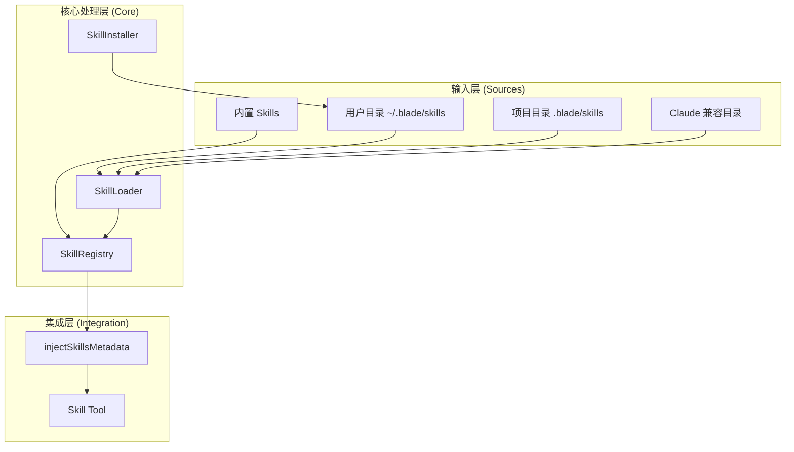
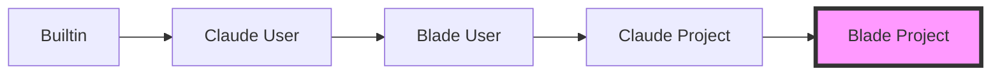
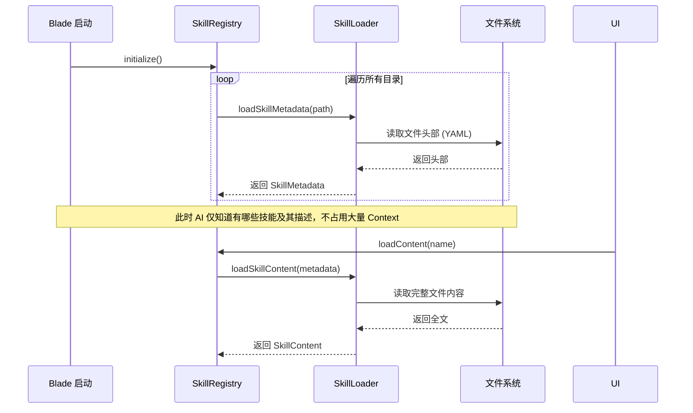
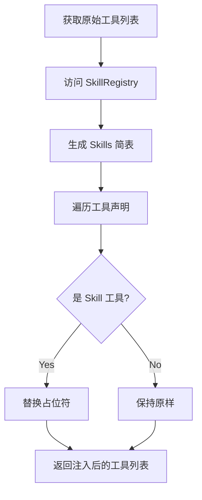
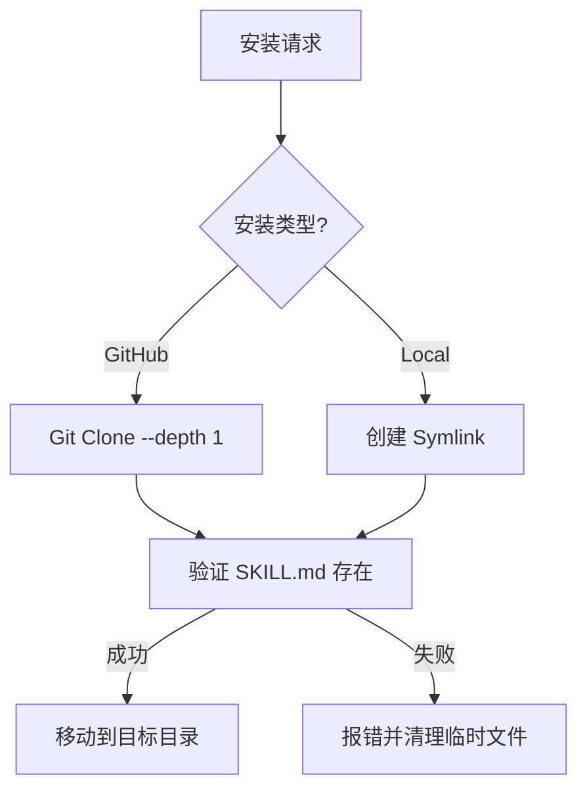

# Skills 系统开发

## 目录

1. [模块概览](#模块概览)
2. [引言](#引言)
3. [设计哲学与核心优势](#设计哲学与核心优势)
4. [系统架构](#系统架构)
5. [Skill 目录结构与元数据规范](#skill-目录结构与元数据规范)
6. [加载与注册机制：渐进式披露](#加载与注册机制渐进式披露)
7. [元数据注入与 AI 集成逻辑](#元数据注入与-ai-集成逻辑)
8. [安装、分发与本地开发](#安装分发与本地开发)
9. [高级进阶：脚本与模板集成](#高级进阶脚本与模板集成)
10. [实战：开发你的第一个 Skill](#实战开发你的第一个-skill)
11. [常见问题与调试指南](#常见问题与调试指南)
12. [核心组件 API 参考](#核心组件-api-参考)
13. [文件参考](#文件参考)

## 模块概览

Blade 的 Skills 系统位于 `packages/cli/src/skills/` 目录下，是一个高度模块化且易于扩展的系统。该系统允许开发者通过简单的 Markdown 文件定义复杂的工作流和专业能力，从而增强 AI 的执行效率。

**模块统计：**
- **总文件数**：8 个 TypeScript 文件
- **子目录**：
  - `builtin/`：包含内置的系统级 Skills（如 `skill-creator`）。
- **覆盖范围**：本文档将深入解析 Skills 系统的全貌，从底层的 `types.ts` 定义到核心的 `SkillLoader`、`SkillRegistry`、`SkillInstaller` 以及 AI 集成逻辑 `injectSkillsMetadata`。

## 引言

在 AI 辅助开发工具（如 Blade 和 Claude Code）中，**Skills（技能）** 是一种动态的 Prompt 扩展机制。与传统的硬编码工具不同，Skills 允许开发者使用自然语言（Markdown）配合结构化的元数据（YAML）来定义 AI 的专业能力。

### 什么是 Skills？

Skills 可以被看作是 AI 的“插件”。每一个 Skill 都是一个独立的指令包，它告诉 AI：
- **我是谁**：通过 `name` 标识。
- **我能做什么**：通过 `description` 描述。
- **我什么时候该出现**：通过 `when_to_use` 触发条件。
- **我该怎么做**：通过 `instructions` Markdown 文本。
- **我能用哪些工具**：通过 `allowed-tools` 权限声明。

### 核心价值

Skills 系统的核心目标是解决“Prompt 膨胀”问题。如果将所有专业知识都塞进初始的系统提示词（System Prompt），不仅会消耗大量的 Token，还会干扰 AI 对基础指令的理解。Skills 采用按需加载的方式，确保 AI 在处理日常任务时保持轻量，而在处理特定任务（如代码审查、数据库迁移）时能瞬间获得专业知识。

## 设计哲学与核心优势

Blade 的 Skills 系统在设计上遵循了几个关键原则，这些原则决定了其在实际应用中的高效与安全。

### 1. 声明式配置 (Declarative Configuration)
开发者只需声明“意图”和“规则”，而无需关心底层的解析和注入逻辑。这种基于文件的声明式方法使得 Skills 极易版本化和共享。你可以直接将 `.blade/skills` 目录提交到 Git 仓库，团队成员拉取代码后即可自动获得这些能力。

### 2. 最小权限原则 (Principle of Least Privilege)
安全性是 Skills 系统的重要考量。通过 `allowed-tools` 字段，Skill 开发者可以限制 AI 在执行该技能时的权限。例如，一个专门用于“文档生成”的 Skill 可能只需要 `Read` 和 `Write` 权限，而不需要执行 `Bash` 命令。这种细粒度的控制防止了 AI 在执行复杂指令时意外触发危险操作。

### 3. 生态兼容性 (Ecosystem Compatibility)
Blade 深度兼容了 Claude Code 的 Skills 规范。这意味着：
- 现有的 Claude Skills 可以直接无缝迁移到 Blade。
- 开发者可以利用社区中已经成熟的 Skills 资源。
- 统一的规范降低了开发者的学习成本。

### 4. 渐进式披露 (Progressive Disclosure)
这是性能优化的核心。系统在启动时只“认识”Skill 的名字和简要描述。只有当 AI 决定调用某个 Skill 时，系统才会从磁盘读取完整的 Markdown 指令。这种“懒加载”机制使得 Blade 能够支持成百上千个 Skills 而不影响响应速度。

## 系统架构

Blade Skills 系统采用分层架构，确保了职责分离和高效执行。

### 架构组件关系

下图展示了 Skills 系统各核心组件之间的交互关系，以及数据是如何从物理文件流转到 AI 模型手中的。



**架构解析**：
- **输入层**：系统从多个来源扫描 Skills。优先级最高的是项目本地目录，这确保了项目特定的工作流可以覆盖全局设置。
- **核心处理层**：`SkillLoader` 负责解析物理文件；`SkillRegistry` 维护内存中的索引并处理优先级覆盖逻辑；`SkillInstaller` 负责从远程仓库或本地路径部署新的 Skills。
- **集成层**：`injectSkillsMetadata` 将注册表中的信息动态注入到 AI 的工具声明中，使 AI 能够感知到这些能力并在需要时通过 `Skill` 工具进行调用。

**架构设计来源**:
- [SkillRegistry.ts:L51-L158](file:///Users/bytedance/Documents/GitHub/Blade/packages/cli/src/skills/SkillRegistry.ts)
- [SkillLoader.ts:L136-L186](file:///Users/bytedance/Documents/GitHub/Blade/packages/cli/src/skills/SkillLoader.ts)

## Skill 目录结构与元数据规范

一个标准的 Skill 通常以文件夹的形式存在，其核心是 `SKILL.md` 文件。

### 目录结构示例

```text
my-awesome-skill/
├── SKILL.md          # 核心定义文件（必须）
├── templates/        # 可选：存放代码模板，供指令中引用
├── scripts/          # 可选：辅助执行脚本，通过 Bash 工具调用
└── README.md         # 可选：面向人类的说明文档
```

### SKILL.md 格式规范

`SKILL.md` 由两部分组成：顶部的 **YAML 前置数据 (Frontmatter)** 和底部的 **Markdown 指令**。

#### 1. 元数据字段解析 (YAML)

| 字段名 | 类型 | 描述 | 示例 |
| :--- | :--- | :--- | :--- |
| `name` | `string` | **必填**。唯一标识符，kebab-case 格式，≤64 字符。 | `code-reviewer` |
| `description` | `string` | **必填**。激活描述，告知 AI 何时调用此技能。 | `Review code for quality...` |
| `allowed-tools` | `string[]` | 可选。限制该技能可访问的工具列表。 | `['Read', 'Grep']` |
| `argument-hint` | `string` | 可选。显示在帮助列表中的参数提示。 | `<file_path>` |
| `user-invocable` | `boolean` | 可选。是否允许用户通过 `/name` 手动调用。 | `true` |
| `disable-model-invocation` | `boolean` | 可选。是否禁止 AI 自动调用。 | `false` |
| `model` | `string` | 可选。指定执行该技能的模型（如 `inherit`）。 | `gpt-4o` |
| `when_to_use` | `string` | 可选。补充触发条件描述，帮助 AI 精确判断。 | `When user asks for review` |

#### 2. 指令内容设计 (Markdown)

指令部分定义了 AI 在执行该技能时的具体行为准则。好的指令应该包含：
- **角色设定**：定义 AI 在此 Skill 下的身份（如“资深架构师”）。
- **任务目标**：明确要达成的最终结果。
- **执行步骤**：分步骤指导 AI 如何使用工具完成任务。
- **输出规范**：规定返回给用户的格式（如 Markdown 表格、JSON 等）。

**元数据定义参考**:
- [types.ts:L14-L68](file:///Users/bytedance/Documents/GitHub/Blade/packages/cli/src/skills/types.ts)
- [SkillLoader.ts:L26-L41](file:///Users/bytedance/Documents/GitHub/Blade/packages/cli/src/skills/SkillLoader.ts)

## 加载与注册机制：渐进式披露

`SkillRegistry` 是整个系统的中枢，它在启动时执行扫描，并在运行时提供检索服务。

### 扫描优先级与覆盖逻辑

为了支持多层级的配置覆盖，`SkillRegistry` 按照以下顺序（从低到高）扫描目录。后加载的 Skill 如果名称相同，会覆盖先加载的。这种机制允许项目团队针对特定项目“重写”全局的通用技能。



1.  **Builtin**：内置 Fallback 技能，如 `skill-creator`。
2.  **Claude User**：`~/.claude/skills/`。
3.  **Blade User**：`~/.blade/skills/`（全局用户配置）。
4.  **Claude Project**：`.claude/skills/`。
5.  **Blade Project**：`.blade/skills/`（**最高优先级**）。

### 渐进式披露流程

为了优化性能，系统采用了“先加载元数据，按需加载正文”的策略。这在处理包含大型指令集的 Skills 时尤为重要。



这种设计确保了即使系统中安装了数百个 Skills，启动时间依然保持在毫秒级，且不会在初始 Prompt 中塞入大量无关的指令，从而保证了 AI 响应的准确性和经济性。

**逻辑实现参考**:
- [SkillRegistry.ts:L92-L158](file:///Users/bytedance/Documents/GitHub/Blade/packages/cli/src/skills/SkillRegistry.ts)

## 元数据注入与 AI 集成逻辑

AI 是如何知道当前有哪些 Skills 可用的？这归功于 `injectSkillsMetadata` 逻辑。

### 注入逻辑解析

Blade 在将工具列表发送给 AI 之前，会拦截名为 `Skill` 的工具声明。该工具的描述中包含一个特殊的占位符 `<available_skills>\s*<\/available_skills>`。注入器会动态地将注册表中的所有可用技能格式化为列表并填充进去。



### 注入效果示例

注入后的工具描述如下所示，这种格式能被 AI 高效解析：

```text
Call a specialized skill to perform a task.
<available_skills>
- code-reviewer <file_path>: Review code for quality and bugs.
- commit-helper: Generate conventional commit messages.
- db-migrator: Handle database schema migrations safely.
</available_skills>
```

AI 看到这个列表后，如果用户的请求匹配了某个 Skill 的描述，它就会调用 `Skill` 工具并传入对应的名称。

**注入代码参考**:
- [injectSkillsMetadata.ts:L26-L59](file:///Users/bytedance/Documents/GitHub/Blade/packages/cli/src/skills/injectSkillsMetadata.ts)

## 安装、分发与本地开发

`SkillInstaller` 负责将远程或本地的 Skills 部署到用户的系统中。

### 安装方式对比

| 方式 | 机制 | 适用场景 |
| :--- | :--- | :--- |
| **GitHub 安装** | `git clone` | 安装社区分享的成熟技能。 |
| **本地链接** | `fs.symlink` | **开发首选**。在本地目录修改，Blade 立即生效。 |
| **内置自动安装** | `ensureDefault` | 系统基础功能（如 `skill-creator`）的静默部署。 |

### 安装流程图



**安装器实现参考**:
- [SkillInstaller.ts:L66-L129](file:///Users/bytedance/Documents/GitHub/Blade/packages/cli/src/SkillInstaller.ts)

## 高级进阶：脚本与模板集成

一个强大的 Skill 往往不仅仅包含文字指令，还可以集成外部资源。

### 1. 使用模板 (Templates)
在 `SKILL.md` 中，你可以指示 AI 读取同目录下的模板文件。
> "Read the template from `./templates/pr-template.md` and use it to format your response."

### 2. 调用辅助脚本 (Scripts)
如果某个任务通过纯 Prompt 难以完成（如复杂的数学计算或调用特定 API），可以编写一个 Python 或 Node.js 脚本放在 `scripts/` 目录下，并在指令中要求 AI 执行它。
> "Run the script at `./scripts/validate-schema.py` using the Bash tool to verify the generated JSON."

这种“Prompt + 脚本”的组合极大地扩展了 Skills 的能力边界。

## 实战：开发你的第一个 Skill

本节将指导你创建一个名为 `hello-blade` 的简单技能。

### 1. 创建目录结构

在你的项目根目录下运行：
```bash
mkdir -p .blade/skills/hello-blade
```

### 2. 编写 SKILL.md

创建 `.blade/skills/hello-blade/SKILL.md`，内容如下：

```yaml
---
name: hello-blade
description: A friendly skill that greets the user and explains Blade's mission. Use when the user says "hello" or asks about Blade.
version: 1.0.0
user-invocable: true
---

# Hello Blade

## Instructions
1. 热情地向用户打招呼。
2. 解释 Blade 是一个基于 AI 的高性能 CLI 开发助手。
3. 询问用户今天需要什么帮助。

## Examples
- 用户说: "Hi" -> 触发 hello-blade
- 用户说: "What is Blade?" -> 触发 hello-blade
```

### 3. 刷新并验证

在 Blade 终端中输入：
```bash
/skills
```
你应该能在列表中看到 `hello-blade`。现在尝试对 AI 说：“嘿，介绍一下你自己”，AI 应该会激活这个技能。

## 常见问题与调试指南

在开发 Skills 时，你可能会遇到以下问题：

### 1. Skill 不生效？
- **检查文件名**：必须是 `SKILL.md`（注意全大写）。
- **检查 YAML 格式**：确保头部有 `---` 分隔符，且 YAML 语法正确。
- **执行刷新**：新创建的文件需要执行 `/skills` 刷新注册表。

### 2. AI 不触发我的 Skill？
- **优化描述**：`description` 是 AI 识别的关键。确保它包含清晰的关键词。
- **使用 when_to_use**：添加更具体的触发场景描述。
- **检查禁用标志**：确认没有误设 `disable-model-invocation: true`。

### 3. 工具调用失败？
- **检查权限**：确保所需的工具已列在 `allowed-tools` 中。
- **工具名称**：确保工具名称拼写正确（如 `Read`, `Write`, `Bash`）。

## 核心组件 API 参考

### SkillMetadata
定义了 Skill 的静态属性。
```typescript
export interface SkillMetadata {
  name: string;             // 唯一 ID，用于调用
  description: string;      // 激活描述，决定 AI 何时使用
  allowedTools?: string[];  // 权限白名单
  userInvocable?: boolean;  // 是否可通过 /name 触发
  source: 'user' | 'project' | 'builtin'; // 来源标记
  path: string;             // SKILL.md 的绝对路径
}
```

### SkillRegistry
管理单例，处理发现、缓存与检索逻辑。
```typescript
export class SkillRegistry {
  /** 获取单例 */
  static getInstance(): SkillRegistry;
  /** 初始化并扫描所有目录 */
  async initialize(): Promise<SkillDiscoveryResult>;
  /** 查找指定 Skill */
  get(name: string): SkillMetadata | undefined;
  /** 懒加载完整指令内容 */
  async loadContent(name: string): Promise<SkillContent | null>;
}
```

## 文件参考

以下是构建 Skills 系统所涉及的关键源码文件：

- [types.ts](file:///Users/bytedance/Documents/GitHub/Blade/packages/cli/src/skills/types.ts): 系统类型定义。
- [SkillLoader.ts](file:///Users/bytedance/Documents/GitHub/Blade/packages/cli/src/skills/SkillLoader.ts): 文件解析逻辑，处理 YAML 和 Markdown。
- [SkillRegistry.ts](file:///Users/bytedance/Documents/GitHub/Blade/packages/cli/src/skills/SkillRegistry.ts): 注册表与发现机制，处理优先级覆盖。
- [SkillInstaller.ts](file:///Users/bytedance/Documents/GitHub/Blade/packages/cli/src/skills/SkillInstaller.ts): 安装与部署逻辑，支持 Git 和本地链接。
- [injectSkillsMetadata.ts](file:///Users/bytedance/Documents/GitHub/Blade/packages/cli/src/skills/injectSkillsMetadata.ts): AI 工具注入逻辑，实现渐进式披露。
- [builtin/skill-creator.ts](file:///Users/bytedance/Documents/GitHub/Blade/packages/cli/src/skills/builtin/skill-creator.ts): 内置技能创建器示例。
