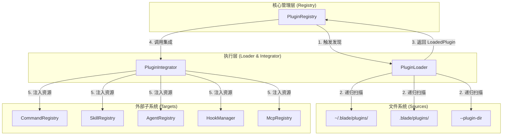
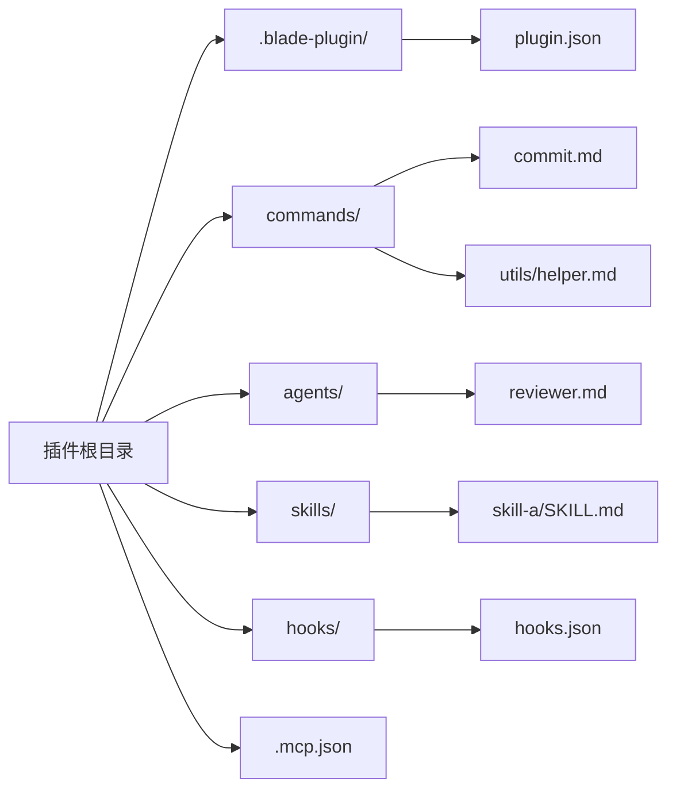
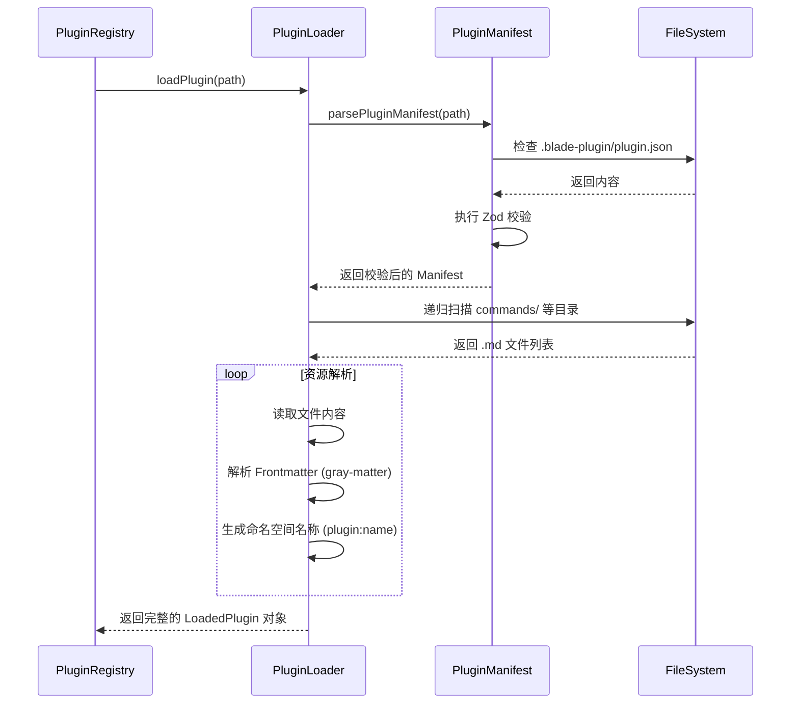
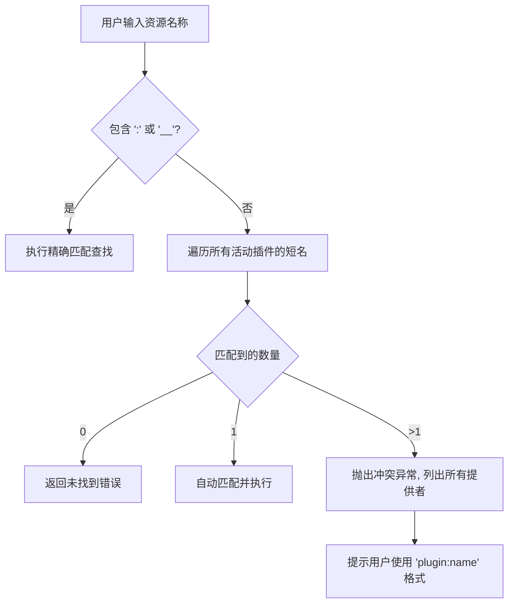
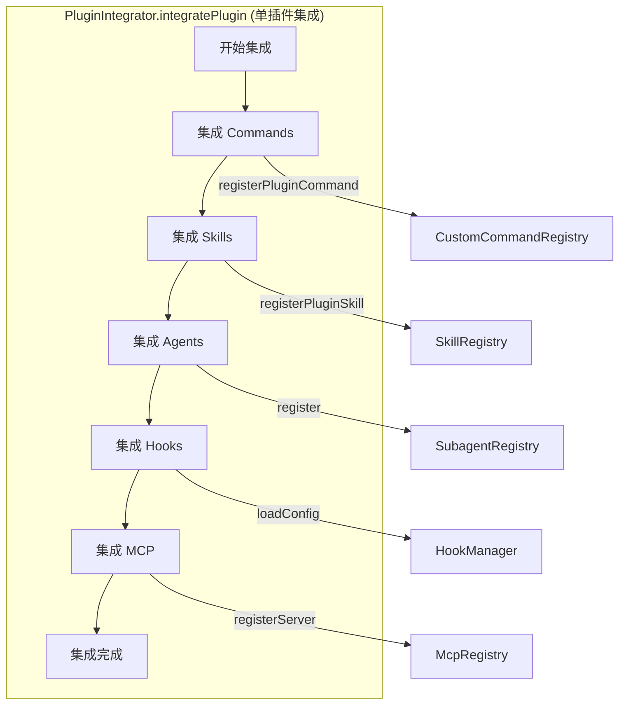

# 插件系统架构

## 目录

1. [模块概览](#模块概览)
2. [引言](#引言)
3. [插件清单 (Manifest)](#插件清单-manifest)
4. [架构与生命周期](#架构与生命周期)
5. [命名空间与冲突管理](#命名空间与冲突管理)
6. [集成逻辑](#集成逻辑)
7. [核心组件](#核心组件)
8. [文件引用](#文件引用)

## 模块概览

本模块位于 `packages/cli/src/plugins/`，是 Blade 系统中负责插件化扩展的核心部分。插件系统提供了一种比 Skill 更底层的扩展机制，允许开发者通过定义清单文件、命令、代理、技能、钩子以及 MCP（Model Context Protocol）配置来全面增强 Blade 的功能。

在对该目录进行扫描后，我们识别出以下关键信息：

- **文件总数**：9 个核心 TypeScript 文件。
- **子目录结构**：该模块目前采用扁平化结构，所有核心逻辑均直接位于 `plugins/` 目录下。
- **覆盖范围**：
    - 插件定义与验证：`PluginManifest.ts`, `schemas.ts`, `types.ts`
    - 加载与注册：`PluginLoader.ts`, `PluginRegistry.ts`
    - 系统集成：`PluginIntegrator.ts`, `namespacing.ts`
    - 安装工具：`PluginInstaller.ts`

本 Wiki 将重点解析插件的生命周期管理、清单定义规范以及如何将插件功能无缝注入到 Blade 的各个子系统中。

## 引言

Blade 的插件系统旨在提供一种高度模块化且易于扩展的架构。与传统的单一功能扩展（如单独的 Skill）不同，插件是一个自包含的单元，它可以同时包含多种资源类型。这种设计允许开发者创建功能丰富的扩展包，例如一个专门用于“前端开发”的插件，可以同时包含 React 代码生成命令、CSS 优化代理以及特定的项目初始化钩子。

### 插件系统的定位

在 Blade 的扩展层次结构中，插件处于较底层的位置：
- **基础层**：核心运行时、工具集、MCP 协议支持。
- **扩展层（插件系统）**：定义如何发现、加载、验证和集成第三方包。
- **功能层**：具体的 Skills、Slash Commands、Subagents。

插件系统的核心价值在于**封装**和**分发**。开发者可以将一组相关的工具、提示词模板和钩子逻辑打包成一个插件，用户只需将该插件放入指定的目录即可完成安装。这种方式极大地降低了用户配置复杂环境的成本，同时也为 Blade 的生态系统提供了标准化的扩展规范。

### 核心术语

- **Manifest (清单)**：插件的元数据文件（`plugin.json`），定义了插件的名称、版本和依赖。它是插件系统的入口点。
- **Namespacing (命名空间)**：为了防止不同插件之间的命令或资源（如两个插件都提供了名为 `commit` 的命令）发生冲突，系统会自动为资源加上 `plugin-name:` 前缀。
- **Integrator (集成器)**：负责将加载后的插件资源（如 Commands）分发到各自对应的全局注册表中，实现“即插即用”。
- **Registry (注册表)**：插件系统在运行时的内存中心，负责维护所有已加载插件的状态、元数据以及资源索引。

## 插件清单 (Manifest)

插件清单是插件的“身份证”，它告诉 Blade 这是一个有效的插件以及它包含哪些基本信息。清单文件通常命名为 `plugin.json`，必须放置在插件根目录的 `.blade-plugin/` 或 `.claude-plugin/` 子目录中。

### 清单字段解析

根据 `schemas.ts` 中的定义，一个标准的 `plugin.json` 包含以下核心字段：

| 字段名 | 类型 | 必填 | 描述 |
| :--- | :--- | :--- | :--- |
| `name` | `string` | 是 | 插件的唯一标识符，必须符合 kebab-case 规范（如 `my-awesome-plugin`）。长度限制在 2-64 字符。 |
| `version` | `string` | 是 | 符合语义化版本（SemVer）规范的版本号（如 `1.0.0`）。 |
| `description` | `string` | 是 | 插件的功能简述，限 500 字符以内。 |
| `author` | `object` | 否 | 包含 `name`, `email`, `url` 的作者信息。 |
| `dependencies` | `record` | 否 | 插件依赖的其他插件及其版本范围。 |
| `bladeVersion` | `string` | 否 | 插件运行所需的最低 Blade 版本，支持 SemVer 范围。 |

### 验证机制

系统使用 `Zod` 库对清单文件进行严格验证。`schemas.ts` 定义了 `pluginManifestSchema`，确保所有加载的插件都符合预期的格式。这不仅保证了系统的稳定性，也为插件开发者提供了清晰的错误反馈。

```typescript
// packages/cli/src/plugins/schemas.ts

/**
 * 插件名称验证规则
 */
const pluginNameSchema = z
  .string()
  .min(2, 'Plugin name must be at least 2 characters')
  .max(64, 'Plugin name must be at most 64 characters')
  .regex(/^[a-z0-9][a-z0-9-]*[a-z0-9]$|^[a-z0-9]{1,2}$/, {
    message: '插件名称必须仅包含小写字母、数字和连字符，且以字母或数字开头和结尾',
  });

/**
 * 插件清单模式定义
 */
export const pluginManifestSchema = z.object({
  name: pluginNameSchema,
  description: z.string().min(1).max(500),
  version: semverSchema,
  author: z.object({
    name: z.string().min(1),
    email: z.string().email().optional(),
    url: z.string().url().optional(),
  }).optional(),
  // ... 其他扩展字段
});
```

### 典型示例

下面是一个典型的 `plugin.json` 文件示例，展示了一个功能完备的插件配置：

```json
{
  "name": "git-enhanced",
  "version": "1.2.0",
  "description": "增强的 Git 工作流插件，提供自动提交、冲突解决建议以及变更日志生成。",
  "author": {
    "name": "Blade Team",
    "email": "blade@example.com",
    "url": "https://github.com/blade/plugins"
  },
  "keywords": ["git", "workflow", "automation", "productivity"],
  "bladeVersion": "^0.5.0",
  "license": "MIT"
}
```

**Section sources**:
- [PluginManifest.ts](file:///Users/bytedance/Documents/GitHub/Blade/packages/cli/src/plugins/PluginManifest.ts)
- [schemas.ts](file:///Users/bytedance/Documents/GitHub/Blade/packages/cli/src/plugins/schemas.ts)
- [types.ts](file:///Users/bytedance/Documents/GitHub/Blade/packages/cli/src/plugins/types.ts)

## 架构与生命周期

Blade 插件系统采用典型的“发现-加载-集成”三阶段生命周期。整个过程由 `PluginRegistry` 统一协调，利用 `PluginLoader` 进行文件读取和解析，最后通过 `PluginIntegrator` 完成功能注入。

### 系统架构概览

下图展示了插件系统内部组件之间的协作关系。`PluginRegistry` 作为系统的门面，通过 `PluginLoader` 扫描文件系统，并将结果交给 `PluginIntegrator` 进行分发。



该架构确保了关注点分离：`PluginRegistry` 负责状态管理和全局协调，`PluginLoader` 封装了复杂的 IO 操作和 Markdown 解析逻辑，而 `PluginIntegrator` 则充当了适配器的角色，负责与其他子系统的解耦集成。

### 插件目录结构约定

一个典型的插件项目通常遵循以下目录结构。`PluginLoader` 会自动识别这些特定目录并提取其中的资源：



### 加载流程深度解析

当 Blade 启动或用户执行刷新操作时，`PluginLoader.loadPlugin` 会被调用。它不仅读取清单，还会遍历各个子目录。

```typescript
// packages/cli/src/plugins/PluginLoader.ts

async loadPlugin(pluginDir: string, source: PluginSource): Promise<LoadedPlugin> {
  // 1. 解析并验证清单 (Manifest)
  const manifestResult = await parsePluginManifest(pluginDir);
  if (!manifestResult) throw new Error(`无效的插件目录: ${pluginDir}`);

  const { manifest, source: manifestSource } = manifestResult;
  const pluginName = manifest.name;

  // 2. 加载各类资源，支持跳过特定类型
  const commands = await this.loadCommands(pluginDir, pluginName);
  const agents = await this.loadAgents(pluginDir, pluginName);
  const skills = await this.loadSkills(pluginDir, pluginName);
  const hooks = await this.loadHooks(pluginDir);
  const mcpServers = await this.loadMcpConfig(pluginDir, pluginName);

  return {
    manifest,
    basePath: pluginDir,
    source,
    commands,
    agents,
    skills,
    hooks,
    mcpServers,
    status: 'active',
    loadedAt: new Date(),
  };
}
```

以下是加载过程的序列图，展示了从 Registry 到 FileSystem 的交互：



在加载过程中，`PluginLoader` 会利用 `gray-matter` 解析 Markdown 文件中的元数据，并将文件名或 Frontmatter 中的 `name` 字段作为资源的原始名称。

**Diagram sources**:
- [PluginRegistry.ts:L67-L122](file:///Users/bytedance/Documents/GitHub/Blade/packages/cli/src/plugins/PluginRegistry.ts#L67-L122)
- [PluginLoader.ts:L48-L105](file:///Users/bytedance/Documents/GitHub/Blade/packages/cli/src/plugins/PluginLoader.ts#L48-L105)

## 命名空间与冲突管理

为了支持多个插件并存而不产生冲突，Blade 引入了严格的命名空间机制。所有插件提供的资源在注册到全局系统之前，都会被强制重命名。

### 命名空间逻辑

`namespacing.ts` 提供了两个核心工具函数，它们定义了 Blade 资源标识符的标准格式：
- `getNamespacedName(pluginName, resourceName)`：用于命令、技能和代理。格式为 `plugin-name:resource-name`（例如 `git-helper:commit`）。
- `getMcpNamespacedName(pluginName, serverName)`：用于 MCP 服务器。格式为 `plugin-name__server-name`（使用双下划线分隔，以避免与 MCP 内部可能存在的冒号命名冲突）。

### 冲突检测与智能查找

虽然资源在系统内部是隔离的，但为了提升用户体验，Blade 支持使用“短名称”调用资源。`PluginRegistry` 实现了以下查找算法：

1. **精确匹配**：如果用户输入了包含冒号的全名（如 `git:commit`），系统直接定位到该特定插件的资源。
2. **短名匹配**：如果用户只输入了 `commit`，系统会扫描所有已加载且处于 `active` 状态的插件。
    - **唯一匹配**：如果只有一个插件提供了 `commit`，系统会自动路由到该资源。
    - **冲突处理**：如果有多个插件提供同名资源，系统会通过 `hasCommandConflict` 检测到冲突，并拒绝执行，同时提示用户使用完整的命名空间名称。



这种机制在灵活性和安全性之间取得了平衡，既允许用户在大多数情况下享受简短输入的便利，又能在出现歧义时提供明确的指导。

**Section sources**:
- [namespacing.ts](file:///Users/bytedance/Documents/GitHub/Blade/packages/cli/src/plugins/namespacing.ts)
- [PluginRegistry.ts:L231-L358](file:///Users/bytedance/Documents/GitHub/Blade/packages/cli/src/plugins/PluginRegistry.ts#L231-L358)

## 集成逻辑

`PluginIntegrator` 是插件系统的心脏，它负责将静态的 `LoadedPlugin` 数据转化为动态的系统能力。它的设计目标是确保插件资源的注入过程对核心系统是透明且可逆的。

### 资源分发流程

集成过程是幂等的。在每次刷新插件列表或系统启动时，`PluginIntegrator` 首先会调用 `clearAllPluginResources()` 清理之前注入的所有插件资源，然后重新遍历所有活动插件进行集成。这保证了插件状态的一致性，防止了僵尸资源的残留。



### 关键集成细节

- **命令与代理 (Commands & Agents)**：这些资源主要由 Markdown 文件定义。`PluginLoader` 负责解析 Frontmatter 和 Body，`PluginIntegrator` 则负责将它们包装成 `CustomCommandConfig` 或 `SubagentConfig`。
- **钩子 (Hooks)**：插件可以提供 `hooks/hooks.json` 来拦截系统事件。集成器会将这些配置与当前系统的 Hook 配置进行合并。
- **MCP 服务器**：插件可以通过 `.mcp.json` 定义外部工具。集成器会为每个服务器名称加上命名空间前缀，并调用 `McpRegistry` 进行实例化和连接。

```typescript
// packages/cli/src/plugins/PluginIntegrator.ts 核心逻辑

/**
 * 集成插件提供的命令
 */
private integrateCommands(plugin: LoadedPlugin): number {
  let count = 0;
  for (const cmd of plugin.commands) {
    // 注入到全局自定义命令注册表
    // Registry 会处理命令的解析和执行逻辑
    this.commandRegistry.registerPluginCommand(cmd);
    count++;
  }
  return count;
}

/**
 * 集成插件提供的代理 (Subagents)
 */
private integrateAgents(plugin: LoadedPlugin): number {
  let count = 0;
  for (const agent of plugin.agents) {
    // 将插件代理注册到子代理注册表中
    subagentRegistry.register({
      ...agent.config,
      name: agent.namespacedName, // 必须使用命名空间全名
    });
    count++;
  }
  return count;
}
```

通过这种分发机制，插件提供的功能在表现上与系统内置功能完全一致。用户可以通过 `/plugin:command` 调用命令，或者在对话中通过 `@plugin:agent` 唤起特定的子代理。

**Section sources**:
- [PluginIntegrator.ts](file:///Users/bytedance/Documents/GitHub/Blade/packages/cli/src/plugins/PluginIntegrator.ts)
- [PluginLoader.ts:L345-L376](file:///Users/bytedance/Documents/GitHub/Blade/packages/cli/src/plugins/PluginLoader.ts#L345-L376)

## 核心组件

### PluginRegistry (单例)
插件系统的中央控制枢纽。它负责维护所有已加载插件的 `Map`，并提供初始化、刷新、启用/禁用插件以及跨插件资源查找的功能。它还负责处理插件的优先级逻辑（CLI > Project > User）。

### PluginLoader
负责具体的 IO 和解析逻辑。它不仅解析 `plugin.json`，还负责递归扫描子目录、解析 Markdown Frontmatter、加载 Skill 元数据以及验证 MCP 配置。它是系统与文件系统之间的唯一接口。

### PluginIntegrator
负责将插件资源解耦并注入到 Blade 的各个子系统中。它持有各个子系统注册表的引用（如 `CustomCommandRegistry`, `SubagentRegistry` 等），并确保资源的正确分发。

### namespacing.ts
定义了插件资源的命名规范。虽然它只是一个工具模块，但它确保了整个生态系统的命名一致性，是解决资源冲突的基石。

## 文件引用

以下是本模块涉及的核心源文件，建议在深入研究代码时按此顺序阅读：

- [PluginLoader.ts](file:///Users/bytedance/Documents/GitHub/Blade/packages/cli/src/plugins/PluginLoader.ts) - 插件加载核心逻辑，包含文件扫描和解析。
- [PluginRegistry.ts](file:///Users/bytedance/Documents/GitHub/Blade/packages/cli/src/plugins/PluginRegistry.ts) - 插件状态管理中心，负责生命周期协调。
- [PluginManifest.ts](file:///Users/bytedance/Documents/GitHub/Blade/packages/cli/src/plugins/PluginManifest.ts) - 清单解析与验证入口。
- [PluginIntegrator.ts](file:///Users/bytedance/Documents/GitHub/Blade/packages/cli/src/plugins/PluginIntegrator.ts) - 子系统集成器，负责资源分发。
- [namespacing.ts](file:///Users/bytedance/Documents/GitHub/Blade/packages/cli/src/plugins/namespacing.ts) - 命名空间工具，定义标识符格式。
- [schemas.ts](file:///Users/bytedance/Documents/GitHub/Blade/packages/cli/src/plugins/schemas.ts) - Zod 验证模式，定义清单和配置规范。
- [types.ts](file:///Users/bytedance/Documents/GitHub/Blade/packages/cli/src/plugins/types.ts) - 核心类型定义，包含 `LoadedPlugin` 等接口。
- [PluginInstaller.ts](file:///Users/bytedance/Documents/GitHub/Blade/packages/cli/src/plugins/PluginInstaller.ts) - 插件安装工具，处理下载和解压逻辑。
- [index.ts](file:///Users/bytedance/Documents/GitHub/Blade/packages/cli/src/plugins/index.ts) - 模块导出入口。
