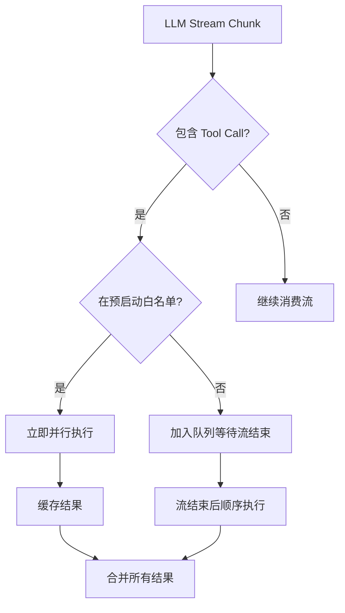
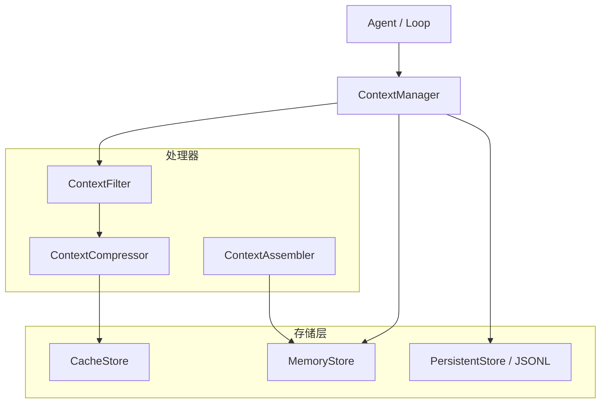
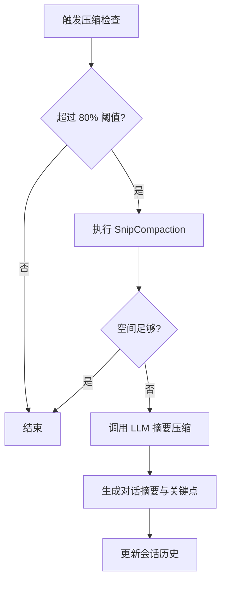
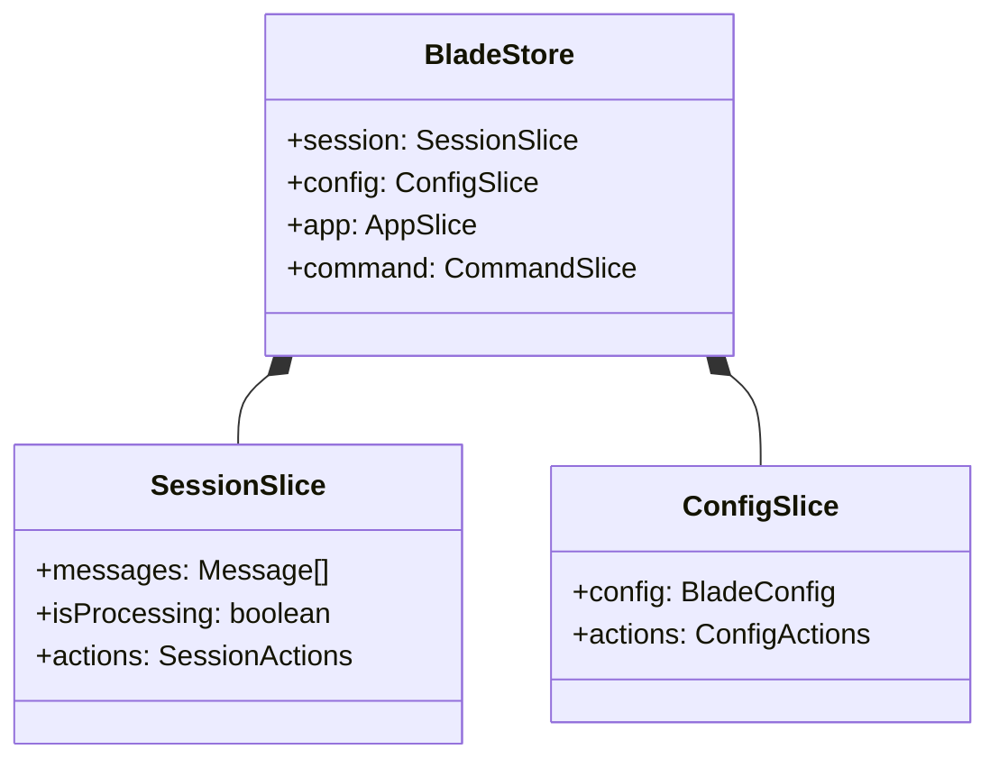
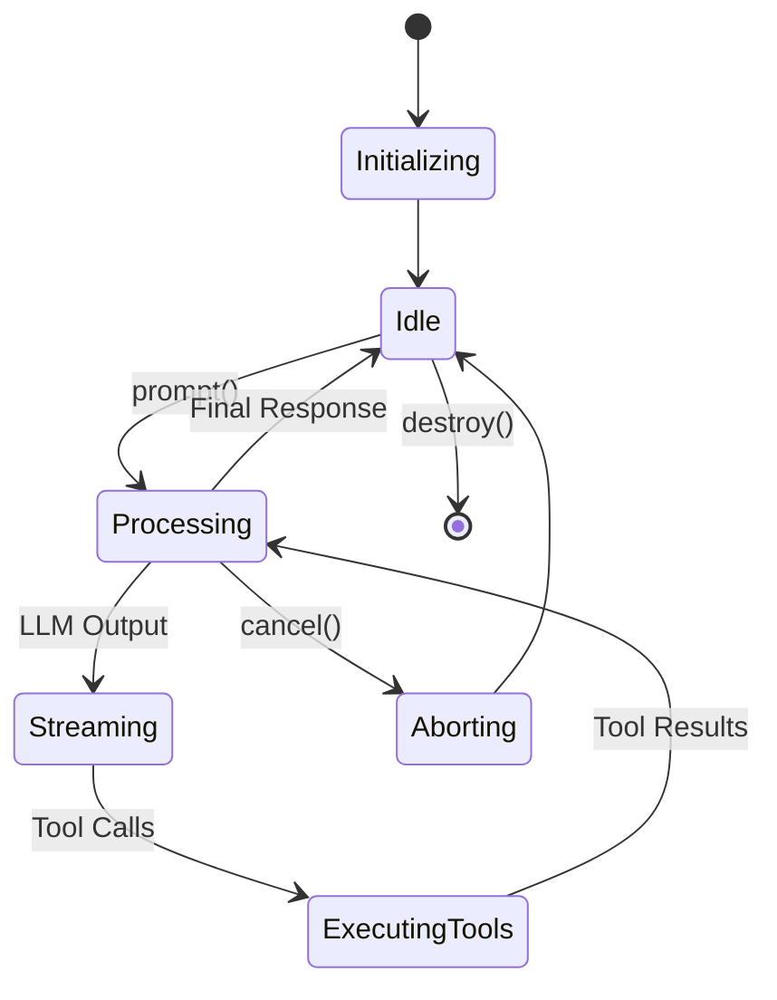

# 架构深度解析与内部原理

## 目录
1. [模块概览](#模块概览)
2. [Agent Loop 深度剖析](#agent-loop-深度剖析)
   - [核心循环生成器](#核心循环生成器)
   - [流式工具执行器 (StreamingToolExecutor)](#流式工具执行器-streamingtoolexecutor)
3. [智能上下文管理与优化](#智能上下文管理与优化)
   - [ContextManager 架构](#contextmanager-架构)
   - [上下文压缩算法 (Snip & Reactive)](#上下文压缩算法-snip--reactive)
   - [令牌预算控制 (TokenBudget)](#令牌预算控制-tokenbudget)
4. [状态管理架构](#状态管理架构)
   - [基于 Redux 思想的 Store 结构](#基于-redux-思想的-store-结构)
   - [数据流与副作用处理](#数据流与副作用处理)
5. [ACP 协议与会话运行时](#acp-协议与会话运行时)
   - [BladeAgent 与协议实现](#bladeagent-与协议实现)
   - [SessionRuntime 状态机](#sessionruntime-状态机)
6. [核心组件与数据模型](#核心组件与数据模型)
   - [ConversationState：消息单一事实源](#conversationstate消息单一事实源)
   - [ContextData 层次结构](#contextdata-层次结构)
7. [错误处理与恢复策略](#错误处理与恢复策略)
8. [文件参考](#文件参考)

## 模块概览

本章节深入探讨 Blade 的核心架构，揭示其作为高性能 AI Agent 框架的底层运行机制。Blade 的设计目标是实现极致的响应速度、智能的上下文管理以及稳健的状态恢复能力。

在对 `packages/cli/src` 目录的探索中，我们识别出以下关键子模块：
- **`agent/loop` (9 个文件)**：核心运行循环逻辑，负责 LLM 调用、工具分发和策略检查。
- **`context` (17 个文件)**：上下文生命周期管理，包含分层存储、智能压缩算法和令牌配额控制。
- **`store` (11 个文件)**：基于 Zustand 的全局状态管理，采用 Redux 思想进行切片（Slice）化设计。
- **`acp` (5 个文件)**：实现 Agent Client Protocol (ACP)，支持与 IDE（如 Zed、JetBrains）的深度集成。

本章节将全面覆盖上述模块，重点分析 `executeLoopGenerator` 的事件驱动架构、`ContextCompressor` 的多级压缩策略以及 `StreamingToolExecutor` 的流式并行执行原理。通过本章的学习，开发者将能够理解 Blade 如何在无状态的 LLM 之上构建出具有复杂状态管理和高性能执行能力的 Agent 系统。

## Agent Loop 深度剖析

Agent Loop 是 Blade 的心脏，负责协调用户输入、模型推理、工具执行和状态更新。Blade 采用了基于 `AsyncGenerator` 的事件驱动架构，将复杂的异步流程转化为可订阅的事件流。

### 核心循环生成器

`executeLoopGenerator` 是 Agent 循环的核心实现。它不直接返回最终结果，而是通过 `yield` 产生一系列 `LoopEvent`（如 `turn_start`、`content_delta`、`tool_start` 等）。这种设计使得 UI 层可以实时响应 Agent 的中间状态，同时也方便了子代理（Subagent）的递归调用。

该循环遵循严格的轮次控制逻辑，每一轮（Turn）都包含上下文检查、LLM 调用、策略校验和工具执行四个阶段。

```mermaid
sequenceDiagram
    participant Loop as executeLoopGenerator
    participant State as ConversationState
    participant LLM as ChatService
    participant Executor as StreamingToolExecutor
    participant Policy as CompletionPolicy

    Loop->>State: 准备消息历史
    Loop->>Loop: checkAndCompactInLoop()
    Loop->>LLM: streamChat() / chat()
    activate LLM
    LLM-->>Loop: Content Delta / Tool Calls
    deactivate LLM
    Loop->>Executor: addTool() (流式预启动)
    Loop->>Policy: checkOutputRecovery()
    Loop->>Executor: getRemainingResults()
    Executor-->>Loop: Tool Results
    Loop->>State: appendToolResult()
    Loop->>Policy: checkIncompleteIntent()
```

上面的序列图展示了一个典型的 Agent 轮次。值得注意的是，Blade 在 LLM 输出流式内容的同时，就会启动 `StreamingToolExecutor`。如果检测到工具调用属于“预启动白名单”（如文件读取、搜索等无副作用操作），执行器会立即并行启动这些工具，从而显著降低端到端延迟。

**Section sources**:
- [executeLoopGenerator.ts](file:///Users/bytedance/Documents/GitHub/Blade/packages/cli/src/agent/loop/executeLoopGenerator.ts)
- [consumeLoop.ts](file:///Users/bytedance/Documents/GitHub/Blade/packages/cli/src/agent/loop/consumeLoop.ts)

### 流式工具执行器 (StreamingToolExecutor)

`StreamingToolExecutor` 是 Blade 实现极致性能的关键组件。它解决了传统 Agent 必须等待 LLM 输出完全结束后才能执行工具的痛点。

它维护了一个“世代（Epoch）”计数器。当模型发生回退（Fallback）或流式输出被中断时，通过递增 Epoch，执行器可以安全地丢弃旧世代的工具执行结果，防止状态污染。



在 `StreamingToolExecutor` 中，`STREAMING_PRELAUNCH_ALLOWLIST` 包含了 `Read`、`Glob`、`Grep`、`WebSearch` 等工具。这些工具被认为是安全的，可以在模型尚未完成完整输出前就开始“抢跑”。

**Section sources**:
- [StreamingToolExecutor.ts](file:///Users/bytedance/Documents/GitHub/Blade/packages/cli/src/agent/loop/StreamingToolExecutor.ts)

## 智能上下文管理与优化

随着对话的深入，上下文长度会迅速增加，导致令牌（Token）消耗过大甚至超过模型限制。Blade 通过一套多级压缩和配额管理系统来解决这一问题。

### ContextManager 架构

`ContextManager` 是上下文管理的中枢，它采用了三层存储架构：
1. **MemoryStore**：内存存储，用于高速访问当前活跃会话。
2. **PersistentStore**：基于 JSONL 的持久化存储，记录每一条消息和工具调用的事件流，支持会话恢复。
3. **CacheStore**：缓存层，用于存储压缩后的上下文摘要和工具调用结果，避免重复计算。



`ContextManager` 的核心职责是将离散的事件流（Events）通过 `ContextAssembler` 重新组装成结构化的 `ContextData`。这种基于事件溯源（Event Sourcing）的设计确保了即使程序崩溃，也能从 JSONL 文件中完美恢复会话状态。

**Section sources**:
- [ContextManager.ts](file:///Users/bytedance/Documents/GitHub/Blade/packages/cli/src/context/ContextManager.ts)
- [ContextAssembler.ts](file:///Users/bytedance/Documents/GitHub/Blade/packages/cli/src/context/ContextAssembler.ts)

### 上下文压缩算法 (Snip & Reactive)

Blade 提供了两种主要的压缩策略，以平衡成本、性能和信息保留度：

1. **SnipCompaction (轻量级截断)**：
   这是一种纯本地的、确定性的算法。它会扫描消息历史，识别出旧的“助手工具调用 + 工具结果”对，并将它们替换为简单的占位符（如 `[N earlier tool interactions snipped]`）。这种方式不消耗 Token，且能迅速释放大量空间。

2. **ReactiveCompaction (反应式紧急压缩)**：
   当 LLM 返回 `413 (prompt_too_long)` 错误时，`ReactiveCompaction` 会被触发。它首先尝试更激进的 Snip 截断，如果仍然无效，则会调用 `CompactionService`，利用 LLM 对旧消息进行摘要总结（Summary），将冗长的对话浓缩为关键要点。



这种多级压缩策略确保了 Agent 在长时间运行中依然能保持对核心上下文的“记忆”，同时剔除不必要的细节。

**Section sources**:
- [SnipCompaction.ts](file:///Users/bytedance/Documents/GitHub/Blade/packages/cli/src/context/SnipCompaction.ts)
- [ReactiveCompaction.ts](file:///Users/bytedance/Documents/GitHub/Blade/packages/cli/src/context/ReactiveCompaction.ts)
- [CompactionService.ts](file:///Users/bytedance/Documents/GitHub/Blade/packages/cli/src/context/CompactionService.ts)

### 令牌预算控制 (TokenBudget)

为了防止 Agent 陷入死循环或产生无意义的续写，Blade 引入了 `TokenBudget` 机制。它不仅监控总使用量，还通过“收益递减检测”来决定是否停止生成。

主要检测维度包括：
- **连续续写次数**：当 LLM 连续多次触发输出恢复（Output Recovery）且每次增加的内容很少时，判定为收益递减。
- **使用率阈值**：当 Token 使用量接近模型上限（如 90%）时，主动建议停止，引导用户进行压缩或重新开始。

**Section sources**:
- [TokenBudget.ts](file:///Users/bytedance/Documents/GitHub/Blade/packages/cli/src/context/TokenBudget.ts)

## 状态管理架构

Blade 的状态管理借鉴了 Redux 和 Zustand 的思想，构建了一个单一事实源的全局状态树。

### 基于 Redux 思想的 Store 结构

Store 被划分为多个切片（Slices），每个切片负责特定的领域逻辑：
- **`sessionSlice`**：管理当前会话的消息、工具调用状态和运行时元数据。
- **`configSlice`**：管理用户配置、模型偏好和权限规则。
- **`appSlice`**：管理 UI 状态，如任务面板进度、Thinking 模式开关等。

Blade 采用了 `vanillaStore` 与 React Hook 分离的设计。`vanillaStore` 允许在非 React 环境（如 Agent 循环内部）直接访问和修改状态，而 `useBladeStore` 则为 UI 组件提供了响应式的订阅能力。



**Section sources**:
- [store/index.ts](file:///Users/bytedance/Documents/GitHub/Blade/packages/cli/src/store/index.ts)
- [store/vanilla.ts](file:///Users/bytedance/Documents/GitHub/Blade/packages/cli/src/store/vanilla.ts)

### 数据流与副作用处理

在 Blade 中，状态更新遵循严格的单向数据流。Action 是改变状态的唯一途径。对于具有副作用的操作（如持久化配置到磁盘），Blade 在 Action 中封装了异步逻辑：先更新内存状态以保证 UI 响应，再异步调用 `ConfigService` 进行持久化，如果失败则执行回滚。

## ACP 协议与会话运行时

Blade 不仅仅是一个 CLI 工具，它还通过 ACP (Agent Client Protocol) 协议变身为一个通用的 Agent 后端服务。

### BladeAgent 与协议实现

`BladeAgent` 实现了 ACP 接口，负责与 IDE 建立连接并协商能力。它支持：
- **初始化协商**：告知 IDE 自身支持的能力（如图片、MCP、嵌入上下文等）。
- **多会话管理**：为不同的 IDE 窗口或项目维护独立的 `AcpSession`。
- **权限模式切换**：支持 `default`、`auto-edit`、`yolo` 和 `plan` 四种权限模式，允许 IDE 动态控制 Agent 的权限。

### SessionRuntime 状态机

`SessionRuntime` 负责管理 ACP 会话的生命周期。它将复杂的 Agent 循环包装成符合协议要求的请求-响应模式，并处理取消（Cancel）和中断信号。



**Section sources**:
- [acp/BladeAgent.ts](file:///Users/bytedance/Documents/GitHub/Blade/packages/cli/src/acp/BladeAgent.ts)
- [agent/runtime/SessionRuntime.ts](file:///Users/bytedance/Documents/GitHub/Blade/packages/cli/src/agent/runtime/SessionRuntime.ts)

## 核心组件与数据模型

### ConversationState：消息单一事实源

为了解决 `executeLoopGenerator` 中消息历史与上下文对象不同步的问题，Blade 设计了 `ConversationState` 类。它强制执行了 6 条不变性（Invariants）准则，确保消息的时序和完整性。

它将消息分为三类：
1. **systemMessages**：根系统提示词，永远不参与压缩。
2. **history**：可压缩的会话历史。
3. **pending**：当前轮次正在生成的消息，尚未提交到历史中。

这种隔离设计使得压缩操作可以安全地作用于 `history`，而不会干扰到正在进行的对话轮次。

### ContextData 层次结构

`ContextData` 是 Blade 中最复杂的数据结构，它采用了分层设计：
- **System Layer**：AI 助手的角色定义和能力说明。
- **Session Layer**：会话元数据（ID、用户偏好、配置）。
- **Conversation Layer**：消息历史、主题摘要和最后活动时间。
- **Tool Layer**：最近的工具调用记录、工具状态和依赖项。
- **Workspace Layer**：当前项目路径、环境变量和活跃文件信息。

**Section sources**:
- [ConversationState.ts](file:///Users/bytedance/Documents/GitHub/Blade/packages/cli/src/agent/loop/ConversationState.ts)
- [context/types.ts](file:///Users/bytedance/Documents/GitHub/Blade/packages/cli/src/context/types.ts)

## 错误处理与恢复策略

Blade 针对 LLM 环境的各种异常设计了详尽的恢复策略：

- **API 错误提取**：通过 `extractApiErrorMessage` 深入解析各种 Provider 返回的复杂错误结构，提供友好的错误提示。
- **输出截断恢复 (Output Recovery)**：当 LLM 因为达到 `max_tokens` 限制而停止时，Blade 会自动注入 `Resume` 提示词，引导模型从中断点继续生成。
- **意图未完成重试**：如果模型输出的内容暗示任务未完成但没有调用工具，`checkIncompleteIntent` 会触发自动提醒。
- **Ralph Loop**：专门针对 Spec 模式的循环检查，确保所有定义的任务都已完成。

## 文件参考

本章节涉及的核心文件如下：

**Agent 运行循环**:
- [consumeLoop.ts](file:///Users/bytedance/Documents/GitHub/Blade/packages/cli/src/agent/loop/consumeLoop.ts) - 循环消费入口
- [executeLoopGenerator.ts](file:///Users/bytedance/Documents/GitHub/Blade/packages/cli/src/agent/loop/executeLoopGenerator.ts) - 核心生成器实现
- [ConversationState.ts](file:///Users/bytedance/Documents/GitHub/Blade/packages/cli/src/agent/loop/ConversationState.ts) - 消息状态管理
- [StreamingToolExecutor.ts](file:///Users/bytedance/Documents/GitHub/Blade/packages/cli/src/agent/loop/StreamingToolExecutor.ts) - 流式工具执行

**上下文与压缩**:
- [ContextManager.ts](file:///Users/bytedance/Documents/GitHub/Blade/packages/cli/src/context/ContextManager.ts) - 上下文管理器
- [processors/ContextCompressor.ts](file:///Users/bytedance/Documents/GitHub/Blade/packages/cli/src/context/processors/ContextCompressor.ts) - 压缩处理器
- [SnipCompaction.ts](file:///Users/bytedance/Documents/GitHub/Blade/packages/cli/src/context/SnipCompaction.ts) - 截断算法
- [ReactiveCompaction.ts](file:///Users/bytedance/Documents/GitHub/Blade/packages/cli/src/context/ReactiveCompaction.ts) - 紧急压缩
- [TokenBudget.ts](file:///Users/bytedance/Documents/GitHub/Blade/packages/cli/src/context/TokenBudget.ts) - 令牌配额管理

**状态与协议**:
- [store/index.ts](file:///Users/bytedance/Documents/GitHub/Blade/packages/cli/src/store/index.ts) - 全局 Store 入口
- [acp/BladeAgent.ts](file:///Users/bytedance/Documents/GitHub/Blade/packages/cli/src/acp/BladeAgent.ts) - ACP 协议实现
- [agent/runtime/SessionRuntime.ts](file:///Users/bytedance/Documents/GitHub/Blade/packages/cli/src/agent/runtime/SessionRuntime.ts) - 会话运行时
