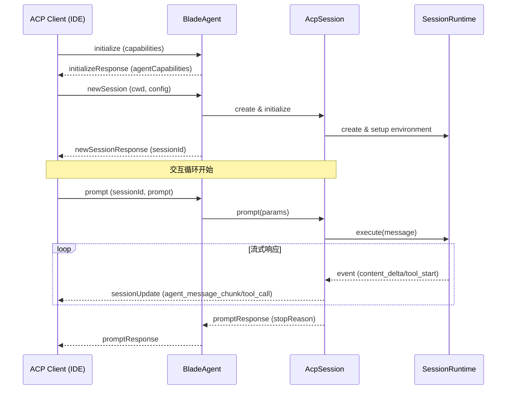
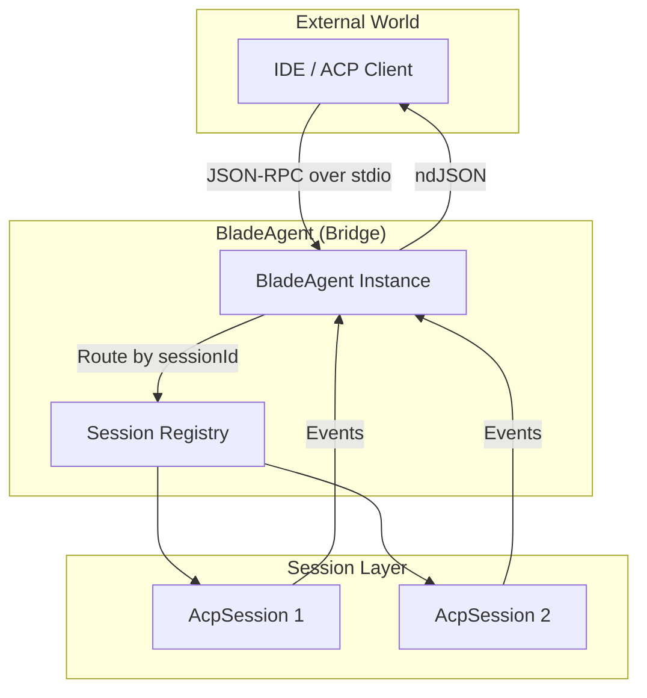
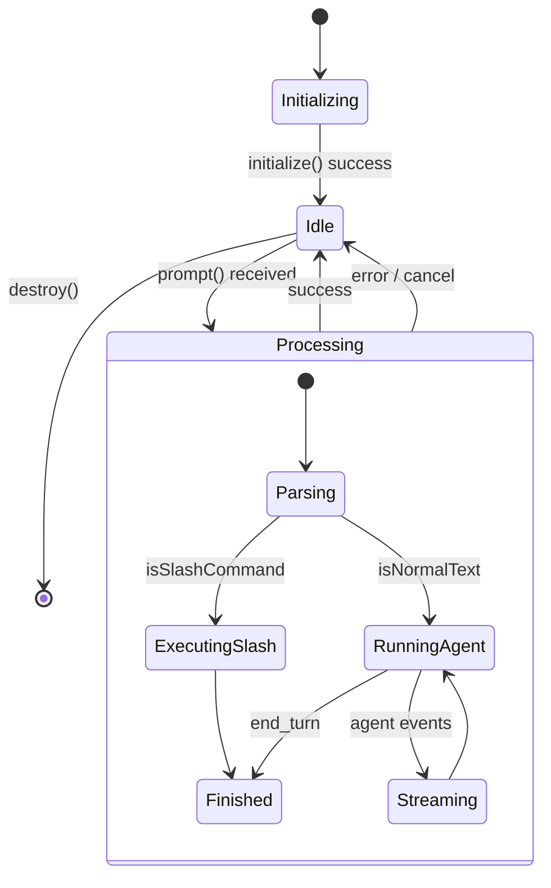
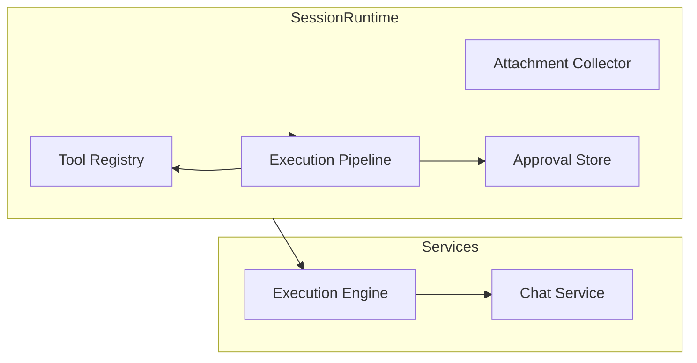
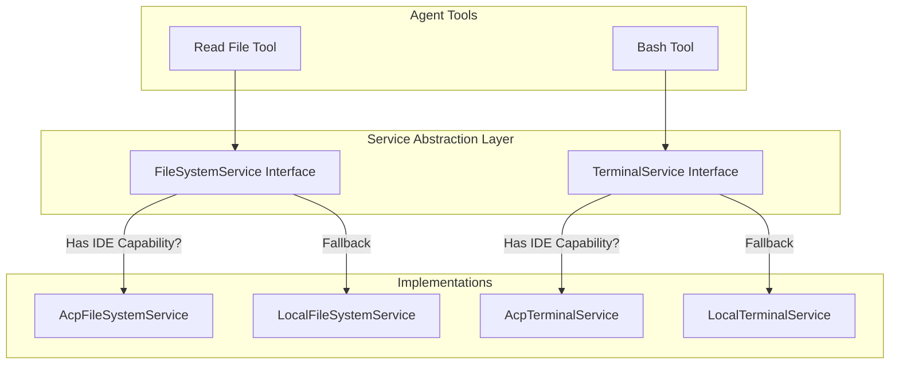
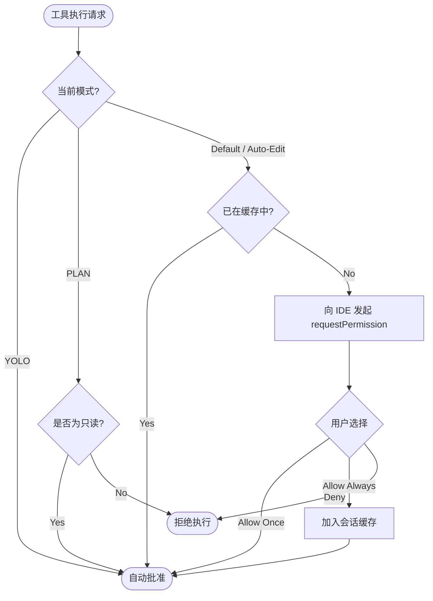

# ACP 协议与 Agent 运行时环境

## 目录
1. [模块概览](#模块概览)
2. [ACP 协议设计与交互流程](#acp-协议设计与交互流程)
3. [BladeAgent：协议桥梁](#bladeagent协议桥梁)
4. [Session 会话实体与状态管理](#session-会话实体与状态管理)
5. [SessionRuntime：Agent 运行环境抽象](#sessionruntimeagent-运行环境抽象)
6. [ACP 服务抽象：文件系统与终端](#acp-服务抽象文件系统与终端)
7. [权限模式与隔离机制](#权限模式与隔离机制)
8. [核心组件实现示例](#核心组件实现示例)
9. [文件参考](#文件参考)

## 模块概览

本模块负责 Blade 的底层通信协议 **ACP (Agent Control Protocol)** 的实现以及 **Agent 运行时环境 (SessionRuntime)** 的抽象。ACP 协议使 Blade 能够作为后端服务，与支持该协议的 IDE（如 Zed、JetBrains 等）进行无缝集成。

### 统计信息
- **总文件数**: 6 个 TypeScript 文件
- **核心目录**:
    - `packages/cli/src/acp/`: 包含 ACP 协议的具体实现、会话管理以及服务转发逻辑。
    - `packages/cli/src/agent/runtime/`: 包含 Agent 运行时的上下文定义和资源管理。
- **覆盖范围**: 本文档深度覆盖了 ACP 协议的初始化、会话建立、指令处理、流式输出转发以及受控环境下的资源操作。

### 模块职责
1. **协议转换**: 将标准化的 ACP 消息转换为 Blade 内部的指令和事件。
2. **环境隔离**: 为每个会话提供独立的 `SessionRuntime`，确保资源和权限的隔离。
3. **能力协商**: 与 IDE 协商支持的功能（如文件系统访问、终端执行、提示词能力等）。
4. **服务适配**: 提供透明的服务层，根据 IDE 的能力决定是调用 IDE 接口还是回退到本地执行。

## ACP 协议设计与交互流程

ACP (Agent Control Protocol) 是一种基于 JSON-RPC 的通信协议，专门为 AI Agent 与开发工具之间的交互而设计。在 Blade 中，ACP 协议通过 `stdin`/`stdout` 上的 `ndJSON` (Newline Delimited JSON) 流进行传输。

### 交互生命周期

典型的 ACP 交互遵循以下流程：初始化能力协商、创建会话、处理持续的 Prompt 请求。



### 消息格式
ACP 消息主要分为请求（Request）、响应（Response）和通知（Notification/Update）。
- **Initialize**: 协商协议版本和基础能力。
- **NewSession**: 开启一个新的工作上下文，通常绑定到一个特定的工作目录（CWD）。
- **Prompt**: 核心交互指令，包含用户输入、图片或嵌入资源。
- **SessionUpdate**: 异步通知，用于发送流式文本、工具调用状态、任务计划更新等。

**Section sources**:
- [BladeAgent.ts](file:///Users/bytedance/Documents/GitHub/Blade/packages/cli/src/acp/BladeAgent.ts)
- [index.ts](file:///Users/bytedance/Documents/GitHub/Blade/packages/cli/src/acp/index.ts)

## BladeAgent：协议桥梁

`BladeAgent` 类是 ACP 协议在 Blade 侧的实现主体。它实现了 `@agentclientprotocol/sdk` 中的 `Agent` 接口，充当外部 IDE 指令与内部 Agent 逻辑之间的路由中心。

### 核心功能
`BladeAgent` 负责管理所有活跃的会话。当 IDE 发送请求时，`BladeAgent` 根据 `sessionId` 将请求分发给对应的 `AcpSession` 实例。

1. **能力协商**: 在 `initialize` 阶段，它会声明 Blade 支持的能力，例如：
    - `promptCapabilities`: 是否支持图片、嵌入上下文等。
    - `mcpCapabilities`: 是否支持通过 HTTP 或 SSE 加载 MCP 插件。
2. **会话管理**: `newSession` 方法会创建一个全新的 `AcpSession` 实例。每个会话都有独立的状态和历史记录。
3. **全局清理**: `destroy` 方法确保在连接关闭时，所有会话资源（如 MCP 连接、临时文件）都被正确释放。



`BladeAgent` 并不直接处理复杂的 Agent 逻辑，而是作为一个轻量级的调度层。这种设计使得协议层与业务逻辑解耦，方便未来支持更多的通信协议。

**Section sources**:
- [BladeAgent.ts](file:///Users/bytedance/Documents/GitHub/Blade/packages/cli/src/acp/BladeAgent.ts)

## Session 会话实体与状态管理

`AcpSession` 是 Blade 中处理具体任务的核心实体。它将底层的 `Agent` 实例与 ACP 协议的异步特性结合在一起。

### 状态定义
每个 `AcpSession` 维护以下关键状态：
- **消息历史**: 存储当前会话的对话上下文。
- **权限缓存**: 记录用户在当前会话中授予的 "Always Allow" 权限。
- **模式 (Mode)**: 定义当前的权限策略（如 `yolo`、`auto-edit` 等）。
- **运行状态**: 跟踪当前是否有正在处理的 Prompt 请求，支持通过 `AbortController` 实现请求取消。

### 指令处理逻辑
当收到 `prompt` 请求时，`AcpSession` 会执行以下步骤：
1. **上下文恢复**: 设置 `AcpServiceContext` 确保工具调用时使用正确的会话环境。
2. **Slash Command 识别**: 检查输入是否为斜杠命令（如 `/commit`）。如果是，则直接执行命令逻辑。
3. **Agent 激活**: 如果是普通文本，则调用 `Agent.chatStream`。
4. **事件转发**: 监听 Agent 抛出的内部事件（如 `content_delta`、`tool_start`、`task_update`），并将其转换为 ACP 标准的 `sessionUpdate` 通知发送给 IDE。



**Section sources**:
- [Session.ts](file:///Users/bytedance/Documents/GitHub/Blade/packages/cli/src/acp/Session.ts)

## SessionRuntime：Agent 运行环境抽象

`SessionRuntime` 是 Agent 执行任务时的上下文环境。它不仅管理着 Agent 的核心组件（如 ChatService 和 ExecutionEngine），还负责资源的隔离和安全控制。

### 运行时组成
- **工具注册表 (ToolRegistry)**: 加载内置工具、MCP 工具和自定义技能。
- **附件收集器 (AttachmentCollector)**: 管理会话中的文件上下文，处理文件读取、截断和 Token 计算。
- **执行流水线 (ExecutionPipeline)**: 定义工具执行的策略，包括白名单/黑名单过滤、权限验证模式等。
- **审批存储 (SessionApprovalStore)**: 内存中的权限审批记录。

### 环境隔离
`SessionRuntime` 确保每个 Agent 都在受控的环境中运行。它通过以下方式实现隔离：
1. **独立的会话 ID**: 所有日志和资源追踪都绑定到 `sessionId`。
2. **动态配置应用**: 支持在会话运行期间动态切换模型、调整 Token 限制或更改权限模式。
3. **资源清理**: 当会话结束时，`dispose` 方法会清理所有关联的内存存储和网络连接。



**Section sources**:
- [SessionRuntime.ts](file:///Users/bytedance/Documents/GitHub/Blade/packages/cli/src/agent/runtime/SessionRuntime.ts)

## ACP 服务抽象：文件系统与终端

为了让 Agent 在 IDE 环境中更自然地工作，Blade 提供了 ACP 服务抽象。这些服务能够拦截 Agent 的底层操作，并将其转发给 IDE。

### 受控文件系统 (`AcpFileSystemService`)
当 IDE 声明支持文件系统能力时，Blade 会启用 `AcpFileSystemService`。
- **透明转发**: Agent 调用 `readTextFile` 或 `writeTextFile` 时，请求会通过 ACP 协议发送给 IDE。
- **回退机制**: 如果 IDE 不支持某个特定操作（如二进制读取或目录创建），服务会自动回退到本地文件系统（`LocalFileSystemService`）。
- **容错策略**: 在检查文件是否存在（`exists`）时，如果 ACP 接口返回未知错误，服务会倾向于假设文件存在，以避免 Agent 逻辑过早中断。

### 远程终端 (`AcpTerminalService`)
类似于文件系统，终端操作也可以被转发。
- **IDE 终端**: Agent 发起的 Shell 指令可以在 IDE 的原生终端窗口中运行，用户可以直接看到输出并进行交互。
- **流式输出轮询**: 由于 ACP 协议的限制，终端输出通过轮询方式获取，并实时流式反馈给 Agent。



**Section sources**:
- [AcpFileSystemService.ts](file:///Users/bytedance/Documents/GitHub/Blade/packages/cli/src/acp/AcpFileSystemService.ts)
- [AcpServiceContext.ts](file:///Users/bytedance/Documents/GitHub/Blade/packages/cli/src/acp/AcpServiceContext.ts)

## 权限模式与隔离机制

权限管理是 ACP 集成中的关键环节。Blade 将 ACP 的会话模式映射到内部的权限控制逻辑，确保用户对 Agent 的行为有完全的掌控。

### 模式映射表

| ACP 模式 | Blade 权限模式 | 行为描述 |
| :--- | :--- | :--- |
| `default` | `DEFAULT` | 所有文件编辑和指令执行都需要用户手动确认。 |
| `auto-edit` | `AUTO_EDIT` | 自动批准文件编辑操作，但执行 Shell 指令仍需确认。 |
| `yolo` | `YOLO` | 全自动模式，不进行任何确认，直接执行。 |
| `plan` | `PLAN` | 只读模式，不允许任何文件修改或指令执行。 |

### 权限请求流程
当 Agent 尝试执行敏感操作时，`AcpSession` 会通过 `requestPermission` 接口向 IDE 发起请求。



> **注意**: ACP 模式下的 "Always Allow" 仅在当前会话（In-Memory）中有效，不会持久化到本地配置中，以符合 IDE 会话隔离的安全预期。

**Section sources**:
- [Session.ts](file:///Users/bytedance/Documents/GitHub/Blade/packages/cli/src/acp/Session.ts)

## 核心组件实现示例

### 1. BladeAgent 的初始化逻辑
展示了如何处理 IDE 的初始化请求并协商能力。

```typescript
// packages/cli/src/acp/BladeAgent.ts

async initialize(params: acp.InitializeRequest): Promise<acp.InitializeResponse> {
  logger.info('[BladeAgent] Initializing ACP connection');
  
  // 保存客户端能力，用于后续判断是否使用 IDE 的文件系统
  this.clientCapabilities = params.clientCapabilities;

  return {
    protocolVersion: PROTOCOL_VERSION,
    agentCapabilities: {
      loadSession: false,
      promptCapabilities: {
        image: true,
        embeddedContext: true,
      },
      mcpCapabilities: {
        http: true,
        sse: true,
      },
    },
  };
}
```

### 2. SessionRuntime 的工具加载
说明了运行时如何根据配置动态构建工具注册表。

```typescript
// packages/cli/src/agent/runtime/SessionRuntime.ts

private async registerBuiltinTools(): Promise<void> {
  const builtinTools = await getBuiltinTools({
    sessionId: this.sessionId,
    configDir: path.join(os.homedir(), '.blade'),
  });

  // 过滤掉 MCP 代理工具，只保留真正的内置工具
  const builtin = builtinTools.filter((tool) => !tool.name.startsWith('mcp__'));
  this.baseRegistry.registerAll(builtin);

  // 加载并注册 MCP 工具
  await this.registerMcpTools();
}
```

### 3. AcpSession 的流式事件处理
展示了如何将 Agent 的内部事件流转发给 ACP 客户端。

```typescript
// packages/cli/src/acp/Session.ts

await drainLoop(
  this.agent.chatStream(message, context),
  async (event: LoopEvent) => {
    switch (event.kind) {
      case 'content_delta':
        this.sendUpdate({
          sessionUpdate: 'agent_message_chunk',
          content: { type: 'text', text: event.delta },
        });
        break;
      case 'tool_start':
        this.sendUpdate({
          sessionUpdate: 'tool_call',
          toolCallId: event.toolCall.id,
          status: 'in_progress',
          title: `Executing ${event.toolCall.function.name}`,
          kind: this.mapToolKind(event.toolKind),
        });
        break;
      // ... 其他事件处理
    }
  }
);
```

## 文件参考

以下是本模块涉及的核心源文件：

- [BladeAgent.ts](file:///Users/bytedance/Documents/GitHub/Blade/packages/cli/src/acp/BladeAgent.ts): ACP 协议的入口类，负责会话分发和能力协商。
- [SessionRuntime.ts](file:///Users/bytedance/Documents/GitHub/Blade/packages/cli/src/agent/runtime/SessionRuntime.ts): 定义 Agent 的执行环境，管理工具、模型和权限配置。
- [Session.ts](file:///Users/bytedance/Documents/GitHub/Blade/packages/cli/src/acp/Session.ts): 会话逻辑的实现，处理 Prompt 请求与流式反馈。
- [AcpFileSystemService.ts](file:///Users/bytedance/Documents/GitHub/Blade/packages/cli/src/acp/AcpFileSystemService.ts): 协议层的文件系统适配器。
- [AcpServiceContext.ts](file:///Users/bytedance/Documents/GitHub/Blade/packages/cli/src/acp/AcpServiceContext.ts): 管理按会话隔离的服务上下文。
- [index.ts](file:///Users/bytedance/Documents/GitHub/Blade/packages/cli/src/acp/index.ts): 模块导出及 ACP 运行主函数。
