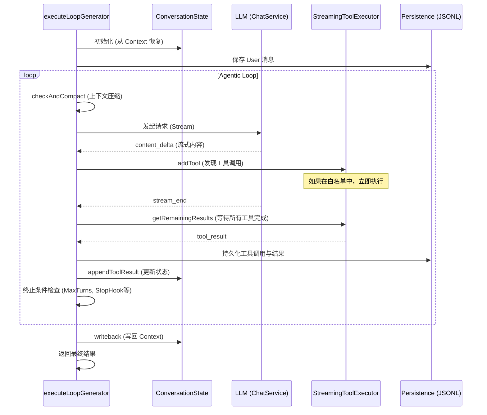
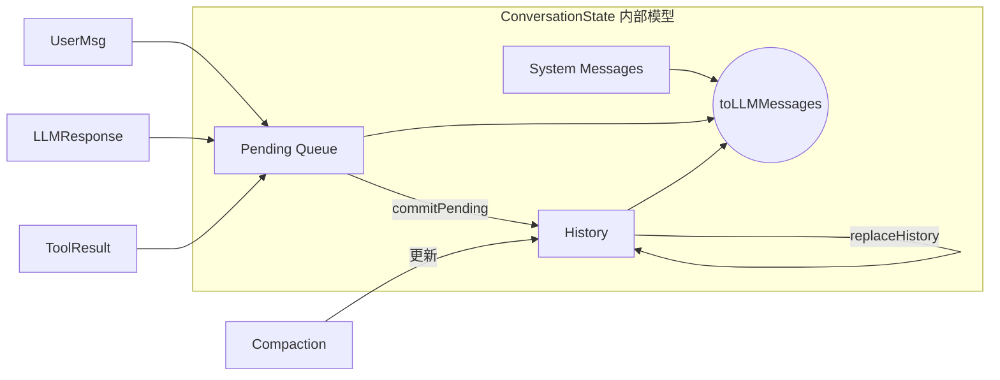
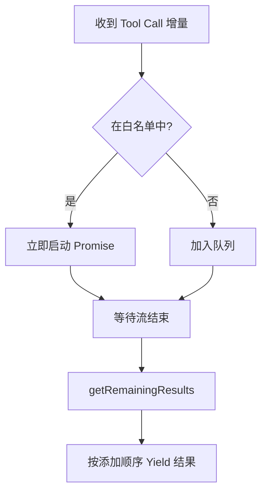
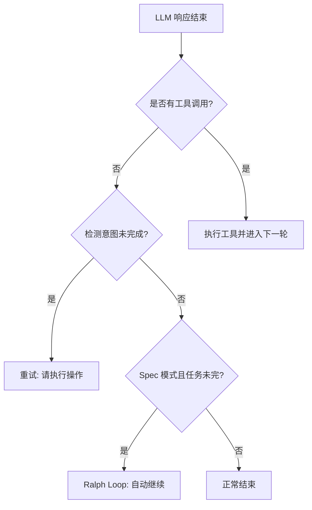

# Agent Loop 核心运行机制

## 目录
1. [模块概览](#模块概览)
2. [引言](#引言)
3. [核心架构](#核心架构)
4. [核心组件解析](#核心组件解析)
   - [executeLoopGenerator: 循环驱动器](#executeloopgenerator-循环驱动器)
   - [ConversationState: 消息状态管理器](#conversationstate-消息状态管理器)
   - [StreamingToolExecutor: 流式工具执行器](#streamingtoolexecutor-流式工具执行器)
5. [关键运行逻辑](#关键运行逻辑)
   - [工具调用闭环处理](#工具调用闭环处理)
   - [运行策略与终止条件](#运行策略与终止条件)
6. [状态持久化与“无状态”设计](#状态持久化与无状态设计)
7. [错误处理与恢复机制](#错误处理与恢复机制)
8. [文件参考](#文件参考)

## 模块概览

本模块位于 `packages/cli/src/agent/loop/`，是 Blade AI Agent 的“大脑中枢”。它负责管理 Agent 的思考（LLM 调用）、行动（工具执行）以及状态演进。

- **文件总数**：共发现 9 个 TypeScript 文件。
- **子目录**：无子目录，所有核心逻辑均在根目录下平铺，结构清晰。
- **覆盖范围**：
  - **核心深度覆盖**：`executeLoopGenerator.ts`, `ConversationState.ts`, `StreamingToolExecutor.ts`, `completionPolicy.ts`。
  - **辅助逻辑覆盖**：`conversationPersistence.ts`, `toolDomainPolicy.ts`, `types.ts`。
  - **简要提及**：`consumeLoop.ts` (工具函数), `index.ts` (导出入口)。

通过本章节，读者将深入理解 Blade 如何通过异步生成器（AsyncGenerator）模式驱动复杂的 Agent 交互，以及如何在高并发、长上下文的挑战下保持状态的精确同步。

## 引言

Agent Loop（代理循环）是 AI Agent 能够自主思考并完成任务的基础机制。在 Blade 中，Agent Loop 不仅仅是一个简单的 `while` 循环，它是一个集成了流式响应处理、并行工具执行、上下文自动压缩、意图检测以及状态持久化的复杂系统。

Blade 的设计哲学强调**确定性**与**可观测性**。Agent Loop 被实现为一个 `AsyncGenerator`，这使得 UI 层可以实时订阅循环中产生的每一个微小事件（如内容增量、工具启动、Token 使用情况等），从而提供极佳的用户体验。同时，通过 `ConversationState` 的单一状态源设计，解决了在复杂迭代中常见的消息历史不同步问题。

## 核心架构

Blade 的 Agent Loop 遵循典型的 ReAct（Reasoning and Acting）范式，但针对工程实践进行了大量优化。其核心流程可以概括为：**状态准备 -> 上下文检查 -> LLM 推理 -> 工具并行执行 -> 状态更新 -> 终止判定**。

以下序列图展示了 `executeLoopGenerator` 在一个典型轮次中的执行流程：



**架构解析**：
该流程始于 `executeLoopGenerator` 的启动。首先，它通过 `ConversationState` 将传入的 `ChatContext` 转换为一个受控的状态模型。在每一轮循环中，系统都会先检查 Token 预算，必要时触发 `CompactionService` 进行上下文压缩。

LLM 的调用默认采用流式模式。`processStreamResponse` 负责消费流并实时 yield 事件。一个关键的优化是 `StreamingToolExecutor`：当 LLM 还在输出时，如果识别到白名单内的工具（如 `Read`, `Grep` 等无副作用工具），执行器会立即启动它们，从而大幅减少往返时延（RTT）。循环的终点是各种策略判定，确保 Agent 不会陷入无限循环，并能在 LLM 表现异常时及时纠偏。

**Diagram sources**:
- [executeLoopGenerator.ts](file:///Users/bytedance/Documents/GitHub/Blade/packages/cli/src/agent/loop/executeLoopGenerator.ts)
- [StreamingToolExecutor.ts](file:///Users/bytedance/Documents/GitHub/Blade/packages/cli/src/agent/loop/StreamingToolExecutor.ts)

## 核心组件解析

### executeLoopGenerator: 循环驱动器

`executeLoopGenerator` 是整个模块的入口函数。它被定义为一个异步生成器，接受 `LoopDependencies`、用户消息、上下文等参数。

**核心职责**：
1. **工具注入**：从注册表中获取可用工具，并应用 Skill 限制。
2. **事件分发**：通过 `yield` 抛出 `LoopEvent`，包括内容增量、工具状态、Token 统计等。
3. **流程编排**：管理 LLM 调用与工具执行的交替，处理非流式降级。
4. **中断处理**：监听 `AbortSignal`，确保任务可以安全中止。

> 💡 **提示**：由于它是一个 Generator，调用方可以使用 `for await...of` 轻松实现 UI 的流式渲染。

### ConversationState: 消息状态管理器

在早期的实现中，消息历史散落在多处，容易导致状态不一致。`ConversationState` 引入了“单一事实来源”设计。

```typescript
// 核心状态结构
export class ConversationState {
  private readonly systemMessages: Message[]; // 系统提示词（隔离在压缩之外）
  private _history: Message[];               // 可压缩的历史（来自持久化）
  private _pending: Message[] = [];          // 当前轮次产生的临时消息
  
  toLLMMessages(): Message[] {
    return [...this.systemMessages, ...this._history, ...this._pending];
  }
}
```

**设计要点**：
- **三层结构**：将消息分为 `systemMessages`（根提示）、`history`（已确认的历史）和 `pending`（当前轮次产生的 assistant/tool 消息）。
- **隔离压缩**：根系统提示词被显式隔离，确保在自动压缩过程中不会被误删或修改。
- **原子提交**：只有在工具执行完毕且准备进入下一轮 LLM 调用时，才会通过 `commitPending()` 将临时消息合并到历史中。



**状态流转解析**：
如上图所示，所有新产生的消息首先进入 `Pending Queue`。这种设计允许系统在当前轮次失败时轻松回滚，而不会污染持久化的 `History`。当一轮交互完整结束后，`Pending` 消息被“提交”到 `History`。这种分层机制是 Blade 能够处理长时间、多步骤任务的关键。

**Diagram sources**:
- [ConversationState.ts](file:///Users/bytedance/Documents/GitHub/Blade/packages/cli/src/agent/loop/ConversationState.ts)

### StreamingToolExecutor: 流式工具执行器

为了极致的性能，Blade 实现了工具的流式预启动。

**核心逻辑**：
- **白名单机制**：定义了 `STREAMING_PRELAUNCH_ALLOWLIST`（包含 `Read`, `Glob`, `Grep`, `WebSearch` 等）。
- **并行执行**：在 LLM 还在生成 JSON 参数的过程中，一旦某个工具的参数解析完成，执行器立即启动该工具。
- **世代管理 (Epoch)**：使用 `epoch` 计数器处理模型回退（Fallback）。如果模型切换，旧世代的工具结果将被自动忽略。



**执行流程解析**：
执行器维护了 `pending`、`completed` 和 `queued` 三个状态。对于无副作用的读取类工具，它利用 LLM 生成的间隙提前获取数据。当流结束时，`getRemainingResults` 会确保所有工具（包括排队中的写入类工具）按顺序完成并返回结果。

**Diagram sources**:
- [StreamingToolExecutor.ts:L34-L44](file:///Users/bytedance/Documents/GitHub/Blade/packages/cli/src/agent/loop/StreamingToolExecutor.ts#L34-L44)

## 关键运行逻辑

### 工具调用闭环处理

工具调用是 Agent 产生影响力的唯一方式。Blade 确保了从调用到结果的完整闭环，并集成了持久化和副作用处理。

```typescript
// 简化的工具执行闭环示例
for (const toolCall of functionCalls) {
  // 1. 记录工具启动
  yield { kind: 'tool_start', toolCall };
  
  // 2. 持久化工具调用意图
  const toolUseUuid = await saveToolUse(deps, context, toolCall.function.name, params);
  
  // 3. 执行工具
  const result = await deps.executionPipeline.execute(toolCall.function.name, params);
  
  // 4. 持久化工具结果
  await saveToolResult(deps, context, toolCall.id, result, toolUseUuid);
  
  // 5. 应用领域副作用（如任务状态更新）
  const taskAction = await applyToolDomainEffects(toolCall, result, deps);
  if (taskAction) yield taskAction;
  
  // 6. 更新内存状态
  state.appendToolResult({ role: 'tool', content: result.llmContent });
}
```

### 运行策略与终止条件

为了防止 Agent 失控或陷入死循环，`completionPolicy.ts` 定义了一系列严谨的策略：

1. **意图未完成检测 (Incomplete Intent)**：
   如果 LLM 输出以“让我开始查看：”结尾但没有调用工具，系统会识别到这种“光说不做”的模式，并自动追加提示词引导其执行。
   
2. **输出恢复 (Output Recovery)**：
   当 LLM 因为 `max_tokens` 限制被强行截断时（`finishReason === 'length'`），系统会自动注入一条恢复提示词（Recovery Prompt），要求 LLM 从断点处继续，而不是重新开始。

3. **Ralph Loop (Spec 自动推进)**：
   在 Spec 模式下，如果检测到仍有待处理任务，系统会自动触发继续执行，减少用户手动输入 "continue" 的频率。



**策略逻辑解析**：
这些策略构成了 Agent 的“防御性编程”层。`checkIncompleteIntent` 利用正则匹配尾部字符，而 `checkOutputRecovery` 则管理着一个最多 3 次的重试计数器。这些细微的逻辑极大提升了 Agent 在处理复杂、长耗时任务时的鲁棒性。

**Diagram sources**:
- [completionPolicy.ts](file:///Users/bytedance/Documents/GitHub/Blade/packages/cli/src/agent/loop/completionPolicy.ts)

## 状态持久化与“无状态”设计

Blade 的 Agent 被设计为“逻辑上无状态，物理上有记录”。这意味着即使进程崩溃，只要有 JSONL 日志，就能完美恢复之前的对话状态。

**持久化层级**：
- **User Message**: 记录用户的初始指令。
- **Assistant Message**: 记录 AI 的思考过程和回复。
- **Tool Use**: 记录工具名称和参数。
- **Tool Result**: 记录工具执行后的输出或错误。
- **Compaction**: 记录上下文压缩的摘要，作为后续轮次的背景。

这种设计通过 `conversationPersistence.ts` 统一封装。每一个 `save*` 函数都会返回一个 UUID，形成一个链式的消息引用关系，支持复杂的追溯和调试。

## 错误处理与恢复机制

在 Agent 运行过程中，错误是不可避免的。Blade 区分了多种错误类型并采取不同策略：

- **API 错误 (4xx/5xx)**：通过 `extractApiErrorMessage` 提取友好提示，并允许用户重试。
- **上下文超限 (413/Prompt Too Long)**：触发**反应式压缩 (Reactive Compaction)**。系统会立即尝试压缩当前上下文并重新发起请求，而不是直接报错退出。
- **工具执行失败**：将错误信息包装为 `ToolResult` 返回给 LLM，让 LLM 决定是尝试修复参数还是放弃该路径。
- **流式不支持**：如果 Provider 不支持流式输出，系统会自动回退到非流式模式（Non-streaming Fallback）。

## 文件参考

以下是本模块涉及的核心源文件：

- [executeLoopGenerator.ts](file:///Users/bytedance/Documents/GitHub/Blade/packages/cli/src/agent/loop/executeLoopGenerator.ts): 核心循环驱动逻辑。
- [ConversationState.ts](file:///Users/bytedance/Documents/GitHub/Blade/packages/cli/src/agent/loop/ConversationState.ts): 消息状态管理类。
- [StreamingToolExecutor.ts](file:///Users/bytedance/Documents/GitHub/Blade/packages/cli/src/agent/loop/StreamingToolExecutor.ts): 流式并行工具执行器。
- [completionPolicy.ts](file:///Users/bytedance/Documents/GitHub/Blade/packages/cli/src/agent/loop/completionPolicy.ts): 运行策略与终止判定。
- [toolDomainPolicy.ts](file:///Users/bytedance/Documents/GitHub/Blade/packages/cli/src/agent/loop/toolDomainPolicy.ts): 工具执行后的领域副作用处理。
- [conversationPersistence.ts](file:///Users/bytedance/Documents/GitHub/Blade/packages/cli/src/agent/loop/conversationPersistence.ts): 统一的持久化接口。
- [types.ts](file:///Users/bytedance/Documents/GitHub/Blade/packages/cli/src/agent/loop/types.ts): 循环相关的类型定义。
- [consumeLoop.ts](file:///Users/bytedance/Documents/GitHub/Blade/packages/cli/src/agent/loop/consumeLoop.ts): 消费生成器的工具函数。

**Section sources**:
- [packages/cli/src/agent/loop/](file:///Users/bytedance/Documents/GitHub/Blade/packages/cli/src/agent/loop/)
