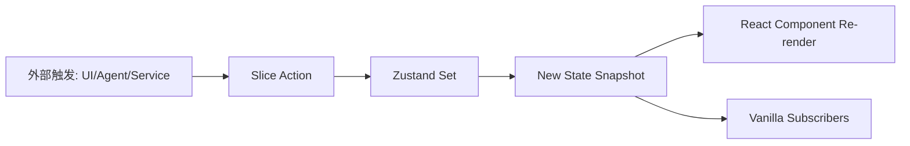
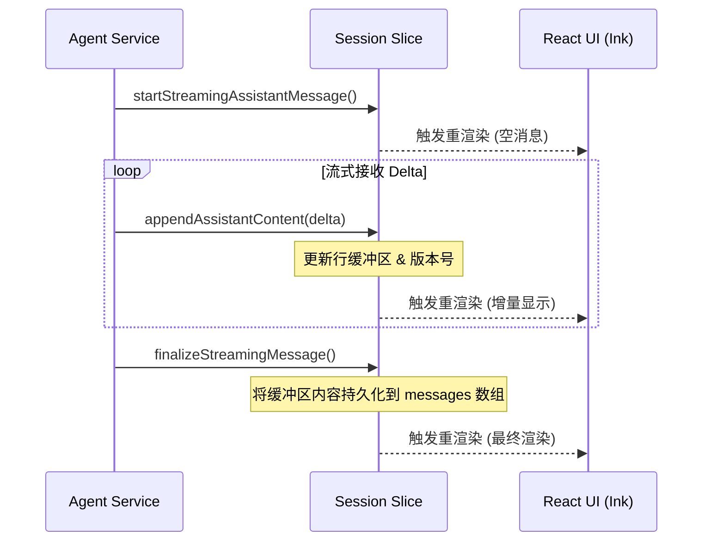
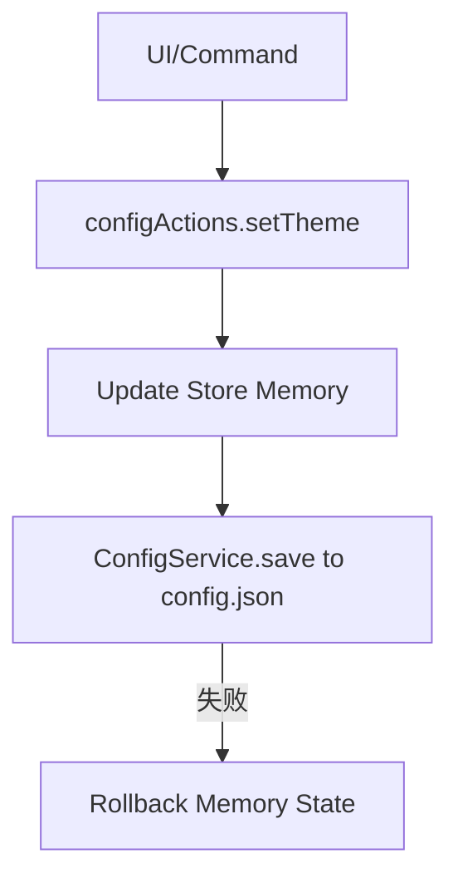

# 基于 Redux 的全局状态管理

## 目录
1. [模块概览](#模块概览)
2. [引言](#引言)
3. [核心组件](#核心组件)
   - [Vanilla Store：单一数据源](#vanilla-store单一数据源)
   - [模块化切片 (Slices)](#模块化切片-slices)
   - [强选择器约束 (Selectors)](#强选择器约束-selectors)
4. [架构设计与数据流](#架构设计与数据流)
   - [全局状态树结构](#全局状态树结构)
   - [Action -> State 更新机制](#action---state-更新机制)
   - [异步 Agent 状态更新流](#异步-agent-状态更新流)
5. [持久化机制](#持久化机制)
   - [配置持久化 (Config Persistence)](#配置持久化-config-persistence)
   - [会话持久化 (Session Persistence)](#会话持久化-session-persistence)
6. [集成点与环境解耦](#集成点与环境解耦)
   - [React 订阅机制](#react-订阅机制)
   - [非 React 环境访问](#非-react-环境访问)
7. [核心数据模型](#核心数据模型)
8. [文件引用](#文件引用)

## 模块概览

Blade 的状态管理模块位于 `packages/cli/src/store/` 目录，共包含 11 个 TypeScript 文件。该模块负责管理从底层的 Agent 执行状态到上层的 UI 展示逻辑的所有全局数据。

- **文件总数**：11 个
- **子目录**：
  - `slices/`：定义了 6 个功能模块的独立状态切片（Session, App, Config, Focus, Command, Spec）。
  - `selectors/`：封装了高效的状态查询接口，确保组件重渲染的最小化。
- **覆盖深度**：
  - **深度覆盖**：`index.ts`, `vanilla.ts`, `types.ts`, `slices/sessionSlice.ts`, `slices/appSlice.ts`, `slices/configSlice.ts`。
  - **标准覆盖**：`slices/specSlice.ts`, `slices/commandSlice.ts`, `selectors/index.ts`。

## 引言

在 Blade 这样复杂的 CLI 应用中，状态管理面临着独特的挑战：它不仅需要驱动基于 React (Ink) 的终端 UI，还需要为后台运行的 Agent、异步执行的工具（Tools）以及文件系统服务提供实时的数据支持。

Blade 采用了一种**基于 Redux 思想但使用 Zustand 实现**的架构。它保留了 Redux 的核心准则——单一数据源、状态只读、通过 Action 更新，但舍弃了 Redux 繁琐的样板代码。通过 `zustand/vanilla`，Blade 构建了一个与环境无关的核心 Store 实例，实现了逻辑层（Agent/Services）与展示层（React UI）的完美解耦。

> 💡 **核心设计哲学**：
> 1. **单一数据源**：整个应用的状态都存储在一个树状结构中。
> 2. **逻辑与 UI 分离**：核心逻辑通过 Vanilla Store 修改状态，UI 仅作为状态的订阅者。
> 3. **强原子化 Action**：不直接暴露修改状态的 `set` 方法，所有变更必须通过预定义的 Actions。

## 核心组件

### Vanilla Store：单一数据源

`vanillaStore` 是 Blade 的核心。它是一个不依赖 React 上下文的纯 JS 实例，允许在任何地方（如 Agent 的回调函数中）同步或异步地更新状态。

```typescript
// packages/cli/src/store/vanilla.ts

export const vanillaStore = createStore<BladeStore>()(
  devtools(
    subscribeWithSelector((...a) => ({
      session: createSessionSlice(...a),
      app: createAppSlice(...a),
      config: createConfigSlice(...a),
      focus: createFocusSlice(...a),
      command: createCommandSlice(...a),
      spec: createSpecSlice(...a),
    })),
    {
      name: 'BladeStore',
      enabled: process.env.NODE_ENV === 'development',
    }
  )
);
```

**Section sources**:
- [vanilla.ts](file:///Users/bytedance/Documents/GitHub/Blade/packages/cli/src/store/vanilla.ts)

### 模块化切片 (Slices)

为了保持代码的可维护性，Store 被划分为多个功能切片。每个切片负责一个独立的业务领域：

1. **SessionSlice**：管理聊天历史、流式消息缓冲区、Token 使用统计等。
2. **AppSlice**：管理 UI 状态，如当前打开的模态框、初始化进度、任务列表显示等。
3. **ConfigSlice**：管理运行时配置和用户持久化配置。
4. **CommandSlice**：管理命令执行状态、中断控制（AbortController）和命令队列。
5. **SpecSlice**：管理 Spec-Driven Development 的全生命周期状态。
6. **FocusSlice**：管理终端交互中的焦点切换。

### 强选择器约束 (Selectors)

为了防止 React 组件因为无关的状态变更而频繁重渲染，Blade 强制使用选择器（Selectors）访问状态。

```typescript
// packages/cli/src/store/selectors/index.ts

/**
 * 获取当前流式消息缓冲（行/尾部/总行数/版本）
 * 使用 useShallow 优化对象返回，避免浅比较导致的重复渲染
 */
export const useCurrentStreamingBuffer = () =>
  useBladeStore(
    useShallow((state) => ({
      lines: state.session.currentStreamingLines,
      tail: state.session.currentStreamingTail,
      lineCount: state.session.currentStreamingLineCount,
      version: state.session.currentStreamingVersion,
    }))
  );
```

**Section sources**:
- [selectors/index.ts](file:///Users/bytedance/Documents/GitHub/Blade/packages/cli/src/store/selectors/index.ts)

## 架构设计与数据流

### 全局状态树结构

Blade 的全局状态树是一个深度嵌套的对象，每个顶级键对应一个 Slice。理解这个结构对于定位数据来源至关重要。

以下图表展示了 Blade 全局状态树的完整层级关系：

```mermaid
graph TD
    Store[Blade Store]
    
    subgraph "Session Slice (会话层)"
        S1[sessionId: string]
        S2[messages: SessionMessage[]]
        S3[tokenUsage: TokenUsage]
        S4[streamingBuffer: StreamingState]
    end
    
    subgraph "App Slice (UI层)"
        A1[initializationStatus: string]
        A2[activeModal: ModalType]
        A3[tasks: TaskListItem[]]
    end
    
    subgraph "Config Slice (配置层)"
        C1[runtimeConfig: RuntimeConfig]
        C2[persistentConfig: BladeConfig]
    end
    
    subgraph "Command Slice (执行层)"
        D1[isProcessing: boolean]
        D2[abortController: AbortController]
        D3[pendingCommands: Queue]
    end
    
    Store --> Session
    Store --> App
    Store --> Config
    Store --> Command
    Store --> Focus
    Store --> Spec
    
    Session --> S1 & S2 & S3 & S4
    App --> A1 & A2 & A3
    Config --> C1 & C2
    Command --> D1 & D2 & D3
```

该结构图清晰地描绘了 `BladeStore` 的六大核心领域。`Session` 负责数据持久化相关的内容，`App` 负责 UI 的瞬时状态，而 `Config` 则是连接内存与磁盘配置的桥梁。这种划分确保了不同关注点的代码逻辑不会相互耦合。

**Diagram sources**:
- [types.ts:L358-L365](file:///Users/bytedance/Documents/GitHub/Blade/packages/cli/src/store/types.ts#L358-L365)

### Action -> State 更新机制

Blade 遵循严格的单向数据流。状态的修改必须通过 Action 触发，Action 内部调用 `set` 函数来产生新的状态快照。



当外部（如用户点击或 Agent 返回结果）触发一个动作时，对应的 `Slice Action` 会被执行。Action 内部封装了复杂的业务逻辑（例如在 `sessionSlice` 中处理流式行缓冲），最终通过 `set` 方法原子化地更新状态。更新后的状态快照会同时通知 React 组件和通过 `vanillaStore.subscribe` 订阅的非 React 监听器。

### 异步 Agent 状态更新流

Agent 的状态更新通常是异步且高频的（例如流式输出）。Blade 通过专门的流式缓冲区设计来优化这一过程。



在流式输出场景下，Agent 调用 `appendAssistantContent`。为了避免频繁更新导致终端闪烁，`sessionSlice` 内部维护了一个 `streamingChunksBuffer`（模块级变量，非状态），仅在 `finalize` 时才进行最终的字符串拼接。同时，它通过更新 `currentStreamingVersion` 版本号来精确控制 UI 的刷新时机。

**Diagram sources**:
- [slices/sessionSlice.ts:L375-L519](file:///Users/bytedance/Documents/GitHub/Blade/packages/cli/src/store/slices/sessionSlice.ts#L375-L519)

## 持久化机制

Blade 的 Store 本身是内存型的，但在 CLI 环境中，状态的持久化至关重要。Blade 没有使用 Zustand 的 `persist` 中间件，而是采用了更细粒度的手动持久化策略。

### 配置持久化 (Config Persistence)

配置状态的变更会自动触发对磁盘文件的异步写入。



如上图所示，当用户修改配置（如切换主题）时，`configActions` 会首先同步更新内存中的状态以保证 UI 的即时响应，随后调用 `ConfigService` 进行磁盘持久化。如果磁盘写入失败，系统会自动回滚内存状态，确保数据的一致性。

### 会话持久化 (Session Persistence)

会话数据的持久化更为复杂，因为它涉及大量的消息历史。

1. **内存缓存**：`sessionSlice` 存储当前会话的所有消息，用于 UI 渲染。
2. **磁盘同步**：`ContextManager` 负责监听会话变更，并将其增量写入 `.blade/sessions/` 下的 JSONL 文件。
3. **恢复机制**：应用启动时，通过 `restoreSession` action 将磁盘数据重新加载到内存。

**Section sources**:
- [vanilla.ts:L191-L300](file:///Users/bytedance/Documents/GitHub/Blade/packages/cli/src/store/vanilla.ts#L191-L300)
- [slices/sessionSlice.ts:L235-L252](file:///Users/bytedance/Documents/GitHub/Blade/packages/cli/src/store/slices/sessionSlice.ts#L235-L252)

## 集成点与环境解耦

### React 订阅机制

在 React 组件中，我们使用 `useBladeStore` hook。它本质上是 `zustand` 的 `useStore` 对 `vanillaStore` 的封装。

```typescript
// packages/cli/src/store/index.ts

export function useBladeStore<T>(selector: (state: BladeStore) => T): T {
  return useStore(vanillaStore, selector);
}
```

### 非 React 环境访问

这是 Blade 架构最强大的地方。Agent 或服务层可以直接通过 `vanillaStore` 访问或修改状态，而无需关心 UI 是否存在。

```typescript
// 非 React 环境示例
import { sessionActions, getState } from './store/vanilla.js';

// 获取状态
const messages = getState().session.messages;

// 执行动作
sessionActions().addAssistantMessage('Hello from Agent');
```

这种设计实现了**逻辑驱动 UI**：Agent 只管更新状态，UI 自动根据状态变化进行重绘。

**Section sources**:
- [index.ts:L31-L33](file:///Users/bytedance/Documents/GitHub/Blade/packages/cli/src/store/index.ts#L31-L33)
- [vanilla.ts:L65-L87](file:///Users/bytedance/Documents/GitHub/Blade/packages/cli/src/store/vanilla.ts#L65-L87)

## 核心数据模型

Store 中定义了多个关键的 TypeScript 类型，它们构成了 Blade 数据流的骨架。

| 类型名称 | 描述 | 关键字段 |
| :--- | :--- | :--- |
| `SessionMessage` | 代表一条聊天消息 | `id`, `role`, `content`, `thinkingContent` |
| `TokenUsage` | 统计当前会话的 Token 使用情况 | `inputTokens`, `outputTokens`, `totalTokens` |
| `AppState` | UI 层的全局状态 | `initializationStatus`, `activeModal`, `tasks` |
| `PendingCommand` | 待处理的命令队列项 | `text`, `images`, `parts` |
| `BladeStore` | 整个全局状态树的根类型 | `session`, `app`, `config`, `focus`, `command`, `spec` |

**Section sources**:
- [types.ts](file:///Users/bytedance/Documents/GitHub/Blade/packages/cli/src/store/types.ts)

## 文件引用

以下是构建 Blade 状态管理系统的核心文件：

- [index.ts](file:///Users/bytedance/Documents/GitHub/Blade/packages/cli/src/store/index.ts)：React 入口及 Hook 定义。
- [vanilla.ts](file:///Users/bytedance/Documents/GitHub/Blade/packages/cli/src/store/vanilla.ts)：核心 Store 实例、持久化 Actions 封装。
- [types.ts](file:///Users/bytedance/Documents/GitHub/Blade/packages/cli/src/store/types.ts)：全量状态及 Action 类型定义。
- [slices/sessionSlice.ts](file:///Users/bytedance/Documents/GitHub/Blade/packages/cli/src/store/slices/sessionSlice.ts)：会话与流式消息逻辑。
- [slices/appSlice.ts](file:///Users/bytedance/Documents/GitHub/Blade/packages/cli/src/store/slices/appSlice.ts)：UI 状态管理。
- [slices/configSlice.ts](file:///Users/bytedance/Documents/GitHub/Blade/packages/cli/src/store/slices/configSlice.ts)：配置项管理。
- [slices/specSlice.ts](file:///Users/bytedance/Documents/GitHub/Blade/packages/cli/src/store/slices/specSlice.ts)：Spec 模式业务逻辑。
- [selectors/index.ts](file:///Users/bytedance/Documents/GitHub/Blade/packages/cli/src/store/selectors/index.ts)：高性能状态选择器。
