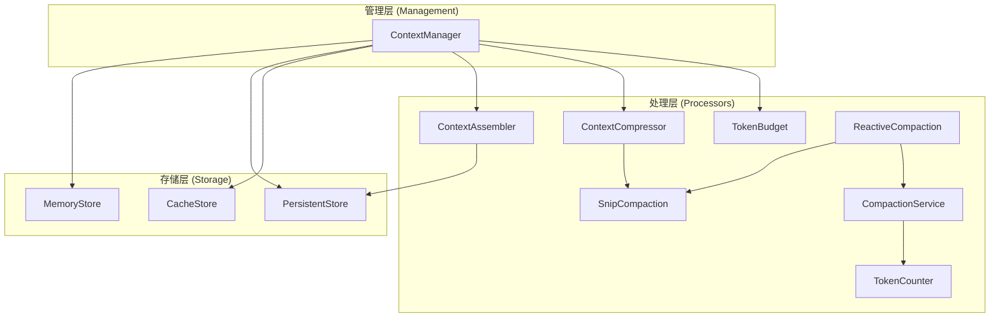
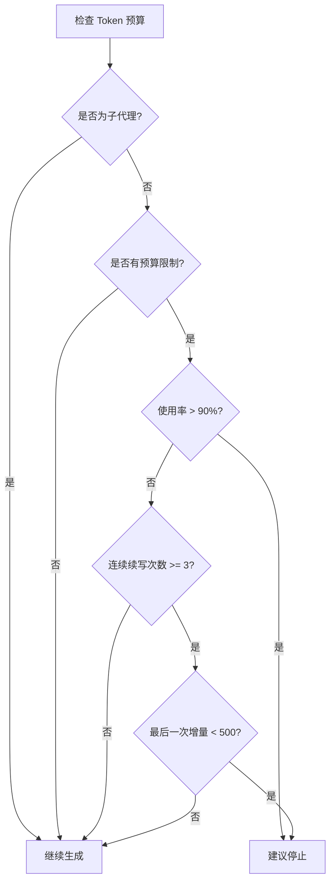
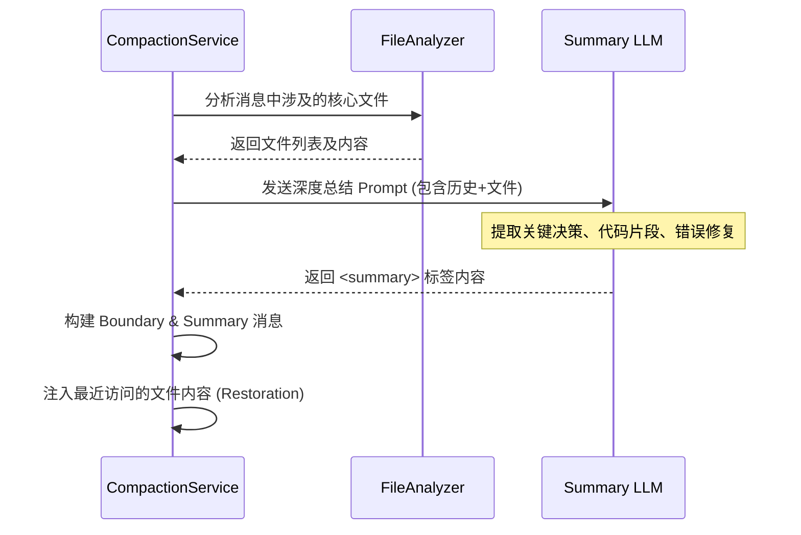
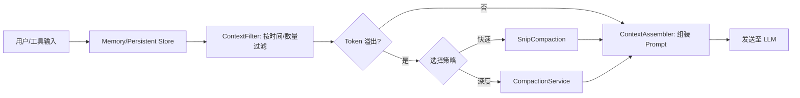

# 智能上下文管理与令牌优化

## 目录
1. [引言](#引言)
2. [模块概览](#模块概览)
3. [架构设计](#架构设计)
4. [核心组件分析](#核心组件分析)
   - [ContextManager：上下文中枢](#contextmanager上下文中枢)
   - [ContextAssembler：上下文组装器](#contextassembler上下文组装器)
   - [ContextCompressor：智能压缩引擎](#contextcompressor智能压缩引擎)
5. [令牌预算与计算模型](#令牌预算与计算模型)
   - [TokenBudget 计算模型](#tokenbudget-计算模型)
   - [TokenCounter 权重分配](#tokencounter-权重分配)
6. [压缩策略深度对比](#压缩策略深度对比)
   - [SnipCompaction：轻量级剪裁](#snipcompaction轻量级剪裁)
   - [ReactiveCompaction：反应式紧急压缩](#reactivecompaction反应式紧急压缩)
   - [CompactionService：LLM 驱动的深度总结](#compactionservice-llm-驱动的深度总结)
7. [数据流与生命周期](#数据流与生命周期)
8. [存储与持久化方案](#存储与持久化方案)
9. [性能考量与最佳实践](#性能考量与最佳实践)
10. [文件引用](#文件引用)

## 引言

在大型语言模型（LLM）的应用开发中，上下文窗口（Context Window）的有效利用是决定智能体（Agent）性能的关键因素。Blade 的上下文管理系统旨在解决长对话过程中的信息过载、令牌（Token）溢出以及历史记忆丢失等核心挑战。

该系统不仅是一个简单的消息存储器，更是一个智能的“信息过滤器”和“压缩机”。它通过分层存储、动态压缩算法和精细的令牌预算控制，确保在有限的上下文窗口内，为 LLM 提供最相关、最高质量的信息。Blade 引入了多种压缩策略，从简单的消息截断到复杂的 LLM 驱动的语义总结，构建了一套多层次的防御体系，以应对各种极端场景。

## 模块概览

`packages/cli/src/context/` 目录是 Blade 上下文管理的核心，负责处理从消息记录到复杂压缩的所有逻辑。

- **总文件数**: 17 个 TypeScript 文件
- **子目录结构**:
  - `processors/`: 包含上下文过滤器（Filter）和基础压缩器（Compressor）。
  - `storage/`: 提供多种存储后端，包括内存存储、缓存存储和基于 JSONL 的持久化存储。
- **覆盖范围**: 本文档将深度分析所有核心组件及其交互机制。

## 架构设计

Blade 的上下文管理架构采用分层设计，将底层存储、中层处理和高层管理解耦。

下面的架构图展示了各组件之间的协作关系：



**架构说明**：
- `ContextManager` 作为对外暴露的统一接口，协调所有子组件。
- `Storage` 层提供了多级缓存机制：`MemoryStore` 负责极速读写，`PersistentStore` 确保对话历史不丢失，`CacheStore` 用于存放耗时的压缩结果和工具调用结果。
- `Processors` 层负责逻辑处理：`ContextAssembler` 从持久化事件流中重建状态，`TokenBudget` 实时监控消耗，而各种 `Compaction` 算法则负责在必要时释放空间。

**图表来源**: 
- [ContextManager.ts:L29-L82](file:///Users/bytedance/Documents/GitHub/Blade/packages/cli/src/context/ContextManager.ts#L29-L82)

## 核心组件分析

### ContextManager：上下文中枢

`ContextManager` 是整个模块的“大脑”。它负责初始化存储后端、创建和加载会话，以及在添加新消息时自动触发压缩逻辑。

```typescript
export class ContextManager {
  private readonly memory: MemoryStore;
  private readonly persistent: PersistentStore;
  private readonly compressor: ContextCompressor;
  
  // ... 初始化逻辑
  
  async addMessage(role: Role, content: string): Promise<void> {
    const message = { id: nanoid(), role, content, timestamp: Date.now() };
    this.memory.addMessage(message);

    // 自动触发压缩检查
    const contextData = this.memory.getContext();
    if (contextData && this.shouldCompress(contextData)) {
      await this.compressCurrentContext();
    }
    
    // 异步持久化
    this.saveCurrentSessionAsync();
  }
}
```

`ContextManager` 的核心设计思想是**响应式管理**。它不需要外部显式调用压缩，而是通过预设的 `compressionThreshold`（默认为 6000 tokens）自动感知上下文压力并执行优化。

### ContextAssembler：上下文组装器

`ContextAssembler` 负责将离散的 `SessionEvent`（存储在 JSONL 中的事件流）重新组装成结构化的 `ContextData`。这种设计允许 Blade 支持“时间旅行”和“状态重建”，即可以通过回放事件流来恢复任何时刻的对话状态。

它主要处理三种类型的重建：
1. **会话重建**：提取 sessionId、用户偏好和配置。
2. **对话重建**：将 `message_created` 和 `part_created` 事件合并为完整的消息内容。
3. **工具调用重建**：匹配 `tool_call` 和 `tool_result`，构建工具调用的完整生命周期。

### ContextCompressor：智能压缩引擎

`ContextCompressor` 提供了基础的启发式压缩能力。它不像 `CompactionService` 那样依赖 LLM，而是通过规则进行优化：
- **保留最近消息**：默认保留最近 20 条消息。
- **旧消息摘要**：对更早的消息进行简单的关键词提取和模式识别。
- **工具调用统计**：将大量的工具调用记录转化为统计摘要（如“执行了 10 次文件读取，成功率 100%”）。

**组件来源**: 
- [ContextManager.ts](file:///Users/bytedance/Documents/GitHub/Blade/packages/cli/src/context/ContextManager.ts)
- [ContextAssembler.ts](file:///Users/bytedance/Documents/GitHub/Blade/packages/cli/src/context/ContextAssembler.ts)
- [processors/ContextCompressor.ts](file:///Users/bytedance/Documents/GitHub/Blade/packages/cli/src/context/processors/ContextCompressor.ts)

## 令牌预算与计算模型

### TokenBudget 计算模型

`TokenBudget` 不仅仅是一个简单的计数器，它实现了一个**收益递减检测（Diminishing Returns Detection）**模型。



该模型的核心逻辑在于：如果 LLM 连续多次触发续写（Continuation），且每次产生的新内容（Delta）越来越少，说明模型可能陷入了死循环或已经完成了任务，此时应强制停止以节省成本。

### TokenCounter 权重分配

`TokenCounter` 使用 `js-tiktoken` 进行精确计算，并为不同部分分配了不同的开销权重：

| 组成部分 | Token 开销计算方式 | 说明 |
| :--- | :--- | :--- |
| **消息固定开销** | +4 tokens | 每条消息的角色切换开销 |
| **角色 (Role)** | `encode(role).length` | 不同角色的 token 占用 |
| **文本内容** | `encode(content).length` | 核心内容占用 |
| **工具调用** | 固定 4 + 函数名 + 参数 + ID | 结构化数据的额外开销 |
| **降级估算** | `Math.ceil(chars / 4)` | 无法获取 Encoding 时的安全兜底 |

> 💡 **提示**：对于中文内容，`TokenCounter` 特别优化了估算算法：`chineseChars / 1.5 + otherChars / 4`，这比通用的 1:4 比例更接近真实消费。

**算法来源**: 
- [TokenBudget.ts](file:///Users/bytedance/Documents/GitHub/Blade/packages/cli/src/context/TokenBudget.ts)
- [TokenCounter.ts](file:///Users/bytedance/Documents/GitHub/Blade/packages/cli/src/context/TokenCounter.ts)

## 压缩策略深度对比

Blade 提供了三层递进的压缩策略，以平衡压缩质量、响应速度和计算成本。

### SnipCompaction：轻量级剪裁

`SnipCompaction` 是最快的优化手段。它不调用 LLM，而是通过识别“工具轮次（Tool Turn）”来删除旧的、不再需要的工具交互记录。

- **原理**：搜索 `assistant` 消息及其紧随其后的 `tool` 结果消息。
- **策略**：默认保留最近 10 轮工具调用，将更早的调用替换为 `[N earlier tool interactions snipped for brevity]`。
- **适用场景**：对话中存在大量频繁的小型工具调用（如 `ls`, `cat`）。

### ReactiveCompaction：反应式紧急压缩

这是系统的“最后一道防线”。当 LLM 接口返回 413 (Prompt Too Long) 错误时，系统会自动触发此流程。

其执行逻辑如下：
1. **Level 1 (激进剪裁)**：调用 `SnipCompaction`，但仅保留最近 3 轮工具调用。
2. **Level 2 (语义压缩)**：如果 Level 1 后依然过大，则调用 `CompactionService` 进行 LLM 摘要生成。

### CompactionService：LLM 驱动的深度总结

这是最强大但也最昂贵的压缩方式。它通过调用另一个 LLM（通常是较小但擅长总结的模型）来重写整个对话历史。



**关键创新点：Post-Compact 上下文恢复**
在压缩完成后，`CompactionService` 会自动调用 `buildFileRestorationMessage`。它会检查最近访问过的 5 个文件，并将它们的最新内容以 `<system-reminder>` 的形式重新注入上下文。这解决了传统压缩方案中“压缩后模型忘记了当前正在编辑的代码”的痛点。

**策略来源**: 
- [SnipCompaction.ts](file:///Users/bytedance/Documents/GitHub/Blade/packages/cli/src/context/SnipCompaction.ts)
- [ReactiveCompaction.ts](file:///Users/bytedance/Documents/GitHub/Blade/packages/cli/src/context/ReactiveCompaction.ts)
- [CompactionService.ts](file:///Users/bytedance/Documents/GitHub/Blade/packages/cli/src/context/CompactionService.ts)

## 数据流与生命周期

上下文数据的生命周期从用户输入开始，经历存储、过滤、压缩，最终组装成 Prompt。



在组装过程中，`ContextAssembler` 会优先保证 `System Prompt` 和 `Recent Messages` 的完整性，而将 `Summary` 和 `Tool Results` 放在次要位置。

**数据流来源**: 
- [ContextManager.ts:L375-L410](file:///Users/bytedance/Documents/GitHub/Blade/packages/cli/src/context/ContextManager.ts#L375-L410)

## 存储与持久化方案

Blade 的存储层提供了极高的可靠性：

1. **MemoryStore**：LRU 缓存，存储活跃会话的 `ContextData` 对象。
2. **PersistentStore (JSONL)**：
   - 采用**追加写（Append-only）**模式，记录每一个原子事件（如 `part_created`, `message_updated`）。
   - 这种模式天然支持断电恢复，且易于调试。
   - 支持跨平台存储路径（`~/.blade/`）。
3. **ToolResultBudget (磁盘卸载)**：
   - 这是一个非常实用的优化：当工具返回的结果超过 100KB 时，`applyToolResultBudget` 会自动将完整内容写入磁盘（`~/.blade/tool-results/`），在上下文中仅保留前 2000 字符的预览和文件路径。
   - 这防止了像 `grep` 全局搜索产生的大量输出瞬间撑爆上下文窗口。

## 性能考量与最佳实践

在深度分析代码后，我们发现以下性能优化点：

- **哈希缓存 (Hash Caching)**：`ContextManager` 在压缩前会计算当前上下文的哈希值。如果上下文没有变化，将直接从 `CacheStore` 获取之前的压缩结果，避免重复调用昂贵的 LLM 压缩。
- **异步保存**：持久化操作（写入 JSONL）是异步执行的，不会阻塞 LLM 的响应流。
- **断路器机制 (Circuit Breaker)**：`CompactionService` 维护了一个连续失败计数器。如果 LLM 压缩连续失败 3 次，系统将自动降级为“简单截断”模式，防止系统卡死。

> ⚠️ **警告**：虽然压缩可以延长对话寿命，但过度压缩会导致模型丢失微小的细节。建议将 `compressionThreshold` 设置为模型最大窗口的 60%-70%，留出足够的缓冲空间。

## 文件引用

以下是构建智能上下文管理系统的核心文件：

- [ContextManager.ts](file:///Users/bytedance/Documents/GitHub/Blade/packages/cli/src/context/ContextManager.ts): 统一管理入口与协调中枢。
- [processors/ContextCompressor.ts](file:///Users/bytedance/Documents/GitHub/Blade/packages/cli/src/context/processors/ContextCompressor.ts): 基础启发式压缩实现。
- [CompactionService.ts](file:///Users/bytedance/Documents/GitHub/Blade/packages/cli/src/context/CompactionService.ts): LLM 驱动的高级压缩服务。
- [TokenBudget.ts](file:///Users/bytedance/Documents/GitHub/Blade/packages/cli/src/context/TokenBudget.ts): 令牌预算与收益递减检测。
- [TokenCounter.ts](file:///Users/bytedance/Documents/GitHub/Blade/packages/cli/src/context/TokenCounter.ts): 精确的 Token 计数工具。
- [SnipCompaction.ts](file:///Users/bytedance/Documents/GitHub/Blade/packages/cli/src/context/SnipCompaction.ts): 基于规则的工具轮次剪裁。
- [ReactiveCompaction.ts](file:///Users/bytedance/Documents/GitHub/Blade/packages/cli/src/context/ReactiveCompaction.ts): 错误触发的反应式压缩。
- [ContextAssembler.ts](file:///Users/bytedance/Documents/GitHub/Blade/packages/cli/src/context/ContextAssembler.ts): 状态重建与 Prompt 组装。
- [ToolResultBudget.ts](file:///Users/bytedance/Documents/GitHub/Blade/packages/cli/src/context/ToolResultBudget.ts): 大尺寸工具结果的磁盘卸载优化。
- [storage/PersistentStore.ts](file:///Users/bytedance/Documents/GitHub/Blade/packages/cli/src/context/storage/PersistentStore.ts): 基于 JSONL 的持久化存储层。
- [storage/MemoryStore.ts](file:///Users/bytedance/Documents/GitHub/Blade/packages/cli/src/context/storage/MemoryStore.ts): 内存级快速访问。
- [types.ts](file:///Users/bytedance/Documents/GitHub/Blade/packages/cli/src/context/types.ts): 核心类型定义。
