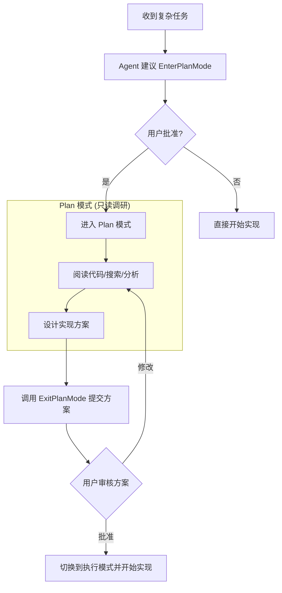
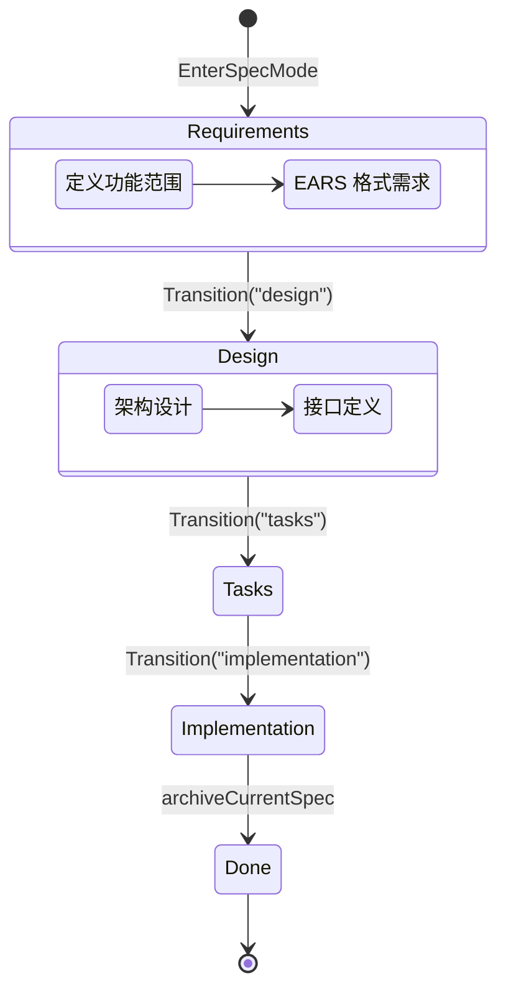
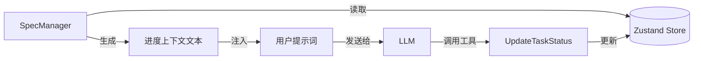

# 核心概念与结构化工作流

## 目录
1. [模块概览](#模块概览)
2. [引言](#引言)
3. [Agent 运行循环 (Agent Loop)](#agent-运行循环-agent-loop)
   - [生命周期与事件流](#生命周期与事件流)
   - [上下文管理与自动压缩](#上下文管理与自动压缩)
   - [流式工具执行 (Streaming Tool Execution)](#流式工具执行-streaming-tool-execution)
4. [规划模式 (Plan Mode)](#规划模式-plan-mode)
   - [进入与退出机制](#进入与退出机制)
   - [应用场景与价值](#应用场景与价值)
5. [规格模式 (Spec Mode)](#规格模式-spec-mode)
   - [四阶段工作流](#四阶段工作流)
   - [Spec 管理器实现](#spec-管理器实现)
6. [任务管理与状态跟踪](#任务管理与状态跟踪)
   - [任务列表维护](#任务列表维护)
   - [进度上下文注入](#进度上下文注入)
7. [模式对比与选择指南](#模式对比与选择指南)
8. [核心组件](#核心组件)
9. [文件参考](#文件参考)

## 模块概览

在对 `packages/cli/src/agent` 和 `packages/cli/src/spec` 目录进行深度探索后，该模块的规模和结构如下：

- **文件总数**：约 50 个源代码文件。
- **核心子模块**：
  - `agent/loop/`：包含 9 个文件，负责 Agent 的核心异步生成器循环、消息持久化和策略检查。
  - `spec/`：包含 4 个核心逻辑文件及多个 Markdown 模板，负责规格驱动开发（SDD）的状态管理和文件持久化。
  - `tools/builtin/plan/` & `tools/builtin/spec/`：包含 12 个文件，实现了进入/退出模式及任务操作的工具集。
- **覆盖范围**：本文将深入解析 Agent Loop 的执行逻辑、Plan 模式的决策流程以及 Spec 模式的完整生命周期管理。

## 引言

Blade 的强大之处不仅在于其工具集，更在于其**结构化工作流 (Structured Workflows)**。传统的 Agent 通常采用简单的“思考-行动”循环，但在面对复杂工程问题时，这种模式容易导致上下文偏移或逻辑混乱。

Blade 引入了三种层次的工作模式：
1. **普通模式 (Normal Mode)**：直接执行简单任务。
2. **规划模式 (Plan Mode)**：通过“调研-设计-审核”流程处理中等复杂度的任务。
3. **规格模式 (Spec Mode)**：基于规格驱动开发 (Spec-Driven Development, SDD) 的严谨流程，将复杂功能拆解为需求、设计、任务和实现四个阶段。

本章节将深入探讨这些模式背后的运行机制。

## Agent 运行循环 (Agent Loop)

Agent Loop 是 Blade 的心脏，负责协调 LLM 调用、工具执行和上下文管理。它被实现为一个 `AsyncGenerator`，允许外部通过订阅事件流来实时获取 Agent 的状态。

### 生命周期与事件流

`executeLoopGenerator` 函数驱动了整个循环。每一轮循环（Turn）都经历从状态检查到 LLM 响应，再到工具执行的完整过程。

以下图表展示了 Agent Loop 的典型执行序列：

```mermaid
sequenceDiagram
    participant App as 应用程序/CLI
    participant Loop as executeLoopGenerator
    participant State as ConversationState
    participant LLM as 语言模型 (ChatService)
    participant Tool as StreamingToolExecutor

    App->>Loop: 启动任务 (message)
    Loop->>State: 准备消息历史
    loop 代理循环 (Agentic Loop)
        Loop->>Loop: 检查上下文压缩 (checkAndCompactInLoop)
        Loop->>App: yield turn_start
        Loop->>LLM: 发起流式请求 (streamChat)
        LLM-->>Loop: 返回 Delta 块
        Loop->>App: yield content_delta / thinking_delta
        Loop->>Tool: 实时解析并启动工具 (addTool)
        LLM-->>Loop: 结束流 (stream_end)
        Loop->>App: yield stream_end
        
        Note over Loop, Tool: 工具并行或流式执行
        Tool-->>Loop: 返回工具执行结果
        Loop->>App: yield tool_result
        Loop->>State: 更新消息历史 (appendToolResult)
        
        Loop->>Loop: 策略检查 (completionPolicy)
        alt 任务完成
            Loop->>App: 返回 LoopResult (success: true)
        else 需继续
            Loop->>Loop: 进入下一轮
        end
    end
```

**生命周期解析**：
1. **初始化**：通过 `ConversationState` 建立单一事实来源（SSOT）的消息历史。
2. **上下文压缩**：在每轮开始前检查 Token 使用量，必要时触发 `snip`（轻量截断）或 `LLM Compaction`（摘要压缩）。
3. **LLM 调用**：支持流式响应。Blade 特有的 `StreamingToolExecutor` 可以在 LLM 还在输出参数时就启动工具执行，极大提升了响应速度。
4. **策略检查**：通过 `completionPolicy.ts` 检查是否触碰 `max_output_tokens`（自动恢复）、意图是否完整以及是否需要触发 `StopHook`。

**代码片段：核心循环结构**：
```typescript
// packages/cli/src/agent/loop/executeLoopGenerator.ts

export async function* executeLoopGenerator(/* ... */) {
  // ... 初始化状态 ...
  while (true) {
    // 1. 压缩检查
    const compactResult = await checkAndCompactInLoop(deps, context, turnsCount, lastPromptTokens);
    
    // 2. 调用 LLM (支持流式)
    const turnResult = yield* processStreamResponse(deps, state.toLLMMessages(), tools, options?.signal, streamingExecutor);
    
    // 3. 检查是否需要工具调用
    if (!turnResult.toolCalls || turnResult.toolCalls.length === 0) {
      // 检查意图完整性、停止钩子等
      const intentAction = checkIncompleteIntent(turnResult.content, incompleteIntentRetryCount);
      if (intentAction.action === 'retry') continue; 
      
      return { success: true, finalMessage: turnResult.content };
    }

    // 4. 执行工具并处理副作用
    const executionResults = await streamingExecutor.getRemainingResults();
    for (const { toolCall, result } of executionResults) {
      yield { kind: 'tool_result', toolCall, result };
      await applyToolDomainEffects(toolCall, result, deps);
    }
  }
}
```

### 上下文管理与自动压缩

Blade 采用了两级压缩机制来应对 LLM 的上下文窗口限制：
- **Level 1: Snip Compaction**：确定性地移除旧的工具调用详情，仅保留结果摘要。这不消耗 LLM Token。
- **Level 2: LLM Compaction**：当 Token 使用量超过阈值（通常为 80%）时，调用 LLM 对历史对话进行语义压缩，生成精简的上下文摘要。

> 💡 **提示**：Blade 还支持 **Reactive Compaction (反应式压缩)**。如果 LLM 返回 `prompt_too_long` 错误，循环会立即触发压缩并重试当前轮次，确保任务不中断。

### 流式工具执行 (Streaming Tool Execution)

`StreamingToolExecutor` 是 Blade 的一项性能优化。它监控 LLM 的流式输出，一旦解析出完整的工具名称和参数，就立即在后台启动执行，而不必等待整个回复生成完毕。这对于耗时较长的 I/O 操作（如网络搜索或大型文件读取）尤为有效。

**Diagram sources**: 
- [executeLoopGenerator.ts:L511-L1221](file:///Users/bytedance/Documents/GitHub/Blade/packages/cli/src/agent/loop/executeLoopGenerator.ts#L511-L1221)
- [StreamingToolExecutor.ts](file:///Users/bytedance/Documents/GitHub/Blade/packages/cli/src/agent/loop/StreamingToolExecutor.ts)

## 规划模式 (Plan Mode)

规划模式是为“先思后行”设计的。当任务涉及多个文件、复杂的架构决策或存在多种实现方案时，Agent 会建议进入规划模式。

### 进入与退出机制

规划模式的转换由 `EnterPlanMode` 和 `ExitPlanMode` 两个工具控制。



在规划模式下，Agent 的系统提示词会被动态修改，强制其仅使用只读工具（如 `Read`, `Glob`, `Grep`）。这保证了在方案确定前，不会对代码库造成意外修改。

### 应用场景与价值

- **多方案权衡**：例如“添加缓存机制”，可以选择 Redis 或内存缓存，规划模式允许 Agent 先调研现有基础设施再提议。
- **大规模重构**：在修改核心 API 前，先通过规划模式识别所有受影响的调用方。
- **需求澄清**：当用户目标模糊时（如“让应用跑得更快”），Agent 先进行性能分析，再给出具体的优化计划。

**Section sources**:
- [EnterPlanModeTool.ts](file:///Users/bytedance/Documents/GitHub/Blade/packages/cli/src/tools/builtin/plan/EnterPlanModeTool.ts)
- [ExitPlanModeTool.ts](file:///Users/bytedance/Documents/GitHub/Blade/packages/cli/src/tools/builtin/plan/ExitPlanModeTool.ts)

## 规格模式 (Spec Mode)

规格模式是 Blade 最具特色的工作流，它将软件工程的最佳实践（规格驱动开发）内化到了 Agent 的执行逻辑中。

### 四阶段工作流

Spec 模式强制执行一个严格的阶段转换流程，每个阶段都有对应的 Markdown 模板支持。



1. **Requirements (需求)**：使用 EARS (Easy Approach to Requirements Syntax) 格式定义“做什么”。生成 `requirements.md`。
2. **Design (设计)**：定义“怎么做”，包括组件关系、数据模型和 Mermaid 图表。生成 `design.md`。
3. **Tasks (任务)**：将设计拆解为原子化的、可执行的任务列表。生成 `tasks.md`。
4. **Implementation (实现)**：逐一执行任务，跟踪进度。

### Spec 管理器实现

`SpecManager` 是该模式的核心，采用单例模式并基于 Zustand Store 实现状态的单一事实来源（SSOT）。

- **状态管理**：通过 `specSlice` 存储当前活跃的 Spec 元数据、阶段和任务列表。
- **文件持久化**：所有 Spec 相关文件存储在 `.blade/changes/<feature-name>/` 目录下，确保工作流可中断、可恢复。
- **自动退出**：当最后一个任务完成并调用 `archiveCurrentSpec` 时，系统会自动将变更合并到权威规格库并切换回默认模式。

**Section sources**:
- [SpecManager.ts](file:///Users/bytedance/Documents/GitHub/Blade/packages/cli/src/spec/SpecManager.ts)
- [TransitionSpecPhaseTool.ts](file:///Users/bytedance/Documents/GitHub/Blade/packages/cli/src/tools/builtin/spec/TransitionSpecPhaseTool.ts)

## 任务管理与状态跟踪

无论是普通模式还是 Spec 模式，Blade 都能维护一个结构化的任务列表。

### 任务列表维护

在 Spec 模式下，任务通过 `AddTask` 工具显式创建。每个任务包含：
- `id`：唯一标识。
- `dependencies`：前置任务 ID，用于构建拓扑排序。
- `affectedFiles`：预期受影响的文件列表。
- `status`：`pending`, `in_progress`, `completed`, `skipped`。

### 进度上下文注入

为了防止 Agent “忘记”当前进度，`SpecManager.buildProgressContext()` 会在每一轮对话开始前，将当前任务状态动态注入到 User Prompt 中。



这种机制确保了即使对话轮次很多，Agent 也能清晰地知道：
- 哪些任务已完成。
- 当前正在处理哪个任务。
- 下一个任务是什么。

**Section sources**:
- [SpecManager.ts:L721-L770](file:///Users/bytedance/Documents/GitHub/Blade/packages/cli/src/spec/SpecManager.ts#L721-L770)
- [AddTaskTool.ts](file:///Users/bytedance/Documents/GitHub/Blade/packages/cli/src/tools/builtin/spec/AddTaskTool.ts)

## 模式对比与选择指南

选择正确的工作流模式对于任务的成功率至关重要。

| 特性 | 普通模式 | 规划模式 | 规格模式 (Spec) |
| :--- | :--- | :--- | :--- |
| **适用场景** | 简单修复、单文件修改 | 中等复杂度、需调研方案 | 复杂功能、架构变更、长期任务 |
| **核心价值** | 快速响应 | 降低风险、方案审核 | 严谨工程、自动文档化、进度追踪 |
| **工具限制** | 无限制 | 调研期仅限只读工具 | 阶段性限制工具使用 |
| **持久化** | 仅对话历史 | 方案草案 | 完整的 `.blade/changes` 目录 |
| **用户参与** | 低 | 中（审核方案） | 高（确认阶段、审核设计） |

## 核心组件

- `executeLoopGenerator`：Agent 运行循环的引擎。
- `ConversationState`：消息历史的 SSOT 管理器。
- `SpecManager`：Spec 模式的状态与生命周期协调器。
- `StreamingToolExecutor`：流式工具执行优化器。
- `completionPolicy`：循环终止与恢复策略集。

## 文件参考

- [packages/cli/src/agent/loop/executeLoopGenerator.ts](file:///Users/bytedance/Documents/GitHub/Blade/packages/cli/src/agent/loop/executeLoopGenerator.ts) - 核心循环实现
- [packages/cli/src/agent/loop/ConversationState.ts](file:///Users/bytedance/Documents/GitHub/Blade/packages/cli/src/agent/loop/ConversationState.ts) - 消息状态管理
- [packages/cli/src/spec/SpecManager.ts](file:///Users/bytedance/Documents/GitHub/Blade/packages/cli/src/spec/SpecManager.ts) - Spec 模式核心逻辑
- [packages/cli/src/tools/builtin/plan/EnterPlanModeTool.ts](file:///Users/bytedance/Documents/GitHub/Blade/packages/cli/src/tools/builtin/plan/EnterPlanModeTool.ts) - 规划模式入口
- [packages/cli/src/tools/builtin/spec/EnterSpecModeTool.ts](file:///Users/bytedance/Documents/GitHub/Blade/packages/cli/src/tools/builtin/spec/EnterSpecModeTool.ts) - 规格模式入口
- [packages/cli/src/agent/loop/toolDomainPolicy.ts](file:///Users/bytedance/Documents/GitHub/Blade/packages/cli/src/agent/loop/toolDomainPolicy.ts) - 工具执行的领域副作用处理
- [packages/cli/src/agent/loop/completionPolicy.ts](file:///Users/bytedance/Documents/GitHub/Blade/packages/cli/src/agent/loop/completionPolicy.ts) - 循环控制策略
- [packages/cli/src/agent/loop/StreamingToolExecutor.ts](file:///Users/bytedance/Documents/GitHub/Blade/packages/cli/src/agent/loop/StreamingToolExecutor.ts) - 流式工具执行器
