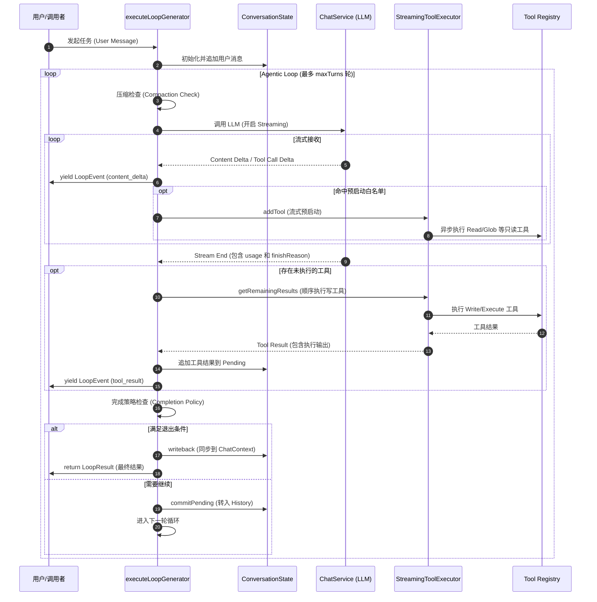
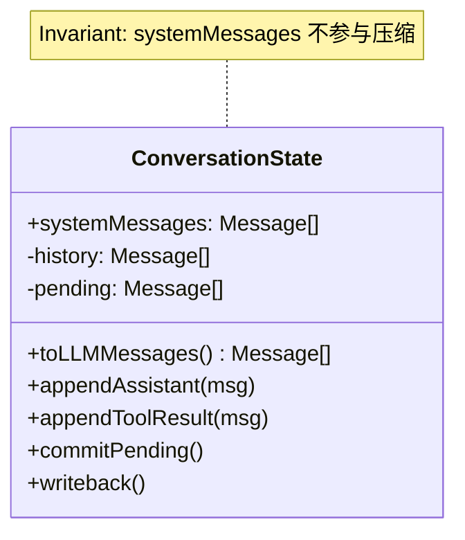
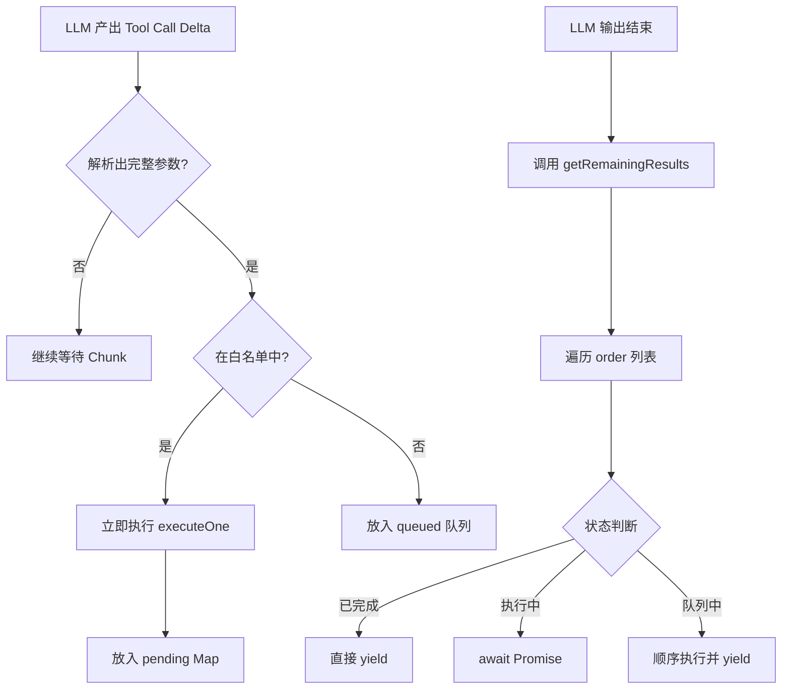
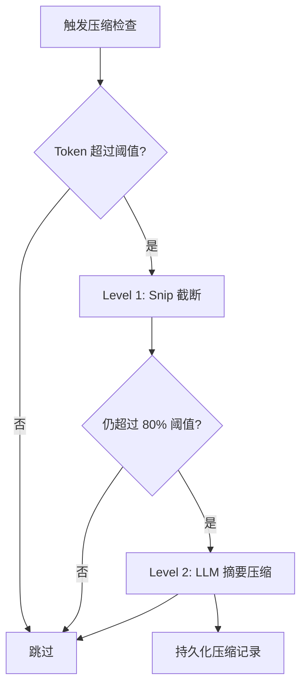
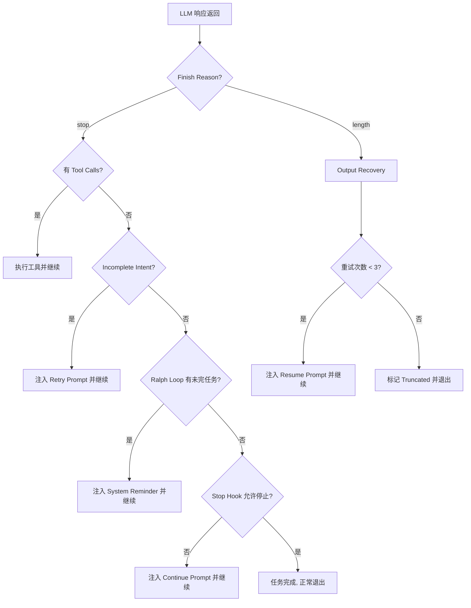
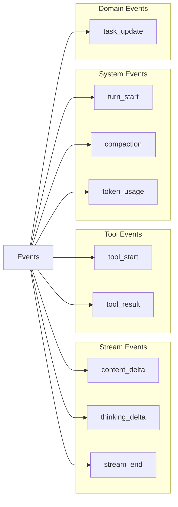

# Agent 运行循环机制

## 目录
1. [模块概览](#模块概览)
2. [简介](#简介)
3. [架构设计](#架构设计)
4. [核心组件](#核心组件)
   - [executeLoopGenerator：核心生成器](#executeloopgenerator核心生成器)
   - [ConversationState：无状态状态管理](#conversationstate无状态状态管理)
   - [StreamingToolExecutor：流式并行执行](#streamingtoolexecutor流式并行执行)
5. [关键逻辑与策略](#关键逻辑与策略)
   - [上下文压缩策略：从 Snip 到 LLM 摘要](#上下文压缩策略从-snip-到-llm-摘要)
   - [完成策略（Completion Policy）：循环的终点](#完成策略completion-policy循环的终点)
   - [领域副作用处理：工具执行的延伸](#领域副作用处理工具执行的延伸)
6. [数据模型与接口](#数据模型与接口)
7. [错误处理与恢复机制](#错误处理与恢复机制)
8. [文件参考](#文件参考)

## 模块概览

Blade 的 Agent Loop 模块位于 `packages/cli/src/agent/loop/`，是整个 Agent 执行引擎的核心。该模块通过 `AsyncGenerator` 模式实现了一个高度解耦、可观测且响应迅速的执行循环。它不仅负责与大语言模型（LLM）的通信，还管理着复杂的工具执行管线、上下文压缩逻辑以及任务状态的持久化。

**核心统计信息**：
- **文件总数**：该目录下共有 9 个 TypeScript 文件，涵盖了从类型定义到核心逻辑实现的完整链路。
- **核心入口**：
    - `executeLoopGenerator.ts`：定义了核心的异步生成器函数，是循环逻辑的灵魂。
    - `consumeLoop.ts`：提供了 `drainLoop` 等实用函数，用于简化生成器的消费过程。
- **功能子模块**：
    - **状态管理**：`ConversationState.ts` 负责内存中的消息编排，`conversationPersistence.ts` 负责 JSONL 持久化。
    - **执行优化**：`StreamingToolExecutor.ts` 实现了工具的流式预启动，显著降低了等待延迟。
    - **策略判定**：`completionPolicy.ts` 封装了所有关于“是否继续循环”的决策逻辑，`toolDomainPolicy.ts` 处理工具执行后的领域副作用（如任务更新）。
    - **类型系统**：`types.ts` 定义了统一的事件流模型 `LoopEvent`。

本章节将作为开发者深入理解 Blade 执行机制的指南，详细解析这些组件如何协同工作，将模糊的自然语言指令转化为精确的系统行为。

## 简介

Agent Loop 是 Blade 的核心执行引擎，负责驱动 Agent 与大语言模型（LLM）之间的多轮对话。在 Blade 的设计中，Agent 不仅仅是一个简单的 Prompt 包装器，而是一个能够自主决策、调用工具并根据反馈调整行为的智能实体。

### 设计哲学：无状态 Agent 与显式状态流

Blade 遵循“无状态 Agent”的设计哲学。在传统的 Agent 实现中，状态往往散落在各个类的成员变量中，导致难以测试和恢复。Blade 通过以下方式实现了状态的显式化：
1. **单一事实来源**：所有的对话上下文、工具调用历史和中间思考过程都集中存储在 `ConversationState` 中。
2. **事件驱动**：执行引擎不直接操作 UI 或外部系统，而是通过 yield `LoopEvent` 的方式发出信号。这使得引擎可以运行在任何环境中（CLI、IDE 插件、Web 服务）。
3. **确定性持久化**：每一轮循环产生的关键数据都会立即通过 `conversationPersistence` 写入磁盘。即使程序崩溃，也能通过读取 JSONL 文件瞬间恢复到中断前的状态。

这种设计使得 Blade 的 Agent Loop 具有极高的鲁棒性和可扩展性。开发者可以轻松地为循环添加新的观察者（Observer）或干预者（Intervention），而无需修改核心逻辑。

## 架构设计

Agent Loop 的整体架构采用典型的“感知-决策-行动”循环（ReAct 模式的变体）。通过 `executeLoopGenerator` 协调 LLM 的生成过程与工具的执行管线。

下图展示了从用户输入到最终响应的完整生命周期，特别强调了流式输出与工具执行的并发关系：



**架构解析**：
该流程的核心在于 `executeLoopGenerator` 作为一个中控节点，不断在 `ConversationState`（状态源）、`ChatService`（决策源）和 `StreamingToolExecutor`（行动源）之间调度。
- **步骤 1-2**：初始化阶段，确保环境准备就绪。
- **步骤 4-7**：这是性能优化的关键。通过 `StreamingToolExecutor`，Agent 在 LLM 还在说话时就已经在后台读取文件或搜索网络了。
- **步骤 9-11**：处理剩余的工具调用。为了安全，写操作（如修改代码）会放在流结束后顺序执行。
- **步骤 12-15**：决策阶段。Agent 会根据 LLM 的输出和工具的反馈，判断任务是否已完成。如果未完成，则将当前轮次的“记忆”固化，开启新的一轮。

**图表来源**：
- [executeLoopGenerator.ts](file:///Users/bytedance/Documents/GitHub/Blade/packages/cli/src/agent/loop/executeLoopGenerator.ts)
- [StreamingToolExecutor.ts](file:///Users/bytedance/Documents/GitHub/Blade/packages/cli/src/agent/loop/StreamingToolExecutor.ts)
- [ConversationState.ts](file:///Users/bytedance/Documents/GitHub/Blade/packages/cli/src/agent/loop/ConversationState.ts)

## 核心组件

### executeLoopGenerator：核心生成器

`executeLoopGenerator` 是 Agent Loop 的大脑。它被实现为一个 `AsyncGenerator`，这是一种非常适合处理长耗时、多阶段任务的模式。

**核心职责**：
1. **依赖注入**：通过 `LoopDependencies` 接收 `chatService`、`executionPipeline` 等核心服务，保持逻辑的纯粹性。
2. **消息编排**：利用 `ConversationState` 组装发送给 LLM 的消息数组。
3. **事件分发**：在执行的每个关键节点（如 `turn_start`, `tool_start`, `token_usage`）yield 相应的事件。
4. **资源清理**：通过 `try...finally` 块确保在任何情况下（包括用户中断）都能正确执行 `writeback()`，将内存中的消息同步到持久化上下文。

```typescript
export async function* executeLoopGenerator(
  deps: LoopDependencies,
  message: UserMessageContent,
  context: ChatContext,
  options: LoopOptions | undefined,
  systemPrompt: string | undefined
): AsyncGenerator<LoopEvent, LoopResult, void> {
  // ... 初始化逻辑 ...
  try {
    while (turnsCount < maxTurns) {
      // 1. 压缩与轮次标记
      yield { kind: 'turn_start', turn: turnsCount, maxTurns };
      
      // 2. LLM 交互 (支持流式降级)
      const turnResult = yield* processStreamResponse(deps, state.toLLMMessages(), tools, signal, streamingExecutor);
      
      // 3. 工具执行与副作用应用
      const executionResults = await collectToolResults(streamingExecutor, functionCalls);
      for (const res of executionResults) {
        yield { kind: 'tool_result', ...res };
        await applyToolDomainEffects(res.toolCall, res.result, deps);
      }
      
      // 4. 退出判定
      if (shouldExit(turnResult)) return buildSuccessResult();
    }
  } finally {
    state.writeback(); // 强制同步状态
  }
}
```

### ConversationState：无状态状态管理

`ConversationState` 是为了解决“消息历史同步”这一顽疾而设计的。它不仅是一个数组的包装器，更是一个维护状态一致性的状态机。

**设计原则（6 Invariants）**：
- **Invariant #1 (系统提示词隔离)**：根系统提示词（System Prompt）被单独存储在 `systemMessages` 中，永远不会被自动压缩或截断。
- **Invariant #2 (历史映射)**：`history` 初始状态直接引用 `context.messages`，确保与外部上下文同步。
- **Invariant #3 (压缩原子性)**：压缩操作仅替换 `history` 引用，不影响当前正在生成的 `pending` 消息。
- **Invariant #4 (Pending 隔离)**：当前轮次的助手响应和工具结果首先进入 `pending` 队列，防止在 LLM 调用中途出现状态不一致。
- **Invariant #5 (显式提交)**：通过 `commitPending()` 将当前轮次的记忆并入历史。
- **Invariant #6 (安全回写)**：`writeback()` 是唯一的持久化入口，确保磁盘上的数据永远是完整的。

下图展示了 `ConversationState` 的内部结构以及消息如何流转：



**图表解析**：
`ConversationState` 通过将消息划分为 `systemMessages`（静态）、`history`（动态历史）和 `pending`（瞬时状态）三个区域，实现了对 LLM 上下文的精细控制。这种结构确保了在执行 `Compaction`（压缩）时，只有 `history` 区域会被修改，而核心指令和当前正在生成的上下文则保持稳定。

### StreamingToolExecutor：流式并行执行

`StreamingToolExecutor` 是 Blade 响应速度的秘密武器。它通过一种“世代管理（Epoch）”机制，安全地在 LLM 还在输出时启动工具。

**核心逻辑流程**：



**关键特性**：
- **白名单机制**：`STREAMING_PRELAUNCH_ALLOWLIST` 包含了 `Read`, `Glob`, `Grep`, `WebSearch` 等工具。这些工具的共同点是“只读”且“幂等”，提前执行不会破坏系统状态。
- **世代保护 (Epoch)**：如果 LLM 因为某些原因（如 429 错误或模型 Fallback）需要重发请求，执行器会调用 `discard()` 递增 `epoch`。所有正在运行的旧工具即便返回结果，也会因为 epoch 不匹配而被无情丢弃，确保上下文的纯净。
- **信号合并**：它会自动合并用户的主 AbortSignal、执行器的 Discard 信号以及工具自身的超时信号，确保资源能够被及时释放。

## 关键逻辑与策略

### 上下文压缩策略：从 Snip 到 LLM 摘要

当对话变得漫长，Token 数量逼近模型上限时，Agent Loop 会自动启动压缩流程。Blade 采用了一种“先软后硬”的策略。



**压缩级别详解**：
1. **Level 1: Snip Compaction (轻量截断)**
   - **原理**：遍历历史消息，将较早的工具调用结果（通常是冗长的代码块或文件内容）替换为简短的摘要占位符。
   - **优点**：不需要调用 LLM，无成本，不丢失对话轮次，仅减少细节。
2. **Level 2: LLM Compaction (深度摘要)**
   - **原理**：调用专门的摘要模型（或当前模型）对历史对话进行重写，提取核心事实、已完成的任务和当前进展。
   - **优点**：极大地释放 Token 空间（通常可压缩 80% 以上）。
3. **Reactive Compaction (反应式重试)**
   - **原理**：如果 LLM 调用直接返回 `prompt_too_long` 错误，循环会捕获该异常，立即执行一次强制压缩，并自动重试当前轮次。

### 完成策略（Completion Policy）：循环的终点

`completionPolicy.ts` 是一组精密的判定规则，用于回答一个核心问题：**Agent 应该停下来吗？**

下图展示了完成策略的决策树：



**策略解析**：
- **输出恢复 (Output Recovery)**：处理 `max_tokens` 截断。
- **意图未完成检测 (Incomplete Intent)**：处理“光说不练”的 LLM。
- **Ralph Loop**：确保 Spec 模式下的任务连续性。
- **Stop Hook**：外部干预的最后一道关卡。

### 领域副作用处理：工具执行的延伸

工具执行的结果不仅是给 LLM 看的字符串，它还会对 Blade 的运行环境产生影响。`toolDomainPolicy.ts` 负责捕获这些副作用。

- **任务系统联动**：当 `TaskUpdate` 等工具执行成功时，策略会从结果中提取任务列表，并 yield 一个 `task_update` 事件。
- **Skill 动态加载**：如果 Agent 调用了 `Skill` 工具激活了某个特定技能，策略会通知 `LoopDependencies` 中的回调。
- **模型自适应切换**：如果 Planner 工具判断当前任务极其复杂，它可以建议切换模型。

## 数据模型与接口

### LoopEvent：统一事件流

`LoopEvent` 是一个联合类型，定义了循环中所有可能的事件。



通过这种标准的事件流，Blade 实现了前后端的完美解耦。

### LoopDependencies：外部依赖

```typescript
export interface LoopDependencies {
  chatService: IChatService;           // LLM 访问
  executionPipeline: ExecutionPipeline; // 工具执行
  config: BladeConfig;                 // 全局配置
  runtimeOptions: AgentOptions;        // 运行时参数
  onSkillActivated?: (ctx: SkillExecutionContext) => void;
  onModelSwitch?: (modelId: string) => Promise<void>;
}
```

## 错误处理与恢复机制

Agent Loop 具备多层级的错误处理能力：
1. **API 错误友好化**：解析复杂的云端错误码。
2. **流式降级**：自动切换到普通的 `chat` 模式。
3. **超时保护**：所有的工具执行和 Hook 调用都带有显式的超时控制。
4. **用户中断响应**：循环在每个关键节点都会检查 `AbortSignal`。

## 文件参考

本模块涉及的关键源文件如下：

- [executeLoopGenerator.ts](file:///Users/bytedance/Documents/GitHub/Blade/packages/cli/src/agent/loop/executeLoopGenerator.ts) — 核心循环生成器实现。
- [consumeLoop.ts](file:///Users/bytedance/Documents/GitHub/Blade/packages/cli/src/agent/loop/consumeLoop.ts) — 循环消费工具。
- [ConversationState.ts](file:///Users/bytedance/Documents/GitHub/Blade/packages/cli/src/agent/loop/ConversationState.ts) — 消息状态模型。
- [StreamingToolExecutor.ts](file:///Users/bytedance/Documents/GitHub/Blade/packages/cli/src/agent/loop/StreamingToolExecutor.ts) — 流式并行执行器。
- [completionPolicy.ts](file:///Users/bytedance/Documents/GitHub/Blade/packages/cli/src/agent/loop/completionPolicy.ts) — 循环终止与恢复策略。
- [toolDomainPolicy.ts](file:///Users/bytedance/Documents/GitHub/Blade/packages/cli/src/agent/loop/toolDomainPolicy.ts) — 领域副作用处理。
- [conversationPersistence.ts](file:///Users/bytedance/Documents/GitHub/Blade/packages/cli/src/agent/loop/conversationPersistence.ts) — 消息持久化。
- [types.ts](file:///Users/bytedance/Documents/GitHub/Blade/packages/cli/src/agent/loop/types.ts) — 类型定义。
- [index.ts](file:///Users/bytedance/Documents/GitHub/Blade/packages/cli/src/agent/loop/index.ts) — 模块导出入口。

**Section sources**:
- [executeLoopGenerator.ts](file:///Users/bytedance/Documents/GitHub/Blade/packages/cli/src/agent/loop/executeLoopGenerator.ts)
- [ConversationState.ts](file:///Users/bytedance/Documents/GitHub/Blade/packages/cli/src/agent/loop/ConversationState.ts)
- [StreamingToolExecutor.ts](file:///Users/bytedance/Documents/GitHub/Blade/packages/cli/src/agent/loop/StreamingToolExecutor.ts)
- [completionPolicy.ts](file:///Users/bytedance/Documents/GitHub/Blade/packages/cli/src/agent/loop/completionPolicy.ts)
- [toolDomainPolicy.ts](file:///Users/bytedance/Documents/GitHub/Blade/packages/cli/src/agent/loop/toolDomainPolicy.ts)
- [types.ts](file:///Users/bytedance/Documents/GitHub/Blade/packages/cli/src/agent/loop/types.ts)
