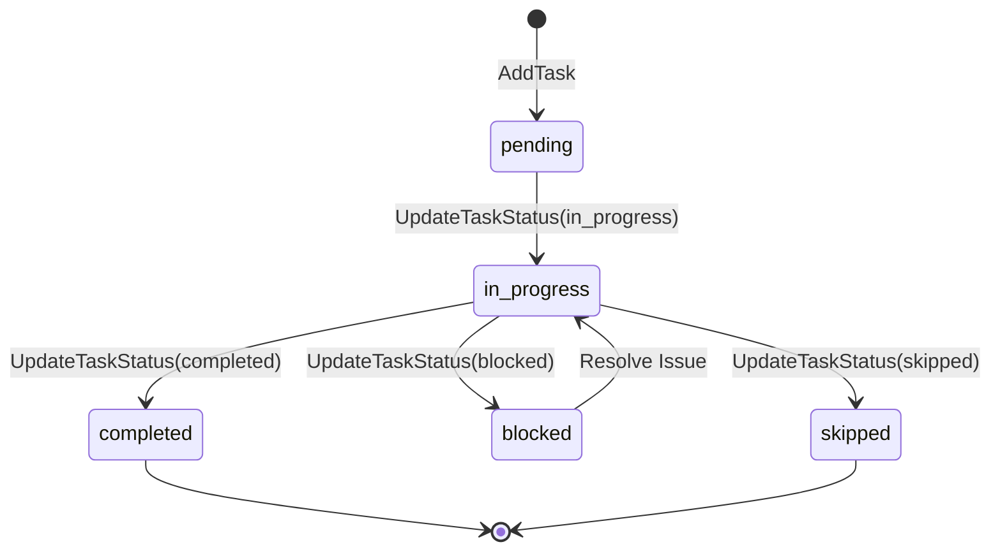
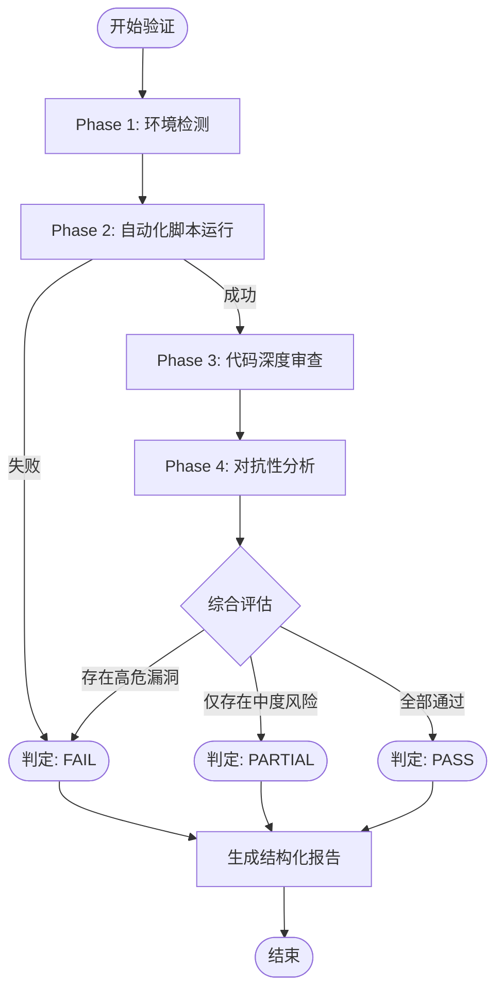
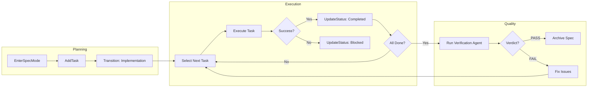

# 任务跟踪与结果验证

## 目录
1. [模块概览](#模块概览)
2. [引言](#引言)
3. [任务管理机制](#任务管理机制)
   - [任务定义与属性](#任务定义与属性)
   - [任务状态流转](#任务状态流转)
4. [Subagent 执行框架](#subagent-执行框架)
   - [隔离执行环境](#隔离执行环境)
   - [事件转发与流式处理](#事件转发与流式处理)
5. [核心实现代码分析](#核心实现代码分析)
   - [子代理执行逻辑](#子代理执行逻辑)
   - [任务状态更新逻辑](#任务状态更新逻辑)
6. [验证 Agent 机制](#验证-agent-机制)
   - [验证工作流四阶段](#验证工作流四阶段)
   - [判定标准与报告格式](#判定标准与报告格式)
7. [任务生命周期与闭环](#任务生命周期与闭环)
8. [会话持久化与恢复](#会话持久化与恢复)
9. [文件引用](#文件引用)

## 模块概览

在 Blade 的架构中，任务跟踪与结果验证模块是确保复杂工程任务能够被拆解、执行并最终交付高质量成果的核心。该模块主要分布在两个核心目录中：

- **`packages/cli/src/agent/subagents/`**: 包含子代理（Sub-agent）的执行引擎、注册表、持久化存储以及内置的验证代理实现。
- **`packages/cli/src/tools/builtin/spec/`**: 包含用于任务管理的工具实现，如 `AddTask` 和 `UpdateTaskStatus`。

### 统计信息
- **总文件数**: 16 个 TypeScript 文件。
- **核心子模块**:
  - **Subagent 执行引擎**: 负责创建和管理隔离的子代理会话。
  - **验证 Agent**: 专门用于对主代理的工作成果进行独立审计。
  - **任务工具集**: LLM 用于操作任务列表的接口。
  - **持久化存储**: 确保代理状态在跨会话时能够被恢复。

本章节将深入探讨这些组件如何协同工作，实现从任务创建到验证通过的完整闭环。

## 引言

对于复杂的软件工程任务，单一的 LLM 会话往往难以维持长期的上下文一致性和高精度的执行质量。Blade 引入了细粒度的任务跟踪机制和独立的验证 Agent 框架，旨在解决以下挑战：

1.  **任务拆解**: 将宏大的目标拆分为原子化、可度量的子任务。
2.  **状态可见性**: 实时跟踪每个子任务的进度，确保执行过程透明。
3.  **质量保证**: 通过一个“只读”且“挑剔”的独立验证者，对代码变更进行客观评估。
4.  **环境隔离**: 为子代理提供受限的工具集，防止误操作并提高安全性。

这种设计借鉴了现代软件工程中的“规格说明驱动开发”（Spec-Driven Development）思想，将任务管理从简单的对话提升为结构化的工程流程。通过任务列表（Task List），代理能够清晰地知道“已经做了什么”和“接下来要做什么”，从而在长时间的开发活动中保持专注。

## 任务管理机制

任务管理是 Blade 协作模式的基石。通过 `SpecManager` 和一系列内置工具，Blade 能够维护一个结构化的任务列表，并根据任务之间的依赖关系引导 LLM 逐步执行。

### 任务定义与属性

在 Blade 中，一个任务（Task）不仅仅是一个描述文本，它包含了一系列丰富的元数据，用于指导执行和验证。

**任务的核心属性包括**：
- **ID**: 唯一标识符（通常为 8 位 nanoid）。
- **标题与描述**: 明确的任务目标和验收标准。
- **复杂度**: `low`, `medium`, `high`，用于资源分配和预期。
- **受影响文件**: 预估该任务会修改的文件列表。
- **依赖关系**: 必须在当前任务之前完成的其他任务 ID 列表。
- **状态**: 任务当前的执行阶段。

### 任务状态流转

任务状态是驱动工作流转换的核心信号。Blade 定义了五种标准状态，确保任务的生命周期清晰可辨。

下面的状态图展示了任务从创建到最终完成的流转逻辑：



**状态说明**：
- **pending (待处理)**: 任务已创建但尚未开始。这是所有新任务的默认状态。
- **in_progress (进行中)**: 代理当前正在处理的任务。理想情况下，同一时间只有一个任务处于此状态。
- **completed (已完成)**: 任务已成功交付。完成一个任务可能会解除后续任务的依赖锁定。
- **blocked (已阻塞)**: 遇到外部障碍（如缺少配置、环境问题）无法继续。
- **skipped (已跳过)**: 因需求变更或其他原因不再需要执行的任务。

**Diagram sources**: 
- [UpdateTaskStatusTool.ts:L14-L20](file:///Users/bytedance/Documents/GitHub/Blade/packages/cli/src/tools/builtin/spec/UpdateTaskStatusTool.ts#L14-L20)
- [SpecManager.ts:L412-L468](file:///Users/bytedance/Documents/GitHub/Blade/packages/cli/src/spec/SpecManager.ts#L412-L468)

## Subagent 执行框架

当主代理需要处理特定领域的子任务时，它会通过 `SubagentExecutor` 启动一个子代理。这个框架确保了子代理在隔离、受控的环境中运行。

### 隔离执行环境

`SubagentExecutor` 的核心职责是为子代理配置一个“沙箱”。这通过以下方式实现：
1.  **工具白名单**: 子代理只能访问显式授权的工具。例如，验证代理被禁止使用任何修改文件的工具。
2.  **独立系统提示词**: 每个子代理由特定的系统提示词（System Prompt）驱动，定义其角色和行为边界。
3.  **独立会话 ID**: 子代理拥有自己的会话上下文，其对话记录会被持久化到独立的 JSONL 文件中，方便审计。

### 事件转发与流式处理

子代理的执行过程是异步且流式的。`SubagentExecutor` 使用 `drainLoop` 函数来处理底层的 LLM 交互循环，并通过 `onEvent` 回调将所有事件（如工具调用、文本输出、错误等）转发给父代理或 UI。

下面的序列图展示了 Subagent 的启动和执行过程：

```mermaid
sequenceDiagram
    participant Parent as Parent Agent
    participant Exec as SubagentExecutor
    participant Registry as SubagentRegistry
    participant Agent as Subagent Instance
    participant Loop as drainLoop

    Parent->>Exec: execute(context)
    Exec->>Registry: getSubagent(name)
    Registry-->>Exec: config
    Exec->>Agent: create(toolWhitelist, modelId)
    Exec->>Loop: drainLoop(agent.chatStream)
    Loop->>Agent: process prompt
    Agent-->>Loop: ToolCall / Message
    Loop-->>Exec: onEvent(event)
    Exec-->>Parent: forward event
    Loop-->>Exec: finalResult
    Exec-->>Parent: SubagentResult
```

在执行过程中，`SubagentExecutor` 会记录执行统计信息，包括消耗的 Token 数量、工具调用次数以及总执行时长。这些数据对于性能调优和成本控制至关重要。

**Diagram sources**: 
- [SubagentExecutor.ts:L24-L103](file:///Users/bytedance/Documents/GitHub/Blade/packages/cli/src/agent/subagents/SubagentExecutor.ts#L24-L103)
- [SubagentRegistry.ts:L49-L51](file:///Users/bytedance/Documents/GitHub/Blade/packages/cli/src/agent/subagents/SubagentRegistry.ts#L49-L51)

## 核心实现代码分析

为了更深入地理解任务跟踪与验证的实现，我们需要分析 `SubagentExecutor` 和任务管理工具的核心代码。

### 子代理执行逻辑

`SubagentExecutor` 是启动子代理的引擎。它通过 `Agent.create` 实例化一个新的代理，并使用 `drainLoop` 驱动执行循环。

```typescript
// packages/cli/src/agent/subagents/SubagentExecutor.ts

async execute(context: SubagentContext): Promise<SubagentResult> {
  const startTime = Date.now();
  const agentId = context.subagentSessionId ?? nanoid();

  try {
    const systemPrompt = this.buildSystemPrompt(context);
    const agent = await Agent.create({
      toolWhitelist: this.config.tools, // 关键：限制工具权限
      modelId: this.config.model !== 'inherit' ? this.config.model : undefined,
    });

    const loopResult = await drainLoop(
      agent.chatStream(context.prompt, {
        sessionId: agentId,
        systemPrompt,
        // ... 其他上下文配置
      }),
      context.onEvent // 转发所有事件
    );

    return {
      success: loopResult.success,
      message: loopResult.finalMessage || '',
      agentId,
      stats: { /* 统计数据 */ },
    };
  } catch (error) {
    // 错误处理逻辑
  }
}
```

这段代码展示了子代理如何通过 `toolWhitelist` 实现权限隔离。如果 `this.config.tools` 被设置为特定的只读工具列表，子代理将无法执行任何写操作。

### 任务状态更新逻辑

`UpdateTaskStatusTool` 是代理用来同步任务进度的主要手段。它直接调用 `SpecManager` 来修改持久化的元数据。

```typescript
// packages/cli/src/tools/builtin/spec/UpdateTaskStatusTool.ts

async execute(params, context): Promise<ToolResult> {
  const { taskId, status, notes } = params;
  const specManager = SpecManager.getInstance();

  // 1. 验证 Spec 状态
  const currentSpec = specManager.getCurrentSpec();
  if (!currentSpec) return { success: false, error: 'No active spec' };

  // 2. 更新持久化状态
  const result = await specManager.updateTaskStatus(taskId, status as TaskStatus);
  if (!result.success) return { success: false, error: result.message };

  // 3. 获取最新进度并反馈给 LLM
  const progress = specManager.getTaskProgress();
  const nextTask = specManager.getNextTask();

  return {
    success: true,
    llmContent: `[OK] Updated task "${task.title}"\nProgress: ${progress.percentage}%`,
    metadata: { taskId, status, progress },
  };
}
```

这种设计确保了任务状态的变更能够立即反映在 `meta.json` 文件中，并且 LLM 能够得到关于“下一步该做什么”的明确指引。

## 验证 Agent 机制

`builtinVerificationAgent` 是 Blade 质量保证体系中的“黑面教官”。它的唯一目标是寻找问题，而不是提供赞美。

### 验证工作流四阶段

验证代理遵循一个严谨的四阶段工作流，确保覆盖从基础环境到深度逻辑的所有层面：

1.  **项目设置检测 (Project Setup Detection)**: 识别包管理器、构建脚本、测试框架和项目语言。
2.  **自动化检查 (Automated Checks)**: 运行类型检查（如 `tsc`）、测试（如 `vitest`）、Lint（如 `biome`）和构建脚本。
3.  **代码审查 (Code Review)**: 针对 Git Diff 中的变更文件进行逻辑错误、类型安全、错误处理和边缘情况的深度分析。
4.  **对抗性分析 (Adversarial Analysis)**: 模拟攻击者或恶意用户的思维，检查输入验证、边界条件、并发竞争和回归风险。

### 判定标准与报告格式

验证代理在结束任务时必须给出一个明确的结论（Verdict）：
- **PASS**: 所有自动化检查通过，且未发现高严重性问题。
- **FAIL**: 任何自动化检查失败，或发现任何高严重性问题。
- **PARTIAL**: 自动化检查通过，但存在中等严重性问题。

这种严格的判定标准强制主代理在交付前必须修复所有关键缺陷。

下面的流程图展示了验证 Agent 的内部逻辑决策：



验证代理被配置为**严格只读**，它拥有 `Read`, `Glob`, `Grep`, `Bash` 工具，但被明确剥夺了 `Edit`, `Write` 等修改权限。这种限制确保了验证过程的客观性——它只能报告问题，不能尝试修复。

**Diagram sources**: 
- [builtinVerificationAgent.ts:L13-L126](file:///Users/bytedance/Documents/GitHub/Blade/packages/cli/src/agent/subagents/builtinVerificationAgent.ts#L13-L126)

## 任务生命周期与闭环

Blade 的任务管理不仅仅是记录，它是一个驱动引擎。完整的任务闭环确保了从最初的创意到最终的归档，每一步都有迹可循。

下面的流程图描述了从 Spec 创建到任务验证通过的完整闭环：



在执行阶段，`SpecManager` 会根据依赖关系自动计算“下一个任务”。如果一个任务被标记为 `completed`，它会检查是否有新的任务被解锁。这种自动化的引导机制极大地降低了代理在复杂项目中迷失方向的风险。

**Diagram sources**: 
- [SpecManager.ts:L473-L489](file:///Users/bytedance/Documents/GitHub/Blade/packages/cli/src/spec/SpecManager.ts#L473-L489)
- [UpdateTaskStatusTool.ts:L131-L136](file:///Users/bytedance/Documents/GitHub/Blade/packages/cli/src/tools/builtin/spec/UpdateTaskStatusTool.ts#L131-L136)

## 会话持久化与恢复

为了支持长时间运行或跨会话的任务，Blade 提供了 `AgentSessionStore`。

**持久化机制的核心特点**：
- **存储位置**: 位于用户家目录下的 `~/.blade/agents/sessions/`，以 JSON 格式存储。
- **状态快照**: 记录会话 ID、子代理类型、原始 Prompt、消息历史、执行统计以及创建/活跃时间。
- **自动清理**: 默认保留 7 天内的会话，自动清理过期数据以节省空间。
- **恢复能力**: 支持通过会话 ID 重新加载上下文，使得代理能够从中断的地方继续工作。

这对于需要多次 LLM 迭代或需要人工干预的任务至关重要。通过持久化，即使 CLI 进程退出，代理的思考过程和已完成的工作也不会丢失。

## 文件引用

本章节涉及的核心源代码文件如下：

- [SubagentExecutor.ts](file:///Users/bytedance/Documents/GitHub/Blade/packages/cli/src/agent/subagents/SubagentExecutor.ts): 子代理执行核心逻辑。
- [builtinVerificationAgent.ts](file:///Users/bytedance/Documents/GitHub/Blade/packages/cli/src/agent/subagents/builtinVerificationAgent.ts): 验证代理的角色定义与工作流。
- [AgentSessionStore.ts](file:///Users/bytedance/Documents/GitHub/Blade/packages/cli/src/agent/subagents/AgentSessionStore.ts): 代理会话持久化管理器。
- [SubagentRegistry.ts](file:///Users/bytedance/Documents/GitHub/Blade/packages/cli/src/agent/subagents/SubagentRegistry.ts): 子代理注册与配置发现。
- [AddTaskTool.ts](file:///Users/bytedance/Documents/GitHub/Blade/packages/cli/src/tools/builtin/spec/AddTaskTool.ts): 添加任务的工具实现。
- [UpdateTaskStatusTool.ts](file:///Users/bytedance/Documents/GitHub/Blade/packages/cli/src/tools/builtin/spec/UpdateTaskStatusTool.ts): 更新任务状态的工具实现。
- [SpecManager.ts](file:///Users/bytedance/Documents/GitHub/Blade/packages/cli/src/spec/SpecManager.ts): 规格说明与任务状态的总控管理器。
- [types.ts](file:///Users/bytedance/Documents/GitHub/Blade/packages/cli/src/agent/subagents/types.ts): 子代理相关的类型定义。
- [builtinAgents.ts](file:///Users/bytedance/Documents/GitHub/Blade/packages/cli/src/agent/subagents/builtinAgents.ts): 内置代理列表。
- [BackgroundAgentManager.ts](file:///Users/bytedance/Documents/GitHub/Blade/packages/cli/src/agent/subagents/BackgroundAgentManager.ts): 后台代理管理。
