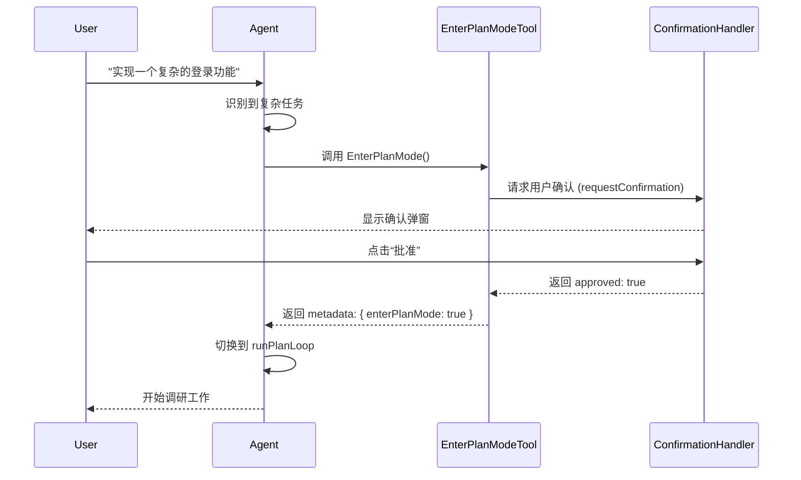
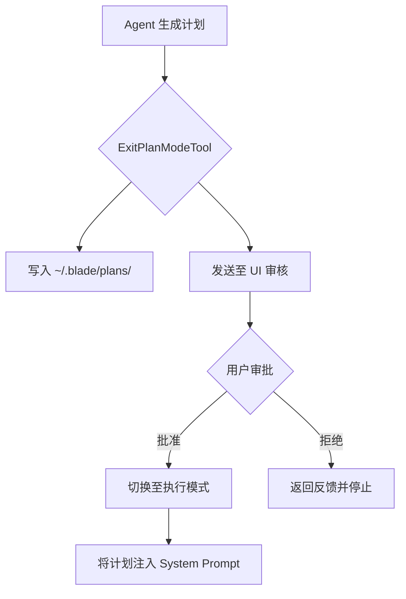

# 规划模式与任务拆解

## 目录
1. [模块概览](#模块概览)
2. [规划模式简介](#规划模式简介)
3. [核心组件](#核心组件)
   - [EnterPlanModeTool：开启规划](#enterplanmodetool开启规划)
   - [ExitPlanModeTool：提交方案](#exitplanmodetool提交方案)
4. [架构设计与工作流](#架构设计与工作流)
   - [模式切换机制](#模式切换机制)
   - [提示词策略（Prompt Strategy）](#提示词策略prompt-strategy)
5. [任务拆解逻辑](#任务拆解逻辑)
   - [从指令到计划的演变](#从指令到计划的演变)
   - [典型任务拆解示例](#典型任务拆解示例)
6. [计划的持久化与展示](#计划的持久化与展示)
7. [与执行阶段的衔接](#与执行阶段的衔接)
8. [文件引用](#文件引用)

## 模块概览

规划模式（Plan Mode）是 Blade 处理复杂工程任务的核心机制。它通过将任务分为“调研规划”和“执行实施”两个阶段，确保 Agent 在面对大型变更或模糊指令时，能够先进行深入的代码库探索和方案设计，而非盲目修改代码。

**模块统计：**
- **总文件数**：3 个 TypeScript 文件
- **核心目录**：`packages/cli/src/tools/builtin/plan/`
- **主要子模块**：
  - `EnterPlanModeTool.ts`：负责进入规划模式的工具逻辑。
  - `ExitPlanModeTool.ts`：负责退出规划模式并提交方案的工具逻辑。
  - `index.ts`：工具导出入口。

本章节将深入探讨规划模式的触发机制、Agent 在此模式下的行为差异、以及方案如何转化为后续的执行依据。

## 规划模式简介

在普通模式下，Agent 倾向于直接执行用户指令（如修改文件、运行命令）。然而，对于涉及多个文件、需要架构决策或需求模糊的任务，这种“边做边想”的模式容易导致错误或低效的重构。

**规划模式的设计目标：**
1. **强制调研**：限制 Agent 仅能使用只读工具（Read, Glob, Grep 等），防止在未完全理解代码前进行修改。
2. **结构化思考**：引导 Agent 遵循“探索 -> 设计 -> 评审 -> 呈现”的思维路径。
3. **用户确认**：方案必须经过用户审核，确保实施路径符合预期。

> **💡 提示**：规划模式本质上是一个“只读沙盒”，它通过权限控制和系统提示词的改变，将 Agent 的角色从“程序员”转变为“架构师”。

## 核心组件

规划模式的生命周期由两个关键工具控制。

### EnterPlanModeTool：开启规划

`EnterPlanModeTool` 是 Agent 决定进入规划阶段的入口。它不接受任何参数，其核心逻辑在于触发 UI 的确认流程。

```typescript
// packages/cli/src/tools/builtin/plan/EnterPlanModeTool.ts

export const enterPlanModeTool = createTool({
  name: 'EnterPlanMode',
  displayName: 'Enter Plan Mode',
  kind: ToolKind.ReadOnly,
  // ...
  async execute(_params, context): Promise<ToolResult> {
    if (context.confirmationHandler) {
      const response = await context.confirmationHandler.requestConfirmation({
        type: 'enterPlanMode',
        message: '助手建议先制定实施方案再执行。',
        details: '规划模式下仅使用只读工具进行调研，完成后提交方案供审核。',
      });

      if (response.approved) {
        return {
          success: true,
          llmContent: '[OK] User approved entering Plan mode.\n\nYou are now in PLAN MODE...',
          metadata: { approved: true, enterPlanMode: true },
        };
      }
      // ... 处理拒绝逻辑
    }
  }
});
```

**Section sources**:
- [EnterPlanModeTool.ts](file:///Users/bytedance/Documents/GitHub/Blade/packages/cli/src/tools/builtin/plan/EnterPlanModeTool.ts)

### ExitPlanModeTool：提交方案

当 Agent 完成调研并准备好实施方案后，必须调用 `ExitPlanModeTool`。该工具要求传入一个 Markdown 格式的完整计划。

```typescript
// packages/cli/src/tools/builtin/plan/ExitPlanModeTool.ts

export const exitPlanModeTool = createTool({
  name: 'ExitPlanMode',
  schema: z.object({
    plan: z.string().describe('The complete implementation plan in markdown format'),
  }),
  async execute(params, context): Promise<ToolResult> {
    const planContent = params.plan || '';
    // 持久化方案到本地文件
    if (planContent && context.sessionId) {
      const planPath = path.join(homedir(), '.blade', 'plans', `plan_${context.sessionId}.md`);
      await fs.writeFile(planPath, planContent, 'utf-8');
    }

    if (context.confirmationHandler) {
      const response = await context.confirmationHandler.requestConfirmation({
        type: 'exitPlanMode',
        planContent: planContent,
        // ...
      });
      // ...
    }
  }
});
```

**Section sources**:
- [ExitPlanModeTool.ts](file:///Users/bytedance/Documents/GitHub/Blade/packages/cli/src/tools/builtin/plan/ExitPlanModeTool.ts)

## 架构设计与工作流

规划模式的运作依赖于 Agent 状态机的切换和提示词的动态注入。

### 模式切换机制

当 `EnterPlanModeTool` 返回 `enterPlanMode: true` 的元数据时，Agent 的主循环会捕获此信号并切换到 `runPlanLoop`。

以下序列图展示了从用户指令到进入规划模式的完整流程：



在 `runPlanLoop` 中，Agent 会被配置为 `PermissionMode.PLAN`，这意味着所有具有副作用的工具（如 `Edit`, `Write`, `Bash`）都将被权限系统拦截。

### 提示词策略（Prompt Strategy）

规划模式通过两种方式改变 Agent 的行为：
1. **系统提示词替换**：使用 `PLAN_MODE_SYSTEM_PROMPT` 替换默认提示词。该提示词强调“只读探索”、“阶段性检查点”和“未来的计划格式”。
2. **实时提醒（System Reminder）**：在每一轮用户消息前注入一个 `<system-reminder>`，时刻提醒 Agent 当前处于只读状态。

```typescript
// packages/cli/src/prompts/default.ts
export function createPlanModeReminder(userMessage: string): string {
  return (
    `<system-reminder>Plan mode is active. You MUST NOT make any file changes... Research only, then call ExitPlanMode with your plan.</system-reminder>\n\n` +
    userMessage
  );
}
```

**Section sources**:
- [Agent.ts](file:///Users/bytedance/Documents/GitHub/Blade/packages/cli/src/agent/Agent.ts)
- [default.ts](file:///Users/bytedance/Documents/GitHub/Blade/packages/cli/src/prompts/default.ts)

## 任务拆解逻辑

规划模式的核心在于将模糊的意图转化为可执行的步骤。Agent 被要求在最终计划中包含：摘要、当前状态、实施步骤、测试方法和风险评估。

### 从指令到计划的演变

Agent 在规划模式下遵循以下思维模型：
- **探索 (Explore)**：使用 `Glob` 和 `Grep` 确定受影响的代码范围。
- **分析 (Analyze)**：读取关键文件，理解现有逻辑和模式。
- **设计 (Design)**：构思修改方案，考虑多个候选路径。
- **验证 (Verify)**：通过进一步读取相关文件验证方案的可行性。

### 典型任务拆解示例

以下是一个典型的任务拆解过程，展示了 Agent 如何将高层指令转化为结构化计划：

| 阶段 | 输入/状态 | Agent 行为 | 输出/结果 |
| :--- | :--- | :--- | :--- |
| **初始指令** | "实现一个登录功能" | 识别到涉及数据库、中间件、前端组件 | 调用 `EnterPlanMode` |
| **调研阶段** | 权限模式: PLAN | 搜索 `auth`, `user`, `middleware` 目录 | 确定 `src/auth/` 为核心目录 |
| **方案设计** | 已读 `auth.ts`, `user.model.ts` | 决定使用 JWT 方案，复用现有的 `UserService` | 内部构思实施步骤 |
| **提交计划** | 调用 `ExitPlanMode` | 整理 Markdown 格式的完整方案 | 生成包含 5 个步骤的计划书 |

**计划书（示例片段）：**
1. 在 `src/auth/` 下创建 `login.service.ts` 处理登录逻辑。
2. 更新 `src/middleware/auth.ts` 以支持新的 JWT 校验。
3. ... (后续步骤)

**Section sources**:
- [PLAN_MODE_SYSTEM_PROMPT](file:///Users/bytedance/Documents/GitHub/Blade/packages/cli/src/prompts/default.ts#L119)

## 计划的持久化与展示

为了确保计划的可靠性，Blade 采取了以下措施：
1. **本地存储**：`ExitPlanModeTool` 会将计划保存到 `~/.blade/plans/plan_${sessionId}.md`。即使会话中断，方案也不会丢失。
2. **UI 渲染**：计划内容会传递给 `ConfirmationHandler`，在终端或 Web UI 中以 Markdown 形式美观地展示给用户。
3. **元数据传递**：批准后的计划内容会作为元数据返回给 Agent，作为下一阶段执行的上下文。



## 与执行阶段的衔接

一旦用户批准了方案，Agent 会发生以下关键转变：
1. **权限提权**：从 `PermissionMode.PLAN` 切换到用户指定的模式（通常是 `DEFAULT` 或 `AUTO_EDIT`）。
2. **上下文增强**：Agent 的主循环会将已批准的计划以 `<approved-plan>` 标签注入到下一轮对话中。
3. **强制执行**：注入的提示词会明确要求 Agent：“按照上述批准的计划执行，严格遵守指定的步骤。”

这种衔接确保了“言行一致”，防止 Agent 在获得执行权限后偏离预定的设计轨道。

## 文件引用

以下是构建规划模式逻辑的关键文件：

- [packages/cli/src/tools/builtin/plan/EnterPlanModeTool.ts](file:///Users/bytedance/Documents/GitHub/Blade/packages/cli/src/tools/builtin/plan/EnterPlanModeTool.ts) - 开启规划模式。
- [packages/cli/src/tools/builtin/plan/ExitPlanModeTool.ts](file:///Users/bytedance/Documents/GitHub/Blade/packages/cli/src/tools/builtin/plan/ExitPlanModeTool.ts) - 提交方案并持久化。
- [packages/cli/src/agent/Agent.ts](file:///Users/bytedance/Documents/GitHub/Blade/packages/cli/src/agent/Agent.ts) - 模式切换核心逻辑。
- [packages/cli/src/prompts/default.ts](file:///Users/bytedance/Documents/GitHub/Blade/packages/cli/src/prompts/default.ts) - 规划模式专用提示词。
- [packages/cli/src/tools/builtin/plan/index.ts](file:///Users/bytedance/Documents/GitHub/Blade/packages/cli/src/tools/builtin/plan/index.ts) - 模块导出。
